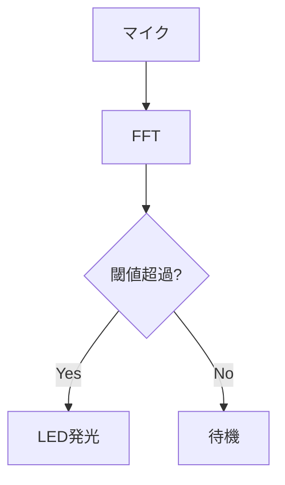

# Zenn 記事執筆スキル

このスキルは、`articles/` 配下に置かれた既存記事の傾向を分析した上で、著者の文体・構成・記法を踏襲した記事を書くためのガイドラインです。新規記事の作成、既存記事のリライト、構成案の提案を行うときに必ず参照してください。

---

## 1. ファイルとフロントマター

### 1.1 ファイル配置

- 新規記事は `articles/` 配下に配置する。
- ファイル名は **14 桁の 16 進数（例: `838cdac8d71e52.md`）** を使う。これは Zenn CLI（`npx zenn new:article`）で生成されるスラッグ形式に倣う。
- 公開前のドラフトは必ず `published: false` のままにする。

### 1.2 フロントマター（必須）

すべての記事の先頭に以下の YAML フロントマターを置く。

```yaml
---
title: "記事タイトル"
emoji: "🚀"
type: "tech" # tech: 技術記事 / idea: アイデア
topics: ["topic1", "topic2", "topic3", "topic4", "topic5"]
published: false
---
```

ルール:

- `type` は `tech`（技術記事）または `idea`（アイデア・ポエム）のどちらか。コメント `# tech: 技術記事 / idea: アイデア` を残してよい。
- `emoji` は記事の主題を象徴するものを 1 つ。アクセシビリティ系は `♿`、Azure / クラウド系は `☁️` `🚀`、M5Stack / IoT 系はデバイスを表す絵文字（`🐱` `🎤` など）、ポエム系は連想の効く絵文字（`💊` `😺` など）。
- `topics` は **小文字または英大文字交じりで 3〜5 個程度**。Zenn のタグに合わせ、`Blazor` `csharp` `dotnet` `azure` `accessibility` `wcag` `a11y` `m5stack` `arduino` `opentelemetry` などを再利用する。新しい技術を扱うときは公式表記に寄せる。
- 公開準備が整うまで `published: false` を維持する。

---

## 2. 記事の構成テンプレート

著者の記事は **「導入 → 動機 / 背景 → 本論（手順 or 章立て）→ 実例 / コード → まとめ」** の流れが定番。`tech` と `idea` で骨格は共通だが、`tech` は手順とコードが厚く、`idea` は経験談・主張・引用が厚い。

### 2.1 技術記事（type: tech）の標準骨格

```markdown
## はじめに
（何の記事か、何を扱うか、誰向けかを 2〜4 段落で。前提知識や関連記事へのリンクもここで触れる）

## 今回のゴール / 本記事の目的
（箇条書きまたは番号付きリストで「この記事を読み終えると何ができる/分かるようになるか」を明示）

## 前提条件
（環境・SDK・サブスクリプションなど。チェックマーク絵文字 ✅ を行頭に置くスタイル）

## 背景 / なぜ◯◯なのか
（課題感、選定理由、前提知識の補足。比較表をよく使う）

## Step 1: ◯◯
## Step 2: ◯◯
## Step 3: ◯◯
（手順系の記事は「Step n:」で見出しを切る。設定ファイル・コマンド・コードを順に提示）

## 動作確認 / デモ
（スクリーンショット、ログ、実行結果など。`/images/xxx.png` を参照）

## ハマりどころ / 注意点
（`:::message alert` で囲んで強調することが多い）

## まとめ / おわりに
（学びの整理、次のステップ、関連記事リンク）
```

### 2.2 アイデア記事 / ポエム（type: idea）の標準骨格

```markdown
## はじめに
（個人的な体験・気づき・問題提起から入る。引用や比喩を効果的に使う）

## ◯◯とは（背景説明）
## 体験 / 観察
## 考察（複数節に分けることが多い）
## 開発者にとっての示唆 / Web への応用
## おわりに
```

`idea` 記事ではテーブルよりも文章主体。ただし比較や整理が必要な箇所では表を使ってよい。

### 2.3 章立てのコツ

- 見出しは `##`（h2）と `###`（h3）を中心に。`####`（h4）は本当に必要なときだけ。
- 1 つの `##` セクション内は **3〜8 段落程度**を目安に、長くなりすぎたら分割する。
- 各セクション末尾に小さなまとめや次への橋渡しを入れると流れがよくなる。

---

## 3. 文体・トーン

### 3.1 基本スタンス

- **丁寧語（です・ます調）が基本**。`idea` 記事や経験談ではときどき体言止め・口語表現を混ぜる。
- 主語に「私」を使う。著者自身の体験・選定理由・思考を一人称で書いて構わない。
- 読者を急かさず、「〜してみてください」「〜と感じませんか？」のように対話的な呼びかけをはさむ。
- 専門用語は **初出時に和訳または英語表記を併記**して読者に親切にする（例: 「アクチュエーションポイント（入力が確定する深さ）」）。

### 3.2 強調・注意喚起

- **太字**（`**...**`）は本当に強調したい単語・フレーズに限定する。1 段落に 1〜2 箇所まで。
- 引用 `>` はガイドライン本文や原典の一文を引くときに使う。出典は引用直後に「— [タイトル](URL)」の形で置くことが多い。

### 3.3 絵文字の使い方（重要）

著者の記事は絵文字を**意図的に**使っている。乱用は避けつつ、以下の場面では積極的に置く。

| 場面 | 例 |
|------|----|
| 段落末尾の感情・トピック表現 | 「在宅勤務でも快適です🏠」 |
| 見出しの飾り | 「## はじめに 🌟」「### 主な特徴 ✨」 |
| テーブルのカテゴリ列 | 「🔐 認証」「💾 永続化」「🎨 UI」 |
| 箇条書きの先頭ラベル | 「- 🛰️ **GPS搭載**: ...」 |
| 比較・対照を視覚化 | 🟢 / 🔴、✅ / ⚠️ / ❌ |

ガイドライン:

- 1 段落あたり絵文字は **末尾に 1〜2 個**まで。文中に詰め込まない。
- 絵文字は内容と関連するものを選ぶ（無関係な絵文字は使わない）。
- `idea` 系の重い話題（健康・障害・社会課題）では絵文字の頻度をやや下げて、トーンを落ち着かせる。

---

## 4. Markdown 記法（Zenn 拡張を含む）

### 4.1 Zenn のメッセージブロック

```markdown
:::message
補足情報、Tips、注意点（中立的）
:::

:::message alert
強い注意、警告、義務化されたルールなど
:::
```

積極的に使うが、1 セクションに 2 個までを目安に。

### 4.2 コードブロック

- 必ず**言語名を付ける**（` ```csharp `、` ```powershell `、` ```json `、` ```yaml `、` ```cpp `、` ```diff ` など）。
- 差分を示すときは ` ```diff ` で `+` / `-` を活用する（`.NET` バージョン更新の例など）。
- ターミナルコマンドは `pwsh` / `powershell` / `bash` を内容に応じて選ぶ。Windows 環境前提なら `pwsh` を優先。

### 4.3 表（テーブル）

比較・対照・スペック表として頻繁に使う。**カテゴリ列の頭に絵文字を置く**スタイルが定番。

```markdown
| 項目 | 値 | 説明 |
|------|----|------|
| 🚨 アラート | 0 | アクティブ件数 |
| 🪙 トークン使用量 | 293.9K | 最大消費モデル |
```

### 4.4 Mermaid 図

アーキテクチャ図、フロー、状態遷移は Mermaid で描く。

````markdown

````

`flowchart`、`sequenceDiagram`、`stateDiagram-v2` などをよく使う。

### 4.5 画像

- リポジトリの `images/` 配下に置き、`` で参照する（先頭スラッシュ）。
- アクセシビリティの観点から **alt テキストを必ず書く**。意味のある説明にする。

### 4.6 リンク

- 外部リンクは Markdown の `[テキスト](URL)` を用いる。Zenn の URL カード（裸 URL を行頭単独に置く）も `https://www.amazon.co.jp/...` のような商品紹介で使う。
- 関連する自分の過去記事（Zenn / Qiita）にも積極的にリンクする。シリーズ性を出すため。

---

## 5. Microsoft Learn など外部ドキュメント引用ルール

### 5.1 MVP トラッキングパラメータ

著者は Microsoft MVP のため、**`learn.microsoft.com` および `docs.microsoft.com`、`techcommunity.microsoft.com`、`devblogs.microsoft.com` へのリンクには `WT.mc_id=DT-MVP-5004827` を必ず付与する**。

例:

```markdown
[Microsoft Agent Framework Overview](https://learn.microsoft.com/agent-framework/overview/agent-framework-overview?WT.mc_id=DT-MVP-5004827)
```

ルール:

- 既にクエリ文字列がある場合は `&WT.mc_id=DT-MVP-5004827` を末尾に追加する。
- フラグメント `#xxx` がある場合は **クエリ → フラグメント** の順序を守る（例: `?...&WT.mc_id=DT-MVP-5004827#aspnet-core`）。
- `support.microsoft.com` や `microsoft.com/ja-jp/...` のマーケティング系ページには付けない（Learn / Docs / DevBlogs / TechCommunity 系のみ）。
- Microsoft 以外の公式サイト（W3C、GitHub、各種 OSS）には付けない。

### 5.2 引用スタイル

- 公式ドキュメントから事実を引くときは、**一次情報（Microsoft Learn、W3C、GitHub リポジトリの該当ファイルなど）**を優先する。
- 仕様や数値（バージョン、サンプル数、ダウンロード数など）を記述する場合は、出典を本文または脚注的に明示する。
- 古い情報や憶測を断定的に書かない。「執筆時点では」「公式ドキュメントでは〜と説明されています」のように出典を意識した書き方にする。

---

## 6. よく扱うテーマ別の留意点

### 6.1 .NET / Blazor / Azure

- バージョン番号と SDK バージョンを明記する（例: `.NET 10`、`Microsoft.FluentUI.AspNetCore.Components` v5）。
- `dotnet` CLI コマンドはコピペで動く粒度で書く。
- アーキテクチャ図（Blazor Server vs WebAssembly、Aspire の構成など）には Mermaid を使う。
- 公式ドキュメントへのリンクには **必ず `WT.mc_id=DT-MVP-5004827` を付与する**。

### 6.2 アクセシビリティ（WCAG / a11y）

- WCAG 達成基準は **番号と原文（または公式日本語訳）を引用**し、`>` ブロックの直後に出典 URL を添える（W3C なので MVP パラメータは付けない）。
- 「自動テストでは 30〜40% しか検出できない」など、**自動 / 手動の限界を明確に説明**する。
- 当事者性のある体験談（怪我・加齢・一時的障害など）を交え、「誰もが当事者になりうる」視点を保つ。
- 重い話題ではトーンを落ち着かせ、絵文字を減らし気味にする。
- 法的根拠（障害者差別解消法、JIS X 8341-3 など）を言及する場合は条文・施行日を正確に書く。

### 6.3 M5Stack / IoT / 組み込み

- 機材の型番、ピン配置、サンプリング周波数などのスペックを **テーブルで明示**。
- Arduino / C++ コードは `cpp` 言語指定で。
- 信号処理（FFT、ビート検出など）はパイプライン全体を Mermaid 図で示してから細部を解説する。
- 関連シリーズ記事へのリンクを冒頭に置く。

### 6.4 アイデア / ポエム / 個人エントリ

- フィクション作品・映画・書籍をモチーフにするときは作品情報（制作年、作者・監督、出版社など）を正確に書く。
- 私的な体験を主軸にしつつ、最後は **開発者・読者にとっての示唆** に着地させる。
- 商品紹介系（買ってよかったもの）は Amazon リンク（生 URL の URL カード）→ 購入経緯 → 選んだ理由 → 実際の使用感 → 仕事 / 趣味への影響、の順で書くとまとまる。

---

## 7. 執筆チェックリスト

記事を書き終えたら以下を確認する。

- [ ] フロントマターの `title` / `emoji` / `type` / `topics` / `published: false` が揃っている
- [ ] `## はじめに` と `## おわりに`（または `## まとめ`）がある
- [ ] 見出し階層が `##` → `###` の順に整理されている（`#` は使わない、または h1 をタイトルに揃えるなら 1 つだけ）
- [ ] コードブロックすべてに言語名が付いている
- [ ] 画像に意味のある alt テキストが付いている
- [ ] Microsoft Learn / Docs / DevBlogs / TechCommunity へのリンクに `WT.mc_id=DT-MVP-5004827` が付いている
- [ ] 引用ブロック `>` には出典が添えてある
- [ ] `:::message` / `:::message alert` の使いすぎがない
- [ ] テーブルのカテゴリ列に絵文字が付いて視認性が高い
- [ ] 絵文字が 1 段落あたり 1〜2 個以内に収まっている
- [ ] 専門用語の初出には簡単な補足がある
- [ ] アクセシビリティ系の記事では「自動で潰せる範囲」と「人間判断の領域」が分けて書かれている
- [ ] バージョン情報（.NET / SDK / NuGet パッケージなど）が最新かつ正確
- [ ] 関連する過去記事（Zenn / Qiita）へのリンクが冒頭または末尾にある

---

## 8. 新規記事を作成するときのワークフロー

1. ユーザーから記事のテーマ・対象読者・目安の長さをヒアリングする。
2. `type` が `tech` か `idea` かを決める。
3. ファイル名は 14 桁の 16 進数（例: `crypto.randomBytes(7).toString('hex')` 相当のランダム値）で `articles/xxxxxxxxxxxxxx.md` を作成する。既存ファイル名と被らないこと。
4. フロントマターを記入し、`published: false` のままにする。
5. §2 の骨格に沿って見出しを先に書き、その後に本文を埋める。
6. 図表・コード・引用を §4 §5 のルールで挿入する。
7. §7 のチェックリストで仕上げる。
8. ユーザーに公開可否を確認した上で `published` を切り替える（勝手に `true` にしない）。

---

## 9. やってはいけないこと

- 著者の文体に合わない極端なくだけた表現や、絵文字の乱用（1 段落に 5 個以上など）。
- 出典なしの数値・仕様の断定。
- Microsoft Learn 系リンクへの MVP トラッキングパラメータの付け忘れ。
- 公開記事を勝手に `published: true` に変更すること。
- 既存記事の文体を大幅に塗り替えるリライト（「直し」を依頼されない限り、トーンは保つ）。
- アクセシビリティ・障害に関する話題を軽い扱いにすること。
