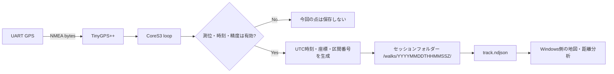

## はじめに

屋外でGPSログを取る処理は、一見すると「一定間隔で緯度・経度を保存する」だけに見えます。しかし実際には、GPSの測位が途切れたり、UTC時刻が更新されなかったり、SDカードへの書き込みが失敗したりします。そうした状態を無視して最後に受け取った座標を何度も保存すると、記録していない区間まで実測したようなログになってしまいます。

私が開発している [WalkLogger](https://github.com/tomokusaba/Yamanote) は、M5Stack CoreS3と外付けUART GPSで街歩きを記録し、SDカードに保存するファームウェアを含むプロジェクトです。本記事では、CoreS3側のコードを題材に、測位データを受け取り、記録可能か判定し、NDJSONとして永続化するまでの設計を追います。

扱う範囲はCoreS3のGPS記録です。WindowsアプリやAndroid版の詳しい構成には踏み込まず、必要な箇所だけデータの受け渡しを説明します。

## 本記事のゴール

- GPSの「有効な測位」をどの条件で判定しているか説明できる
- 周期記録とGPS欠測時の挙動をコードの流れから追える
- UTC時刻、セッションフォルダー、NDJSONの関係を理解できる
- 休止・再開やSDエラーが、記録の意味をどう守るか把握できる

## 前提条件

- ✅ M5Stack CoreS3
- ✅ NMEAを出力するUART GPSモジュール
- ✅ FAT32でフォーマットしたmicroSDカード
- ✅ PlatformIOとArduinoフレームワーク

WalkLoggerの既定設定では、CoreS3のGPIO18をGPS受信、GPIO17をGPS送信に使い、UARTのボーレートは9600です。GPSモジュールのTXをCoreS3のRXへ、GPSのRXをCoreS3のTXへ接続します。受信専用であればGPS側RXは省略できます。電源電圧はGPSモジュールの仕様に従ってください。

:::message alert
UARTの信号電圧とモジュールの電源電圧は別です。READMEでは3.3V UARTを前提としており、5Vの信号をESP32へ直接入力しないよう注意しています。コネクターの色やピン順ではなく、GPSモジュールの仕様書とCoreS3側のピンを確認してください。
:::

## 記録処理の全体像

ファームウェアはGPSのシリアル入力をTinyGPS++へ渡し、一定間隔ごとに「今の測位が記録に使えるか」を判定します。条件を満たした場合だけ、GPS時刻・座標などを1行のJSONとしてSDカードへ追記します。



この設計で重要なのは、**周期が来たことと、記録可能なGPS点があることを別々に扱う**点です。5秒ごとのタイマーが動いていても、毎回必ず1点を保存するわけではありません。

## Step 1: ビルド設定とGPSのUARTを確認する

PlatformIOの設定は [`firmware/platformio.ini`](https://github.com/tomokusaba/Yamanote/blob/main/firmware/platformio.ini) にあります。主な設定は次のとおりです。

```ini
[env:cores3]
platform = espressif32@6.12.0
board = esp32-s3-devkitc-1
framework = arduino
build_flags =
    -DGPS_RX_PIN=18
    -DGPS_TX_PIN=17
    -DGPS_BAUD=9600
    -DLOG_INTERVAL_SECONDS=5
```

`board`の値はPlatformIO上のボードIDで、ファームウェア側ではM5Stack CoreS3のAPIを使っています。GPSのピン、ボーレート、記録間隔をビルドフラグで切り替えられるため、配線やGPSモジュールに応じて変更できます。

記録間隔は設定ファイルだけでなく、`main.cpp`のコンパイル時チェックでも5秒または10秒に制限されています。

```cpp
static_assert(LOG_INTERVAL_SECONDS == 5 || LOG_INTERVAL_SECONDS == 10,
              "Use a 5 or 10 second log interval.");
```

不正な間隔を設定したままファームウェアをビルドできないようにしているため、実行時に想定外のサンプリング間隔で動くリスクを減らせます。

起動時にはUART1を初期化し、メインループで受信バイトをTinyGPS++に渡します。

```cpp
gpsSerial.begin(GPS_BAUD, SERIAL_8N1, GPS_RX_PIN, GPS_TX_PIN);

while (gpsSerial.available()) {
    gps.encode(gpsSerial.read());
}
```

UARTの受信処理は記録間隔とは別にループごとに行います。受信した文を継続的にパーサーへ渡し、記録タイミングが来た時点の測位状態を参照する構成です。

## Step 2: 「有効なGPS点」を複数条件で判定する

座標が一度取得できたことだけをもって、測位が有効とは判断しません。`goodFix()`では位置・日付・時刻・衛星数・HDOP（水平位置の精度指標）を確認しています。

| 判定項目 | 条件 | 意図 |
|---|---:|---|
| 📍 位置 | 有効、更新から2秒未満 | 古い座標を現在の座標として扱わない |
| 🕒 GPS日付・時刻 | 有効、どちらも更新から2秒未満 | 古い時刻のまま新しい点を作らない |
| 📅 年 | 2024年以降 | 想定外に古いGPS日時を拒否する |
| 🛰️ 衛星数 | 4以上 | 最低限の衛星捕捉条件を設ける |
| 🎯 HDOP | 500以下（表示上は5.0以下） | 精度が低すぎる測位を拒否する |

実装の核は次のとおりです。

```cpp
bool goodFix() {
    return gps.location.isValid() && gps.location.age() < 2000 &&
           gps.date.isValid() && gps.date.age() < 2000 && gps.date.year() >= 2024 &&
           gps.time.isValid() && gps.time.age() < 2000 &&
           gps.satellites.isValid() && gps.satellites.value() >= 4 &&
           gps.hdop.isValid() && gps.hdop.value() <= 500;
}
```

TinyGPS++から得たデータは、値が有効かどうかだけでなく更新時刻も確認しています。たとえばGPSの受信が止まったあとも、最後の位置がメモリーに残っていることがあります。`isValid()`だけで判定すると、その古い値を新しいサンプルとして保存しかねません。`age() < 2000`を組み合わせることで、2秒以上更新されていない位置や時刻を記録対象から外します。

HDOPはREADMEに記載された運用条件では5以下です。コードでは`gps.hdop.value()`を500以下として比較し、画面表示では`gps.hdop.hdop()`を小数値で表示します。

## Step 3: 周期タイマーと測位判定を分離する

メインループでは`millis()`による経過時間を使い、指定した間隔に達したら`logPoint()`を呼び出します。

```cpp
if (recording && millis() - lastLogMillis >= LOG_INTERVAL_SECONDS * 1000) {
    lastLogMillis = millis();
    logPoint();
}
```

`loop()`の実行回数でサンプリングするのではなく、経過時間で判定するため、画面更新などでループの周回時間が多少変わっても、記録周期を5秒または10秒に保ちやすくなります。`lastLogMillis`は32ビットの符号なし値で、現在値との差分を比較しています。

START操作も単純な状態切り替えではありません。BLE同期中なら記録開始を拒否し、SDカードが利用可能であることと、開始時点で`goodFix()`を満たすことを確認します。衛星を捕捉していない状態のまま記録を始めるのではなく、最初の測位が有効になってから開始する設計です。記録開始後に測位が失われた場合は、次の周期でその点だけを保存しません。

STARTを受け付けると、実装は`lastLogMillis`を現在時刻から1周期分だけ過去に設定します。その後、同じ`loop()`内で周期判定に進むため、最初の`logPoint()`は次の5秒／10秒を待たずに試行されます。ただし、セッションフォルダーの作成やポイントの保存は、その時点でも測位とUTCの条件を通過してからです。

周期が来ても測位が弱い場合、`logPoint()`はその点を保存せずに戻ります。

```cpp
void logPoint() {
    if (!goodFix()) {
        message = "GPS missing / weak; not logging";
        return;
    }
    // 有効なGPS点だけを保存する
}
```

ここでは最後に受け取った緯度・経度を複製して穴埋めすることはありません。たとえばGPS受信が途切れれば、記録中の状態は維持しつつ、その周期の点だけが欠落します。画面にもGPS欠測・弱い測位で保存しなかったことを表示します。

さらに、UTC時刻が前回の記録時刻以下なら、同じ時刻や逆行した時刻の点を保存しません。距離や並び順を後段で計算するログでは、時刻が単調に進むことも重要なデータ品質条件です。

## Step 4: UTCを使ってセッションを作り、NDJSONへ追記する

記録開始操作の時点では、まだセッションフォルダーは作られません。最初の有効なGPS点を保存する段階で`prepareSession()`が呼ばれ、GPSのUTC時刻から`/walks/YYYYMMDDTHHMMSSZ`形式のフォルダーを作ります。したがって、記録開始後にGPSが有効になるまで待っていても、空のセッションだけが作られることはありません。

トラックの保存先は次のようになります。

```text
/walks/
  20261005T022300Z/
    track.ndjson
    photos.ndjson
    IMG_000001.jpg
```

`track.ndjson`はJSON配列ではなく、**1行に1レコードを置くNDJSON**です。実装では各点をJSONにシリアライズして改行を付け、ファイル末尾へ追記します。

```cpp
StaticJsonDocument<256> doc;
doc["time"] = now;
doc["lat"] = gps.location.lat();
doc["lon"] = gps.location.lng();
doc["speed"] = gps.speed.isValid() ? gps.speed.kmph() : 0;
doc["segment"] = segment;
if (gps.altitude.isValid()) doc["altitude"] = gps.altitude.meters();
```

`time`はGPSの日付・時刻から作ったUTC時刻で、末尾に`Z`を付けます。`speed`はkm/hで、有効な速度情報がない場合は0を記録します。そのため、この値が0であることだけから「停止していた」とは断定できません。`altitude`は有効なときだけ含めます。

追記処理では書き込み後に`flush()`と`close()`を呼びます。ファイルを開けない、または行全体を書き込めない場合はエラーを表示して記録を止めます。途中でSDカードへの書き込みに失敗したのに、画面上だけ記録中のまま進むことを避ける設計です。

また、セッション名は秒単位なので、同じ秒に同名のフォルダーがすでに存在する場合は新しいセッションを作りません。コードはエラーを表示し、記録状態を解除します。READMEが「1秒待つ」と案内しているのはこのためです。

`flush()`と`close()`は各行の書き込み後に実行されますが、このコードだけから電源断時の完全な耐久性までは保証できません。確認できる実装上の事実と、電源断耐性の保証は分けて考える必要があります。

## Step 5: 休止・再開を別区間として記録する

CoreS3のSTART／PAUSE操作では、記録を再開するたびに`segment`をインクリメントします。各トラックポイントにこの値を含めることで、休止前後のデータが同じ区間ではないことを下流へ渡せます。

GPS欠測時には点自体を保存しません。一方、PAUSEしてから再開した場合は`segment`が変わります。Windows側の距離計算を実装する [`WalkAnalysis.Connected`](https://github.com/tomokusaba/Yamanote/blob/main/src/WalkLogger.Domain/Models.cs) は、隣接点の区間番号が同じであることに加え、時刻差が60秒以内、速度が12m/s以下などの条件を確認して点をつなぎます。休止した区間を一本の直線で結んで距離に加算しないための連携です。

ただし、短いGPS欠測があった場合に、欠測直前と復帰直後の点を必ず別区間に分けるわけではありません。ファームウェアは欠測中の点を保存せず、Windows側は区間番号・時刻差・速度のルールで接続可否を判断します。欠測の長さや条件によっては同一セグメント内の隣接点として扱われるため、「欠測が一度でもあれば必ず線が切れる」と理解しないことが大切です。

接続条件をコードで見ると、区間番号が同じであることに加えて、時刻が前進し、点間の時間差が60秒以内で、座標から算出した速度が12m/s以下であることを要求しています。

```csharp
public static bool Connected(TrackPoint a, TrackPoint b) =>
    a.Segment == b.Segment && b.Time > a.Time && (b.Time - a.Time).TotalSeconds <= 60 &&
    DistanceMeters(a.Lat, a.Lon, b.Lat, b.Lon) / (b.Time - a.Time).TotalSeconds <= 12;
```

ここでの速度は、GPSレコードの`speed`値をそのまま使うのではなく、隣り合う座標間の距離と時刻差から計算した値です。

## 写真もGPSの有効性を確認してから保存する

写真撮影にも同じ考え方が適用されています。PHOTO操作は、記録中であること、最新のGPS fixが有効であること、セッションフォルダーがあること、カメラが利用できることを確認します。

撮影画像はJPEG quality 80で変換され、`IMG_000001.jpg`のようなファイル名で保存されます。その後、`photos.ndjson`にGPS UTC時刻・緯度・経度・画像ファイル名を記録します。PHOTO操作時に有効なfixを確認しますが、GPS時刻と座標を読み取るのは画像変換後です。そのため、ソースから確認できるのは写真記録時に有効と判定したGPS状態をメタデータへ保存することまでで、カメラの露光時刻との厳密な同期やJPEGのEXIFへの位置情報埋め込みを意味しません。

カメラの初期化に失敗してもGPS記録自体は利用できます。一方、写真を要求した時点でGPSが有効でなければ、撮影・位置の記録は拒否されます。写真のために古い座標を流用しない点は、トラックログと共通する方針です。

## Step 6: SDカードの共有アクセスを直列化する

ファームウェアでは、SDカード操作を`SdLock`というRAII形式のロックで囲んでいます。通常のメインループからの記録・写真保存に加えて、BLEコールバックからも同じSDカード上のファイルを読み取るためです。

このロックはFreeRTOSのセマフォを取得し、スコープを抜けるとデストラクターで解放します。記録中はBLE同期の開始を拒否する状態制御もありますが、状態の制約だけに頼らず、共有リソースのファイル操作も排他する構成です。

## ハマりどころ / 注意点

| 項目 | 動作 |
|---|---|
| 🛰️ GPSが古い・弱い | 記録中でもその周期の点は保存しない |
| 🕒 UTCが前回以下 | 重複・逆行する時刻の点を保存しない |
| 💾 SDのopen/write失敗 | エラーを表示し、トラック記録を停止する |
| 📷 カメラ初期化失敗 | GPS記録は継続できるが、写真は撮れない |
| 🔁 PAUSE後の再開 | `segment`を変えて別区間にする |
| 📂 同一秒のセッション名 | 既存フォルダーを上書きせず、記録を開始しない |

## ビルドと実機確認

リポジトリのREADMEでは、ファームウェアのビルドに次のコマンドを案内しています。

```powershell
python -m platformio run --project-dir firmware
```

CoreS3へ書き込む場合は、接続したポートに合わせて`COM5`を置き換えます。

```powershell
python -m platformio run --project-dir firmware --target upload --upload-port COM5
python -m platformio device monitor --baud 115200 --port COM5
```

READMEは、実機や実GPSがこのプロジェクトに接続済みであるとはしていません。ビルドできることと、屋外で衛星を捕捉できること、GPSモジュールとの電気的な接続が適切であること、カメラやSDカードが期待どおり動くことは別々に確認する必要があります。特にGPSの型番は固定されていないため、電源・信号電圧・UARTボーレート・NMEA出力を使うモジュールの仕様に合わせてください。

## おわりに

CoreS3でGPSログを安定して扱うには、定期的に座標を保存するだけでは足りません。WalkLoggerでは、位置とUTC時刻の鮮度、衛星数、HDOPを組み合わせて測位を判定し、条件を満たさない周期は記録しません。各点はUTCと区間番号を持つNDJSONとしてSDへ追記し、書き込みに失敗した場合は記録を止めます。

この設計の中心にあるのは、欠けている情報を「それらしく補わない」ことです。GPSを使う記録機器を作るときは、サンプリング周期だけでなく、古い値をどう拒否するか、休止や欠測を後段へどう伝えるか、永続化に失敗したときに何を表示するかまで含めて考える必要があります。

実装の詳細は [firmware/src/main.cpp](https://github.com/tomokusaba/Yamanote/blob/main/firmware/src/main.cpp)、設定は [firmware/platformio.ini](https://github.com/tomokusaba/Yamanote/blob/main/firmware/platformio.ini)、区間判定は [WalkLogger.Domain/Models.cs](https://github.com/tomokusaba/Yamanote/blob/main/src/WalkLogger.Domain/Models.cs)、前提条件や接続上の注意は [README.md](https://github.com/tomokusaba/Yamanote/blob/main/README.md) を参照してください。
