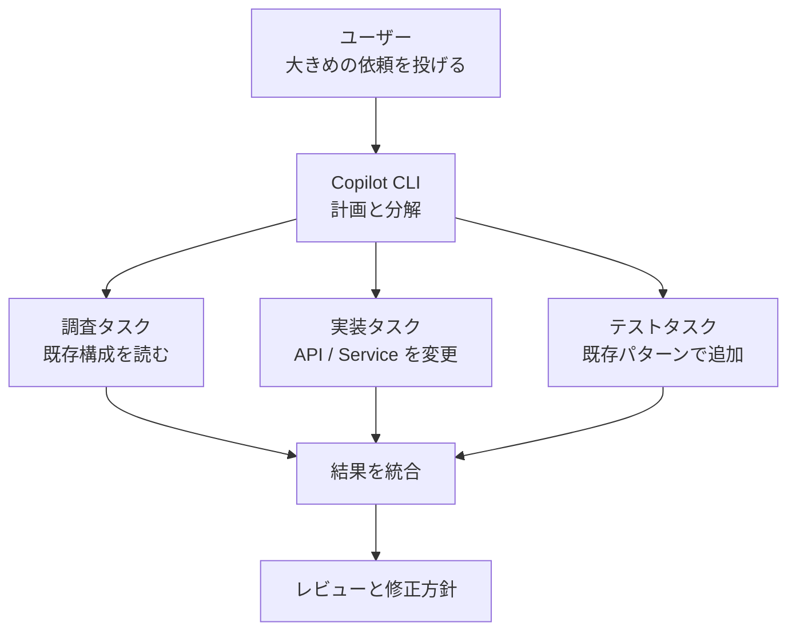
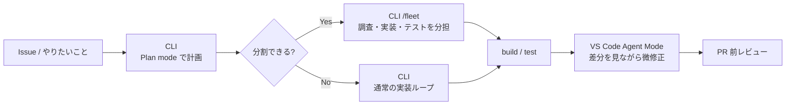

## はじめに

ここ最近、GitHub Copilot CLI と VS Code Agent Mode を行き来しながら使うなかで、少し自分の中の重心が変わってきました。

以前は「大きく作るなら CLI、細かく直すなら Agent Mode」という作業粒度で考えていました。この考え方は今でも有効です。実際、細かい修正や差分の目視確認では、VS Code Agent Mode は気持ちよく使えます。

一方で最近は、**「作業の入口をどこに置くか」** という観点で、GitHub Copilot CLI を先に考えることが増えてきました。理由は、コードを書けるかどうかだけではありません。エージェントの管理、計画、並列化、実行環境への乗せやすさといった、**作業を進めるための足場**が CLI 側に揃ってきていると感じるからです。🛠️

本記事は、次の関連記事の続きとしても読める位置づけです。

- [C# 開発者のための GitHub Copilot CLI と VS Code Agent Mode の使い分け](https://zenn.dev/tomokusaba/articles/838cdac8d71e52)
- [カスタムエージェントの呼び出し方で考える Copilot CLI と VS Code Agent Mode](https://zenn.dev/tomokusaba/articles/31e31c57cb051d)
- [GitHub Copilot CLI で考える複数エージェント設計](https://zenn.dev/tomokusaba/articles/a599cb645ca2c5)
- [Custom Agents と Subagents で始める自律オーケストレーション入門](https://zenn.dev/tomokusaba/articles/8d9f4b3cdd996e)

上の記事では、作業粒度・呼び出し方・複数エージェント設計をそれぞれ整理しました。今回はそこから一歩引いて、**なぜ最近「まず CLI から始める」発想になってきたのか**を体験ベースでまとめます。

| 記事 | 主に扱ったこと |
|------|----------------|
| 🧭 使い分け記事 | 作業粒度ごとの CLI / Agent Mode の選び方 |
| 🎭 カスタムエージェント記事 | 呼び出し方と実行環境の違い |
| 🧩 複数エージェント設計記事 | レビューや改善を安全に分担する考え方 |
| 🪄 自律オーケストレーション記事 | Custom Agents / Subagents による役割分担 |
| 🛠️ 本記事 | 大きめの作業を始めるとき、なぜ CLI を入口にしたくなるか |

:::message
本記事は、GitHub Copilot CLI と VS Code Agent Mode の優劣を決める記事ではありません。どちらも使います。そのうえで、少し大きめの作業の初動を CLI に寄せたくなる理由を整理します。
:::

## 本記事のゴール

この記事では、次のことを整理します。

- GitHub Copilot CLI を「大きめの作業の入口」にしやすい理由を説明する
- VS Code Agent Mode が今でも向いている場面を切り分ける
- どちらを先に開くか迷ったときの判断軸を持つ
- 実際のワークフロー例から、CLI → Agent Mode のつなぎ方をイメージできるようにする

読み終えたときに、読者の方が **「次の少し大きめの作業は、まず CLI で始めてみようかな」** と思える状態を目指します。

## 背景: 「作業粒度」だけでは足りなくなってきた

以前の私は、次のように使い分けていました。

| 作業の粒度 | 使うもの | 理由 |
|------------|----------|------|
| 🏗️ 新機能追加・複数ファイル変更 | GitHub Copilot CLI | リポジトリ全体を面で扱いやすい |
| ✏️ 1 ファイル・数行の修正 | VS Code Agent Mode | エディター上で差分を見ながら直しやすい |
| 🧐 PR 前の微修正 | VS Code Agent Mode | 目視確認と相性がよい |

この整理は今でも大きくは変わりません。Agent Mode は、開いているファイルや選択範囲を起点に「ここだけ直して」と頼む体験が強いです。差分を VS Code 上で見ながら承認できるので、安心感もあります。

ただ、作業が少し大きくなると、考えるべきことは「どのファイルを直すか」だけではなくなります。

- 先に計画を立てるか
- 調査と実装を分けるか
- 複数の独立タスクを並列に回すか
- どのエージェントにどこまで任せるか
- コマンド実行やテストをどのタイミングで挟むか
- 最後にレビューをどう通すか

つまり、実装そのものよりも **「作業をどう進行管理するか」** が重要になってきます。ここで、私は CLI の良さを以前より強く感じるようになりました。

## CLI を入口にしやすい理由: 作業を「始めて、進める場所」として強い

GitHub Copilot CLI の良さは、単にターミナルで動くことではありません。私が便利だと感じているのは、**作業の開始から完了までを 1 つの流れとして扱いやすい**ことです。

### 1. 入口がターミナルなので、作業単位が自然に大きくなる

VS Code Agent Mode では、どうしても「今開いているファイル」「選択中の範囲」「表示されている Problems」から発想しがちです。これは小さな修正では強みですが、作業の初動では視野が狭くなることもあります。

一方、CLI はリポジトリのルートで起動します。最初からターミナル上で、

```pwsh
cd C:\src\MyProduct
copilot
```

のように始めるので、思考の単位が「このファイル」ではなく **「このリポジトリで何を進めるか」** になりやすいです。

たとえば、次のような依頼は CLI から投げる方が自然です。

```text
ユーザー検索機能を追加したいです。
まず既存の API / Service / Repository / Test の構成を調べ、
実装計画を出してから、必要なファイルを横断して変更してください。
最後に build と test を実行し、失敗があれば原因を整理してください。
```

この依頼は、単なる「コード修正」ではありません。調査、計画、実装、テスト、失敗時の再試行までを含む作業です。こうした複数段階の仕事は、ターミナルの中で流れを持って進められる CLI と相性がよいと感じます。だからこそ、作業の途中で呼ぶ道具というより、最初の入口に置きやすいのです。

### 2. Plan mode から実行ループへつなげやすい

大きめの作業で怖いのは、エージェントが意図を少し誤解したまま、複数ファイルを一気に書き換えてしまうことです。

GitHub Copilot CLI には、実装に入る前に計画を立てるための Plan mode があります。公式ドキュメントでも、対話モードで Plan mode を使うと、変更前に計画を確認できると説明されています。

もちろん、VS Code Agent Mode にも Plan mode はあります。ここで言いたいのは「CLI だけが計画できる」という話ではありません。私が CLI を入口にしやすいと感じるのは、**計画を確認したあと、そのまま同じターミナル上で実装、build / test、git の確認までつなげやすい**からです。

私の使い方としては、最初に次のような形で投げることが多いです。

```text
Shift+Tab で Plan mode に切り替えるか、/plan を使って、
まず実装計画を作ってください。
このリポジトリに検索 API を追加する場合の変更対象、
実装順、テスト方針、リスクを整理してください。
まだファイルは変更しないでください。
```

ここで得られた計画を確認してから実装に進むと、作業のブレが減ります。VS Code 側でも同じように Plan mode や Planner エージェントを使えますが、CLI は **計画から実行・検証までをターミナル上の 1 本の流れにしやすい** のが気軽です。入口で誤解を減らし、そのまま実行ループへ移れることが、大きめの作業で CLI を先に開きたくなる理由です。

### 3. `/fleet` で「分けて進める」発想に切り替えやすい

複雑な作業では、1 体のエージェントにすべてを詰め込むより、独立したサブタスクに分けた方がうまくいくことがあります。

GitHub Copilot CLI の `/fleet` は、複雑なリクエストを小さなタスクに分解し、サブエージェントで並列に進めるための仕組みとして説明されています。すべての作業で使うものではありませんが、調査・実装・テスト・ドキュメントのように分けやすい作業では魅力的です。

ここでは `/fleet` の仕組みそのものよりも、**初動の時点で「分けて進める」前提に切り替えられる**点に注目します。イメージとしては、次のような流れです。



ここで大事なのは、単に「速くなる」ことだけではありません。サブタスクごとにコンテキストが分かれることで、調査で読んだ大量の情報を、実装側にすべて混ぜなくて済みます。結果だけを統合する形に近づくので、作業の見通しがよくなります。

:::message alert
`/fleet` のような並列ワークフローは、通常より多くの LLM 呼び出しやトークンを使う可能性があります。公式の使用制限（usage limits）関連ドキュメントでも、使用量が制限に近い場合は parallel workflows（並列ワークフロー）を減らすことが推奨されています。便利だから毎回使うのではなく、並列化する価値がある作業に絞るのがよさそうです。
:::

### 4. コマンド実行と確認のループが途切れにくい

CLI の大きな魅力は、ターミナルの中で作業が完結することです。

```pwsh
dotnet build
dotnet test
git status
git diff
```

こうしたコマンドは、開発者がもともと作業の節目で実行するものです。Copilot CLI はその同じ場所にいるので、エージェントとの会話、コマンド実行、ログ確認、次の修正依頼がつながります。

Agent Mode でも統合ターミナルを使えますが、私の体感では、「チャット」「エディター」「ターミナル」の間で視線が行き来します。小さい修正ではそれが便利です。一方、長めの実装ループでは、ターミナルだけで完結する CLI の方が集中しやすい場面があります。作業の初動から検証まで同じ場所に置けることが、CLI の強さです。

### 5. IDE の外に持ち出しやすい

CLI は、VS Code を開いているときだけの道具ではありません。サポート対象の OS や、インストール方法ごとの前提条件を満たすターミナル環境で使えるため、ローカルだけでなく、権限やトークン、実行環境を適切に設計すれば、スクリプトや CI 的なワークフローでも programmatic interface と組み合わせて利用できます。SSH 先や Dev Container / Codespaces での利用は、環境要件を満たす場合の実践例として考えるとよさそうです。

さらに、公式ドキュメントでは `-p` / `--prompt` を使った programmatic interface（プログラムからの利用）や、autopilot のような自律実行に関する説明もあります。ここは権限設計に注意が必要ですが、**「人が VS Code を見ている前提」から離れられる**のは CLI ならではです。

たとえば、次のような使い方が見えてきます。

| 場面 | CLI で嬉しいこと |
|------|------------------|
| 🛰️ SSH 先での調査 | IDE を開かずにリポジトリを調べられる |
| 🐳 コンテナ内の作業 | 実行環境と同じ場所でコマンドを回せる |
| 🔁 リリース前の一括確認 | build / test / lint の結果を見ながら修正できる |
| 🧪 CI 的な試行 | 使い捨て環境で自律実行を試しやすい |

:::message alert
`--allow-all-tools`、全権限を許可する `--allow-all` / `--yolo`、および autopilot を組み合わせた自律実行は強力ですが、付与する権限も広くなります。使い捨てワークスペース、最小権限のトークン、`--allow-tool` による許可範囲の絞り込みなど、安全側の運用を前提にした方がよいです。
:::

ここまで IDE の外へ持ち出す話も含めて整理しましたが、まずは日常のローカル開発でどう使うかに絞って、実際の流れを見ていきます。

## Agent Mode が向く場面: 「見ながら直す」強さは変わらない

ここまで CLI 寄りに書いてきましたが、VS Code Agent Mode の価値が下がったわけではありません。むしろ、役割がはっきりしてきたという感覚です。もちろん、最初から Agent Mode で始めた方がよい小さな作業もあります。Agent Mode の詳細な使い分けは既存記事で扱ったため、本記事では **CLI で始めた作業を仕上げる場面** に絞って整理します。

Agent Mode が強いのは、**人間が目で確認しながら、狭い範囲を確実に直したい場面**です。

| 作業 | Agent Mode が向く理由 |
|------|----------------------|
| 🐛 1 メソッドのバグ修正 | 選択範囲をそのまま文脈にできる |
| 📝 XML コメント追加 | 差分を見ながら表現を調整しやすい |
| 🎨 UI / Razor の微調整 | 見た目や周辺コードを確認しながら直せる |
| 🧐 PR 前の差分確認 | エディター上の diff と相性がよい |
| 🧪 小さなテスト追加 | 対象クラスを開いたまま依頼できる |

たとえば、CLI で機能の骨格を作ったあと、VS Code に戻って次のように頼むのはとても自然です。

```text
この差分を PR に出す前提で確認してください。
命名、null 許容、XML コメント、テスト名の読みやすさを中心に、
1 ファイルずつ小さく修正してください。
```

ここでは、CLI のように大きく動いてほしいわけではありません。むしろ、差分を見ながら人間が「ここは直す」「ここはそのままにする」と判断したい場面です。こうしたときは Agent Mode の方が安心です。

## 実際のワークフロー例: CLI で始めて Agent Mode で締める

私の中で、最近いちばんしっくりきている流れは次の形です。

既存記事では「作業粒度でどちらを選ぶか」を整理しました。ここではもう少し実践寄りに、初動から仕上げまでを 1 本の流れとして見ていきます。



具体例として、ASP.NET Core の検索 API を追加する場合を考えます。題材自体は既存の使い分け記事でも触れていますが、ここでは **「どのファイルを直すか」ではなく「どこを入口にして作業を進めるか」** の観点で分解します。

### Step 1: CLI で計画する

まずはリポジトリルートで CLI を開きます。

```pwsh
cd C:\src\MyProduct
copilot
```

最初の依頼は、実装ではなく計画に寄せます。

```text
Shift+Tab で Plan mode に切り替えるか、/plan を使って、
まず実装計画を作ってください。
既存の API / Service / Repository / Test の構成を調べ、
ユーザー検索 API を追加するための変更対象、実装順、テスト方針、
リスクを整理してください。まだファイルは変更しないでください。
```

ここで計画を確認し、必要なら「Repository は既存方針に合わせて `ToListAsync` で」「検索条件は部分一致のみ」など、人間側の判断を加えます。

### Step 2: CLI で実装とテストのループを回す

計画に納得できたら、CLI に実装を任せます。

```text
上記の計画に従って実装してください。
実装後に dotnet build と dotnet test を実行し、
失敗した場合は原因を整理してから修正してください。
```

サブタスクが独立しているなら、ここで `/fleet` を検討します。

```text
/fleet
ユーザー検索 API の追加を、既存構成調査、API / Service 実装、
ユニットテスト追加、ドキュメント更新に分けて進めてください。
最後に全体の差分を統合し、build と test の結果をまとめてください。
```

もちろん、毎回 `/fleet` にする必要はありません。1 つのエージェントで十分に追える規模なら、通常の実装ループの方がシンプルです。

### Step 3: VS Code Agent Mode で差分を整える

build / test が成功したら、VS Code に戻って差分を眺めます。

ここからは Agent Mode の出番です。

```text
この差分を PR に出す前提で、1 ファイルずつ確認してください。
大きな設計変更はせず、命名、コメント、テスト名、冗長な実装だけを
小さく整えてください。
```

この段階では、私はエージェントに「もう一度大きく作り直してほしい」とは思っていません。目的は、人間がレビューしやすい差分に整えることです。だからこそ、エディター上で確認しながら進められる Agent Mode が向いています。

## 最初にどちらを開くかの判断表

最後に、私の判断基準をまとめます。

| 質問 | Yes なら | No なら |
|------|----------|---------|
| 🏗️ 複数ファイル・複数ステップの作業か | CLI から始める | Agent Mode で十分かも |
| 🧭 計画から build / test まで一気に流したいか | CLI の Plan mode から始める | Agent Mode の Plan mode でも十分 |
| 🚀 独立タスクに分解できるか | CLI の `/fleet` を検討 | 通常の CLI 実装ループ |
| 🐚 build / test / git 操作が中心か | CLI が自然 | Agent Mode + 統合ターミナルでも可 |
| 👁️ 1 ファイルずつ差分を見たいか | Agent Mode が向く | CLI で面の作業を続ける |
| 🛰️ VS Code 外の環境で動かすか | CLI が向く | ローカル VS Code でもよい |

単純化すると、私は次のように考えています。

- **作業を設計して進める場所**としては GitHub Copilot CLI
- **差分を見ながら仕上げる場所**としては VS Code Agent Mode

この分け方にしてから、どちらを開くか迷う時間が減りました。

## おわりに

GitHub Copilot CLI は、単に「ターミナル版の Copilot」ではなく、最近の私にとっては **大きめの作業を始めるための作業台** になりつつあります。

Plan mode で計画を確認し、必要なら `/fleet` で独立タスクに分け、ターミナルで build / test / git のループを回します。ここまでを CLI で進めてから、VS Code Agent Mode に戻って差分を目で見ながら整えます。今のところ、この流れがしっくりきています。

もちろん、すべてを CLI に寄せる必要はありません。1 メソッドの修正や PR 前の微調整は、今でも Agent Mode がとても便利です。

ただ、次に少し大きめの作業を始めるときは、まずリポジトリルートで `copilot` と打ってみてください。エディターでファイルを開く前に、ターミナルで計画を立て、作業を分解し、テストまで含めた流れを作ります。そうすると、GitHub Copilot CLI が単なる実装補助ではなく、**作業全体を前に進める相棒**に見えてくるはずです。🛠️

それでは、よい Copilot ライフを！

## 参考リンク

- [About GitHub Copilot CLI - GitHub Docs](https://docs.github.com/en/copilot/concepts/agents/about-copilot-cli)
- [Using GitHub Copilot CLI - GitHub Docs](https://docs.github.com/en/copilot/how-tos/copilot-cli/use-copilot-cli)
- [Running tasks in parallel with the /fleet command - GitHub Docs](https://docs.github.com/en/copilot/concepts/agents/copilot-cli/fleet)
- [Speeding up task completion with the /fleet command - GitHub Docs](https://docs.github.com/en/copilot/how-tos/copilot-cli/speed-up-task-completion)
- [Allowing GitHub Copilot CLI to work autonomously - GitHub Docs](https://docs.github.com/en/copilot/concepts/agents/copilot-cli/autopilot)
- [GitHub Copilot usage limits - GitHub Docs](https://docs.github.com/en/copilot/concepts/usage-limits)
- [Chat in Visual Studio Code - VS Code Docs](https://code.visualstudio.com/docs/copilot/chat/chat-agent-mode)
- [Custom agents in VS Code - VS Code Docs](https://code.visualstudio.com/docs/copilot/customization/custom-agents)
