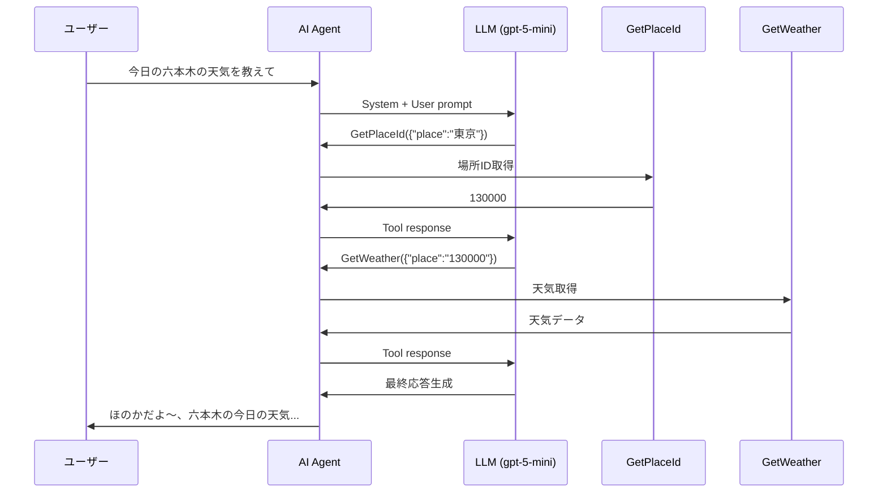

## はじめに

Microsoft Agent Frameworkには**監視のサポート**が組み込まれており、エージェントの動作を監視できます。この記事では、Application Insightsに実際にどのような情報が出力されているのかをデモしながら見ていきます。🎯📊

## 今回のアプリケーション

今回使用するアプリケーションは、Blazorで構築されたチャットアプリケーション「**あぴやチャット**」です。

🔗 **デモサイト**: https://www.musewiki.net/BlazorChat

このアプリケーションでは、AIエージェント「ほのか」がユーザーの質問に答えてくれます。例えば「今日の六本木の天気を教えて」と聞くと、天気情報を返してくれます。🌤️💬

## OpenTelemetryの設定

エージェントの動作を監視するために、OpenTelemetryを設定しています。以下のようなコードで、Azure OpenAI Clientを構成しています。

```csharp
var IChatClient? client = new AzureOpenAIClient(
    endpoint: new Uri(baseUrl),
    credential: new System.ClientModel.ApiKeyCredential(key))
    .GetChatClient(deploymentName)
    .AsIChatClient()
    .AsBuilder()
    .UseOpenTelemetry(sourceName: openTelemetrySourceName, configure: (OpenTelemetryChatClient cfg) => cfg.EnableSensitiveData = true)
    .Build();
```

### ポイント解説 📝

| 設定項目 | 説明 |
|---------|------|
| 🔧 `UseOpenTelemetry` | OpenTelemetryのテレメトリを有効化 |
| 📛 `sourceName` | テレメトリのソース名を指定 |
| ⚠️ `EnableSensitiveData = true` | センシティブなデータ（プロンプト内容など）も出力する設定 |

:::message alert
**注意**: `EnableSensitiveData = true`は、どのような情報がテレメトリに出力されるかを確認するためのテスト目的で設定しています。本番環境では、プライバシーやセキュリティの観点から慎重に検討してください。
:::

## 入力例：天気を聞いてみる 🌈

実際にアプリケーションに以下の入力を行いました：

> **ユーザー入力**: 今日の六本木の天気を教えて

AIエージェント「ほのか」からの応答：

> 了解だよ〜、六本木の今日の天気チェックしてきたよ〜🌂😊
> - **概況**: 午前は雨だけど、昼過ぎから次第にくもり〜その後晴れる見込みだよ〜🌧️
> - **降水確率**: 昼ごろはやや高め（だいたい20%くらい）、夕方以降はほとんど低くなる予想だよ〜🌂☔
> - **気温**: 今はだいたい9℃くらいで、日中は10〜13℃くらいまで上がりそうだよ〜🌡️
> - **風**: 北〜北西の風で、場所によってはやや強まることがあるよ〜🌬️
> - **アドバイス**: 午前中に外出するなら折りたたみ傘があると安心、午後はコートで十分かもだよ〜☂️👕


このようなユーザーとAIエージェント間のやり取りが、OpenTelemetryを通じてApplication Insightsに記録されます。次のセクションでは、実際にどのようなテレメトリデータが収集されているかを見ていきましょう！🔍📈

## Application Insightsの概要ダッシュボード 📊

Application Insightsでは、AIエージェントの動作状況を一目で把握できる概要ダッシュボードが提供されています。

### 概要メトリクス 🎯


ダッシュボードの上部には、以下の重要な指標が表示されます：

| 指標 | 値 | 説明 |
|------|-----|------|
| 🚨 **Alerts** | 0 | アクティブなアラートの総数 |
| ❌ **Agent with highest errors** | 0 | 最もエラーが多いエージェント |
| 🪙 **Model with highest token usage** | gpt-5-mini: **293.9K** | 最もトークンを消費しているモデル |

### エージェント運用メトリック 🤖

#### エージェント実行


過去24時間で、エージェント「**Honoka**」が合計 **6回** 実行されたことがわかります。グラフでは時間帯ごとの実行回数も確認でき、ピーク時間の把握に役立ちます。📈

#### 生成AIエラー

指定された期間内に生成AIエラーを含むトレースは見つかりませんでした。エラーが発生した場合は、ここで素早く問題を特定できます。✅

### ツール呼び出し 🔧


AIエージェントが使用したツール（Function Calling）の詳細が確認できます：

| ツール名 | エラー | 平均期間 | 呼び出し回数 |
|---------|--------|----------|-------------|
| 📍 **GetPlaceId** | 0 | 1.08秒 | 9回 |
| 🌤️ **GetWeather** | 0 | 49.98秒 | 10回 |
| 📝 **Muse_Get1_1** | 0 | 3.63秒 | 1回 |

天気を聞く際には、まず`GetPlaceId`で場所を特定し、その後`GetWeather`で天気情報を取得していることがわかります。`GetWeather`の平均期間が約50秒と長いのは、外部APIへのリクエストが含まれているためです。⏱️

### モデル 🧠

使用しているAIモデルの統計情報です：

| モデル名 | エラー | 平均期間 | 呼び出し回数 |
|---------|--------|----------|-------------|
| 🤖 **gpt-5-mini** | 0 | 11.75秒 | 28回 |

6回のエージェント実行で28回のモデル呼び出しが行われていることから、1回のユーザーリクエストに対して平均約4〜5回のLLM呼び出しが行われていることがわかります。これはツール選択や応答生成など、複数のステップでモデルが使用されているためです。🔄

### トークン消費 💰

コスト管理に重要なトークン消費量の情報も確認できます：

#### モデルごとのトークン消費

- **gpt-5-mini（合計）**: **293.9K トークン**

#### 入力トークンと出力トークン

| 種類 | トークン数 |
|------|-----------|
| 📥 **Input Tokens（合計）** | 269.1K |
| 📤 **Output Tokens（合計）** | 24.8K |

入力トークンが出力トークンの約10倍あることがわかります。これは、AIエージェントにシステムプロンプトやツール定義、会話履歴などが入力として渡されているためです。出力トークンは実際のレスポンス生成に使用されています。📊

:::message
**💡 コスト最適化のヒント**: 入力トークンが多い場合は、システムプロンプトの簡潔化や会話履歴の要約などを検討すると、コストを削減できます。
:::

---

このように、Application Insightsのダッシュボードを活用することで、AIエージェントの動作状況、パフォーマンス、コストを一元的に監視できます。🎉👀

## ツール呼び出し履歴の検索 🔍


ダッシュボードでツール名をクリックすると、そのツールを呼び出した**すべての履歴**を検索・表示できます。

### 検索画面の使い方

例えば「**GetWeather**」ツールを選択すると、以下のようなフィルタが自動的に適用されます：

```
Tool name = GetWeather
```

:::message
**🖱️ 簡単操作**: これらの画面遷移はすべて**GUIでクリックするだけ**で行えます。フィルター条件の入力やクエリの記述は一切不要で、直感的に操作できます。ダッシュボードからツール名をクリック → トレース一覧が表示 → 詳細をクリック、という流れでどんどん深掘りできます！
:::

### トレース一覧 📋

検索結果は「**Traces**」として一覧表示され、各トレースには以下の情報が含まれます：

| 項目 | 説明 | 例 |
|------|------|-----|
| 🆔 **Trace ID** | 一意のトレース識別子 | `9e6d53202a4dc...` |
| 📅 **日時** | ツール実行の日時 | 2025/12/14 16:41:47 |
| ⏱️ **所要時間** | ツール実行にかかった時間 | 50.8秒、37.4秒、1.2分 など |
| 📊 **items数** | トレースに含まれるイベント数 | 172 items、345 items |
| ✅ **Call status** | 呼び出しの成功/失敗 | True |
| 🏷️ **Tool name** | 呼び出されたツール名 | GetWeather |

### 実際のGetWeather呼び出し履歴 🌤️

以下は、実際に記録されたGetWeatherツールの呼び出し履歴の一部です：

| 日時 | 所要時間 | items | 失敗 |
|------|----------|-------|------|
| 2025/12/14 16:41:47 | 50.8秒 | 172 | 0 |
| 2025/12/14 12:27:21 | 37.4秒 | 345 | 0 |
| 2025/12/14 12:16:00 | 1.2分 | 368 | 4 |
| 2025/12/14 11:54:07 | 9.3秒 | 347 | 0 |
| 2025/12/14 11:18:13 | 20.3秒 | 339 | 0 |

:::message
**🔎 詳細分析のポイント**: 
- 同じツールでも実行時間にバラつきがある（9.3秒〜1.2分）ことがわかります
- 失敗が発生している回（4 failed）を特定し、原因を調査できます
- 各トレースをクリックすると、さらに詳細な情報を確認できます
:::

### Matching Span 🎯

各トレースには「**Matching Span**」として、どのような操作が行われたかが表示されます：

```
execute_tool GetWeather
```

これにより、エージェントがどのタイミングでどのツールを実行したかを追跡できます。問題が発生した際のデバッグや、パフォーマンス改善の分析に非常に役立ちます。🔧✨

## トレースの詳細情報 🔬

トレースをさらに掘り下げると、AIエージェントの内部動作を詳細に確認できます。

### AI Agent実行の概要 🤖


トレースを選択すると、まず「**AgentFrameworkLogic.Run**」という概要情報が表示されます：

| プロパティ | 値 | 説明 |
|-----------|-----|------|
| 📅 **Event time** | 2025/12/14 17:11:22.932355 | イベント発生時刻 |
| 🏷️ **Type** | AI Agent | イベントの種類 |
| ✅ **Call status** | true | 呼び出しの成功/失敗 |
| ⏱️ **Duration** | 17.8 s | エージェント実行の総時間 |
| 📛 **Name** | AgentFrameworkLogic.Run | 実行されたロジック名 |

#### Custom Properties

カスタムプロパティには、環境情報やユーザーの入力コマンドが記録されています：

| プロパティ | 値 |
|-----------|-----|
| 🌐 **AspNetCoreEnvironment** | ABCDE |
| 💬 **コマンド** | `今日の六本木の天気を教えて` |

これにより、**どのようなユーザー入力に対してエージェントが動作したか**を追跡できます。📝

### LLM呼び出しの詳細 🧠


さらに詳細を見ると、「**LLM gpt-5-mini**」の呼び出し情報が確認できます。ここが**最も重要な情報**が詰まっている部分です！

#### Messages（メッセージ履歴）📨

LLMに送信されたメッセージの全履歴が記録されています：

##### 1. System（システムプロンプト）

プログラムに記述されているシステムプロンプトが確認できます：

```
あなたはほのかという名前のAIアシスタントです。くだけた女性の口調で人に
役立つ回答をします。
語尾に必ず絵文字をつけてください。
20台の女性の口調で話してください。
ただし、下品な言葉や暴力的な言葉は使わないでください。
```

:::message
**🔐 セキュリティ上の注意**: `EnableSensitiveData = true`を設定しているため、システムプロンプトの内容がそのまま記録されています。本番環境では、機密情報が含まれていないか確認しましょう。
:::

##### 2. User（ユーザー入力）

ユーザーが実際に入力した内容が記録されています：

```
今日の六本木の天気を教えて
```

##### 3. Tool（ツール呼び出しの結果）


LLMがツールを呼び出した際のレスポンスが記録されています：

```json
{"type":"tool_call_response","id":"call_NawLY8WwxTkrpyvD5OpnhMSN","response":130000}
```

##### 4. Generated output（生成された出力）


LLMが生成した出力内容です。ツール呼び出しの指示や最終的な応答が確認できます：

**ツール呼び出し時：**
```
GetPlaceId({"place":"東京"})
```

**天気情報取得後：**
```
GetWeather({"place":"130000"})
```

**最終応答時：**
```
ほのかだよ～、六本木の今日の天気まとめるね🌤️
(情報は気象庁の17:00発表だよ～) 🌸

- 今の天気（17時時点）：くもり、夜は晴れる見込みだよ～🌙
- 傘～明日の朝の降水確率：今夜18時は10%でその後はほぼ0%、朝の心...
```

### Custom Properties（詳細プロパティ）📊

各LLM呼び出しには、詳細なメタデータが記録されています：

| プロパティ | 値 | 説明 |
|-----------|-----|------|
| 📛 **gen_ai.operation.name** | chat | 操作の種類 |
| 🤖 **gen_ai.request.model** | gpt-5-mini | リクエストしたモデル |
| 🏢 **gen_ai.provider.name** | openai | プロバイダー名 |
| 🏁 **gen_ai.response.finish_reasons** | ["tool_calls"] / ["stop"] | 終了理由 |
| 🆔 **gen_ai.response.id** | chatcmpl-Cmb... | レスポンスID |
| 📅 **gen_ai.response.model** | gpt-5-mini-2025-08-07 | 実際に使用されたモデルバージョン |
| 📥 **gen_ai.usage.input_tokens** | 3987 / 4019 / 6967 | 入力トークン数 |
| 📤 **gen_ai.usage.output_tokens** | 153 / 19 / 1234 | 出力トークン数 |

#### ツール定義（gen_ai.tool.definitions）🔧

エージェントに定義されているツールの一覧も記録されています：

```json
[{"type":"function","name":"Muse_Get1_1","description":"Muse...","parameters":{...}},
 {"type":"function","name":"GetPlaceId","description":"..."},
 {"type":"function","name":"GetWeather","description":"..."}]
```

#### メッセージ履歴（gen_ai.input.messages / gen_ai.output.messages）💬

入出力メッセージの詳細も確認できます：

```json
// 入力
[{"role":"user","parts":[{"type":"text","content":"今日の六本木の天気を教えて"}]},
 {"role":"assistant","parts":[{"type":"tool_call",...}]}]

// 出力  
[{"role":"assistant","parts":[{"type":"tool_call",
  "call_5Sb3vTUFVcqTyEkfSMgbzuj","name":"GetWeather","arguments":{"place":"130000"...}}]}]
```

### 処理の流れを追跡 🔄

これらの情報から、エージェントの処理フローを完全に再現できます：



:::message alert
**📈 パフォーマンス分析のポイント**:
- 各LLM呼び出しでトークン数が異なる（3987 → 4019 → 6967）ことから、会話履歴が蓄積されていることがわかります
- ツール呼び出しごとにLLMが再度呼ばれるため、複雑なタスクほどコストが増加します
:::

このように、Application InsightsとOpenTelemetryを活用することで、AIエージェントの**ブラックボックス化を防ぎ**、動作の透明性を確保できます。🎯✨
