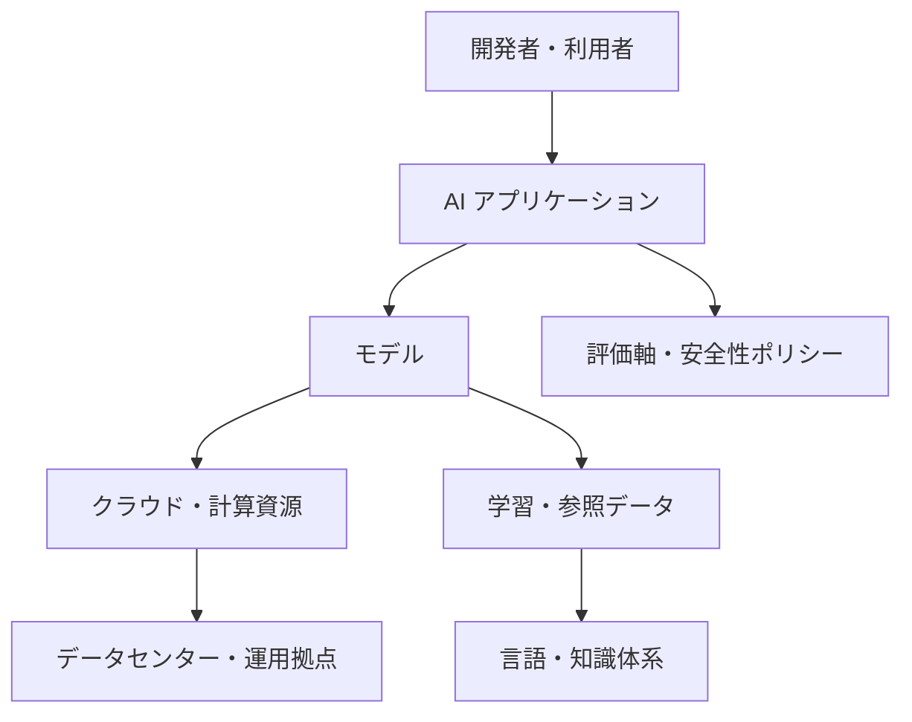

## はじめに

最近、AI を使う時間が本当に増えました。

コードを書く前の壁打ち、エラーの切り分け、文章の下書き、調査の入口、設計方針の整理。気づけば、以前なら検索エンジンや過去のメモを行き来していた場面で、まず AI に問いかけるようになっています。

便利です。これはもう素直に便利です。

一方で、使えば使うほど、私は少し引っかかりを覚えるようになりました。私が普段使っている AI ツールに限っていえば、モデルそのものだけでなく、クラウド、データセンター、データの保存先、処理されるリージョン、知識体系、言語、評価軸といった**国外のリソース**に支えられている部分が少なくないのではないか。そんな感覚です🧭

この記事では、「だから国内リージョンに閉じればよい」という単純な話はしません。むしろ、AI を使うことが当たり前になりつつある今だからこそ、依存の構造を丁寧に眺め、選択肢を増やす姿勢について考えてみます。

次の章では、まず私が日常的に AI を使う中で感じている変化を整理します。

## 背景：AI はすでに作業環境の一部になっている

私にとって AI は、もはや「たまに試す新しいツール」ではなくなってきました。

もちろん、すべてを AI に任せているわけではありません。最終的にコードを読むのも、設計を判断するのも、公開する文章に責任を持つのも人間です。それでも、考え始める前の助走や、考えが詰まったときの別視点として AI がいることは、開発体験を大きく変えています。

たとえば、次のような場面です。

| 場面 | AI に頼っていること | 人間が引き受けること |
|------|---------------------|----------------------|
| 🧱 設計 | 選択肢の洗い出し、トレードオフの整理 | 採用判断、制約条件の確認 |
| 🐞 デバッグ | エラーメッセージの読み解き、原因候補の提示 | 再現確認、ログ調査、修正 |
| ✍️ 文章 | 構成案、言い換え、抜け漏れ確認 | 主張、責任、最終表現 |
| 📚 調査 | キーワードの発見、概念の入口 | 一次情報の確認、適用可否判断 |

ここで重要なのは、AI が「便利な外部ツール」から「思考の前段に入り込む存在」になっていることです。

だからこそ、その AI が何に支えられているのかを意識しないまま使い続けることに、少し危うさを感じています。

## 観察：便利さの裏側にある依存の層

AI を使うとき、画面上ではチャット欄やエディタ拡張だけが見えます。

しかし、その裏側には多くの層があります。大規模なモデル、そのモデルを動かすクラウド基盤、データセンター、学習や評価に使われるデータ、プロンプトやドキュメントの言語、そして「よい回答」とされる評価軸です。これらが重なって、私たちの手元に AI 体験として届いています。

ざっくり整理すると、次のような構造です。

このうち、私たちが普段意識しやすいのはアプリケーションの使い勝手やモデルの性能です。しかし、実際にはその下にある計算資源、電力、データ、言語、評価軸にも依存しています。

そして私が日常的に使っている範囲では、国外の大きな事業者や英語圏のドキュメント・知識体系に依存していると感じる場面が多いです。これは善悪の話ではありません。高品質なサービスをグローバルに提供しているからこそ、私たちはその恩恵を受けられています。

ただ、その便利さを享受するほど、依存していること自体を忘れやすくなります。そこに違和感があります。

## もうひとつの違和感：電力も誰かの生活資源である

国外リソースへの依存を考えていると、もうひとつ避けて通れない感覚があります。

それは、AI を動かすための計算資源や電力も、どこかにある有限の生活資源だということです。私たちの画面上では、プロンプトを送るだけで回答が返ってきます。しかしその裏側では、モデルを動かすサーバー、冷却、ネットワーク、データセンターの運用が必要になります。

この規模感は、思っているより大きいかもしれません。IEA（International Energy Agency）の `Electricity 2024` では、データセンター、AI、暗号資産セクターの電力消費について、2022 年に世界全体で推定 460 TWh、2026 年には 1,000 TWh 超に達する可能性があると述べています。これは日本の電力消費量におおよそ相当する規模だと説明されています。

— [Electricity 2024 - Executive summary](https://www.iea.org/reports/electricity-2024/executive-summary)

:::message
ここで引用している数字は、AI 単体ではなく、データセンター、AI、暗号資産セクターを含む見通しです。それでも、AI が「画面の中だけで完結する軽い処理」ではなく、大きな電力需要の一部として存在していることを考える入口にはなると思います。
:::

もちろん、個人が数回 AI に質問したからといって、ただちに誰かの生命を脅かすと断定したいわけではありません。そこまで単純な因果関係として語るのは危険です。

それでも、もし大量の計算資源や電力が「本当に必要な用途」よりも「なんとなく投げた無駄な依頼」に使われているとしたらどうでしょうか。医療、空調、通信、水道、避難、生活インフラなど、電力が人の命を支える場面はあります。世界のどこかで、あるいは将来のどこかで、資源の奪い合いが起きる可能性まで想像することは、AI を使う側の責任の一部だと思います。

だからといって、「AI を使うな」と言いたいわけではありません。私自身、AI を使っています。ただ、使うたびに少しだけ立ち止まりたいです。

この依頼は本当に AI に投げる必要があるのか。すでに分かっていることを何度も聞いていないか。長大な文脈を毎回送らなくても済む設計にできないか。人間が考えるべき判断まで、惰性で外部の計算資源に委ねていないか。

AI のコストは、利用料金だけでは測れません。電力、インフラ、環境、そして誰かの生活に必要な資源と地続きかもしれない。その想像力を持ったまま使いたいです。

ただし、この違和感をそのまま「国内リージョンか国外リージョンか」や「使うか使わないか」の二択にしてしまうと、重要な論点を取り逃がしてしまいます。

## 考察：問題は「どこで処理されるか」だけではない

この話は、単純に「国内リージョンか国外リージョンか」で切り分けると見誤ると思っています。

サービスの提供元が国内かどうかだけでは、モデルや基盤、データの保存先、推論時に処理されるリージョンまでは判断できません。一方で、OSS として公開され、ローカル実行できるモデルであれば、可搬性や透明性の面で有利な場合もあります。

私が気にしているのは、提供元やリージョンのラベルそのものではなく、**選択肢を持てているか**です。

| 観点 | 依存が見えにくい状態 | 選択肢を増やす状態 |
|------|----------------------|--------------------|
| 🌐 モデル | 特定の API だけを前提に設計する | 複数モデルを差し替え可能にする |
| ☁️ 基盤 | 特定クラウドの機能に密結合する | 抽象化層や標準的な I/O を用意する |
| 🗾 データ | 重要データを外部前提で扱う | ローカル・国内リージョン・組織内の置き場を分ける |
| 🗣️ 言語 | 英語の評価軸だけで品質を見る | 日本語の業務文脈で評価する |
| 🧪 評価 | 体感で「良さそう」と判断する | 自組織の評価データセットを持つ |

「国内リージョンなら安心」という話でもありません。国内リージョンを選べても、評価が弱ければ業務では使いにくいかもしれません。ローカルモデルであっても、運用やセキュリティを考えなければ別のリスクが生まれます。

大事なのは、依存をなくすことではなく、依存を見えるようにすることです。

そのために、ローカル、国内リージョン、小規模モデル、OSS、日本語データ、自組織の知識資産を組み合わせ、目的に応じて使い分けます。AI 時代の現実的な姿勢は、そのあたりにあるのではないでしょうか。

この「選択肢を持つ」という姿勢は、単なる心構えではなく、AI 機能をどう設計するかにも直結します。

## 開発者への示唆：AI 時代のアーキテクチャ設計

開発者にとって、この話は思想だけでは終わりません。アプリケーション設計そのものに関わってきます。

AI 機能をプロダクトに組み込むとき、つい「どのモデルを使うか」から考え始めがちです。もちろんモデル選定は重要です。しかし、長く運用するなら、モデルの前後にある設計のほうが効いてくる場面も多いと感じています。

### データ主権を設計に入れる

AI に渡すデータには、ユーザーの入力、社内文書、ログ、問い合わせ履歴、設計資料などが含まれることがあります。

どのデータを外部 API に送ってよいのか。どのデータは国内リージョンや自組織内に閉じたいのか。どの粒度で匿名化・要約・マスキングするのか。こうした判断は、実装のあとから付け足すより、最初から設計に含めたほうがよいです。

ここでいうデータ主権は、難しい政治的な言葉というより、**自分たちのデータの置き場所と使われ方を説明できる状態**だと考えています。

### 可搬性を残す

AI 周辺の技術は変化が速く、今日の最適解が明日も最適とは限りません。

そのため、特定ベンダーの API 仕様にアプリケーション全体を密結合させると、あとから選択肢を増やしにくくなることがあります。プロンプト、ツール呼び出し、検索、評価、ログなどを適切に分けておく。そうすることで、モデルや基盤を差し替える余地が生まれます。

完璧な抽象化は難しいですが、「ここを差し替えたい未来が来るかもしれない」と考えて境界を置くだけでも、設計は変わります。

### 観測可能性を持つ

AI の出力は、通常の関数のように常に同じ結果を返すとは限りません。

だからこそ、入力、参照した情報、モデル、プロンプトのバージョン、出力、ユーザーの評価、失敗例を追えるようにしておくことが重要です。これは、いわゆる観測可能性（observability）の考え方を AI 機能にも持ち込むということです。

「なんとなく精度が落ちた気がする」ではなく、「どの入力群で、どの変更後に、どう悪化したのか」を見られる状態にしたいところです🔍

### 評価データセットを育てる

AI 活用で見落としがちなのが、評価データセットです。

自分たちの業務で本当に起こる質問、誤答すると困るケース、日本語特有の言い回し、社内用語、あいまいな依頼などです。これらを小さく集めておくだけでも、モデルやプロンプトを比較するときの基準になります。

外部の一般的なベンチマークだけでは、自分たちの現場に合うかどうかは判断しきれません。自組織の知識資産を、評価にも活かすことが大切です。

### ロックインの前提を説明可能にする

ベンダーロックインは、常に悪というわけではありません。

優れたマネージドサービスに乗ることで、開発速度や運用品質が上がることはあります。問題は、ロックインしていることに無自覚なまま、抜け道をまったく持たないことです。

ロックインを避けるというより、「どこにロックインしているか」「抜けるなら何が必要か」「それでも今は乗る価値があるか」を説明できる状態にする。これが現実的な落としどころだと思います。

これらはすべて、特定の技術を避けるためではありません。依存の所在を説明し、必要に応じて選び直せる状態を作るための設計です。

## 明日からできること

大きな方針を一気に変える必要はありません。

まずは、開発者として明日からできる小さな行動を増やすことから始めればよいと思っています。迷ったら、使っている AI サービスと送信データの棚卸しから始めるのがよいと思います。

| カテゴリ | 小さな行動 | 期待できる効果 |
|----------|------------|----------------|
| 🧭 依存の棚卸し | 使っている AI サービスと送信データを書き出す | どこに依存しているか見える |
| 🧪 評価 | よくある質問と望ましい回答を数件だけ保存する | モデル変更時に比較しやすくなる |
| 🗾 日本語 | 社内用語や日本語の失敗例をメモする | 現場に合う AI 活用につながる |
| 🧱 設計 | AI API 呼び出しを直接散らさず境界を作る | 差し替えや検証がしやすくなる |
| 🧰 OSS | ローカルで動く小規模モデルや OSS ツールを試す | 選択肢の感覚が育つ |
| 🔍 ログ | 入力・出力・プロンプトの版を追えるようにする | 品質低下や事故を調べやすくなる |
| ⚡ 利用量 | AI に投げる前に、目的と必要な文脈を絞る | 無駄な計算資源の消費を減らしやすくなる |

どれも地味です。

しかし、AI を日常的に使うほど、こうした地味な準備が効いてきます。便利なサービスを使いながらも、依存を見える化し、必要なところでは別の選択肢を持てるようにすること。その積み重ねが、開発者としての足腰になるはずです。

## おわりに

AI は便利です。私はこれからも使うと思います。

ただ、便利だからこそ、その裏側にある依存の構造を忘れたくありません。対象は、モデル、クラウド、データセンター、電力、知識体系、言語、評価軸です。これらがどこにあり、どのようなデータ・ポリシー・評価基準で作られ、どのように自分たちの仕事へ入り込んでいるのかを、ときどき立ち止まって考えたいです。

繰り返しますが、これは「国外リージョンや国外のサービスを避けよう」という話ではありません。

国外の優れた技術から学び、使えるものは使います。そのうえで、ローカルで動くもの、国内リージョンや自組織内で扱えるもの、小規模でも透明性のあるもの、OSS として検証できるもの、日本語や自組織の文脈で評価したものを組み合わせていきます。

AI 時代の自立とは、何にも依存しないことではなく、**依存していることを理解したうえで、選び直せる余地を持つこと**なのだと思います🌱
