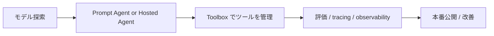

## はじめに

エージェント開発は、もはや「プロンプトを一発で投げる」だけではありません。実際には、モデル選定、ツール統合、ガードレール、認証、運用、評価、監査、拡張性といった複数の領域を横断して設計する必要があります。

その中で Microsoft が提示しているのが、Microsoft Foundry です。Foundry は単なるモデル利用の入口ではなく、エージェント、モデル、ツール、観測性、ガバナンスを一つの開発・運用基盤として扱える場所として位置づけられています。

この記事では、まず Microsoft Copilot Studio と Microsoft Foundry の違いを整理し、次に Foundry で使えるモデル・ツール・ワークフロー・Hosted Agent までを俯瞰します。最後に、自分で Agent Framework などを開発して Azure Container Apps にデプロイする場合と比べたとき、Hosted Agent がどこが有利かを、セキュリティとガバナンスの観点から整理します。

## 本記事のゴール

この記事を読めば、次のような理解が得られます。

- **Copilot Studio と Foundry は何が違うのか**
- **どこまでがローコードで、どこからがコード中心の設計なのか**
- **Foundry で使えるモデル、ツール、ワークフローの種類**
- **Hosted Agent を使うべきケースと、運用上のメリット**
- **自前の Container Apps 配置と比較したときの強み**

## Microsoft Copilot Studio と Microsoft Foundry の違い

最初に混同しやすいのが、Copilot Studio と Microsoft Foundry の違いです。どちらも Microsoft の AI エージェント周辺のサービスですが、重心が少し違います。

Microsoft Copilot Studio は、ビジネス部門や業務ユーザー向けの低コード・ノーコードでのエージェント作成に強いです。公式の説明では、graphical, low-code studio for building and managing AI-powered agents and workflows とされていて、ドラッグ＆ドロップで業務フローや会話の流れを組み立てられます。たとえば社内問い合わせ対応、申請フロー、業務自動化の構成に向いています。

一方で Microsoft Foundry は、モデル・ツール・エージェント開発・運用を一つの基盤として扱うためのより広いプラットフォームです。Foundry では次のようなものが同時に扱えます。

- さまざまなモデルを選ぶ
- エージェントをプロンプトとして定義する
- Hosted Agent として自前コードを載せる
- Toolboxes でツールを共通化する
- Observability / evaluations / governance を一元管理する

要するに、Copilot Studio は「業務向けのローコードでのエージェント実装」に強く、Foundry は「AI エージェントそのものを開発・統制・運用する基盤」として見るのが分かりやすいです。

### 使い分けの視点

| 項目 | Microsoft Copilot Studio | Microsoft Foundry |
|---|---|---|
| 🧩 主眼 | 業務プロセスと会話の低コード構築 | モデル / ツール / エージェント / 運用基盤の統合 |
| 👤 想定ユーザー | ビジネス開発者、業務担当者 | AI アプリ開発者、エンジニア、Platform / Security 部門 |
| 🛠️ 実装スタイル | ノーコード〜ローコード | 宣言型、コード中心、ホスト型、SDK/REST 併用 |
| 🤖 モデル選択 | あり（ハーネス別・利用可能モデルに依存） | 強くあり、Foundry の model catalog を中心に利用 |
| 🔐 ガバナンス | 組織向け運用機能がある | Control Plane と連動してより大規模なガバナンスに強い |
| 🧠 典型的なユースケース | 社内業務フロー、問い合わせ対応 | AI アプリ、カスタムエージェント、ツール連携、マルチエージェント |

Copilot Studio は「業務にすぐ使える」側面が強い一方、Foundry は「自分たちのアプリ開発と運用に組み込む」側面が強いと考えると分かりやすいです。実務では、Copilot Studio で社内向けのプロトタイプを作り、より高度な要件は Foundry 上でコードベースのエージェントに昇格させる、という使い分けも自然です。

公式の比較としては、Copilot Studio の解説では「ローコード studio」「workflows」「agent flows」が中心で、Foundry の解説では「Agent Service」「Hosted agents」「Toolboxes」「Observability」「Control Plane」が中心になります。

- [Microsoft Copilot Studio Overview](https://learn.microsoft.com/microsoft-copilot-studio/fundamentals-what-is-copilot-studio?WT.mc_id=DT-MVP-5004827)
- [Microsoft Foundry Overview](https://learn.microsoft.com/azure/foundry/what-is-foundry?WT.mc_id=DT-MVP-5004827)
- [Foundry Agent Service Overview](https://learn.microsoft.com/azure/foundry/agents/overview?WT.mc_id=DT-MVP-5004827)

## Microsoft Foundry でできることの全体像

Foundry は、現代の AI エージェント開発に必要な要素を一つのプラットフォームでまとめて扱おうとしていると感じます。公式の説明でも、Foundry は agents, models, and tools を同じ管理グループで扱い、observability / security / networking / RBAC を見据えています。

### 1. モデルを選ぶ

Foundry の大きな特長は、モデル選択の自由度です。Foundry Models Catalog では、OpenAI、Meta、Anthropic、Mistral などさまざまなモデルを利用でき、エージェントの実装そのものを大きく変えなくても、モデルを差し替えられる設計になっています。

エージェント開発での課題はしばしば「最初にどのモデルを選ぶか」ですが、Foundry ではモデルそのものをリソースとして管理しやすく、評価と比較をしながら切り替えられるのが魅力です。

### 2. Prompt Agent で最短で始める

Foundry では、Prompt Agent を使えばコードをほぼ書かずに、指示（instructions）、モデル、ツールを組み合わせたエージェントを作れます。これは「最初のプロトタイプを作るには非常に速い」という意味で大きな価値があります。

たとえば、社内ドキュメントに基づいて質問に答えるエージェント、業務用ワークフローに接続するエージェントなどは、宣言的に組み立ててテストし、公開まで持っていける点が強力です。

### 3. Hosted Agent でコードベースのエージェントをデプロイできる

Foundry の中でも大きな選択肢が Hosted Agent です。これは従来の「自前のエージェントコードを自分でコンテナ化して Kubernetes / Container Apps に載せる」アプローチに近いものですが、プラットフォーム側がホスティング、スケーリング、エンドポイント、ID、セッション状態、観測性を扱ってくれます。

これはまさに、「Agent Framework や LangGraph などのコードをそのまま載せつつ、Foundry の管理下で運用する」形です。

### 4. Toolboxes でツールを共通化する

Foundry のもう一つの重要な要素が Toolboxes です。アプリケーションの成長とともに、エージェントが使うツールは増えます。Web Search、Code Interpreter、File Search、OpenAPI、MCP サーバーなどを個別に繋いでいると、認証・ガバナンス・更新・運用負担がばらつきます。

Toolbox は、ツールを一括管理して、MCP-compatible endpoint として共有する仕組みです。これにより、

- 認証情報を一元化できる
- ツールの更新を一箇所で管理できる
- エージェントごとに同じツール設定を繰り返さない
- ガードレールやバージョン管理を共通化できる

というメリットが得られます。これは組織で複数エージェントを管理する際にかなり大きな価値があります。

- [What is Toolbox in Microsoft Foundry](https://learn.microsoft.com/azure/foundry/agents/concepts/toolbox-overview?WT.mc_id=DT-MVP-5004827)

### 5. Observability と評価で、見える化する

エージェントは「動けば良い」わけではありません。実際には、

- どのツールがどの順番で呼ばれたか
- どのモデルが選ばれたか
- どの回答が不安定だったか
- どのツールコールが失敗したか
- コストやトークンの使い方が妥当か

といった観点が重要です。Foundry はこれを Observability, tracing, evaluations として扱えます。

この観測性の強さは、AI 開発においていちばん大事な「本番での改善サイクル」を支える土台になります。

### 6. Control Plane で組織横断のガバナンスを行う

Foundry の大きな強みは、単一のプロジェクト内で終わらないことです。Foundry Control Plane では、複数プロジェクトや複数エージェントを横断して、

- fleet overview
- compliance posture
- alerts / cost / usage
- model / agent inventory
- security integration

といった管理ができます。これは、エージェントが増えたときに、個別の Azure portal で断片的に管理するより圧倒的に合理的です。

- [What is Microsoft Foundry Control Plane](https://learn.microsoft.com/azure/foundry/control-plane/overview?WT.mc_id=DT-MVP-5004827)

## Foundry の主要な開発ワークフロー

Foundry は、開発の流れを「実装」ではなく「開発フェーズ」によって整理しやすいです。

### 1. 探索と検証

まず、Foundry portal や SDK からモデルやツールを確認し、プロトタイプを作ります。

### 2. Prompt Agent を作る

簡単な場面では Prompt Agent のまま使い、評価と運用を進めます。

### 3. Hosted Agent に昇格する

より複雑なロジック、状態管理、カスタムプロトコル、長時間処理が必要なら Hosted Agent を使います。

### 4. Toolboxes と governance を統合する

ツールを一本化し、認証と許可を管理し、ガードレールを載せて運用準備を整えます。

### 5. 自動評価と改善

Observability や Evaluation を通じて、プロンプトやモデルを改善していきます。

## Hosted Agent とは何か

Hosted Agent は、自分のコードを Foundry の実行基盤に載せて、管理されたエンドポイントとして起動するタイプです。公式の説明では、bring your own code and framework とされていて、Agent Framework、LangGraph、OpenAI Agents SDK、Anthropic SDK、GitHub Copilot SDK などが含まれます。

ここが重要なのは、「コードは自分で書くが、ホスティングは Foundry が担当する」ことです。つまり、定型的なコンテナ管理やセキュリティ基盤の運用を、すべて自前でやる必要がありません。

Hosted Agent でやれることの例:

- 独自のエージェントロジックを持つ
- 長時間ワークフローを実行する
- セッション状態とファイル保存を持つ
- Webhook や非 OpenAI 互換の入力を受ける
- 既存の Azure サービスに接続する
- Foundry model catalog のモデルと統合する

重点は、自前のロジックを持ちながら、インフラと運用をプラットフォームに任せることです。

- [Hosted agents in Foundry Agent Service](https://learn.microsoft.com/azure/foundry/agents/concepts/hosted-agents?WT.mc_id=DT-MVP-5004827)

## Hosted Agent と Container Apps 自前デプロイの比較

ここからが本題です。多くの開発者は、Agent Framework などでコードを書き、Azure Container Apps にデプロイして運用する、という選択肢を考えます。これは十分に現実的ですが、Foundry の Hosted Agent はセキュリティとガバナンスの面で有利な点が明確です。

### 1. 認証と ID 管理が組み込まれている

Hosted Agent は、専用の Microsoft Entra identity を持つため、モデル呼び出しや次のサービスアクセスの認証を明確に分離できます。自前で Container Apps にデプロイした場合、

- Azure AD / Entra の構成
- Managed Identity の設定
- トークンのライフサイクル管理
- どのサービスにどの権限を与えるか

といった設計を自分で行う必要があります。

Foundry では、エージェントごとに identity を持つ感覚で考えられ、監査や権限の整理がしやすいです。

### 2. セキュリティ境界が明確になる

Hosted Agent は `session-level sandbox` として実行され、per-session VM-isolated environment で動くのが重要です。つまり、エージェント間での資源の混在や、セッションの再開時の状態復元などが後ろ盾になります。

自前の Container Apps では、

- 認証設計
- ネットワーク境界
- ingress / egress の制限
- secret injection
- 隔離ポリシー

といったものを一つずつ自前で設計する必要があります。Foundry はその境界を基本的にプラットフォーム側で担うため、実装者が考える範囲が小さくなります。

### 3. ガバナンスを組織レベルで統制しやすい

Foundry Control Plane があることで、複数のエージェントやモデル・ツールを組織横断で把握できます。これは Container Apps 単体では難しいです。

自前デプロイでは、

- どのエージェントがどこにあるか
- 誰がどんな権限を持っているか
- どのモデルが使われているか
- どのプロジェクトでコストが増えているか

といった視点が散在しがちです。

Foundry はそこを一元管理できるため、セキュリティ担当者・AI 管理者・開発者の責務を分離しやすいです。

### 4. ツールの共通化で秘密情報管理が楽になる

Toolboxes は、認証をエージェント個別ではなく toolbox レベルで持つ設計です。自前の Container Apps では、個々のアプリが各種 API の secret を持ち、更新や監査が漏れやすくなります。

Foundry の toolbox は、credentials、authorization、governance、versioning を中央管理しやすく、権限の分散を避けられます。実務上は、「誰がどのツールを使えるか」を管理しやすくなるので、開発速度を落とさずにガバナンスを上げられます。

### 5. 可観測性と評価が標準的に入る

自前デプロイでも OpenTelemetry や Application Insights は導入できますが、エージェントに対する評価と運用観測は別途整備が必要です。Foundry では、

- トレース
- メトリクス
- 評価
- ドリフト/異常検知
- AI Red Teaming

といった観点をより自然に組み込めます。これはセキュリティとガバナンスに直結するだけでなく、事後の説明責任にも効きます。

### 6. ただし、自前デプロイの強みもある

もちろん、自前の Container Apps には独自の強みがあります。

- 既存のインフラと深く統合できる
- 低レイヤーの制御が必要な場合がある
- アプリケーション固有のネットワークやスケジューリング設計を最適化したい
- 企業内の既存 CI/CD / deployment pipeline と完全に合わせたい

というケースでは、Container Apps 自前運用の方が適していることもあります。重要なのは、「エージェントを本当にプロダクションで運用するなら、Foundry で持っている統制機能が大きく効くということ」です。

## どんなときに Foundry を選ぶべきか

以下のようなケースでは、Foundry は非常に相性がいいです。

- エージェントが複数プロジェクトにまたがる
- 組織で認証・権限・監査を一本化したい
- モデルやツールを切り替えながら評価したい
- 低コードとコード中心の両方を使い分けたい
- セキュリティ/ガバナンスを設計の初期段階から重視したい
- エージェントを、社内のアプリと同じ粒度で管理したい

逆に、純粋に最小構成で 1 つの AI アプリを作り切りたい、または既存の Azure 環境に完全に吸収したい、という場合は自前の Container Apps も十分に有効です。

そのうえで、組織的な展開が想定されるなら、Foundry の Hosted Agent と Toolboxes はかなり強いです。

## まとめ

Microsoft Foundry は、エージェント開発の「前段」ではなく、「これからの AI 業務システムをどう設計し、どう運用し、どう管理するか」の答えを持ち寄るプラットフォームといえるでしょう。

- Copilot Studio は低コードで業務に近い作り込みに強い
- Foundry はモデル・ツール・エージェント・運用を横断して設計するための基盤
- Prompt Agent は最短導入に向く
- Hosted Agent はコードの自由度とプラットフォームの管理能力を両立する
- Toolboxes と Control Plane によって、ガバナンスとセキュリティが組織ではじめて実用的になる

特に Hosted Agent は、「自分でアプリを作り、なぜか自前で脆弱なコンテナと認証と監査を管理する」よりも、Foundry が周辺のセキュリティと運用の複雑さを吸収してくれるという意味で、かなり合理的な選択肢です。

AI エージェントは単独のチャット UI ではなく、組織の業務、データ、権限、監査、評価の実体を持つ運用資産になります。Foundry は、まさにその視点で設計されていると感じます。

次に新しいエージェントを作るとき、我々は「本当にどこまでを自分で持つべきか」を改めて考える必要があります。Foundry を知ることは、その判断の軸を得ることでもあります。

## 参考リンク

- [Microsoft Copilot Studio Overview](https://learn.microsoft.com/microsoft-copilot-studio/fundamentals-what-is-copilot-studio?WT.mc_id=DT-MVP-5004827)
- [What is Microsoft Foundry?](https://learn.microsoft.com/azure/foundry/what-is-foundry?WT.mc_id=DT-MVP-5004827)
- [Foundry Agent Service Overview](https://learn.microsoft.com/azure/foundry/agents/overview?WT.mc_id=DT-MVP-5004827)
- [Hosted agents in Foundry Agent Service](https://learn.microsoft.com/azure/foundry/agents/concepts/hosted-agents?WT.mc_id=DT-MVP-5004827)
- [What is Toolbox in Microsoft Foundry](https://learn.microsoft.com/azure/foundry/agents/concepts/toolbox-overview?WT.mc_id=DT-MVP-5004827)
- [What is Microsoft Foundry Control Plane](https://learn.microsoft.com/azure/foundry/control-plane/overview?WT.mc_id=DT-MVP-5004827)
