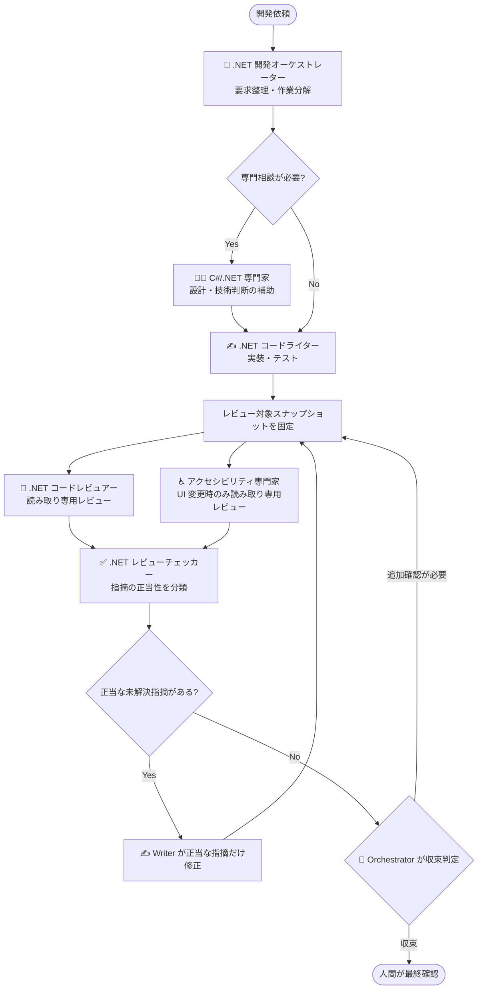

## はじめに

前回の記事では、GitHub Copilot CLI で複数エージェントを使うときの設計として、**読み取り専用レビュー + 統合役による一括反映**という考え方を整理しました。

https://zenn.dev/tomokusaba/articles/a599cb645ca2c5

前回はテキスト成果物を題材に、スナップショット固定、共通スキーマ、競合解決、収束条件を見ていきました。今回はその考え方を、.NET コード生成テンプレートに適用する実践編です。

つまり本記事は、前回整理した複数エージェント設計を、.NET コード生成テンプレートに持ち込む応用編です。

題材にするのは、私が作成した [DotnetTemplate](https://github.com/tomokusaba/DotnetTemplate) です。このリポジトリは、日本語環境の .NET / C# 開発で GitHub Copilot を安全かつ一貫して使うためのテンプレートです。リポジトリ向け Copilot customization テンプレートとして作っています🧭

この記事では、DotnetTemplate のエージェント構成をもとに、複数の観点からレビューして、正当な指摘だけを Writer が修正し、収束するまでループする設計を整理します。

:::message
本記事は、DotnetTemplate の README とテンプレート構成をもとにした設計メモです。GitHub Copilot CLI / Custom Agents / Agent Skills は更新が速いため、細かな仕様や画面表示は、利用時点の公式ドキュメントも確認してください。
:::

## DotnetTemplate でやりたいこと

DotnetTemplate は、.NET / C# 開発における Copilot customization を、リポジトリ単位で持ち運べる形にするためのテンプレートです。

主な構成は次のようになっています。

| 種類 | 例 | 役割 |
|------|----|------|
| 🧩 Agent Skills | `.github\skills\<skill-name>\SKILL.md` | .NET / C# / xUnit / Aspire などの作業知識を再利用する |
| 🤖 Custom Agents | `.github\agents\*.agent.md` | Orchestrator / Writer / Reviewer などの役割を定義する |
| 📝 Pull Request Template | `.github\pull_request_template.md` | 人間のレビュー観点や確認事項をそろえる |

テンプレートでは、最新安定版の .NET SDK / ASP.NET Core を前提にします。Blazor Web App Interactive Server、Fluent UI Blazor、.NET Aspire AppHost / ServiceDefaults、必要に応じた EF Core なども扱います。

また、日本語環境での開発も強く意識しています。UTF-8、Windows / PowerShell、`ja-JP`、`Asia/Tokyo`、内部は UTC / 表示・入力は日本時間、という前提を明示しておくことで、毎回の実装で時刻・ロケール周りの判断がぶれにくくなります。

ここで重要なのは、テンプレートが「コードを書かせるプロンプト集」だけではないことです。**誰が判断し、誰が書き、誰が読み取り専用でレビューするか**まで含めて、開発ループとして定義している点がポイントです。

## 今回のゴール

この記事のゴールは、DotnetTemplate で試している複数エージェント開発ループを、設計として読み解くことです。

- ✅ .NET 開発オーケストレーターを中心にした役割分担を整理する
- ✅ Writer と Reviewer の書き込み権限を分ける理由を説明する
- ✅ Review Checker が指摘の正当性を分類する意味を考える
- ✅ Agent Skills がワークフローの再現性を支えることを確認する
- ✅ レビュー収束まで反復することで、コード品質を上げる流れを図示する
- ✅ 短いプロンプトから実際にアプリの足がかりを作った例を見る

前回は「複数エージェントで同じ文章を安全に改善するには？」という話でした。今回は「複数エージェントで同じ .NET コードベースを安全に改善するには？」という話に置き換えていきます。

## エージェントの役割を分ける

DotnetTemplate では、Custom Agents を次のような役割で分けています。

| エージェント | 主な役割 | 書き込み権限 |
|--------------|----------|----------|
| 🧭 .NET 開発オーケストレーター | 要求整理、作業分解、相談先の選択、収束判定 | なし（統括・委譲） |
| ✍️ .NET コードライター | 実装、テスト追加、正当な指摘の修正 | あり |
| 🔎 .NET コードレビュアー | 差分レビュー、設計・テスト・保守性の指摘 | なし |
| ♿ アクセシビリティ専門家 | UI 変更時の a11y 観点レビュー | なし |
| ✅ .NET レビューチェッカー | レビュー指摘の正当性を分類する | なし |
| 🧑‍🏫 C#/.NET 専門家 | 必要時に技術判断を補助する | なし（相談役 / 読み取り専用） |

ここでいう「書き込み権限なし」は、エージェント自身が直接ファイルを編集しない、つまり `edit` / `execute` を持たないという意味です。オーケストレーターは必要な Agent へ委譲しますが、自分でコードを書き換える役割にはしません。

前回記事の言葉で言えば、レビュー系エージェントは **読み取り専用レビュー** として扱います。

たとえば .NET コードレビュアーが「このサービスは `DateTime.Now` ではなく `TimeProvider` を注入した方がテストしやすい」と指摘したとしても、その場でファイルを編集しません。アクセシビリティ専門家が「ラベルとフォーカス順を確認したい」と指摘した場合も同じです。直接修正するのではなく、指摘として返します。

この分担により、Writer が実装中の差分に対して、複数の専門家が同じスナップショットを読み、結果だけを返せるようになります。

## 開発ループ全体を図にする

DotnetTemplate の基本フローを Mermaid で表すと、次のようなループになります。



この図で一番大事なのは、レビュー指摘がそのまま修正に流れ込まないことです。

レビュー系エージェントは有用な観点を持っていますが、すべての指摘が必ず正しいとは限りません。既存設計を読み違えることもありますし、テンプレートが意図的に選んでいる方針と衝突することもあります。

そこで、Review Checker が間に入ります。Review Checker は、レビュー指摘を「正当」「誤検知」「要人間確認」「既に解決済み」のように分類します。そのうえで、正当な未解決指摘だけを Writer に戻します。

この 1 段を挟むことで、レビューを増やした結果としてノイズまで増える問題を抑えやすくなります。

ただし、このループを安定して回すには、各エージェントが参照する前提知識やチェックリストをそろえておく必要があります。そこで DotnetTemplate では、Agent Skills を使って作業規約を再利用できる形にしています。

## Agent Skills が再現性を支える

この仕組みを支えているのが Agent Skills です。

ここでいう Agent Skills は、GitHub Copilot CLI / GitHub CLI の `gh skill` で扱うスキル構成を指しています。

Custom Agents が「誰が担当するか」を定義するものだとすると、Agent Skills は「どの前提知識・手順・チェックリストを使うか」を定義するものです。DotnetTemplate では、次のような Skills を用意しています。

| Skill | 使いどころ |
|-------|------------|
| 🧱 `dotnet-best-practices` | .NET / C# の基本方針、依存性注入、設定管理など |
| 🧪 `csharp-xunit` | xUnit、テスト命名、FakeTimeProvider を使った時刻テスト |
| 🕒 `dotnet-timezone` | UTC / `ja-JP` / `Asia/Tokyo` の扱い |
| ☁️ `aspire` | .NET Aspire AppHost / ServiceDefaults / OpenTelemetry |
| 🧭 `microsoft-agent-framework` | Microsoft Agent Framework 関連の実装判断 |
| ♿ `fluentui-blazor` | Fluent UI Blazor とアクセシビリティ観点 |
| 📚 `microsoft-docs` | Microsoft 公式ドキュメントの確認 |
| 🔎 `microsoft-code-reference` | 公式サンプルや API 参照の確認 |

たとえば、時刻を扱うコードを書くときに `dotnet-timezone` と `csharp-xunit` が参照されれば、`DateTime.Now` を直接使わず `TimeProvider` を注入し、テストでは `FakeTimeProvider` を使う、という判断に寄せやすくなります。

Microsoft Learn でも、`FakeTimeProvider` は時間に依存するコードを予測可能にテストするための仕組みとして説明されています。実装時には、公式ドキュメントを確認しながら使うのが安全です。

- [Testing with FakeTimeProvider](https://learn.microsoft.com/dotnet/core/extensions/timeprovider-testing?WT.mc_id=DT-MVP-5004827)
- [What is TimeProvider?](https://learn.microsoft.com/dotnet/standard/datetime/timeprovider-overview?WT.mc_id=DT-MVP-5004827)

Agent Skills の利点は、毎回のプロンプトに長い前提を書かなくても、エージェント側が同じ作業規約を参照しやすくなることです。これはコード生成の精度だけでなく、レビュー指摘の一貫性にも効いてきます。

では、この共通前提を持った Reviewer を複数に分けると、どのような意味があるのでしょうか。

## レビュー観点を複数に分ける意味

複数エージェントにする価値は、単に「多くの AI を動かす」ことではありません。観点を分離できることにあります。

.NET コードレビュアーは、設計、例外処理、テスト、依存性注入、Options pattern、User Secrets / 環境変数などを見ます。一方、アクセシビリティ専門家は、UI 変更があるときにキーボード、フォーカス、ラベル、ARIA、WCAG 2.2、JIS X 8341-3 などの観点を見ます。

同じ差分でも、見る観点が違えば指摘も変わります。

| 差分 | .NET コードレビュアーが見そうな点 | アクセシビリティ専門家が見そうな点 |
|------|----------------------------------|----------------------------------|
| 🧩 Razor コンポーネント追加 | 状態管理、サービス依存、テスト可能性 | ラベル、フォーカス順、キーボード操作 |
| 🧪 テスト追加 | 境界値、時刻依存、非同期処理 | 原則対象外。ただし UI テスト方針は相談余地あり |
| ⚙️ 設定追加 | Options pattern、Secret の扱い | UI に露出する設定名や説明文 |
| 📈 Aspire 連携 | AppHost / ServiceDefaults / OpenTelemetry | ダッシュボード利用時の表示補助は別途確認 |

アクセシビリティは、最後にまとめて見るより、UI 変更のレビュー時点で入れた方が直しやすいと感じています。特に Blazor / Razor / Fluent UI Blazor / MVC のように UI を含む変更では、実装担当とは別の観点で確認する価値が大きいです。

:::message
アクセシビリティのレビューは、自動チェックだけで完結するものではありません。テンプレートでは、キーボード操作、フォーカス、ラベル、ARIA など、人間が意図を確認すべき観点もレビュー対象に含める方針にしています。
:::

## Review Checker は「レビューのレビュー」をする

複数の Reviewer を動かすと、レビュー指摘の数は増えます。しかし、数が増えれば品質が上がるとは限りません。

そこで DotnetTemplate では、.NET レビューチェッカーを置きます。これは、レビュー指摘そのものをレビューする役割です。

| 分類 | 意味 | 次のアクション |
|------|------|----------------|
| ✅ 正当 | コード差分と方針に照らして修正すべき | Writer に修正依頼 |
| ⚠️ 要人間確認 | 技術的には判断が割れる、要件確認が必要 | Orchestrator が人間に確認 |
| ❌ 誤検知 | 既存方針や実装を読み違えている | 修正しない |
| 🟦 既に解決済み | 指摘内容は現状の差分で解決済み | 修正しない |

この分類があると、Writer は「Reviewer が言ったことを全部直す」のではなく、「正当な未解決指摘を直す」ことに集中できます。

これは人間のチーム開発にも近いです。レビューコメントが来たら、すべてを機械的に取り込むのではなく、意図を確認し、妥当なものを反映し、必要なら会話します。AI エージェント同士のワークフローでも、この判断段階を省略しない方が安定しやすいです。

このように、レビュー指摘をいったん分類してから Writer に戻すには、役割の分離だけでなく、実際に使える `tools` の権限も分けておく必要があります。

## 権限設計としての `tools`

DotnetTemplate では、読み取り専用 Agent には `edit` / `execute` を付与しない方針にしています。

README では Custom Agents の `tools` として、GitHub Docs の custom agents configuration にある tool aliases を使い、`read`、`search`、`edit`、`execute`、`agent`、`web` といった単位で整理しています。ここは利用環境や GitHub 側の仕様更新に依存するため、実際に使うときは公式ドキュメントを確認してください。

考え方としてはシンプルです。

- Writer はコードを編集するので `edit` が必要
- テストや検証を行うなら `execute` が必要
- Reviewer は差分を読むので `read` / `search` が中心
- 読み取り専用 Reviewer には `edit` / `execute` を渡さない

前回記事では、文章レビューにおける「書き込み権限の集約」を扱いました。今回はそれを Custom Agents の tools 設計にも落とし込んでいます。

:::message alert
レビュー系 Agent に編集権限を渡すと、読み取り専用レビューの前提が崩れます。レビュー観点を増やすほど、誰が書き込むかを明確にしておくことが大事です。
:::

## 収束条件をどう考えるか

レビューを繰り返す設計では、どこで止めるかが重要です。

DotnetTemplate の考え方では、Orchestrator が最終的に収束判定をします。たとえば、次のような状態を目指します。

| 観点 | 収束条件の例 |
|------|--------------|
| 🧪 ビルド / テスト | Writer が実行可能な範囲で通している |
| 🔎 .NET レビュー | 正当な未解決指摘が 0 件 |
| ♿ アクセシビリティ | UI 変更時の正当な未解決指摘が 0 件 |
| ✅ Review Checker | 誤検知・要確認・正当指摘が分類済み |
| 🧭 Orchestrator | 残課題が人間に見える形で整理されている |

ここで「すべてを AI が完璧に判断する」とは考えません。要件判断やプロダクト判断が必要なものは、人間に戻します。

複数エージェントのループは、品質を上げるための仕組みです。ただし、最後に責任を持つのは人間です。収束条件は、AI に丸投げするためではなく、人間がレビューしやすい状態まで近づけるために置くものだと考えています。

## 実際に短いプロンプトでアプリを作ってみる

ここまで設計の話をしてきましたが、DotnetTemplate が本当に効いてくるのは、実際に曖昧な依頼を投げたときです。

今回、DotnetTemplate を使って、かなり短いプロンプトだけでアプリケーション作成を試してみました。

> 楽しい感じのチャットアプリを作ってください。

できあがったリポジトリが、次の [ChatAppVibeCodingTest](https://github.com/tomokusaba/ChatAppVibeCodingTest) です。

README を見ると、ASP.NET Core / Blazor Interactive Server で作られたリアルタイムチャットアプリとして整理されています。ニックネームと絵文字アバターを選んで参加し、複数のブラウザータブ間でメッセージやリアクションをやり取りできる構成です。技術スタックとしては .NET 9、Blazor Web App / Interactive Server、SignalR、xUnit などが使われています。

もちろん、これを「このまま完成品としてリリースできる」と言いたいわけではありません。README にも、メッセージ履歴はインメモリ保存であること、認証機能がないこと、複数サーバー構成には対応していないこと、荒らし対策やレート制限は未実装であることが制限事項として書かれています。

それでも、短いプロンプトから、実際に動く足がかりが作れたのは大きいと感じました。ここから認証、永続化、運用時のスケール、モデレーション、UI の細部などを手直ししていけば、よりよいものに近づけられます。

この例で見えてくる DotnetTemplate の価値は、プロンプトを長くしなくても、テンプレート側にエージェント、スキル、既定方針があることで、初期実装の方向性がそろいやすい点です。

「楽しい感じ」という曖昧な表現だけだと、本来は UI の雰囲気、技術スタック、テスト、アクセシビリティ、制限事項の書き方まで、毎回ばらつきやすくなります。そこに .NET 開発オーケストレーター、Writer、Reviewer、アクセシビリティ専門家、Agent Skills があると、最初の一歩がチーム開発に近い形へ寄りやすくなります。

つまり、DotnetTemplate は「一発で完成品を出す魔法」ではなく、**人間が手直ししやすい初期実装へ近づけるための土台**として使うのが現実的です。短い依頼から足がかりを作り、レビュー収束ループで改善していく。この流れが、この記事で整理している複数エージェント開発ループの実践例になります。

## 検証は dry-run から始める

ここまでで、エージェントの役割、権限設計、収束条件、そして短いプロンプトからアプリの足がかりを作る例を見てきました。収束条件を決めたら、次はテンプレートとして配布する前に構成を確認します。

テンプレートとして配布する場合、Agent Skills を正しく publish できるかも確認したくなります。

DotnetTemplate では、検証コマンドとして次の dry-run を想定しています。

```powershell
gh skill publish .github\skills --dry-run
```

この段階では公開するのではなく、まず構成やメタデータの不備を見つける目的で使います。

コード生成テンプレートは、作って終わりではありません。Skills や Custom Agents の構成を変えたら、テンプレート自体の検証も必要です。アプリケーションコードにテストが必要なように、エージェント設定にも最低限の検証手順を用意しておくと安心できます。

## おわりに

今回は、前回の「読み取り専用レビュー + 統合役による一括反映」という考え方を、.NET コード生成テンプレートである [DotnetTemplate](https://github.com/tomokusaba/DotnetTemplate) に適用してみました。

ポイントは次の 6 つです。

- Orchestrator が要求整理と収束判定を担う
- Writer が実装とテスト、正当な指摘の修正を担う
- Reviewer とアクセシビリティ専門家は読み取り専用で指摘を返す
- Review Checker がレビュー指摘の正当性を分類する
- Agent Skills が .NET / C# / xUnit / Aspire / アクセシビリティなどの前提をそろえる
- 短いプロンプトでも、テンプレート側の方針によって初期実装の方向性をそろえやすくなる

エージェントを増やすだけでは、品質は安定しません。むしろ、書き込み権限や判断権限が曖昧なまま増やすと、指摘の衝突やノイズが増えます。

だからこそ、DotnetTemplate では、**誰が書くか、誰が読むだけか、誰が指摘を分類するか、誰が収束判定するか**を分けています。

複数の観点からエージェントが動き、正当な指摘だけを Writer が修正し、収束するまで Orchestrator がループを回す。この形にしておくと、GitHub Copilot を単発のコード生成ではなく、チーム開発に近いレビューサイクルとして使いやすくなるのではないかと感じています🛠️

## 参考リンク

- [DotnetTemplate](https://github.com/tomokusaba/DotnetTemplate)
- [ChatAppVibeCodingTest](https://github.com/tomokusaba/ChatAppVibeCodingTest)
- [前回記事: GitHub Copilot CLI で考える複数エージェント設計](https://zenn.dev/tomokusaba/articles/a599cb645ca2c5)
- [Using GitHub Copilot CLI - GitHub Docs](https://docs.github.com/en/copilot/how-tos/copilot-cli/use-copilot-cli)
- [Custom agents configuration - GitHub Docs](https://docs.github.com/en/copilot/reference/custom-agents-configuration)
- [GitHub CLI manual: gh skill publish](https://cli.github.com/manual/gh_skill_publish)
- [Custom agents in VS Code - VS Code Docs](https://code.visualstudio.com/docs/copilot/customization/custom-agents)
- [GitHub Copilot in Visual Studio Code cheat sheet - VS Code Docs](https://code.visualstudio.com/docs/copilot/reference/copilot-vscode-features)
- [Microsoft Agent Framework](https://learn.microsoft.com/agent-framework/?WT.mc_id=DT-MVP-5004827)
- [.NET Aspire overview](https://learn.microsoft.com/dotnet/aspire/get-started/aspire-overview?WT.mc_id=DT-MVP-5004827)
- [Testing with FakeTimeProvider](https://learn.microsoft.com/dotnet/core/extensions/timeprovider-testing?WT.mc_id=DT-MVP-5004827)
- [What is TimeProvider?](https://learn.microsoft.com/dotnet/standard/datetime/timeprovider-overview?WT.mc_id=DT-MVP-5004827)
