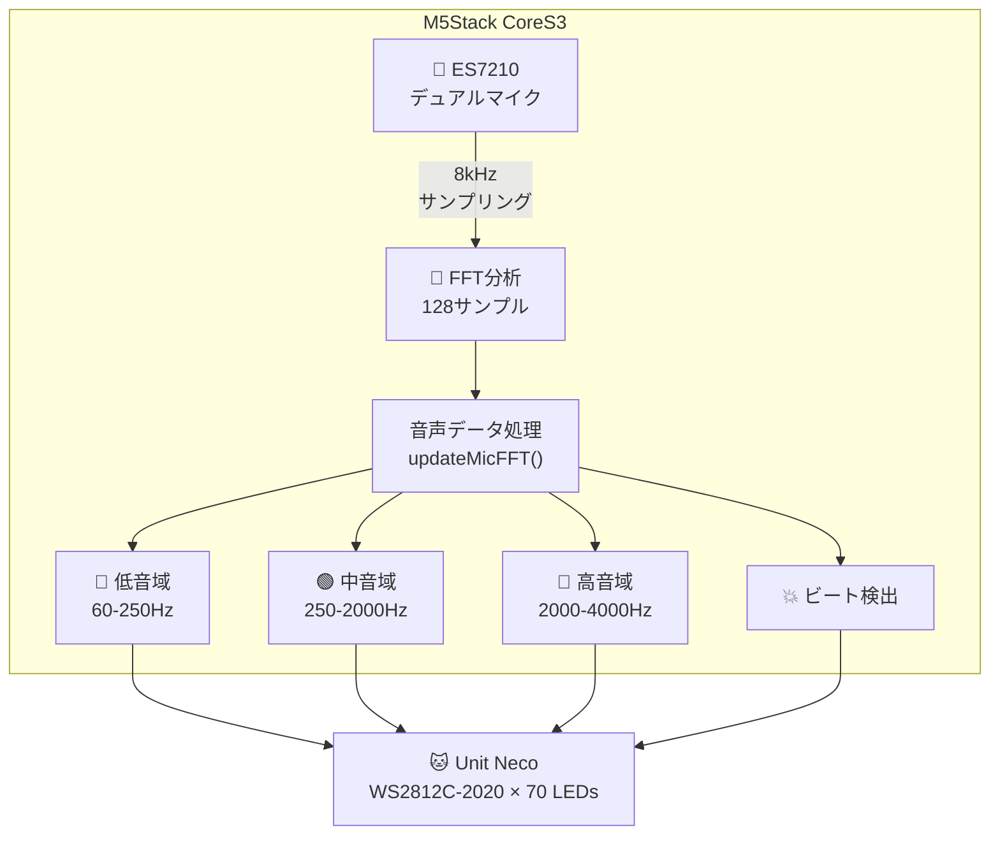
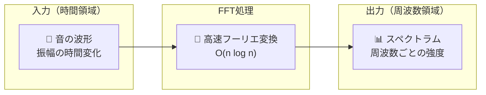
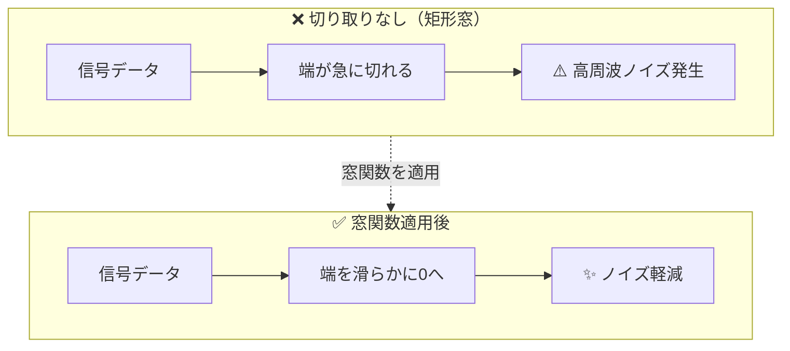

## はじめに 👋

この記事は、以下の記事の続編です：

- 📕 [M5Stack Unit Heartを使おう](https://zenn.dev/tomokusaba/articles/7c15f30e0f0318)
- 📗 [M5Stack Unit Necoを使おう](https://qiita.com/tomokusaba/items/a90d4273f8e8d74781d0)
- 📘 [M5Stack CoreS3のIMUセンサーでUnit NecoのLEDを制御しよう](https://qiita.com/tomokusaba/items/eb9d37fefc0af8fc9afa)

今回は、**M5Stack CoreS3に内蔵されているマイク（ES7210オーディオコーデック）** を活用して、**音声をFFT分析し、Unit NecoのLEDをリアルタイムに変化させる** 実験を行いました！🎵🐱

音楽に合わせて猫耳LEDがビートに反応し、低音・中音・高音で色が変わる...そんな楽しいインタラクションを実現しています！✨

## 今回のゴール 🎯

**M5Stack CoreS3のマイクとFFT分析を使って：**

- 🎸 **低音域（60-250Hz）** → **赤系LED**でキック/ベースを視覚化
- 🎹 **中音域（250-2000Hz）** → **緑系LED**でボーカル/ギターを表現
- 🥁 **高音域（2000-4000Hz）** → **青系LED**でハイハット/シンバルを表示
- 💥 **ビート検出** → LEDを**フラッシュ**させてリズムを強調

音を視覚的なフィードバックに変換して、まるでイコライザーのような猫耳を作ります！🎧

## 使用機材 🛠️

| 機材 | 説明 |
|------|------|
| 🖥️ M5Stack CoreS3 | ES7210オーディオコーデック（デュアルマイク）内蔵 |
| 🐱 Unit Neco | WS2812C-2020 RGB LED搭載の猫耳型ユニット（1枚あたり35個、2枚セットで70個） |
| 🔌 Grove ケーブル | 接続用 |

## アーキテクチャ図 📊



## Unit Necoの接続 🔌

Unit NecoをCoreS3に接続する際のポート設定について説明します。

### Unit Necoのピンマップ

| ピン | 機能 |
|------|------|
| GND | グランド |
| 5V | 電源 |
| DATA | LEDデータ信号 |
| BTN | タクトスイッチ |

### CoreS3のポートとピン対応

Unit NecoのDATAピンは、接続するポートによって異なるGPIOに対応します：

| 接続ポート | DATAピン | コードでの設定 |
|-----------|----------|----------------|
| PORT.A | G2 | `#define PIN 2` |
| PORT.B | G9 | `#define PIN 9` |
| PORT.C | G17 | `#define PIN 17` |

:::message
今回のサンプルコードでは**PORT.A（G2）**に接続しています。他のポートを使う場合は必ず`PIN`の値を変更してください！
:::

:::message alert
**LEDの焼損に注意！**
全点灯状態を長時間続けるとLEDが焼損する恐れがあります。輝度は**20前後**に設定することを強く推奨します。
```cpp
pixels.setBrightness(20);  // 推奨値
```
:::

## ステップ 1: マイクとFFTの基礎知識 🎓

### M5Stack CoreS3 のマイクについて

CoreS3には、ES7210オーディオコーデックが搭載されており、高品質なデュアルマイク入力が可能です：

| センサー | チップ | 機能 | I2Cアドレス |
|---------|--------|------|-------------|
| 🎤 オーディオコーデック | ES7210 | デュアルマイク入力 | 0x40 |

### FFT（高速フーリエ変換）とは？ 🎵

FFTは、時間領域の信号を周波数領域に変換する技術です。簡単に言うと、「音の波形」を「どの周波数がどれくらい強いか」に変換します。



### フーリエ変換の数学的背景 📐

フーリエ変換は、**任意の周期信号は、異なる周波数の正弦波の重ね合わせで表現できる**という考えに基づいています。

#### 離散フーリエ変換（DFT）の式

$$
X[k] = \sum_{n=0}^{N-1} x[n] \cdot e^{-j \frac{2\pi kn}{N}}
$$

| 記号 | 意味 |
|------|------|
| $x[n]$ | 入力信号（時間領域のサンプル） |
| $X[k]$ | 出力（周波数領域の成分） |
| $N$ | サンプル数 |
| $k$ | 周波数ビンのインデックス |
| $e^{-j\theta}$ | オイラーの公式 $\cos\theta - j\sin\theta$ |

#### なぜ「高速」フーリエ変換なの？ ⚡

通常のDFTは計算量が $O(N^2)$ ですが、FFTは**バタフライ演算**という巧妙なアルゴリズムで $O(N \log N)$ に削減しています。

| サンプル数 | DFT ($N^2$) | FFT ($N \log N$) | 高速化率 |
|-----------|-------------|------------------|----------|
| 128 | 16,384 | 896 | **18倍** |
| 256 | 65,536 | 2,048 | **32倍** |
| 1024 | 1,048,576 | 10,240 | **102倍** |

:::message
**なぜサンプル数は2のべき乗？** 🤔

FFTのバタフライ演算は、データを半分ずつ分割して再帰的に計算します。そのため、サンプル数が2のべき乗（64, 128, 256...）だと最も効率的に動作します。今回は**128サンプル**を使用しています。
:::

### 窓関数（Window Function）の役割 🪟

FFTを行う前に「窓関数」を適用することが重要です。

#### なぜ窓関数が必要？

音声信号は連続していますが、FFTは**有限長のデータ**を処理します。信号を「切り取る」と、切り取った端で不連続性が生じ、本来存在しない周波数成分（**スペクトル漏れ**）が発生します。



| 状態 | 信号の端 | 結果 |
|------|---------|------|
| 🔴 矩形窓（窓関数なし） | 急激に切断される | スペクトル漏れが発生 |
| 🟢 窓関数適用 | 滑らかに0へ減衰 | ノイズが軽減される |

#### 代表的な窓関数

| 窓関数 | 特徴 | 用途 |
|--------|------|------|
| **Hamming** | バランスが良い | 🎵 音声分析（今回使用） |
| Hanning | Hammingより滑らか | 一般的な信号処理 |
| Blackman | サイドローブが小さい | 高精度な周波数分析 |
| 矩形（なし） | 周波数分解能が最高 | 単一周波数の検出 |

```cpp
// 今回のコードでの窓関数適用
FFT.windowing(FFTWindow::Hamming, FFTDirection::Forward);
```

### FFTの出力を理解する 📊

FFTの出力は**複素数**です。実部と虚部から**振幅（マグニチュード）**を計算します。

$$
|X[k]| = \sqrt{Re(X[k])^2 + Im(X[k])^2}
$$

```cpp
// 複素数から振幅を計算
FFT.complexToMagnitude();
// これにより vReal[] に各周波数ビンの振幅が格納される
```

#### 周波数ビンと実際の周波数の関係

各ビンが表す周波数は以下の式で計算できます：

$$
f_k = k \times \frac{f_s}{N}
$$

| 記号 | 意味 | 今回の値 |
|------|------|----------|
| $f_k$ | ビン $k$ の周波数 | - |
| $k$ | ビンのインデックス | 0, 1, 2, ... 63 |
| $f_s$ | サンプリング周波数 | 8000 Hz |
| $N$ | サンプル数 | 128 |

**例**: ビン幅 = 8000 / 128 = **62.5 Hz**
- ビン1 → 62.5 Hz
- ビン4 → 250 Hz（低音域の上限付近）
- ビン32 → 2000 Hz（中音域の上限付近）

### 周波数帯域と音の関係 🎼

| 帯域 | 周波数範囲 | 代表的な音 | LED色 |
|------|-----------|-----------|-------|
| 🔴 低音域 | 60-250Hz | キック、ベース、バスドラム | 赤 |
| 🟢 中音域 | 250-2000Hz | ボーカル、ギター、ピアノ | 緑 |
| 🔵 高音域 | 2000-4000Hz | ハイハット、シンバル、シャープな音 | 青 |

## ステップ 2: FFT設定とマイク初期化 🔧

### 必要なライブラリ

```cpp
#include <M5CoreS3.h>
#include <Adafruit_NeoPixel.h>
#include <arduinoFFT.h>  // 🎵 FFTライブラリ
```

### FFT関連の定数と変数

```cpp
// 🎤 マイク＋FFT関連
#define SAMPLES 128              // FFTサンプル数（メモリ削減のため128に）
#define SAMPLING_FREQ 8000       // サンプリング周波数 (Hz)

// FFT用配列（staticでグローバルに、floatでメモリ削減）
static float vReal[SAMPLES];
static float vImag[SAMPLES];
ArduinoFFT<float> FFT = ArduinoFFT<float>(vReal, vImag, SAMPLES, SAMPLING_FREQ);

// 🎤 マイクバッファ
static int16_t micBuffer[SAMPLES];

// 🎵 音声分析結果
float bassLevel = 0;             // 低音域 (0~1)
float midLevel = 0;              // 中音域 (0~1)
float highLevel = 0;             // 高音域 (0~1)
float overallVolume = 0;         // 全体音量 (0~1)
float beatDetected = 0;          // ビート検出
```

### マイクの初期化

```cpp
// 🎤 マイク初期化 (ES7210 オーディオコーデック)
Serial.println("🎤 Initializing Microphone (ES7210)...");
auto mic_cfg = M5.Mic.config();
mic_cfg.sample_rate = SAMPLING_FREQ;
mic_cfg.dma_buf_count = 4;
mic_cfg.dma_buf_len = 256;
M5.Mic.config(mic_cfg);

if (M5.Mic.begin()) {
    micReady = true;
    Serial.println("✅ Microphone ready! (ES7210 @ 0x40)");
    Serial.print("   Sample Rate: ");
    Serial.print(SAMPLING_FREQ);
    Serial.println(" Hz");
} else {
    micReady = false;
    Serial.println("⚠️ Microphone init failed");
}
```

:::message
**サンプリング周波数の選び方** 🤔

- **ナイキスト定理**: サンプリング周波数は、取得したい最高周波数の2倍以上必要
- 4000Hzまでの高音を取得したいので、8000Hz以上が必要
- メモリとCPU負荷を考慮して**8000Hz**を選択
:::

## ステップ 3: FFT分析の実装 🎵

### マイクからサンプリングしてFFT分析

```cpp
// 🎤 マイクからサンプリングしてFFT分析
void updateMicFFT() {
    if (!micReady) {
        // マイクが準備できていない場合はダミーデータ
        bassLevel = 0.1f;
        midLevel = 0.1f;
        highLevel = 0.1f;
        return;
    }
    
    // M5CoreS3の内蔵マイク (ES7210) から取得
    if (!M5.Mic.record(micBuffer, SAMPLES, SAMPLING_FREQ, false)) {
        return;
    }
    
    // 録音完了を待つ（タイムアウト付き）
    uint32_t waitStart = millis();
    while (M5.Mic.isRecording()) {
        if (millis() - waitStart > 100) {
            Serial.println("⚠️ Mic timeout");
            return;
        }
        delay(1);
    }
    
    // FFT用データに変換
    for (int i = 0; i < SAMPLES; i++) {
        vReal[i] = (float)micBuffer[i];
        vImag[i] = 0;
    }
    
    // FFT実行 🎵
    FFT.windowing(FFTWindow::Hamming, FFTDirection::Forward);
    FFT.compute(FFTDirection::Forward);
    FFT.complexToMagnitude();
```

### 周波数帯域ごとの強度を計算

```cpp
    // 周波数帯域ごとの強度を計算
    float binWidth = (float)SAMPLING_FREQ / SAMPLES;  // 約62.5Hz/bin
    
    float bassSum = 0, midSum = 0, highSum = 0;
    int bassCount = 0, midCount = 0, highCount = 0;
    
    for (int i = 2; i < SAMPLES / 2; i++) {  // DC成分をスキップ
        float freq = i * binWidth;
        float magnitude = vReal[i];
        
        if (freq >= 60 && freq < 250) {
            bassSum += magnitude;
            bassCount++;
        } else if (freq >= 250 && freq < 2000) {
            midSum += magnitude;
            midCount++;
        } else if (freq >= 2000 && freq < 4000) {
            highSum += magnitude;
            highCount++;
        }
    }
    
    // 平均値を計算して正規化 (0~1)
    float newBass = bassCount > 0 ? bassSum / bassCount / 5000.0f : 0;
    float newMid = midCount > 0 ? midSum / midCount / 4000.0f : 0;
    float newHigh = highCount > 0 ? highSum / highCount / 3000.0f : 0;
    
    // スムージング（急な変化を抑える）
    bassLevel = bassLevel * 0.7f + constrain(newBass, 0, 1) * 0.3f;
    midLevel = midLevel * 0.7f + constrain(newMid, 0, 1) * 0.3f;
    highLevel = highLevel * 0.7f + constrain(newHigh, 0, 1) * 0.3f;
    
    // 全体音量
    overallVolume = (bassLevel + midLevel + highLevel) / 3.0f;
}
```

:::message
**FFTの周波数ビンについて** 📊

- **ビン幅** = サンプリング周波数 / サンプル数 = 8000 / 128 ≒ **62.5Hz**
- つまり、各ビンは62.5Hz刻みの周波数を表す
- ビン0はDC成分（直流）なのでスキップ
- ビン1は0-62.5Hz、ビン2は62.5-125Hz...と続く
:::

## ステップ 4: ビート検出アルゴリズム 🥁

単なる音量の変化だけでなく、**適応的な閾値**を使ってビートを正確に検出します。

### ビート検出用の変数

```cpp
// 🥁 ビート検出改善用（エネルギー履歴）
#define BEAT_HISTORY_SIZE 16     // 履歴サイズ
float bassHistory[BEAT_HISTORY_SIZE];  // 低音域の履歴
float midHistory[BEAT_HISTORY_SIZE];   // 中音域の履歴（スネア用）
int bassHistoryIndex = 0;        // 履歴インデックス
float bassAverage = 0;           // 低音域の平均
float bassVariance = 0;          // 低音域の分散
float beatThreshold = 0.2f;      // 適応的閾値
bool useSnareMode = false;       // スネアモード
float bpm = 0;                   // 推定BPM
```

### 適応的ビート検出の実装

```cpp
// 🥁 改善されたビート検出アルゴリズム（キック＋スネア対応）

// 1. 低音域・中音域の履歴を更新
bassHistory[bassHistoryIndex] = bassLevel;
midHistory[bassHistoryIndex] = midLevel;
bassHistoryIndex = (bassHistoryIndex + 1) % BEAT_HISTORY_SIZE;

// 2. 低音域の平均と分散を計算
float bassHistSum = 0, bassSumSq = 0;
for (int i = 0; i < BEAT_HISTORY_SIZE; i++) {
    bassHistSum += bassHistory[i];
    bassSumSq += bassHistory[i] * bassHistory[i];
}
bassAverage = bassHistSum / BEAT_HISTORY_SIZE;
bassVariance = (bassSumSq / BEAT_HISTORY_SIZE) - (bassAverage * bassAverage);

// 3. スネアモード判定（低音が常に高く変化が少ない場合）
float bassStdDev = sqrt(max(0.0f, bassVariance));
useSnareMode = (bassAverage > 0.35f && bassStdDev < 0.06f);

// 4. 適応的閾値を計算
beatThreshold = bassAverage + bassStdDev * 0.8f + 0.01f;
```

### キックモードとスネアモードの切り替え

```cpp
// 5. ビート検出
float bassDiff = bassLevel - prevBassLevel;
float midDiff = midLevel - prevMidLevel;
uint32_t timeSinceLastBeat = millis() - lastBeatTime;

bool isBeat = false;

if (useSnareMode) {
    // 🥁 スネアモード: 中音域の変化で検出
    if (midLevel > midThreshold && midDiff > 0.015f && timeSinceLastBeat > 120) {
        isBeat = true;
    }
} else {
    // 🥁 キックモード: 低音域の変化で検出
    if (bassLevel > beatThreshold && bassDiff > 0.015f && timeSinceLastBeat > 120) {
        isBeat = true;
    }
}

// 追加: 強めの中音域のスパイクもビートとして検出
if (!isBeat && midDiff > 0.08f && timeSinceLastBeat > 100) {
    isBeat = true;
}
```

:::message
**なぜ2つのモードがあるの？** 🤔

- **キックモード**: 低音のキック/バスドラムでビートを取る（EDM、ロックなど）
- **スネアモード**: 低音が常に鳴っている曲では、中音域のスネアでビートを取る（ヘビーなベースライン曲）

内蔵マイクの特性を考慮して低音を比較的拾いやすい傾向あり。

曲のタイプを自動判定して切り替えることで、様々なジャンルに対応！🎵
:::

### BPM推定

```cpp
if (isBeat) {
    beatDetected = 1.0f;
    
    // BPM計算用にビート時刻を記録
    beatTimes[beatTimeIndex] = millis();
    beatTimeIndex = (beatTimeIndex + 1) % 8;
    beatCount++;
    
    // BPM計算（8回以上のビートがあれば）
    if (beatCount >= 8) {
        uint32_t totalInterval = 0;
        int validIntervals = 0;
        for (int i = 0; i < 7; i++) {
            int idx1 = (beatTimeIndex + i) % 8;
            int idx2 = (beatTimeIndex + i + 1) % 8;
            uint32_t interval = beatTimes[idx2] - beatTimes[idx1];
            // 異常値を除外（150-1500ms = 40-400BPM）
            if (interval > 150 && interval < 1500) {
                totalInterval += interval;
                validIntervals++;
            }
        }
        if (validIntervals > 0) {
            float avgInterval = (float)totalInterval / validIntervals;
            bpm = 60000.0f / avgInterval;
        }
    }
    lastBeatTime = millis();
} else {
    // フェードアウト
    beatDetected *= 0.85f;
}
```

## ステップ 5: LEDエフェクトの実装 🐱

### マイクエフェクト（スペクトラム風）

```cpp
// 🎤 マイクエフェクト（スペクトラム風）
static float micHueOffset = 0;
void effectMic() {
    updateIMUColor();  // IMUも更新
    updateMicFFT();    // マイク＋FFT更新
    
    micHueOffset += 0.5f + overallVolume * 2.0f;  // 音量で回転速度変化
    
    // LEDを周波数帯域で色分け
    for (int i = 0; i < NUMPIXELS; i++) {
        float pos = (float)i / NUMPIXELS;
        
        // 位置に応じて周波数帯域の影響を変える
        float bassInfluence, midInfluence, highInfluence;
        
        if (pos < 0.33f) {
            // 下部: 低音域メイン
            bassInfluence = 1.0f;
            midInfluence = 0.3f;
            highInfluence = 0.1f;
        } else if (pos < 0.66f) {
            // 中部: 中音域メイン
            bassInfluence = 0.3f;
            midInfluence = 1.0f;
            highInfluence = 0.3f;
        } else {
            // 上部: 高音域メイン
            bassInfluence = 0.1f;
            midInfluence = 0.3f;
            highInfluence = 1.0f;
        }
        
        // 各帯域の強度を合成
        float localLevel = bassLevel * bassInfluence + 
                          midLevel * midInfluence + 
                          highLevel * highInfluence;
        localLevel = constrain(localLevel, 0, 1);
        
        // 色相: 低音=赤(0), 中音=緑(85), 高音=青(170)
        int hue;
        if (bassInfluence > midInfluence && bassInfluence > highInfluence) {
            hue = (int)(micHueOffset + 0) % 256;    // 赤系
        } else if (midInfluence > highInfluence) {
            hue = (int)(micHueOffset + 85) % 256;   // 緑系
        } else {
            hue = (int)(micHueOffset + 170) % 256;  // 青系
        }
        
        // ビート検出時は白くフラッシュ
        float brightness = localLevel * 0.8f + 0.1f;
        float saturation = imuSaturation;
        
        if (beatDetected > 0.3f && pos < 0.5f) {
            brightness = min(1.0f, brightness + beatDetected * 0.5f);
            saturation = max(0.3f, saturation - beatDetected * 0.3f);
        }
        
        pixels.setPixelColor(i, hsvToColor(hue, saturation, brightness));
    }
}
```

### 他のエフェクトへのマイク統合

既存のエフェクトにもマイクの影響を追加しています：

| エフェクト | マイクの影響 |
|-----------|-------------|
| 🌊 CHASE | 尾の長さとスピードが音量で変化 |
| 💡 BLINK | ビート検出で強制点灯 |
| 🌈 RAINBOW | 音量で回転速度が変化 |
| ✨ SPARKLE | キラキラの量が音量で増減 |
| 💨 BREATHE | 呼吸速度が音量で変化、ビートでリセット |
| 🎉 PARTY | 点灯確率が音量で変化 |

```cpp
// 例: 🌊 チェイス（流れる光）+ マイク
void effectChase() {
    updateMicFFT();    // 🎤 マイク更新
    
    // 🎤 マイクで尾の長さとスピードが変化
    int trailLen = 8 + (int)(bassLevel * 12);  // 8～20
    int speed = 1 + (int)(overallVolume * 3);   // 1～4
    
    // 🥁 ビート時にフラッシュ
    if (beatDetected > 0.3f && i < 3) {
        brightness = min(1.0f, brightness + beatDetected * 0.5f);
    }
    // ...
}
```

## ステップ 6: デバッグUI 📺

リアルタイムで音声分析の状態を確認できるUIを実装しました。

### デバッグ表示関数

```cpp
// 🎤 マイクデバッグ情報を描画
void drawMicDebug() {
    M5.Lcd.fillRect(0, 55, 320, 90, BLACK);
    
    // マイク状態
    M5.Lcd.setTextColor(micReady ? GREEN : RED);
    M5.Lcd.print("MIC: ");
    M5.Lcd.print(micReady ? "OK" : "NG");
    
    // ビート検出インジケータ
    M5.Lcd.setTextColor(beatDetected > 0.3f ? YELLOW : DARKGREY);
    M5.Lcd.print("BEAT");
    
    // BPM表示
    M5.Lcd.setTextColor(MAGENTA);
    M5.Lcd.print("BPM:");
    M5.Lcd.print((int)bpm);
    
    // === 周波数帯域バー表示 ===
    // 🔴 低音 (Bass)
    int bassWidth = (int)(bassLevel * barMaxWidth);
    M5.Lcd.fillRect(45, barY, bassWidth, barHeight, RED);
    
    // 🟢 中音 (Mid)
    int midWidth = (int)(midLevel * barMaxWidth);
    M5.Lcd.fillRect(45, barY, midWidth, barHeight, GREEN);
    
    // 🔵 高音 (High)
    int highWidth = (int)(highLevel * barMaxWidth);
    M5.Lcd.fillRect(45, barY, highWidth, barHeight, BLUE);
}
```

## 動作確認 🎬

1. M5Stack CoreS3にUnit Necoを接続
2. スケッチを書き込んで起動
3. タッチスクリーンで「MIC」モードを選択
4. 音楽を流すとLEDが反応！🎵
5. ビートに合わせてフラッシュ、低音で赤、高音で青が光る！

## まとめ 📝

今回は、M5Stack CoreS3の内蔵マイクとFFT分析を使って、音声をリアルタイムに視覚化するプロジェクトを作成しました！

### 学んだこと

- 🎤 **ES7210オーディオコーデック**の初期化と使用方法
- 🎵 **FFT（高速フーリエ変換）** で時間領域→周波数領域への変換
- 📊 **周波数帯域分析**（低音・中音・高音の分離）
- 🥁 **適応的ビート検出**（キックモード/スネアモードの自動切り替え）
- 🌈 **音声→LED色変換**のマッピング手法

### 完成したコード

完成したソースコードは以下で公開しています：

https://github.com/tomokusaba/m5stack/blob/main/M5StackS3/Mic/Sample1.ino

### 次のステップ

- 🎯 より精密なビート検出（機械学習ベース）
- 🎨 ユーザーカスタマイズ可能なカラーマッピング
- 📱 スマホアプリとの連携
- 🔊 スピーカー出力との同期

音を視覚化することで、新しいインタラクションの可能性が広がりますね！👋🤟

🎧 ぜひ、お気に入りの音楽で猫耳LEDをパーティーモードにしてみてください！🐱✨
