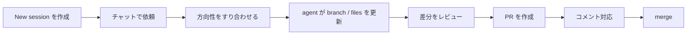

## はじめに

GitHub Copilot app は執筆時点で technical preview ですが、**GitHub 上の仕事を起点に、エージェントへ依頼し、そのまま Pull Request の作成とマージまで進めやすい**のが大きな特徴です。私は前回までの記事で、GitHub Copilot app の全体像や、日々の摩擦が減る感覚について書いてきました。🧭

- [GitHub Copilot app の Technical Preview で、エージェント開発のワークフローはどう変わるのか](https://zenn.dev/tomokusaba/articles/c118522032e064)
- [GitHub Copilot app を使って感じた、日々の摩擦が減る4つのこと](https://zenn.dev/tomokusaba/articles/fd382738fee5e3)

今回はそこから一歩進めて、**実際に 1 つの作業をチャットから始めて、PR を作り、必要ならレビュー対応も app の中で回し、最後に merge まで持っていく** という流れを、1 本のユースケースとして整理します。

題材は、この Zenn リポジトリに **GitHub Copilot app に関する新規記事を追加する** という作業です。コード修正に限らず、Markdown やドキュメント更新でも同じ流れで扱えるので、最初のユースケースとしても分かりやすいと思います。✍️

:::message alert
GitHub Copilot app は執筆時点では technical preview です。画面や用語、できることは今後変わる可能性があります。また、Pull Request の merge 可否はリポジトリの保護ルールや必要レビュー数に依存します。
:::

## 本記事のゴール

- GitHub Copilot app で **新しい session を作るところ** から始める
- チャットでエージェントに作業を依頼するときの **粒度** を確認する
- 変更レビュー、PR 作成、レビュー対応、merge までの流れを 1 本でつなげる
- どこを人間が握り、どこをエージェントに任せると気持ちよいかを整理する

## 今回扱うユースケース

今回は、GitHub Copilot app のチャットから次のような依頼を出して、記事追加の作業を進める想定です。

```text
GitHub Copilot app に関する新しい Zenn 記事を追加してください。

記事の内容を詳細に書く！！

```

ポイントは、**「何を作るか」だけでなく「どこまでやってほしいか」も先に書く** ことです。実装だけなのか、PR の説明文まで含めるのか、レビューコメント対応まで期待するのかを最初に入れておくと、セッション全体のぶれが減ります。

フローにすると、だいたい次のようになります。



この記事では、**chat → agent が作業 → PR → review → merge** の順で追っていきます。最初に全体像を掴んでおくと、各 Step で「どこを人間が判断し、どこをエージェントに任せるか」が見やすくなります。

## 前提条件

- ✅ GitHub Copilot app を使えること  
  Business / Enterprise では preview features と Copilot CLI の有効化が必要で、Pro / Pro+ では waitlist 経由でアクセスが案内されています。
- ✅ 対象リポジトリを app に接続済みであること
- ✅ ブランチ作成、Pull Request 作成、merge ができる権限を持っていること
- ✅ 今回は **新しい branch / worktree を切って安全に進めたい** ので、session 作成時は new worktree を選ぶ前提で進めます

GitHub Docs では、GitHub Copilot app は **Windows / macOS / Linux** をサポートし、各 session は独立した workspace として動くと説明されています。この「最初から隔離されている」前提が、PR まで運ぶ流れと相性がよいです。🚀

## Step 1: 新しい session を作る

まずは sidebar の **Sessions** から新しい session を作ります。GitHub Copilot app では、Quick chat と session が分かれています。**ブランチや worktree を持たずに相談だけしたいなら Quick chat**、**実際にファイルを変えるなら session** と覚えると分かりやすいです。


Docs の getting started と agent sessions では、新しい session を始めるときに次を選ぶ流れが案内されています。

| 項目 | 今回のおすすめ | 理由 |
|------|----------------|------|
| 🗂️ Repository | 記事を置いているリポジトリ | 文脈を最初から固定したい |
| 🌿 Workspace | New worktree | 変更を隔離しやすい |
| 🤝 Session mode | Plan | 先に方針を確認したい |
| 🧠 Model / Reasoning | 迷ったら標準寄り | 長文生成では安定性を優先しやすい |

記事作成では、私は **Interactive mode で始める** ことが多いです。書きながら方向性を少しずつ寄せたり、見出しや言い回しをその場で調整したりしやすいからです。

## Step 2: チャットで依頼を渡す

session を開いたら、prompt 欄に依頼を書きます。app では prompt 欄の上で **mode / model / reasoning effort** をまとめて選べるので、ここで「今回はどれくらい自律的に任せるか」を決められます。


ここで大事なのは、記事の内容をできるだけ詳細に指示することです。

記事の内容を決めるものです。自分の思いやポイント、気づきをここにすべて乗せていきましょう。文体や事実確認などはGitHub Copilotがやってくれるとはいえ（十分にエージェントやスキルが整備されていれば）ブログの内容を決めるのは筆者であるあなた自身です。最後の責任を持つのは筆者自身です。

## Step 3: 方向性をすり合わせて、人間が握るポイントを決める

GitHub Docs では、session mode は **Interactive / Plan / Autopilot** の 3 つが案内されています。

| モード | 向いている場面 | 今回の使いどころ |
|------|----------------|------------------|
| 🤝 Interactive | 一緒に文章や方針を詰めたい | 記事作成ではいちばん使いやすい |
| 📋 Plan | 先に方針を確認したい | 大きなリライトや構成整理向き |
| 🚀 Autopilot | 定型作業をまとめて任せたい | 仕上げや定型修正が固まっているとき |

今回のような記事追加なら、私は **Interactive で書き始めて、必要なら途中で方向を戻す** 進め方が多いです。記事は実際に文を出しながら調整したいことが多いので、最初から Plan を厳密に固めるより、このほうがしっくりきます。

そのうえで、最初の往復では次の観点を見ます。

- どのファイルを新規作成する想定か
- どの過去記事や GitHub Docs を参照するつもりか
- 画像をどこで使うか
- 最後に PR 作成まで含めるつもりか

ここでズレがなければ、そのまま本文作成に進めます。逆に、「構成はよいがトーンはもう少し実体験寄りにしたい」といった要望があれば、この段階で返したほうが手戻りが少ないです。

:::message
agent sessions の docs では、session mode は途中で変更できます。最初に Interactive で入り、必要に応じて Plan や Autopilot へ寄せる運用もできます。
:::

方向性が固まったら、次は agent に実際の作業を任せます。差分が出たあとで PR 作成に進む、という 2 段階に分けて見ると流れを追いやすいです。

## Step 4: agent に実際の作業をさせる

エージェントが作業を進めると、session の中で **branch / files / conversation** がまとまって見えるので、今どこまで進んだかを追いやすいです。ここが、単なるチャットと違って「仕事の器」だと感じるところです。

また、この段階では右上に **Open** ボタンが出るので、必要ならそのまま VS Code を開いて手元で作業内容を確認できます。アプリ内だけで追うこともできますが、**手元のエディタで Markdown やコードをじっくり見たいときの逃げ道が最初からある** のは安心感があります。


今回のユースケースなら、私は次の順で見ます。

1. article ファイルの front matter が揃っているか
2. 見出し構成と本文のトーンが既存記事と合っているか
3. 画像参照やリンクが崩れていないか
4. 余計なファイルを触っていないか
5. 内容が書きたい内容とあっているか

さらに、右パネルを展開すると app 内でも差分を確認できます。軽い確認ならこのまま進められるので、**毎回 VS Code へ切り替えなくても、チャットと差分確認を同じ画面で往復しやすい** です。

ここで必要に応じて手作業で校正します。


この段階では、まだ PR を作る前の **作業フェーズ** です。差分が揃ってきたら、次の Step で Pull Request に載せます。

## Step 5: Pull Request を作成してレビューに載せる

差分がまとまったら、そのまま app 内で Pull Request を作成します。GitHub Docs の workflow でも、**review → create pull request → merge** までが 1 本の流れとして見えるのが特徴です。

実際には、何回かチャットを往復して内容を完成させてから、右上の **Create PR** ボタンを押す流れになります。メニューには **Create PR** だけでなく **Create draft PR** や **Agent Merge** も並ぶので、今すぐレビューに載せるのか、まだ draft にするのか、あるいは merge まで見据えるのかをここで選べます。


特にうれしいのは、ここで **「チャットして終わり」ではなく、そのまま出荷の手前まで持っていける** ことです。私はこれまで CLI でも似た流れを作ってきましたが、app だと session と PR が最初から近いので、移動が少なくて済みます。✅

ここから先は、PR 作成後の往復です。つまり、review コメントを見ながら、必要な修正を agent に返していくフェーズに入ります。

## Step 6: PR 作成後、review コメントに app から対応する

PR を作ったあとも、作業は終わりではありません。GitHub Docs の managing issues and pull requests では、PR 画面から review コメントへ対応する流れが案内されています。

- **Files changed** タブで差分を確認する
- 必要なら **Create session** で PR 専用の session を開く
- review comment に対して **Fix** を使って修正を依頼する

この流れがよいのは、**最初の実装 session と、PR 対応の session を分けられる** ことです。

たとえば記事作成でも、

- 本文ドラフトを書く session
- 指摘を受けて表現を直す session
- 画像やリンク切れだけを見る session

のように、役割を分けて扱えます。parallel workspaces の価値は、まさにこういうところで効きます。🗂️

## Step 7: 最後に merge まで閉じる

最後は merge です。ここも app の docs では 1 つの機能として切り出されています。**agent merge** を有効にすると、workspace の Copilot session が PR を読み、ブロッカーを直します。GitHub 側で merge 可能になった時点で、自動的に merge する流れです。

PR を作成したあと、右上の表示は **Create PR** から **Ready to merge** に変わります。つまり、session の中から「まだ PR を作っていない段階」なのか、「もう PR ができていて merge 判定に進める段階」なのかが見分けやすいです。


この表示を開くと、merge 直前の状態をまとめたダイアログが出ます。ここでは、**Ready to merge** と **review comment の状態** をまとめて見られます。今回の画面でも、未解決 review comment は 0 件で、merge requirements は満たしていることが分かります。


私はここを、**「最後の仕上げだけ自動化する」機能** として見ると分かりやすいと感じています。

向いていそうな場面は次のようなときです。

| 場面 | agent merge と相性 |
|------|--------------------|
| 🔁 軽微な修正で、レビュー観点が明確 | よい |
| 👀 人間が最終文面を細かく見たい | 先に自分でレビューしたほうが安心 |
| 🔐 保護ルールが厳しいリポジトリ | ルール確認が先 |

つまり、**merge を押す前の最終判断は人間が持ちつつ、ブロック解除後の追走を任せる** と考えると使いやすいです。特に、このダイアログで merge 条件をまとめて見られるので、最後に GitHub の PR 画面へ戻らなくても判断しやすいです。Docs によると agent merge はバックグラウンドで動き、app を再起動しても継続し、merge 後に自動で停止します。

## このユースケースで GitHub Copilot app が効く理由

実際にこの流れで考えると、GitHub Copilot app のよさは単に「チャットできる」ことではなく、**チャットを中心にしながら、その周辺にある branch、review、PR、merge までが同じ文脈に載っている** ことだと思います。

特に、次の 3 点が大きいです。

| 観点 | 何が楽になるか | 今回の例 |
|------|----------------|----------|
| 🧭 入口 | repository と session を先に決められる | 記事リポジトリに迷わず入れる |
| 🧠 文脈保持 | 会話と差分が同じ場所に残る | どの指示でどの文章になったか追いやすい |
| ✅ 出荷導線 | PR と merge までつながる | 「下書き作成」で止まりにくい |

私は以前の記事で、GitHub Copilot app は **作業に入るまで** と **複数作業をさばくとき** の摩擦を減らしやすいと書きました。今回のユースケースで特に実感するのは、その先の **「出すところまで一気につながる」** 感覚です。

## おわりに

GitHub Copilot app を使うと、チャットから始めた作業を **session として隔離し、差分をレビューし、PR を作り、必要ならコメント対応を経て、最後は merge まで追える** ようになります。

今回の題材は Zenn 記事の追加でしたが、この流れはコード修正でもドキュメント更新でも同じです。むしろ、**「書かせる」だけでなく「着地させる」までの導線** が最初から見えているのが、GitHub Copilot app のいちばん面白いところだと感じています。

今回の流れを 1 行で言うと、**chat → agent が作業 → PR → review → merge** です。そして、人間は Plan の確認と最終判断を握り、agent は実作業と PR 更新を担います。この役割分担で見ると、GitHub Copilot app は単なるチャット UI ではなく、**仕事を 1 本の session として運び、Pull Request のライフサイクルまで閉じる道具** として理解しやすくなります。これから触るなら、まずは今回のように **1 つの具体的な作業を、チャットから PR 作成・merge まで通してみる** のがおすすめです。🛠️

## 参考リンク

- [About the GitHub Copilot app - GitHub Docs](https://docs.github.com/en/copilot/concepts/agents/github-copilot-app)
- [Getting started with the GitHub Copilot app - GitHub Docs](https://docs.github.com/en/copilot/how-tos/github-copilot-app/getting-started)
- [Working with agent sessions in the GitHub Copilot app - GitHub Docs](https://docs.github.com/en/copilot/how-tos/github-copilot-app/agent-sessions)
- [Managing issues and pull requests with the GitHub Copilot app - GitHub Docs](https://docs.github.com/en/copilot/how-tos/github-copilot-app/managing-issues-and-pull-requests)
- [Using scheduled workflows in the GitHub Copilot app - GitHub Docs](https://docs.github.com/en/copilot/how-tos/github-copilot-app/using-scheduled-workflows)
- [GitHub Copilot app の Technical Preview で、エージェント開発のワークフローはどう変わるのか](https://zenn.dev/tomokusaba/articles/c118522032e064)
- [GitHub Copilot app を使って感じた、日々の摩擦が減る4つのこと](https://zenn.dev/tomokusaba/articles/fd382738fee5e3)
