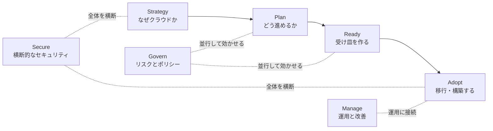
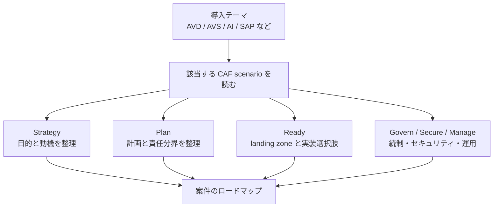

## はじめに

Azure の導入を考えるとき、最初に目に入りやすいのは「サブスクリプションをどう分けるか」「ネットワークをどう設計するか」「権限やポリシーをどう管理するか」といった、いわゆるクラウド導入の共通論点です。

もちろん、それらはとても重要です。ただ、Azure Cloud Adoption Framework（以下、CAF）を読んでいて私が面白いと感じるのは、CAF が単なる一般的な Azure 導入手順にとどまっていない点です。公式ドキュメントでは、Azure 採用と既存 IT 環境への統合を支援する structured roadmap（構造化されたロードマップ）として CAF が説明されており、Strategy / Plan / Ready / Adopt / Govern / Secure / Manage という 7 つの core methodologies（中心的な方法論）が整理されています。

さらに CAF には、Data、AI agents、AI adoption、Azure Virtual Desktop、Azure VMware Solution、Cloud-Scale Analytics、Oracle on Azure、SAP on Azure など、特定シナリオ向けのガイダンスも並んでいます。ここが、私には **「Azure 導入の教科書」から一歩進んだ、実案件に寄せたナビゲーション** のように見えます🧭

本記事では、CAF の基本構造を確認しつつ、特に「シナリオ別ガイダンスや reference architecture への導線が用意されていること」が、なぜ Azure 導入を検討する開発者・アーキテクト・技術リードにとって嬉しいのかを整理します。

:::message
本記事は Microsoft Learn の CAF ドキュメントをもとにした技術寄りの考察です。他クラウドのフレームワークを網羅的に比較したものではなく、私が CAF を読んで感じた特徴を中心にまとめています。
:::

## 本記事のゴール

- Azure Cloud Adoption Framework の全体像をざっくりつかむ
- CAF が公式に示す 7 つの methodology と common scenarios を、「方法論」と「シナリオ別ガイダンス」の二つの観点で整理する
- Azure 導入時に、CAF のシナリオ別ページをどう活用できそうかイメージする
- Governance / Security / Management を後付けにしない考え方を整理する

それではまず、CAF の基本構造から見ていきます。

## 背景：Azure 導入は「作って終わり」になりにくい

Azure 導入の相談では、最初に特定の技術テーマが立ち上がることが多いです。たとえば「基幹システムを移行したい」「VDI を Azure Virtual Desktop で構成したい」「AI 活用を進めたい」「VMware 環境を Azure に寄せたい」といった入口です。

一方で、実際に進めると、話題はすぐに横に広がります。ID、ネットワーク、サブスクリプション設計、ポリシー、監視、セキュリティ、運用体制、コスト管理などを一緒に考える必要があるためです。つまり Azure 導入は、単一サービスの設定手順だけでは完結しにくい取り組みです。

このとき CAF は、議論を整理するための共通言語として使えます。特に、方法論だけでなくシナリオ別ガイダンスが用意されているため、抽象的な導入論と具体的な案件の間を行き来しやすくなります。

この背景を踏まえたうえで、次に CAF の 7 つの methodology を見ていきます。

## CAF の基本構造

CAF の overview では、CAF は Azure 採用と既存 IT 環境への統合を支援する structured roadmap（構造化されたロードマップ）として説明されています。中心になるのは、次の 7 つの methodology（方法論）です。

| 種類 | Methodology | ざっくりした役割 |
|------|-------------|------------------|
| 🧭 Foundational | Strategy | ビジネス目標とクラウド施策を揃える |
| 🗺️ Foundational | Plan | 導入計画、運用モデル、責任分界を具体化する |
| 🏗️ Foundational | Ready | Azure landing zone など、受け皿を準備する |
| 🚚 Foundational | Adopt | 移行や新規構築を進める |
| ⚖️ Operational | Govern | リスク、ポリシー、コンプライアンスを継続的に扱う |
| 🔐 Operational | Secure | 導入全体を横断するセキュリティを扱う |
| 🛡️ Operational | Manage | 運用を構造化し、継続的に改善する |

公式ドキュメントでは、Strategy / Plan / Ready / Adopt を順に進める foundational methodologies としつつ、Govern / Secure / Manage は運用中に並行して扱う operational methodologies として整理されています。

この図のように、CAF は「Strategy から Adopt まで進めれば終わり」ではありません。導入前から Governance / Security / Management を織り込み、導入後も継続的に見直す前提になっています。

ここまでは、クラウド導入フレームワークとして非常に素直な構成です。次に、私が CAF らしいと感じているポイントを見ていきます。

## 私が CAF らしいと感じるポイント

CAF の特徴を一言で表すなら、私は **「抽象度の高い導入方法論」と「具体的なシナリオ別ガイダンス」の距離が近い** ことだと感じています。

ここでいう「シナリオ別の解き方」とは、案件テーマから Strategy / Plan / Ready / Govern / Secure / Manage などの論点へ展開する道筋のことです。単に「AVD の構成例を読む」「AI のチェックリストを読む」だけではなく、その案件を Azure 導入全体の文脈に置き直すための入口だと捉えています。

たとえば、Strategy ではビジネス目標と cloud initiatives の整合、動機や目的の整理、strategy team の形成、組織の準備などが扱われます。Plan では cloud adoption plan を作り、Build cloud-native と Migrate existing workloads の分岐、operating model、governance / security / management / AI responsibilities などを整理します。

Ready では Azure landing zone が推奨される starting point（出発点）として位置づけられ、Platform landing zone と Application landing zone の考え方が出てきます。さらに implementation options では、Bicep / Terraform による IaC accelerator や portal accelerator も示されています。

つまり CAF は、単に「戦略を作りましょう」「ガバナンスを考えましょう」と言うだけではなく、Azure 上でどう受け皿を作るか、どうアプリケーションチームにサブスクリプションを渡すか、といった実装寄りの話に接続しやすい構造になっています。

ここで見落としたくないのが、Azure 自体がエンタープライズ寄りの下支え機能を数多く持っていることです。Microsoft Entra ID や Azure RBAC による ID / 権限管理、Azure Policy によるガードレール、管理グループやサブスクリプションによる責任境界、Azure Monitor や Log Analytics による監視などは、単独の便利機能として存在しているだけではありません。CAF は、これらを **組織として Azure を使い続けるための設計要素** として位置づける役目も担っていると感じます。

| 観点 | 一般的な導入フレームワークで見がちな表現 | CAF で嬉しいと感じる点 |
|------|--------------------------------------|------------------------|
| 🧭 戦略 | クラウド導入の目的を整理する | Strategy methodology で motivations / mission / objectives まで落とし込む |
| 🏗️ 受け皿 | 標準環境を用意する | Azure landing zone、Platform / Application landing zone、実装オプションに接続できる |
| 🧱 基盤機能 | ID、ポリシー、監視を個別に設計する | Azure のエンタープライズ向け機能を、landing zone の設計領域として組み合わせて考えられる |
| ⚖️ 統制 | ガバナンスを設計する | Govern methodology で risk assessment、policy documentation / enforcement、compliance monitoring を継続プロセスとして扱う |
| 🔐 セキュリティ | セキュリティ要件を満たす | Secure methodology が strategy / planning / readiness / adoption / governance / operations を横断する |
| 🎯 個別案件 | 個別にリファレンスを探す | AVD、Azure VMware Solution、AI adoption、SAP on Azure などの scenario から入れる |

この「上から下までつながる」感じが、導入検討の初期段階でも実装直前の段階でも使いやすいところだと感じます。

:::message
ここでの比較は、特定の他社フレームワークを断定的に評価する意図ではありません。CAF を読んだときに、私が特に強く感じた相対的な使いやすさを整理しています。
:::

次は、この特徴がもっとも分かりやすく出ているシナリオ別ガイダンスを見ていきます。

## シナリオ別ガイダンスが「実案件への橋」になる

CAF の overview では、CAF scenarios として複数のシナリオが示されています。代表例として、Azure Virtual Desktop、Azure VMware Solution、AI adoption、SAP on Azure などがあります。

シナリオ別ページがあると何が嬉しいのでしょうか。私の感覚では、抽象的な methodology をチームが抱えている具体的な案件名に翻訳しやすくなります。

| シナリオ | CAF 内で扱われる内容の例 | 読者が得やすい効果 |
|----------|--------------------------|--------------------|
| 🖥️ Azure Virtual Desktop | CAF methodology、application landing zone accelerator、reference architectures、products、training modules など | VDI / DaaS 案件を Azure 導入全体の文脈に接続できる |
| 🧩 Azure VMware Solution | CAF methodology、reference architectures、featured products、Learn modules など | 既存 VMware 資産の移行を、単なるリフトではなく運用設計まで含めて考えやすい |
| 🤖 AI adoption | AI Strategy / Plan / Ready / Govern / Secure / Manage のチェックリスト | AI 導入を PoC で終わらせず、統制や運用まで含めて整理できる |
| 🧾 SAP on Azure | SAP における motivations と OKR など | 大規模基幹システムの移行目的を、ビジネス目標と紐づけやすい |

たとえば「Azure Virtual Desktop を導入したい」という相談が来たとき、いきなり製品構成やネットワーク設計から入ることもできます。しかし CAF のシナリオから入ると、「これは単なる AVD 構築ではなく、landing zone、ID、ネットワーク、ガバナンス、運用まで含むクラウド導入の一部だ」と捉え直しやすくなります。

同じことは AI adoption にも当てはまります。AI は PoC やアプリケーション実装の話に寄りがちですが、CAF では Strategy / Plan / Ready / Govern / Secure / Manage のチェックリストとして整理されています。これにより、技術検証だけでなく、責任分界やセキュリティ、運用体制の話に早い段階で接続できます。

シナリオ別ガイダンスは、抽象的なフレームワークを「自分たちの案件」に引き寄せる入口になります。ここが、CAF を読む価値を大きくしていると感じます。

そして、シナリオを実案件のロードマップに落とし込むときに特に効いてくるのが、次に見る Ready と landing zone です。

## Ready と landing zone が実装に近い

CAF の Ready methodology では、Azure landing zone が推奨される starting point（出発点）として説明されています。landing zone は、ワークロードを Azure に載せるための基盤です。

ここで重要なのは、CAF が landing zone を単なる概念説明で終わらせていない点です。Platform landing zone と Application landing zone の役割が整理され、implementation options では、Azure landing zone IaC accelerator、Azure Verified Modules、portal accelerator などの選択肢が示されています。

さらに、subscription vending のようなガイダンスでは、アプリケーションチーム向けに subscriptions をプログラムで発行する platform mechanism が扱われ、Bicep / Terraform modules も示されています。

| 領域 | 説明 | CAF から得られる示唆 |
|------|------|----------------------|
| 🏢 Platform landing zone | 組織共通のネットワーク、ID、ポリシー、監視などを支える基盤 | プラットフォームチームが責任を持つ領域を明確にしやすい |
| 📦 Application landing zone | 個別ワークロードやアプリケーションが利用する領域 | アプリケーションチームに渡す境界を設計しやすい |
| 🧾 Subscription vending | サブスクリプション発行を仕組み化する考え方 | 手作業の申請・払い出しから、プログラム可能なプラットフォームへ寄せやすい |
| 🛠️ IaC accelerator | Bicep / Terraform などによる実装支援 | 設計と実装のギャップを縮めやすい |

Azure の強みは、エンタープライズで必要になりやすい機能がサービスとして豊富に用意されていることです。ただし、機能が豊富であるほど、各案件がばらばらに ID、ポリシー、監視を設計してしまうリスクもあります。CAF の landing zone や design areas は、その豊富な機能群を「どのチームが責任を持つのか」「どこまでを共通基盤にするのか」「アプリケーションチームにはどの自由度を渡すのか」という設計に変換するための下支えになります。

このあたりは、開発者・アーキテクト・技術リードにとって特に重要です。クラウド導入は「方針を決める」だけでは進みません。チームが実際に使えるサブスクリプション、ネットワーク、ポリシー、監視、デプロイの仕組みまで落とし込む必要があります。

CAF はこの橋渡しを意識しており、方法論から Azure 上の実装パターンへ進みやすい構造になっていると感じます。

## Govern / Secure / Manage を後付けにしない

クラウド導入では、最初の移行や新規構築に注目が集まりがちです。しかし、運用が始まってから「ポリシーがない」「監視が足りない」「セキュリティ責任が曖昧」と気付くと、後から直すコストが大きくなります。

CAF では Govern / Secure / Manage が operational methodologies として整理されています。公式 overview では、これらは workload が Azure で稼働し始めた後の cloud operations を定義するものとして説明されています。

一方で、Plan methodology では governance / security / management の責任を早い段階で整理する導線があり、Secure methodology は strategy / planning / readiness / adoption / governance / operations を横断するものとして説明されています。つまり、運用が始まってから初めて考えるのではなく、計画段階から責任を整理し、運用中は継続的に見直す対象として読むのが安全です。

| Methodology | 公式ドキュメントで扱われる主な観点 | 後付けにしないための読み方 |
|-------------|----------------------------------|----------------------------|
| ⚖️ Govern | governance team、risk assessment、policy documentation / enforcement、compliance monitoring の継続プロセス | 「誰が何を判断し、どう継続監視するか」を早めに決める |
| 🔐 Secure | strategy / planning / readiness / adoption / governance / operations 全体にまたがる security guidance | セキュリティを単独工程ではなく、全体横断の関心事として扱う |
| 🛡️ Manage | RAMP（Ready, Administer, Monitor, Protect）で cloud operations を構造化 | 運用開始後の監視・保護・改善まで導入計画に含める |

特に開発者視点では、Govern や Manage は少し遠い話に見えることがあります。しかし実際には、どのサブスクリプションにデプロイできるか、どのポリシーで拒否されるか、ログをどこに出すか、インシデント時に誰が見るか、といった日々の開発体験に直結します。

:::message alert
CAF を「移行の手順書」としてだけ読むと、Govern / Secure / Manage の重要性を見落としやすくなります。導入計画の初期から、運用・統制・セキュリティを並行して読むのがおすすめです。
:::

ここまで見てくると、CAF はクラウド導入を「構築して終わり」にしないための枠組みとしても使えることが分かります。

## どこから読み始めるとよいか

CAF は範囲が広いため、最初からすべてを順番に読むと少し重く感じるかもしれません。私なら、次の順番で読み始めます。

1. **Overview** で 7 つの methodology と scenarios の存在を確認する
2. **Strategy** で、クラウド導入の動機とビジネス目標を整理する
3. **Plan** で、cloud adoption plan、operating model、責任分界を確認する
4. **Ready** で、Azure landing zone と implementation options を確認する
5. 自分の案件に近い **scenario** を読む
6. 最後に読むのではなく、並行して **Govern / Secure / Manage** を読む

導入テーマがはっきりしている場合は、先に scenario から入るのもよいと思います。たとえば AVD、Azure VMware Solution、AI adoption、SAP on Azure のように、すでに案件名が決まっているなら、シナリオ別ページから読んだ方が具体的な論点をつかみやすいです。

一方で、組織全体の Azure 導入方針を作る段階なら、Overview → Strategy → Plan → Ready の順に読むと、議論の土台を揃えやすくなります。

読者タイプ別に見ると、入り口は次のように変えてもよさそうです。

| 読者 | 読み始め方の例 | 理由 |
|------|----------------|------|
| 👩‍💻 開発者 | 自分の案件に近い scenario → Ready → subscription vending | どこにデプロイし、どの制約の中で開発するかを早めに把握しやすい |
| 🏗️ アーキテクト | Overview → Strategy → Plan → Ready | 全体設計、landing zone、責任分界を順に整理しやすい |
| 🧑‍✈️ 技術リード | Strategy / Plan と並行して Govern / Secure / Manage | チーム体制、統制、セキュリティ、運用を後付けにしにくい |

## おわりに

Azure Cloud Adoption Framework は、Azure 導入の全体像を整理するためのフレームワークです。ただ、私にとって特に印象的なのは、一般的な導入方法論に加えて、AVD、Azure VMware Solution、AI adoption、SAP on Azure など、特定シナリオ向けのガイダンスが用意されている点です。

この構造があることで、「クラウド導入とは何を考えるべきか」という抽象論と、「いま目の前の案件では何を確認すべきか」という具体論を行き来しやすくなります。

Azure 導入を検討している開発者・アーキテクト・技術リードの方は、まず Overview で全体像をつかみつつ、自分の案件に近い scenario を 1 つ読んでみるのがおすすめです。CAF の見え方が、単なる導入手順から、実案件を前に進めるための地図に変わるかもしれません☁️

## 参考リンク

- [Cloud Adoption Framework overview](https://learn.microsoft.com/en-us/azure/cloud-adoption-framework/overview?WT.mc_id=DT-MVP-5004827)
- [Strategy methodology](https://learn.microsoft.com/en-us/azure/cloud-adoption-framework/strategy/?WT.mc_id=DT-MVP-5004827)
- [Plan methodology](https://learn.microsoft.com/en-us/azure/cloud-adoption-framework/plan/?WT.mc_id=DT-MVP-5004827)
- [Ready methodology](https://learn.microsoft.com/en-us/azure/cloud-adoption-framework/ready/?WT.mc_id=DT-MVP-5004827)
- [Plan a migration](https://learn.microsoft.com/en-us/azure/cloud-adoption-framework/migrate/plan-migration?WT.mc_id=DT-MVP-5004827)
- [Govern methodology](https://learn.microsoft.com/en-us/azure/cloud-adoption-framework/govern/?WT.mc_id=DT-MVP-5004827)
- [Secure methodology](https://learn.microsoft.com/en-us/azure/cloud-adoption-framework/secure/?WT.mc_id=DT-MVP-5004827)
- [Manage methodology](https://learn.microsoft.com/en-us/azure/cloud-adoption-framework/manage/?WT.mc_id=DT-MVP-5004827)
- [Azure Virtual Desktop scenario](https://learn.microsoft.com/en-us/azure/cloud-adoption-framework/scenarios/azure-virtual-desktop/?WT.mc_id=DT-MVP-5004827)
- [Azure VMware Solution scenario](https://learn.microsoft.com/en-us/azure/cloud-adoption-framework/scenarios/azure-vmware/?WT.mc_id=DT-MVP-5004827)
- [AI adoption scenario](https://learn.microsoft.com/en-us/azure/cloud-adoption-framework/scenarios/ai/?WT.mc_id=DT-MVP-5004827)
- [SAP on Azure strategy](https://learn.microsoft.com/en-us/azure/cloud-adoption-framework/scenarios/sap/strategy?WT.mc_id=DT-MVP-5004827)
- [Subscription vending](https://learn.microsoft.com/en-us/azure/cloud-adoption-framework/ready/landing-zone/design-area/subscription-vending?WT.mc_id=DT-MVP-5004827)
- [Platform landing zone implementation options](https://learn.microsoft.com/en-us/azure/cloud-adoption-framework/ready/landing-zone/implementation-options?WT.mc_id=DT-MVP-5004827)
- [Azure landing zone design areas](https://learn.microsoft.com/en-us/azure/cloud-adoption-framework/ready/landing-zone/design-areas?WT.mc_id=DT-MVP-5004827)
- [Identity and access management design area](https://learn.microsoft.com/en-us/azure/cloud-adoption-framework/ready/landing-zone/design-area/identity-access?WT.mc_id=DT-MVP-5004827)
- [Design area: Azure governance](https://learn.microsoft.com/en-us/azure/cloud-adoption-framework/ready/landing-zone/design-area/governance?WT.mc_id=DT-MVP-5004827)
- [Monitor Azure platform landing zone components](https://learn.microsoft.com/en-us/azure/cloud-adoption-framework/ready/landing-zone/design-area/management-monitor?WT.mc_id=DT-MVP-5004827)
