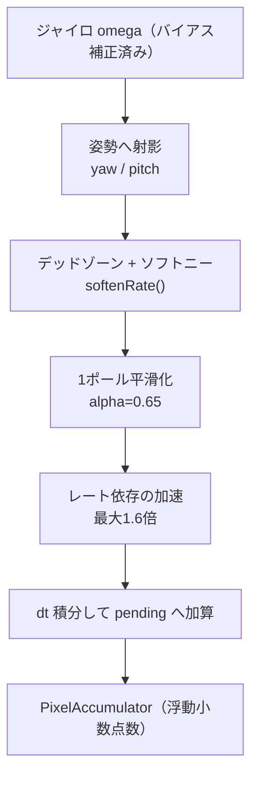
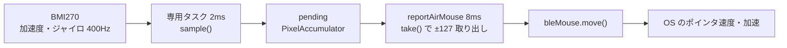

## はじめに

この記事は、前回の Qiita 記事「[M5Stack CoreS3 のタッチパネルで BLE マウスを作る](https://qiita.com/tomokusaba/items/9b392102d8931a48e386)」の続編です。

前回はタッチパネルで確実に動く BLE HID マウスを実装し、「入力の形に応じてマウスカーソルを動かせるか」という検証の第一歩を踏み出しました。そのときの本音として、私は本来 IMU センサーの傾きや動きでカーソルを操作したかったのですが、素直に加速度から角度を作ると思ったように動かず、まずはタッチで足場を固めていました。

今回はその続きとして、CoreS3 に内蔵された BMI270 のジャイロ（角速度センサー）を使い、本体を空中で回すとカーソルが動く「空中マウス」を実装しました。ポイントは、単に動くだけではなく「持ち替えても」「手首をひねっても」できるだけ自然にカーソルが付いてくるように信号処理を組んだところです。

対象のコードはすべて次のリポジトリにあります。本記事のコード引用や数値は、このリポジトリの `README.md` / `src/main.cpp` / `include/CoreAirMouse.h` / `tests/core_air_mouse_test.cpp` / `platformio.ini` に厳密に合わせています。

https://github.com/tomokusaba/m5stack-ble-mouse

:::message
この記事は執筆時点の実装をもとにしています。BLE 通信や OS を含む実際の遅延・実サンプルレート・カーソルの体感は、PC 側のポインタ速度／加速設定や実機の個体差に依存します。数値は「そう設定している」ことの説明であり、実機での確認をおすすめします。
:::

---

## 今回のゴール

この記事を読み終えると、次のことが分かります。

- ✅ CoreS3 を空中マウスとして持つ・操作する方法と、本体の軸とカーソル方向の対応
- ✅ BMI270 を 400Hz・専用タスク 2ms 周期で読み、サンプル欠落時に安全に止める仕組み
- ✅ 起動時の静止キャリブレーションで、ジャイロのバイアスと姿勢基準をどう作るか
- ✅ 加速度を「姿勢の基準」だけに使い、手首のロールを補正してカーソル方向を安定させる方法
- ✅ デッドゾーン・ソフトニー・平滑化・加速で「自然な移動」を作る信号処理
- ✅ 浮動小数点数の蓄積と HID の ±127 制限を両立させるレポート化
- ✅ タッチ・クリック・シェイクと空中マウスをどう排他・連携させるか

いわゆる「加速度から角度を積分してカーソルにする」方式ではありません。**カーソルの速度はジャイロ（角速度）から作り、加速度は姿勢の基準と静止判定にだけ使う** のが今回の設計の要です。

---

## 前提条件と構成

必要なものは前回と同じく最小限です。

- ✅ M5Stack CoreS3（IMU は BMI270、磁気センサーは BMM150）
- ✅ PlatformIO（VS Code 拡張または CLI）
- ✅ BLE HID を受けられる PC（Windows / macOS / Linux）

ビルドは PlatformIO の標準 `m5stack-cores3` 環境（ESP32-S3、16MB フラッシュ）で行います。

```bash
pio run -e m5stack-cores3
```

依存ライブラリは `platformio.ini` で次のように指定しています。M5Unified と、BLE HID マウスを提供する ESP32-BLE-Mouse です。

```ini
[env]
platform = espressif32
framework = arduino
monitor_speed = 115200
lib_deps =
    m5stack/M5Unified
    https://github.com/T-vK/ESP32-BLE-Mouse.git
build_flags =
    -DCORE_DEBUG_LEVEL=0
```

書き込み後は、PC の Bluetooth 設定で `M5Stack CoreS3 Sensor Mouse` をペアリングすれば、追加ドライバーなしで通常のマウスとして認識されます。

:::message
このリポジトリは M5StickS3 と CoreS3 の両対応ですが、本記事は CoreS3（`TARGET_M5STACK_CORES3`）の空中マウスに絞って解説します。M5StickS3 側の処理・定数は `CoreAirMouse.h` を使わず従来のままです。
:::

---

## まずは操作方法：CoreS3 の持ち方

空中マウスは「どう持つか」で挙動の意味が決まります。最初に持ち方を押さえてください。

**画面を上向きにして、先端（画面上辺の +Y 方向）を PC へ向ける、テレビのリモコンのような持ち方** です。CoreS3 の USB-C コネクタは側面にあるため、「USB-C と反対側」ではなく画面の上辺を基準にしてください。

軸の基準は、コネクタや LCD の表示回転ではなく、CoreS3 の IMU 軸図に基づく右手系です。ファームウェアでも `setAxisOrder(X+, Y+, Z+)` を明示し、表示回転に依存しないようにしています。

| 軸 | 向き |
|---|---|
| 🟥 +X | 画面の右 |
| 🟩 +Y | 画面の上辺（＝先端方向） |
| 🟦 +Z | 画面から外（手前）へ |

起動直後は、机の上などに約 1 秒静止させ、画面の `Calibrating... Keep still!` が消えてから操作を始めてください。動きや振動が大きいと自動でキャリブレーションをやり直します。キャリブレーション中でもタッチパッドは使えます。

### 動作とカーソル方向の対応

本体の先端をどう動かすと、ジャイロの符号がどうなり、カーソルがどちらへ動くかを整理します（画面が水平の場合）。

| 動作（画面が水平） | ジャイロの符号 | カーソル |
|---|---|---|
| 先端を右へ旋回 | `gz < 0` | 右（`X+`） |
| 先端を左へ旋回 | `gz > 0` | 左（`X-`） |
| 先端を上げる | `gx > 0` | 上（`Y-`） |
| 先端を下げる | `gx < 0` | 下（`Y+`） |
| 先端方向を軸にひねる | `gy` のみ | 移動なし |
| 傾けたまま静止 | バイアス補正後ゼロ | 停止 |

右手の法則で考えると、`+Z` まわりの回転は先端 `+Y` を左へ、`+X` まわりの回転は先端を上へ動かします。カーソルの向きを直感に合わせるため、yaw→X と pitch→Y の符号はどちらも `-1` にしています。持ち方や個体差で逆に感じる軸だけ、符号定数（`kCursorXSign` / `kCursorYSign`）を反転できます。

「先端方向（+Y）を軸にしたひねり＝ロール」は、それ自体ではカーソルを動かしません。これは後述する姿勢補正のおかげで、ロールしても旋回は左右・上下動は上下に保たれます。

ここまでが操作の全体像です。ここからは、この操作感を支える内部処理を、センサーの取得から順に見ていきます。

---

## センサー値取得とキャリブレーション

### BMI270 を 400Hz で読み、専用タスクで積分する

まず BMI270 を明示的に設定します。M5Unified 経由でレジスタに直接書き込み、書いた値を読み戻して一致を確認します。設定は加速度・ジャイロともに 400Hz、通常帯域／性能優先、レンジは ±8g・±2000°/秒です。M5Unified の換算係数がこのレンジ前提なので、レンジは変えていません。

```cpp
bool configureCoreImu() {
  using Bmi = m5::BMI270_Class;
  auto* sensor = M5.Imu.getImuInstancePtr(0);
  if (!sensor || M5.Imu.getType() != m5::imu_bmi270) {
    return false;
  }
  // Bosch ACC_CONF/GYR_CONF: 400Hz, normal bandwidth, performance mode.
  // Preserve the 8g / 2000dps ranges used by M5Unified's conversion factors.
  const uint8_t config[] = {0xAA, 0x02, 0xEA, 0x00};
  uint8_t actual[sizeof(config)] = {};
  if (!sensor->writeRegister(Bmi::ACC_CONF_ADDR, config, sizeof(config)) ||
      !sensor->readRegister(Bmi::ACC_CONF_ADDR, actual, sizeof(actual)) ||
      memcmp(config, actual, sizeof(config)) != 0) {
    return false;
  }
  M5.Imu.setCalibration(0, 0, 0);
  // Do not inherit a one-sample/NVS gyro bias; the new pipeline calibrates at rest.
  for (size_t index = 3; index < 6; ++index) {
    M5.Imu.setOffsetData(index, 0);
  }
  return M5.Imu.setAxisOrder(m5::IMU_Class::axis_x_pos, m5::IMU_Class::axis_y_pos,
                             m5::IMU_Class::axis_z_pos);
}
```

`ACC_CONF=0xAA, ACC_RANGE=0x02, GYR_CONF=0xEA, GYR_RANGE=0x00` が Bosch のレジスタ設定に対応します。ここでは M5Unified に保存されたジャイロのオフセットや単発校正をあえて引き継がず、後述する起動時の静止キャリブレーションで作り直します（加速度計・磁気センサーの保存校正は残します）。

読み取りは専用の FreeRTOS タスクで行い、`vTaskDelayUntil` で 2ms 周期（`kImuPollMs=2`、ODR は 400Hz 固定）に保ちます。ここが自然さの土台です。描画ループとは分離し、タッチと IMU が共有する内部 I2C バスは mutex で排他します。

```cpp
void sampleAirMouseTask(void*) {
  TickType_t wake = xTaskGetTickCount();
  uint32_t lastGoodUs = micros();
  // ...
  for (;;) {
    // This mutex also covers M5.update(): touch and IMU share the internal I2C bus.
    xSemaphoreTake(airMouseMutex, portMAX_DELAY);
    const auto updated = M5.Imu.update();
    const uint32_t now = micros();
    const auto data = M5.Imu.getImuData();
    if (updated & m5::IMU_Class::sensor_mask_accel) {
      accel = {data.accel.x, data.accel.y, data.accel.z};
      haveAccel = true;
      lastAccelUs = now;
    }
    if ((updated & m5::IMU_Class::sensor_mask_gyro) && haveAccel &&
        now - lastAccelUs <= air::kMaxSampleGapUs) {
      const air::Vec3 gyro(data.gyro.x, data.gyro.y, data.gyro.z);
      if (air::finite(accel) && air::finite(gyro)) {
        airMouse.sample(gyro, accel, now);
        lastGoodUs = now;
        // ...
      }
    }
    if (now - lastGoodUs > air::kMaxSampleGapUs) {
      if (imuHealthy) {
        Serial.println("IMU samples missing: pointing stopped");
      }
      imuHealthy = false;
      airMouse.clearMotion();
    }
    // ...
    xSemaphoreGive(airMouseMutex);
    vTaskDelayUntil(&wake, pdMS_TO_TICKS(air::kImuPollMs));
  }
}
```

ここで大事なのは次の 3 点です。

- `M5.Imu.update()` の戻り値マスクで新しいジャイロデータ（`sensor_mask_gyro`）を確認してから、同じバッチの `getImuData()` を読みます。`getAccelData()` / `getGyroData()` を個別に呼んで二重更新することはありません。
- 積分の `dt` は、取得時の `micros()` の差分から求めます。固定 2ms ではなく実測時刻を使うので、周期が多少ゆらいでも移動量がぶれにくくなります。
- 加速度サンプルから `kMaxSampleGapUs`（30ms）以上経過したジャイロは使いません。さらに全体としても最後に成功した取得から 30ms を超えたら `imuHealthy=false` にして `clearMotion()` し、カーソルを止めます。サンプル欠落時に暴れないための安全停止です。

画面には直近 1 秒間の実取得 Hz も表示するので、実機で ODR が出ているか確認できます。

### 起動時の静止キャリブレーション

起動時に、机上などで約 1 秒・最低 400 サンプルの静止データを集め、その平均からジャイロのバイアスと姿勢の基準（重力方向）を作ります。判定は分散条件つきで、静止していないデータは弾いて再試行します。

```cpp
void calibrate(Vec3 gyro, Vec3 accel, uint32_t now) {
  if (std::fabs(length(accel) - 1.0f) > kSteadyGravityToleranceG ||
      length(gyro) > kCalibrationMaxRateDps) {
    resetCalibrationWindow();
    return;
  }
  if (gyroWindow_.count == 0) {
    windowStartUs_ = now;
    firstAccel_ = accel;
  }
  if (length(accel - firstAccel_) > kSteadyGravityToleranceG) {
    resetCalibrationWindow();
    return;
  }
  gyroWindow_.add(gyro);
  accelWindow_.add(accel);
  if (gyroWindow_.count < kCalibrationSamples || now - windowStartUs_ < kCalibrationDurationUs) {
    return;
  }
  if (gyroWindow_.stable(kCalibrationGyroStdDevDps) &&
      accelWindow_.stable(kCalibrationAccelStdDevG)) {
    bias = gyroWindow_.mean;
    gravity = accelWindow_.mean;
    calibrated = true;
    clearMotion();
  } else {
    resetCalibrationWindow();
  }
}
```

条件を整理すると次のとおりです。

| 🎯 判定 | 定数 | 既定値 | 意味 |
|---|---|---:|---|
| ⏱️ 最短時間 | `kCalibrationDurationUs` | 1000000（1秒） | この時間が経つまで確定しない |
| 🔢 最小サンプル数 | `kCalibrationSamples` | 400 | 400 サンプル集めるまで確定しない |
| 🌀 角速度ノルム上限 | `kCalibrationMaxRateDps` | 5.0°/秒 | これを超えたら静止していないと判断 |
| 📉 ジャイロ標準偏差上限 | `kCalibrationGyroStdDevDps` | 0.25°/秒 | 各軸のばらつきがこれ以下 |
| 📉 加速度標準偏差上限 | `kCalibrationAccelStdDevG` | 0.015g | 各軸のばらつきがこれ以下 |
| ⚖️ 静止判定 | `kSteadyGravityToleranceG` | 0.06g | 1g からのずれ・開始時からのドリフト許容 |

分散は Welford 法（`Moments` 構造体。分散を逐次更新するオンライン算法）でオンライン計算しており、`stable()` が「標準偏差の 2 乗 × (n−1)」と累積二乗和を比較して判定します。途中で動いた・振動した場合は `resetCalibrationWindow()` でウィンドウを捨て、`calibrationRetries` を増やして最初からやり直します。動いていたら確定しないので、画面の指示どおり静止させることが大事です。

確定したバイアスは RAM のみに保持し、毎回の起動で取り直します。起動時のちょっとした置き方の違いや温度ドリフトを、その場の実測で吸収する狙いです。

なお、確定後もバイアスは少しずつ追従します。ただし追従するのは、補正後の角速度ノルムが `kBiasTrackingMaxRateDps`（1.5°/秒）未満で、加速度も安定した状態が `kBiasStillTimeUs`（0.5 秒）続いたときだけです。`kBiasTimeConstantS`（30 秒）の時定数でゆっくり行います。低速の一定回転とバイアスは完全には区別できないため、キャリブレーション中は必ず静止させてください。

---

## 姿勢補正とカーソル方向

### 加速度は「姿勢の基準」だけに使う

冒頭で触れたとおり、カーソルの位置・速度を加速度計の傾きから作ることはしません。加速度計は姿勢の基準と静止判定にだけ使います。

ここで直感に反しやすいのが符号です。静止時に加速度計が測るのは「下向きの重力」ではなく、それを支える上向きの支持力（specific force）です。そこで、正規化した低域通過後の加速度を `up`（上方向）として扱います。この `up` に対して、先端方向 `forward = (0, 1, 0)` を水平面へ投影し、yaw 軸（`up`）と pitch 軸（`right`）を作ります。

```cpp
inline Rates projectRates(Vec3 omega, Vec3 gravity, bool validGravity) {
  const float norm = length(gravity);
  if (!validGravity || norm < 0.1f) {
    return {omega.z, omega.x};
  }
  // At rest the accelerometer measures UP (specific force), not downward gravity.
  const Vec3 up = gravity * (1.0f / norm);
  const Vec3 forward(0, 1, 0);
  const Vec3 horizontal = forward - up * dot(forward, up);
  const float horizontalLength = length(horizontal);
  if (horizontalLength < kMinHorizontalProjection) {
    return {omega.z, omega.x};
  }
  const Vec3 right = cross(horizontal * (1.0f / horizontalLength), up);
  return {dot(omega, up), dot(omega, right)};
}
```

擬似コードにすると次のようになります。

```text
forward    = (0, 1, 0)
horizontal = normalize(forward - dot(forward, up) * up)
right      = cross(horizontal, up)
yaw   = dot(omega, up)
pitch = dot(omega, right)
dx = kCursorXSign * gain * filtered_yaw   * dt_seconds
dy = kCursorYSign * gain * filtered_pitch * dt_seconds
```

角速度 `omega` を「今の姿勢での up 成分（yaw）」と「right 成分（pitch）」に射影しているのがポイントです。これにより、手首をロールさせても旋回は左右のカーソル移動、先端の上下動は上下のカーソル移動になります。角速度そのものは本体固定軸で出てきますが、それを毎サンプルの姿勢に合わせて world 側の yaw/pitch へ「読み替えて」いるわけです。

姿勢の基準 `gravity` は、有効な加速度で低域通過フィルタ（時定数 `kGravityTimeConstantS`＝150ms）を掛けて更新します。急なロールでは追従に遅れがあるため、瞬時に完全補償できるわけではない点は正直に押さえておきます。

### 重力が信頼できないときの fallback

大きく振ったり、先端がほぼ鉛直になって水平投影が定義できなかったりすると、姿勢基準は当てになりません。そこで次の場合は、姿勢補正をやめて本体軸そのまま（`yaw=gz` / `pitch=gx`）に一時的に戻します。

- 加速度ノルムが 1g から `kGravityToleranceG`（0.20g）を超えて外れる（＝おおむね 0.8〜1.2g の外）
- 水平投影の長さが `kMinHorizontalProjection`（0.10）を下回る（＝先端がほぼ鉛直）

このとき画面表示は `ROLL COMP`（ロール補正中）から `BODY AXES`（本体軸）に切り替わり、`gravityFallback` フラグが立ちます。縦持ちを禁止する旧来の判定や、連続傾きモードのようなものはありません。破綻する条件だけ検出して素直に本体軸へ逃がす、という考え方です。

---

## 自然な移動のための信号処理

ジャイロをそのままカーソル速度にすると、静止時の微小なノイズでカーソルが震え、動かし始めがカクつき、速く動かすと行き過ぎます。ここを埋めるのが信号処理です。信号処理内部の流れは次のとおりです。



### デッドゾーンとソフトニー

まず、角速度 1°/秒以下は静止域（デッドゾーン）として完全に無視します。そのすぐ外側 1°/秒は、いきなり線形に立ち上げるとカクつくため、二次曲線でなめらかに立ち上げる「ソフトニー」を通します。その先は線形です。

```cpp
inline float softenRate(float rate) {
  const float excess = std::fabs(rate) - kRateDeadzoneDps;
  if (excess <= 0) {
    return 0;
  }
  const float value = excess < kRateKneeDps
                          ? excess * excess / (2.0f * kRateKneeDps)
                          : excess - kRateKneeDps * 0.5f;
  return std::copysign(value, rate);
}
```

`kRateDeadzoneDps=1.0`、`kRateKneeDps=1.0` です。回帰テストでも、`softenRate(0.9)` は 0、`softenRate(1.5)` は 0.125、`softenRate(2.0)` は 0.5、`softenRate(3.0)` は 1.5 という値が固定されています。デッドゾーン直後がゼロから二次で立ち上がるので、微妙な手ぶれで動き出さず、意図した動きにはスッと追従します。

### 平滑化と静止域での余韻カット
次に、軽い 1 ポールの平滑化を掛けます。係数は `kRateFilterAlpha=0.65` で、これは「軽い」フィルタです（`static_assert` で 0.5〜1.0 に制限）。重すぎるフィルタは遅延として体感されるので、あえて軽めにしています。

```cpp
// Drop the filter tail inside the deadzone, but retain sub-pixel displacement.
filteredYaw_ = yaw == 0 ? 0 : filteredYaw_ + kRateFilterAlpha * (yaw - filteredYaw_);
filteredPitch_ = pitch == 0 ? 0 : filteredPitch_ + kRateFilterAlpha * (pitch - filteredPitch_);
```

ここが地味に効くところで、`yaw`（ソフトニー後の値）が 0、つまりデッドゾーンに入った瞬間はフィルタの状態を 0 にリセットします。フィルタの「余韻」でカーソルがスーッと滑り続けるのを止め、手を止めたらカーソルも止まる感覚を出しています。ただし後述の小数分（サブピクセルの移動量）は捨てません。

### レートに応じた加速

最後に、動きが速いほどゲインを上げる加速を入れます。ゆっくり動かすときは細かく、速く動かすときは大きく動く、という緩急を付けるためです。

```cpp
const float rate = std::sqrt(rates.yaw * rates.yaw + rates.pitch * rates.pitch);
const float gain = kPixelsPerDegree *
                   (1.0f + kAcceleration * std::min(rate / kAccelerationFullScaleDps, 1.0f));
pending.x += kCursorXSign * gain * filteredYaw_ * dt;
pending.y += kCursorYSign * gain * filteredPitch_ * dt;
```

基本感度は 22 HID カウント/度（`kPixelsPerDegree=22.0`）。加速は `1 + 0.6 * min(rate/200, 1)` で、`kAccelerationFullScaleDps=200`°/秒で上限に達し、最大 1.6 倍になります。`dt` を掛けて積分し、符号定数 `kCursorXSign` / `kCursorYSign`（ともに `-1`）でカーソル方向へ合わせています。

主要な信号処理定数をまとめます。

| 🎛️ 定数 | 既定値 | 用途 |
|---|---:|---|
| `kPixelsPerDegree` | 22.0 | 両軸の基本感度（HID カウント/度） |
| `kCursorXSign`, `kCursorYSign` | -1, -1 | yaw→X、pitch→Y の符号 |
| `kRateDeadzoneDps` | 1.0 | 静止域 |
| `kRateKneeDps` | 1.0 | 静止域の外側のソフトニー幅 |
| `kRateFilterAlpha` | 0.65 | 軽い平滑化（0.5〜1.0） |
| `kAcceleration` | 0.6 | 最大追加倍率（上限 1.6 倍） |
| `kAccelerationFullScaleDps` | 200.0 | 加速が上限に達するレート |
| `kGravityTimeConstantS` | 0.15秒 | 姿勢基準の低域通過時定数 |
| `kGravityToleranceG` | 0.20g | 重力方向を信頼する 1g からの許容差 |
| `kMinHorizontalProjection` | 0.10 | 鉛直付近の投影の下限 |

これらは `include/CoreAirMouse.h` を書き換えて再ビルドすれば調整できます。角速度は °/秒、感度は HID カウント/度という単位で統一されています。

---

## HID レポート化：小数を捨てずに ±127 を守る

信号処理で作った移動量は、`pending`（`PixelAccumulator`）という浮動小数点数に貯めていきます。一方、BLE HID マウスの `move()` に渡せる 1 回の移動量は `signed char`、つまり ±127 が上限です。ここで素直に丸めると、低速時の小数分が消えたり、高速時に上限で切られた分が失われたりします。

そこで、整数部分だけを ±127 に制限して取り出し、**取り出しきれなかった小数・超過分は次回に残す** 実装にしています。

```cpp
struct PixelAccumulator {
  float x = 0, y = 0;
  static int take(float& value) {
    const int delta = static_cast<int>(std::max(-127.0f, std::min(127.0f, value)));
    value -= delta;
    return delta;
  }
  void clear() { x = y = 0; }
};
```

`take()` は `value` から送出した分だけを引くので、残差が次回に持ち越されます。回帰テストでは、`0.22` を 100 回足して取り出すと合計がちょうど `22` になること、`1000.75` を 8 回に分けて取り出すと合計 `1000`・残り `0.75` になることが固定されています。低速でも高速でも移動量を捨てない、という保証です。

送信間隔は約 8ms（`kReportIntervalUs=8000`）です。取り出しと送信は `reportAirMouse()` が行います。

```cpp
void reportAirMouse() {
  const uint32_t now = micros();
  if (now - lastReportUs < air::kReportIntervalUs) {
    return;
  }
  lastReportUs = now;
  int dx = 0, dy = 0;
  const bool connected = bleMouse.isConnected();
  xSemaphoreTake(airMouseMutex, portMAX_DELAY);
  airMouse.setInput(touchingOrButtonHeld(), connected, now);
  if (imuHealthy && !airMouse.blocked(now)) {
    dx = air::PixelAccumulator::take(airMouse.pending.x);
    dy = air::PixelAccumulator::take(airMouse.pending.y);
  } else {
    airMouse.clearMotion();
  }
  xSemaphoreGive(airMouseMutex);
  if (connected && (dx || dy)) {
    bleMouse.move(static_cast<signed char>(dx), static_cast<signed char>(dy));
  }
}
```

一時停止・接続切断・入力欠落のときは `clearMotion()` で蓄積分を破棄します。貯めたまま復帰すると、その瞬間にカーソルが飛んでしまうためです。センサーから OS までの全体像は次のようになります。



つまりセンサー → Controller（`sample`）→ pending → `BleMouse.move` → OS という流れです。画面上の実際の移動量は、最後の OS のポインタ速度・加速設定にも依存します。ファーム側は「素直で滑らかな相対移動」を送ることに徹しています。

---

## タッチ・クリック・シェイクとの連携

CoreS3 はタッチパネルや仮想ボタンも持っているので、空中マウスとどう共存させるかが「自然さ」を左右します。基本方針は **「触っている間・押している間は空中マウスだけを止める」** です。

### 触っている間は空中マウスだけ止める

画面に触れている間と仮想ボタンを押している間は、空中マウスを停止し、離してからも 150ms（`kTouchFreezeUs`）は止めたままにします。画面表示は `AIR:FREEZE` です。その間もタッチ移動・クリック・スクロールは有効なので、「トラックパッドを操作したいだけなのにカーソルが二重に動く」ことを防げます。

このブロック判定は `Controller::blocked()` に集約されています。

```cpp
bool blocked(uint32_t now) {
  // Retire elapsed windows so they cannot reactivate on a later micros() wrap.
  if (hasInteraction_ && now - lastInteractionUs_ >= kTouchFreezeUs) {
    hasInteraction_ = false;
  }
  if (hasShaken_ && now - lastShakeUs_ >= kShakeQuietUs) {
    hasShaken_ = false;
  }
  return !calibrated || !connected_ || !pointingEnabled || interacting_ ||
         hasInteraction_ || hasShaken_;
}
```

空中でドラッグしたいときは、画面下部の HOLD / DRAG をオンにして指を離せば、左ボタンを固定したまま空中マウスで動かせます。クリック処理は `BleMouse::click()`（全ボタン解除を伴う）を避けて `press`/`release` を条件付きで呼ぶことで、保持中のクリックでドラッグ固定を解除しないようにしています。

### タッチパッドと仮想ボタン

画面上部の緑枠がタッチパッドで、その下に HOLD / DRAG トグル、最下段に LEFT / MIDDLE / RIGHT の仮想ボタン（M5Unified の `BtnA` / `BtnB` / `BtnC`）が並びます。仮想ボタンは `setTouchButtonHeight()` で有効化しているため、画面の UI とライブラリのボタン状態が一致します。

| 🖐️ 操作 | 動作 |
|---|---|
| 1 本指でなぞる | カーソル移動 |
| 1 本指タップ | 左クリック |
| 1 本指長押し | 右クリック |
| 2 本指タップ | 右クリック |
| 2 本指で上下になぞる | ホイールスクロール |
| HOLD / DRAG トグル | 左ボタン固定のオン/オフ |

タッチ側の既定値は前回から据え置きで、`kTrackpadSensitivity=1.55`、`kScrollSensitivity=0.18`、`kClickThresholdMs=220`、`kVirtualButtonHoldMs=450`、`kTouchMovementThresholdPixels=4`、`kScrollMovementThresholdPixels=2` です。タッチの更新周期は `kTouchPollUs=5000`、画面の状態更新は `kStatusIntervalMs=200` です。

### シェイクで一時停止・再開

空中操作を止めたいときは、本体を強く短く振ると `AIR:PAUSE` になり、もう一度振ると再開します。誤爆を避けるため、切り替えは 3g 以上を連続 2 サンプル検出したときだけです。

```cpp
void updateShake(float accelNorm, uint32_t dtUs, uint32_t now) {
  if (std::fabs(accelNorm - 1.0f) <= kGravityToleranceG) {
    quietUs_ = std::min(kShakeQuietUs, quietUs_ + dtUs);
  } else {
    quietUs_ = 0;
  }
  if (!shakeArmed_ && quietUs_ >= kShakeQuietUs &&
      now - lastShakeUs_ >= kShakeCooldownUs) {
    shakeArmed_ = true;
  }
  if (accelNorm >= kShakeThresholdG && !interacting_) {
    ++shakeSamples_;
  } else {
    shakeSamples_ = 0;
  }
  if (shakeArmed_ && shakeSamples_ >= kShakeSamples) {
    pointingEnabled = !pointingEnabled;
    hasShaken_ = true;
    lastShakeUs_ = now;
    shakeArmed_ = false;
    shakeSamples_ = 0;
    clearMotion();
  }
}
```

さらに、次に受け付けるまで 0.4 秒の静かな状態（`kShakeQuietUs`）と 1.2 秒のクールダウン（`kShakeCooldownUs`）を満たす必要があります。通常のポインティングや、長く振り続ける動作で連続切り替えが起きない設計です。再開シェイクの直後 0.4 秒も移動を凍結し、振った勢いがカーソルに乗らないようにしています。

| 🤝 連携要素 | 定数 | 既定値 |
|---|---|---:|
| クリック/タッチ後の凍結 | `kTouchFreezeUs` | 150000（150ms） |
| シェイクしきい値 | `kShakeThresholdG` | 3.0g |
| しきい値以上の連続サンプル | `kShakeSamples` | 2 |
| シェイクのクールダウン | `kShakeCooldownUs` | 1200000（1.2秒） |
| 再受付に必要な静かな時間 | `kShakeQuietUs` | 400000（0.4秒） |
| 入力欠落の上限 | `kMaxSampleGapUs` | 30000（30ms） |

なお、BMM150 の補正済み磁気方位は画面の `MAG` に表示していますが、カーソルの計算には一切使いません。磁石や金属で磁場が乱れても、空中マウスの方向は変わらないようにするためです。マイクによる拍手クリックも用意していますが、誤操作を避けるため既定では無効（`kEnableClapClick=false`）です。

---

## 動作確認と調整

### ホスト用の回帰テスト

センサーがなくても挙動を確認できるよう、実ファームと同じ `CoreAirMouse.h` を使ったホスト用の C++ テストが用意されています。外部テストライブラリには依存していません。

```powershell
g++ -std=c++14 -Wall -Wextra -Werror -pedantic tests\core_air_mouse_test.cpp -o core_air_mouse_test.exe
.\core_air_mouse_test.exe
Remove-Item core_air_mouse_test.exe
```

このテストには、方向の対応、ロールしても yaw/pitch が保たれること、静止校正の再試行、静止傾き、バイアス追従、ソフトニー、可変 `dt`、小数・±127 超過分の保持、クリック凍結、切断、シェイク、`micros()` の周回（クロックラップ）まで含まれています。ロジックだけを PC 上で固定できるので、定数をいじったときの回帰確認に便利です。

### 画面表示と調整の勘どころ

実機では画面上部に `BLE` / `AIR` / `MAG` の状態と、確定後は実測 Hz・`ROLL COMP` か `BODY AXES` かが出ます。動かしながら次を確認すると調整しやすいです。

- 🌀 静止時にカーソルが震える → デッドゾーンや平滑化より前に、まず起動時に静止できていたか（`Retry` が増えていないか）を確認
- 🧭 方向が逆に感じる → `kCursorXSign` / `kCursorYSign` を軸ごとに反転
- 🐢 速い動きで行き過ぎる／遅すぎる → `kPixelsPerDegree` と `kAcceleration` を調整
- 🔁 `BODY AXES` のままロール補正が効かない → 大きく振っていないか、先端が鉛直に近くないかを確認

感度の最終的な体感は OS のポインタ速度・加速設定にも左右されるので、ファーム側の定数と OS 側の設定は両方いじれることを覚えておくとよいです。

---

## まとめ

今回は、CoreS3 の BMI270 ジャイロを使った BLE HID 空中マウスを、できるだけ自然に操作できるように作りました。設計の芯は次のとおりです。

- 🎯 カーソル速度はジャイロ（角速度）から作り、加速度は姿勢の基準と静止判定だけに使う
- 🧭 加速度計が測るのは上向きの支持力。`up` へ射影してロールを補正し、破綻時だけ本体軸へ fallback
- 🪶 デッドゾーン・ソフトニー・軽い平滑化・レート加速で、震え・カクつき・行き過ぎを抑える
- 🧮 浮動小数点数で貯めて整数だけ ±127 送信、残りは次回へ。停止・切断時は破棄して飛びを防ぐ
- 🤝 触っている間は空中マウスだけ止め、シェイクで一時停止/再開。磁気は表示のみ

前回のタッチ入力から一歩進めて、「IMU で思ったように動かない」を信号処理で埋めていくと、空中マウスは実用的な操作感に近づきます。定数はすべて `CoreAirMouse.h` に集約してあるので、手の癖に合わせて調整してみてください。

コード全体は次のリポジトリにあります。実機で試すときは、まず静止キャリブレーションを確実に通すところから始めるのがおすすめです。

https://github.com/tomokusaba/m5stack-ble-mouse

前回のタッチ版の記事もあわせてどうぞ。

https://qiita.com/tomokusaba/items/9b392102d8931a48e386
