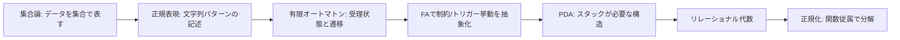
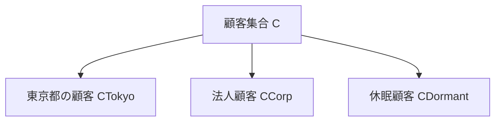
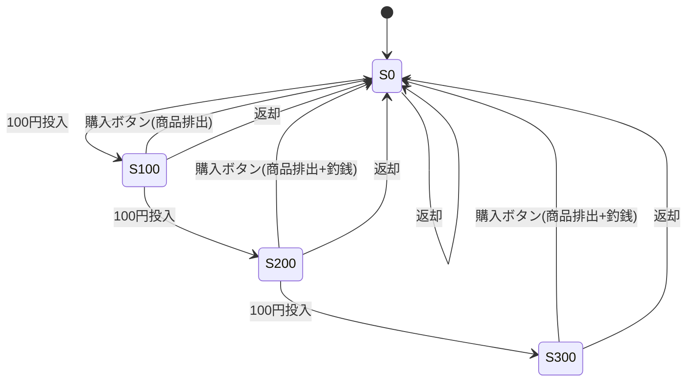
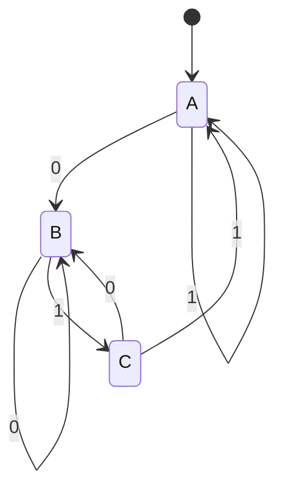
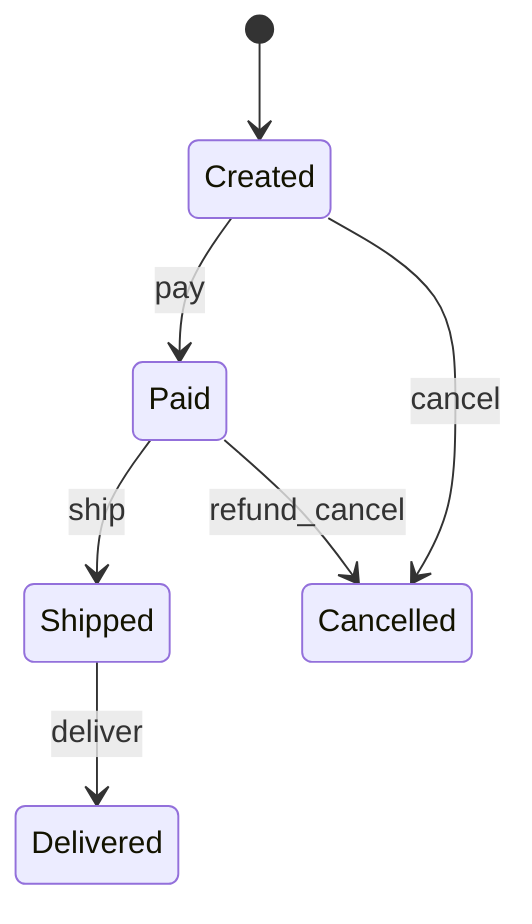
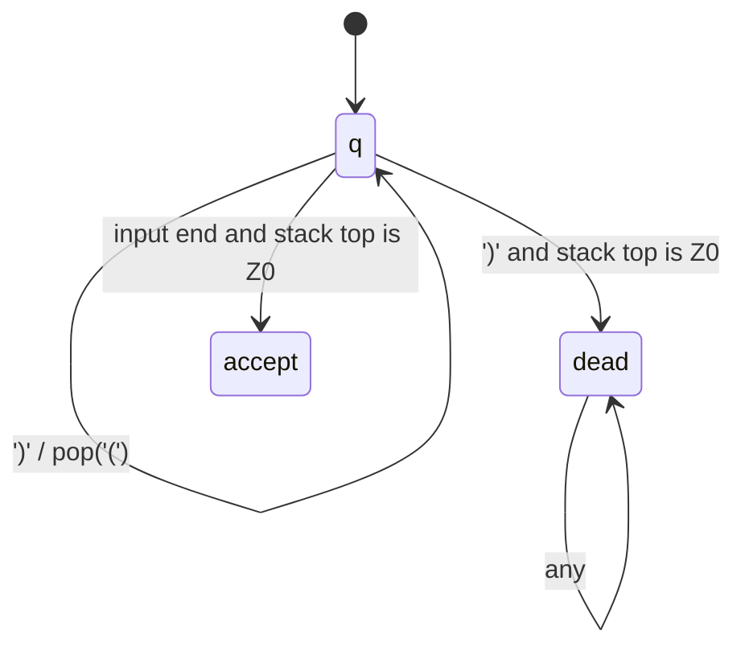

## はじめに 🌟

「テーブル設計は経験で覚えるもの」と言われることがありますが、私は**集合論と形式言語の視点**を持つと、設計の根拠がかなり明確になると感じています。

本記事では、高校数学の集合を前提に、有限オートマトン（FA）とプッシュダウンオートマトン（PDA）を経由して、最終的にリレーショナル代数と正規化へつなげます。  
狙いは、「なぜそのテーブル分解が妥当なのか」を理論で説明できる状態を作ることです 🧭

有限オートマトンの説明は、以前の整理（Qiita）で扱った要素（5つ組、DFA/NFA、正規表現との関係、できること/できないこと）を本記事でも網羅します。  
参考: [オートマトン・チューリングマシン入門（Qiita）](https://qiita.com/tomokusaba/items/723bb96150d76dbffad0)

## 本記事のゴール 🎯

- ✅ データを「集合・部分集合」として記述できるようになる
- ✅ 有限オートマトンを、状態遷移・受理判定のモデルとして説明できるようになる
- ✅ PDA が必要になる境界（FAで扱えない問題）を言語化できるようになる
- ✅ リレーショナル代数と関数従属から、テーブル分解の理由を説明できるようになる

## 前提条件 ✅

- ✅ 高校数学の集合（和集合・共通部分・差集合・部分集合）
- ✅ SQL の基本（SELECT / JOIN）
- ✅ 業務システムでのテーブル設計に興味があること

## 全体像（この記事の地図）🗺️



## 集合論でデータを捉える 📘

まず、業務データを集合として置きます。ECの最小例として次を考えます。

- 顧客集合 `C`
- 注文集合 `O`
- 商品集合 `P`

```text
C = {c001, c002, c003, ...}
O = {o1001, o1002, o1003, ...}
P = {p10, p11, p12, ...}
```

ここで「東京都の顧客」や「キャンセル注文」は、それぞれ `C` や `O` の**部分集合**です。



C# で書くと、部分集合を取り出す操作は自然に現れます。

```csharp
// CTokyo = { c in C | c.Pref == "Tokyo" }
var cTokyo = customers
    .Where(c => c.Pref == "Tokyo")
    .Select(c => c.CustomerId)
    .ToHashSet();

// CActive = C \ CDormant
var threshold = DateTime.UtcNow.AddMonths(-6);
var cActive = customers
    .Where(c => c.LastLoginAt >= threshold)
    .Select(c => c.CustomerId)
    .ToHashSet();
```

この時点で大事なのは、**テーブルは「データの置き場」より先に「集合の定義」**だという見方です。  
この見方が次の「言語を受理する機械」につながります。

## 正規表現を少し丁寧に導入する ✨

有限オートマトンに入る前に、正規表現を「ただの便利記法」ではなく、**文字列集合を定義する道具**として見ておきます。

たとえば注文IDを `O-2026-000123` の形式にしたいとします。

```csharp
var orderIdPattern = @"^O-[0-9]{4}-[0-9]{6}$";
var isValid = Regex.IsMatch("O-2026-000123", orderIdPattern);
```

このパターンを分解すると、意味は次のようになります。

| 記号 | 意味 |
|------|------|
| `^` | 文字列の先頭 |
| `O-` | `O-` で始まる |
| `[0-9]{4}` | 数字4桁（年） |
| `-` | 区切りのハイフン |
| `[0-9]{6}` | 数字6桁（連番） |
| `$` | 文字列の末尾 |

つまりこの正規表現は、「この形を満たす文字列だけを通す」という制約です。  
集合論の言葉で書けば、次の言語 `L` を定義していると見なせます。

```text
L = { s | s は ^O-[0-9]{4}-[0-9]{6}$ にマッチする }
```

もう少し実務寄りに言うと、正規表現は「入力値をどの集合に所属させるか」のフィルターです。  
この視点を持っておくと、DB設計でも `CHECK` 制約やアプリ入力検証を「集合への所属判定」として同じ言葉で説明できるようになります。

サンプル値で見ると、集合の境界は次のように理解できます。

| 入力値 | 判定 | 理由 |
|------|------|------|
| `O-2026-000123` | 受理 | 形式を満たす |
| `O-26-000123` | 不受理 | 年が4桁でない |
| `X-2026-000123` | 不受理 | 先頭プレフィックスが違う |
| `O-2026-123` | 不受理 | 連番が6桁でない |

### 正規表現がテーブル設計に関わるポイント（詳細）

この節では「正規表現がテーブル設計にどう効くか」を、実務で使える観点に絞って具体化します。  
結論から言うと、正規表現は入力チェックの小技ではなく、**列仕様を機械可読で固定する設計手段**です。

1. 列を定義するときは、型だけでなく「許可形式」まで定義して初めて仕様になります。
2. `nvarchar(50)` だけでは、見た目が違う同義データを防げません。
3. 同義データの混在は、JOIN漏れと集計ズレの原因になります。
4. 正規表現を決めると、どの値を拒否するかを事前に合意できます。
5. 事前合意があると、画面・API・バッチの判定を統一できます。
6. 判定統一は「画面では保存できたが連携で失敗した」を減らします。
7. 拒否理由を桁数・接頭辞・文字種に分解できるため、運用説明が明確になります。
8. 設計レビューで「この列の許可形式は明示されているか」を確認可能になります。
9. 監査で「なぜ拒否したか」を仕様とログの両方で説明できます。
10. 外部連携契約にもそのまま転用でき、IF仕様が曖昧になりません。
11. 形式固定は、検索条件の標準化にも効きます。
12. 先頭固定や桁固定があると、索引戦略を立てやすくなります。
13. 逆に形式自由だと `LIKE` と補正ロジックが増え、性能が不安定になります。
14. データ移行時にも、受理・補正・隔離の判断を機械的に分けられます。
15. 仕様追加時の影響調査がしやすく、改修漏れを減らせます。
16. つまり正規表現は、列の値域を曖昧にしないための中核設計です。

`orders.order_code` を例にすると、「`O-YYYY-NNNNNN` 以外は保存しない」と決めるだけで、入力品質、検索安定性、運用説明の3つが同時に改善します。  
このため、正規表現はUI都合の制約ではなく、テーブル設計段階で定義すべき契約仕様として扱うのが実務的です。

:::message
理論上の「正規表現」は正則言語を表します。一方、実用regexには後方参照など拡張があり、理論上の正規表現より強い機能を持つ場合があります。この記事では理論側（正則言語）を扱います。
:::

## 有限オートマトン（FA）を丁寧に押さえる 🤖

### まず「状態機械」として直感を作る

有限オートマトンは、入力を1文字ずつ読みながら、内部状態を更新していく機械です。  
ポイントは「次に何をするか」が、**現在状態と次の入力だけで決まる**ことです。

核になる要素は次の5つです。

1. 状態 `Q`
2. 入力記号集合 `Σ`
3. 遷移関数 `δ`
4. 開始状態 `q0`
5. 受理状態集合 `F`

形式的には次で表します。

```text
(Q, Σ, δ, q0, F)
```

ここで大事なのは、オートマトンは「計算式を直接持つ」のではなく、**遷移ルールの集合を持つ**という点です。  
なので、仕様変更が入っても「遷移を追加・削除する」観点で整理しやすくなります。

### 5つ組がテーブル設計に効く理由（詳細）

`(Q, Σ, δ, q0, F)` は理論記号に見えますが、実務ではそのまま設計チェックリストになります。  
以下の対応を固定すると、仕様と実装のズレをかなり減らせます。

1. `Q` は状態列の許可値集合です（例: `Created`, `Paid`, `Shipped`）。
2. `Q` を固定すると、状態値の誤入力を列制約で防げます。
3. `Σ` は業務イベント集合です（例: `pay`, `ship`, `cancel`）。
4. `Σ` を固定すると、想定外イベントの混入を防げます。
5. `δ` は許可遷移表です（どの状態でどのイベントを許可するか）。
6. `δ` を固定すると、手順飛ばし更新を拒否できます。
7. `q0` は初期状態の定義です（INSERT時の既定値）。
8. `q0` を固定すると、新規行の初期不整合を防げます。
9. `F` は終端状態の定義です（完了・取消など）。
10. `F` を固定すると、終了判定や締め処理の条件が明確になります。
11. `δ` と `F` を分けると、「取消後に再開可か」を明示的に議論できます。
12. 仕様書、ERD、アプリコードで同じ語彙を使えるようになります。
13. 状態変更ログに `from`, `event`, `to` を保存する理由が説明しやすくなります。
14. 監査で「なぜその更新を拒否したか」を遷移規則で示せます。
15. テストも状態×イベントの表駆動で網羅化できます。
16. 結果として、運用後の仕様変更にも耐える設計になります。

5つ組で整理してからテーブルを切ると、`orders` 本体・`order_status_events` 履歴・制約定義の役割分担が明確になります。  
そのため、理論説明だけで終わらず、列定義・制約・監査設計を同時に決める実務フレームとして使えます。

### 自動販売機で導入する（状態遷移の直感）🥤

100円ジュースを売る自販機を考えます（100円玉のみ投入可能）。



この例の本質は、過去の投入履歴を全部覚えなくても、「今いくら入っているか」という有限個の状態が分かれば十分だという点です。  
言い換えると、自販機は「履歴保存機械」ではなく「状態遷移機械」として動いています。

この視点はDBにもそのまま効きます。  
注文履歴でも「前の状態から次の状態へ遷移できるか」を規則化できれば、整合性ルールを機械的にチェックできるからです。

### 自販機モデルをそのままDBに移すとどうなるか（詳細）

自販機モデルをDBへ移すときの要点は、「現在状態」と「状態を変えた事実」を分離して保存することです。  
注文テーブルで言えば、`orders.status` が現在状態、`order_status_events` が遷移履歴です。

1. 現在状態は `orders` に1つだけ持ちます。
2. 状態変更の理由と時刻は履歴表に持ちます。
3. 履歴を分けると、誰がいつ変更したかを追跡できます。
4. `ship` 可能かどうかは、現在状態が `Paid` かで判定します。
5. この判定はUIだけでなくサーバー側でも必須です。
6. UI制御だけだとAPI直叩きで不正更新が通るためです。
7. 通常遷移と例外遷移を図で分けると、列追加要件が見えます。
8. たとえば取消遷移には `CancelledReason` が必要です。
9. 返金遷移には `RefundedAt` や `RefundAmount` が必要です。
10. 配送遷移には `ShippedAt` と `TrackingNumber` が必要です。
11. 受取完了遷移には `DeliveredAt` が必要です。
12. これらは「状態があるから必要」になる列です。
13. 状態コードを文字列で持つか数値で持つかは方針次第です。
14. ただし、どちらでも許可状態集合を一元管理する必要があります。
15. 更新処理は必ず「現状態 -> 次状態」の検証を通します。
16. 検証を通らない更新はDB保存前に例外で落とします。

この設計にすると、状態整合性を保ちながら監査可能な構造になります。  
自販機モデルの価値は、状態遷移を先に固定してから列と履歴を設計できる点にあり、注文以外の請求・在庫・承認フローにもそのまま再利用できます。

### 文字列判定の機械として見る

次に、日常例から文字列例に移します。  
言語 `L = { x ∈ {0,1}* | x の末尾が 01 }` を受理するFAを考えます。



このFAの 5 つ組は次のとおりです。

```text
Q  = {A, B, C}
Σ  = {0, 1}
q0 = A
F  = {C}
δ(B, 1) = C など
```

状態の意味を言葉で固定すると理解しやすくなります。

- `A`: 末尾が `01` になっていない
- `B`: 直前が `0`
- `C`: 直前2文字が `01`（受理状態）

遷移表で見ると、仕様としてレビューしやすくなります。

| 現在状態 | 入力0 | 入力1 | 意味 |
|------|------|------|------|
| A | B | A | まだ末尾01候補がない |
| B | B | C | 直前が0 |
| C | B | A | 直前2文字が01 |

実際に `1101` を読むと、`A -> A -> A -> B -> C` となって受理です。  
逆に `1110` は `A -> A -> A -> A -> B` で終わるため不受理です。  
この「最後の到達状態だけで判定する」という性質が、FAの中心です。

判定コードは次のように書けます。

```csharp
static bool AcceptEndsWith01(string input)
{
    var state = "A";
    foreach (var ch in input)
    {
        state = state switch
        {
            "A" when ch == '0' => "B",
            "A" when ch == '1' => "A",
            "B" when ch == '0' => "B",
            "B" when ch == '1' => "C",
            "C" when ch == '0' => "B",
            "C" when ch == '1' => "A",
            _ => throw new ArgumentException("Input must be 0 or 1.")
        };
    }

    return state == "C";
}
```

### 文字列受理モデルが列設計に与える影響（詳細）

「どんな文字列を受理するか」を先に決めると、列設計の品質が安定します。  
実務の識別子列は、ほぼすべて受理条件を持っているからです。

1. 顧客コード、SKU、伝票番号は自由文字列ではありません。
2. 自由文字列にすると、同義の表記ゆれが必ず発生します。
3. 表記ゆれは外部キー参照ミスを引き起こします。
4. 参照ミスは重複行や孤児行の原因になります。
5. 受理条件を固定すると、主キー候補の品質が上がります。
6. 形式固定は `CHECK` 制約に直接落とし込めます。
7. 入力段階で拒否できるため、後工程の修復が減ります。
8. 年や種別を埋め込む形式なら、検索戦略が立てやすくなります。
9. 先頭文字で分岐できるため、クエリの条件最適化がしやすくなります。
10. 拒否理由を分類して返せるのでAPIが説明的になります。
11. 監視でも「桁不正」「文字種不正」を別メトリクス化できます。
12. 連携先と仕様を共有しやすく、契約違反検知が早くなります。
13. データ移行では、受理/補正/隔離を機械的に分けられます。
14. テストデータ生成も、受理条件を使って自動化できます。
15. インシデント時に原因追跡しやすく、復旧時間を短縮できます。
16. 結果として、文字列列が運用負債になりにくくなります。

FAの見方で言えば、「入力を左から読んで、どの時点で不正と判定するか」を設計時に決めることが重要です。  
この判断を先送りにしないことが、列品質、索引効率、運用保守性を同時に守る最短ルートです。

### DFA と NFA

| 種類 | 日本語 | 特徴 |
|------|------|------|
| DFA | 決定性有限オートマトン | 「状態×入力」で次状態が一意 |
| NFA | 非決定性有限オートマトン | 同じ入力で複数候補を持てる |

初学者には DFA が理解しやすいです。なぜなら「今どこにいるか」が常に1つに決まるからです。  
一方 NFA は「候補状態の集合」を同時に追跡するモデルです。直感的には難しく見えますが、理論上の表現力は DFA と同じで、**NFAで表せる言語はDFAでも表せます**。

実装の現場では、次の流れで考えることが多いです。

1. 人間が書きやすい表現（正規表現）で仕様を記述する
2. それをNFAへ変換して構造を得る
3. 実行時効率のためDFA（またはDFA相当）として評価する

### DFA/NFAの違いが実装分割に与える影響（詳細）

DFA/NFAの違いは、アルゴリズム比較よりも「仕様をどう実行形へ落とすか」に効きます。  
要件はNFA的に曖昧でも、実行時判定はDFA的に一意である必要があります。

1. 要件定義では複数の許可経路が並列に語られます。
2. 実行時は1回の更新で可否を即断しなければなりません。
3. そのため、仕様は最終的に決定規則へ正規化する必要があります。
4. この正規化をしないと、実装者ごとに判定がぶれます。
5. ぶれは同一データへの矛盾更新を生みます。
6. 矛盾更新は監査と障害解析を難しくします。
7. 有効な方法は遷移表を参照データとして持つことです。
8. 例: `allowed_transitions(from_status, event, to_status)`。
9. 遷移表を使うと、仕様変更がデータ変更で済む場面が増えます。
10. コード分岐の散在を減らし、改修漏れを防げます。
11. 状態×イベントの直積テストを機械生成できます。
12. 網羅テストは回帰バグ検知率を上げます。
13. API、バッチ、管理画面で同一判定ロジックを共有できます。
14. 共有できると層間差異による障害が減ります。
15. 運用文書にも同じ遷移表を掲載でき、説明が一貫します。
16. つまりDFA/NFAの理解は、仕様と実装を分離する設計技法です。

DB設計の観点では、NFA的に記述された業務ルールを、DFA的に実行可能な判定モデルへ落とし切ることが重要です。  
この変換を明示的に行うことで、更新可否、テスト戦略、運用説明を同じ土台で管理できます。

### 正規表現との関係を言い換える

```text
正規表現: 許可する文字列集合を記述
有限オートマトン: その集合に属するか実行判定
```

同じことを設計観点で言うと、正規表現は「仕様書」、オートマトンは「実行機」です。  
たとえば `^[A-Za-z_][A-Za-z0-9_]*$`（識別子の簡略ルール）は、仕様として書くと正規表現になり、実行時の判定器として書くとFAになります。

### 「仕様書」と「実行機」を分けると設計が安定する（詳細）

ここでの「仕様書」は列の受理条件や遷移条件そのもの、「実行機」はその条件を評価する実装です。  
この2つを分けると、設計と運用の両方が安定します。

1. 仕様を口頭運用すると、実装差異が必ず発生します。
2. 実装差異は、環境ごとに判定結果が変わる原因になります。
3. 仕様を文書化すると、レビュー基準が統一されます。
4. 実装を分離すると、性能改善しても仕様を壊しにくくなります。
5. 新メンバーのオンボーディングが早くなります。
6. 仕様変更時の影響範囲を追いやすくなります。
7. バグ報告時に「仕様か実装か」を切り分けやすくなります。
8. DB設計書に受理条件を残せば、連携契約が明確になります。
9. テストケースを仕様から自動生成しやすくなります。
10. 移行時に受理/補正/隔離を同じ基準で判断できます。
11. 監査時に拒否理由の根拠提示が容易になります。
12. インシデント後の再発防止策を仕様に還元しやすくなります。
13. アプリ改修とDB制約改修の同期が取りやすくなります。
14. 仕様と実装が一致しているかをCIで検証できます。
15. 「思い込み実装」を減らし、チーム内の認識差を小さくできます。
16. 結果として、長期保守のコストが下がります。

要するに、仕様書と実行機を分けることは、きれいな設計のためだけではありません。  
障害対応、監査説明、移行品質まで含めて、データ基盤を壊れにくくする実務上の基本戦略です。

### FAでできること / できないこと

得意:

- 識別子、整数リテラル、予約語
- 固定パターンのID形式チェック
- 単純な状態遷移の妥当性判定

苦手:

- 括弧の完全対応
- `a^n b^n` のような個数対応
- 任意に深い入れ子

理由は、FAが持てる記憶が**有限状態のみ**だからです。  
つまり「無制限に増える対応待ち情報」を保存できません。  
この境界が、次のPDA（スタック付きモデル）が必要になる理由です。

### 「できる/できない」の境界がテーブル分割方針を決める（詳細）

FAで扱える制約と、FAでは扱えない制約を分けることは、責務分割の最重要ポイントです。  
境界を明確にすると、DBに置く制約とアプリに置く制約を過不足なく決められます。

1. 固定フォーマット判定はFAで扱えるため、DB制約に向きます。
2. 単純な状態遷移もFAで扱えるため、遷移制約に向きます。
3. 任意深さの入れ子はFAで扱えないため、別モデルが必要です。
4. 対応数一致（`a^n b^n` 型）もFAでは表現できません。
5. 扱えない制約をDB列だけで表そうとすると設計が歪みます。
6. 典型的には例外フラグ列が増殖し、可読性が崩れます。
7. JSON構造整合や再帰承認はアプリ層検証へ寄せるべきです。
8. 保存モデルと検証モデルを分けると責務が明確になります。
9. 保存は正規化テーブル、検証はパーサー/再帰処理で担当します。
10. トリガーへ過剰ロジックを入れない判断も重要です。
11. 再帰的検証をトリガーで行うと性能リスクが高まります。
12. デッドロックや長時間ロックの温床になりやすいためです。
13. DBにはFAで表せる制約を優先配置します。
14. 複雑制約はドメインサービスへ寄せます。
15. この分離を理論語で説明できると合意形成が速くなります。
16. 結果として、変更容易性と整合性の両立がしやすくなります。

要するに、理論境界を設計境界へ写像することが重要です。  
「どこまでをDBが保証し、どこからをアプリが保証するか」を先に決めることで、運用可能で壊れにくいテーブル設計になります。

## オートマトンでデータ整合性をモデル化する 🧩

ここからDBに接続します。  
注文状態を `Created -> Paid -> Shipped -> Delivered` のように定義すると、これはそのまま状態機械です。



この図での受理状態は「業務的に終端として妥当な状態」です。  
つまり、**受理判定 = 整合な終端状態か**という読み替えができます。

### 具体的にどんな制約になるか

注文テーブルなら、少なくとも次の4種類の制約を置くと実務で効きます。

| 制約の種類 | 具体例 | 破ると何が起きるか |
|------|------|------|
| 状態ドメイン制約 | `Status` は `Created/Paid/Shipped/Delivered/Cancelled` のみ | 不正な状態値が保存される |
| 遷移制約 | `Created -> Shipped` を禁止 | 手順を飛ばした更新が起きる |
| 時刻整合制約 | `Paid` なら `PaidAt != null`、`Delivered` なら `ShippedAt != null` | 履歴時刻と状態が矛盾する |
| 一意性/参照整合制約 | `OrderId` 一意、`CustomerId` は存在必須 | 重複注文や孤児データが発生する |

たとえば次の更新は制約違反です。

1. `Created` の注文をいきなり `Shipped` に更新する
2. `Status = Delivered` なのに `DeliveredAt = null`
3. 存在しない `CustomerId` で注文を作る

### C#で制約を表現する例（EF Core）

`OnModelCreating` で、状態の許可集合と時刻整合を明示できます。

```csharp
protected override void OnModelCreating(ModelBuilder modelBuilder)
{
    var order = modelBuilder.Entity<Order>();

    order.HasKey(x => x.OrderId);
    order.Property(x => x.Status).HasConversion<string>().HasMaxLength(20);

    order.HasOne<Customer>()
        .WithMany()
        .HasForeignKey(x => x.CustomerId)
        .IsRequired();

    // 時刻整合: Delivered なら DeliveredAt 必須、Paid 以前なら PaidAt は null
    order.ToTable(t =>
    {
        t.HasCheckConstraint(
            "CK_Orders_PaidAt",
            "[Status] IN ('Paid','Shipped','Delivered','Cancelled') OR [PaidAt] IS NULL");

        t.HasCheckConstraint(
            "CK_Orders_DeliveredAt",
            "[Status] <> 'Delivered' OR [DeliveredAt] IS NOT NULL");
    });
}
```

アプリ層では遷移制約を状態機械として固定します。

```csharp
public enum OrderStatus
{
    Created,
    Paid,
    Shipped,
    Delivered,
    Cancelled
}

static readonly IReadOnlyDictionary<OrderStatus, HashSet<OrderStatus>> AllowedTransitions =
    new Dictionary<OrderStatus, HashSet<OrderStatus>>
    {
        [OrderStatus.Created] = new() { OrderStatus.Paid, OrderStatus.Cancelled },
        [OrderStatus.Paid] = new() { OrderStatus.Shipped, OrderStatus.Cancelled },
        [OrderStatus.Shipped] = new() { OrderStatus.Delivered },
        [OrderStatus.Delivered] = new() { OrderStatus.Delivered },
        [OrderStatus.Cancelled] = new() { OrderStatus.Cancelled }
    };

static void EnsureTransition(OrderStatus from, OrderStatus to)
{
    if (!AllowedTransitions[from].Contains(to))
    {
        throw new InvalidOperationException($"Invalid transition: {from} -> {to}");
    }
}
```

更新時に前状態と次状態を検査して、違反を即時に落とします。

```csharp
public static void UpdateStatus(Order order, OrderStatus nextStatus, DateTime utcNow)
{
    EnsureTransition(order.Status, nextStatus);

    order.Status = nextStatus;
    if (nextStatus == OrderStatus.Paid) order.PaidAt = utcNow;
    if (nextStatus == OrderStatus.Shipped) order.ShippedAt = utcNow;
    if (nextStatus == OrderStatus.Delivered) order.DeliveredAt = utcNow;
}
```

:::message
トリガーや制約そのものが「純粋なFA」である、という主張ではありません。ここでは「遷移と受理で整合性ルールを抽象化し、DB制約・アプリ制約へ落とす」という設計上の見方を使っています。
:::

## FAで表現できない例と対応 ⚖️

代表例は、括弧が正しく対応する言語です。

```text
L = { w | w は '(' と ')' が正しく対応している }
```

`(()())` はOK、`(()` や `())(` はNGです。  
これは未処理の `(` の個数を任意に数える必要があるため、有限状態だけでは足りません。

```mermaid
flowchart LR
    A[入力 '(' を読む] --> B[未対応数を +1]
    C[入力 ')' を読む] --> D[未対応数を -1]
    B --> E{未対応数を保持できるか}
    D --> E
    E -->|FA| F[有限個の状態しかなく破綻]
    E -->|PDA| G[スタックで保持可能]
```

## プッシュダウンオートマトン（PDA）を説明する 📚

PDA は FA にスタックを加えたモデルです。  
遷移は概念的に次で決まります。

```text
現在状態 × 入力記号 × スタック先頭 -> 次状態 + スタック更新
```

形式的には次の7つ組です。

```text
(Q, Σ, Γ, δ, q0, Z0, F)
```

- `Γ`: スタック記号集合
- `Z0`: スタック初期記号（底記号）

### 括弧対応をPDAで処理する



疑似コードにすると次です。

```csharp
static bool AcceptParentheses(string input)
{
    var stack = new Stack<char>();
    stack.Push('Z'); // bottom marker

    foreach (var ch in input)
    {
        if (ch == '(')
        {
            stack.Push('(');
        }
        else if (ch == ')')
        {
            if (stack.Peek() == 'Z')
            {
                return false;
            }

            stack.Pop();
        }
        else
        {
            return false;
        }
    }

    return stack.Peek() == 'Z';
}
```

### `a^n b^n` の例

| 入力位置 | 入力 | 操作 | スタック |
|------|------|------|------|
| 1 | a | push A | Z0A |
| 2 | a | push A | Z0AA |
| 3 | a | push A | Z0AAA |
| 4 | b | pop A | Z0AA |
| 5 | b | pop A | Z0A |
| 6 | b | pop A | Z0 |

最後に `Z0` だけなら受理です。  
このように、PDAは「未処理情報を積んで後で回収する」問題に強いです。

## リレーショナル代数と正規化に接続する 🗃️

ここからテーブル設計の本丸です。  
関係（relation）は「タプルの集合」として扱います（理論上は重複なし）。

### 集合演算としてのクエリ

関係代数と SQL の対応は次のように整理できます。

| 関係代数 | 意味 | SQL 例 |
|------|------|------|
| `σ` (選択) | 条件で部分集合化 | `WHERE status = 'Paid'` |
| `π` (射影) | 列の部分集合化 | `SELECT customer_id` |
| `⋈` (結合) | 関係の合成 | `JOIN` |
| `∪` (和) | 集合の和 | `UNION` |
| `−` (差) | 集合差 | `EXCEPT` |

```csharp
// σ: Paid注文だけ
var paidOrders = orders
    .Where(o => o.Status == OrderStatus.Paid)
    .ToList();

// π: 注文した顧客ID集合
var orderingCustomers = orders
    .Select(o => o.CustomerId)
    .Distinct()
    .ToList();
```

### 関数従属を使って分解する

次の非正規化テーブルを考えます。

```text
OrderFlat(
  order_id, customer_id, customer_name,
  product_id, product_name, unit_price,
  qty, status
)
```

主な関数従属（FD）は以下です。

```text
order_id -> customer_id, status
customer_id -> customer_name
product_id -> product_name, unit_price
(order_id, product_id) -> qty
```

このままだと更新時異常（商品名更新漏れなど）が起こります。  
そこで FD に従って分解します。

```mermaid
flowchart TB
    F[OrderFlat]
    F --> O[Orders(order_id, customer_id, status)]
    F --> C[Customers(customer_id, customer_name)]
    F --> P[Products(product_id, product_name, unit_price)]
    F --> L[OrderLines(order_id, product_id, qty)]
```

分解後の実装イメージを C#（EF Core モデル）で書くと次のようになります。

```csharp
public sealed class Customer
{
    public string CustomerId { get; init; } = default!;
    public string CustomerName { get; init; } = default!;
}

public sealed class Product
{
    public string ProductId { get; init; } = default!;
    public string ProductName { get; init; } = default!;
    public decimal UnitPrice { get; init; }
}

public sealed class Order
{
    public string OrderId { get; init; } = default!;
    public string CustomerId { get; init; } = default!;
    public OrderStatus Status { get; set; }
    public List<OrderLine> Lines { get; } = [];
}

public sealed class OrderLine
{
    public string OrderId { get; init; } = default!;
    public string ProductId { get; init; } = default!;
    public int Qty { get; init; }
}
```

この分解は、集合論の見方で言えば「1つの大きな集合を、従属性に沿って意味のある部分集合へ分ける」操作です。  
そして必要時に結合 `⋈` で元の情報を再構成します。

## 理論とDB実装の対応を1枚で整理する 🧭

| 理論概念 | 何を表すか | DB実装での対応 |
|------|------|------|
| 集合・部分集合 | データ領域と条件抽出 | テーブル、WHERE、ビュー |
| 正規表現/正則言語 | 文字列パターン | CHECK、アプリ入力検証 |
| FAの遷移/受理 | 状態変化の妥当性 | ステータス遷移制約、トリガー |
| PDAのスタック | 対応関係・入れ子管理 | パーサー層、再帰処理、AST |
| 関数従属 | 属性間の一意な決定関係 | 正規化、テーブル分解 |
| 関係代数 | 問い合わせの理論 | SQL（SELECT/JOIN/UNION等） |

## まとめ 📝

ポイントは次の3つです。

1. テーブル設計の出発点は「集合の定義」です。
2. データ整合性ルールは、状態遷移と受理でモデル化すると整理しやすくなります。
3. 正規化は経験則だけでなく、関数従属と集合演算で根拠づけできます。

有限オートマトンとPDAを境界付きで理解すると、「どこまでをDB制約で担保し、どこからをパーサーやアプリ層に任せるか」の判断がかなり明確になります。  
設計レビューで迷ったときは、ぜひ「これはどの集合か」「この遷移は受理可能か」「この従属はどの表に属するべきか」を順に確認してみてください。
