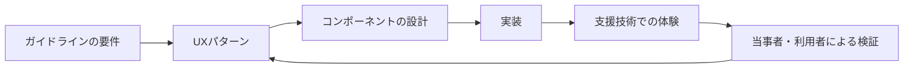

## はじめに

先日、Microsoft Developer の動画 [Fluent UI React Insights: Accessible by default](https://www.youtube.com/watch?v=Xmt1wZ_r8JM) を視聴しました。

Fluent UI のコンポーネントが、どのようにアクセシビリティを前提として設計されているのかを紹介する動画です。実装の細かなテクニックというより、UI ライブラリをつくる段階からアクセシビリティを組み込むことの難しさと、その必要性に焦点が当てられているように感じました。

私が強く感じたのは、**アクセシビリティは、完成した画面を最後に点検する作業ではなく、最初の設計判断そのものに含めるべきだ**ということです。

もう一つ、最近の UI を考えるうえで重要な気づきがありました。UI は高度になり続けていますが、ガイドラインはすべての新しい UX パターンを具体的に規定しているわけではありません。要件は示されていても、その要件を満たす操作体験のパターンまでは決まっていないことがあります。

この「要件とパターンの間」を埋めるものとして、Fluent UI のようなデザインシステムが有効なのではないか、と考えました。

:::message
この記事は、動画を視聴して得た気づきをもとにした考察です。Fluent UI の特定バージョンの API 解説や、すべてのコンポーネントがあらゆる状況でアクセシブルになることを保証する記事ではありません。
:::

## ガイドラインは「何を満たすか」を示す

アクセシビリティの設計では、まず WCAG（Web Content Accessibility Guidelines）を参照します。WCAG 2.2 は、アクセシブルなコンテンツを次の四つの原則で整理しています。

| 原則 | 設計で考えること |
|------|------------------|
| 👁️ 知覚可能（Perceivable） | 情報が見えない、聞こえない場合にも別の手段があるか |
| ⌨️ 操作可能（Operable） | キーボードなどで操作でき、フォーカスが迷子にならないか |
| 🧭 理解可能（Understandable） | 表示や操作の意味、次に起きることが予測できるか |
| 🔗 堅牢（Robust） | ブラウザーや支援技術と正しく情報を共有できるか |

たとえば WCAG 2.2 の達成基準 2.1.1 は、すべての機能をキーボードで操作できることを求めています。また 2.4.7 や 2.4.11 などは、キーボードフォーカスがどこにあるかを利用者が把握できることに関係します。

これらは非常に重要な要件です。しかし、要件を読んだだけでは、複雑なコンポーネントをどう設計すればよいかまでは決まりません。

たとえば「キーボードで操作できるメニュー」を考えてみます。Tab キーで全項目を順に移動させるのか、矢印キーで項目を移動させるのか。開いたサブメニューへどのようにフォーカスを移すのか。Escape キーで閉じた後、どこへフォーカスを戻すのか。これらは単一の文言だけでは決まりません。

つまり、WCAG は合格すべき条件を示してくれますが、条件を満たしながら利用者にとって自然な操作にする方法は、設計者と実装者が決めなければならないのです。

## 高度な UI ほど「パターン」が必要になる

昔ながらの Web ページであれば、見出し、リンク、ボタン、フォームといった HTML の基本要素を適切に使うことで、かなりの部分を標準の振る舞いに任せられました。

しかし現在の UI は、コンボボックス、オートコンプリート、データグリッド、ダイアログ、ドラッグ操作、非同期で更新される通知など、複数の状態と操作方法を持つ部品で構成されています。

ここでは、見た目だけを再現しても十分ではありません。利用者と支援技術に対して、少なくとも次の情報が一貫して伝わる必要があります。

- この要素は何か（名前と役割）
- 今どの状態か（展開中、選択中、無効など）
- 次にどの操作ができるか
- 操作後に何が変わったか
- 操作が終わった後、フォーカスをどこへ戻すか

画面に表示される状態と、アクセシビリティツリーに公開される状態がずれていれば、見た目は整っていても操作体験は壊れます。

この図で大切なのは、ガイドラインから実装へ一直線に進むのではなく、要件を操作パターンに翻訳する層があることです。

## Fluent UI が埋め込もうとしているもの

Fluent UI に魅力を感じたのは、アクセシビリティを個々の画面開発者の注意力だけに委ねず、コンポーネントや設計ガイドの中へ組み込もうとしている点です。

たとえば、アクセシブルなボタンを作るという話は、単に文字色と背景色のコントラストを確認するだけではありません。適切な HTML の役割、キーボードからの到達性、押下状態や無効状態の表現、フォーカスインジケーター、名前の付け方までが一つの部品の品質になります。

これを毎回ゼロから実装すると、チームごと、画面ごとに判断が分かれます。ある画面では Enter キーで動くのに、別の画面では Space キーだけで動く。あるダイアログでは閉じた後に起点へ戻るのに、別のダイアログではページの先頭へフォーカスが飛ぶ。こうした差は、利用者の学習負荷と不安を増やします。

デザインシステムは、次のような判断を共有可能な形にします。

| 層 | Fluent UI のようなデザインシステムが支えること |
|----|----------------------------------------------|
| 🎨 視覚 | 色、コントラスト、状態、フォーカスの表現 |
| ⌨️ 操作 | キーボード操作、フォーカス移動、Escape などの振る舞い |
| 🏷️ 意味 | 名前、役割、状態を支援技術へ伝える構造 |
| 🧩 パターン | メニュー、ダイアログ、コンボボックスなどの一貫した設計 |
| 📚 チーム | デザイナー、開発者、レビュアーが同じ語彙で話す基盤 |

ここでいう「Accessible by default」は、「何もしなくてもすべての製品がアクセシブルになる」という意味ではありません。最初に選ぶ部品と既定の振る舞いが、アクセシビリティを損なう方向ではなく、良い方向に寄っているという意味で捉えるのがよいと思います。

## デザインシステムはガイドラインの不足を補う

ガイドラインが UX パターンをすべて規定していないことは、弱点とは限りません。多様な製品や技術のすべてに一つの画面パターンを強制するのは難しいからです。

一方で、現場には判断が必要です。たとえば、検索候補を表示する入力欄では、候補が表示されたこと、現在選択されている候補、候補がないことを、視覚的にも支援技術にも伝えなければなりません。しかし、候補表示のタイミングや選択方法は、製品の目的やデータ量によって変わります。

ここでデザインシステムは、法律や規格の代わりになるのではなく、抽象的な要件を、再利用できる設計パターンへ変換する知識の蓄積になります。

これはコンポーネントを採用するだけの話でもありません。デザインシステムには、次のようなチームの問いをあらかじめ含められます。

- このコンポーネントにはどの入力方法で到達するか
- フォーカスが移動したとき、利用者は何を知る必要があるか
- ラベルと説明文はどこに置くか
- エラーや非同期更新をどう通知するか
- どの部分は自動テストでき、どの部分は人が確認するか

この問いが設計レビューの最初に現れるだけでも、アクセシビリティを「最後の修正項目」にしにくくなります。

## それでもデザインシステムだけでは足りない

Fluent UI を使えば終わり、ということではありません。

コンポーネントの内部実装が適切でも、アプリケーション側でラベルを欠落させれば、利用者には意味が伝わりません。ダイアログの中に入れる説明が不十分なら、フォーカス管理が正しくても操作の目的を理解できません。画面全体の見出し構造、エラー文、業務上の用語、コンテンツの順序は、製品側の責任です。

また、自動テストで確認できる範囲にも限界があります。コントラスト比、ラベルの有無、ARIA 属性の一部などは自動化しやすい一方で、次のような問題は人の判断を必要とします。

- 説明文が利用者の目的に対して十分か
- 読み上げ順序が自然で、情報を再構成できるか
- フォーカス移動が操作の文脈に合っているか
- 実際のキーボードやスクリーンリーダーで迷わず操作できるか

デザインシステム、自動テスト、手動テスト、当事者を含む利用者からのフィードバックは、代替関係ではなく補完関係です。

:::message alert
アクセシビリティの確認を、axe や Lighthouse の結果だけで完了にしないことが重要です。自動検査は有効な入口ですが、ユーザー体験の妥当性まで自動で保証するものではありません。
:::

## 最初から設計するとは何か

「最初からアクセシビリティを考える」という言葉は、要件定義の資料に「アクセシビリティ対応」と一行追加することではありません。

私が今回の動画を見て考えた、より具体的な意味は次のとおりです。

1. 画面を描く前に、利用者の目的と操作方法を考える
2. コンポーネントを選ぶときに、名前・役割・状態・フォーカスを確認する
3. デザインレビューで、見た目だけでなくキーボード操作を確認する
4. 実装レビューで、支援技術へ伝わる情報と DOM の順序を確認する
5. 自動検査と手動検証を、開発後ではなく開発中のループに入れる

この順番なら、問題が見つかったときに CSS を足すだけでは済まないことも早く分かります。場合によっては、コンポーネントの選択、情報の順序、入力フローそのものを変える必要があります。だからこそ、後工程で発見するほど修正コストが高くなります。

アクセシビリティは品質保証の工程であると同時に、UX の設計原則です。利用者が「使えるか」だけではなく、「何が起きているか分かるか」「自分で戻れるか」「操作を覚え直さなくてよいか」まで考えることだからです。

## おわりに

今回、Fluent UI のアクセシビリティに関する動画を視聴して、アクセシビリティを最後に足すことの難しさを改めて感じました。

高度な UI では、ガイドラインは必要な要件を示してくれます。しかし、要件を満たす具体的な操作パターンを毎回チームで発明していると、判断がばらつき、同じ問題を繰り返しやすくなります。

Fluent UI のようなデザインシステムは、その間をつなぐ存在です。アクセシビリティに関する知識、操作パターン、視覚表現、実装上の判断を、再利用できる部品と共通言語へ変換します。

もちろん、デザインシステムを採用しても、コンテンツの意味や製品固有の体験まで自動的に解決されるわけではありません。それでも、最初から良い既定値とパターンを選べることには大きな価値があります。

アクセシビリティを後から検査するのではなく、最初から設計の材料にする。その実践を支える道具として、デザインシステムをもっと活用していきたいと思います。

## 参考文献

- [Microsoft Developer, "Fluent UI React Insights: Accessible by default"](https://www.youtube.com/watch?v=Xmt1wZ_r8JM)
- [Microsoft Fluent 2 Design System, "Accessibility"](https://fluent2.microsoft.design/accessibility)
- [Microsoft Fluent UI, "Accessibility Best Practices"](https://github.com/microsoft/fluentui/blob/master/docs/react-wiki-archive/BestPractices/Accessibility.md)
- [W3C, "Web Content Accessibility Guidelines (WCAG) 2.2"](https://www.w3.org/TR/WCAG22/)
- [W3C, "WAI-ARIA Authoring Practices Guide"](https://www.w3.org/WAI/ARIA/apg/)
