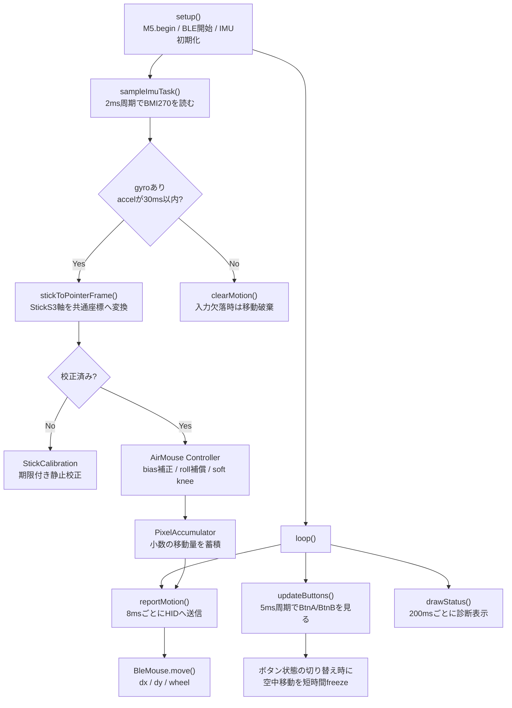

## はじめに

この記事では、`tomokusaba/m5stack-ble-mouse` に実装されている M5StickS3 による BLE（Bluetooth Low Energy）HID（Human Interface Device）Mouse の動きに絞って、ソースコードを読みながら設計を整理します。

対象リポジトリはこちらです。執筆時点（2026-09-07）では、`README.md`、`platformio.ini`、`src/StickMouse.cpp`、M5StickS3 向けの `include/` 配下、テストコードを確認し、`abb57174154eeec289ca037089f343292f348c7b` の実装に基づいて整理しました。

- [tomokusaba/m5stack-ble-mouse](https://github.com/tomokusaba/m5stack-ble-mouse)
- [確認したコミット](https://github.com/tomokusaba/m5stack-ble-mouse/tree/abb57174154eeec289ca037089f343292f348c7b)

M5StickS3 は、M5Stack 公式ドキュメントで 48.0 × 24.0 × 15.0 mm / 20.0 g と記載されている小型デバイスです。このサイズ感は、通常のマウスを握る・机上で滑らせるという前提から少し距離を置ける可能性があります。ただし、誰にでも合う入力方式だと断定するものではありません。手の可動域、疲れやすさ、震え、保持しやすい姿勢は人によって大きく違うため、本記事では「選択肢の一つとしてどう設計できるか」を丁寧に見ていきます♿

この記事は、M5Stack / Arduino で BLE HID 入力を試したい人、IMU（慣性計測ユニット）を使ったポインティング設計を読みたい人、通常のマウス以外の入力方法を検討したい人を想定しています。支援機器としての有効性を保証するものではなく、入力方式を考えるための実装メモとしてお読みください。

前段の試行として、次の 2 本の記事があります。この記事はその続きとして、M5StickS3 では物理ボタンと BMI270 ジャイロでどうマウス入力を組み立てているかに集中します。

- [M5Stack CoreS3 のタッチパネルで BLE マウスを作る](https://qiita.com/tomokusaba/items/9b392102d8931a48e386)
- [M5Stack CoreS3 で BMI270 ジャイロを使った BLE HID 空中マウスを自然に操作する](https://qiita.com/tomokusaba/items/9da7a5b531d31c9f9e7e)

まずは目的をそろえたうえで、前記事との関係、前提、設計判断、実装の流れへ進みます。

---

## 目的

この記事の目的は、完成した操作方法の紹介だけではなく、なぜその実装になっているのかを読み解くことです。

- ✅ M5StickS3 を BLE HID Mouse として使う実装の全体像を把握する
- ✅ BMI270 のジャイロを使った相対移動の考え方を理解する
- ✅ 物理ボタン、ドラッグ、右クリック、中クリック、スクロールの割り当てを確認する
- ✅ 小型筐体・空中操作・アクセシビリティ上の利点と限界を、過度に断定せず整理する
- ✅ README / ソース / 公式ドキュメントで確認できる仕様と、体感に依存する部分を分けて扱う

特に大事なのは、M5StickS3 版が「加速度の傾きでカーソル位置を決める」実装ではない点です。カーソル移動はジャイロの角速度から相対移動として作り、加速度は姿勢基準や静止判定に使います。

次に、この実装が前記事からどうつながっているのかを整理します。

---

## 前記事との関係

前記事の流れをざっくり整理すると、次のようになります。

| 記事 | 主な入力 | 位置づけ |
|------|----------|----------|
| 🧪 [CoreS3 タッチパネル版](https://qiita.com/tomokusaba/items/9b392102d8931a48e386) | タッチパネル | BLE HID Mouse として PC に入力を送る足場づくり |
| 🌀 [CoreS3 ジャイロ空中マウス版](https://qiita.com/tomokusaba/items/9da7a5b531d31c9f9e7e) | BMI270 ジャイロ + タッチ | 空中操作で自然なカーソル移動を作る試行 |
| 🖱️ 本記事 | M5StickS3 の BMI270 + 物理ボタン | 小型筐体で、物理ボタンと空中操作を組み合わせる設計 |

CoreS3 はタッチパネルを持っているため、タッチパッド的な操作を組み込めます。一方で M5StickS3 は、公式仕様上タッチパネルではなく 1.14 インチ LCD とプログラマブルボタンを持つデバイスです。そのため、入力の中心は物理ボタン + IMU（Inertial Measurement Unit、慣性計測ユニット）です。

この違いは設計にかなり効いています。CoreS3 では「画面に触っている間は空中マウスを止める」というタッチ優先の設計ができますが、M5StickS3 では、ボタンを押した瞬間にカーソルが飛ばないようにしたり、ボタン長押しをドラッグやスクロールへ安全に分岐させたりする必要があります。

ここからは、M5StickS3 版だけに絞って前提を確認します。

---

## 前提

今回確認したコードは PlatformIO プロジェクトです。README では、M5StickS3 と M5Stack CoreS3 の両方に対応しています。ただし、M5StickS3 に書き込む場合は環境を明示する必要があります。

```bash
pio run -e m5stack-sticks3
pio run -e m5stack-sticks3 -t upload
```

`platformio.ini` では `default_envs` が `m5stack-cores3` になっているため、`-e m5stack-sticks3` を省略すると CoreS3 用ファームになります。ここは地味ですが、実機へ書き込むときに間違えやすいポイントです。

```ini
[platformio]
default_envs = m5stack-cores3

[env:m5stack-sticks3]
board = m5stack-sticks3
board_build.flash_size = 8MB
board_build.partitions = default_8MB.csv
upload_speed = 921600
build_flags =
    ${env.build_flags}
    -DTARGET_M5STICKS3
    -DARDUINO_USB_CDC_ON_BOOT=1
    -DARDUINO_USB_MODE=1
```

M5StickS3 側の主な前提は次のとおりです。ハードウェア仕様は [M5Stack 公式 StickS3 ドキュメント](https://docs.m5stack.com/en/core/StickS3) と、リポジトリ内の `README.md` / `boards/m5stack-sticks3.json` / ソースコードを照合しています。

| 項目 | 確認した内容 | 根拠 |
|------|--------------|------|
| 🧠 SoC | ESP32-S3-PICO-1-N8R8 | M5Stack 公式仕様 |
| 💾 Flash / PSRAM | 8MB Flash / 8MB PSRAM | Flash は `boards/m5stack-sticks3.json`、PSRAM は M5Stack 公式仕様 |
| 🧭 IMU | BMI270 | M5Stack 公式仕様、README、`initializeImu()` |
| 🖥️ LCD | ST7789P3、135 × 240 | M5Stack 公式仕様（M5GFX のコード上は ST7789 系 Panel、135 × 240） |
| 🔘 ボタン | KEY1=GPIO11、KEY2=GPIO12 | M5Stack 公式 PinMap、README |
| 📐 サイズ / 重量 | 48.0 × 24.0 × 15.0 mm / 20.0 g | M5Stack 公式仕様 |
| 🔋 バッテリー | 250 mAh | M5Stack 公式仕様 |
| 🧩 フレームワーク | Arduino / PlatformIO | `platformio.ini`、公式ドキュメント |

BLE マウスとしてのデバイス名は、`src/StickMouse.cpp` で次のように定義されています。

```cpp
BleMouse bleMouse("M5StickS3 IMU Mouse");
```

なお、本記事では OS 側のポインタ速度や加速設定、BLE 通信の実効遅延、個々の実機差までは測定していません。README にもあるとおり、カーソルの体感は PC 側の設定にも依存します。また、`platformio.ini` の依存ライブラリはコミット固定ではないため、ここで引用する M5Unified のソースは、執筆時点で確認できた版（0.2.20 相当、コミット `774d920...`）として扱います。

前提がそろったので、次は設計の考え方を見ていきます。

---

## なぜこの設計か

M5StickS3 版の設計で一番大きい判断は、**小型デバイスを机上マウスの代替としてではなく、別の入力形態として扱っている**ことだと思います。

通常のマウスは、手で握り、机の上で動かし、指でボタンを押す、という前提の上に成り立っています。しかし、その前提が合わない人もいます。たとえば、マウスを握り続けるのが難しい、机上で細かく動かすことが難しい、姿勢や設置場所の制約が大きい、といった場合です。

M5StickS3 のような小型筐体は、手のひらで包む、指先でつまむ、ベルトや治具（固定・保持用の補助具）に固定するなど、通常のマウスとは違う保持方法を試せる可能性があります。ただし、軽いことや小さいことが常に利点になるわけではありません。小さすぎると押しにくい人もいますし、空中で保持すること自体が負担になる人もいます。

そのため、この実装は「これで解決」と言い切るより、入力の選択肢を増やすための実験台として見るのが自然です。

### 加速度ではなくジャイロで相対移動を作る

カーソルを動かす方法として、最初に思いつきやすいのは「傾けた方向に進む」方式です。しかし、傾きだけでカーソルを作ると、傾けたまま静止したいときや、持ち替えたときの解釈が難しくなります。

このコードでは、カーソル移動の主役を BMI270 のジャイロ（角速度センサー）に置いています。つまり「今どれだけ回したか」を積分し、相対移動として BLE HID Mouse に送ります。傾けたまま静止している場合は、バイアス補正後の角速度がゼロに近くなるため、カーソルも止まります。

```text
手の回転量 → ジャイロ角速度 → yaw（左右旋回） / pitch（上下回転） → HID の dx / dy
```

加速度は不要になるわけではありません。静止時の姿勢基準や、手首のロール補償、キャリブレーションの安定判定に使われます。ここがトレードオフです。加速度を移動量に直接使わないことで「傾けっぱなしで動き続ける」問題を避けつつ、姿勢補正のためには加速度を参照しています。

### StickS3 の軸を共通座標へ変換する

README では、StickS3 のネイティブ軸は CoreS3 と異なると説明されています。StickS3 では `+X` が USB-C 向き、`+Y` が画面右、`+Z` が画面から外向きです。

そこで `include/AirMouse.h` では、StickS3 の値をポインタ計算用の共通フレームへ変換しています。

```cpp
// StickS3 native +X points to USB, +Y to screen right, +Z out of the screen.
inline Vec3 stickToPointerFrame(Vec3 native) {
  return {native.y, -native.x, native.z};
}
```

この変換により、以降の `Controller` は「画面右を X、先端方向を Y、画面外を Z」として扱えます。デバイス固有の軸差を入口で吸収しておくことで、移動計算は CoreS3 と共通の `AirMouse.h` に寄せられます。

### ボタン操作と空中操作を競合させない

M5StickS3 では、前面 BtnA と側面 BtnB がマウスボタンに対応します。README と `include/StickButtons.h` から整理すると、割り当ては次のようになります。

| 入力 | 操作 | 設計上の意味 |
|------|------|--------------|
| 🔘 BtnA 短押し | 左クリック | 基本クリック |
| 🔘 BtnA 450ms 長押し | 押している間だけ左ドラッグ | 誤って固定ドラッグにならない |
| 🔘 BtnB 短押し | 右クリック | コンテキストメニュー向け |
| 🔘 BtnB 300ms 未満に再押下 | 中クリック | ボタン数の少なさを補う |
| 🔘 BtnB 350ms 長押し + 先端上下 | ホイールスクロール | カーソルを止めてスクロールへ切替 |
| 🌀 強いシェイク | 空中操作の一時停止 / 再開 | 電源ボタンを別用途にしない |

クリックするためにボタンを押すと、本体そのものも少し動きます。その動きまでカーソル移動に変換してしまうと、押した瞬間にポインタがずれます。そこで `airMouse.freeze()` や `setInput()` により、ボタン状態が切り替わるときや直後は空中マウス側の移動を短時間止めています。ドラッグ中は、初期の凍結が終われば左ボタンを保持したまま空中移動できます。

この「入力を増やすほど競合が増える」問題を、状態管理でほどいているのが M5StickS3 版の設計の面白いところです。

次に、実装全体の流れを図で見ます。

---

## 実装の流れ

M5StickS3 版は、IMU サンプリング、ボタン処理、BLE HID レポート、画面診断を分けて扱っています。



周期に関係する定数はソースから確認できます。

| 定数 | 値 | 役割 |
|------|---:|------|
| `kImuPollMs` | 2ms | IMU 専用タスクのポーリング周期 |
| `kReportIntervalUs` | 8000µs | BLE HID 移動レポートの送信間隔 |
| `kMaxSampleGapUs` | 30000µs | 入力欠落とみなして移動を破棄する目安 |
| `kButtonPollUs` | 5000µs | ボタン状態の確認周期 |
| `kStatusIntervalMs` | 200ms | 診断画面の更新周期 |
| `kTouchFreezeUs` | 150000µs | クリック等の直後に空中移動を止める時間 |

ここでのポイントは、センサー値を読む処理と BLE へ送る処理を同じ粒度にしていないことです。IMU は細かく読み、移動量は浮動小数で蓄積し、HID レポートのタイミングで整数として取り出します。

では、コードの要所を順番に見ていきます。

---

## コード解説

この節では、初期化 → IMU 設定 → 起動時校正 → 移動量の計算 → HID 送信 → ボタン状態機械（state machine）の順に見ていきます。先に設計判断とコード節の対応を示すと、次のようになります。

| 設計判断 | 対応するコード節 |
|----------|------------------|
| StickS3 の軸差を入口で吸収する | 1、4 |
| 起動時にジャイロバイアスを推定する | 2、3 |
| ジャイロの相対移動を操作感へ変換する | 4、5、6 |
| ボタン操作と空中操作の競合を抑える | 7、8 |

### 1. M5StickS3 と BMI270 であることを確認する

`src/StickMouse.cpp` の `initializeImu()` では、まず対象ボードと IMU の種類を確認します。

```cpp
const char* initializeImu() {
  if (M5.getBoard() != m5::board_t::board_M5StickS3) {
    return "WRONG BOARD";
  }
  if (!M5.In_I2C.isEnabled() || !M5.Imu.isEnabled()) {
    return "IMU DISABLED";
  }
  if (M5.Imu.getType() != m5::imu_bmi270) {
    return "WRONG IMU TYPE";
  }
  if (!readImuRegisters()) {
    return "I2C READ FAILED";
  }
  if (diagnostics.chipId != 0x24) {
    return "CHIP ID ERROR";
  }
  // ...
  return nullptr;
}
```

公式 PinMap では StickS3 の BMI270 は I2C `0x68`、SCL=G48、SDA=G47 とされています。コード側も `readImuRegisters()` でチップ ID や内部状態、電源、設定レジスタを読み、画面に診断情報として出します。

ここは「動かなかったらシリアルログを見る」だけでなく、本体 LCD に `ID`、`@`、`IN`、`ER`、`P`、`CFG` などを表示する設計です。小型デバイス単体で状態が見えるのは、試作時にはかなり助かります。

### 2. BMI270 の設定を読み戻して確認する

`include/AirMouseImu.h` では、BMI270 の設定レジスタへ値を書いたあと、読み戻して一致を確認しています。

```cpp
inline bool configureAirMouseImu() {
  using Bmi = m5::BMI270_Class;
  auto* sensor = M5.Imu.getImuInstancePtr(0);
  if (!sensor || M5.Imu.getType() != m5::imu_bmi270) {
    return false;
  }
  // Bosch BMI270 の定義に対応する設定: 400Hz、通常帯域、性能優先。
  // Preserve the 8g / 2000dps ranges used by M5Unified's conversion factors.
  const uint8_t config[] = {0xAA, 0x02, 0xEA, 0x00};
  uint8_t actual[sizeof(config)] = {};
  if (!sensor->writeRegister(Bmi::ACC_CONF_ADDR, config, sizeof(config)) ||
      !sensor->readRegister(Bmi::ACC_CONF_ADDR, actual, sizeof(actual)) ||
      memcmp(config, actual, sizeof(config)) != 0) {
    return false;
  }
  M5.Imu.setCalibration(0, 0, 0);
  for (size_t index = 3; index < 6; ++index) {
    M5.Imu.setOffsetData(index, 0);
  }
  return M5.Imu.setAxisOrder(m5::IMU_Class::axis_x_pos, m5::IMU_Class::axis_y_pos,
                            m5::IMU_Class::axis_z_pos);
}
```

README では、この設定を「400 Hz、通常帯域／性能優先、±8 g、±2000°/秒」と説明しています。レジスタ値の対応は [Bosch BMI270 Sensor API の定義](https://github.com/boschsensortec/BMI270_SensorAPI/blob/master/bmi2_defs.h) にも照らして確認できます。また、M5Unified 側の `IMU_Base.hpp` では、加速度とジャイロの換算係数が `8.0f / 32768.0f`、`2000.0f / 32768.0f` になっていることも確認できます。

設計意図としては、ライブラリの保存オフセットや単発校正に任せず、このファームウェアの起動時校正でジャイロバイアスを作ることです。毎回 RAM 上で取り直すため、起動直後に静止させる操作が重要になります。

### 3. 起動時校正を無期限にしない

M5StickS3 版では、`include/StickCalibration.h` に専用の起動時校正があります。

```cpp
namespace stick_calibration {

constexpr uint32_t kMinimumDurationUs = 1000000;
constexpr uint32_t kAttemptDurationUs = 1500000;
constexpr uint32_t kMinimumSamples = 200;
constexpr uint32_t kMaximumAttempts = 3;
constexpr float kGyroStdDevDps = 0.8f;
constexpr float kAccelStdDevG = 0.04f;
constexpr float kGravityToleranceG = 0.15f;
constexpr float kMaximumMeanRateDps = 5.0f;

// Fixed wall-clock windows cannot be restarted forever by a single noisy sample.
class Calibration {
  // ...
};

}  // namespace stick_calibration
```

コメントにもあるように、固定時間の窓で校正を進め、ノイズがあるたびに無期限に最初からやり直す形にしない設計です。README では、1 回最大 1.5 秒、最大 3 回の試行、200 サンプル以上・1 秒以上などの条件が説明されています。

3 回とも通常条件を満たせない場合でも、取得済み試行のうち変動が小さい平均バイアスを使って `CAL:WARN best bias` と表示し、警告付きで動き始める経路があります。これは精度と可用性のトレードオフです。

:::message
警告付き復帰は「必ず正しい校正値が得られた」という意味ではありません。動いたままの校正値はずれる可能性があるため、警告が出た場合は静止状態でリセットして再校正するのが安全です。
:::

### 4. 角速度を yaw / pitch へ投影する

空中マウスの中核は `projectRates()` です。

```cpp
inline Rates projectRates(Vec3 omega, Vec3 gravity, bool validGravity) {
  const float norm = length(gravity);
  if (!validGravity || norm < 0.1f) {
    return {omega.z, omega.x};
  }
  // At rest the accelerometer measures UP (specific force), not downward gravity.
  const Vec3 up = gravity * (1.0f / norm);
  const Vec3 forward(0, 1, 0);
  const Vec3 horizontal = forward - up * dot(forward, up);
  const float horizontalLength = length(horizontal);
  if (horizontalLength < kMinHorizontalProjection) {
    return {omega.z, omega.x};
  }
  const Vec3 right = cross(horizontal * (1.0f / horizontalLength), up);
  return {dot(omega, up), dot(omega, right)};
}
```

ここでは、加速度から得た `up` を使って、デバイスの前方方向 `forward` を水平面へ射影しています。そのうえで、角速度 `omega` を yaw と pitch に分けています。

この設計の利点は、先端方向を軸に少しロールしても、左右旋回は左右、先端の上下動は上下として扱いやすくなることです。一方で、加速度が 1 g から外れるような動きや、先端がほぼ鉛直で水平投影が定義しにくい姿勢では、本体軸ベースの `yaw=omega.z` / `pitch=omega.x` にフォールバックします。README ではこの状態を `BODY AXES` 表示として説明しています。

つまり「常に完全な姿勢推定をする」のではなく、ポインティングに必要な範囲で現実的に補償する設計です。

### 5. デッドゾーン、ソフトニー（閾値付近をなめらかに立ち上げる処理）、平滑化、加速

角速度をそのままカーソル移動にすると、静止時の微小な揺れやノイズもカーソルに出てしまいます。そこで `AirMouse.h` では、次の定数で操作感を作っています。

```cpp
constexpr float kPixelsPerDegree = 22.0f;
constexpr int kCursorXSign = -1;
constexpr int kCursorYSign = -1;
constexpr float kRateDeadzoneDps = 1.0f;
constexpr float kRateKneeDps = 1.0f;
constexpr float kRateFilterAlpha = 0.65f;
constexpr float kAcceleration = 0.6f;
constexpr float kAccelerationFullScaleDps = 200.0f;
```

`softenRate()` は、1°/秒以下を静止域にし、その外側 1°/秒を二次曲線でなめらかに立ち上げます。

```cpp
inline float softenRate(float rate) {
  const float excess = std::fabs(rate) - kRateDeadzoneDps;
  if (excess <= 0) {
    return 0;
  }
  const float value = excess < kRateKneeDps
                          ? excess * excess / (2.0f * kRateKneeDps)
                          : excess - kRateKneeDps * 0.5f;
  return std::copysign(value, rate);
}
```

低速域では細かく動かし、高速域では移動量をある程度伸ばすため、速度に応じた倍率も入っています。

```cpp
const float rate = std::sqrt(rates.yaw * rates.yaw + rates.pitch * rates.pitch);
const float gain = kPixelsPerDegree *
                   (1.0f + kAcceleration * std::min(rate / kAccelerationFullScaleDps, 1.0f));
```

このあたりは「正確さ」だけでなく「操作感」の領域です。基本感度や加速はコードで確認できますが、実際に使いやすいかどうかは、利用者の可動域、PC 側のポインタ設定、画面解像度によって変わります。

### 6. 浮動小数の移動量を捨てずに HID へ送る

BLE HID Mouse の `move()` に渡す移動量は、1 回あたり `signed char` として扱われます。そのため、コードでは ±127 に制限した整数を送ります。

```cpp
struct PixelAccumulator {
  float x = 0, y = 0, wheel = 0;
  static int take(float& value) {
    const int delta = static_cast<int>(std::max(-127.0f, std::min(127.0f, value)));
    value -= delta;
    return delta;
  }
  void clear() { x = y = wheel = 0; }
};
```

単純に毎回丸めると、低速時の小数分が消えます。逆に高速時に上限を超えた分を捨てると、動かした量とカーソル移動量がずれます。そこで `PixelAccumulator` は、小数分や上限を超えた残りを次回へ持ち越します。

一方で、BLE 接続切断、入力欠落、一時停止、クリック直後などでは `clearMotion()` で蓄積を捨てます。復帰時に過去の残りがまとめて送られて、カーソルが飛ぶことを防ぐためです。

### 7. BtnA / BtnB を状態機械として扱う

物理ボタンの割り当ては `include/StickButtons.h` にまとまっています。

```cpp
constexpr uint32_t kDragHoldMs = 450;
constexpr uint32_t kScrollHoldMs = 350;
constexpr uint32_t kDoubleClickMs = 300;
constexpr uint32_t kDebounceMs = 10;

struct Actions {
  bool leftClick = false, rightClick = false, middleClick = false;
  bool leftHeld = false, scroll = false, freezePointer = false;
};
```

特に BtnB は、短押しなら右クリックです。最初の解放から次の押下までが 300 ms 未満の二度押しなら中クリック、350 ms 以上の長押しならスクロールとして扱います。短押し直後にすぐ右クリックを出してしまうと、二度押し時に不要な右クリックが混ざります。そのため、コードでは右クリックを一度保留し、二度押しかどうかを判定してから送ります。

```cpp
// Inputs are already debounced by M5Unified. Delay B's single click so a double
// click never emits an unwanted right click before the middle click.
class Controller {
 public:
  Actions update(bool a, bool b, bool connected, uint32_t nowMs) {
    Actions out;
    // ...
  }
};
```

ボタンが少ない小型デバイスでは、短押し・長押し・二度押しを使うことで操作を増やせます。ただし、複雑にしすぎると覚えにくくなります。この実装は、左クリックと右クリックを基本にしつつ、中クリックとスクロールを BtnB の派生として置いています。

### 8. スクロール中はカーソルを動かさない

BtnB 長押し中は、カーソル移動ではなくホイールへ切り替えます。

```cpp
void setScrollMode(bool enabled) {
  if (scrollMode_ != enabled) {
    clearMotion();
  }
  scrollMode_ = enabled;
}
```

`Controller::sample()` の最後では、スクロールモードかどうかで蓄積先を変えています。

```cpp
if (scrollMode_) {
  pending.wheel += kScrollSign * kScrollStepsPerDegree * filteredPitch_ * dt;
} else {
  pending.x += kCursorXSign * gain * filteredYaw_ * dt;
  pending.y += kCursorYSign * gain * filteredPitch_ * dt;
}
```

README では、BtnB を 350ms 以上押したまま先端を上下に動かすと、カーソルを止めてスクロールすると説明されています。スクロール中にポインタまで動くと操作対象がずれやすいので、ここは明確にモードを分けています。

コードの要所を押さえたところで、次はこの操作がアクセシビリティ面でどんな意味を持ちうるかを考えます。

---

## 操作とアクセシビリティ上の考察

この実装の価値は、単に「M5StickS3 がマウスになる」ことだけではありません。通常のマウスとは違う身体動作で PC を操作できる可能性がある点にあります。

### 小型筐体が合う人も、合わない人もいる

M5StickS3 は公式仕様で 48.0 × 24.0 × 15.0 mm / 20.0 g とされており、一般的な机上マウスよりずっと小さいデバイスです。これにより、手全体で握る以外にも、軽く持つ・指先で支える・別の治具に固定するといった保持方法を検討できます。

たとえば、マウスを包み込む握りが難しい人にとっては、小型の棒状デバイスを別の持ち方で扱える可能性があります。一方で、細い筐体をつまむ動作が難しい人、ボタンが小さいと押しづらい人、空中で保持することが疲労につながる人もいます。

そのため、アクセシビリティ上は「小さいから良い」ではなく、保持方法を変えられる余地があると捉えるのがよいと思います。

### 空中操作は机上マウスの制約を減らす

机上マウスは、平らな場所、腕や手首を置くスペース、マウスパッドや机面との相性に依存します。M5StickS3 の空中操作では、少なくともカーソル移動そのものは机上で滑らせる動作を必要としません。

これは、机の前に座る姿勢が取りにくい場合、車椅子やベッドサイドなどで作業する場合、机上スペースが限られる場合に役立つ可能性があります。操作の自由度を増やせるためです。もちろん、BLE 接続先の PC や画面を見る環境は必要ですし、空中で安定して動かせることも前提になります。

### アクセシビリティの利点は「代替手段が増える」こと

アクセシビリティの観点では、単一の理想的な入力方式を探すより、複数の入力方式から選べることが重要です。

| 観点 | 期待できる可能性 | 注意点 |
|------|------------------|--------|
| ♿ 握る動作 | マウス全体を握らずに別の持ち方を試せる | 小型ボタンが押しづらい人もいる |
| 🌀 移動操作 | 机上で滑らせず、手首や腕の回転で相対移動できる | 空中保持が疲労になる場合がある |
| 🔘 クリック | 物理ボタンで明確な入力にできる | 長押し・二度押しは認知負荷になる場合がある |
| 🧩 固定・治具 | 小型なので別の固定方法を検討しやすい | 固定方法ごとの検証が必要 |
| 🖥️ OS 互換 | BLE HID Mouse として通常のマウス入力に近い形で扱える | OS 側の速度・加速設定に体感が左右される |

この実装は、医療機器や支援機器として完成したものではありません。しかし、プロトタイプとしては「通常のマウスを前提にしない入力」を試す入口になります。実際に使う場合は、本人の姿勢、可動域、疲労、誤操作の起きやすさを見ながら、感度やボタン割り当てを調整する必要があります。

ここまでの考察を踏まえて、最後に注意点を整理します。

---

## 注意点

:::message alert
本記事は README / ソースコード / 公式ドキュメントをもとにした実装解説です。個々の利用者にとって安全・快適・有効であることを保証するものではありません。アクセシビリティ用途で検討する場合は、本人の身体状況や利用環境に合わせて評価してください。
:::

実装・運用上の注意点は次のとおりです。

- ⚠️ `default_envs` は CoreS3 なので、M5StickS3 へ書き込むときは `-e m5stack-sticks3` を明示する
- ⚠️ 起動後は静止させて校正する。警告が出たら静止状態でリセットして再校正する
- ⚠️ BLE 接続が切れている間は PC に操作を送信しない
- ⚠️ PC 側のポインタ速度・加速設定により体感は変わる
- ⚠️ 小型筐体や空中操作は、利用者によって負担になる場合がある
- ⚠️ BtnB の二度押し・長押しなど、複合操作は便利な一方で覚える負荷がある
- ⚠️ ホスト用テスト（PC 上など実機外で実行するテスト）は IMU 計算やボタン状態機械（state machine）の数値テストであり、実機の I2C 信号や BLE 受信そのものを代替するものではない

## 参考にした資料

参考にした主な一次情報・ソースは以下です。

- [M5Stack StickS3 公式ドキュメント](https://docs.m5stack.com/en/core/StickS3)
- [StickS3 Low-Power Configuration / M5PM1](https://docs.m5stack.com/en/arduino/m5sticks3/m5pm1)
- [`README.md`](https://github.com/tomokusaba/m5stack-ble-mouse/blob/abb57174154eeec289ca037089f343292f348c7b/README.md)
- [`platformio.ini`](https://github.com/tomokusaba/m5stack-ble-mouse/blob/abb57174154eeec289ca037089f343292f348c7b/platformio.ini)
- [`include/AirMouse.h`](https://github.com/tomokusaba/m5stack-ble-mouse/blob/abb57174154eeec289ca037089f343292f348c7b/include/AirMouse.h)
- [`include/AirMouseImu.h`](https://github.com/tomokusaba/m5stack-ble-mouse/blob/abb57174154eeec289ca037089f343292f348c7b/include/AirMouseImu.h)
- [`include/StickButtons.h`](https://github.com/tomokusaba/m5stack-ble-mouse/blob/abb57174154eeec289ca037089f343292f348c7b/include/StickButtons.h)
- [`include/StickCalibration.h`](https://github.com/tomokusaba/m5stack-ble-mouse/blob/abb57174154eeec289ca037089f343292f348c7b/include/StickCalibration.h)
- [`src/StickMouse.cpp`](https://github.com/tomokusaba/m5stack-ble-mouse/blob/abb57174154eeec289ca037089f343292f348c7b/src/StickMouse.cpp)
- [`tests/air_mouse_test.cpp`](https://github.com/tomokusaba/m5stack-ble-mouse/blob/abb57174154eeec289ca037089f343292f348c7b/tests/air_mouse_test.cpp)
- [M5Unified `M5Unified.cpp`](https://github.com/m5stack/M5Unified/blob/774d920cd6851a5231748b56ece1b073645f313f/src/M5Unified.cpp)
- [M5Unified `BMI270_Class.cpp`](https://github.com/m5stack/M5Unified/blob/774d920cd6851a5231748b56ece1b073645f313f/src/utility/imu/BMI270_Class.cpp)
- [M5Unified `IMU_Base.hpp`](https://github.com/m5stack/M5Unified/blob/774d920cd6851a5231748b56ece1b073645f313f/src/utility/imu/IMU_Base.hpp)

最後に、この記事全体をまとめます。

---

## まとめ

M5StickS3 版の BLE HID Mouse 実装は、小型デバイスを「机上で動かすマウスの小型版」として扱うのではなく、物理ボタンとジャイロを組み合わせた別の入力デバイスとして設計されています。

設計の芯は次のとおりです。

- 🧭 StickS3 固有の IMU 軸を、入口で共通のポインタ座標へ変換する
- 🌀 カーソル移動は加速度の傾きではなく、ジャイロ角速度から相対移動として作る
- 📐 加速度は姿勢基準、静止判定、ロール補償に使う
- 🧊 クリックやボタン状態の切り替え時は空中移動を短時間止め、誤移動を抑える。ドラッグ中は凍結解除後に移動でき、スクロール中はホイールへ切り替える
- 🔘 少ない物理ボタンを、短押し・長押し・二度押しで用途別に拡張する
- 🧪 校正やボタン状態をホスト用テストで検証しつつ、実機依存部分は診断画面で見えるようにする

アクセシビリティの観点では、M5StickS3 の小ささや空中操作は、マウスを握る・机上で滑らせるという前提が合わない人にとって、別の操作方法を検討するきっかけになり得ます。ただし、これは万能な解ではありません。小型筐体が扱いやすいか、空中保持が負担にならないか、ボタン操作が分かりやすいかは人によって違います。

だからこそ、この実装の意義は「これが正解」と示すことではなく、**入力の前提を分解し、別の形へ組み替えられることをコードで示している**点にあると感じました。

前記事とあわせて読むと、タッチパネル、CoreS3 の空中操作、M5StickS3 の物理ボタン + IMU という流れが見えやすくなります。

- [M5Stack CoreS3 のタッチパネルで BLE マウスを作る](https://qiita.com/tomokusaba/items/9b392102d8931a48e386)
- [M5Stack CoreS3 で BMI270 ジャイロを使った BLE HID 空中マウスを自然に操作する](https://qiita.com/tomokusaba/items/9da7a5b531d31c9f9e7e)

小さなデバイスを入力の実験場として使うと、「マウスとは何か」「クリックとは何か」「人にとって無理のない操作とは何か」を考える入口になります。ここから、利用者ごとの調整や固定方法、外部スイッチ連携などへ広げていけると面白そうです🖱️
