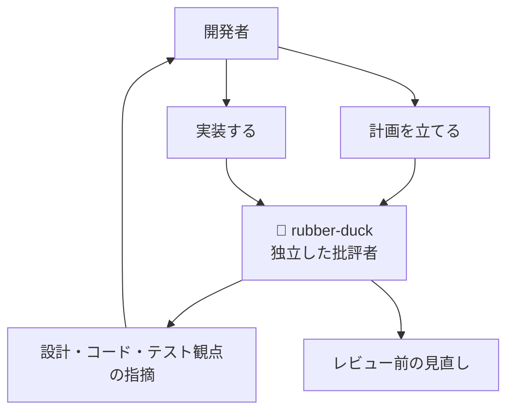

## はじめに

GitHub Copilot app の changelog を眺めていたところ、v0.2.14 で個人的にかなり気になる更新が入っていました。

> The rubber-duck agent is now enabled by default for all users, providing constructive feedback on code and designs via the /rubber-duck slash command.
>
> — [github/app changelog v0.2.14](https://github.com/github/app/blob/main/changelog.md#v0214)

要するに、changelog 上は **rubber-duck エージェントが全ユーザー向けに既定で有効になり、`/rubber-duck` スラッシュコマンドからコードや設計に対する建設的なフィードバックを得られる**ようになった、という更新です。🦆

私はふだん GitHub Copilot app を中心に使っています。その中で、GitHub Copilot CLI 側で見かけた rubber-duck の仕組みを見て、「これは app 側にも来たらうれしいな」と感じていました。だからこそ、より手軽に開ける app で rubber-duck を使えるようになるのは大きいと感じています。

この記事では、rubber-duck という考え方から、GitHub Copilot CLI / GitHub Copilot app における rubber-duck の位置づけまでを、私の体験も交えながら整理します。特に、単一のエージェントに任せきると抜け漏れや誤りが起こりうるため、別の視点を挟むことにどのような価値があるのかを見ていきます。

:::message
本記事は、GitHub Copilot app v0.2.14 の changelog に記載された内容を起点にした機能紹介と考察です。実際の挙動や UI は今後変わる可能性があるため、利用時点の changelog も確認してください。
:::

## 本記事のゴール

この記事のゴールは、GitHub Copilot app / GitHub Copilot CLI に興味がある開発者向けに、rubber-duck エージェントの価値を整理することです。

- ✅ rubber-duck、つまりラバーダック・デバッグの考え方を知る
- ✅ `/rubber-duck` がどのような役割を担うのかを理解する
- ✅ 他のエージェントではあまり見かけない「独立した批評者」としての面白さを整理する
- ✅ GitHub Copilot CLI 的な作業フローとの相性と、GitHub Copilot app に入ったことの意味を考える
- ✅ 計画・実装・テストに対して、どのような盲点に気づく助けになるのかをイメージする
- ✅ 単一エージェントの抜け漏れや誤りを減らすために、どのタイミングで rubber-duck を挟むとよさそうかを整理する

まずは、rubber-duck という言葉そのものから見ていきます。

## rubber-duck とは何か

rubber-duck は、ラバーダック・デバッグ（Rubber duck debugging）に由来する言葉です。

ラバーダック・デバッグは、問題を誰かに説明するように言語化することで、自分の理解の穴や思い込みに気づくための方法です。相手は本当に人間である必要はなく、机の上のアヒルのおもちゃに向かって説明する、という比喩からこの名前が付いています。

開発中に詰まったとき、頭の中だけで考えていると、同じ前提をぐるぐる回ってしまうことがあります。ところが「この処理はまず入力を受け取って、次に検証して、それから保存して……」と順番に説明すると、途中で「あれ、この分岐はエラー時に戻ってこないのでは？」と気づくことがあります。

AI エージェントにおける rubber-duck は、この言語化の相手をエージェントに置き換えたものだと捉えるとわかりやすいです。ただし、単に相づちを打つだけではなく、計画やコード、設計に対して **建設的なフィードバックを返す批評者** として振る舞うところがポイントです。🧠

では、今回の v0.2.14 では何が変わったのでしょうか。

## v0.2.14 で何が変わったのか

今回の changelog で明示されている内容は、次のように整理できます。

| 項目 | 内容 |
|------|------|
| 🦆 対象機能 | rubber-duck エージェント |
| ✅ 状態 | changelog 上は全ユーザー向けに既定で有効 |
| 💬 呼び出し方 | `/rubber-duck` スラッシュコマンド |
| 🔎 役割 | コードや設計に対して建設的なフィードバックを返す |

実際の設定画面でも、`Experimental` の `Agents` セクションに **Rubber-duck agent** が表示されています。説明文では、Claude / GPT モデル向けに、コードや設計に対する建設的なフィードバックを行う rubber-duck subagent を有効化すると説明されています。あわせて、composer に `/rubber-duck` スラッシュコマンドを追加すること、トグル変更後にアプリの再起動が必要なことも案内されています。


この画面を見ると、rubber-duck が「設定して終わり」の隠し機能ではなく、スラッシュコマンドとして作業中に呼び出す前提の機能であることが伝わってきます。

特に重要なのは、少なくとも changelog 上では、rubber-duck が **コードや設計に対してフィードバックするエージェント**として説明されている点です。

たとえば、次のような流れが想像しやすいです。

```text
/rubber-duck
この認証フローの設計で、見落としていそうなリスクを確認してください。
特にエラー処理、テスト観点、将来の拡張性を見てほしいです。
```

このように、実装を丸ごと任せるというより、いま考えている設計や差分に対して「別の目」を入れる使い方が合いそうです。

次に、なぜこの仕組みが少し珍しく見えるのかを整理します。

## 他のエージェントではなかなか見られない仕組み

ここからは、本記事で一番重要だと感じている「別視点を挟む価値」を見ていきます。

多くの coding agent は、基本的には「依頼を受けて作業する」方向に寄っています。

- 仕様を読んで実装する
- テストを追加する
- エラーを見て修正する
- ドキュメントを書く
- PR の説明をまとめる

もちろん、レビューや質問もできます。ただ、最初から「批評する役割」として用意され、スラッシュコマンドで呼び出せる形になっているものは、まだそこまで多くない印象です。

私が似たようなことをやる場合、これまでは手動で custom agent を作ることが多かったです。たとえば、Writer とは別に Reviewer を定義し、Reviewer にはファイルを書き換えさせず、読み取り専用で指摘だけ返してもらいます。

| やりたいこと | 手動で作る場合 | rubber-duck で期待したいこと |
|--------------|----------------|------------------------------|
| 🔎 設計の穴を探す | Reviewer agent を別途定義する | `/rubber-duck` で相談する |
| 🧪 テスト観点を増やす | テスト専門の agent を作る | 実装前後に盲点を聞く |
| 🧭 方針を見直す | Orchestrator に相談する | 独立した批評者として見る |
| 🛑 実装の暴走を止める | 書き込み権限なしの agent を用意する | まずフィードバックを受け取る用途で使えることを期待したい |

この「書く人」と「批評する人」を分ける考え方は、複数エージェント構成ではかなり重要です。同じエージェントが実装もレビューも担当すると、自分の前提を引きずりやすいからです。

単一のエージェントだけで作業を進めると、どうしても抜け漏れが出ることがあります。さらに、AI エージェントは、時にはもっともらしい誤りを含む判断をすることもあります。だからこそ、作業を進めるエージェントとは別の視点から確認する rubber-duck を挟み、抜け漏れや誤りに気づきやすくすることで、精度を上げていきたいと考えています。

:::message
rubber-duck は、人間のレビューを置き換えるものではなく、レビュー前に自分の考えを整理したり、見落としを減らしたりするための補助線として使うのがよさそうです。
:::

ここからは、GitHub Copilot CLI で感じていた作業フローと、この仕組みがなぜ相性がよく見えるのかを見ていきます。

## CLI 的な作業フローと相性がよさそうな理由

私の利用感では、GitHub Copilot CLI のよさは、作業しているリポジトリの文脈を保ったまま、エージェントとの会話に入れるところです。この「作業の途中で相談する」感覚は、rubber-duck の価値を理解するときにも通じるものがあります。

IDE やブラウザーを行き来せず、ターミナル上で

- いまの差分を見てもらう
- テスト結果を踏まえて相談する
- 次にやるべき作業を分解する
- 設計の不安点を投げる

といった流れをつなげやすいです。

rubber-duck と CLI 的な作業フローの相性がよさそうなのは、**思考の途中で呼べる** ところだと思っています。実装が終わってからレビューするだけでなく、計画段階、作業途中、テストが落ちた直後など、まだ形が固まりきっていないタイミングで相談できます。

| タイミング | rubber-duck に聞きたいこと |
|------------|----------------------------|
| 🧭 計画前 | この作業分解で抜けている観点はないか |
| 🧩 実装中 | この責務分割は複雑になりすぎていないか |
| 🧪 テスト前 | 境界値、異常系、回帰テストの観点は足りているか |
| 🔎 レビュー前 | 人間レビューで突っ込まれそうな点はどこか |

特に、CLI は「手元の作業の流れ」に近い場所にあります。だからこそ、その流れに rubber-duck のような気軽に呼べる批評者を挟めると便利そうです。

では、その批評者は具体的にどのような流れで役に立つのでしょうか。

## 開発フローに rubber-duck を挟むイメージ

私が rubber-duck に期待しているのは、実装者とは独立した視点で、計画・コード・テストに対する盲点に気づく助けになる流れです。ここでは、GitHub Copilot app で作業を相談するときに、どのタイミングで rubber-duck を挟むと効きそうかを整理します。

イメージとしては、次のような位置づけです。



ポイントは、rubber-duck を「実装担当」ではなく、フィードバック役として使うことです。

実装担当のエージェントは、タスクを前に進めることに集中します。一方で rubber-duck には、少し横から見て「その前提で大丈夫ですか？」と聞いてくれる役を期待しています。

たとえば、次のような観点が返ってくると助かります。

| 観点 | 指摘してほしい例 |
|------|------------------|
| 🧭 設計 | この責務を同じクラスに寄せると、将来の拡張時に分岐が増えそう |
| 🧩 コード | 正常系に寄りすぎていて、失敗時の戻り値が曖昧になっている |
| 🧪 テスト | 境界値、権限なし、外部 API 失敗時のテストが足りない |
| 🔐 セキュリティ | ログに出してよい情報と出してはいけない情報が混ざっている |
| 🧠 認知負荷 | 仕様の説明と実装の名前がずれていて、後から読みづらくなりそう |

このような指摘は、実装が完了してから受けるより、早い段階で受けたほうが効きます。設計の方向を変えるなら、コードを書き切る前のほうが負担が軽いからです。

つまり rubber-duck は、**作業を止めるためのブレーキ** ではなく、作業を安全に進めるためのミラーのような存在だと感じています。🪞

次に、この機能が GitHub Copilot app に入ったことの意味を考えます。

## GitHub Copilot app で使えるようになってうれしい理由

私は GitHub Copilot app を中心に使っているので、CLI 側で便利そうだと感じていた考え方を app の作業にも取り入れられるのかをずっと気にしていました。

CLI はとても強い道具です。一方で、複数リポジトリや複数セッションを並行して扱うときは、作業の見通しやセッション管理の面で app のほうが自然に感じる場面もあります。

そこで rubber-duck が app 側で既定で有効になると、次のような使い方がしやすくなりそうです。

| 場面 | CLI でうれしいこと | app で期待したいこと |
|------|-------------------|------------------------|
| 🧭 作業開始前 | その場で計画を批評してもらえる | セッション単位で相談を残しやすくなる |
| 🔎 PR 前 | 差分の見落としを聞ける | レビューや PR の文脈とつなげやすくなる |
| 🗂️ 複数作業 | ターミナルからすぐ呼べる | リポジトリ / セッション単位で整理しやすくなる |
| 🧠 思考整理 | 思いついた瞬間に相談できる | 会話の流れを後から見返しやすくなる |

私にとって GitHub Copilot app の価値は、単に GUI があることではありません。CLI で感じていた強みと、app で期待するセッションや文脈の見渡しやすさを組み合わせて捉えています。

その中に rubber-duck が入ると、「実装する」「レビューする」「相談する」のうち、「相談する」ことがより自然にできるようになります。app で呼び出しやすくなるほど、別視点のレビューを作業習慣に組み込みやすくなりそうです。

最後に、実際にどのような場面で使うとよさそうかをまとめます。

## 使いどころを考える

rubber-duck は、毎回長時間使うものというより、重要な節目ごとに短く挟むのがよさそうです。ここでいう「常に使う」は、何でも長時間相談するという意味ではなく、単一のエージェントによる抜け漏れや誤りを減らすために、要所で習慣的に挟むという意味です。

たとえば、私は次のような場面で使いたいです。

| タイミング | 使いたい場面 |
|------------|--------------|
| 🧭 実装前 | 作業計画の抜け漏れを確認したいとき |
| 🧩 設計中 | 2 案で迷っていて、判断軸を整理したいとき |
| 🛠️ 実装後 | テスト観点が足りているか確認したいとき |
| 🔎 PR 前 | 人間レビューで突っ込まれそうな点を先に見たいとき |
| 🧠 依頼前 | 自分の説明があいまいなまま、エージェントに作業を投げようとしていると感じたとき |

逆に、rubber-duck にすべてを任せる使い方は少し違うと思っています。設計判断や最終的な採否は、やはり開発者が持つべきです。

:::message alert
rubber-duck からの指摘は、あくまで判断材料の 1 つです。指摘がもっともらしく見えても、既存設計、要件、チームの方針と照らして採否を決める必要があります。
:::

この距離感で使えると、rubber-duck はかなりよい相談相手になりそうです。

## おわりに

GitHub Copilot app v0.2.14 で rubber-duck エージェントが既定で有効になったことは、見た目以上に大きな更新だと感じています。

実装するエージェントは増えてきました。一方で、実装者とは少し距離を置いて、計画や設計、コード、テストに対して建設的に突っ込んでくれるエージェントは、開発フローの中でとても重要です。

私の場合、これまでは同じようなことをやろうとすると、手動で Reviewer agent を作ったり、読み取り専用レビューのルールを整えたりしていました。そこに `/rubber-duck` という呼び出し口が用意されることで、コードや設計への建設的なフィードバックを得る体験がぐっと身近になりそうです。🦆

GitHub Copilot app の中で rubber-duck を使えるようになることで、相談の流れが扱いやすくなる可能性があります。私はそこに、今後の coding agent 体験の面白さを感じています。

ただし、rubber-duck は誤りを完全に防ぐものではありません。最終判断は開発者が持ちつつ、単一エージェントに任せきらずに独立した批評者を挟む。その習慣を作りやすくする入口として、`/rubber-duck` はかなりうれしい存在になりそうです。
