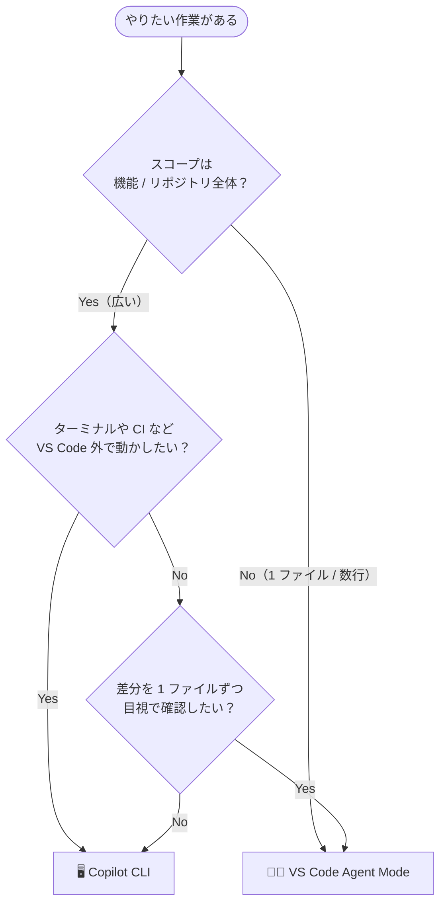

## はじめに

GitHub Copilot を日常的に使っていると、**「ターミナルで動く Copilot CLI」** と **「VS Code の Copilot Chat Agent Mode」** という、似ているようで性格の異なる 2 つの選択肢が手元に揃ってきます。どちらも自然言語で指示を出すと、ファイルを読み書きし、コマンドを実行し、タスクを進めてくれる「エージェント」です。

本記事は **C# / .NET 開発者**（ASP.NET Core、Blazor、コンソール、ライブラリなど）を想定読者にしています。実際に両方を C# プロジェクトで回してみると、**得意な仕事の粒度が明確に違う**ことに気付きます。本記事では、両者の機能を比較した上で、

- **GitHub Copilot CLI は「全体的な機能の実装」に向く**
- **VS Code の Agent Mode は「小さな修正」に向く**

という観点で、私自身の使い分けの基準を整理します🧭

## 本記事のゴール

- GitHub Copilot CLI と VS Code Copilot Chat Agent Mode の違いを表で把握できる
- どちらをいつ起動すべきか、判断基準を持てるようになる
- 実際の作業フローのイメージが掴める

## 前提条件

- ✅ GitHub Copilot のサブスクリプション（すべてのプランで Copilot CLI が利用可能。組織で使う場合は Copilot CLI ポリシーが有効化されている必要あり）
- ✅ .NET SDK（本記事は .NET 10 を前提）
- ✅ Windows では **PowerShell v6 以上**
- ✅ VS Code（Stable または Insiders）+ GitHub Copilot Chat 拡張 + C# Dev Kit

.NET SDK と GitHub Copilot CLI は winget で揃えるのが手軽です。

```pwsh
winget install --id Microsoft.DotNet.SDK.10 -e
winget install GitHub.Copilot
```

新しいターミナルを開き、`copilot --help` が表示されればインストール完了です。初回起動時は `copilot` コマンドでセッションを始め、`/login` スラッシュコマンドを入力して画面の指示に従って GitHub 認証を済ませると使えるようになります。

WinGet を使わない環境（macOS / Linux）や、Node.js をすでに入れている環境では npm でもインストールできます（全プラットフォームで Node.js 22 以上が必要）。

```pwsh
npm install -g @github/copilot
```

:::message
詳細は公式ドキュメント [Installing GitHub Copilot CLI](https://docs.github.com/en/copilot/how-tos/copilot-cli/set-up-copilot-cli/install-copilot-cli) を参照してください。また、`gh copilot`（GitHub CLI の拡張）と、本記事で扱う **エージェントとして動く `copilot` コマンド** は別物です。
:::

## 機能比較

まずは両者の特徴をテーブルで俯瞰します。

| 項目 | 🖥️ GitHub Copilot CLI | 🧑‍💻 VS Code Agent Mode |
|------|----------------------|--------------------------|
| 🚪 起動場所 | ターミナル（Windows は PowerShell v6+ / WSL、macOS・Linux） | VS Code のチャットビュー |
| 👀 UI | テキストベース、差分は diff 表示 | エディター・差分ビュー・問題タブと統合 |
| ✏️ ファイル編集 | 信頼したディレクトリ配下をまとめて編集 | ワークスペース内ファイルを編集（プレビューしながら） |
| 🤖 デフォルトモデル | Claude Sonnet 4.5（`/model` で変更可） | 選択可能（GPT / Claude / Gemini など） |
| 🛠️ ツール | シェル実行・ファイル編集・MCP サーバー・スキル・フック | ファイル編集・タスク実行・端末・テスト・MCP サーバー |
| 🔍 コンテキスト | カレントディレクトリ配下のソリューション全体 | 開いている `.cs` ファイル / 選択範囲 / `#codebase` / ワークスペース |
| 👁️ 変更の確認 | 差分をターミナルで承認／却下（`--allow-tool` / `--deny-tool` で事前設定も可） | エディター上で 1 ファイルずつ視覚的に確認、チェックポイントで巻き戻し可 |
| 🔁 反復速度 | 大きな単位で回す方が向く（plan モードで計画を作ってから実行も可） | 小さな単位を高速で回せる |
| 🧪 テスト連動 | コマンド実行で完結（`dotnet test` など） | タスク・テストエクスプローラー（C# Dev Kit）と連動 |
| 🌐 環境非依存 | SSH 先・コンテナ内・CI でもそのまま使える（`-p` でヘッドレス実行も可） | VS Code（または互換クライアント）が必要 |

ざっくり言えば、**CLI はリポジトリを「面」で扱う**のが得意で、**Agent Mode はファイルを「点」で扱う**のが得意、というのが私の感覚です。

## カスタマイズ機能の比較（Instructions / Skills / Agents）

GitHub Copilot を「自分のチームの作法」に合わせていくときに登場するのが、**Instructions（指示）**・**Skills（スキル）**・**Custom Agents（カスタムエージェント）**・**Prompt Files（プロンプトファイル）** という 4 つの仕組みです。名前は似ていますが、役割はきれいに分かれています。

まずはイメージから掴むのがおすすめです。

- 📜 **Instructions** は「**チームの就業規則**」。常に背景で効いている、暗黙の前提
- 🧰 **Skills** は「**作業マニュアルとツール一式が入った道具箱**」。必要なときに Copilot が引っ張り出して使う
- 🤖 **Custom Agents** は「**特定の役割を持った担当者**」。Plan さん・Implement さん・Reviewer さんを呼び分けるイメージ
- 📄 **Prompt Files** は「**よく使う依頼書のテンプレ**」。`/コマンド名` で一発呼び出し

これを CLI と Agent Mode に当てはめると次のようになります。

| 仕組み | 役割の一言まとめ | Copilot CLI | VS Code Agent Mode |
|--------|------------------|-------------|----------------------|
| 📜 Instructions | 常に効く前提・規約 | ✅ サポート（`AGENTS.md` ほか） | ✅ サポート（同左 + 組織レベル / `CLAUDE.md`） |
| 🧰 Skills | フォルダ単位の専門タスクパック | ✅ サポート（オープン仕様で共通） | ✅ サポート（同左、スラッシュコマンドにも出る） |
| 🤖 Custom Agents | ツール制限付きのペルソナ | ✅ サポート（CLI 組み込みの委譲先あり） | ✅ サポート（`.agent.md`、GUI で切替、handoffs あり） |
| 📄 Prompt Files | ユーザー定義の単発スラッシュ | ⚠️ ビルトインのみ（`/compact` `/model` 等） | ✅ サポート（`.prompt.md`） |

ここから 1 つずつ、**「何が同じで、何が違うのか」** を文章でほどいていきます。

### 📜 Instructions：いちばん共通点が多い

Instructions は **「Copilot にいつも効かせておきたい前提」** を Markdown で書いておく仕組みです。コーディング規約、フレームワーク選定、テストの書き方、命名ルール――こうした情報を毎回プロンプトに書きたくないので、ファイルに置いておきます。

CLI と Agent Mode で **嬉しいのは、ファイルの置き場所と書き方がほぼ同じ**だという点です。具体的には次の 2 種類が両環境で共通して認識されます。

- **`.github/copilot-instructions.md`** … リポジトリ全体に効く、1 本だけ置けるファイル
- **`AGENTS.md`**（リポジトリルート） … Copilot だけでなく Claude Code など他のエージェントも読み込む、オープン仕様のファイル

つまり **`AGENTS.md` を 1 本書いておけば、CLI で大規模に作るときも、Agent Mode で小さく直すときも、同じ前提が効きます**。C# プロジェクトなら「nullable は有効」「`record` は不変 DTO に限定」「テストは xUnit + Moq」のように、両エージェント共通で守ってほしいルールを書いておくと迷いがぐっと減ります。

ファイル種別ごとに切り替えたい規約は、両環境ともに **`.github/instructions/*.instructions.md`** に置き、フロントマターで `applyTo: "**/*.cs"` のように glob を指定します。これも書式が共通なので、CLI で書いた命令はそのまま Agent Mode でも効きます。

違いは細部です。

- **CLI 固有**: `$HOME/.copilot/copilot-instructions.md` や `COPILOT_CUSTOM_INSTRUCTIONS_DIRS` 環境変数で**マシン全体に効く命令**を持てる。さらに **`CLAUDE.md` / `GEMINI.md`** をリポジトリルートに置くことも公式に許容されている
- **Agent Mode 固有**: GitHub Organization に組織レベルの命令を置いて全リポジトリに効かせられる（`github.copilot.chat.organizationInstructions.enabled`）。`CLAUDE.md` はワークスペース・`.claude/`・ホームの 3 か所から探索される

:::message
VS Code 側では `applyTo` 未指定の `.instructions.md` は**自動適用されません**（手動で添付する必要あり）。一方 CLI では `applyTo` が一致したものが自動で混ざります。共通で使うつもりなら、`applyTo` は必ず書いておくのが安全です。
:::

### 🧰 Skills：フォルダごと持ち運べる「道具箱」

Skills は Instructions の進化版で、**「指示書（`SKILL.md`）+ 補助スクリプト + テンプレートファイル」をフォルダ単位でまとめて配布する**仕組みです。Agent Skills という[オープン仕様](https://github.com/agentskills/agentskills)に基づいているため、**Copilot CLI / Agent Mode / Claude Code などで同じスキルがそのまま動く**のが最大の特徴です。

両環境とも、検出される場所はほとんど同じです。

- プロジェクト内: `.github/skills` / `.claude/skills` / `.agents/skills`
- ユーザー全体: `~/.copilot/skills` / `~/.claude/skills` / `~/.agents/skills`

たとえば「ASP.NET Core 用のコントローラー雛形 + EF Core マイグレーション生成スクリプト + xUnit テストテンプレート」をひとつのスキルにまとめておけば、CLI からも Agent Mode からも同じスキルが呼び出せます。**「指示書＋スクリプト＋テンプレート」をひとまとまりで配布したい**ときに最適です。

CLI と Agent Mode で違うのは **呼び出し方の見え方** だけです。CLI ではプロンプトに関連するときに Copilot が裏で勝手にロードしますが、**Agent Mode では同じスキルが「`/スキル名` というスラッシュコマンド」としてもチャット入力欄に並んで見える**ので、明示的に呼びやすいです。

Instructions との違いを一言でまとめると、**「Markdown 1 枚で済むなら Instructions、スクリプトやテンプレートも一緒に配りたいなら Skills」** という棲み分けになります。

### 🤖 Custom Agents：ここが一番性格が分かれる

Custom Agents は **「特定の役割（ペルソナ）と、その役割が使えるツールのセットをパッケージ化する」** 仕組みです。Plan エージェント、Reviewer エージェント、Security Audit エージェント――タスクごとに性格を切り替えられます。

ここは **CLI と Agent Mode で実装の毛色がはっきり違います**。

**Agent Mode 側** は **`.agent.md`**（`.github/agents` フォルダなど）に YAML フロントマター + Markdown で宣言的に書きます。`tools:` で「読み取り専用」「特定 MCP サーバーだけ」などツールを絞り、`model:` で使うモデルを固定し、`handoffs:` で **Plan → Implement → Review** という連鎖ボタンまで定義できます。**チャットビュー上部の「Agent ピッカー」から GUI でカチッと切り替えられる**のが日常使いに効きます。Plan モードでは「読み取り専用ツールだけ持つ Plan エージェント」を呼び出して安全に計画を立て、ボタン 1 つで Implement エージェントに引き継ぐ、といった運用が自然にできます。

**CLI 側** にもカスタムエージェントの仕組みはありますが、思想は **「ヘッドレス・自動化寄り」** です。`--allow-tool='shell(git)'` `--deny-tool='shell(rm)'` のようにツール許可をコマンドラインで渡したり、`copilot -p "..." --allow-all-tools` で CI スクリプトに組み込んだりできます。さらに、CLI には **「特定タスクを自動委譲する組み込みエージェント」** が最初から仕込まれていて、ユーザーが意識しなくても裏で適切な役割が呼ばれます。

要するに次のような棲み分けです。

- 🧑‍💻 **対話の中でロールを切り替えたい**（Plan / Implement / Reviewer をボタンで往復したい） → **Agent Mode の `.agent.md`**
- 🤖 **CI やスクリプトに組み込んで、許可ツールを絞って自動実行したい** → **CLI の `--allow-tool` / `--deny-tool`**

### 📄 Prompt Files：Agent Mode 固有の便利機能

Prompt Files は **「定型のお願い文をファイル化して、`/名前` でチャットから呼び出す」** 仕組みで、これは **Agent Mode 固有**の機能です。`.github/prompts/*.prompt.md` に保存した内容が、チャット入力欄で `/プロンプト名` として補完されます。

CLI にも `/compact`（コンテキスト圧縮）`/context`（トークン使用量表示）`/login`（認証）`/model`（モデル切替）といった**ビルトインのスラッシュコマンド**は用意されていますが、ユーザーが自由に追加する Prompt Files の仕組みはありません。代わりに、CLI ではスキルが似た役割を担います（スキル名がスラッシュコマンドのような感覚で扱える）。

「テスト雛形を生成」「PR の説明文を作る」「セキュリティレビューの観点を投げる」といった**短いお決まりの依頼**をワンタッチで撃ちたいときは、Agent Mode の Prompt Files が便利です。

### 結局どう使い分ける？

迷ったら次のように考えると整理しやすいです。

| やりたいこと | 選ぶべき仕組み | どこで使う？ |
|--------------|----------------|---------------|
| 🌍 リポジトリ全体に効く規約・前提を 1 か所に書きたい | **Instructions（`AGENTS.md`）** | CLI / Agent Mode 共通 |
| 🧪 ファイル種別ごとに違うルールを当てたい | **Instructions（`.instructions.md` + `applyTo`）** | CLI / Agent Mode 共通 |
| 📦 「指示＋スクリプト＋テンプレ」をまとめて配りたい | **Skills** | CLI / Agent Mode 共通 |
| 🎭 GUI でロールを切り替えながら開発したい | **Custom Agents（`.agent.md`）** | Agent Mode |
| 🤖 CI でツール許可を絞って自動実行したい | **Custom Agents（`--allow-tool`）** | CLI |
| ⚡ 短いお決まり依頼を `/コマンド` で撃ちたい | **Prompt Files** | Agent Mode |

つまり、**`AGENTS.md` と Skills は両環境共通の土台、Custom Agents と Prompt Files は環境ごとに性格が分かれる** ――この感覚で持っておくと、CLI と Agent Mode の往復がぐっと楽になります。

## GitHub Copilot CLI が「全体的な機能の実装」に強い理由

### 1. ソリューション全体を一気に見渡せる

CLI を立ち上げると、セッション開始時に「信頼するディレクトリ（trusted directory）」としてカレントディレクトリ配下を認めるフローが走り、そのスコープが作業対象になります。**1 つの機能追加に必要な C# ファイル群（Controller・Service・Repository・DTO・xUnit テスト・`Program.cs` の DI 登録など）を横断的にまとめて変更**する用途に向いています。VS Code でファイルを 1 枚ずつ開いて確認する手間がない分、思考が「機能単位」のままで済みます。

### 2. 「ターミナルと一体の認識コスト」がそもそもゼロ

Copilot CLI は最初からターミナルの中で動いているため、

- パッケージ追加（`dotnet add package Microsoft.EntityFrameworkCore`）
- マイグレーション生成・適用（`dotnet ef migrations add`、`dotnet ef database update`）
- プロジェクト・ソリューション作成（`dotnet new webapi`、`dotnet sln add`）
- ビルド・テスト・整形（`dotnet build`、`dotnet test`、`dotnet format`）

といった**`dotnet` コマンド中心の作業ともちろん相性が良い**一方で、実行結果の表示もチャットと同じターミナルに出るため、**「コマンドを打つ、ログを読む、次を打つ」という認識の切り替えが生じません**。Agent Mode も統合ターミナル経由で `dotnet` コマンドを同じように実行できますが、「チャット ↔ テキストエディタ ↔ ターミナル」と視線が 3 点に分かれる分、CLI の「すべてターミナルで完結」というシンプルさは、長いループを回すときにジクジク効いてきます。

### 3. ループを「大きく回す」のに耐える

C# での新機能実装は、

1. 設計を決める（インターフェース・DTO・エンドポイント）
2. 複数の `.cs` ファイルにまたがる変更をする
3. `dotnet build` / `dotnet test` を通す
4. xUnit のテスト失敗ログを読んで修正する

というループを何周も回します。CLI は**ターミナル上で完結**するため、`dotnet` の出力をそのまま読み取り、次のアクションに繋ぐのが自然です。エディターのタブを行き来する認知コストがない分、**長時間の自律実行**に向いています。

### 4. リモート環境・ヘッドレス実行にもそのまま持ち込める

SSH 先のサーバー、開発コンテナ、CI ランナーでも `copilot` を起動できるため、ローカルに VS Code を開けないシチュエーションでも同じ体験で機能実装を進められます。`copilot -p "..." --allow-all-tools` のようにプログラマティックに起動すれば、スクリプトやパイプラインに組み込むこともできます🛰️

:::message alert
`--allow-all-tools` は承認をスキップして任意のコマンドを実行可能にします。公式ドキュメントでも**VM・コンテナ・専用マシンなど限定された環境での実行**が推奨されています。
:::

:::message
ASP.NET Core の「新規 Web API プロジェクトの立ち上げ」「複数プロジェクト横断のリファクタ」「EF Core エンティティ＋DbContext＋Controller＋xUnit テストの一括追加」など、**スコープが大きく、`dotnet` コマンドと編集が交互に走る作業**は CLI の独壇場です。
:::

## VS Code の Agent Mode が「小さな修正」に強い理由

### 1. エディターで「すぐ目視できる」安心感

Agent Mode の最大の強みは、**変更がそのままエディターのプレビューに現れる**ことです。差分は VS Code の差分ビューで色分けされ、ファイルツリーには変更マークが付き、問題タブには Roslyn のアナライザー警告やコンパイルエラーが即座に並びます。

「この `record` にプロパティを 1 つ足したい」「null 許容警告（CS8618）を潰したい」「このメソッドだけ xUnit のテストを追加したい」といった**スコープが狭く、見た目で正しさを判断できる修正**は、Agent Mode の方が圧倒的に速く回せます👁️

### 2. 「開いているファイル」「選択範囲」が暗黙のコンテキストになる

VS Code 上では、

- 今フォーカスしている `.cs` ファイル
- 選択中のクラスやメソッド
- `#file` / `#codebase` / `#terminalSelection` などの明示コンテキスト

が自動的にエージェントの参考情報として効いてきます。公式ドキュメントでも「アクティブなファイル、現在の選択、ファイル名」が暗黙のコンテキストとして含まれると明記されています。**「この `UserService` クラスだけ」「この LINQ 式だけ」**という指示が、自然言語で簡潔に伝わります。CLI で同じ指示をすると、ファイルパスや行番号、クラス名を明示する一手間が増えがちです。

### 3. 修正 → ビルド → 確認のサイクルが短い

`Ctrl+Shift+B` で `dotnet build`、`F5` でデバッグ、C# Dev Kit のテストエクスプローラーから xUnit テストを 1 件だけ再実行――こうした **VS Code 由来の高速フィードバック** に Agent Mode はそのまま乗っかれます。小さな差分を当てて、すぐ動かして、結果を見て、次の指示を投げる、というリズムが心地よいです。

### 4. レビュー前の「最後の整え」に向く

PR を出す直前に「`async` メソッドの命名を `〜Async` に揃えたい」「XML ドキュメントコメントを追加したい」「`var` を明示型にしたい」といった**仕上げ作業**は、エディターで 1 つずつ承認しながら進めたいもの。Agent Mode は変更を 1 ファイルずつ確認・編集できる上に、**チェックポイントでスナップショットを取ってロールバックもできる**ため、レビュアー目線で差分を眺めながら整えるのに向いています✨

:::message
小さな修正は「正しさを目で確認する」ことが価値の半分を占めます。エディターと一体化している Agent Mode は、その確認コストが極小です。
:::

## 使い分けの判断フロー

私が普段、どちらを開くか決めるときの分岐です。



ざっくりした基準は次のとおりです。

| こんな作業 | 向いているのは |
|-----------|----------------|
| 🏗️ ASP.NET Core Web API の新規プロジェクト立ち上げ | Copilot CLI |
| 🧱 複数プロジェクト横断のリファクタ・NuGet 一括更新 | Copilot CLI |
| 🧪 xUnit テストプロジェクトの追加・テストスキャフォールド | Copilot CLI |
| 🗃️ EF Core のエンティティ＋DbContext＋マイグレーション一式 | Copilot CLI |
| 🛰️ Dev Container・SSH 先・GitHub Actions 上での作業 | Copilot CLI |
| 🐛 1 メソッド内のバグ修正（NullReferenceException 等） | Agent Mode |
| 🎨 Blazor / Razor コンポーネントの微調整 | Agent Mode |
| 📝 XML ドキュメントコメントの追加 | Agent Mode |
| ✏️ メソッド・プロパティのリネーム、`var` の明示型化 | Agent Mode |
| 🔍 PR 直前の差分レビューと微修正 | Agent Mode |

## 実際の作業フロー例

### ケース A: ASP.NET Core にユーザー検索エンドポイントを追加する（CLI 向き）

ソリューションのルートでターミナルから CLI を起動し、ざっくりした指示で投げます。

```pwsh
cd C:\src\MyApp
copilot
> このソリューションに、ユーザー検索 API を追加してください。
> エンドポイント: GET /api/users?query=...
> 既存の Controllers / Services / Repositories のパターンに揃え、
> EF Core の DbContext を使って検索を実装し、xUnit + Moq でユニットテストも追加してください。
> 実装後は dotnet build と dotnet test が通ることを確認してください。
```

CLI は `UsersController.cs` / `IUserService.cs` / `UserService.cs` / `UserRepository.cs` / `UserSearchTests.cs` などを横断的に編集し、`dotnet build` と `dotnet test` を回しながらエラーを潰していきます。私は差分の承認とテスト結果の確認に集中するだけで、機能が一式そろいます。

### ケース B: 「この `record` の null 許容警告を直したい」（Agent Mode 向き）

VS Code で該当の `.cs` ファイルを開き、対象の `record` を選択した状態でチャットを開いてこう指示します。

> 選択中の `UserDto` の `Name` プロパティに対する CS8618 警告を解消してください。
> 既定値として空文字を割り当ててください。

差分はエディター上にすぐ現れ、保存前にプレビュー → 承認 → 必要なら微修正、という流れが数十秒で終わります。**こうした単発の修正で CLI を立ち上げるのはオーバーキル**です。

## 併用するともっと楽になる

もちろん、片方しか使ってはいけないわけではありません。私は次のように**組み合わせて**います。

1. **CLI** で新機能の骨格（Controller / Service / DTO / xUnit テスト）をまとめて生成する
2. `dotnet test` が通ったら VS Code に戻る
3. **Agent Mode** で `Async` 命名・XML ドキュメントコメント・`var` などのスタイルを整える
4. PR を出す前に Agent Mode で差分を 1 ファイルずつレビューしながら微修正

「面で作って、点で整える」という分担が、私には一番フィットしています🧩

:::message alert
どちらのエージェントもファイルを書き換えるツールです。**変更内容は必ず差分で確認してから承認**してください。特に CLI は一度の指示で多数のファイルが変わるので、`git status` / `git diff` をこまめに確認する癖を付けると安心です。
:::

## おわりに

GitHub Copilot CLI と VS Code Agent Mode は、競合ではなく **「作業粒度に応じて持ち替える 2 本の道具」** だと捉えるのが、もっとも実用的だと感じています。

- **大きく作る** ときは CLI に任せて、ターミナルでループを回す
- **小さく直す** ときは Agent Mode で、エディターと一体になって確認しながら進める

この使い分けを意識するだけで、Copilot との付き合い方がだいぶスムーズになるはずです。みなさんの普段のワークフローも、ぜひ「面の作業」と「点の作業」で棚卸ししてみてください🛠️

それでは、よい Copilot ライフを！

## 参考リンク

- [About GitHub Copilot CLI - GitHub Docs](https://docs.github.com/en/copilot/concepts/agents/about-copilot-cli)
- [Installing GitHub Copilot CLI - GitHub Docs](https://docs.github.com/en/copilot/how-tos/copilot-cli/set-up-copilot-cli/install-copilot-cli)
- [Adding custom instructions for GitHub Copilot CLI - GitHub Docs](https://docs.github.com/en/copilot/how-tos/copilot-cli/customize-copilot/add-custom-instructions)
- [About agent skills - GitHub Docs](https://docs.github.com/en/copilot/concepts/agents/about-agent-skills)
- [Chat overview - VS Code Docs](https://code.visualstudio.com/docs/copilot/chat/copilot-chat)
- [Use custom instructions in VS Code - VS Code Docs](https://code.visualstudio.com/docs/copilot/customization/custom-instructions)
- [Custom agents in VS Code - VS Code Docs](https://code.visualstudio.com/docs/copilot/customization/custom-agents)
- [Use prompt files in VS Code - VS Code Docs](https://code.visualstudio.com/docs/copilot/customization/prompt-files)

