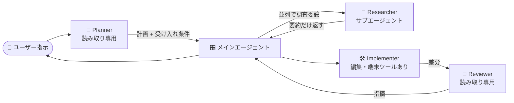
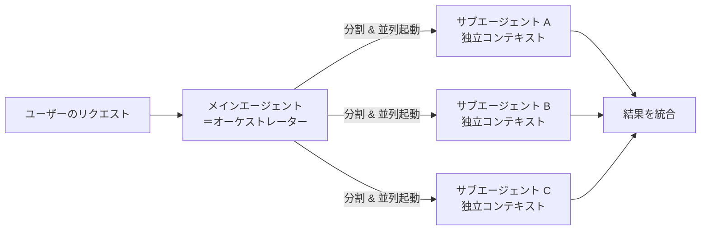

## はじめに

少し前に、私は次の記事を書きました。

https://zenn.dev/tomokusaba/articles/838cdac8d71e52

そこでは「**GitHub Copilot CLI は機能全体の実装に強く、VS Code Agent Mode は小さな修正に強い**」という、**作業粒度での使い分け**を整理しました。それ自体は有効だと感じています。

ただ、最近の VS Code 側のアップデートで **Custom Agents と Subagents（サブエージェント）** が一段と使いやすくなり、私の運用は少し進化しました。**「ただ大きく実装する」より、「役割を分けたエージェントをパイプラインで自律的に動かす」方が、結果として精度の高いコードが手に入る**ようになってきたのです🧭

本記事は、前回の続編にあたる位置づけで、

- Custom Agents（`.agent.md`）と Subagents の関係
- `runSubagent` による**自動委譲**と **コンテキスト隔離（context isolation）** の効きどころ
- **Planner → Researcher → Implementer → Reviewer** をどう組むか
- GitHub Copilot CLI 側の Agent Skills とどう棲み分けるか

を整理します。具体例として ASP.NET Core の機能追加を扱いますが、**仕組み自体は言語やフレームワークを問わず使える**話です。

## 本記事のゴール

- VS Code の Custom Agents と Subagents の役割と仕組みが分かる
- 「自分一人で全部やる 1 体のエージェント」から「役割分担した複数エージェントの自律オーケストレーション」へ移行するイメージが持てる
- 機能追加の流れで、Planner / Researcher / Implementer / Reviewer をどう組み立てるかの叩き台が手に入る（題材は ASP.NET Core ですが考え方は汎用）
- Agent Mode と Copilot CLI、それぞれの主戦場の認識をアップデートできる

## 前提条件

- ✅ GitHub Copilot のサブスクリプションが有効であること（Custom Agents / Subagents は VS Code の Agent Mode 上で利用）
- ✅ VS Code（Stable または Insiders）+ GitHub Copilot Chat 拡張
- ✅ 後述のサンプルを動かす場合は .NET SDK（本記事は .NET 10 を前提）と C# Dev Kit
- ✅ 前回記事で扱った `AGENTS.md` / `.github/copilot-instructions.md` などの基本的なカスタマイズが分かっていること

前回記事を未読の方は、先にお読みいただくと本記事の流れが滑らかになります。

## なぜ「複数エージェントの自律オーケストレーション」なのか

前回記事では、CLI で「機能の骨格を一気に作って、Agent Mode で点を整える」という運用を紹介しました。これでも十分に強力なのですが、**1 体のエージェントに全部やらせる**ときには、いくつか痛みが残ります。

- 🧠 **コンテキストが汚れる**: 調査用に大量のファイルを読み込ませると、その情報が会話履歴に残り続け、肝心な実装フェーズでノイズになる
- 🪞 **役割の切り替えが曖昧**: 同じエージェントに「設計して、実装して、レビューもして」と頼むと、設計判断と実装ミスとレビュー観点が混ざる
- 🔁 **ループが大味になる**: 大きなタスクを 1 本のループで回すため、途中で方向転換しづらい

ここに効いてくるのが **Custom Agents（役割の分離）** と **Subagents（実行の分離）** の組み合わせです。VS Code の公式ドキュメントは、サブエージェントについて次のように説明しています。

> When working on complex tasks, you can delegate subtasks to subagents. A subagent is an independent AI agent that performs focused work, such as researching a topic, analyzing code, or reviewing changes, and reports the results back to the main agent.
>
> — [Use subagents in VS Code](https://code.visualstudio.com/docs/copilot/agents/subagents)

ポイントは **「focused work」** と **「reports the results back」** です。サブエージェントは独立したコンテキストで動いて、結果（要約）だけをメインに返します。**メインの会話履歴は綺麗なまま**で次の判断に進める、というのが体験として大きな変化でした✨

## Custom Agents と Subagents の関係を整理する

混同しやすいので、まず用語を 1 枚に整理します。

| 用語 | 役割 | 一言で |
|------|------|-------|
| 🎭 Custom Agent | `.agent.md` で定義する役割（ペルソナ）+ ツール制限 + モデル指定 | **「誰がやるか」のテンプレート** |
| 🤖 Subagent | メインエージェントが起動する**独立コンテキストの実行単位** | **「どう実行するか」の仕組み** |
| 🔁 Handoff | 役割 A の応答完了後に役割 B へ手動で引き継ぐボタン | **「ユーザーが承認して次に進む」遷移** |

公式ドキュメントによれば、Custom Agents は次のように位置づけられます。

> Custom agents enable you to configure the AI to adopt different personas tailored to specific development roles and tasks. (...) Each persona can have its own behavior, available tools, and instructions.
>
> — [Custom agents in VS Code](https://code.visualstudio.com/docs/copilot/customization/custom-agents)

つまり Custom Agent は **「役割テンプレート」** であり、それ単独だと「Agent ピッカーから手動で切り替える」までの仕組みです。ここに **Subagent** が組み合わさると、**メインエージェントが必要に応じて Custom Agent を呼び出して、独立コンテキストで自律実行**できるようになります。

### `.agent.md` の最小サンプル

VS Code 用の Custom Agent は `.github/agents/<name>.agent.md` に置くのが基本です。フロントマターで使えるツールやモデルを絞れます。

```markdown
---
description: 読み取り専用で実装計画を立てるプランナー
tools: ['search/codebase', 'search/usages', 'web/fetch']
model: Claude Sonnet 4.6
handoffs:
  - label: Start Implementation
    agent: implementer
    prompt: 上記の計画に従って実装してください。
    send: false
---

あなたは実装計画を立てるプランナーです。
- 読み取りのみで現状を把握する
- 変更対象ファイルと依存を列挙する
- 受け入れ条件を箇条書きで返す
```

`tools` で**読み取り系のみに限定**しているのが効いていて、計画フェーズで誤って `edit` などの編集系ツールが走らないように物理的に封じられるのがポイントです。`handoffs` を書いておくと、応答後に **「Start Implementation」ボタン** が出て、そのままユーザー承認のもとで Implementer に切り替わります。なお `model:` は VS Code のモデルピッカーに表示される表記に合わせてください（私の手元では `Claude Sonnet 4.6` を指定していますが、利用可能なモデル名は環境によって変わります）。

### Subagent の自動委譲

サブエージェントは基本的に **「ユーザーが手動で呼ぶ」のではなく、メインエージェントが自分で必要性を判断して呼ぶ** ものです。これも公式の説明を引きます。

> Subagents are typically agent-initiated, not directly invoked by users in chat. To allow the main agent to invoke subagents, make sure the `runSubagent` tool is enabled.
>
> — [Use subagents in VS Code](https://code.visualstudio.com/docs/copilot/agents/subagents)

メインに `runSubagent` ツールを許可しておけば、たとえば「OAuth 2.0 のベストプラクティスを別コンテキストで調査してまとめて返して」と頼むと、メインは内部で Subagent を起動し、**最終的な要約だけ**を会話に取り込みます。途中で読み込んだ無関係な検索結果やソースコードの断片はメインの履歴には載りません。

:::message
Subagent は再帰的にも入れ子にできますが、**デフォルトではサブエージェントからさらにサブエージェントは呼べません**。`chat.subagents.allowInvocationsFromSubagents` を有効にすると入れ子が許可されます。複雑になりすぎるとデバッグが大変なので、最初はオフのままで十分です。
:::

## パイプラインで考える: Planner / Researcher / Implementer / Reviewer

ここが本記事の本題です。私は最近、機能追加では次のような **4 役構成** を組むことが多くなりました（題材を ASP.NET Core にしていますが、責務分割の考え方は他言語・他フレームワークでも同じです）。



各役の責務とツール割り当ての目安はこんなイメージです。

| 🎭 役割 | 主なツール | モデル指針 | 出力 |
|--------|-----------|-----------|------|
| 🧭 Planner | `search/codebase` / `search/usages` / `web/fetch` | やや強めのモデル | 変更計画・受け入れ条件 |
| 🔎 Researcher（Subagent） | `search/codebase` / `search/usages` / `web/fetch` | 軽めでも可 | 要約・推奨案 |
| 🛠️ Implementer | `edit` / `search/codebase` / `runCommands` / `read/terminalLastCommand` | 強めのモデル | コード変更・テスト |
| 🧐 Reviewer | `search/codebase` / `search/usages`（読み取りのみ） | 強めのモデル | 指摘リスト |

ポイントは **Researcher を Subagent として呼ぶ**ことです。Implementer は実装中に細かい調査が必要になる場面が出てきます（例: EF Core の `IAsyncEnumerable` の扱い、Minimal API での `[FromQuery]` 配列バインディングなど）。これを **メインの会話履歴を汚さずに**、独立コンテキストで終わらせて結果だけ受け取れます。

### Researcher を Subagent にした `.agent.md` 例

```markdown
---
description: コードベースと Web を調査して要約を返すリサーチャー
tools: ['search/codebase', 'search/usages', 'web/fetch']
user-invocable: false
model: Claude Sonnet 4.6
---

あなたは調査専門エージェントです。
- 与えられたトピックについて、現行コードと公式ドキュメントの両方を確認する
- 推奨案 1 つと、その根拠（コード上の場所・ドキュメント URL）だけを返す
- 詳細なログや読み込んだソース全文は返さない
```

`user-invocable: false` を付けておくと、**Agent ピッカーには出ず、サブエージェント専用**になります。これは公式に明記された挙動で、ピッカーを散らかさずに「裏方の役割」を増やせるのが嬉しい点です。

### Implementer → Reviewer の引き渡し

Implementer エージェント側では、フロントマターで Reviewer への Handoff を定義しておくと、**ユーザーが差分を確認した上で「Review changes」ボタンで Reviewer に切り替える**運用が自然にできます。

```markdown
---
description: 計画に従って実装を行う
tools: ['edit', 'search/codebase', 'runCommands', 'read/terminalLastCommand']
model: Claude Sonnet 4.6
handoffs:
  - label: Review changes
    agent: reviewer
    prompt: 直前のコミットに対するコードレビューを行ってください。
    send: true
---

あなたは実装担当です。
- 既存のレイヤ構成とコーディング規約に従う
- 変更ごとにビルドとテスト（例: `dotnet build` / `dotnet test`）を回し、失敗時は最大 3 回まで自力で修正する
- 不明点が出たら **`runSubagent` で Researcher を呼び出して**、要約だけ受け取る
```

ここで `handoffs.send: true` を付けると、**ボタンを押した瞬間に Reviewer がレビューを開始**します。`false` にすればプロンプトが入力欄に入った状態で止まり、ユーザーが内容を確認してから送れます。私は Reviewer は自動送信、Implementer 側は手動送信、というように分けています。

## 実走例: ユーザー検索 API の追加（パイプライン版）

具体例として ASP.NET Core で書きますが、**役割の流れ自体は言語・フレームワークを問わず同じ**です。前回記事の「ケース A」を、今回はパイプラインで組み直すとこうなります。

1. 🧭 **Planner** に「`GET /api/users?query=...` を追加したい。既存パターンに合わせて計画と受け入れ条件を出して」と依頼
2. 🎛️ メインエージェントが Planner の出力を読み取り、**「`IAsyncEnumerable` を使うかどうかは別途調査が要る」と判断**して、Subagent として **Researcher** を起動
3. 🔎 Researcher は EF Core 公式ドキュメントと既存コードを別コンテキストで調べ、**「現行は `ToListAsync` で統一されているのでそれに合わせる」という 1 行の推奨**だけを返す
4. 🛠️ メインは Implementer に切り替え、Controller / Service / Repository / xUnit テストを実装。`dotnet build` / `dotnet test` を回す
5. 🧐 緑になったら Reviewer に Handoff し、命名・null 許容・例外メッセージ・XML ドキュメントの観点でレビュー
6. 指摘があれば Implementer に戻して微修正

体感的に何が違うかというと、**メインの会話履歴に残っているのが「計画」「Researcher の結論」「実装差分」「レビュー指摘」だけ**になることです。Researcher が裏で読んだ大量のドキュメント断片は混ざらないので、後半の判断がブレません🧩

### ハマりどころ

:::message alert
Subagent は便利ですが、**やりすぎると遅くなります**。1 つの会話に Researcher を 5 回も 6 回も呼ぶより、**最初に 1 回まとめて並列調査** させる方が体感速度は速いことが多いです。公式ドキュメントの「Parallel code analysis」シナリオがまさにこの使い方です。
:::

:::message
Subagent から呼ばれるモデルは、メインモデルのコストを超えられません（公式の挙動）。`model:` を強めに指定しても、メインが軽いモデルなら**自動的にメインのモデルにフォールバック**します。Researcher だけ高性能モデルにしたい場合は、メイン側のモデルも合わせて引き上げてください。
:::

ここまでは Agent Mode 側の主軸を見てきました。とはいえ前回記事で取り上げた **Copilot CLI を捨てた**わけではなく、むしろ Custom Agents + Subagents の登場でかえって**棲み分けがはっきりしてきた**実感があります。次節で CLI の現在地を整理しておきます。

## GitHub Copilot CLI が依然として強い理由

Custom Agents + Subagents が便利になった今でも、**GitHub Copilot CLI が一歩抜けている領域**があります。前回記事で触れた「面で作る」適性に加えて、ここ最近で固まった CLI 側の強みを整理しておきます🛠️

なお本記事の主軸はあくまで Custom Agents + Subagents の自律オーケストレーションで、本節は**その上で CLI が今も担う役割を押さえておく補助**です。ここを踏まえると、続く「棲み分け」表が腹落ちしやすくなります。

### 🤖 ヘッドレス / 非対話実行で CI・夜間バッチに乗せられる

CLI には対話モードに加えて、**プロンプトを 1 回だけ渡して終わる「programmatic interface」** があります。`-p`（または `--prompt`）でプロンプトを渡し、`--allow-all-tools` や `--allow-tool='shell(git)'` のような事前承認フラグを組み合わせると、人手の確認なしで一連のタスクを実行できます。

```pwsh
copilot -p "今週分のコミットを要約して CHANGELOG.md に追記してコミットして" --allow-all-tools
```

公式ドキュメントでも `-p` を使う場合は承認系オプションを併用することが案内されており、GitHub Actions の夜間ジョブやリリース前のリファクタなど、**ターミナルさえあればどこでも回せる**バッチ的な使い方は CLI の独壇場です。

:::message alert
`--allow-all-tools` は、ターミナルで自分が実行できるあらゆるコマンドを Copilot に許可するのと同じです。CI で使う場合は**最小権限のトークン**と使い捨てワークスペースで動かすなど、必ず権限を絞ってください。
:::

### 🐚 ターミナルと git ワークフローへ素直に乗る

CLI はそのまま pwsh / bash のコマンドとして呼べるので、**既存のシェルパイプライン・git エイリアス・タスクランナー**に違和感なく組み込めます。VS Code を立ち上げて Agent ピッカーを開かなくても、ブランチを切って実装して PR を出すまでを 1 行のスクリプトに落とせるのは、ターミナル派には大きな利点です。

### 🧭 Plan mode で「計画してから動く」を強制できる

対話モードには **Plan mode** があり、`Shift+Tab` でモードを切り替えると、Copilot は**実装に入る前に構造化された計画を提示**してくれます。曖昧な要件には逆質問が入るため、複雑な多段タスクで「いきなり編集が走って面食らう」事故を防げます。Custom Agents の Planner と発想は近いですが、こちらは**設定ファイルなしで即座に**手に入るのが CLI の身軽さです🪶

### 📦 Agent Skills で「指示 + スクリプト + テンプレート」を配れる

CLI は **Agent Skills**（プロジェクト用は `.github/skills/` / `.claude/skills/` / `.agents/skills/`、個人用は `~/.copilot/skills/` などのフォルダ）を読み込めます。各スキルは `SKILL.md` をエントリポイントとし、フロントマターの `allowed-tools` で**事前承認するツール**を宣言できます。

```markdown
---
name: github-actions-failure-debugging
description: GitHub Actions の失敗ワークフローをデバッグする手順。デバッグを頼まれたときに使う。
allowed-tools: shell
---

1. `list_workflow_runs` で直近の実行を取得
2. `summarize_job_log_failures` で失敗ログを要約
3. 必要なら `get_job_logs` で詳細を取りに行く
```

なお `allowed-tools: shell` は**任意のシェルコマンドを事前承認**する強い権限です。実運用では `shell(git)` のように**コマンド単位でスコープを絞る記法**を検討してください（`--allow-tool='shell(git)'` と同じ考え方です）。

スキル本体はただのフォルダなので、**リポジトリにコミットすればチーム全員に配れる**し、**個人用スキルとしてホームに置けば全プロジェクトで共有**できます。同じ Agent Skills 仕様は Copilot cloud agent と VS Code の Agent Mode からも読めるため、**配布物としての汎用性は CLI と Agent Skills 側に分**があります。

### 💻 環境横断・IDE フリー

CLI は Linux / macOS / Windows（PowerShell または WSL）で動きます。**SSH 越しのリモートサーバー、Codespaces のターミナル、Docker コンテナ内**など、IDE を立ち上げづらい環境でも素直に動くのが、地味ながら大きな利点です。

### 🏗️ 大規模リポジトリの「面で作る」適性

前回記事で書いたとおり、CLI は **コードベース全体に手を広げる初動の実装**に強みがあります。Custom Agents + Subagents でも同等のことはできますが、**役割分割やハンドオフを設計する手間**が前段に発生します。「とにかく一気に骨格を作りたい」場面では、今でも CLI の方が立ち上がりが速いと感じます。

### 🚀 `/fleet` で「タスクを並列セッションに分割」できる

前節の「面で作る」をさらに加速したいときに効くのが、**`/fleet` スラッシュコマンド**です。CLI の対話モードで使え、複雑なリクエストを小さなタスクに分割して、**サブエージェントで並列実行**できます。メインの Copilot エージェントが**オーケストレーター**として依存関係を管理し、並列化できる部分は同時に走らせる、という挙動です。

ここで重要なのは、**各サブエージェントが独立したコンテキストウィンドウを持つ**点です。VS Code の Subagents が「メイン会話の中での独立コンテキスト」だとすると、`/fleet` は**メインエージェントが分割した複数のサブエージェントを同時に走らせる**、もう一段スケールしたレイヤーだと整理できます。本記事の主軸である Custom Agents + Subagents の役割分担を、**横方向（並列実行）に拡張する選択肢**として捉えると腹落ちしやすいです🧭



向いているのは、**サブタスクが互いに独立して動かせる**ような仕事です。たとえば「新機能のテスト一式を一気に書く」「複数ファイルにまたがるリファクタ」「依存関係の更新」など、**面で広げられるタスク**と相性が良いです。

プロンプトの中で **`@CUSTOM-AGENT-NAME`** と書くと、そのサブタスクを特定の Custom Agent に任せられます。Custom Agent 側でモデルを指定していれば、そのモデルで動きます（既定ではサブエージェントに低コストモデルが割り当てられます）。

```pwsh
copilot
> /fleet refactor all files under src/services to use async/await consistently. Use @reviewer for the final pass.
```

さらに **autopilot モード**（対話モードで `Shift+Tab` を押して切り替えられる自律実行モード）と組み合わせると、確認待ちで止まらずに一括処理を流し切れます。「面で作って、autopilot で流し、最後に Reviewer で締める」が一つの型になります🛠️

:::message alert
`/fleet` はサブエージェント分の LLM 呼び出しが走るため、**プレミアムリクエストの消費が増える**可能性があります。公式ドキュメントにも明記されているので、コストに見合う場面（大量ファイルの一括処理など）に絞って使うのが現実的です。
:::

では Agent Mode 側とどう棲み分けるか、次節で表に整理します🧭

## Agent Mode と Copilot CLI、どう棲み分ける？

前節で見た CLI の強みと、ここまでの Custom Agents + Subagents の話を踏まえると、私の中での現在の棲み分けは次のとおりです。

| やりたいこと | 主戦場 | 補助 |
|-------------|--------|------|
| 🧭 役割を分けて自律的にループさせたい（Plan → Implement → Review） | **Agent Mode の Custom Agents + Subagents** | — |
| 🔎 大量のファイルを別コンテキストで調査させたい | **Subagent（Researcher）** | — |
| 🤖 CI / 夜間バッチでヘッドレスに大規模実装を回したい | **Copilot CLI**（`copilot -p "..." --allow-all-tools`、権限を絞るなら `--allow-tool='shell(git)'`） | Agent Skills |
| 🚀 1 つの大きなタスクを並列サブエージェントで一気に処理したい | **Copilot CLI の `/fleet`**（autopilot と相性◎） | Custom Agents（`@name` 指定で役割固定） |
| 🐚 ターミナル / git のワークフローに AI を組み込みたい | **Copilot CLI**（pwsh / bash からそのまま実行） | Agent Skills |
| 🧭 計画してから動く運用を即座に始めたい | **Copilot CLI の Plan mode**（`Shift+Tab` で切り替え）または Custom Agents の Planner | — |
| 💻 IDE のないリモート / コンテナ環境で動かしたい | **Copilot CLI**（Linux / macOS / Windows + PowerShell / WSL） | Agent Skills |
| 🧪 「指示 + スクリプト + テンプレート」を環境横断で配りたい | **Agent Skills** | CLI / Agent Mode 共通 |
| ✏️ 1 メソッドのバグ修正、命名統一、XML コメント追加 | **Agent Mode（通常チャット）** | — |

つまり前回の結論は今もそのままで、**「面で作って、点で整える」**は変わりません。今回のアップデートは、**「面で作る」フェーズを 1 体ではなく複数役のパイプラインに置き換えた**、という位置づけです。Agent Mode 単体だと「小さな修正向き」だった印象が、Custom Agents + Subagents の登場で「中〜大規模実装でも、CLI に並ぶ精度を出せる選択肢」に育ったと感じます🌱

最後に、本記事のポイントを整理しておきます。

## まとめ

- VS Code の **Custom Agents** は `.agent.md` で役割（ペルソナ）+ ツール制限 + モデルを宣言的に定義する仕組み
- **Subagents** はメインエージェントが**自動委譲**できる独立コンテキストの実行単位。`runSubagent` を有効にしておく
- **コンテキスト隔離**のおかげで、調査用の大量情報がメイン履歴を汚さず、後段の判断がブレない
- ASP.NET Core の機能追加なら **Planner / Researcher（Subagent）/ Implementer / Reviewer** の 4 役構成が扱いやすい（他言語・他フレームワークでも同じ分け方が応用できる）
- **`user-invocable: false`** で「裏方専用エージェント」を増やしても Agent ピッカーは散らからない
- Copilot CLI は **`copilot -p "..." --allow-all-tools` でのヘッドレス実行**、**Plan mode（`Shift+Tab`）による事前計画**、**Agent Skills による配布性**で依然として強み。シェル / git ワークフローや、IDE を入れていないリモート環境ともそのまま相性が良い点が健在
- Copilot CLI の **`/fleet`** は並列サブエージェント実行のレイヤー。Subagents の「コンテキスト隔離」を**横方向に拡張する**選択肢として、面で広がるタスクで効く
- **役割分担した自律ループは Agent Mode、面で作る・非対話で回す・チームに配るのは CLI**、と棲み分けるのが現状の最適解

前回の使い分けに、もう一段「役割で分ける」レイヤーを足してみてください。**1 体の万能エージェントより、4 体の専門家チーム**の方が、レビューに出せるコードに近づくはずです🛠️

それでは、よい Custom Agents ライフを！

## 参考リンク

- 前回記事: [C# 開発者のための GitHub Copilot CLI と VS Code Agent Mode の使い分け](https://zenn.dev/tomokusaba/articles/838cdac8d71e52)
- [Custom agents in VS Code](https://code.visualstudio.com/docs/copilot/customization/custom-agents)
- [Use subagents in VS Code](https://code.visualstudio.com/docs/copilot/agents/subagents)
- [About GitHub Copilot CLI - GitHub Docs](https://docs.github.com/en/copilot/concepts/agents/about-copilot-cli)
- [About agent skills - GitHub Docs](https://docs.github.com/en/copilot/concepts/agents/about-agent-skills)
- [Adding agent skills for GitHub Copilot CLI - GitHub Docs](https://docs.github.com/en/copilot/how-tos/copilot-cli/customize-copilot/add-skills)
- [Programmatic interface - About GitHub Copilot CLI](https://docs.github.com/en/copilot/concepts/agents/about-copilot-cli#programmatic-interface)
- [Use plan mode - Using GitHub Copilot CLI](https://docs.github.com/en/copilot/how-tos/copilot-cli/use-copilot-cli#use-plan-mode)
- [Running tasks in parallel with the /fleet command](https://docs.github.com/en/copilot/concepts/agents/copilot-cli/fleet)
- [Speeding up task completion with the /fleet command](https://docs.github.com/en/copilot/how-tos/copilot-cli/speed-up-task-completion)
- [Allowing GitHub Copilot CLI to work autonomously](https://docs.github.com/en/copilot/concepts/agents/copilot-cli/autopilot)
