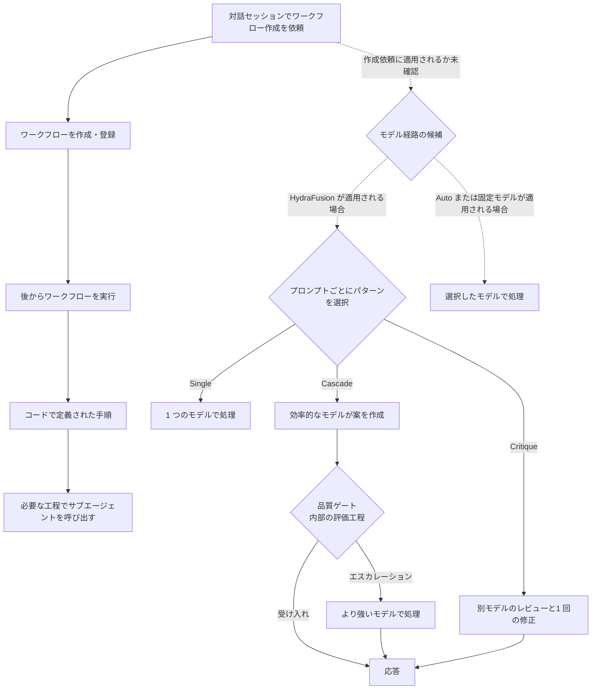

## はじめに

私が気になっているのは、GitHub Copilot で動的ワークフローを作るとき、上位モデルへエスカレーションしたように見えることです。私は、その動きが作成物の品質に影響していると感じています。これは、まず観察から立てた仮説です。

これまで GitHub Copilot を使うときは、Plan（作業計画）を作ってから実行に移すことが多く、Plan の質が実行結果の品質にも表れてきたと感じています。今回は、動的ワークフローが Plan から実行までをコードでつなぎ、Copilot による自動化を一段進めてくれると考えています。

公式ドキュメントには、動的ワークフローの作成だけを特別扱いして、常に上位モデルへ切り替える仕組みは説明されていません。そのため、上位モデルへの切り替えを仕様として断定することはできません。

一方、HydraFusion はタスクに応じて実行パターンを選び、必要ならより強いモデルへ進みます。動的ワークフローの作成も対話セッションへの依頼ですが、その依頼に HydraFusion が適用されるかは別の問いです。この記事では、確認済みの仕様・条件付きの推論・私の観察を分けて考えます🧭

仮に作成時に上位モデルが使われていても、それだけで品質差の原因とは言えません。要件の明確さや偶然の差も考えられます。一方、ワークフローの手順や条件はコードとして保存され、再利用時にも引き継がれます。つまり、Plan に相当する設計の質は再利用され得ますが、作成モデルが品質を上げたという因果関係はまだ仮説です。

サブエージェントとの役割分担は、以前の記事「[Custom Agents と Subagents で始める自律オーケストレーション入門](https://zenn.dev/tomokusaba/articles/8d9f4b3cdd996e)」で整理しました。今回は、モデル選択とワークフローの作成・実行の違いに焦点を当てます。

この記事は 2026 年 10 月 9 日時点の公開情報に基づきます。HydraFusion と動的ワークフローはそれぞれ research preview、public preview で、Copilot SDK の Dynamic Workflows API は experimental です。したがって、ここでの整理は執筆時点のものです。

## まず、三つの仕組みを分ける

HydraFusion、Auto、動的ワークフローは、エージェントの仕事の進め方の異なる部分を制御します。まずは役割を分けて見ることが重要です。

| 仕組み | 主な役割 | ひとことで |
|--------|----------|------------|
| 🧠 HydraFusion | 1 回のプロンプトに対するモデルの実行パターンを選ぶ | どのモデルをどう組み合わせるか |
| 🎛️ Auto | 現時点の公開情報では、リクエストに使うモデルを選ぶ | どのモデルに任せるか |
| 🔁 動的ワークフロー | タスクを進める手順をコードで定義する | どの工程をどんな条件で動かすか |

HydraFusion は、モデルを一つ選ぶだけではなく、実行パターンも選ぶランタイム・オーケストレーターです。[公式ドキュメント](https://docs.github.com/en/early-access/copilot/hydrafusion)によると、プロンプトごとに Single、Cascade、Critique のいずれかと、それを実行するモデルを選びます。つまり、HydraFusion が選ぶのはモデルだけでなく、モデルの使い方です。

Cascade では効率的なモデルが案を作り、品質ゲートが受け入れか上位モデルへのエスカレーションかを判断します。品質ゲートは HydraFusion 内部の評価工程ですが、その受け入れ条件の詳細は公開されていません。Critique では別モデルファミリーの独立した読み取り専用レビューを挟み、最初のモデルが一度修正します（[公式ブログ](https://github.blog/ai-and-ml/github-copilot/project-hydrafusion-frontier-quality-via-multi-model-orchestration/)）。タスクに不要なモデルパスは追加しないため、HydraFusion の要点は必要に応じた複数モデルの利用です。

Auto は各リクエストに使うモデルを選ぶ仕組みです。[現時点の公式ドキュメント](https://docs.github.com/en/copilot/concepts/models/auto-model-selection)では、タスクの複雑さとシステムの健全性・可用性を選択要因として説明しています。つまり、Auto はモデル選択、HydraFusion は実行パターンの選択を主に担います。

動的ワークフローは、タスクの進め方をコードで定義するプログラムです。[概念ドキュメント](https://docs.github.com/en/copilot/concepts/agents/dynamic-workflows)では、決定論的な処理とエージェントの作業を順次・並列に組み合わせられると説明されています。「動的」は手順を毎回モデルがゼロから作る意味ではなく、モデルに任せるのは分析や判断が必要な工程です。

## 作成時と実行時のライフサイクル

動的ワークフローは、対話中に Copilot へ依頼して作成できます。[作成方法のドキュメント](https://docs.github.com/en/copilot/how-tos/use-copilot-agents/use-dynamic-workflows)によると、既定では現在のセッション用の拡張機能に作成され、作成・登録だけでは実行されません。個人用またはリポジトリ用の拡張機能として共有することもできます。**作成・登録と実行は別の段階です。**

動的ワークフローの作成依頼が HydraFusion の経路を通るかは、公開情報から確認できません。以下の図は、その経路が適用された場合を考えるための概念図です。

図の実線は、公開資料で確認できるワークフローの作成・登録と後続実行、HydraFusion の一般的な実行パターンを示します。点線は、作成依頼にどのモデル経路が適用されるか確認できないため、候補として分けています。HydraFusion、Auto、固定モデルのいずれが使われるか、また作成専用のエスカレーション機能があるかは、公開情報から確認できません。

HydraFusion はサブエージェントとは別に動作し、サブエージェントを起動しません（[公式ドキュメント](https://docs.github.com/en/early-access/copilot/hydrafusion)）。したがって、HydraFusion が動的ワークフローのサブエージェントを直接オーケストレーションする、とは言えません。

Copilot SDK の [Dynamic Workflows API](https://github.com/github/copilot-sdk/blob/main/nodejs/docs/workflows.md) では、`ctx.agent` ごとに `model` を指定できます。工程の組み立てと、各サブエージェントのモデル指定は別の設定です。モデルを省略した場合の継承先は、公開ドキュメントから確認できません。

### SDK の公開ソースコードで確認できること

GitHub Copilot SDK の公開ソースでは、`defineWorkflow()` が `run` 関数とメタデータを持つハンドルを定義して返します（[`workflow.ts` の定義処理](https://github.com/github/copilot-sdk/blob/341a526b26ccc170f6a1c6c5651b51f4ba9d3691/nodejs/src/workflow.ts#L545-L569)）。ここで確認できるのは、まずワークフローの定義です。

SDK の例では、そのハンドルを `joinSession({ workflows: [...] })` で登録し、後から `session.workflow.run()` で実行します（[定義と登録](https://github.com/github/copilot-sdk/blob/341a526b26ccc170f6a1c6c5651b51f4ba9d3691/nodejs/docs/workflows.md#L7-L42)、[実行 API](https://github.com/github/copilot-sdk/blob/341a526b26ccc170f6a1c6c5651b51f4ba9d3691/nodejs/docs/workflows.md#L131-L153)）。SDK の API も、登録と実行を分けています。

サブエージェント用の `WorkflowAgentOptions` には `model` と `reasoningEffort` が任意項目として定義され、`ctx.agent()` のオプションは `session.workflow.agent` の RPC に送られます（[`workflow.ts`](https://github.com/github/copilot-sdk/blob/341a526b26ccc170f6a1c6c5651b51f4ba9d3691/nodejs/src/workflow.ts#L154-L176)、[`session.ts`](https://github.com/github/copilot-sdk/blob/341a526b26ccc170f6a1c6c5651b51f4ba9d3691/nodejs/src/session.ts#L1756-L1772)）。つまり、SDK は呼び出しごとのモデル指定を運びます。

ただし、SDK の公開ソースから実際に解決されるモデルや、HydraFusion が作成依頼をどう処理するかは分かりません。SDK は呼び出し側の実装であり、ルーティングや品質ゲートの判断ロジックは示していません。

生成型を挙げるのは、SDK がイベントとして何を表現できるかを示すためです。型には `single` / `cascade` / `critique` のパターン、`judge` / `repair` などのフェーズ、`judgeModel` / `repairModel` などの項目があります（[`session-events.ts` のフェーズ型](https://github.com/github/copilot-sdk/blob/341a526b26ccc170f6a1c6c5651b51f4ba9d3691/nodejs/src/generated/session-events.ts#L774-L803)、[ルーティング結果型](https://github.com/github/copilot-sdk/blob/341a526b26ccc170f6a1c6c5651b51f4ba9d3691/nodejs/src/generated/session-events.ts#L4725-L4818)）。`FusionScores` には `codeGen`、`debugging`、`reasoning`、`toolUse` の項目もあります（[型定義](https://github.com/github/copilot-sdk/blob/341a526b26ccc170f6a1c6c5651b51f4ba9d3691/nodejs/src/generated/session-events.ts#L4877-L4894)）。

これらはイベントの型であり、HydraFusion の実装ではありません。品質ゲートの基準、スコアの計算方法、作成依頼との接続は、この型定義からは分かりません。

SDK の E2E テストでも、`/model/fusion` への応答はテスト用ハンドラーが固定プランで置き換えています（[`hydrafusion_max.e2e.test.ts`](https://github.com/github/copilot-sdk/blob/341a526b26ccc170f6a1c6c5651b51f4ba9d3691/nodejs/test/e2e/hydrafusion_max.e2e.test.ts#L45-L52)）。このテストが示すのは SDK クライアントの動作であり、実際のルーティング判断ではありません。

## 作成段階の上位モデルが品質に作用する可能性

ワークフローの作成では、要求の分割、工程の並列化、結果の受け渡し、失敗時の続行・停止を設計します。つまり、作成時に決めるのは文章だけでなく、実行プロセスの構造です。

作成モデルの推論力が高ければ、工程の依存関係や失敗経路をより適切に設計できる可能性があります。その判断がコードに残れば、ワークフローの再利用時にも引き継がれます。ただし、再利用されるのはプロセス定義であり、実行結果は実行時のモデル・入力・環境にも左右されます。したがって、設計の改善が後続実行に持ち越される可能性はありますが、結果品質の向上までは保証されません。

一方、作成依頼が通常の HydraFusion 経路を通るか、作成専用のエスカレーション機構があるかは、公開情報から確認できません。よって、観察した品質差を HydraFusion や Auto の働きに帰属させることはできません。

作成時のモデル選択は、ワークフロー実行時のモデル選択を決めません。実行時に使うモデルは工程ごとの設定や実行環境に関わり、HydraFusion 自体もサブエージェントを起動しません。つまり、設計時と実行時のモデル経路は分けて考える必要があります。

## 観察したルーティングを確かめる

作成時の品質だけから、使われたモデルや経路は特定できません。公開資料は Auto をモデル選択、HydraFusion を実行パターンとモデルの選択として説明していますが、両者の内部的な関係までは示していません（[HydraFusion](https://docs.github.com/en/early-access/copilot/hydrafusion)、[Auto](https://docs.github.com/en/copilot/concepts/models/auto-model-selection)）。したがって、比較できるのは利用者に見える選択肢の挙動であり、内部のルーティング構造ではありません。

作成依頼の経路を調べるときは、まずセッション設定を記録し、UI やログに実際に表示される情報を確認します。[HydraFusion のドキュメント](https://docs.github.com/en/early-access/copilot/hydrafusion)によると、CLI では実行パターンや各ステップを確認でき、`/collect-debug-logs` で詳細ログを収集できます。Copilot app と Auto では応答に使われたモデルを確認できます。確認できる表示がない場合、設定だけで経路を断定してはいけません。

品質差を調べるには、作成時と実行時を分けて評価します。同じ要件から作成条件を変えて複数のワークフローを作り、モデル名を伏せて設計品質を評価します。その後、同じ入力と実行時モデル設定で動かし、実行品質を比べます。これにより、モデル選択の影響を設計と実行に分けて考えられます。

| 比較 | 固定するもの | 確認するもの |
|------|--------------|--------------|
| 🧩 作成モデルの比較 | 同じ要件、同じ実行モデル、同じ評価項目 | 手順の抜け、依存関係、条件分岐、修正量 |
| ⚙️ 実行モデルの比較 | 同じワークフロー、同じ入力 | 完了率、所要時間、エラー、呼び出し回数 |
| 🧭 利用者に見える選択肢（Auto / HydraFusion / 固定モデル）の比較 | 同じ作業範囲、同じ評価項目 | UI やログで確認できる情報、品質、遅延、AI クレジット |

ルーティング情報が表示されない場合は、「使用モデルは未確認」と記録します。ワークフローの出来栄えだけを、モデル選択の証拠にしないことが大切です。

## おわりに

現時点では、動的ワークフロー作成時の品質差を HydraFusion や Auto のエスカレーションに結び付ける公開証拠はありません。私の観察は仕組みと矛盾しませんが、原因は確認できていません。

一方、コード化された手順や条件はワークフローとともに再利用されます。私の見立てでは、動的ワークフローは「Plan を作ってから実行する」使い方をコード化し、実行までつなぐことで、自動化をさらに進める流れです。作成時のモデル選択と、実行時のモデル選択は分けて評価する必要があります。

重要なのは、**どの判断を設計時に固定し、どの判断を実行時に委ねるか**です。動的ワークフローの価値は、判断を再利用可能なプロセスとして残せることにあります🧭

## 参考

公式ドキュメントと公式ブログは 2026 年 10 月 9 日に確認しました。Copilot SDK のソースコードは、以下のリンクに記載したコミットに固定しています。

- [Using HydraFusion](https://docs.github.com/en/early-access/copilot/hydrafusion)
- [Dynamic workflows](https://docs.github.com/en/copilot/concepts/agents/dynamic-workflows)
- [Using dynamic workflows](https://docs.github.com/en/copilot/how-tos/use-copilot-agents/use-dynamic-workflows)
- [About Copilot auto model selection](https://docs.github.com/en/copilot/concepts/models/auto-model-selection)
- [Project HydraFusion: frontier quality via multi-model orchestration](https://github.blog/ai-and-ml/github-copilot/project-hydrafusion-frontier-quality-via-multi-model-orchestration/)
- [HydraFusion in VS Code and the GitHub Copilot app](https://github.blog/changelog/2026-09-30-hydrafusion-in-vs-code-and-the-github-copilot-app/)
- [Dynamic workflows in Copilot CLI and the Copilot app](https://github.blog/changelog/2026-10-01-dynamic-workflows-in-copilot-cli-and-the-copilot-app/)
- [Dynamic Workflows — GitHub Copilot SDK documentation](https://github.com/github/copilot-sdk/blob/341a526b26ccc170f6a1c6c5651b51f4ba9d3691/nodejs/docs/workflows.md)
- [GitHub Copilot SDK: `workflow.ts`](https://github.com/github/copilot-sdk/blob/341a526b26ccc170f6a1c6c5651b51f4ba9d3691/nodejs/src/workflow.ts)
- [GitHub Copilot SDK: `session.ts`](https://github.com/github/copilot-sdk/blob/341a526b26ccc170f6a1c6c5651b51f4ba9d3691/nodejs/src/session.ts)
- [GitHub Copilot SDK: generated `session-events.ts`](https://github.com/github/copilot-sdk/blob/341a526b26ccc170f6a1c6c5651b51f4ba9d3691/nodejs/src/generated/session-events.ts)
- [GitHub Copilot SDK: `hydrafusion_max.e2e.test.ts`](https://github.com/github/copilot-sdk/blob/341a526b26ccc170f6a1c6c5651b51f4ba9d3691/nodejs/test/e2e/hydrafusion_max.e2e.test.ts)
- [Custom Agents と Subagents で始める自律オーケストレーション入門](https://zenn.dev/tomokusaba/articles/8d9f4b3cdd996e)
