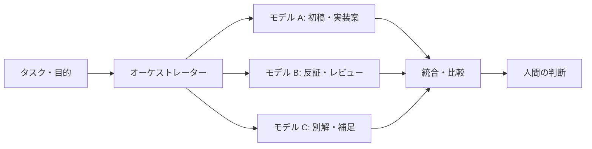

## はじめに

最近、「結局どの LLM が一番いいんですか？」と聞かれることが増えました。

気持ちはとても分かります。OpenAI、Anthropic、Google など、各社から新しいモデルが出るたびに、推論能力やコーディング性能、コンテキスト長、速度、料金体系などが話題になります。純粋な推論能力だけを見れば、その時点で各社が出している最新のフラッグシップモデルを使いたくなるのは自然です🧠

ただ、私の最近の答えは少し違います。

**「どれか一つを選ぶ」のではなく、「全部使う前提で設計する」** ほうが、仕事では現実的なのではないか。少なくとも私は、単一モデル・単一実行の結果をそのまま信じ切るほどには、まだ LLM を信用していません。

この記事は、モデル比較のベンチマーク記事ではありません。業務や個人開発で LLM を使うときに、「どのモデルが最強か」ではなく「どういうモデル編成にすると仕事に合うか」を考えるための idea 記事です🧭

その意味で、私が GitHub Copilot をよいと思う理由の一つも、単一ベンダーの世界観に閉じず、複数社のモデルを選択肢として持てることです。公式ドキュメントでも、GitHub Copilot は OpenAI、Anthropic、Google、Microsoft など複数プロバイダーのモデルをサポートしており、執筆時点では `MAI-Code-1-Flash` も選択可能なモデルとして案内されています。

読み終えると、単一モデルの選定だけでなく、生成・レビュー・反証・統合をどう分けるかという設計観点を持ち帰れるはずです。

まずは、なぜこの問いが難しいのかを整理します。

## 背景：問いの立て方が難しい

「どの LLM が一番いいか」という問いは、短くて便利です。

しかし、実務で考えると、この問いにはいくつもの前提が隠れています。何をさせたいのか。どれくらい速く返してほしいのか。コストはいくらまで許容できるのか。日本語のニュアンスが重要なのか。コードの正確さが重要なのか。社内情報を扱うのか。最終判断を人間がするのか。

同じ「よいモデル」でも、目的が違えば評価は変わります。

| 観点 | ありがちな見方 | 実務で必要な問い |
|------|----------------|------------------|
| 🧠 推論能力 | 一番賢いモデルを選ぶ | この業務の判断に必要な推論か |
| ⚡ 速度 | 速いモデルを選ぶ | 待ち時間が体験や運用に影響するか |
| 💰 コスト | 安いモデルを選ぶ | 失敗時の手戻りも含めて安いか |
| 🗣️ 言語 | 日本語が自然かを見る | 業務用語や文脈まで扱えるか |
| 🔐 データ | API が使えるかを見る | 渡してよい情報か、監査できるか |
| 🧪 評価 | 体感でよさそうだと判断する | 自分たちのタスクで比較できるか |

モデルの能力はもちろん重要です。ただ、モデルだけを見ていると、仕事の目的や制約から離れてしまうことがあります。

特に LLM は、temperature などの生成設定によって、同じ依頼でも実行するたびに答えが揺れることがあります。表現が変わるだけならよいのですが、観点の抜け漏れ、判断の強弱、リスクの見落としまで変わることがあります。私が仕事で使うときに怖いのは、まさにこの揺れです。

だからこそ、単に「一番強いモデル」を探すより、揺れを前提にした使い方を設計したいと考えています。

## 本論：単一モデルではなく、モデル編成を設計する

私の現在の結論は、かなり素朴です。

一つのモデルに決め打ちしない。複数のモデルを並列に使い、競わせ、レビューさせ、最後に統合する。

これは「全部のモデルを常に最大火力で使う」という意味ではありません。重要なのは、モデルを単体の道具として見るのではなく、複数の視点を持つチームのように扱うことです。

たとえば、あるモデルは構成を作るのがうまい。別のモデルは批判的なレビューが鋭い。さらに別のモデルは、文章の自然さや言い換えが得意かもしれません。モデルや設定によって出力の傾向が違うからこそ、コーディングでも、実装案を出すモデルとバグを探すモデルを分けたほうが扱いやすい場面があります。

人間のチームでも、一人の天才だけにすべてを任せるより、設計者、実装者、レビュアー、運用担当がそれぞれの観点を持ったほうが品質は上がります。LLM でも同じように、役割を分けて組み合わせる発想が有効だと感じています🤝

ざっくり図にすると、次のようなイメージです。ここでいうオーケストレーターは、必ずしも専用ツールを指しません。人間が手順として回してもよいですし、スクリプトやワークフロー基盤で自動化してもよいです。

ここでの主役は、特定のモデル名ではなく、タスクをどう分解し、どの観点をどのモデルに担当させ、どのように統合するかというオーケストレーション設計です。

次の章では、実際に使いやすいパターンに落とし込みます。

## 実践パターン：複数モデルをどう使うか

いきなり大げさな基盤を作る必要はありません。

最初は、同じタスクを複数モデルに投げて比較するだけでも、違いを観察しやすくなります。慣れてきたら、生成・レビュー・反証・統合の役割を分けていくと、使い方をかなり整理できます。

### まず試すパターン

| パターン | 使いどころ | ポイント |
|----------|------------|----------|
| 🧭 同一タスク並列 | 方針決め、設計案、文章構成 | 同じ入力を複数モデルに渡し、共通点と差分を見る |
| 🧪 N 回試行 | 回答の揺れが気になる判断 | サンプリング設定によっては、同じモデルを複数回実行し、毎回出る主張だけを重く見る |
| 🔍 生成とレビュー分離 | コード、設計、記事ドラフト | 生成したモデルとは別のモデルに粗探しをさせる |
| ⚖️ 反証役を置く | リスク分析、意思決定 | 「この案が失敗するとしたら、何が起きるか」を別モデルに聞く |
| 🧩 役割別ルーティング | 定型業務、問い合わせ対応 | 要約、分類、回答生成、検証を別々のモデルに担当させる |
| 📝 統合モデルを置く | 複数回答の整理 | 各モデルの主張を比較し、採用・保留・棄却に分ける |

私が特に大事だと思っているのは、一回の回答を完成品として扱わないことです。

LLM の回答は、最初の成果物というより、レビュー前のドラフトに近いものです。よくできていることもありますが、抜けている観点もあります。だから、別モデルに読ませて、矛盾や前提の抜けを指摘させます。

### GitHub Copilot を入口にしやすい理由

複数モデル運用を始めたいとき、最初の障壁は「どうやってモデルを切り替えるか」だったりします。ここで GitHub Copilot のように、同じ作業環境の中でモデルを選びやすい基盤は扱いやすいです。

公式のモデル一覧では、GitHub Copilot は OpenAI、Anthropic、Google、Microsoft など複数プロバイダーのモデルを提供しています。つまり、「まず OpenAI 系で叩き台を作る」「次に Claude 系で批判的レビューをかける」「Gemini 系で別解を見てみる」「軽量な MAI-Code-1-Flash で日常的な軽作業を回す」といった発想を、比較的同じ文脈のまま試しやすいわけです。

もちろん、どのモデルが使えるかはプランや提供状況で変わりますし、組織のポリシーにも左右されます。それでも、複数社のモデルを横断して使える環境は、モデルオーケストレーションを実務に落とし込む入口としてかなり強いと感じています。

### 設計相談での流れ

たとえば、設計相談なら次のように流します。

1. モデル A に設計案を 3 つ出してもらう
2. モデル B に各案の失敗パターンと運用リスクを指摘してもらう
3. モデル C に別の観点から代替案を出してもらう
4. 最後に人間が制約条件に照らして採用案を決める

この流れにすると、最初のモデルが見落とした前提に気づくきっかけになります。もちろん最終的には人間が判断しますが、判断材料の幅は広がります。

文章作成でも同じです。構成案を出すモデル、読者導線をレビューするモデル、表現を整えるモデル、事実確認の観点を出すモデルを分けると、単一モデルで一気に書くよりも扱いやすくなることがあります。

:::message
複数モデルを使う目的は、「多数決で正解を決めること」ではありません。異なる観点を集め、抜け漏れや思い込みを見つけやすくすることです。
:::

### 小さな評価セットを作る

実務に取り入れるなら、最初は小さな評価セットを作るのがおすすめです。

| 用途 | 評価セットの例 | 見たいもの |
|------|----------------|------------|
| 🧱 設計相談 | 過去に迷った設計課題 5 件 | 前提確認、トレードオフ、保守性 |
| 🐞 デバッグ | 実際に起きた障害やエラー 5 件 | 原因候補、再現手順、危険な断定の有無 |
| ✍️ 文章 | 過去の記事・提案書 5 本 | 構成、読みやすさ、主張の一貫性 |
| 🔐 セキュリティ | よくある危険な実装例 5 件 | 見落とし、過剰な安心表現、修正案 |
| 📚 調査 | 一次情報が必要な質問 5 件 | 出典確認、古い情報の扱い、要確認の明示 |

このくらいの小さなセットでも、自分たちのタスクで比較する視点を持ちやすくなります。「有名だから」「ベンチマークが高いから」ではなく、「自分たちの仕事ではどの組み合わせが安定するか」を見られるようになります。

まずのおすすめは、2 モデル比較、相互レビュー、人間判断、判断理由の記録までの最小構成です。明日から小さく始めるなら、次のくらいで十分です。

1. 影響の大きすぎない対象タスクを 1 つ選ぶ
2. 同じ入力を 2 つのモデルに渡して、共通点と差分を記録する
3. 片方の出力を、もう片方のモデルにレビューさせる
4. 採用した判断と、捨てた判断の理由を残す
5. 何度か繰り返して、小さな評価セットにする

ここまで整理すると、かなり便利そうに見えます。ただし、複数モデルを使えばすべて解決するわけではありません。

## 注意点：並列化にもコストと責任がある

同じ入力を複数モデルに送ると API 呼び出し回数が増えるため、通常はコストとレイテンシーも上がります。

すべての依頼を毎回 3 つのモデルに投げる必要はありません。雑な壁打ち、影響の小さい文章の言い換え、個人的なメモであれば、単一モデルで十分なことも多いです。一方で、設計判断、公開文章、顧客への回答、セキュリティに関わる変更などは、複数視点を入れる価値が高いと思っています。

| タスクの性質 | 単一モデルでよい場面 | 複数モデルを検討したい場面 |
|--------------|----------------------|----------------------------|
| 📝 文章 | 個人メモ、軽い言い換え | 公開記事、提案書、重要なメール |
| 💻 コード | 小さな補助、サンプル確認 | 設計変更、認証・課金・権限まわり |
| 🔍 調査 | キーワード探し | 仕様確認、採用判断、顧客説明 |
| 🧠 意思決定 | アイデア出し | 後戻りしづらい技術選定 |

もう一つ大切なのは、**合意しているように見える複数モデルが、同じように間違う可能性がある**ことです。

複数の LLM が同じ答えを出したとしても、それは真実の証明ではありません。回答が一致していても、重要な内容は一次情報で確認する必要があります。そのため、仕様や数値、法務・セキュリティ・医療・契約などに関わる内容は、必ず一次情報に戻るか、専門家に確認する必要があります。

データの扱いにも注意が必要です。複数のベンダーに同じ入力を送るということは、送信先も増えるということです。機密情報、個人情報、契約上の制約があるデータを扱う場合は、モデルの性能以前に確認すべきことがあります。利用するサービスや契約条件ごとに、データの送信可否・保存・学習利用・監査要件を確認しなければなりません🔐

:::message alert
複数モデルによるクロスレビューは、人間の責任を置き換えるものではありません。むしろ、判断材料を増やしたうえで、最後に人間が責任を持つための仕組みです。
:::

私は、LLM を信用していないから使わないのではありません。信用しすぎないために、使い方を設計したいのです。

## おわりに

「どの LLM が一番いいですか？」という問いに、単一の答えを出すのは難しいです。

純粋な推論能力だけを見れば、各社の最新フラッグシップモデルを使うのが分かりやすい選択かもしれません。しかし、仕事で常に最強の単体モデルが必要になるとは限りません。大切なのは、目的・制約・リスク・コスト・責任に合った使い方です。

私の今の答えは、「一つに絞る」ではなく「複数を組み合わせる」です。

同じタスクを複数回実行する。違うモデルに同じ問いを投げる。生成したものを別モデルにレビューさせる。あえて反対意見を出させる。最後に人間が、出てきた主張を比較して根拠を確認し、採用するものを決める。

まずは影響の小さいタスクを 1 つ選び、2 つのモデルで比較するところから始めるだけでも十分です。

LLM の出力は揺れます。だからこそ、その揺れを嫌って一発勝負にするのではなく、揺れを観測し、比較し、統合する設計にしたいです。

これからますますモデルは増え、性能も変わっていくはずです。そのたびに「どのモデルが最強か」だけを追いかけると疲れてしまいます。

それよりも、自分たちの仕事に合うモデルオーケストレーション戦略を持つこと。私はそこに、これからの LLM 活用の現実的な強さがあると思っています🧭

## 参考

各モデルの仕様、提供状況、価格、制約は変わります。実際に選定するときは、最新の公式情報を確認してください。

- [Supported AI models in GitHub Copilot](https://docs.github.com/en/copilot/reference/ai-models/supported-models)
- [MAI-Code-1-Flash is now available for GitHub Copilot](https://github.blog/changelog/2026-06-02-mai-code-1-flash-is-now-available-for-github-copilot/)
- [OpenAI Models](https://developers.openai.com/api/docs/models)
- [Anthropic Claude models overview](https://platform.claude.com/docs/en/about-claude/models/overview)
- [Google Gemini models](https://ai.google.dev/gemini-api/docs/models)
