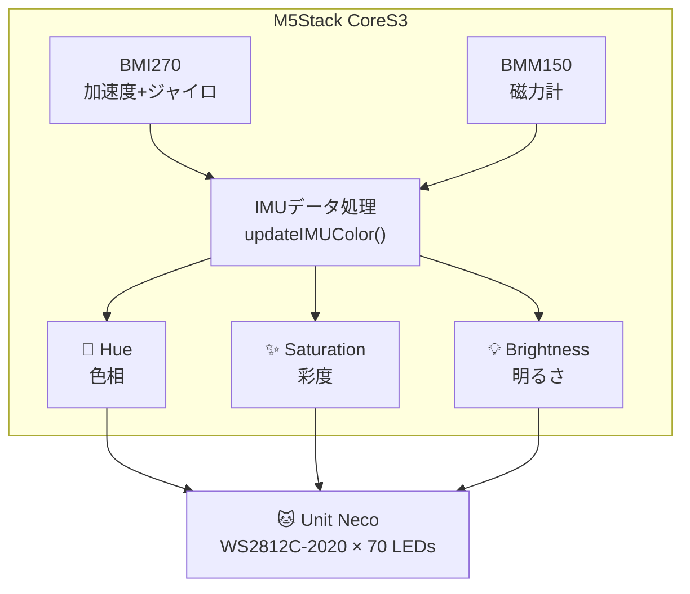
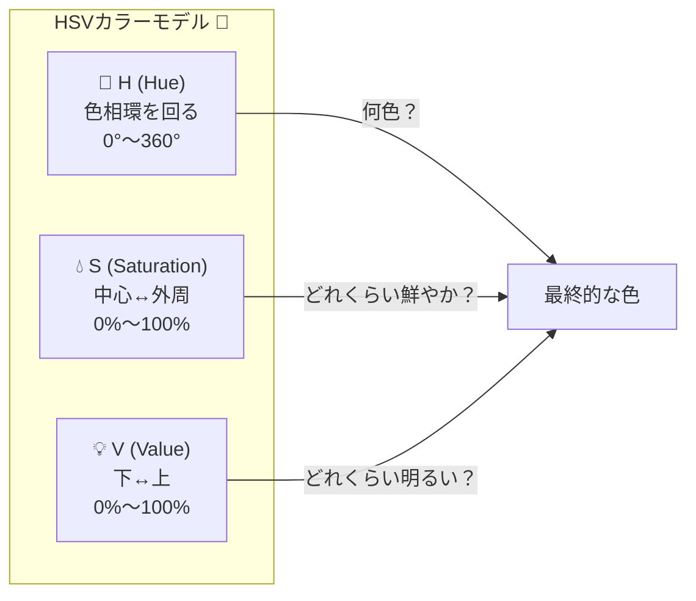

## はじめに 👋

この記事は、以下の記事の続編です：

- 📕 [M5Stack Unit Heartを使おう](https://zenn.dev/tomokusaba/articles/7c15f30e0f0318)
- 📗 [M5Stack Unit Necoを使おう](https://qiita.com/tomokusaba/items/a90d4273f8e8d74781d0)

今回は、**M5Stack CoreS3に内蔵されているIMUセンサー（慣性計測ユニット）** を活用して、**Unit NecoのLEDの色をリアルタイムに変化させる** 実験を行いました！🌈🐱

デバイスを傾けたり、回転させたりするだけで、猫耳LEDの色がダイナミックに変化する...そんな楽しいインタラクションを実現しています。


## 今回のゴール 🎯

**M5Stack CoreS3のIMUデータを使って：**

- 🧭 **磁力計（コンパス）の向き** → LEDの**基本色相（Hue）**を決定
- 📐 **加速度センサー（傾き）** → LEDの**彩度（Saturation）**を調整
- 🔄 **ジャイロセンサー（回転速度）** → LEDの**明るさ（Brightness）**を制御

HSVカラーモデルを使って、物理的な動きを視覚的なフィードバックに変換します！✨

## 使用機材 🛠️

| 機材 | 説明 |
|------|------|
| 🖥️ M5Stack CoreS3 | BMI270（加速度・ジャイロ）+ BMM150（磁力計）内蔵 |
| 🐱 Unit Neco | WS2812C-2020 RGB LED搭載の猫耳型ユニット（1枚あたり35個、2枚セットで70個） |
| ❤️ Unit Heart（オプション） | 心拍センサー（前回記事参照） |
| 🔌 Grove ケーブル | 接続用 |

## アーキテクチャ図 📊



## Unit Necoの接続 🔌

Unit NecoをCoreS3に接続する際のポート設定について説明します。

### Unit Necoのピンマップ

| ピン | 機能 |
|------|------|
| GND | グランド |
| 5V | 電源 |
| DATA | LEDデータ信号 |
| BTN | タクトスイッチ |

### CoreS3のポートとピン対応

Unit NecoのDATAピンは、接続するポートによって異なるGPIOに対応します：

| 接続ポート | DATAピン | コードでの設定 |
|-----------|----------|----------------|
| PORT.A | G2 | `#define PIN 2` |
| PORT.B | G9 | `#define PIN 9` |
| PORT.C | G17 | `#define PIN 17` |

:::message
今回のサンプルコードでは**PORT.C（G17）**に接続しています。他のポートを使う場合は必ず`PIN`の値を変更してください！
:::

:::message alert
**LEDの焼損に注意！**
全点灯状態を長時間続けるとLEDが焼損する恐れがあります。輝度は**20前後**に設定することを強く推奨します。
```cpp
pixels.setBrightness(20);  // 推奨値
```
:::

## ステップ 1: IMUセンサーの理解 🎓

### M5Stack CoreS3 の IMU について

CoreS3には、2つのセンサーからなるIMU（Inertial Measurement Unit）が搭載されています：

| センサー | チップ | 機能 | I2Cアドレス |
|---------|--------|------|-------------|
| 🔄 6軸IMU | BMI270 | 加速度 + ジャイロスコープ | 0x69 |
| 🧭 3軸磁力計 | BMM150 | 磁場検出（コンパス） | 0x10 |

これらは**内部I2C（SDA=G12, SCL=G11）** で接続されているため、外部ポート（PORT.A/B/C）とは独立しています。

### 各センサーのデータ 📊

```cpp
// 🎮 IMUデータ（グローバル）
float imuAccelX = 0, imuAccelY = 0, imuAccelZ = 0;      // 加速度 📐
float imuGyroX = 0, imuGyroY = 0, imuGyroZ = 0;         // ジャイロ 🔄
float imuMagX = 0, imuMagY = 0, imuMagZ = 0;            // 磁力計 🧭
```

| データ | 説明 | 用途 |
|--------|------|------|
| **accel** | 加速度（3軸）、単位: G | 傾き検出、衝撃検知 |
| **gyro** | 角速度（3軸）、単位: °/s | 回転速度検出 |
| **mag** | 磁場強度（3軸）、単位: µT | コンパス（方位） |

## ステップ 2: HSVカラーモデルの採用 🌈

### なぜRGBではなくHSVを使うのか？

RGB（赤・緑・青）よりも**HSV（色相・彩度・明度）** の方が、直感的に色を操作できます。

**RGBの課題 ❌**
```cpp
// RGBで「少し暗い青」を作りたい場合
pixels.Color(0, 0, 200);  // これで合ってる？🤔

// RGBで「青から緑にグラデーション」を作りたい場合
// R, G, B それぞれどう変化させればいい...？😵
```

**HSVの利点 ✅**
```cpp
// HSVで「少し暗い青」を作りたい場合
hue = 0.66;        // 青（色相環の2/3の位置）
saturation = 1.0;  // 鮮やか
brightness = 0.8;  // 少し暗く ← これだけ変えればOK！

// HSVで「青から緑にグラデーション」を作りたい場合
// hue を 0.66 → 0.33 に変化させるだけ！🎉
```

### HSVカラーモデルの仕組み

HSVは「円柱」または「円錐」で表現されるカラーモデルです：



### 🎨 Hue（色相）: 色の種類

色相は**色相環（カラーホイール）**上の角度で表されます：

| 角度 | 色 | 正規化値 (0〜1) | 用途例 |
|------|-----|----------------|--------|
| 🔴 0° | 赤 | 0.00 | 警告、心拍 |
| 🟠 30° | オレンジ | 0.08 | 暖かみ |
| 🟡 60° | 黄 | 0.17 | 注意、活気 |
| 🟢 120° | 緑 | 0.33 | 安全、自然 |
| 🔵 180° | シアン | 0.50 | 涼しげ |
| 🔷 240° | 青 | 0.67 | 落ち着き |
| 🟣 270° | 紫 | 0.75 | 神秘的 |
| 💗 300° | マゼンタ | 0.83 | 華やか |
| 🔴 360° | 赤（一周） | 1.00 | （0°と同じ） |

:::message
**ポイント**: Hue は**循環**するので、359° の次は 0° に戻ります。これにより、無限にループする虹色グラデーションが簡単に作れます！🌈
:::

### ✨ Saturation（彩度）: 鮮やかさ

彩度は色の「鮮やかさ」を表します：

| 値 | 見た目 | 説明 |
|----|--------|------|
| 0% | ⬜ 灰色 | 完全に色がない（モノクロ） |
| 25% | 🩶 くすんだ色 | パステル調、落ち着いた印象 |
| 50% | 中間 | ややくすんだ色 |
| 75% | 鮮やかめ | 目を引く色 |
| 100% | 🔴 純色 | 最も鮮やかな色 |

### 💡 Value/Brightness（明度）: 明るさ

明度は色の「明るさ」を表します：

| 値 | 見た目 | 説明 |
|----|--------|------|
| 0% | ⬛ 黒 | 完全に暗い（色が見えない） |
| 25% | 暗い色 | 深みのある色 |
| 50% | 中間 | 標準的な明るさ |
| 75% | 明るめ | 活気のある色 |
| 100% | 🔴 最大輝度 | 最も明るい色 |

### RGB vs HSV の比較

| 操作 | RGB | HSV |
|------|-----|-----|
| 🌈 色を変える | R,G,B 全部調整が必要 | **H だけ**変える |
| 💧 彩度を変える | 複雑な計算が必要 | **S だけ**変える |
| 💡 明るさを変える | R,G,B 全部に係数をかける | **V だけ**変える |
| 🎨 グラデーション | 非直感的（色が濁りやすい） | H を線形に変化させるだけ |

**今回のプロジェクトでの活用:**
- **コンパスの向き** → H（色相）に直接マッピング 🧭
- **傾き具合** → S（彩度）に直接マッピング 📐  
- **回転速度** → V（明度）に直接マッピング 🔄

センサー値を「色のどの要素に影響させるか」を直感的に決められるのがHSVの強みです！

### HSVカラーモデル

| パラメータ | 説明 | 範囲 | 備考 |
|-----------|------|------|------|
| 🎨 **H** (Hue) | 色相 | 0°〜360° | 赤→黄→緑→青→紫→赤 と変化 |
| ✨ **S** (Saturation) | 彩度 | 0〜100% | 0%=灰色、100%=鮮やか |
| 💡 **V** (Value/Brightness) | 明度 | 0〜100% | 0%=黒、100%=明るい |

### HSV→RGB変換関数 🔧

```cpp
// 🌟 HSVからRGBに変換（IMUカラー用）
void hsvToRgb(float h, float s, float v, uint8_t* r, uint8_t* g, uint8_t* b) {
    int i = (int)(h * 6);
    float f = h * 6 - i;
    float p = v * (1 - s);
    float q = v * (1 - f * s);
    float t = v * (1 - (1 - f) * s);
    
    float rf, gf, bf;
    switch (i % 6) {
        case 0: rf = v; gf = t; bf = p; break;
        case 1: rf = q; gf = v; bf = p; break;
        case 2: rf = p; gf = v; bf = t; break;
        case 3: rf = p; gf = q; bf = v; break;
        case 4: rf = t; gf = p; bf = v; break;
        case 5: rf = v; gf = p; bf = q; break;
        default: rf = v; gf = t; bf = p; break;
    }
    *r = (uint8_t)(rf * 255);
    *g = (uint8_t)(gf * 255);
    *b = (uint8_t)(bf * 255);
}
```

## ステップ 3: IMUデータからカラーパラメータを計算 🎮

ここが今回のキモです！IMUのセンサー値を、HSVの各パラメータにマッピングします。

### IMUカラー計算のアルゴリズム

```cpp
// 🎮 IMUデータを更新してカラー計算
void updateIMUColor() {
    if (!imuReady) return;
    
    auto imu_update = CoreS3.Imu.update();
    if (imu_update) {
        auto data = CoreS3.Imu.getImuData();
        
        // 加速度データ取得 📐
        imuAccelX = data.accel.x;
        imuAccelY = data.accel.y;
        imuAccelZ = data.accel.z;
        
        // ジャイロデータ取得 🔄
        imuGyroX = data.gyro.x;
        imuGyroY = data.gyro.y;
        imuGyroZ = data.gyro.z;
        
        // 磁力計データ取得 🧭
        imuMagX = data.mag.x;
        imuMagY = data.mag.y;
        imuMagZ = data.mag.z;
```

### 🎨 色相（Hue）: 磁力計から方位を計算

磁力計のXY成分から、コンパスのように方位角を計算します。北を向くと赤、東で黄、南で緑...というように、方角に応じて色が変わります！

```cpp
        // 🌈 色相をIMUデータから計算
        // 磁力計の向き（コンパス）で基本色相を決定
        float heading = atan2(imuMagY, imuMagX);  // -π ~ π
        imuBaseHue = (heading + PI) / (2 * PI);   // 0 ~ 1 に正規化
        
        // 加速度から傾きを計算して色相をオフセット
        float tiltX = atan2(imuAccelX, imuAccelZ);
        float tiltY = atan2(imuAccelY, imuAccelZ);
        float tiltOffset = (tiltX + tiltY) / (4 * PI);  // 小さめのオフセット
        
        imuBaseHue = fmod(imuBaseHue + tiltOffset + 1.0f, 1.0f);
```

:::message
**なぜ `atan2` を使うの？** 🤔

`atan2(y, x)` は、2つの値から角度を計算する関数です。通常の `atan(y/x)` との違いを見てみましょう：

**`atan(y/x)` の問題点 ❌**
- 戻り値の範囲が **-π/2 〜 π/2**（-90° 〜 90°）しかない
- `x` が 0 のとき**ゼロ除算**でエラー
- 第2象限と第3象限を区別できない（符号が消える）

```cpp
// 例: 同じ結果になってしまう！
atan(1.0 / 1.0)   // → 0.785 (45°)  第1象限 ✓
atan(-1.0 / -1.0) // → 0.785 (45°)  第3象限なのに同じ値！ ✗
```

**`atan2(y, x)` の利点 ✅**
- 戻り値の範囲が **-π 〜 π**（-180° 〜 180°）で全方位カバー
- `x` と `y` を別々に渡すのでゼロ除算の心配なし
- **4象限すべてで正しい角度**を返す

```cpp
// 例: 正しく区別できる！
atan2(1.0, 1.0)   // →  0.785 (45°)   第1象限 ✓
atan2(1.0, -1.0)  // →  2.356 (135°)  第2象限 ✓
atan2(-1.0, -1.0) // → -2.356 (-135°) 第3象限 ✓
atan2(-1.0, 1.0)  // → -0.785 (-45°)  第4象限 ✓
```

**コンパスでの使用例 🧭**
```cpp
// 磁力計の X, Y 成分から方位角を計算
float heading = atan2(magY, magX);  // -π 〜 π の範囲

// 0 〜 2π（0° 〜 360°）に変換
if (heading < 0) heading += 2 * PI;

// 0 〜 1 に正規化（HSVのHue用）
float hue = heading / (2 * PI);
```

コンパスや傾き計算には**360°全方位**を扱う必要があるため、`atan2` は必須の関数です！
:::

### ✨ 明るさ（Brightness）: ジャイロから回転速度を計算

デバイスを素早く回転させると明るく、静止していると暗くなります。

```cpp
        // ✨ 明るさをジャイロの回転速度から計算
        float gyroMagnitude = sqrt(imuGyroX * imuGyroX + 
                                   imuGyroY * imuGyroY + 
                                   imuGyroZ * imuGyroZ);
        imuBrightness = constrain(0.3f + gyroMagnitude / 500.0f, 0.3f, 1.0f);
```

**計算の意図：**
- 3軸の回転速度のベクトル長（magnitude）を計算
- 静止時（gyro ≈ 0）でも最低 30% の明るさを確保
- 最大 100% にクランプ

### 🎨 彩度（Saturation）: 加速度から傾き度合いを計算

重力加速度は通常1G（≒9.8m/s²）ですが、傾けるとXY軸にも分散します。この「1Gからの偏差」を彩度に反映させます。

```cpp
        // 🎨 彩度を加速度の大きさから計算
        float accelMagnitude = sqrt(imuAccelX * imuAccelX + 
                                    imuAccelY * imuAccelY + 
                                    imuAccelZ * imuAccelZ);
        float accelDeviation = abs(accelMagnitude - 1.0f);  // 1Gからの偏差
        imuSaturation = constrain(0.6f + accelDeviation * 0.4f, 0.6f, 1.0f);
    }
}
```

## ステップ 4: LEDに色を適用する 🐱

計算したHSV値を、70個のNeoPixel LEDに適用します。

### ピクセルごとの色取得関数

```cpp
// 🎨 IMUベースの色を取得（位置オフセット付き）
void getIMUColor(int pixelIndex, float brightnessMod, uint8_t* r, uint8_t* g, uint8_t* b) {
    // 位置に応じた色相オフセット（グラデーション効果）
    float posOffset = (float)pixelIndex / NUMPIXELS * 0.3f;
    float hue = fmod(imuBaseHue + posOffset, 1.0f);
    
    float brightness = imuBrightness * brightnessMod;
    brightness = constrain(brightness, 0.0f, 1.0f);
    
    hsvToRgb(hue, imuSaturation, brightness, r, g, b);
}
```

**ポイント 💡:**
- `pixelIndex` に応じて色相をずらすことで、自然なグラデーションを実現
- `brightnessMod` でエフェクトごとの明るさ調整が可能

## ステップ 5: エフェクトの実装 🎭

IMUカラーをベースに、複数のエフェクトを実装しました！

### エフェクト一覧

```cpp
// 🎭 エフェクトモード管理
enum NekoEffect {
    EFFECT_HEARTBEAT,      // 💓 ハートビート
    EFFECT_RAINBOW_WAVE,   // 🌈 虹の波
    EFFECT_SHOOTING_STAR,  // 🌠 流れ星
    EFFECT_BREATHING,      // 😺 呼吸するような明滅
    EFFECT_SPARKLE_RAIN,   // ✨ キラキラの雨
    EFFECT_AURORA,         // 🌌 オーロラ
    EFFECT_NYAN_CAT,       // 🐱 にゃんキャット風
    EFFECT_COUNT
};
```

### 💓 ハートビートエフェクト

心拍検出と連動して脈打つように光ります。IMUで色が変化！

```cpp
// 💓 ハートビートエフェクト（IMUで色が変わる！）
static int pulseWave = 0;
void effectHeartbeat(bool isBeat) {
    int center = NUMPIXELS / 2;
    
    if (isBeat) {
        pulseWave = 0;  // ビート時に波をリセット
    } else {
        pulseWave = min(pulseWave + 5, NUMPIXELS / 2);  // 波が広がる
    }
    
    float baseBrightness = isBeat ? 1.0f : 0.4f;
    
    for (int i = 0; i < NUMPIXELS; i++) {
        int distFromCenter = abs(i - center);
        float intensity = 1.0f - ((float)distFromCenter / (NUMPIXELS / 2));
        intensity = max(0.15f, intensity);
        
        bool isOnWave = (abs(distFromCenter - pulseWave) < 5);
        
        uint8_t r, g, b;
        if (isOnWave && !isBeat) {
            float waveFade = 1.0f - (float)abs(distFromCenter - pulseWave) / 5.0f;
            getIMUColor(i, waveFade * 1.2f, &r, &g, &b);
        } else {
            getIMUColor(i, intensity * baseBrightness, &r, &g, &b);
        }
        pixels.setPixelColor(i, pixels.Color(r, g, b));
    }
    
    // ✨ 耳先端は特別に明るく
    uint8_t tr, tg, tb;
    getIMUColor(0, isBeat ? 1.0f : 0.5f, &tr, &tg, &tb);
    pixels.setPixelColor(0, pixels.Color(tr, tg, tb));
    pixels.setPixelColor(NUMPIXELS - 1, pixels.Color(tr, tg, tb));
}
```

### 🌠 流れ星エフェクト

ジャイロの回転速度で流れ星のスピードが変化します！

```cpp
// 🌠 流れ星エフェクト（IMUで色＆速度変化）
static int starSpeed = 2;
static int numStars = 2;
void effectShootingStar(bool isBeat) {
    // ジャイロ回転で速度変化
    float gyroSpeed = sqrt(imuGyroX * imuGyroX + imuGyroY * imuGyroY) / 100.0f;
    
    if (isBeat) {
        starSpeed = 8;
        numStars = 5;
    } else {
        starSpeed = max(2, (int)(2 + gyroSpeed));
        numStars = max(2, numStars - 1);
    }
    
    // 背景（薄くIMUカラーで塗る）
    for (int i = 0; i < NUMPIXELS; i++) {
        uint8_t r, g, b;
        getIMUColor(i, 0.1f, &r, &g, &b);
        pixels.setPixelColor(i, pixels.Color(r, g, b));
    }
    
    // 流れ星を描画
    for (int star = 0; star < numStars; star++) {
        int starPos = (shootingStarPos + star * (NUMPIXELS / numStars)) % NUMPIXELS;
        
        // 星の先頭は白く輝く
        pixels.setPixelColor(starPos, pixels.Color(255, 255, 255));
        
        // 尾を描画（IMUカラーでグラデーション）
        int tailLen = isBeat ? 12 : 8;
        for (int t = 1; t < tailLen; t++) {
            int tailPos = (starPos - t + NUMPIXELS) % NUMPIXELS;
            float fade = 1.0f - ((float)t / tailLen);
            fade = fade * fade;  // 二次関数で自然なフェード
            
            uint8_t r, g, b;
            getIMUColor(tailPos, fade, &r, &g, &b);
            pixels.setPixelColor(tailPos, pixels.Color(r, g, b));
        }
    }
    
    shootingStarPos = (shootingStarPos + starSpeed) % NUMPIXELS;
}
```

### 🌌 オーロラエフェクト

ゆらゆらと揺れる神秘的なオーロラをIMUカラーで表現！

```cpp
// 🌌 オーロラエフェクト（IMU + オーロラ）
static float auroraSpeed = 0.08f;
static float auroraBright = 0.4f;
void effectAurora(bool isBeat) {
    if (isBeat) {
        auroraSpeed = 0.25f;
        auroraBright = 0.9f;
    } else {
        auroraSpeed = max(0.08f, auroraSpeed - 0.02f);
        auroraBright = max(0.4f, auroraBright - 0.06f);
    }
    
    auroraOffset += auroraSpeed;
    
    for (int i = 0; i < NUMPIXELS; i++) {
        float wave1 = sin(auroraOffset + (float)i * 0.15f) * 0.5f + 0.5f;
        float wave2 = sin(auroraOffset * 0.7f + (float)i * 0.1f) * 0.5f + 0.5f;
        
        float brightness = (wave1 + wave2) * 0.5f * auroraBright * imuBrightness;
        
        uint8_t r, g, b;
        getIMUColor(i, brightness, &r, &g, &b);
        
        // オーロラっぽい緑を少し追加 🌌
        g = min(255, (int)(g + wave2 * 50 * auroraBright));
        
        pixels.setPixelColor(i, pixels.Color(r, g, b));
    }
}
```

## ステップ 6: IMUの初期化とメインループ 🔧

### setup() でのIMU初期化

```cpp
void setup() {
    CoreS3.begin();
    Serial.begin(115200);
    
    // 🎮 IMU初期化 (BMI270 + BMM150) - 内部I2C (SDA=G12, SCL=G11)
    Serial.println("🎮 Initializing IMU (BMI270+BMM150)...");
    Serial.println("   Internal I2C: SDA=G12, SCL=G11");
    
    // CoreS3.Imu または M5.Imu を使用
    if (CoreS3.Imu.begin()) {
        imuReady = true;
        Serial.println("✅ IMU ready! (BMI270 @ 0x69)");
    } else {
        imuReady = false;
        Serial.println("⚠️ IMU init failed");
    }
    
    // 猫耳LED 🐱
    Serial.println("🐱 NECO Unit...");
    pixels.setBrightness(20);  // LED焼損防止のため20前後を推奨
    pixels.begin();
    pixels.clear();
    pixels.show();
    Serial.println("✅ NECO OK");
    
    // ... 他の初期化 ...
}
```

:::message alert
**注意**: Unit NecoはPORT.C（G17）に接続しています。他のポートを使う場合は `#define PIN` の値を変更してください！
:::

### loop() でのIMU更新

```cpp
void loop() {
    // pox.update() - 心拍センサー更新（使用する場合）
    pox.update();
    
    // ... センサーチェックなど ...
    
    // レポート表示（1秒ごと）
    if (millis() - tsLastReport > REPORTING_PERIOD_MS) {
        // 画面にIMU情報を表示
        M5.Lcd.fillRect(0, 200, 320, 40, BLACK);
        
        // エフェクト名
        const char* effectNames[] = {"HEART", "RAINBOW", "STAR", 
                                     "BREATH", "SPARKLE", "AURORA", "NYAN"};
        M5.Lcd.setCursor(0, 200);
        M5.Lcd.print("Effect:");
        M5.Lcd.print(effectNames[currentEffect]);
        
        // IMUカラー情報（Hue/Sat/Bright）
        M5.Lcd.setCursor(100, 200);
        M5.Lcd.print("H:");
        M5.Lcd.print((int)(imuBaseHue * 360));
        M5.Lcd.print(" S:");
        M5.Lcd.print((int)(imuSaturation * 100));
        M5.Lcd.print(" B:");
        M5.Lcd.print((int)(imuBrightness * 100));
        
        // ジャイロ値
        M5.Lcd.setCursor(0, 210);
        M5.Lcd.print("Gyro X:");
        M5.Lcd.print((int)imuGyroX);
        M5.Lcd.print(" Y:");
        M5.Lcd.print((int)imuGyroY);
        
        // 加速度値
        M5.Lcd.setCursor(0, 220);
        M5.Lcd.print("Accel X:");
        M5.Lcd.print(imuAccelX, 1);
        M5.Lcd.print(" Y:");
        M5.Lcd.print(imuAccelY, 1);
        
        tsLastReport = millis();
    }
    
    // 🎮 IMUを常時更新（リアルタイム反映）
    updateIMUColor();
}
```

## 完成したコード 📝

完全なソースコードはGitHubで公開しています：

🔗 **[tomokusaba/m5stack - M5StackS3/IMU/sample.ino](https://github.com/tomokusaba/m5stack/blob/main/M5StackS3/IMU/sample.ino)**

### コードの構成

```
sample.ino (約900行)
├── 📦 インクルード & 定義
│   ├── M5CoreS3.h, Adafruit_NeoPixel.h など
│   └── PIN, NUMPIXELS, サンプリング設定
├── 🎮 IMUグローバル変数
│   ├── imuAccelX/Y/Z, imuGyroX/Y/Z, imuMagX/Y/Z
│   └── imuBaseHue, imuBrightness, imuSaturation
├── 🌟 ヘルパー関数
│   ├── hsvToRgb() - HSV→RGB変換
│   ├── easeInOutSine() - イージング
│   ├── updateIMUColor() - IMUからカラー計算
│   └── getIMUColor() - ピクセル別カラー取得
├── 🎭 エフェクト関数群
│   ├── effectHeartbeat()
│   ├── effectRainbowWave()
│   ├── effectShootingStar()
│   ├── effectBreathing()
│   ├── effectSparkleRain()
│   ├── effectAurora()
│   └── effectNyanCat()
├── 💓 コールバック & センサー管理
│   ├── onBeatDetected()
│   ├── isSensorAlive()
│   └── reinitSensor()
└── 🔧 setup() & loop()
```

## 動作結果 🎬

### IMUによる色変化の様子

| 動作 | LEDの変化 |
|------|----------|
| 🧭 デバイスを回転（水平面で） | 色相が360°変化（赤→黄→緑→青→紫→赤） |
| 📐 デバイスを傾ける | 彩度が変化（水平で低彩度、傾けると高彩度） |
| 🔄 デバイスを素早く振る | 明るさが上昇（静止で暗め、動くと明るく） |

### エフェクト自動切り替え

心拍センサーと組み合わせると、**10ビートごとにエフェクトが自動で切り替わります**！

```cpp
void onBeatDetected() {
    beatCount++;
    
    // 🎭 10ビートごとにエフェクト変更！
    if (beatCount % 10 == 0) {
        currentEffect = (currentEffect + 1) % EFFECT_COUNT;
        Serial.print("🎭 Effect changed to: ");
        Serial.println(currentEffect);
    }
    
    // IMUカラーを更新 🎮
    updateIMUColor();
    
    // エフェクト実行
    // ...
}
```

## ハマりポイント & 解決策 🔍

### 1. Unit NecoとUnit Heartの同時使用 🐱❤️

**疑問**: IMU、Unit Neco、Unit Heartを同時に使いたいけど、ポートが足りる？

**解決策**: CoreS3では問題なく同時使用できます！

| デバイス | 使用可能ポート | 通信方式 | 備考 |
|---------|---------------|---------|------|
| 🎮 IMU (BMI270/BMM150) | 内部I2C (G12/G11) | I2C | 外部ポート不要 |
| 🐱 Unit Neco | PORT.A / B / C | GPIO (NeoPixel) | DATAピンを指定 |
| ❤️ Unit Heart | PORT.A / B / C | I2C | Wire初期化でピン指定 |

**Unit Necoの接続例：**
```cpp
// 接続ポートに応じてPINを変更
#define PIN 2   // PORT.A の場合
// #define PIN 9   // PORT.B の場合
// #define PIN 17  // PORT.C の場合

Adafruit_NeoPixel pixels(NUMPIXELS, PIN, NEO_GRB + NEO_KHZ800);
```

**Unit Heartの接続例：**
```cpp
// PORT.A（デフォルト）の場合
Wire.begin();  // SDA=G2, SCL=G1

// PORT.B の場合
Wire.begin(9, 8);  // SDA=G9, SCL=G8

// PORT.C の場合
Wire.begin(17, 18);  // SDA=G17, SCL=G18
```

:::message
**同時使用のコツ**: Unit Neco（GPIO）とUnit Heart（I2C）は通信方式が異なるため、**同じポートには接続できません**。例えば：
- Unit Neco → PORT.C (G17)
- Unit Heart → PORT.A (G2/G1)

のように**別々のポートに接続**してください！✅
:::

:::message
**ポイント**: CoreS3の内部I2C（IMU用）と外部ポート（Unit Heart用）は**別のバス**なので競合しません！👋
:::

### 2. センサー更新の頻度問題

**問題**: `pox.update()` を頻繁に呼ばないと心拍検出の精度が落ちるが、IMU更新も必要。

**解決策**: メインループでは `pox.update()` を優先し、コールバック内で重い処理をしない：

```cpp
void loop() {
    pox.update();  // これを最優先！
    
    // ビート検出後の描画はフラグで管理
    if (requestFaceRedraw) {
        requestFaceRedraw = false;
        drawFace(lastHeartRate, beatflg);
    }
    
    // IMUは常時更新OK
    updateIMUColor();
}
```

### 3. 磁力計のキャリブレーション

**問題**: 磁力計（コンパス）の値がずれている、または特定の方向に偏る。

**解決策**: 実際の使用環境でデバイスを8の字に動かしてキャリブレーションするか、オフセット値を調整：

```cpp
// キャリブレーション値を追加する場合
imuMagX = data.mag.x - offsetX;
imuMagY = data.mag.y - offsetY;
```

## 今後の発展 🚀

このプロジェクトはさらに発展させることができます！

- 📱 **BLE連携**: スマホから色やエフェクトを変更
- 🎵 **音楽連動**: マイクでビートを検出してLEDを同期
- 🌐 **クラウド連携**: Azure IoT Hubでデータを可視化
- 🎮 **ゲーム化**: IMUでインタラクティブなゲームを実装

## まとめ 🎉

今回は、M5Stack CoreS3のIMUセンサーを使って、Unit NecoのLEDを動的に制御する方法を解説しました。

### 学んだこと 📚

- ✅ **IMUセンサー**（加速度・ジャイロ・磁力計）の使い方
- ✅ **HSVカラーモデル** を使った直感的な色制御
- ✅ センサーデータ → 視覚フィードバックへの**マッピング手法**
- ✅ 複数センサーの**並列制御**のコツ

### キーポイント 🔑

| IMUデータ | → | HSVパラメータ |
|-----------|---|---------------|
| 🧭 磁力計 (heading) | → | 🎨 色相 (Hue) |
| 🔄 ジャイロ (回転速度) | → | ✨ 明度 (Brightness) |
| 📐 加速度 (傾き) | → | 💎 彩度 (Saturation) |

ぜひ皆さんも、IMUとLEDを組み合わせた**インタラクティブなプロジェクト**に挑戦してみてください！🐱🌈

## 関連リソース 📚

- 🔗 [M5Stack CoreS3 公式ドキュメント](https://docs.m5stack.com/ja/core/CoreS3)
- 🔗 [Unit Neco 公式ドキュメント](https://docs.m5stack.com/ja/unit/Neco%20Unit)
- 🔗 [Unit Heart 公式ドキュメント](https://docs.m5stack.com/en/unit/heart)
- 🔗 [BMI270 データシート](https://m5stack.oss-cn-shenzhen.aliyuncs.com/resource/docs/datasheet/core/K128%20CoreS3/BMI270.PDF)
- 🔗 [BMM150 データシート](https://m5stack.oss-cn-shenzhen.aliyuncs.com/resource/docs/datasheet/core/K128%20CoreS3/BMM150.PDF)
- 🔗 [Adafruit NeoPixel ライブラリ](https://github.com/adafruit/Adafruit_NeoPixel)
- 🔗 [今回のサンプルコード (GitHub)](https://github.com/tomokusaba/m5stack/blob/main/M5StackS3/IMU/sample.ino)


