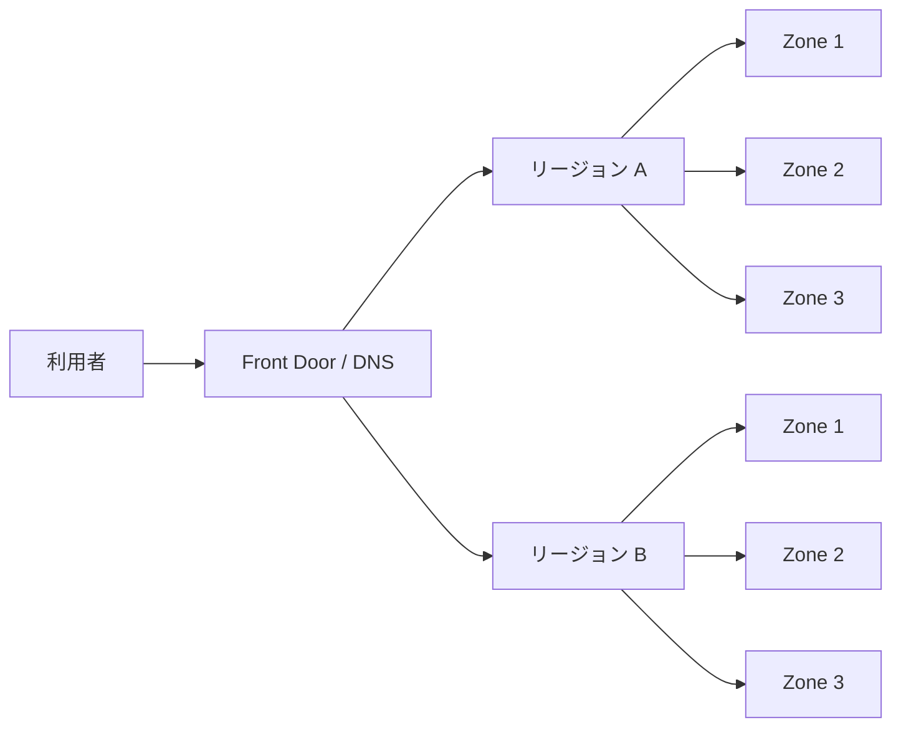
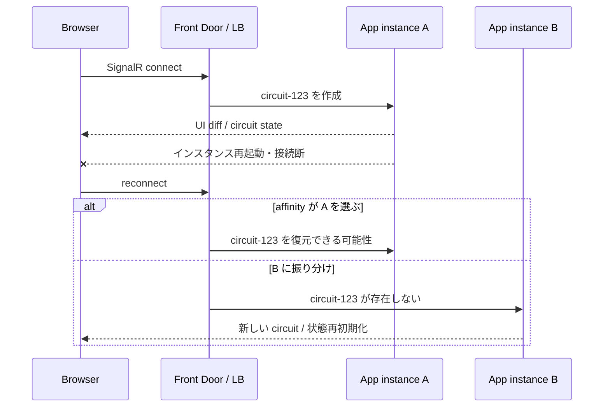
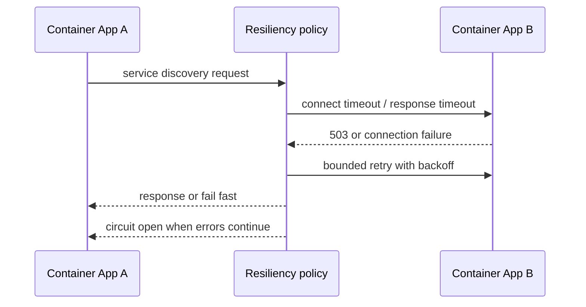
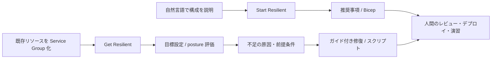

## はじめに 🌟

Azure でアプリケーションを運用していると、「インスタンスを 2 台にする」「別リージョンにもデプロイする」といった冗長化の話がすぐに出てきます。しかし、コンピューティングだけを二重化しても、状態を持つ Blazor の回路（circuit）や、データベース、ストレージ、DNS が単一障害点のままだと、アプリケーション全体は回復しません。

本記事では、Microsoft Learn の信頼性・回復性ガイダンスをもとに、**ゾーン障害とリージョン障害を分けて考え、アプリケーションの各層に適切な冗長化を割り当てる方法**を整理します。App Service / Container Apps、Blazor の状態保持、Azure Storage、Azure SQL Database / Cosmos DB / Redis、Container Apps の Service discovery resiliency、Azure Copilot Resiliency Agent までを一つの設計図として眺めます。

なお、ここでいう回復性（resiliency）は「障害が起きないこと」ではありません。障害を前提に、検知・切り離し・再試行・復旧を、許容する RTO（目標復旧時間）と RPO（目標復旧時点）に合わせて設計することです。

## 本記事のゴール

- 可用性ゾーン内の冗長化と、複数リージョン構成を使い分けられる
- Blazor Server / Interactive Server、WebAssembly、Interactive Auto の状態と DI ライフタイムを説明できる
- Storage とデータ層のレプリケーション方式を、読み取り可否やフェイルオーバーと一緒に比較できる
- Container Apps のリトライやサーキットブレーカーを、アプリ側の責務と分けて設計できる
- Resiliency Agent を「提案と IaC の補助」として使い、コード側への過信を避けられる

## 前提条件

- ✅ Azure のリージョン、可用性ゾーン、RTO / RPO の基本用語を知っている
- ✅ .NET 8 以降の Blazor Web App（Interactive Server / WebAssembly）を想定
- ✅ Azure サービスの機能や提供リージョン、価格は執筆時点の公式ドキュメントで確認する

## まず障害の粒度を分ける 🧭

可用性ゾーンは、同じリージョン内で電源・冷却・ネットワークなどを分離したデータセンター群です。一方、リージョン障害は、複数のゾーンを含む地域全体が利用できなくなる想定です。



| 障害の範囲 | 代表的な対策 | 残る課題 |
|---|---|---|
| ⚡ ノード / データセンター | 複数インスタンス、可用性ゾーン、ヘルスプローブ | リージョン全体の停止には弱い |
| 🏢 ゾーン | Zone-redundant なプラン、ZRS、ゾーン冗長ロードバランサー | 非対応 SKU / リージョンがある |
| 🌍 リージョン | 複数リージョン、geo-replication、Front Door | 非同期レプリケーションの RPO、運用コスト |
| 🧩 アプリ状態 | 外部化、再構築、永続化、冪等なコマンド | 回路切断や二重実行への対応が必要 |

**高可用性の設定を有効にするだけでは、アプリケーションの RTO / RPO は決まりません。** 先に「どの障害まで自動復旧させるか」「データを何分まで失えるか」を決め、その後に SKU と構成を選びます。

## コンピューティングの冗長化

### App Service：プランのゾーン冗長化と複数リージョン

Microsoft Learn の App Service 信頼性ガイダンスでは、Premium v2 ～ v4 の App Service Plan を、対応リージョンで zone redundant にできます。最低 2 インスタンスなどの要件があり、同じプランを使うアプリはその影響を受けます。

単一リージョンでゾーン障害に耐える構成は、まず次のようになります。

```text
App Service Plan (Premium v2-v4 / zone redundant)
  ├─ Instance A (Zone 1)
  ├─ Instance B (Zone 2)
  └─ Instance C (Zone 3)
```

リージョン障害まで対象にするなら、各リージョンに同じアプリを配置し、Front Door などでオリジンを切り替えます。デプロイは「片方を手動で複製」するのではなく、Bicep / Terraform / CI/CD で同じ構成を再現できるようにします。アプリ設定、証明書、マネージド ID、ネットワーク、データ層が揃って初めて、リージョン切り替え後も動きます。

### Container Apps：レプリカ、環境、ゾーン

Container Apps は、環境内のレプリカ数とヘルスプローブでインスタンス障害に対応し、対応リージョンでは環境作成時に zone redundancy を有効化できます。ただし、レプリカを増やしても、コンテナ内のローカルファイルやメモリは共有されません。

複数リージョン構成では、リージョンごとに Container Apps Environment を用意し、Front Door または別のグローバル入口からルーティングします。Container Apps のサービスディスカバリーは環境内の通信を簡素化しますが、リージョン間通信のフェイルオーバーやデータ整合性を自動で解決するものではありません。

### Front Door とロードバランサーの役割

| 層 | サービス例 | 得意なこと | 設計時の注意 |
|---|---|---|---|
| 🌐 グローバル L7 | Azure Front Door Standard / Premium | HTTP(S)、WAF、オリジンのヘルスプローブ、リージョン間ルーティング | ヘルスエンドポイントを軽量かつ依存先の状態を反映するよう設計 |
| 🚪 リージョン L7 | Application Gateway | TLS 終端、URL ルーティング、WAF | リージョン内の冗長化とバックエンド分散が別途必要 |
| 🔌 リージョン L4 | Azure Load Balancer | TCP / UDP、ヘルスプローブ、ゾーン冗長フロントエンド | HTTP のパス判定や TLS 終端は担当しない |

Front Door はオリジンへのヘルスプローブ結果を使ってルーティングします。ただし、すべてのオリジンが unhealthy と判定された場合の動作や、プローブ自身がアプリに負荷を与える点も公式仕様に含まれます。**「HTTP 200 を返す」だけのプローブでは、データベース停止や依存先障害を見逃す可能性がある**ため、readiness と liveness を分けます。

:::message alert
ゾーン冗長なロードバランサーでも、バックエンドが 1 ゾーンに集中していれば、そのゾーンの障害で停止します。入口だけでなく、バックエンドの配置、データ、DNS、証明書まで同じ障害モデルで確認してください。
:::

## Blazor の状態保持と DI ライフタイム

Blazor の冗長化で最初に問題になるのは、ユーザー状態をどこに置くかです。Interactive Server は SignalR 接続ごとに circuit を持ち、サーバー側の scoped サービスは通常その circuit の寿命に対応します。

| レンダーモード | 状態の主な場所 | `Scoped` の意味 | 回復性の観点 |
|---|---|---|---|
| 🖥️ Interactive Server / Blazor Server | サーバーメモリ + circuit | ユーザーの circuit 単位 | 切断・再接続・別インスタンスへの移動を考える |
| 🌐 WebAssembly | ブラウザー | 実質アプリ寿命の singleton に近い | ブラウザー更新や端末消失に備え、API / ストレージへ保存 |
| 🔄 Interactive Auto | 初期は Server、条件により WebAssembly | サーバーとクライアントで別コンテナ | prerendering の状態を明示的に永続化する |

`Singleton` はプロセス内の全ユーザーで共有されるため、ユーザー固有の状態をそのまま置くと、情報漏えいと競合の原因になります。共有キャッシュとして使う場合も、キーにテナントやユーザーの境界を含めるなど、最初から設計が必要です。

`Scoped` は Server では circuit に紐づきますが、回路が切断され、別のインスタンスで再構築されれば同じインスタンスではありません。WebAssembly の scoped は一般的な ASP.NET Core のリクエストスコープとは異なり、クライアントではアプリ寿命に近い挙動になります。

Interactive Auto や prerendering でサービスの状態を引き継ぐ場合、公式ドキュメントの `PersistentState` / `RegisterPersistentService` を使う方法があります。サーバー側は scoped、WebAssembly 側は state restoration の都合で singleton とする例が示されています。**回路状態の永続化は Interactive Server に限られる**ため、WebAssembly へ移った後も必要な状態は API や外部ストレージに保存してください。

```text
ユーザー入力
   ↓
Component state（短命）
   ↓ 重要な状態だけ
API / SQL / Cosmos DB / Redis（外部化）
   ↓
別インスタンス・別リージョンでも再構築可能
```

### スケールアウト時に Interactive Server で起きること

ここは、単に App Service のインスタンス数や Container Apps のレプリカ数を増やすだけでは解決しません。Interactive Server の circuit は、SignalR 接続とともに**特定のサーバーインスタンスのメモリ**に存在します。Microsoft Learn でも、複数のバックエンドを使う Web farm では session affinity（sticky session）が必要で、切断後の再接続を同じサーバーへ戻す必要があると説明されています。



スケールアウト時の代表的な問題と対策を、層ごとに分解すると次のようになります。

| 問題 | 目に見える症状 | 対策・判断 |
|---|---|---|
| 🔀 再接続先が別インスタンス | 入力途中の画面、`Scoped` の値、未保存の編集内容が消える | 短期策は sticky session。重要状態は API / DB へ保存し、circuit を再構築可能にする |
| 🧠 インスタンス内 Singleton の分裂 | A では見えるキャッシュやフラグが B にはない | Singleton を共有状態の正本にしない。共有が必要なら Redis など外部ストアへ |
| 🧵 circuit 数に比例するメモリ | レプリカごとのメモリ使用量が偏る、GC や再起動が増える | circuit に大きな DTO や `DbContext` を保持しない。接続数・メモリ・回路切断を監視する |
| 🔐 暗号鍵がインスタンスごとに異なる | 認証 Cookie や antiforgery、保護データを別インスタンスで復号できない | ASP.NET Core Data Protection のキーリングを共有し、保存先とローテーションを設計する |
| 🚀 デプロイ / scale-in | drain 中の接続が切れ、再接続やイベント再送が発生する | graceful shutdown、接続切断時の UX、コマンドの冪等性、再試行を用意する |
| 🧪 イベントの二重実行 | ボタン操作や外部 API 呼び出しが重複する | idempotency key、重複排除、サーバー側トランザクションで防ぐ |

Sticky session は「どのインスタンスにも同じ circuit 状態がある」ことを意味しません。特定インスタンスへの依存を隠しているだけなので、インスタンス障害、デプロイ、スケールイン、リージョン切り替えでは状態を失う前提が必要です。また、sticky session を長く維持すると、負荷分散の自由度が下がり、特定インスタンスに circuit が偏る可能性があります。

Azure SignalR Service は SignalR 接続を外部化してスケールを補助できますが、コンポーネントの状態や DI の scoped インスタンスを複数のアプリサーバー間で共有するサービスではありません。**接続のスケールと circuit 状態のスケールは別問題**として、状態の保存先を決めます。

### WebAssembly と Interactive Auto では別の落とし穴がある

WebAssembly はサーバー circuit に依存しない一方、ブラウザーのメモリ、タブ、ストレージ、ネットワークに依存します。更新やタブ終了で失われる状態を「クライアントの scoped サービスに置いたから安全」と考えてはいけません。

Interactive Auto では、prerendering → Interactive Server → WebAssembly という境界をまたぐ可能性があります。そのたびに DI コンテナ、実行場所、利用可能な API が変わるため、次を明示します。

- サーバー側の scoped 状態をクライアント側の scoped 状態へ自動同期できるとは限らない
- `PersistentState` でシリアライズする値は、秘密情報や巨大なオブジェクトを含めない
- UI の表示状態と、再取得可能な正本データを分ける
- API 呼び出しは再送されても安全な契約にし、認証・認可を毎回サーバー側で検証する

この整理をしておくと、「レプリカを増やしたら画面が時々初期化される」という事象を、ロードバランサーだけの問題として誤診しにくくなります。

## Azure Storage の冗長化を比較する 💾

Azure Storage の選択は、同じリージョン内の障害と、リージョン全体の障害を分けて考えます。

| 方式 | 主な複製先 | セカンダリ読み取り | リージョン障害への備え | 向いている例 |
|---|---|---:|---|---|
| LRS | 1 データセンター内 | なし | 弱い | 再生成できる一時データ、コスト優先 |
| ZRS | 主リージョンの 3 つ以上のゾーン | なし | 主リージョン消失は対象外 | ゾーン障害に耐えるデータ |
| GRS | 主リージョン + ペアリージョン（非同期） | なし | フェイルオーバー後 | 書き込み継続より DR を優先 |
| RA-GRS | GRS + セカンダリ読み取り | あり | 読み取りを継続しやすい | 読み取り中心の DR |
| GZRS | 主リージョンは ZRS + セカンダリへ非同期 | なし | ゾーン + リージョン | 両方の障害に備える |
| RA-GZRS | GZRS + セカンダリ読み取り | あり | ゾーン + 読み取り DR | 高い可用性と読み取り継続 |

GRS / GZRS のセカンダリへの複製は非同期です。したがって、最後に複製される前の書き込みが失われる可能性があります。また、GRS / GZRS は通常セカンダリへ読み書きできず、RA- 系だけが読み取りアクセスを提供します。冗長化は削除や上書きの誤操作からデータを守るバックアップではないため、論理削除、バージョン管理、バックアップも別に検討します。

## データ層：SQL、Cosmos DB、Redis

### Azure SQL Database

ゾーン障害には zone redundancy、リージョン障害には failover groups、active geo-replication、geo-restore などを使い分けます。Failover group は read-write / read-only listener を提供し、フェイルオーバー後も接続先を切り替えやすい点が特徴です。ただしリージョン間レプリケーションは非同期なので、RPO とトランザクション境界を確認します。

### Azure Cosmos DB

複数リージョンを構成すると、選択した整合性モデルに従ってデータを分散できます。multi-region writes では複数リージョンで読み書きできる構成も選べますが、競合解決、パーティションキー、リージョン追加時のコストを設計しなければなりません。「複数リージョンだから常に同じ値」とは限らず、整合性と可用性のトレードオフを明示します。

### Azure Managed Redis

Redis は、セッションやキャッシュを外部化して Web インスタンスをステートレスにする目的で有効です。本記事では Azure Managed Redis を対象にします。一方、キャッシュを永続データの唯一のコピーにしてはいけません。選択する構成や geo-replication の可否で挙動が変わるため、フェイルオーバー時に「再構築できるか」「書き込みをどこへ向けるか」を確認します。

| データの種類 | 第一候補 | 障害時の考え方 |
|---|---|---|
| 🧾 正本トランザクション | Azure SQL Database | failover group / geo-replication と整合性 |
| 🌍 グローバルなドキュメント | Cosmos DB | 整合性、競合解決、パーティション |
| ⚡ セッション / キャッシュ | Azure Managed Redis | 失っても再生成できる設計、TTL |
| 📦 ファイル / イベント | Azure Storage | ZRS / GZRS、バックアップ、再処理 |

## Container Apps の Service discovery resiliency（Preview） 🔁

Azure Container Apps には、サービス名で通信するリクエストに対して、タイムアウト、HTTP / TCP リトライ、サーキットブレーカー、HTTP / TCP の connection pool を設定する Service discovery resiliency があります。執筆時点では Preview で、Dapr Service Invocation API のリクエストには適用できない制約があります。



主な設計ポイントは次のとおりです。

- ⏱️ Timeout: 接続確立とレスポンス待ちを分け、上流のリクエスト期限より短くする
- 🔂 HTTP / TCP retry: すべてのエラーを再試行せず、ステータスコードや接続エラーを限定する
- 🚧 Circuit breaker: 連続エラー時に下流への送信を止め、障害の連鎖を抑える
- 🧵 Connection pool: 保留リクエスト数や同時接続数を制限し、過負荷を避ける
- 🧪 Jobs retry: バッチ処理は再実行回数を設定し、途中から再開できるか、同じ処理を二度実行しても安全かを確認する

ポリシーは受信側の Container App に適用され、そのアプリへの inbound request に効きます。ポリシーを設定したアプリから外へ出る全リクエストに自動適用されるわけではありません。また、リトライで POST を二重実行する可能性があるため、API 側の idempotency key や重複排除を組み合わせます。

### Preview ポリシーとコード側リトライの競合

最も注意したいのは、Container Apps 側とコード側が**同じ失敗に対して、それぞれ独立にリトライする**構成です。たとえば、App A の `HttpClient` が App B を 2 回再試行し、App B に設定した Service discovery resiliency が各受信要求を 3 回再試行すると、単純化した上限は次のようになります。

```text
コード側の試行回数:       2 + 1 = 3
Container Apps 側の試行:   3 + 1 = 4
下流への試行回数の上限:   3 × 4 = 12
```

実際の回数は、どのエラーを retry match に含めるか、どの段階でタイムアウトするか、プロキシが再試行可能と判断するかで変わります。しかし、**設定値を足し算で見積もらず、最悪時の掛け算と待ち時間の合計で評価する**のが安全です。大量のリクエストが同時に失敗すると、下流サービスをさらに圧迫する retry storm（リトライ嵐）にもつながります。

責務を決めるときは、同じ hop に二重の「汎用リトライ」を置かないのが基本です。

| 判断対象 | Container Apps 側に寄せる | コード側に残す |
|---|---|---|
| 🔌 接続障害・一時的な 5xx | サービス間の共通ポリシーとして一律に扱う | 外部 API / DB / SDK など、Service discovery の外側 |
| 🧠 業務エラー | 扱わない | 業務上再試行できる条件を知っているコード |
| 🔐 認証・認可エラー | 通常は再試行しない | トークン更新など、明確な回復処理だけ |
| ✍️ POST / メッセージ送信 | 冪等性を確認できる場合だけ | idempotency key、重複排除、トランザクション境界 |
| 🚧 サーキットブレーカー | 宛先インスタンスの異常を早く切り離す | 業務依存先の停止や代替処理を判断する |

実装方針としては、次のどちらか、または通信経路ごとの分担を明示します。

1. プラットフォームに寄せる: App A の App B 向け `HttpClient` は短い deadline と限定的な 1 回までにし、HTTP / TCP の一時障害、接続プール、宛先の ejection を Container Apps 側で統一する。
2. コードに寄せる: Container Apps の汎用 retry を控えめにし、コード側で依存先ごとの backoff、キャンセル、フォールバック、業務エラー判定を行う。
3. 分担する: Service discovery は接続確立や明白な 5xx だけ、コード側は外部依存先と業務上の再試行だけ、というように retry match を分ける。

どの方針でも、1 回のユーザー操作に許される**総時間（deadline）**を先に決めます。下位層が 10 秒待つ設定を持つと、上位の 2 秒のタイムアウトに間に合わず、キャンセルされた後も下流で処理が残ることがあります。ログには `request-id`、`retry-attempt`、`policy`、`duration` を記録し、Container Apps のポリシーによる試行とアプリ側の試行を同じ相関 ID で区別できるようにします。

:::message alert
「リトライを増やせば回復性が上がる」とは限りません。リトライ回数、指数バックオフとジッター、サーキットブレーカー、キャンセル伝播、冪等性を一つの予算として設計し、負荷試験では下流障害を意図的に発生させて総試行回数を測定してください。
:::

:::message
Preview 機能は、対応リージョン、CLI 拡張、既定値、制限が変わる可能性があります。本番導入前に、対象環境でのサポート状況と変更履歴を確認し、アプリケーション側にも明示的なタイムアウトとリトライを残してください。
:::

## 最後に：Azure Copilot Resiliency Agent（Preview） 🚀

ここまで、入口・コンピューティング・データ・Blazor の circuit・コード側のリトライを順番に見てきました。最後に紹介したい本命の機能が、Azure Copilot に統合された Resiliency Agent です。

この Agent の価値は、個別サービスの設定を知っていることではありません。アプリケーションを構成するリソースを一つの単位として捉え、「どこがゾーン回復性の目標を満たしていないか」「何を先に直すとよいか」を会話形式で整理できる点にあります。ここまでの記事で作った設計観点を、Azure 上の実リソースに接続する最後の入口です。

### 何ができるのか

公式ドキュメントの機能を、設計の流れに沿って整理します。



| 機能 | できること | この章までの設計との接続 |
|---|---|---|
| 🏗️ Start Resilient | 自然言語の構成から回復性の分析と推奨事項を作り、推奨設定を含む Bicep を生成する | App Service、Container Apps、Storage などを新規設計の段階で点検する |
| 🩺 Get Resilient | 既存リソースを Service Group としてまとめ、回復性目標、現状の posture、未達理由を確認する | ゾーン冗長化、前提条件、対応 SKU の抜けを発見する |
| 🛠️ Guided remediation | 直接変更できるリソースの手順や、再デプロイが必要なリソースのスクリプトを提示する | Bicep / CLI / PowerShell などで変更をレビュー可能にする |
| 💰 判断材料 | コストやダウンタイムなど、修復に伴う影響を確認する | RTO / RPO と予算のトレードオフをチームで議論する |

### インフラ側とコード側の役割分担

Resiliency Agent に相談する前に、アプリ側で「何を失ってよいか」「何を再実行できるか」を決めておくと、提案を評価しやすくなります。役割分担は次のように考えます。

| レイヤー | Resiliency Agent / Azure 側で支援できること | コード側・チーム側の責務 |
|---|---|---|
| 🌐 入口 | Front Door のオリジン、ヘルスプローブ、ゾーン回復性の確認 | probe が本当に ready を表すか、切り替え時の UX |
| 🖥️ コンピューティング | App Service / Container Apps のゾーン構成、リソースの不足、IaC のたたき台 | graceful shutdown、circuit の再構築、接続数とメモリの上限 |
| 🔁 サービス間通信 | Container Apps の timeout、retry、circuit breaker の設定案 | アプリ内 retry との重複排除、deadline、キャンセル、ログ |
| 💾 データ | Storage、SQL、Cosmos DB などの冗長化状況と前提条件 | 整合性、競合解決、トランザクション、バックアップからの復旧 |
| 🧩 Blazor | 関連リソースを同じ Service Group で追跡する | circuit、`Scoped` / `Singleton`、再接続、二重送信、ユーザー状態 |
| 🧪 検証 | 推奨事項、目標達成状況、修復手順の整理 | 実際の障害注入、RTO / RPO の測定、業務継続の受け入れ判定 |

たとえば「Container Apps をゾーン冗長にする」という提案が出ても、Agent は App A の `HttpClient` と App B の Service discovery policy のリトライが掛け算になることや、POST の重複実行が業務上安全かまでは判定できません。Blazor の circuit が切断されたあとに編集中のデータを復元できるか、`Singleton` にユーザー状態が混ざっていないかも、ソースコードと実行テストで確認する領域です。

### 限界を前提に使う

Resiliency Agent は強力な設計レビューの補助ですが、**アプリケーションが回復することの証明ではありません**。執筆時点の主な限界は次のとおりです。

- Preview であり、利用にはテナントの allowlist や Azure Copilot 管理センターでの Agents 設定が必要な場合があります
- 現状は特にゾーン回復性を中心とした体験で、リージョン回復性や他の回復性領域が同じ深さで評価されるとは限りません
- Start Resilient のテンプレート生成は Bicep が中心で、生成物は必ず人間がレビューします
- 一部のリソースは直接変更できず、手順やスクリプトの提示にとどまります。自動変更を前提にしないでください
- ソースコード、Blazor circuit の状態、DI のライフタイム、業務上の冪等性、ユーザー体験を完全に評価する機能ではありません
- 推奨事項を適用しても、データの非同期レプリケーションによる RPO、コスト、クォータ、依存先の停止までは自動的に解消されません

したがって、実際の使い方は「Agent に任せて終わり」ではなく、次の順番になります。

1. コード側で circuit、状態、リトライ、冪等性、RTO / RPO の前提を定義する
2. Agent に構成を説明し、Service Group と回復性目標を作る
3. posture と推奨事項を、コード側の前提と照合する
4. 生成された Bicep / スクリプトをレビューし、コスト・権限・停止時間を確認する
5. デプロイ後にゾーン停止、依存先停止、circuit 切断、リージョン切り替えを演習する

この順番なら、インフラ側の自動化にコード側の責務を押し付けず、逆にコード側だけでは見落としやすいゾーン配置やリソース依存関係を Agent に拾ってもらえます。

## 実装前のチェックリスト ✅

- [ ] ゾーン障害とリージョン障害それぞれの RTO / RPO を決めた
- [ ] App Service / Container Apps の SKU、リージョン、ゾーン対応を確認した
- [ ] Front Door のヘルスプローブが本当に ready 状態を表す
- [ ] Blazor のユーザー状態を circuit や Singleton に閉じ込めていない
- [ ] Interactive Server の sticky session、再接続、scale-in / デプロイ時の circuit 消失を検証した
- [ ] インスタンス間で Data Protection キーリングを共有し、Singleton を正本にしていない
- [ ] UI イベントと外部 API 呼び出しが二重実行されても安全である
- [ ] Storage の GRS 系が非同期で、RA- 系だけがセカンダリ読み取りを提供することを踏まえた
- [ ] SQL / Cosmos DB / Redis のフェイルオーバー手順を実行した
- [ ] リトライ対象、最大回数、バックオフ、サーキットブレーカーを定義した
- [ ] Jobs と API の処理が冪等で、途中再開できる
- [ ] Resiliency Agent が生成した IaC と推奨事項を人間がレビューした
- [ ] 実際にゾーン停止・リージョン切り替え・依存先停止を演習した

## まとめ / おわりに 🌈

Azure の回復性は、単一のチェックボックスではなく、**入口、コンピューティング、アプリ状態、データ、運用**の組み合わせです。App Service や Container Apps を複数ゾーン・複数リージョンに配置しても、Blazor の circuit 状態やデータ層のフェイルオーバーが設計されていなければ、利用者の体験は途切れます。

まずは障害の範囲を決め、次に各層の「失ってよいもの」と「失ってはいけないもの」を分けてください。Preview の Service discovery resiliency や Resiliency Agent は有力な補助になりますが、最終的な回復性は、コードの冪等性、明示的な timeout、実測できる演習によって確かめるものです。

## 参考リンク（Microsoft Learn）

- [Reliability in Azure App Service](https://learn.microsoft.com/azure/reliability/reliability-app-service?WT.mc_id=DT-MVP-5004827)
- [Reliability in Azure Container Apps](https://learn.microsoft.com/azure/reliability/reliability-container-apps?WT.mc_id=DT-MVP-5004827)
- [Reliability in Azure Load Balancer](https://learn.microsoft.com/azure/reliability/reliability-load-balancer?WT.mc_id=DT-MVP-5004827)
- [Azure Front Door health probes](https://learn.microsoft.com/azure/frontdoor/health-probes?WT.mc_id=DT-MVP-5004827)
- [Azure Storage redundancy](https://learn.microsoft.com/azure/storage/common/storage-redundancy?WT.mc_id=DT-MVP-5004827)
- [Business continuity in Azure SQL Database](https://learn.microsoft.com/azure/azure-sql/database/business-continuity-high-availability-disaster-recover-hadr-overview?view=azuresql&WT.mc_id=DT-MVP-5004827)
- [Distribute your data globally with Azure Cosmos DB](https://learn.microsoft.com/azure/cosmos-db/distribute-data-globally?WT.mc_id=DT-MVP-5004827)
- [Azure Managed Redis overview](https://learn.microsoft.com/azure/redis/overview?WT.mc_id=DT-MVP-5004827)
- [ASP.NET Core Blazor dependency injection](https://learn.microsoft.com/aspnet/core/blazor/fundamentals/dependency-injection?view=aspnetcore-10.0&WT.mc_id=DT-MVP-5004827)
- [ASP.NET Core Blazor SignalR guidance](https://learn.microsoft.com/aspnet/core/blazor/fundamentals/signalr?view=aspnetcore-10.0&WT.mc_id=DT-MVP-5004827)
- [Host and deploy server-side Blazor apps](https://learn.microsoft.com/aspnet/core/blazor/host-and-deploy/server?view=aspnetcore-10.0&WT.mc_id=DT-MVP-5004827)
- [ASP.NET Core Blazor server-side state management](https://learn.microsoft.com/aspnet/core/blazor/state-management/server?view=aspnetcore-10.0&WT.mc_id=DT-MVP-5004827)
- [ASP.NET Core Blazor prerendered state persistence](https://learn.microsoft.com/aspnet/core/blazor/state-management/prerendered-state-persistence?view=aspnetcore-10.0&WT.mc_id=DT-MVP-5004827)
- [Service discovery resiliency (preview)](https://learn.microsoft.com/azure/container-apps/service-discovery-resiliency?WT.mc_id=DT-MVP-5004827)
- [Retry Storm antipattern](https://learn.microsoft.com/azure/architecture/antipatterns/retry-storm/?WT.mc_id=DT-MVP-5004827)
- [Jobs in Azure Container Apps](https://learn.microsoft.com/azure/container-apps/jobs?tabs=azure-cli&WT.mc_id=DT-MVP-5004827)
- [Azure Copilot Resiliency Agent (preview)](https://learn.microsoft.com/azure/copilot/resiliency-agent?WT.mc_id=DT-MVP-5004827)
- [Use the Resiliency agent in Infrastructure Resiliency Manager (preview)](https://learn.microsoft.com/azure/resiliency/goals-recommendations-use-agent?WT.mc_id=DT-MVP-5004827)
