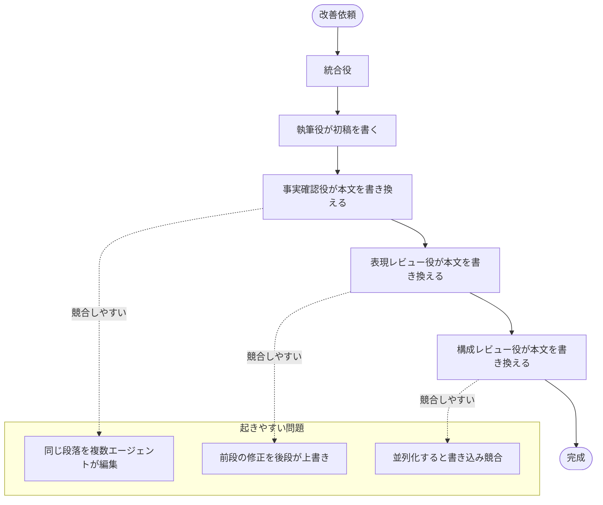
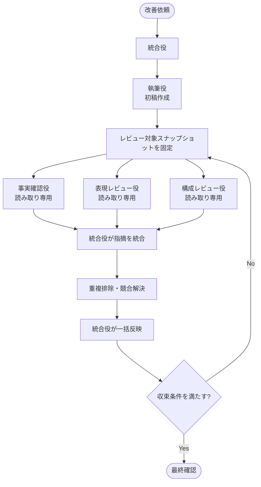

## はじめに

GitHub Copilot CLI で複数のエージェントを使って成果物を改善するワークフローを考えていると、最初に悩むのが「誰が成果物を書き換えるのか」です。

私も最初は、執筆役が初稿を書き、その後に事実確認役、表現レビュー役、構成レビュー役が順番に本文を確認する流れを考えていました。これは逐次型のワークフローです。

一見すると自然な分担です。専門エージェントが順番に成果物を改善していくので、レビュー観点も漏れにくそうに見えます。

しかし、並列実行を前提に考えると、この設計はかなり相性が悪いことに気づきました。理由はシンプルで、**複数のエージェントが同じ本文を書き換える**からです。

この記事では、GitHub Copilot CLI で複数エージェントを扱うときの考え方として、同じ成果物を安全に改善するための設計を整理します。ブログ記事執筆は、あくまで題材として扱います。具体的には、「逐次編集」から「読み取り専用レビュー + 統合役による一括反映」へ変える考え方を扱います。🧭

次に、この記事で扱う範囲を明確にしておきます。

## 今回のゴール

この記事のゴールは、GitHub Copilot CLI で複数エージェントを使い、同じ成果物をレビュー・改善するときの設計方針を整理することです。

- ✅ 逐次型ワークフローで何が問題になりやすいかを説明する
- ✅ 並列実行しやすくするための責務分割を整理する
- ✅ エージェントの役割を機能ベースで読み解く
- ✅ レビュー結果を統合役がまとめて反映する考え方を示す
- ✅ 各ステップを他の開発ワークフローにも応用できる設計として一般化する

:::message
この記事では、GitHub Copilot CLI の文脈におけるエージェント設計として説明します。ただし、具体的なワークフロー名や固有のエージェント名には踏み込みません。ブログ記事執筆を題材にしつつ、複数エージェントで同じ成果物を扱うときの設計原則として整理します。
:::

では、まずエージェントの役割分担を見ていきます。

## GitHub Copilot CLI で考えるエージェントの役割

この記事で扱うのは、GitHub Copilot CLI で複数エージェントに作業を分けるときの、次のような役割です。ここでの役割名は固有のエージェント名ではなく、ワークフロー上の機能を表す便宜的な分類です。

| 役割 | 主な機能 | 成果物への書き込み |
|------|----------|--------------------|
| 🧭 統合役 | 依頼全体を整理し、レビュー結果を統合して一括反映する | あり |
| ✍️ 執筆役 | 初稿を作成し、成果物の土台を用意する | あり |
| 🔎 事実確認役 | 技術的主張や数値を一次情報で確認し、修正案を返す | なし |
| 📝 表現レビュー役 | 文体、表記ゆれ、冗長表現を確認し、修正案を返す | なし |
| 🧩 構成レビュー役 | 章立て、論理展開、読者導線を確認し、修正案を返す | なし |

ポイントは、この設計ではレビュー系エージェントを **読み取り専用レビューとして動かす** ことです。本文やファイルを直接書き換えないようにプロンプトや権限で制約し、指摘箇所・理由・修正案だけを返す役割として扱います。

この前提が、並列実行しやすいワークフローの土台になります。

以降では、この題材をもとに、複数の処理が同じ成果物を扱うときの一般原則を整理します。ここでは名前ではなく、書く・確認する・統合するという機能で役割を見ていきます。

## 旧方式: 専門エージェントが順番に本文を書き換える

旧方式では、成果物を各エージェントが順番に改善していくイメージでした。

この方式では、各エージェントが専門領域を持っていること自体は良いのですが、成果物への書き込み権限が広すぎます。

たとえば、事実確認役が事実関係を直した段落に対して、表現レビュー役が文体を整えることがあります。さらに、構成レビュー役が段落の移動を提案することもあります。逐次実行なら順番に処理できます。一方、並列実行では「どの変更を正とするのか」が曖昧になります。

つまり問題は、エージェントの専門性ではなく、**編集権限の持ち方**でした。

ここから、新方式では編集権限を統合役に集約します。

## 新方式: レビュー系は読み取り専用で指摘だけ返す

新方式では、執筆役とレビュー系エージェントの責務をはっきり分けます。

執筆役は成果物の土台を作る担当です。ブログ記事であれば初稿を書き、設計書であれば章立てと主要な説明を用意します。

一方、事実確認役、表現レビュー役、構成レビュー役は本文を書き換えないように制約します。読み取り専用で確認し、**指摘箇所・理由・修正案だけ**を返します。

この形にすると、レビュー系エージェントは同じスナップショットを並列で読めます。本文を書き換えないので、レビュー実行中の書き込み競合を避けやすくなります。

ここで大事なのは、「並列実行する」の前に「並列実行しても壊れない責務分割にする」ことです。

以降では、この新方式をスナップショット固定、指摘形式、競合解決、収束条件の 4 点に分けて見ていきます。

## Step 1: レビュー対象スナップショットを固定する

レビューラウンドの開始時には、レビュー対象となる成果物のスナップショットを固定します。

これは地味ですが、並列レビューではかなり重要です。

レビュー中に本文が更新されると、事実確認役は古い本文、表現レビュー役は新しい本文、構成レビュー役は途中状態の本文を見ることがあります。その結果、指摘を統合するときに `location` や `before` がずれてしまいます。

そこで、同一ラウンド内ではすべてのレビュー系エージェントが同じ本文を読みます。そして、すべてのレビュー結果が返るまでは一部の指摘だけを先に適用しません。

| 観点 | 逐次編集 | スナップショット固定 |
|------|----------|----------------------|
| 🧾 入力本文 | 前段の編集結果に依存 | 全レビューが同じ本文を見る |
| ✍️ 書き込み | 各エージェントが実施 | 統合役のみ実施 |
| 🔀 並列実行 | 競合しやすい | レビュー中の書き込み競合を避けやすい |
| 🧩 指摘統合 | 後段の判断に埋もれやすい | 統合キューで比較できる |

つまり、スナップショット固定は「レビューを並列化するための足場」です。

一般化すると、これは **並列に動く処理へ同じ入力を渡す** 設計です。テスト、静的解析、レビュー、差分生成のように複数の観点で同じ成果物を見る場合は、先に入力を固定しておくと、後から結果を比較しやすくなります。逆に、処理中に入力が変わると、結果の差が「観点の違い」なのか「見ていた入力の違い」なのか分からなくなります。

AI エージェントに限らず、並列化したい処理では「まず入力を固定する」「処理中は共有状態を更新しない」「結果だけを集める」という形にしておくと、後段の統合がしやすくなります。

## Step 2: 統合用指摘一覧にそろえる

レビュー系エージェントは、それぞれ専門領域が異なります。そのため、通常のレビュー出力だけでは統合役が扱いづらいことがあります。

そこで、読み取り専用レビューでは、末尾に「統合用指摘一覧」を追加するようにします。

| エージェント | 統合用の主な列 |
|--------------|----------------|
| 🔎 事実確認役 | `source` / `severity` / `location` / `before` / `after` / `rationale` / `url` |
| 📝 表現レビュー役 | `source` / `severity` / `location` / `before` / `after` / `rationale` |
| 🧩 構成レビュー役 | `source` / `severity` / `location` / `before` / `after` / `rationale` |

特に重要なのは `location` と `before` / `after` です。

`location` があれば、どの見出し・段落・行に対する指摘なのかを特定できます。`before` / `after` があれば、同じ箇所に対する複数の提案を比較できます。

このように出力形式をそろえることで、レビュー結果は「自然文の感想」ではなく、統合役が扱える差分候補になります。

一般化すると、これは **並列処理の出力を共通スキーマにそろえる** 考え方です。各処理が自由な形式で結果を返すと、人間には読めても機械的な統合が難しくなります。そこで、`source`、`severity`、`location`、`before`、`after`、`rationale` のように最低限の列をそろえておきます。これにより、後段で重複排除や優先順位付けをしやすくなります。

これは CI の検査結果、セキュリティスキャン、アクセシビリティチェックのような機械的な結果にも応用しやすい考え方です。GitHub Copilot CLI で複数のレビュー系エージェントを使う場合も、観点や指摘項目をそろえることで、判断キューとして扱いやすくなります。

## Step 3: 競合解決順を決めておく

同じ箇所に複数の指摘が来た場合、どれを優先するかを毎回その場で考えると、ワークフローが不安定になります。

そこで、競合する指摘を次のような優先順で解決すると決めておきます。

1. **事実修正**
2. **構成修正**
3. **表現レビュー**

これは実行順ではありません。レビュー自体は並列に走らせます。あくまで、同じ箇所へ一括反映するときの競合解決順です。

この順番には納得感があります。

- 🔎 事実が誤っている文章は、どれだけ読みやすくても公開できない
- 🧩 構成が変わると、段落単位の日本語修正は無効になることがある
- 📝 最後に文体・表記を整えると、反映後の文章として自然になる

逐次型では、この優先順位が暗黙になりがちでした。新方式では、統合役の責務として明文化したことが大きな違いです。

一般化すると、これは **統合前に競合解決ポリシーを決めておく** という考え方です。複数の処理が同じ対象に変更案を出す場合、衝突が起きる可能性があります。だからこそ、衝突したときに何を優先するのかを、実行時の気分ではなくルールとして決めておきます。

たとえば、コード変更なら「ビルドが通ること」「セキュリティ」「互換性」「読みやすさ」のように優先順位を付けられます。ドキュメントなら「事実の正しさ」「構成」「表現」の順にすると、読みやすいけれど誤っている文章を残す判断を避けられます。

競合をどう解くかを決めたら、次はその改善ループをどこで止めるかを決める必要があります。

## Step 4: 収束条件でループを止める

新方式では、レビューを 1 回実行して終わりではなく、完成判定が出るまでレビューループを反復します。

ただし、無限に回すわけではありません。最大ラウンド数を決め、上限に達しても未収束の場合は、残課題と一緒に人間へ差し戻すようにします。

収束条件も具体的にしておきます。以下はブログ記事を題材にした場合の一例です。重要なのは数値そのものではなく、止める条件を先に決めることです。

| 観点 | このワークフローでの収束条件例 |
|------|----------------|
| 🔎 事実確認 ❌ | 0 件 |
| 🔎 事実確認 ⚠️ | 0 件 |
| 🔎 事実確認 ❓ | 2 件以下（要確認） |
| 📝 表現レビューの必須修正 | 0 件 |
| 🧩 構成レビューのブロッカー | 0 件 |
| 🧩 構成レビュー総合評価 | A または B |
| 🔁 新規指摘増加 | 0 件 |

この条件があることで、「なんとなく良さそうなので完成」という判断を避けられます。

特に複数エージェントを使う場合、各エージェントが別々の観点で改善を提案します。だからこそ、統合役側に「どの状態を完成とみなすか」を持たせる必要があります。

一般化すると、これは **ループの終了条件を先に決めておく** という考え方です。改善系のワークフローは、回そうと思えばいつまでも回せます。レビューを重ねるほど良くなる面もありますが、終わりが決まっていないと、完成ではなく停滞に近づいてしまいます。

そこで、ブロッカー件数、警告件数、評価ランク、新規指摘の増減、最大ラウンド数のような終了条件を先に置きます。これは記事執筆だけでなく、リファクタリング、テスト修正、品質ゲート、プロンプト改善のような反復作業にも応用しやすい考え方です。「何を満たせば止めるのか」を決めることで、改善ループを制御しやすいプロセスにできます。

ただし、この設計を運用するときには、レビュー系エージェントにも直接修正させたくなる誘惑があります。

## 運用上の注意

設計としてはシンプルですが、実際に運用しようとすると迷いやすい点があります。特に大きいのは、レビュー系エージェントに書き込み権限を持たせたくなる誘惑と、最後の判断まで自動化したくなる誘惑です。

### レビュー系エージェントに書き込み権限を持たせたくなる

この設計で一番迷うのは、レビュー系エージェントに「ついでに直して」と言いたくなる点です。

たとえば表現レビュー役が明らかな表記ゆれを見つけたら、その場で直してくれたほうが速そうに見えます。事実確認役が誤りを見つけたときも、修正案まであるなら本文に反映してほしくなります。

しかし、ここで書き込みを許すと、並列実行の前提が崩れます。

:::message alert
レビュー系エージェントに本文を書き換えさせると、同一スナップショットを並列レビューする設計ではなくなります。書き込みは統合役に集約する、という制約を守ることが重要です。
:::

この制約は、エージェントの能力を下げるためではありません。むしろ、専門エージェントが安心して専門領域に集中できるようにするための境界線です。

ただし、書き込み権限を統合役に集約しても、公開判断まで AI に委ねるわけではありません。

### 最後の判断まで自動化したくなる

ここまで AI エージェントによる執筆・レビューの分担を整理してきました。最後の判断まで自動化したくなりますが、このワークフローで一番大事なのは、**最後は人が成果物として読み直し、責任を持って整える**ことです。

この設計では、AI エージェントに公開判断まで委ねる前提にはしません。AI エージェントは、初稿作成や観点別レビューを助ける存在として扱います。そこから先は、読者に届ける文章として自然かを確認する必要があります。自分の経験や考察が入っているか、誤解を招く表現がないかも確認します。その責任は、最終的に人間の著者にあります。

そのため、このワークフローでは、収束条件を満たしても即公開とはしません。人が最後に通読します。AI エージェントの指摘を踏まえつつ、自分の言葉として違和感がないか、公開先のルールに沿った共有になっているかを確認します。そのうえで、公開するかどうかを判断します。

## この設計から得た学び

今回の変更で、私が一番大事だと感じたのは「エージェントを増やす前に、成果物への権限設計を決める」ことです。

複数エージェントのワークフローでは、役割分担だけを見るときれいに見えます。

- 執筆役は書く
- 事実確認役は確認する
- 表現レビュー役は整える
- 構成レビュー役は流れを見る
- 統合役は全体を見る

しかし、実際に競合を生むのは「役割」ではなく「書き込み先」です。同じファイルの同じ行や、移動・削除を含む近い範囲を複数人が編集すれば、人間のチームでもコンフリクトが起きます。エージェントでも同じです。

だからこそ、新方式ではレビュー系エージェントを読み取り専用にし、指摘を構造化して返し、統合役が統合して一括反映する形にしました。

ここまでの 4 ステップをまとめると、共有状態を直接更新せず、入力を固定し、出力形式をそろえ、競合解決ポリシーと終了条件を決める設計だったと言えます。

これはブログ記事に限らず、GitHub Copilot CLI で設計書、README、仕様書、ADR のようなテキスト成果物を改善するときにも応用しやすい考え方です。重要なのは、作業を分けることそのものではなく、共有状態への書き込み境界を明確にすることです。

## おわりに

この記事では、GitHub Copilot CLI で複数エージェントを使い、同じ成果物を安全に改善するための設計を整理しました。冒頭の問いに戻ると、最初に決めるべきなのは「誰が作業するか」だけでなく、「誰が最後に書き込むか」でした。

旧方式では、各エージェントが本文を書き換えるため、同じ箇所への書き込み競合が起きやすくなっていました。新方式では、レビュー系エージェントを読み取り専用にします。統合用指摘一覧だけを返してもらい、統合役が重複排除・競合解決・一括反映を担当します。

この設計により、エージェントごとの専門性を活かしつつ、並列実行しやすいワークフローとして定義できました。

ただし、収束条件を満たしても、公開前の最終判断は人間の著者が担います。

複数エージェントで同じ成果物を改善したいときは、まず「誰が書くか」ではなく、**誰が最後に書き込むか**を決めると設計しやすくなるのではないでしょうか。これは AI エージェントに限らず、複数の処理や人間が同じコードベースを扱うときにも効いてくる考え方です。かなり普遍的な設計の勘所だと感じています。🧭
