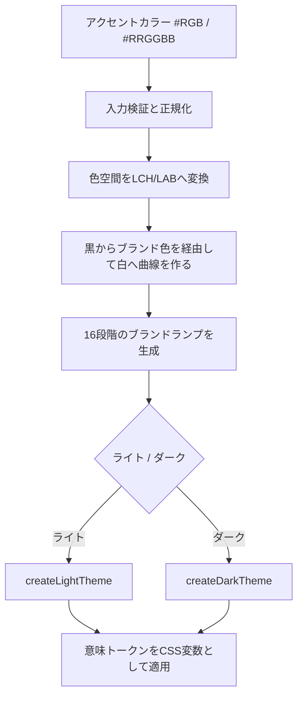

## はじめに

UI ライブラリを使っていると、色を `#0078D4` のようなカラーコードで直接指定するよりも、`colorBrandForeground1` や `colorNeutralBackground1` のようなデザイントークンを指定する場面が増えてきます。

デザイントークンは、単なる色の変数ではありません。ライトモードとダークモード、通常表示とホバー表示、ブランド色の変更といった状態の違いを、意味のある名前の下に隠蔽する仕組みです。

本記事では、Microsoft Fluent UI Blazor v5（`dev-v5` ブランチ）のソースコードを読みながら、カラートークンに加えて、タイポグラフィ、間隔、角丸、境界線、シャドウ、モーションを整理します。まずトークンの役割と色以外の要素を確認し、その後でブランド色（アクセントカラー）からカラーパレットを生成し、ライトテーマ / ダークテーマの意味トークンへ変換する流れを扱います。さらに、v4.14.4 のテーマ適用経路と比較し、世代によるカラートークンの仕組みの違いを確認します。最後に、アクセシビリティ上の保証範囲と、アプリケーション側で確認することをまとめます。

最初に、重要な注意点を述べておきます。Fluent UI Blazor v5 は、任意の色を入力すれば**すべてのトークンについて常に WCAG 2.1 AA の 4.5:1 を実行時に保証する**仕組みではありません。特に `isExact` を有効にした場合、ソースコード自身が「ランプ内のすべての色がアクセシビリティのコントラストチェックを通る保証はない」と明記しています。

それでも、通常のブランドテーマ生成では、1 色をそのまま画面へ適用するのではなく、色の明度を持ったランプと、ライト / ダークそれぞれに適した意味トークンの対応付けを使います。この設計が、アクセントカラーを変更しても破綻しにくい理由です。

## 本記事のゴール

この記事では、まず Fluent UI Blazor v5 における「デザイントークン」と「カラートークン」の役割を確認します。そのうえで、色以外のトークン要素が実際のコンポーネントでどのように使われるのか、1 つのアクセントカラーからブランドランプが生成される流れ、そしてライトモードとダークモードで同じランプの異なる段階が選ばれる理由を追います。

さらに、「4.5:1 を保証する仕組み」と「保証していない範囲」を区別し、`ThemeSettings` が変更する範囲とアプリケーション側に残る責任も整理します。

## 前提

参照するのは [Microsoft Fluent UI Blazor `dev-v5` ブランチ](https://github.com/microsoft/fluentui-blazor/tree/dev-v5)で、v5 側はコミット `95b25a55e7311fe412d51ce3398b1ad339ee5eb3` を確認します。比較対象は、コミット `ec340baf96cf36dec7b7660c3c7adba91dab051c` を指す Fluent UI Blazor v4.14.4 のタグです。対象パッケージは `Microsoft.FluentUI.AspNetCore.Components` v5 系であり、テーマ生成に使われる `@fluentui/tokens` のバージョンは、`dev-v5` の `Core.Scripts/package-lock.json` で確認できる `1.0.0-alpha.24` とします。

コントラストの基準には、WCAG 2.1 達成基準 1.4.3「コントラスト（最低限）」の AA を用います。

WCAG 2.1 の 1.4.3 では、通常サイズのテキストに少なくとも 4.5:1、大きなテキストに少なくとも 3:1 のコントラスト比を求めています。

> The visual presentation of text and images of text has a contrast ratio of at least 4.5:1.
>
> — [Web Content Accessibility Guidelines (WCAG) 2.1, 1.4.3 Contrast (Minimum)](https://www.w3.org/TR/WCAG21/#contrast-minimum)

この基準を踏まえたうえで、まずデザイントークンが何を表しているかを確認します。

## デザイントークンは「色」ではなく「役割」を表す

Fluent UI の CSS 変数には、役割を表す名前が付いています。例えば `--colorNeutralForeground1` は通常の本文色、`--colorNeutralBackground1` はページの基本背景色です。ブランド色を使う前景色には `--colorBrandForeground1`、ブランド色を使う背景には `--colorBrandBackground` が対応します。また、ブランド背景の上に置く前景色は `--colorNeutralForegroundOnBrand`、リンク用のブランド前景色は `--colorBrandForegroundLink` です。

例えば、Fluent UI Blazor の標準 CSS では、本文と背景を次のように指定しています。

```css
body {
  color: var(--colorNeutralForeground1);
  background-color: var(--colorNeutralBackground1);
}

a {
  color: var(--colorBrandForegroundLink);
}
```

出典は、[`default-fuib.css`](https://github.com/microsoft/fluentui-blazor/blob/95b25a55e7311fe412d51ce3398b1ad339ee5eb3/src/Core/wwwroot/css/default-fuib.css) です。ここで重要なのは、CSS が具体的な RGB 値を持っていないことです。テーマが切り替わると、同じ `--colorNeutralForeground1` という名前から得られる実際の色が切り替わります。

つまり、コンポーネント側は「濃い青を使う」のではなく、「本文に適した前景色を使う」と宣言できます。これが、テーマ変更時のアクセシビリティを一箇所に集約する第一歩です。

この役割分担は、色以外のトークンにも共通しています。

## 色以外のデザイントークン

カラーパイプラインの詳細へ進む前に、同じ実装で確認できる色以外のトークンを見ておきます。先に全体の部品を把握すると、後で登場する「意味トークン」が色だけの仕組みではないことも追いやすくなります。

Fluent UI Blazor v5 には、色以外にも実際に CSS で参照されるカスタムプロパティがあります。ここでは、確認コミットの [`FluentUIStyles.ts`](https://github.com/microsoft/fluentui-blazor/blob/95b25a55e7311fe412d51ce3398b1ad339ee5eb3/src/Core.Scripts/src/FluentUIStyles.ts)、標準スタイル、コンポーネントのスタイルから確認できるものだけを扱います。

まず、テーマ生成の入口である [`Theme.ts`](https://github.com/microsoft/fluentui-blazor/blob/95b25a55e7311fe412d51ce3398b1ad339ee5eb3/src/Core.Scripts/src/Utilities/Theme.ts) は、`@fluentui/tokens` の `createLightTheme` / `createDarkTheme` でテーマを作り、`setTheme` で適用します。したがって、アプリケーションからは個々の CSS 変数を直接組み立てるのではなく、テーマとコンポーネントが共有する名前を参照する形になります。

一方、すべてのトークンが `ThemeSettings` から計算されるわけではありません。`ThemeSettings` はブランド色とその生成条件を受け取り、後述する間隔の値や Toast のアニメーション時間を直接変更する設定ではありません。プロパティの詳細は、後述するブランドランプの節で確認します。これは「テーマで一括変更できる値」と「ライブラリのスタイルに定義された値」を分けて考えるための重要な境界です。

### タイポグラフィ（文字の大きさ・行間・ウェイト）

`default-fuib.css` と `reboot.css` は、本文に `--fontFamilyBase`、`--fontSizeBase300`、`--lineHeightBase300`、`--fontWeightRegular` を使い、見出しには `--fontSizeHero900` から `--fontSizeHero700`、`--lineHeightHero900` から `--lineHeightHero700` などを使っています。等幅フォントには `--fontFamilyMonospace` が使われます。

```css
body {
  font-family: var(--fontFamilyBase);
  font-size: var(--fontSizeBase300);
  line-height: var(--lineHeightBase300);
  font-weight: var(--fontWeightRegular);
}

h1 {
  font-size: var(--fontSizeHero900);
  line-height: var(--lineHeightHero900);
}
```

出典は [`default-fuib.css`](https://github.com/microsoft/fluentui-blazor/blob/95b25a55e7311fe412d51ce3398b1ad339ee5eb3/src/Core/wwwroot/css/default-fuib.css) と [`reboot.css`](https://github.com/microsoft/fluentui-blazor/blob/95b25a55e7311fe412d51ce3398b1ad339ee5eb3/src/Core/wwwroot/css/reboot.css) です。文字サイズ、行間、太さを役割名で揃えることで、本文と見出しの階層をコンポーネント間で統一できます。読みやすい行間や明確な見出しの階層は、認知負荷を下げ、拡大表示やテーマ変更時にも同じ設計意図を保ちやすくします。

ただし、これらのトークンを使っただけで、すべてのフォントで同じ可読性になるわけではありません。日本語と欧文の字面、ユーザーが指定するフォント、コンテナー幅、ブラウザーの拡大率はアプリケーションごとに異なります。最終的には実際の文章と表示環境で、折り返し、クリッピング、フォーカス位置を確認します。

### 間隔とサイズ（レイアウトのリズム）

`FluentUIStyles.ts` には、間隔の CSS カスタムプロパティが明示的に定義されています。例えば `--spacingVerticalXS` は `4px`、`--spacingVerticalS` は `8px`、`--spacingVerticalM` は `12px`、`--spacingVerticalL` は `16px` です。水平方向にも同じ段階の `--spacingHorizontal...` があり、`None` から `XXXXL` まで用意されています。

```css
/* FluentUIStyles.ts で定義される間隔の一部 */
:root {
  --spacingVerticalS: 8px;
  --spacingVerticalM: 12px;
  --spacingHorizontalS: 8px;
  --spacingHorizontalM: 12px;
}
```

標準 CSS では、テーブルのセルに `var(--spacingVerticalS) var(--spacingHorizontalM)` を指定します。また、[`FluentCard.razor.css`](https://github.com/microsoft/fluentui-blazor/blob/95b25a55e7311fe412d51ce3398b1ad339ee5eb3/src/Core/Components/Card/FluentCard.razor.css) はカードの内側余白に `--spacingVerticalM` と `--spacingHorizontalM` を使い、[`FluentTabs.razor.css`](https://github.com/microsoft/fluentui-blazor/blob/95b25a55e7311fe412d51ce3398b1ad339ee5eb3/src/Core/Components/Tabs/FluentTabs.razor.css) はタブの余白に `S` を使います。

`@fluentui/tokens` の `createLightTheme` / `createDarkTheme` も `horizontalSpacings` / `verticalSpacings` をテーマへ展開します。そのため、同名の変数がテーマ適用後にどの値になっているかは、ブラウザーの計算済みスタイルで確認してください。間隔の段階を共有すると、クリック対象の周囲に必要な余白や、情報のグルーピングをコンポーネント間で揃えられますが、タップ対象の最小サイズや WCAG 適合を自動保証するものではありません。カスタム CSS で詰めたり、長いラベルを入れたりした場合は、キーボード操作、タッチ操作、ズーム時の重なりを別途確認します。

### 角丸・境界線・ストローク

角丸には `--borderRadiusMedium`、境界線の太さには `--strokeWidthThin`、境界線の色には `--colorNeutralStroke1` のように、形状・太さ・色を別々のトークンで指定します。例えばカードは、[`FluentCard.razor.css`](https://github.com/microsoft/fluentui-blazor/blob/95b25a55e7311fe412d51ce3398b1ad339ee5eb3/src/Core/Components/Card/FluentCard.razor.css) で次のように利用します。

```css
.fluent-card {
  border: var(--strokeWidthThin) solid var(--colorNeutralStroke1);
  border-radius: var(--borderRadiusMedium);
}
```

Popover も [`FluentPopover.ts`](https://github.com/microsoft/fluentui-blazor/blob/95b25a55e7311fe412d51ce3398b1ad339ee5eb3/src/Core.Scripts/src/Components/Popover/FluentPopover.ts) で `--borderRadiusMedium` と `--colorTransparentStroke` を使います。角丸の大きさと境界線の太さを役割名で共有すると、カード、入力欄、ポップオーバーの視覚的なまとまりを保ちやすくなります。境界線は領域の区切りを補助し、状態変化を色だけに依存しない設計にもつながります。

ただし、角丸は情報の意味やフォーカス表示を代替しません。細い境界線が背景と十分に区別できるか、フォーカスリングが見えるかは、`--color...Stroke...` の組み合わせと実際の背景で確認する必要があります。特に、識別に必要な UI コンポーネントやグラフィックオブジェクトは、本文の 4.5:1 とは別に WCAG 1.4.11 の観点で評価します。非アクティブなコンポーネント、純粋な装飾、ロゴタイプなどは、この達成基準の例外です。

### エレベーション（シャドウ）

シャドウは、要素が通常の面からどの程度浮いて見えるかという視覚的な階層を表します。Fluent UI Blazor v5 のカードでは、`shadow="small"`、`medium`、`large`、`extralarge` という属性に対して、`--shadow2`、`--shadow8`、`--shadow16`、`--shadow28` を割り当てています。選択可能なカードのホバー時には、さらに `--shadow8` や `--shadow64` が使われます。

```css
.fluent-card[shadow="medium"] {
  box-shadow: var(--shadow8);
}

.fluent-card[selectable]:hover {
  box-shadow: var(--shadow8);
}
```

Popover は [`FluentPopover.ts`](https://github.com/microsoft/fluentui-blazor/blob/95b25a55e7311fe412d51ce3398b1ad339ee5eb3/src/Core.Scripts/src/Components/Popover/FluentPopover.ts) で `--shadow16`、Toast は [`FluentToast-Styles.ts`](https://github.com/microsoft/fluentui-blazor/blob/95b25a55e7311fe412d51ce3398b1ad339ee5eb3/src/Core.Scripts/src/Components/Toast/FluentToast-Styles.ts) で `--shadow8` を使います。このように、コンポーネントの役割ごとに段階を選ぶことで、重なり順や一時的な通知を視覚的に理解しやすくします。

シャドウは補助的な表現であり、情報を伝える唯一の手段にはできません。高コントラスト設定、暗い背景、印刷、低視力の利用環境では、シャドウがほとんど見えないことがあります。カードの境界、見出し、状態テキスト、フォーカス表示なども併用し、シャドウがなくても操作対象を理解できるようにします。

### モーションと継続時間

モーションのトークンも存在します。`Theme.ts` が呼び出す `@fluentui/tokens` の `createLightTheme` / `createDarkTheme` は、テーマに `durations` と `curves` を展開します。依存パッケージの [`durations.ts`](https://github.com/microsoft/fluentui/blob/26229a953219cf4ec5b4c9f7aeb37070e2cf38db/packages/tokens/src/global/durations.ts) には `durationUltraFast`（`50ms`）から `durationUltraSlow`（`500ms`）まで、[`curves.ts`](https://github.com/microsoft/fluentui/blob/26229a953219cf4ec5b4c9f7aeb37070e2cf38db/packages/tokens/src/global/curves.ts) には `curveEasyEase` などのイージング関数が定義されています。これらは `--durationNormal` や `--curveEasyEase` のようなテーマ値として扱えます。

ただし、すべてのコンポーネントがこれらのトークンを参照するわけではありません。例えば Toast の [`FluentToast-Styles.ts`](https://github.com/microsoft/fluentui-blazor/blob/95b25a55e7311fe412d51ce3398b1ad339ee5eb3/src/Core.Scripts/src/Components/Toast/FluentToast-Styles.ts) は、`transition` に `240ms`、入場アニメーションに `0.25s`、退出と折りたたみに `400ms` / `200ms` を直接記述しています。

一方、[`FluentNavCategory.razor.css`](https://github.com/microsoft/fluentui-blazor/blob/95b25a55e7311fe412d51ce3398b1ad339ee5eb3/src/Core/Components/Nav/FluentNavCategory.razor.css) は、`transform var(--durationNormal) var(--curveDecelerateMid)` のように、継続時間とカーブのトークンを実際の `transition` で参照しています。

```css
:host div[fuib][popover] {
  transition:
    top 240ms cubic-bezier(0.22, 1, 0.36, 1),
    transform 240ms cubic-bezier(0.22, 1, 0.36, 1);
}
```

一方、[`reboot.css`](https://github.com/microsoft/fluentui-blazor/blob/95b25a55e7311fe412d51ce3398b1ad339ee5eb3/src/Core/wwwroot/css/reboot.css) には、`prefers-reduced-motion: no-preference` のときだけ `scroll-behavior: smooth` を有効にする記述があります。これは、利用者の環境設定に応じて不要なスムーズスクロールを避けるための配慮です。

したがって、Fluent UI Blazor v5 にはモーション用のテーマ値がありますが、コンポーネント固有の実装まで自動的に置き換える仕組みではありません。Toast のようにコンポーネントごとに実装されたアニメーションは、`prefers-reduced-motion` への対応や独自アニメーションとの競合をアプリケーション側でも確認します。動きがなくても開閉状態が分かること、キーボードフォーカスを失わないことが重要です。

### 要素ごとの役割と限界

色以外のトークンも、それぞれ異なる役割を持っています。タイポグラフィでは、`--fontFamilyBase`、`--fontSizeBase300`、`--lineHeightBase300`、`--fontWeightRegular` などが `body` や見出し、Toast に使われ、文字の階層と読みやすさを揃えます。ただし、フォントや文章そのものによる可読性までは保証しません。

間隔とサイズでは、`--spacingVerticalS` や `--spacingHorizontalM` がテーブル、カード、タブの余白に使われ、レイアウトのリズムを整えます。最小操作サイズや、長い文字列を入れたときの折り返しは別途確認が必要です。`--borderRadiusMedium` は Card、Popover、`kbd` などの角丸に使われ、`--strokeWidthThin` と `--colorNeutralStroke1` は境界線に使われます。これらはコンポーネントの形状や領域の区切りを揃えるためのもので、意味やフォーカス表示の代替にはなりません。識別に必要な UI コンポーネントやグラフィックオブジェクトについては、別途コントラストを評価します。

シャドウには `--shadow2`、`--shadow8`、`--shadow16`、`--shadow28`、`--shadow64` があり、Card、Popover、Toast の面の重なりを示します。しかし、低視力の利用者や高コントラスト環境では見えにくいことがあるため、シャドウだけに情報を任せることはできません。モーションでは `--durationNormal` や `--curveDecelerateMid` のほか、コンポーネント内に直接記述された `240ms` などが使われ、NavCategory、Toast、Reboot などの状態変化を補助します。全コンポーネントがテーマ値を参照するわけではなく、軽減設定への対応も一律ではありません。

ここで挙げた要素は、カラートークンと同じ意味で自由に変更できる「完全なテーマ API」とは限りません。`ThemeSettings` で直接変更できるのはブランド色とその生成条件であり、間隔やモーションの値は、CSS の上書きやコンポーネントの設定が必要になる場合があります。

## Fluent UI Blazor v5 のテーマ適用パイプライン

ブランド色を指定したときの大まかな流れは、次のようになります。



中心となる実装は、[`Theme.ts`](https://github.com/microsoft/fluentui-blazor/blob/95b25a55e7311fe412d51ce3398b1ad339ee5eb3/src/Core.Scripts/src/Utilities/Theme.ts) です。

```ts
const ramp = getOrCreateRamp(inputs);
return isDark ? createDarkTheme(ramp) : createLightTheme(ramp);
```

ここで生成される `ramp` は、`10`、`20`、`30` のようなキーを持つ `BrandVariants` です。値はブランド色の明暗違いで、最終的には `@fluentui/tokens` のテーマ生成関数に渡されます。

### 1. 入力色を検証して正規化する

`Theme.ts` は、ブランド色として `#RGB` または `#RRGGBB` を受け付けます。`#RGB` は `#RRGGBB` に展開され、大文字へ正規化されます。

```ts
function isValidHexColor(value: string): boolean {
  return /^#([0-9a-fA-F]{3}|[0-9a-fA-F]{6})$/.test(value.trim());
}

function normalizeHexColor(value: string): string {
  const v = value.trim();
  if (v.length === 4) {
    const r = v[1], g = v[2], b = v[3];
    return `#${r}${r}${g}${g}${b}${b}`.toUpperCase();
  }
  return v.toUpperCase();
}
```

これはコントラスト計算そのものではありません。しかし、入力を正規化しておくことで、同じ色を別の文字列表現として扱うことを防ぎ、後述するランプのキャッシュも正しく機能します。

### 2. RGB のまま明るくするのではなく、LCH/LAB でランプを作る

ブランドランプの入口は、[`getBrandTokensFromPalette.ts`](https://github.com/microsoft/fluentui-blazor/blob/95b25a55e7311fe412d51ce3398b1ad339ee5eb3/src/Core.Scripts/src/Utilities/BrandRamp/ramp/getBrandTokensFromPalette.ts) です。

```ts
const brandPalette: Palette = {
  keyColor: hex_to_LCH(keyColor),
  darkCp,
  lightCp,
  hueTorsion,
};

const hexColors = hexColorsFromPalette(keyColor, brandPalette, 16, 1);

return hexColors.reduce((acc, hexColor, h) => {
  acc[`${(h + 1) * 10}`] = hexColor;
  return acc;
}, {}) as BrandVariants;
```

入力された RGB 色は、まず LCH（明度・彩度に近い概念を持つ色空間）へ変換されます。続いて、[`palettes.ts`](https://github.com/microsoft/fluentui-blazor/blob/95b25a55e7311fe412d51ce3398b1ad339ee5eb3/src/Core.Scripts/src/Utilities/BrandRamp/colors/palettes.ts) の `curvePathFromPalette` が、黒に相当する点、入力されたブランド色、白に相当する点の 3 点を使った曲線を作ります。

ブランド色の明度を基準に、暗い側と明るい側の制御点を作り、その曲線から 16 段階の色を取り出します。最後に `snap_into_gamut` で、ディスプレイで表現できる sRGB の範囲に収めます。

この処理によって、入力色そのものだけではなく、ブランド色の前後に連続した明度の選択肢ができます。アクセントカラーが赤でも緑でも紫でも、コンポーネントは「この色をそのまま文字色にする」のではなく、ランプの中から役割に合う段階を使えるわけです。

### 3. `hueTorsion` と `vibrancy` は色の傾向を調整する

`ThemeSettings` には、ブランド色以外に `HueTorsion`、`Vibrancy`、`IsExact` があります。

```csharp
public sealed record ThemeSettings(
    string Color = "0F6CBD",
    double HueTorsion = 0,
    double Vibrancy = 0,
    ThemeMode Mode = ThemeMode.Light,
    bool IsExact = false);
```

`hueTorsion` は曲線に沿って色相を変化させる量、`vibrancy` は暗い側 / 明るい側の曲線の制御に使われる量です。どちらも `-0.5` から `0.5` の範囲で検証されます。

実際に `Theme.ts` では、`vibrancy` を暗い側と明るい側の両方の制御値へ渡しています。

```ts
function createBrandRamp(color: string, hueTorsion: number, vibrancy: number): BrandVariants {
  return getBrandTokensFromPalette(color, {
    hueTorsion,
    darkCp: vibrancy,
    lightCp: vibrancy,
  });
}
```

ただし、これらの値は「コントラスト比を 4.5:1 にするための数値を直接指定する」ものではありません。色の展開の仕方を調整するパラメーターであり、最終的なコントラストは、選ばれたトークンと実際の背景の組み合わせで確認する必要があります。

## Fluent UI Blazor v4 と v5 のカラートークンの違い

ここまで説明した v5 は、Blazor 側のリポジトリにブランドランプの生成処理が明示されています。一方、Fluent UI Blazor v4.14.4（タグ、コミット `ec340baf96cf36dec7b7660c3c7adba91dab051c`）は、同じ「テーマ」という名前でも、Blazor リポジトリ内で任意色からランプを作る構造とは異なります。

### v4 は `<fluent-design-theme>` と JS へテーマ適用を委譲する

v4 の [`FluentDesignTheme.razor`](https://github.com/microsoft/fluentui-blazor/blob/ec340baf96cf36dec7b7660c3c7adba91dab051c/src/Core/Components/DesignSystemProvider/FluentDesignTheme.razor) は、`<fluent-design-theme>` Web Component を次のような属性付きでレンダリングします。

```html
<fluent-design-theme
  id="..."
  mode="..."
  primary-color="..."
  neutral-color="..."
  storage-name="...">
</fluent-design-theme>
```

[`FluentDesignTheme.razor.cs`](https://github.com/microsoft/fluentui-blazor/blob/ec340baf96cf36dec7b7660c3c7adba91dab051c/src/Core/Components/DesignSystemProvider/FluentDesignTheme.razor.cs) は `Mode`、`CustomColor`、`OfficeColor`、`NeutralBaseColor` を受け取り、`GlobalState` へ反映します。また、`primary-color`、`neutral-color`、`mode` の変更は JS イベント経由で処理されます。[`FluentDesignTheme.razor.js`](https://github.com/microsoft/fluentui-blazor/blob/ec340baf96cf36dec7b7660c3c7adba91dab051c/src/Core/Components/DesignSystemProvider/FluentDesignTheme.razor.js) では、`body.dataset.theme` に `light` / `dark` / `system` の状態を設定し、`prefers-color-scheme` も参照します。

この経路から正確に言えるのは、Blazor が受け取った入力値、モード、保存名を Web Component と JS へ渡し、テーマ状態を DOM と CSS に接続することです。v4 の Blazor ソースだけを読んで、「任意色に対してどのランプをどのアルゴリズムで作るか」まで断定することはできません。色ランプの生成を含むテーマ適用の詳細は、`fluent-design-theme` Web Component とその依存する JS の範囲へ委譲されます。

[`GlobalState.cs`](https://github.com/microsoft/fluentui-blazor/blob/ec340baf96cf36dec7b7660c3c7adba91dab051c/src/Core/GlobalState.cs) に保持されるのは、`Color`、`NeutralColor`、`Luminance` などの状態です。このクラス自体は色ランプを生成しません。`DesignToken.razor.cs` も、`withDefault`、`setValueFor`、`getValueFor` を JS の design token API へ委譲します。`accentBaseColor` と `neutralBaseColor` は `updateAccentBaseColor` / `updateNeutralBaseColor` を呼ぶ特別扱いですが、ここにも v5 のようなブランドランプ生成処理があるわけではありません。

v4 の [`Swatch.cs`](https://github.com/microsoft/fluentui-blazor/blob/ec340baf96cf36dec7b7660c3c7adba91dab051c/src/Core/DesignTokens/Swatch.cs) で確認できるのは、RGB 値を 0〜1 に正規化し、相対輝度を計算する値オブジェクトです。これは色を比較するための計算であり、色ランプの生成や、4.5:1 未満の色を自動的に別の色へ置き換える処理そのものではありません。

CSS の表現も v4 と v5 では異なります。v4 の [`reboot.css`](https://github.com/microsoft/fluentui-blazor/blob/ec340baf96cf36dec7b7660c3c7adba91dab051c/src/Core/wwwroot/css/reboot.css) には、Fluent UI Web Components 系のハイフン区切りの CSS 変数が現れます。`body[data-theme]` によるテーマ状態や `prefers-reduced-motion` も、この基礎スタイルから確認できます。

### CSS 変数名と設定モデルを文章で比較する

まず v4.14.4 では、`--accent-fill-rest`、`--accent-foreground-rest`、`--neutral-foreground-rest`、`--neutral-fill-layer-rest` のような、Fluent UI Web Components 系のハイフン区切りの CSS 変数が使われます。`fill`、`foreground`、`rest` などの語で状態や層を表す命名です。色の入口は `OfficeColor`、`CustomColor`、`NeutralBaseColor` で、`Mode` とともに `<fluent-design-theme>` の属性や JS イベントへ渡されます。Blazor 側で確認できるのは、これらの入力値と状態を保持して Web Component や JS へ受け渡すこと、そして `Swatch` で相対輝度を計算することです。

一方 v5 では、`--colorBrandForeground1`、`--colorBrandBackground`、`--colorNeutralForeground1`、`--colorNeutralBackground1` のように、`colorBrand...` や `colorNeutral...` という役割名で意味トークンを表します。通常の色の入口は `Color` で、`HueTorsion`、`Vibrancy`、`Mode`、`IsExact` といった設定とともにブランドランプを生成します。Blazor 側のソースからは、ランプ生成、`createLightTheme` / `createDarkTheme` への接続、そして意味トークンの割り当てまでを追えます。

ここでいう v4 の `CustomColor` は、入力を Web Component へ受け渡す入口です。v5 の `Color` は、通常ルートでは `getBrandTokensFromPalette.ts` などを通ってブランドランプを生成する入口です。v4 にも `DesignToken` や色に関する計算はありますが、それだけを根拠に v5 と同じランプ生成パイプラインを想定しないことが重要です。

### v4 と v5 に共通する保証範囲

v4 の `Swatch` にある相対輝度計算も、v5 の `csswg.ts` にある `contrast` 関数も、「計算が存在する」ことを示します。それは、確認した Fluent UI Blazor のソースだけから、任意色の全トークンについて WCAG 2.1 AA の 4.5:1 を実行時に自動保証することや、失敗時に自動修正することと同じではありません。

したがって、v4 について「アクセシビリティを保証しない」と一括りにするのも、v5 について「すべての組み合わせが自動で合格する」と断言するのも正確ではありません。Blazor 側で確認できる入力・状態・計算と、Web Component や依存ライブラリへ委譲される処理を分けて読み、最終的には実際に表示される前景色と背景色を組み合わせて検証します。

## ライトモードとダークモードで何が変わるのか

ランプの生成後、`Theme.ts` はモードに応じて `createLightTheme` または `createDarkTheme` を呼び出します。

```ts
return isDark ? createDarkTheme(ramp) : createLightTheme(ramp);
```

前節で見た `Theme.ts` の分岐により、ランプを受け取った `createLightTheme` / `createDarkTheme` が、`generateColorTokens(brand)` で意味トークンを作ります。

### ライトテーマの割り当て

`dev-v5` が依存する `@fluentui/tokens` の実装も確認します。次の [`lightColor.ts`](https://github.com/microsoft/fluentui/blob/26229a953219cf4ec5b4c9f7aeb37070e2cf38db/packages/tokens/src/alias/lightColor.ts) と [`darkColor.ts`](https://github.com/microsoft/fluentui/blob/26229a953219cf4ec5b4c9f7aeb37070e2cf38db/packages/tokens/src/alias/darkColor.ts) は、`fluentui-blazor` とは別の `microsoft/fluentui` リポジトリにある依存元のソースです。そのため、`dev-v5` 内の呼び出し関係を補足する一次情報として参照し、`dev-v5` のファイルそのものと混同しないようにします。

Microsoft Fluent UI の [`lightColor.ts`](https://github.com/microsoft/fluentui/blob/26229a953219cf4ec5b4c9f7aeb37070e2cf38db/packages/tokens/src/alias/lightColor.ts) では、例えば次のようにブランドランプの段階を使い分けます。

```ts
colorBrandForeground1: brand[80],
colorBrandForegroundLink: brand[70],
colorBrandBackground: brand[80],
colorNeutralForegroundOnBrand: white,
```

ブランド色を使う前景色と背景色に同じ段階を機械的に割り当てるのではなく、リンク、ブランド背景、その背景上の文字といった意味ごとに別のトークンを持っています。本文色とページ背景はブランドランプではなく、`grey` や `white` を中心とするニュートラル色です。

### ダークテーマの割り当て

一方、[`darkColor.ts`](https://github.com/microsoft/fluentui/blob/26229a953219cf4ec5b4c9f7aeb37070e2cf38db/packages/tokens/src/alias/darkColor.ts) では、ブランド前景色により明るい段階を使います。

```ts
colorBrandForeground1: brand[100],
colorBrandForegroundLink: brand[100],
colorBrandBackground: brand[70],
colorNeutralForegroundOnBrand: white,
```

暗い背景の上では、ライトテーマと同じブランド段階を使うと暗すぎる場合があります。そのため、前景色には `brand[100]` のような明るい側、ブランド背景には `brand[70]` のような暗い側を使います。

ここが、ライト / ダークで同じアクセントカラーを使い続けられるポイントです。色を単純に反転しているのではなく、意味トークンごとに、モードに合うランプの段階を選び直しているのです。

では、この選び直しによって実際に 4.5:1 は守られるのでしょうか。次に、ソースコードから確認できる保証範囲を整理します。

## 4.5:1 をどのように考えるべきか

### 先に結論：4.5:1 が守られるケース / 守られないケース

結論を先に整理します。

Fluent UI Blazor v5 の `Theme.ts` を確認した範囲では、任意のアクセントカラーから生成した全トークンについて、**4.5:1 未満の色を自動的に差し替える処理はありません**。`contrast` 関数は存在しますが、通常の `createBrandTheme` の呼び出しで全ての前景色 / 背景色の組み合わせを検査するためには使われていません。したがって、「デザイントークンを使えば必ず 4.5:1 になる」のではなく、どのテーマと使い方を選んだかによって判断する必要があります。

✅ `webLightTheme`、`webDarkTheme`、`teamsLightTheme`、`teamsDarkTheme` で、想定された意味トークンの組み合わせを使う場合は、ニュートラル前景、背景、リンク、ブランド背景上の前景などがライト / ダークごとにあらかじめ割り当てられています。事前定義された固定テーマの組み合わせとして扱えますが、アプリケーション独自の使い方まで含めた適合保証ではありません。

🟡 `isExact: false` のブランドテーマで、意味トークンを想定された前景 / 背景の組み合わせで使う場合は、ランプの明暗とモード別のスロット割り当てによってコントラストを守りやすくなります。ただし、任意色に対して 4.5:1 の合否を検査しているわけではないため、自動保証ではありません。

❌ `isExact: true`、`setBrandThemeFromColorExact`、またはランプの段階を独自に上書きする場合は、4.5:1 が守られない可能性があります。入力色を特定スロットへそのまま設定するため、ソースコードにもランプ内の全色について適合保証がないと明記されています。

❌ ブランド色を独自 CSS で直接文字色にしたり、前景 / 背景トークンを用途と異なる組み合わせで使ったりする場合も、保証の範囲から外れます。Fluent UI の意味トークンによるモード別の選択を迂回するためです。画像、透明色、半透明のオーバーレイ、グラデーションの上に文字を置く場合は、実際に文字が重なる背景が場所によって変わるため、単純なトークン比較では判断できず、表示結果の測定が必要です。

⚠️ ホバー、押下、無効、選択、フォーカスなどの状態を独自に追加する場合も、状態ごとに確認しなければなりません。通常状態で合格していても、状態が変われば前景 / 背景の組み合わせも変わるためです。

したがって、テーマ生成が成功したことをアクセシビリティ適合の完了条件にしてはいけません。確認対象を通常時の本文だけに限定せず、ライト / ダーク、リンクのホバーや押下、無効状態、ブランド背景上の文字まで含めます。それぞれの要素で CSS カスタムプロパティを実際の色へ解決し、表示される前景色と背景色の組み合わせを WCAG の式で測定します。4.5:1 に届かなければ、トークンの用途を見直すか、背景や文字色を調整します。Fluent UI Blazor の通常のブランドテーマ生成は、この確認で合格しやすい組み合わせを作るための設計であり、合否判定を代行する設計ではありません。

ブランドランプと意味トークンは、前景色と背景色に明暗の離れた段階を割り当てやすくする仕組みです。言い換えると、必要なコントラスト比が出やすい方向へ設計されています。しかし、実際の CSS の上書き、背景画像、透明度、状態別の色、フォントサイズなどが加わると、最終的な表示結果は変わります。そのため、4.5:1 を満たしているかどうかは、ブラウザー上で実際に適用された前景色と背景色を測定して確認することが大切です。

なお、WCAG 2.1 の 4.5:1 は通常サイズのテキストに対する基準です。大きなテキストは 3:1、識別に必要な UI コンポーネントやグラフィックオブジェクトは、達成基準 1.4.11 により 3:1 が基準になります。非アクティブなコンポーネント、純粋な装飾、ロゴタイプなどは 1.4.11 の例外です。すべてを 4.5:1 として扱うのではなく、対象に応じた基準を使います。

### 「任意のアクセントカラーでも保証する」の正確な意味

ここまでの仕組みを見ると、「どのような色を入力しても自動的に 4.5:1 になる」と考えたくなります。しかし、ソースコードから読み取れる正確な結論はもう少し控えめです。

Fluent UI は、入力色から暗い側と明るい側を含む 16 段階のブランドランプを作り、1 色をすべての用途に使わずに済むようにしています。そのランプを `Foreground`、`Background`、`OnBrand` などの意味トークンへ分けることで、用途ごとに適切な段階を選べます。さらに、ライト / ダークでランプの参照段階を変えることで、背景の明暗に合う組み合わせを作ります。

最後に必要なのが、実際の組み合わせに対するコントラスト検証です。ここで初めて、アプリ固有の UI まで含めた品質を確認できます。つまり、色を選ぶ自由度を残しながらコントラストが壊れにくい設計にしているのであって、任意の入力値を受け取って WCAG の合否を実行時に判定し、失敗したら別の色へ置き換える仕組みとは異なります。

### ソースコードにあるコントラスト計算

Fluent UI Blazor v5 の色計算コードには、WCAG 2.1 のコントラスト比を計算する関数もあります。`csswg.ts` の `contrast` は、sRGB から相対輝度を求め、次の式を実装しています。

```ts
const L1 = sRGB_to_luminance(RGB1);
const L2 = sRGB_to_luminance(RGB2);

return (Math.max(L1, L2) + 0.05) /
       (Math.min(L1, L2) + 0.05);
```

出典: [`csswg.ts`](https://github.com/microsoft/fluentui-blazor/blob/95b25a55e7311fe412d51ce3398b1ad339ee5eb3/src/Core.Scripts/src/Utilities/BrandRamp/colors/csswg.ts)

この関数が示しているのは、Fluent UI の色処理が単純な RGB の数値比較ではなく、WCAG の定義に沿った相対輝度を扱っていることです。一方で、`Theme.ts` の通常のブランドランプ生成は、この関数で全トークンの組み合わせを走査して「4.5 以上のものだけを採用する」という実装にはなっていません。

### `isExact` は別のトレードオフを選ぶ

`setBrandThemeFromColorExact` は、入力した色を特定のブランドスロットへそのまま設定します。

```ts
// light: brand[80] に exact color を設定
// dark:  brand[70] と brand[100] に exact color を設定
```

その直前のコメントには、次の趣旨が明記されています。

> THERE IS NO GUARANTEE ALL COLORS IN THE RAMP WILL PASS CONTRAST CHECKS FOR ACCESSIBILITY WHEN USING THIS EXACT MODE.
>
> （筆者訳）`isExact` では、ランプ内のすべての色がアクセシビリティのコントラストチェックを通る保証はありません。
>
> — [`Theme.ts`（`setBrandThemeFromColorExact` のコメント）](https://github.com/microsoft/fluentui-blazor/blob/95b25a55e7311fe412d51ce3398b1ad339ee5eb3/src/Core.Scripts/src/Utilities/Theme.ts)

これは非常に大切な注意書きです。ブランドガイドライン上「この色を正確に使わなければならない」という要件がある場合は便利ですが、色の明度調整による余地を狭めるため、通常のランプ生成よりも慎重な検証が必要になります。

## 一段抽象化した簡易説明

色を 1 つだけ持っていると、ボタンの背景と文字、リンク、ダークモードの前景、ライトモードの背景を、すべて同じ色で表したくなるかもしれません。

しかし、同じ色をすべての場所に置けば、どこかで背景と近い色になり、文字が読みにくくなります。

Fluent UI の考え方は、アクセントカラーを「1 本のペン」として扱うのではなく、ブランド色を基調に明度や彩度を変えた 16 段階の色鉛筆セットとして扱うことです。`hueTorsion` の設定によって、生成途中で色相も変化し得ます。

さらに、コンポーネントには「青を使って」と伝えるのではなく、「ブランド背景」「ブランド背景の上の文字」「リンク」と伝えます。ライトモードなら明るい背景に合う濃い段階、ダークモードなら暗い背景に合う明るい段階を、テーマ側が選びます。

同様に、間隔や角丸、シャドウといった色以外のトークンも、状況に応じた道具箱として使い分けられます。このため、アプリケーションコードは色や余白の値を毎回個別に考えなくても、意味トークンを使って実装できます。ただし、自由に追加した CSS や独自コンポーネントまで自動的に安全になるわけではありません。最後は、実際に表示される前景色と背景色の組み合わせを測定します。

## 実装時の注意

Fluent UI のテーマ機構を使う場合でも、次の点はアプリケーション側の責任として残ります。

### 生のカラーコードを本文色に直接使わない

次のようにブランド入力値をそのまま文字色へ使うと、テーマの意味トークンによる調整を迂回します。

```css
/* 避けたい例 */
.description {
  color: var(--my-accent-color);
}
```

可能な範囲で、`--colorNeutralForeground1`、`--colorBrandForegroundLink`、`--colorNeutralForegroundOnBrand` など、用途に対応したトークンを使います。

### 小さな文字だけでなく状態も確認する

通常のテキストだけでなく、リンクのホバー / 押下、無効状態、選択状態、アイコン、境界線も確認します。WCAG 2.1 の 1.4.11「非テキストのコントラスト」では、識別に必要な UI コンポーネントやグラフィックオブジェクトに 3:1 が求められるケースがあります。非アクティブなコンポーネント、純粋な装飾、ロゴタイプなどは例外です。

### テーマを変えて測定する

ライトテーマで合格していても、ダークテーマで同じ結果になるとは限りません。ブランド色を変更できるアプリでは、代表的な色だけでなく、入力可能な色の範囲やブランドガイドラインで許可された色を対象に、ライト / ダークの両方をテストします。

### 色以外のトークンも表示状態で確認する

タイポグラフィ、間隔、角丸、境界線、シャドウ、モーションも、トークン名を指定しただけで完成するわけではありません。例えば、長いラベルを `--spacingHorizontalS` の余白に収めるときは、折り返しや省略表示を確認します。`--shadow8` を使ったカードは、シャドウが見えない環境でも境界やフォーカスを確認できるようにします。Toast のアニメーションは、動きを減らす設定を有効にした環境でも、通知の内容と閉じる操作が分かるかを確認します。

:::message alert
デザイントークンを使うことは、アクセシビリティ対応の大きな助けになりますが、適合の自動保証ではありません。`isExact`、独自 CSS、透明色、画像上の文字、コンポーネント外の HTML などは、別途確認してください。
:::

## まとめ

Fluent UI Blazor v5 のテーマは、カラートークンと色以外のトークンを組み合わせた段階構造になっています。まず入力されたアクセントカラーを検証・正規化し、LCH / LAB ベースの処理で暗い側から明るい側までの 16 段階のブランドランプを作ります。続いて `createLightTheme` / `createDarkTheme` が、そのランプを意味のあるカラートークンへ割り当て、ライト / ダークそれぞれで前景・背景・リンクなどに異なる段階を選びます。

アプリケーションでは、その意味トークンを使ったうえで、実際に表示される前景色と背景色の組み合わせを測定します。同時に、タイポグラフィ、間隔、角丸、境界線、シャドウ、モーションについても、実際の状態と利用環境で確認します。

「任意のアクセントカラーで 4.5:1 を保証する」というより、任意のアクセントカラーから、用途とモードに応じて使い分けられる色のランプを作り、コントラストが壊れにくい意味トークンへ接続する設計です。そこへ、文字の階層、間隔、形状、境界、面の重なり、状態変化を表すトークンやコンポーネント固有のスタイルが加わります。

そして、`isExact` の注記が示すように、ブランド色の厳密な再現とアクセシビリティにはトレードオフがあります。色以外のトークンも同様で、デザイントークンはそのトレードオフを隠す魔法ではありません。検証しやすく、変更に強い形へ整理するための設計道具です。

## 参考資料

- [Microsoft Fluent UI Blazor `dev-v5`](https://github.com/microsoft/fluentui-blazor/tree/dev-v5)
- [Microsoft Fluent UI Blazor v5 確認コミット `95b25a55e7311fe412d51ce3398b1ad339ee5eb3`](https://github.com/microsoft/fluentui-blazor/commit/95b25a55e7311fe412d51ce3398b1ad339ee5eb3)
- [Microsoft Fluent UI Blazor v4.14.4（タグ）](https://github.com/microsoft/fluentui-blazor/tree/v4.14.4)
- [FluentDesignTheme.razor（v4.14.4）](https://github.com/microsoft/fluentui-blazor/blob/ec340baf96cf36dec7b7660c3c7adba91dab051c/src/Core/Components/DesignSystemProvider/FluentDesignTheme.razor)
- [FluentDesignTheme.razor.cs（v4.14.4）](https://github.com/microsoft/fluentui-blazor/blob/ec340baf96cf36dec7b7660c3c7adba91dab051c/src/Core/Components/DesignSystemProvider/FluentDesignTheme.razor.cs)
- [FluentDesignTheme.razor.js（v4.14.4）](https://github.com/microsoft/fluentui-blazor/blob/ec340baf96cf36dec7b7660c3c7adba91dab051c/src/Core/Components/DesignSystemProvider/FluentDesignTheme.razor.js)
- [GlobalState.cs（v4.14.4）](https://github.com/microsoft/fluentui-blazor/blob/ec340baf96cf36dec7b7660c3c7adba91dab051c/src/Core/GlobalState.cs)
- [DesignToken.razor.cs（v4.14.4）](https://github.com/microsoft/fluentui-blazor/blob/ec340baf96cf36dec7b7660c3c7adba91dab051c/src/Core/DesignTokens/DesignToken.razor.cs)
- [Swatch.cs（v4.14.4）](https://github.com/microsoft/fluentui-blazor/blob/ec340baf96cf36dec7b7660c3c7adba91dab051c/src/Core/DesignTokens/Swatch.cs)
- [reboot.css（v4.14.4）](https://github.com/microsoft/fluentui-blazor/blob/ec340baf96cf36dec7b7660c3c7adba91dab051c/src/Core/wwwroot/css/reboot.css)
- [Theme.ts](https://github.com/microsoft/fluentui-blazor/blob/95b25a55e7311fe412d51ce3398b1ad339ee5eb3/src/Core.Scripts/src/Utilities/Theme.ts)
- [ThemeSettings.cs](https://github.com/microsoft/fluentui-blazor/blob/95b25a55e7311fe412d51ce3398b1ad339ee5eb3/src/Core/Components/Theme/ThemeSettings.cs)
- [ThemeService.cs](https://github.com/microsoft/fluentui-blazor/blob/95b25a55e7311fe412d51ce3398b1ad339ee5eb3/src/Core/Components/Theme/Services/ThemeService.cs)
- [Core.Scripts/package-lock.json（依存バージョン）](https://github.com/microsoft/fluentui-blazor/blob/95b25a55e7311fe412d51ce3398b1ad339ee5eb3/src/Core.Scripts/package-lock.json)
- [FluentUIStyles.ts（間隔の定義）](https://github.com/microsoft/fluentui-blazor/blob/95b25a55e7311fe412d51ce3398b1ad339ee5eb3/src/Core.Scripts/src/FluentUIStyles.ts)
- [`createLightTheme`](https://github.com/microsoft/fluentui/blob/26229a953219cf4ec5b4c9f7aeb37070e2cf38db/packages/tokens/src/utils/createLightTheme.ts)
- [`createDarkTheme`](https://github.com/microsoft/fluentui/blob/26229a953219cf4ec5b4c9f7aeb37070e2cf38db/packages/tokens/src/utils/createDarkTheme.ts)
- [`spacings.ts`](https://github.com/microsoft/fluentui/blob/26229a953219cf4ec5b4c9f7aeb37070e2cf38db/packages/tokens/src/global/spacings.ts)
- [`durations.ts`](https://github.com/microsoft/fluentui/blob/26229a953219cf4ec5b4c9f7aeb37070e2cf38db/packages/tokens/src/global/durations.ts)
- [`curves.ts`](https://github.com/microsoft/fluentui/blob/26229a953219cf4ec5b4c9f7aeb37070e2cf38db/packages/tokens/src/global/curves.ts)
- [`shadows.ts`](https://github.com/microsoft/fluentui/blob/26229a953219cf4ec5b4c9f7aeb37070e2cf38db/packages/tokens/src/utils/shadows.ts)
- [default-fuib.css（標準スタイル）](https://github.com/microsoft/fluentui-blazor/blob/95b25a55e7311fe412d51ce3398b1ad339ee5eb3/src/Core/wwwroot/css/default-fuib.css)
- [reboot.css（基礎スタイル）](https://github.com/microsoft/fluentui-blazor/blob/95b25a55e7311fe412d51ce3398b1ad339ee5eb3/src/Core/wwwroot/css/reboot.css)
- [FluentCard.razor.css](https://github.com/microsoft/fluentui-blazor/blob/95b25a55e7311fe412d51ce3398b1ad339ee5eb3/src/Core/Components/Card/FluentCard.razor.css)
- [FluentTabs.razor.css](https://github.com/microsoft/fluentui-blazor/blob/95b25a55e7311fe412d51ce3398b1ad339ee5eb3/src/Core/Components/Tabs/FluentTabs.razor.css)
- [FluentNavCategory.razor.css](https://github.com/microsoft/fluentui-blazor/blob/95b25a55e7311fe412d51ce3398b1ad339ee5eb3/src/Core/Components/Nav/FluentNavCategory.razor.css)
- [FluentPopover.ts](https://github.com/microsoft/fluentui-blazor/blob/95b25a55e7311fe412d51ce3398b1ad339ee5eb3/src/Core.Scripts/src/Components/Popover/FluentPopover.ts)
- [FluentToast-Styles.ts](https://github.com/microsoft/fluentui-blazor/blob/95b25a55e7311fe412d51ce3398b1ad339ee5eb3/src/Core.Scripts/src/Components/Toast/FluentToast-Styles.ts)
- [getBrandTokensFromPalette.ts](https://github.com/microsoft/fluentui-blazor/blob/95b25a55e7311fe412d51ce3398b1ad339ee5eb3/src/Core.Scripts/src/Utilities/BrandRamp/ramp/getBrandTokensFromPalette.ts)
- [palettes.ts](https://github.com/microsoft/fluentui-blazor/blob/95b25a55e7311fe412d51ce3398b1ad339ee5eb3/src/Core.Scripts/src/Utilities/BrandRamp/colors/palettes.ts)
- [csswg.ts](https://github.com/microsoft/fluentui-blazor/blob/95b25a55e7311fe412d51ce3398b1ad339ee5eb3/src/Core.Scripts/src/Utilities/BrandRamp/colors/csswg.ts)
- [Fluent UI `createLightTheme`](https://github.com/microsoft/fluentui/blob/26229a953219cf4ec5b4c9f7aeb37070e2cf38db/packages/tokens/src/utils/createLightTheme.ts)
- [Fluent UI `createDarkTheme`](https://github.com/microsoft/fluentui/blob/26229a953219cf4ec5b4c9f7aeb37070e2cf38db/packages/tokens/src/utils/createDarkTheme.ts)
- [Fluent UI `lightColor.ts`](https://github.com/microsoft/fluentui/blob/26229a953219cf4ec5b4c9f7aeb37070e2cf38db/packages/tokens/src/alias/lightColor.ts)
- [Fluent UI `darkColor.ts`](https://github.com/microsoft/fluentui/blob/26229a953219cf4ec5b4c9f7aeb37070e2cf38db/packages/tokens/src/alias/darkColor.ts)
- [W3C, Web Content Accessibility Guidelines (WCAG) 2.1](https://www.w3.org/TR/WCAG21/)
