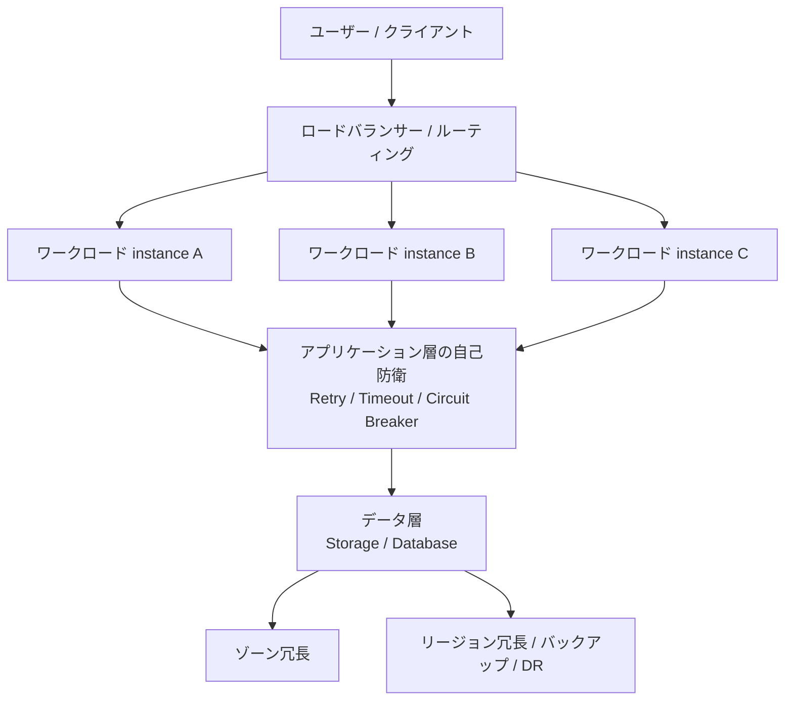
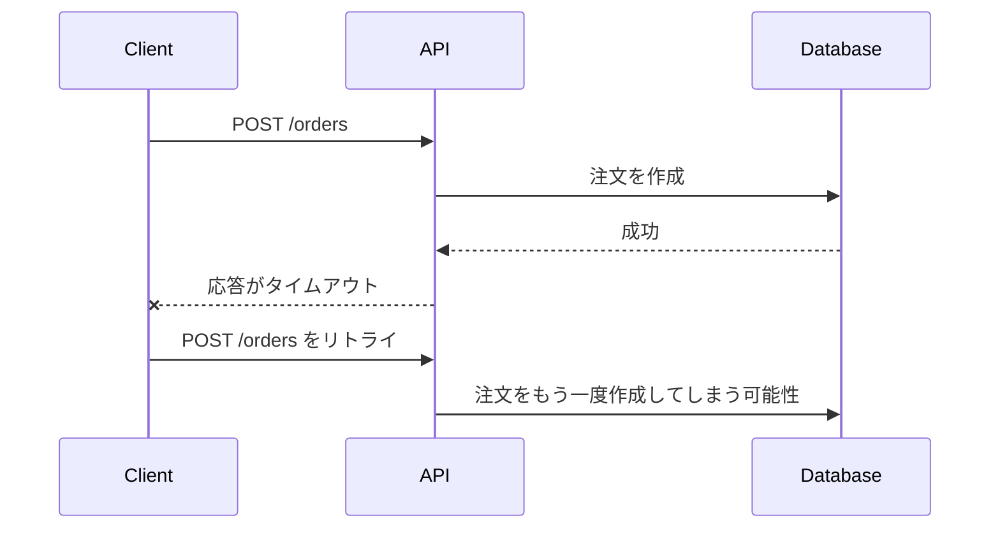
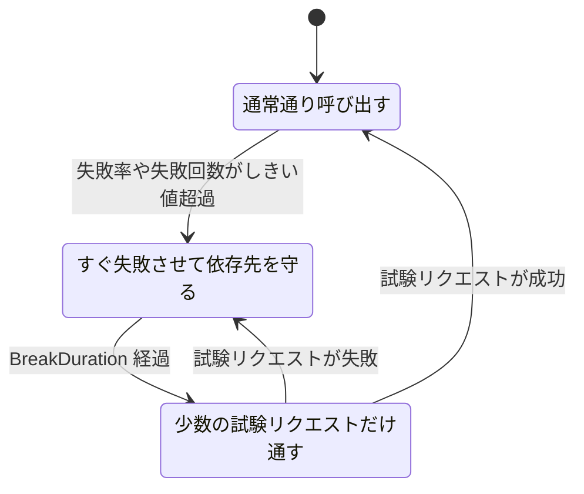
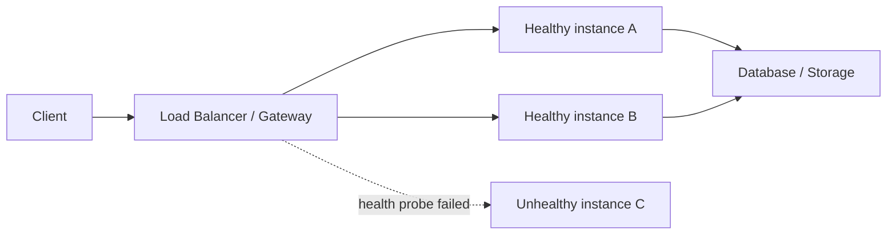

## はじめに

クラウド設計の話をしていると、Resiliency、Availability、Disaster Recovery、Redundancy という言葉がよく出てきます。どれも「止まりにくいシステム」を連想させるので、なんとなく同じ意味で使ってしまいがちです。

でも、私はここを混ぜてしまうと設計がかなり危うくなると感じています。Resiliency は単に「落ちないこと」ではなく、**障害が起きる前提で、どこで受け止め、どこで逃がし、どこまで復旧するかを決める設計姿勢**に近い言葉だと思っています☁️

この記事では、クラウドにおける Resiliency を 3 層で整理します。最初に、アプリケーション層のリトライとサーキットブレーカーを扱います。次に、コンピューティング / ワークロードの冗長性とロードバランサーによる切り替えを見ていきます。最後に、ストレージ / データベースの冗長性と地理的分散を説明します。

Microsoft の [Azure Well-Architected Framework の Reliability design principles](https://learn.microsoft.com/azure/well-architected/reliability/principles?WT.mc_id=DT-MVP-5004827) でも、信頼性のあるワークロードは障害を生き残り、意図した機能を継続的に提供する必要があると説明されています。今回はこの考え方を、実装とインフラの両方から噛み砕いていきます🔍

Azure や .NET で API / ワークロードを設計する人や、設計レビューで回復性を確認する人を主な読者として想定しています。

## 今回のゴール / 本記事の目的

本記事では、Resiliency と Availability / Disaster Recovery / Redundancy の違いを整理し、リトライ、指数バックオフ、ジッター、idempotency（冪等性）の関係を説明します。さらに、サーキットブレーカーの Closed / Open / Half-Open を状態として捉え、ワークロード冗長化とロードバランサーの役割を分けて考えます。最後に、RTO（Recovery Time Objective） / RPO（Recovery Point Objective）、ゾーン冗長、リージョン冗長をデータ層の設計に結びつけます。

「Resiliency 対応済みです」と言う前に、どの層で何を守っているのかを言語化できる状態を目指します。次に、この記事で想定する前提をそろえます🧭

## 前提条件

Azure を例に説明しますが、考え方そのものはクラウド一般に寄せています。.NET / C# のコード例では `HttpClient` と `Microsoft.Extensions.Http.Resilience` を使い、ASP.NET Core / Generic Host 系のアプリを想定します。Container Apps については、サービス間通信の resiliency policy を示すために Bicep の概念例を使います。特定の Azure サービス構成をそのまま本番投入する手順ではなく、設計観点の整理を目的としています。なお、公式ドキュメントの記述もサービスや SKU（サービスの価格・性能レベル）によって条件が変わるため、実際の設計では利用サービスごとの Reliability guide（信頼性ガイド）を確認してください。

では、まず Resiliency の意味とこの記事での捉え方を確認してから、似た言葉を整理します。

## 背景 / Resiliency は「壊れ方を設計すること」

私の中での Resiliency の核は、**障害をゼロにすることではなく、障害が起きたときの壊れ方を制御すること**です。

クラウドは分散システムです。ネットワークの瞬断、依存先 API（Application Programming Interface）の一時的な遅延、仮想マシンやコンテナーの再配置、ゾーン障害、リージョン障害、ストレージ障害、人的ミスなど、失敗モードはたくさんあります。ここで「全部落ちないようにする」と考えると、コストも複雑性も一気に膨らみます。

Azure Well-Architected Framework では、Reliability の文脈で resilient、recoverable、available を分けて説明しています。特に resilient は「faults（障害）を検出し、耐え、動作を継続する」方向です。recoverable は「合意した復旧目標内に戻す」方向、available は「約束した時間と品質でユーザーがアクセスできる」方向の話として整理されています。

つまり Resiliency は、単体の機能名ではありません。アプリケーションコード、インフラ、データ、運用のそれぞれで、どの障害をどの範囲に閉じ込めるかを決める設計活動です。ここを押さえたうえで、似た言葉を文章で整理します📚

## Resiliency / Availability / Disaster Recovery / Redundancy の違い

まずは言葉を分けます。厳密な訳語よりも、設計で何を判断するための言葉かに寄せて整理します。

Resiliency は、障害が起きても全体への影響を抑え、動き続ける力です。設計では、障害の検知や分離、リトライ、タイムアウト、縮退運転、自己防衛などを考えます。

Availability は、ユーザーが期待する時間と品質でサービスを使える度合いです。SLA（Service Level Agreement）や SLO（Service Level Objective）、正常系の継続、ヘルスチェック、切り替え時間などが関係します。

Disaster Recovery は、大きな障害の後に、合意した目標内で復旧する計画です。RTO、RPO、バックアップ、フェールオーバー、手順書、訓練などを含みます。

Redundancy は、同じ役割を果たせるものを複数用意することです。複数インスタンス、複数ゾーン、複数リージョン、データ複製などが代表例です。

ここでの整理は、Microsoft Learn の Reliability、Business Continuity / High Availability / Disaster Recovery、Availability Zones、Storage redundancy に関する説明を、この記事の目的に合わせて要約したものです。

ここで大事なのは、**Redundancy は Resiliency の手段の 1 つであって、Resiliency そのものではない**という点です。たとえば、仮想マシン（VM）を 3 台に増やしても、すべて同じゾーンにいて、同じデータベースに同期的に依存しているとします。さらにクライアントが無限リトライしていたら、障害時のふるまいはかなり危ういままです。

Microsoft の [What are business continuity, high availability, and disaster recovery?](https://learn.microsoft.com/azure/reliability/concept-business-continuity-high-availability-disaster-recovery?WT.mc_id=DT-MVP-5004827) では、Business Continuity、High Availability、Disaster Recovery の関係が整理されています。この記事でも同じく、「止めない工夫」と「止まった後に戻す工夫」を混ぜすぎないようにします。

次は Resiliency を 3 層に分けて見ていきます。



以降では、Resiliency を中心に置きます。Availability は主にワークロード層、Disaster Recovery と RTO / RPO は主にデータ層、Redundancy は各層にまたがる手段として扱います。図では利用者からデータまでの呼び出し経路を示していますが、本文では自己防衛の粒度が細かい順に、アプリケーション、ワークロード、データの層で考えていきます🧩

## Layer 1: アプリケーション層のリトライとサーキットブレーカー

最初の層は、アプリケーションコードです。ここで扱う代表的なパターンがリトライとサーキットブレーカーです。ここでのコード例は Resiliency 全体のうち、アプリケーション層の自己防衛を具体化するためのものです。インフラ層やデータ層の設計を置き換えるものではありません。

Azure Architecture Center の [Retry pattern](https://learn.microsoft.com/azure/architecture/patterns/retry?WT.mc_id=DT-MVP-5004827) では、クラウド上の一時的なネットワーク切断、サービスの一時的な利用不可、タイムアウトなどを transient faults（一時的障害）として扱い、適切な遅延の後に再試行する考え方が説明されています。

一方で、リトライは「やればやるほど安全」ではありません。むしろ雑なリトライは、障害中の依存先にさらに負荷をかけ、復旧を遅らせることがあります。まずはリトライを設計するうえでの観点を整理します。

### リトライは transient faults のために使う

リトライしてよいのは、基本的には「時間を置けば成功する可能性がある失敗」です。たとえば、タイムアウトや `429 Too Many Requests`、一時的な `503 Service Unavailable` であれば、指数バックオフとジッターを組み合わせて再試行する余地があります。

一方、依存先の性能低下や断続的な `500` のように原因を判断しにくい場合は、最大回数やタイムアウトを設定し、サーキットブレーカーも組み合わせます。入力値エラー、認可エラー、ビジネスルール違反のように時間を置いても解決しない失敗は、リトライせずに失敗として返し、ユーザーに修正を促します。

Azure Architecture Center の [Best practices for transient fault handling](https://learn.microsoft.com/azure/architecture/best-practices/transient-faults?WT.mc_id=DT-MVP-5004827) でも、リトライ回数や間隔をユースケースに合わせて最適化することが重要だと説明されています。少なすぎると一時障害から回復できず、多すぎるとスレッド、接続、メモリなどを長く保持してしまいます。

ここでよく出てくるのが、指数バックオフとジッターです。指数バックオフは、失敗するたびに待ち時間を指数的に増やす方法で、最大遅延や最大試行回数も設けます。ジッターは待ち時間にランダム性を加え、複数クライアントの再試行タイミングをずらす方法です。さらに、永遠に待たないよう最大試行回数を決め、リトライを含めた合計時間がユーザー体験を壊さないよう全体タイムアウトも設定します。

リトライは「成功率を少し上げる」ための道具であって、「依存先の過負荷を根本解決する」道具ではありません。ここを間違えないことが大事です⚠️

### リトライの危険: 重複実行と idempotency

リトライで一番怖いのは、**サーバー側では処理が成功していたのに、クライアントが応答を受け取れず、同じ操作をもう一度送ってしまう**ケースです。

たとえば次のような流れです。



このとき、操作が idempotent（冪等）であれば、同じリクエストを複数回受けても結果を同じにできます。たとえばアプリケーション独自の `Idempotency-Key` のようなキーを受け取り、同じキーの注文作成は 1 回だけ処理する、という設計です。ここで示すヘッダー名は一例であり、API の契約として採用する場合はクライアントとサーバーで仕様を決めます。

```csharp
app.MapPost("/orders", async (
    HttpRequest request,
    OrderRequest order,
    IOrderService orders) =>
{
    if (!request.Headers.TryGetValue("Idempotency-Key", out var key))
    {
        return Results.BadRequest("Idempotency-Key header is required.");
    }

    var result = await orders.CreateOnceAsync(order, key.ToString());
    return Results.Created($"/orders/{result.OrderId}", result);
});
```

もちろん、上のコードは概念を示すための最小例です。実際には、idempotency key と処理結果を永続化します。同時実行時にも二重作成されないように、一意制約やトランザクション境界を含めて設計する必要があります。

Azure Architecture Center の Retry pattern でも、idempotent ではない操作を再試行すると、意図しない副作用が起きる可能性があると説明されています。リトライはアプリケーションの意味論とセットで考える必要があります。

### .NET で `AddStandardResilienceHandler` を使う

.NET では、`Microsoft.Extensions.Http.Resilience` を使うと `HttpClient` にリトライ、タイムアウト、サーキットブレーカーなどを組み込めます。2026 年 9 月時点の .NET 10 向け公式ドキュメント [Build resilient HTTP apps: Key development patterns](https://learn.microsoft.com/dotnet/core/resilience/http-resilience?WT.mc_id=DT-MVP-5004827) では、`AddStandardResilienceHandler` と `AddResilienceHandler` の使い方が紹介されています。

まずはパッケージを追加します。

```powershell
dotnet add package Microsoft.Extensions.Http.Resilience
```

標準的な HTTP resiliency を使うだけなら、次のように `AddStandardResilienceHandler` を追加できます。

```csharp
using Microsoft.Extensions.Http.Resilience;
using Polly;

var builder = WebApplication.CreateBuilder(args);

builder.Services.AddHttpClient("catalog-api", client =>
{
    client.BaseAddress = new Uri("https://api.example.com");
})
.AddStandardResilienceHandler(options =>
{
    // POST / PATCH / PUT / DELETE / CONNECT への自動リトライを避ける。
    // 公式 API ドキュメントでは、これらのメソッドを unsafe HTTP methods として扱っています。
    options.Retry.DisableForUnsafeHttpMethods();

    options.Retry.MaxRetryAttempts = 3;
    options.Retry.BackoffType = DelayBackoffType.Exponential;
    options.Retry.UseJitter = true;
});
```

公式ドキュメントでは、標準の resilience handler は、レート制限、合計タイムアウト、リトライ、サーキットブレーカー、試行単位のタイムアウトという 5 つの戦略を重ねたパイプラインとして説明されています。既定のリトライは最大 3 回で、指数バックオフとジッターが有効です。サーバーエラー（500 以上）、408、429 などを対象にします。また、既定ではすべての HTTP メソッドに対してリトライが構成されるため、POST によるデータ作成などでは重複が起きる可能性があります。

そのため、書き込み系 API を呼ぶ `HttpClient` では、[DisableForUnsafeHttpMethods](https://learn.microsoft.com/dotnet/api/microsoft.extensions.http.resilience.httpretrystrategyoptionsextensions.disableforunsafehttpmethods?view=net-10.0&WT.mc_id=DT-MVP-5004827) のような API で unsafe HTTP methods（安全でない HTTP メソッド）の自動リトライを避けるのがより安全です。

:::message alert
「POST だから絶対にリトライ禁止」「GET だから絶対に安全」と機械的に決めるのも危険です。HTTP メソッドの意味論に加えて、対象 API が本当に冪等に作られているか、重複実行しても業務的に問題ないかを確認してください。
:::

標準構成で足りる場合はここまでで十分です。依存先 API ごとにリトライ条件やサーキットブレーカーのしきい値を変えたい場合は、`AddResilienceHandler` で独自のパイプラインを明示的に組み立てます。たとえば読み取り系 API 専用のクライアントでは、次のように構成できます。

```csharp
using Microsoft.Extensions.Http.Resilience;
using Polly;

builder.Services.AddHttpClient("read-model-api", client =>
{
    client.BaseAddress = new Uri("https://read-api.example.com");
})
.AddResilienceHandler("read-model-pipeline", static pipeline =>
{
    pipeline.AddRetry(new HttpRetryStrategyOptions
    {
        MaxRetryAttempts = 3,
        BackoffType = DelayBackoffType.Exponential,
        UseJitter = true
    });

    pipeline.AddCircuitBreaker(new HttpCircuitBreakerStrategyOptions
    {
        SamplingDuration = TimeSpan.FromSeconds(30),
        FailureRatio = 0.1,
        MinimumThroughput = 50,
        BreakDuration = TimeSpan.FromSeconds(10)
    });

    pipeline.AddTimeout(TimeSpan.FromSeconds(5));
});
```

この例も、実際には対象 API の性質に合わせて `ShouldHandle`、タイムアウト、対象ステータスコード、ログ、メトリクスを調整します。特に書き込み操作を含むクライアントにそのまま適用しないように注意してください。

### サーキットブレーカーは「諦める設計」

リトライが「もう一度試す」ためのパターンなら、サーキットブレーカーは「今は試さない」ためのパターンです。

Azure Architecture Center の [Circuit Breaker pattern](https://learn.microsoft.com/azure/architecture/patterns/circuit-breaker?WT.mc_id=DT-MVP-5004827) では、失敗がしきい値に達した後、失敗しそうな操作を繰り返し呼び出す代わりに、一時的にアクセスをブロックするパターンとして説明されています。これは依存先に回復時間を与え、呼び出し元の待ち時間やリソース消費を抑えるための自己防衛です。

状態は大きく 3 つです。Closed では通常通り依存先を呼び出しながら、失敗数や失敗率を監視します。失敗がしきい値を超えると Open になり、呼び出しを即座に失敗させて依存先と呼び出し元を保護します。一定時間が経過すると Half-Open に移り、少数のリクエストだけを試して、依存先が回復したかを段階的に確認します。



リトライとサーキットブレーカーは、よく一緒に使われます。ただし、順番とパラメーターを間違えると「何度もリトライした後に、さらに別の層でもリトライする」ような多重リトライになり、障害時の負荷を増やします。

アプリケーション層の Resiliency は、あくまで一時的な失敗を吸収し、依存先障害の影響を広げないためのものです。ここからは、アプリケーションコードだけではなく、プラットフォームや呼び出し経路をまたぐリトライ設計を見ていきます。

## 横断: 多重リトライを避ける設計

アプリケーションコード、プラットフォーム、クライアントから DB までの各層が、それぞれ独立してリトライを行うと、試行回数や待ち時間が増幅します。まずは Azure Container Apps の例から見ていきます。

### Container Apps のサービス間通信で考えること

Azure Container Apps には、アプリケーションコードの外側でサービス間通信を保護する仕組みがあります。Microsoft Learn の [Service discovery resiliency](https://learn.microsoft.com/azure/container-apps/service-discovery-resiliency?WT.mc_id=DT-MVP-5004827) では、Container Apps のサービスディスカバリーを通じた HTTP / TCP 通信に対して、タイムアウト、リトライ、サーキットブレーカー、コネクションプールを設定できます。この機能は現在プレビューで、1 つの Container App に適用できるポリシーは 1 つです。また、ポリシーは「その Container App に入ってくるリクエスト」に適用されるため、そのアプリから外向きに送るリクエストへ自動的に適用されるわけではありません。Dapr Service Invocation API で行うリクエストも対象外です。

たとえば、Container Apps のサービスディスカバリーに次のような HTTP リトライを設定できます。

```bicep
resource resiliencyPolicy 'Microsoft.App/containerApps/resiliencyPolicies@2023-11-02-preview' = {
  name: 'catalog-resiliency'
  parent: catalogApp
  properties: {
    timeoutPolicy: {
      connectionTimeoutInSeconds: 5
      responseTimeoutInSeconds: 15
    }
    httpRetryPolicy: {
      maxRetries: 3
      retryBackOff: {
        initialDelayInMilliseconds: 1000
        maxIntervalInMilliseconds: 10000
      }
      matches: {
        errors: [
          '5xx'
          'connect-failure'
          'reset'
        ]
      }
    }
    circuitBreakerPolicy: {
      consecutiveErrors: 5
      intervalInSeconds: 10
      maxEjectionPercent: 50
    }
  }
}
```

この設定を使う場合、呼び出し元のコードにも同じリトライを無条件に設定してよいとは限りません。たとえば、呼び出し元の `HttpClient` が初回送信に加えて 3 回リトライし、Container Apps 側も初回リクエストに加えて 3 回リトライするとします。このとき、単純化した上限は 4 × 4 回となり、1 回の論理的な呼び出しが最大 16 回の通信に膨らむ可能性があります。実際の回数は、どの層が接続失敗や HTTP ステータスをリトライ対象とするか、タイムアウトがどの層で先に発生するかによって変わりますが、**リトライを各層で足し合わせるのではなく、掛け合わせて考える**ことが重要です。

重複を避けるには、まずリトライの責任範囲を決めます。Container Apps 内のサービス間通信で、プラットフォーム側に対象ステータス、バックオフ、サーキットブレーカーを集約するなら、呼び出し元のコードは短いタイムアウトと明確なエラー処理にとどめる方法があります。反対に、業務上の idempotency key、ユーザーへのフォールバック、レスポンス内容に応じた判断など、アプリケーションだけが知っている条件で再試行する必要がある場合は、コード側を主体にし、Container Apps 側の自動リトライを限定的にします。

特に `POST` のような副作用を持つ操作では、Container Apps 側のリトライとコード側のリトライの両方を有効にすると、重複登録のリスクがさらに高まります。再試行する可能性がある層を 1 つに絞るか、少なくとも両方の層で冪等性を保証し、タイムアウト、最大試行回数、対象エラー、バックオフの合計時間を一緒に設計してください。プラットフォーム側のリトライは、アプリケーション側のリトライを見えなくすることもあるため、Container Apps の resiliency メトリクスやシステムログを使って実際の再試行回数を観測することも必要です。

なお、Container Apps のリビジョン、レプリカ、Readiness probe は、サービス間リクエストを再送する仕組みとは役割が異なります。Microsoft Learn の [Health probes in Azure Container Apps](https://learn.microsoft.com/azure/container-apps/health-probes?WT.mc_id=DT-MVP-5004827) にある Readiness probe は、リクエストを受け付けられるレプリカかどうかを判定します。[Update and deploy changes in Azure Container Apps](https://learn.microsoft.com/azure/container-apps/revisions?WT.mc_id=DT-MVP-5004827) で説明されているリビジョンの切り替えやトラフィック分割は、デプロイ時の切り替えや段階的リリースを扱う機能です。これらは、失敗した HTTP 操作を同じリクエストとして再送するリトライとは分けて考えます。

### クライアント、API、DBのリトライが重なる場合

Container Apps のようなプラットフォーム機能を使わなくても、クライアントから API、API から DB という呼び出しの各段階にリトライを実装すると、同じ問題が起こります。

たとえば、クライアントが API に対して初回送信に加えて 3 回リトライし、API も DB に対して初回実行に加えて 3 回リトライするとします。クライアントから見ると API の試行回数は 4 回です。API はその 4 回のリクエストをそれぞれ処理するため、DB への試行回数は単純化すると 4 × 4 で最大 16 回になります。クライアント、API、DB の 3 層すべてで「初回 + 3 回リトライ」とすると、最下層への試行回数は最大 64 回まで膨らみます。

ここで注意したいのは、API が DB への処理を失敗として返した場合だけでなく、DB では処理が成功していたのに API が応答を返せなかった場合にも、クライアントが API 全体を再実行することです。たとえば、API が DB に注文を登録した直後にタイムアウトすると、クライアントは「登録に失敗した」と判断して同じ API を再度呼び出す可能性があります。API 側の DB リトライと、クライアント側の API リトライが重なると、DB に同じ副作用を持つ処理が繰り返し届きます。

また、リトライ回数だけでなく待ち時間も累積します。API の DB リトライが長時間待機した後にタイムアウトし、その後クライアントが API を再試行すると、クライアントのタイムアウトまで API が処理を占有し続けることがあります。各層が個別に「最大 30 秒」と設定していると、エンドツーエンドでは 30 秒を超えるだけでなく、外側のリトライによってさらに処理時間が延びます。ユーザーのリクエスト期限を各層で共有しなければ、既に期限切れの処理を内側の層が続ける状態にもなります。

この問題を避けるため、まず「どの失敗をどの層が再試行するか」を決めます。クライアントはネットワーク断や API の一時的な `503` など、API への通信に関する短いリトライを担当します。API は DB 接続の一時的な切断や、DB が明示的に再試行可能と判断したエラーだけを担当します。クライアントが API の内部事情を知らないまま DB の失敗を含む処理全体を何度も再実行する場合は、外側のリトライ回数を少なくするか、リクエストの期限を超えたら再試行しないようにします。

内側と外側の両方でリトライする場合は、次の点を共有して設計します。リクエスト全体の deadline（処理期限）を API と DB 呼び出しへ伝播させ、残り時間が少なければ内側のリトライを打ち切ります。各層で最大試行回数と最大遅延を別々に決めるだけでなく、エンドツーエンドのリトライ予算を決めます。さらに、同じ障害に対するリトライを各層で同時に開始しないよう、バックオフとジッターを設定します。リトライ対象は一時的な接続エラーや明示的なレート制限などに限定し、入力エラーや認可エラーまで再試行しないことも重要です。

副作用を持つ DB 操作では、リトライ回数を減らすだけでは十分ではありません。注文登録や決済のような処理では、クライアント、API、DB のどの層から再実行されても二重処理にならないよう、idempotency key、DB の一意制約、トランザクション、処理結果の保存などを組み合わせます。成功したか分からない状態を「失敗」と同じように扱わず、処理状態を照会してから再実行する設計も必要です。

実務では、内側の DB リトライを DB クライアントや API のデータアクセス層に集約し、API の外側では短いタイムアウトと少数回のリトライにとどめる構成が扱いやすいことがあります。ただし、DB クライアントがすでに自動リトライを行っている場合は、API のデータアクセス層でさらに同じリトライを重ねないようにします。どの層が何回再試行したのかをログやメトリクスに残し、論理リクエスト ID と idempotency key で追跡できるようにすると、障害時に実際の試行回数を確認できます。

## Layer 2: コンピューティング / ワークロードの冗長性とロードバランサー

アプリケーションコードでいくらリトライを丁寧に書いても、実行しているインスタンスが 1 台だけなら、その 1 台の障害でサービスは止まります。たとえば仮想マシン（VM）を 3 台に増やしても、同じ障害ドメインに集中していれば、守れる障害の範囲は限られます。そこで必要になるのが、コンピューティング / ワークロード層の冗長性です。

基本形はシンプルです。



Azure の [Reliability in Azure Load Balancer](https://learn.microsoft.com/azure/reliability/reliability-load-balancer?WT.mc_id=DT-MVP-5004827) では、Load Balancer は正常なインスタンスに受信要求を分散する Layer 4 のロードバランシングサービスとして説明されています。また、Load Balancer の構成要素として front-end IP、back-end pool、load-balancing rules、health probes が挙げられています。

ここでの役割分担を文章で整理します。複数インスタンスを用意すると、1 台の障害が全体停止につながりにくくなりますが、ステートレス化やセッションの外出しが必要です。Health probe はインスタンスが要求を受け付けられる状態かを確認します。設定が厳しすぎると誤検知を招き、緩すぎると切り替えが遅れます。

Load balancer は正常なインスタンスへ要求を振り分けますが、データを複製するものではないため、バックエンド側の設計が別に必要です。Global routing はリージョン間の切り替えや近接ルーティングを担いますが、DNS TTL（Time To Live）、anycast、Azure Front Door など、方式ごとの差を理解しなければなりません。

ロードバランサーは魔法の箱ではありません。Load Balancer の Reliability guide でも、全体の信頼性はバックエンドインスタンスの可用性構成に依存すると説明されています。つまり、ロードバランサーだけを zone-redundant（ゾーン冗長）にしても、バックエンド VM が全部同じゾーンにあるなら、そのゾーン障害でアプリは落ちます。

:::message
ワークロード層の Resiliency では、「ロードバランサーがあるか」よりも「正常な逃げ先が本当にあるか」を確認するのが大事です。逃げ先がなければ、どれだけ賢いルーティングをしても切り替え先がありません。
:::

### Active-Active と Active-Passive

冗長化の構成は、大きく Active-Active と Active-Passive に分けられます。Active-Active は複数インスタンスや複数拠点が普段から処理を受ける方式で、高可用性、スケールアウト、切り替え時間の短縮に向いています。Active-Passive は通常は片系だけが処理し、障害時に待機系へ切り替える方式です。コストを抑えたい場合や、状態管理が複雑な場合、DR（Disaster Recovery）用途で使われます。

Active-Active は可用性を高めやすい一方で、データ整合性、セッション、キャッシュ、ジョブの二重実行などを考える必要があります。Active-Passive は普段のコストを抑えやすい一方で、切り替え手順、待機系の鮮度、定期訓練が重要になります。

どちらが正解というより、**守りたいユーザーフローと RTO / RPO（復旧時間とデータ損失の許容範囲）に合っているか**で判断するのが現実的です。次は、その RTO / RPO が特に重要になるデータ層を見ていきます💾

## Layer 3: ストレージ / データベースの冗長性・地理的分散

最後の層は、ストレージとデータベースです。ここは Resiliency の中でも特に慎重に扱う必要があります。なぜなら、アプリケーションやコンピューティングリソースは作り直せても、**失ったデータは簡単には戻らない**からです。

Azure Storage の [Azure Storage redundancy](https://learn.microsoft.com/azure/storage/common/storage-redundancy?WT.mc_id=DT-MVP-5004827) では、Azure Storage は計画済み / 計画外イベントからデータを保護するため、常にデータの複数コピーを保存すると説明されています。一方で、どの冗長化を選ぶかは、コスト、可用性、パフォーマンス、耐久性のトレードオフです。

代表的な冗長化を文章で整理します。LRS（Locally Redundant Storage）は、1 つのリージョン内にある単一データセンター相当の範囲で複製する方式で、低コストで要件が限定的なデータに向いています。ZRS（Zone-Redundant Storage）は、1 つのリージョン内にある複数の Availability Zones（可用性ゾーン）へ複製し、ゾーン障害に備えたい本番データに向いています。

GRS（Geo-Redundant Storage）と RA-GRS（Read-Access Geo-Redundant Storage）は、セカンダリリージョンへ非同期に複製する方式です。GZRS（Geo-Zone-Redundant Storage）と RA-GZRS（Read-Access Geo-Zone-Redundant Storage）は、プライマリリージョンではゾーン冗長を行い、さらに別リージョンへ複製します。ゾーン障害とリージョン障害の両方を意識するデータで検討します。

ここで重要なのは、地理的分散が入ると、多くの場合、**非同期レプリケーション** や **フェールオーバー手順** の話が出てくることです。つまり「別リージョンにコピーがある」ことと、「業務をデータ損失なしに即時継続できる」ことは同じではありません。

Azure Storage の [Use geo-redundancy to design highly available applications](https://learn.microsoft.com/azure/storage/common/geo-redundant-design?WT.mc_id=DT-MVP-5004827) でも、geo-redundant replication を構成したストレージアカウントはセカンダリリージョンへ非同期にレプリケートされると説明されています。非同期である以上、最後に書いたデータがどこまで複製済みかを設計で考える必要があります。

### RTO と RPO

データ層の話では、RTO と RPO を避けて通れません。RTO（Recovery Time Objective）は、障害後にどれくらいの時間で復旧する必要があるかを表し、「何分、何時間止まってよいか」という問いにつながります。RPO（Recovery Point Objective）は、障害時にどれくらいのデータ損失を許容できるかを表し、「何秒、何分、何時間分のデータを失ってよいか」という問いにつながります。

Azure SQL Database の [Business continuity in Azure SQL Database](https://learn.microsoft.com/azure/azure-sql/database/business-continuity-high-availability-disaster-recover-hadr-overview?view=azuresql&WT.mc_id=DT-MVP-5004827) では、RTO は「予期しない中断後にアプリケーションが完全復旧するまでの時間」、RPO は「許容できるデータ損失量」と説明されています。また、Azure SQL Database の例として、zone redundancy、failover groups / active geo-replication、geo-restore で RTO / RPO の目安が異なることも示されています。

ただし、ここで触れている目安は **Azure SQL Database の特定機能に関するもの**です。すべてのデータベースやすべてのアーキテクチャにそのまま当てはめるものではありません。自分のシステムでは、利用するサービス、SKU、リージョン、構成、アプリケーションの再接続実装まで含めて確認する必要があります。

### ゾーン冗長とリージョン冗長の違い

Azure の [What are availability zones?](https://learn.microsoft.com/azure/reliability/availability-zones-overview?WT.mc_id=DT-MVP-5004827) では、Availability Zones は 1 つのリージョン内にある、独立した電源、冷却、ネットワークを持つデータセンター群として説明されています。

ゾーン冗長とリージョン冗長は、守る障害の大きさが違います。ゾーン冗長は同一リージョン内の複数ゾーンを使い、データセンターやゾーンの障害に備えます。リージョン冗長は地理的に離れた複数リージョンを使い、リージョン全体の障害に備えます。

ゾーン冗長はリージョン間の距離による影響がないため、比較的低いレイテンシにしやすい一方、リージョン障害には対応できません。サービスによってはフェールオーバーが自動化され、同期複製を選べる場合もあります。リージョン冗長では、リージョン間距離の影響を受け、手動またはサービス固有のフェールオーバーが必要になることがあります。また、非同期複製になることが多いため、RPO を確認しなければなりません。

[Architecture strategies for using availability zones and regions](https://learn.microsoft.com/azure/well-architected/design-guides/regions-availability-zones?WT.mc_id=DT-MVP-5004827) でも、ゾーンやリージョンをまたぐ構成は信頼性、コスト、パフォーマンス、運用性に影響すると説明されています。特にリージョン障害への対応は、単にリソースを複製するだけでなく、復旧手順、IaC（Infrastructure as Code）、DNS / ルーティング、監視、訓練まで含めて考える必要があります。

データ層は「コピーがあるか」ではなく、「どの時点のデータを、どのくらいの時間で、どの手順で業務に戻せるか」が問われる層です。ここまでの 3 層を整理すると、Layer 1 は一時障害への自己防衛、Layer 2 は実行基盤の逃げ先、Layer 3 はデータ復旧目標を決める層です。3 層を踏まえて、設計時の注意点をまとめます🧪

## 設計時の注意点

Resiliency 設計では、技術要素を足す前に問いを立てるのが大切です。Azure Well-Architected Framework の Reliability でも、ビジネス要件、障害点、critical path（重要経路）、運用、復旧計画を明確にすることが重視されています。

私は、まず Critical user flow（重要なユーザーフロー）のうち、どれを優先して守るのかを確認したいです。依存先が落ちたときには、どの機能を諦めてどの機能を残すのか、縮退運転の方針も決めます。

リトライについては、何回、何秒まで、どのステータスだけ再試行するのかという「リトライ予算」を定めます。サーキットブレーカーについては、どの失敗率で Open にし、どのくらいで Half-Open に戻すのかを決めます。

さらに、インスタンス、ゾーン、リージョン、依存サービスのどこまでを冗長化するのか、バックアップ、PITR（Point-in-Time Restore）、論理削除、人為ミス対策があるのかを確認します。ビジネスが許容する停止時間とデータ損失を RTO / RPO として明文化し、障害時にどの層で止まっているかを把握できる Observability（可観測性）も整えます。最後に、フェールオーバー、復元、縮退運転を定期的に訓練します。

:::message alert
「冗長化したので大丈夫です」は、Resiliency 設計としては少し足りません。どの障害に対して、どの層が、どの時間内に、どのデータ状態で復旧するのかまで説明できると、ようやく設計として扱いやすくなります。
:::

また、Resiliency を高めるほど、コスト、レイテンシ、整合性、運用複雑性は増えがちです。すべてを最高レベルにするのではなく、ビジネス要件に照らして「ここは強くする」「ここは縮退でよい」「ここは復旧に時間がかかってよい」と判断するのが現実的です。

最後に、この記事の要点をまとめます。

## まとめ / おわりに

今回は、「そもそもクラウドにおける Resiliency とはなんなのか？」を、アプリケーション、ワークロード、データの 3 層で整理しました。

私の理解では、Resiliency は **障害をなくすことではなく、障害が起きる前提で影響範囲と復旧の仕方を設計すること**です。

アプリケーション層では、リトライ、タイムアウト、サーキットブレーカーで一時障害を吸収し、依存先を守ります。ワークロード層では、複数インスタンス、ヘルスチェック、ロードバランサーで単一障害点を減らします。データ層では、ゾーン冗長、リージョン冗長、バックアップ、RTO / RPO によって復旧目標を具体化します。

Availability、Disaster Recovery、Redundancy はどれも重要ですが、Resiliency と同義ではありません。それぞれの言葉が何を守るためのものかを分けておくと、設計レビューや障害訓練で会話がしやすくなります。また、リトライや冗長化を入れるだけでなく、監視で状態を見えるようにし、フェールオーバーや復元を定期的に試すことまで含めて Resiliency と考える必要があります。

Container Apps のようなプラットフォーム側の resiliency policy は、アプリケーションコードのリトライを単純に置き換えるものではありません。クライアント、API、DB、プラットフォームのどこが再試行を担当するのかを決め、複数層のリトライによる試行回数、待ち時間、副作用の増幅を避ける必要があります。

「落ちないシステム」を目指すというより、**落ち方を小さくし、戻し方を決め、戻せることを確かめる**。クラウドの Resiliency は、その積み重ねなのだと思います☁️

## 参考にした主要一次情報

- [Reliability design principles - Azure Well-Architected Framework](https://learn.microsoft.com/azure/well-architected/reliability/principles?WT.mc_id=DT-MVP-5004827)
- [What are business continuity, high availability, and disaster recovery?](https://learn.microsoft.com/azure/reliability/concept-business-continuity-high-availability-disaster-recovery?WT.mc_id=DT-MVP-5004827)
- [Retry pattern - Azure Architecture Center](https://learn.microsoft.com/azure/architecture/patterns/retry?WT.mc_id=DT-MVP-5004827)
- [Best practices for transient fault handling - Azure Architecture Center](https://learn.microsoft.com/azure/architecture/best-practices/transient-faults?WT.mc_id=DT-MVP-5004827)
- [Circuit Breaker pattern - Azure Architecture Center](https://learn.microsoft.com/azure/architecture/patterns/circuit-breaker?WT.mc_id=DT-MVP-5004827)
- [Build resilient HTTP apps: Key development patterns - .NET](https://learn.microsoft.com/dotnet/core/resilience/http-resilience?WT.mc_id=DT-MVP-5004827)
- [DisableForUnsafeHttpMethods API reference - .NET](https://learn.microsoft.com/dotnet/api/microsoft.extensions.http.resilience.httpretrystrategyoptionsextensions.disableforunsafehttpmethods?view=net-10.0&WT.mc_id=DT-MVP-5004827)
- [Service discovery resiliency - Azure Container Apps](https://learn.microsoft.com/azure/container-apps/service-discovery-resiliency?WT.mc_id=DT-MVP-5004827)
- [Health probes in Azure Container Apps](https://learn.microsoft.com/azure/container-apps/health-probes?WT.mc_id=DT-MVP-5004827)
- [Update and deploy changes in Azure Container Apps](https://learn.microsoft.com/azure/container-apps/revisions?WT.mc_id=DT-MVP-5004827)
- [Reliability in Azure Load Balancer](https://learn.microsoft.com/azure/reliability/reliability-load-balancer?WT.mc_id=DT-MVP-5004827)
- [What are availability zones?](https://learn.microsoft.com/azure/reliability/availability-zones-overview?WT.mc_id=DT-MVP-5004827)
- [Architecture strategies for using availability zones and regions](https://learn.microsoft.com/azure/well-architected/design-guides/regions-availability-zones?WT.mc_id=DT-MVP-5004827)
- [Azure Storage redundancy](https://learn.microsoft.com/azure/storage/common/storage-redundancy?WT.mc_id=DT-MVP-5004827)
- [Use geo-redundancy to design highly available applications](https://learn.microsoft.com/azure/storage/common/geo-redundant-design?WT.mc_id=DT-MVP-5004827)
- [Business continuity in Azure SQL Database](https://learn.microsoft.com/azure/azure-sql/database/business-continuity-high-availability-disaster-recover-hadr-overview?view=azuresql&WT.mc_id=DT-MVP-5004827)

## 関連記事

- [Azure Cloud Adoption Framework（CAF）入門 〜導入戦略を中心に〜](https://zenn.dev/tomokusaba/articles/15a795d30bd0c8)
- [Azure Cloud Adoption Framework（CAF）入門 - 計画編](https://zenn.dev/tomokusaba/articles/b8590045af597c)
- [【2025年版】Azureコンピューティングリソースの選び方 - 私なりの決定木を作ってみた](https://zenn.dev/tomokusaba/articles/b0fc1bacf6a107)
