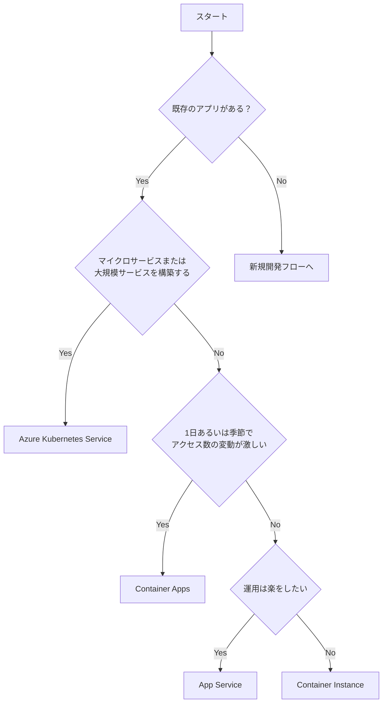
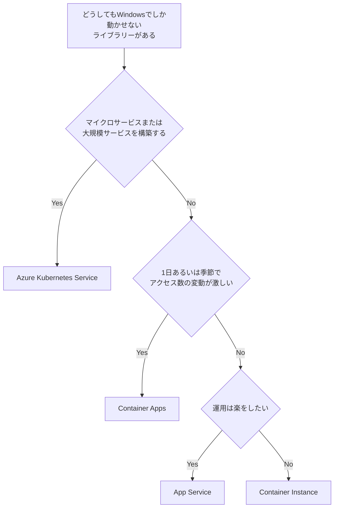
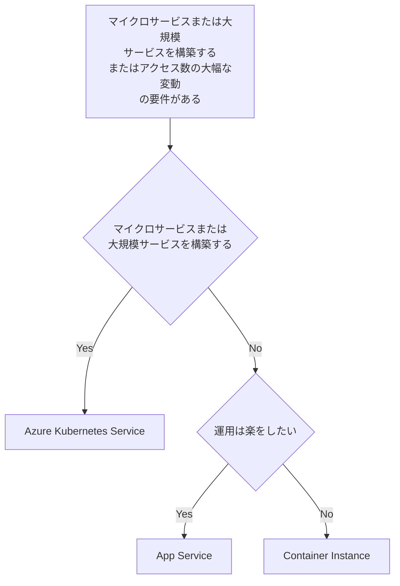
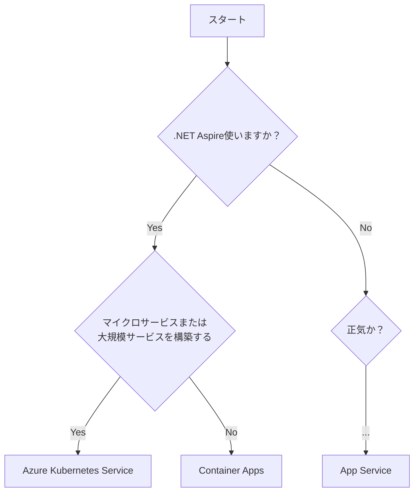

## はじめに 🌟

Azureには様々なコンピューティングリソースが存在します。新しいプロジェクトを始めるとき、「どのサービスを使えばいいの？」と迷った経験はありませんか？

今回は、その選定方法について私なりの視点でお話ししていこうと思います 🤔💭

## Microsoft Learn の有名なフロー 📋

Microsoft Learnには[コンピューティングリソースの決定木](https://learn.microsoft.com/ja-jp/azure/architecture/guide/technology-choices/compute-decision-tree)が公開されています。

しかし、このフローチャートには以下のような課題があります：

- 🕰️ **少し古い情報も含まれている** - Azure Container Apps の台頭など、最新のトレンドが十分に反映されていない
- 🏢 **ベンダーに縛られやすいリソースも含まれている** - Azure VMware Solution や Service Fabric など
- 📊 **選択肢が多すぎて迷ってしまう**
- 🏗️ **IaaS と PaaS/CaaS が混在している** - IaaS（Virtual Machines等）は [Cloud Adoption Framework (CAF)](https://learn.microsoft.com/ja-jp/azure/cloud-adoption-framework/) における移行戦略やコンプライアンス要件など、全く異なる動機で選択されることが多い

そこで今回は **PaaS / CaaS に絞って**、より実用的な決定フローを作成してみました！

:::message
**なぜ IaaS を除外するのか？** 🤔

IaaS（Azure Virtual Machines など）の選択は、以下のような CAF の文脈で検討されることが多いです：

- 🔄 **リフト＆シフト移行** - オンプレミスからの移行でアプリ改修なし
- 📋 **コンプライアンス要件** - 特定の OS やミドルウェアのバージョン固定が必要
- 🔧 **レガシーシステム** - モダナイズが困難な既存システム
- 🖥️ **特殊なハードウェア要件** - GPU、高メモリなど特定のスペックが必要

これらは「どのコンピューティングサービスが最適か」という技術的な比較ではなく、**ビジネス・移行戦略の文脈**で決まることがほとんどです。

本記事では、**新規開発や現代的なアプリケーション構築**を想定しているため、IaaS は考慮外としています。
:::

## 今回の候補サービス 🎯

今回比較対象とするサービスは以下の5つです：

| サービス | 概要 | 特徴 |
|---------|------|------|
| 🌐 **Azure App Service** | フルマネージドWebホスティング | シンプル、使いやすい |
| ☸️ **Azure Kubernetes Service (AKS)** | マネージドKubernetes | 最大の柔軟性、学習コスト高 |
| 📦 **Azure Container Apps** | サーバーレスコンテナ | Kubernetesベース、運用楽 |
| 🚢 **Azure Container Instances (ACI)** | シンプルなコンテナ実行 | 低レイヤー、単発タスク向け |
| ⚡ **Azure Functions** | サーバーレスFaaS | イベント駆動、コスト効率 |

:::message
**コンテナー多すぎ問題** 🤯

Azureのコンテナ関連サービス、正直多すぎますよね！AKS、ACA、ACI、Web App for Containers... 
それぞれの立ち位置を理解することが重要です。
:::

## 私なりの選定フロー 🔀

### 基本方針

まず最初に考えるべきは「**開発工数が潤沢にあって、何としてもやるぞという意欲に満ちあふれているか？**」です。

もしYesなら... **Azure Functions** を検討しましょう！⚡

Functions は素晴らしいサービスですが、以下の点を考慮する必要があります：

- ✅ イベント駆動アーキテクチャに最適
- ✅ コスト効率が非常に良い（従量課金）
- ✅ スケールが自動
- ⚠️ 独自の開発モデルへの理解が必要
- ⚠️ コールドスタートの考慮

### 既存アプリがある場合のフロー



### 新規開発（スケーラビリティ重視）の場合



### Windows依存がある場合



## ASP.NET Core 開発者向けフロー 🎯

.NET開発者の方は、さらにシンプルな判断基準があります：



:::message alert
**.NET Aspireを使わない選択肢について** 🤔

2025年現在、.NET 8 以降で新規開発するなら **.NET Aspire** の採用を強くお勧めします！

Aspire は以下のメリットを提供します：
- 📦 オーケストレーションの簡素化
- 🔍 分散トレーシングの統合
- 🚀 Azure Container Apps への簡単デプロイ（`azd up` 一発！）
- 🛠️ ローカル開発体験の向上
:::

## 各サービスの詳細比較 📊

### コントロール vs 使いやすさのトレードオフ

Microsoft の公式ドキュメントでも言及されていますが、各サービスには**コントロールと使いやすさのトレードオフ**があります。

| サービス | コントロール | 使いやすさ | 運用負荷 |
|---------|-------------|-----------|---------|
| AKS | ⭐⭐⭐⭐⭐ | ⭐⭐ | 高 |
| Container Apps | ⭐⭐⭐ | ⭐⭐⭐⭐ | 低 |
| App Service | ⭐⭐ | ⭐⭐⭐⭐⭐ | 最低 |
| ACI | ⭐⭐⭐ | ⭐⭐⭐ | 中 |
| Functions | ⭐⭐ | ⭐⭐⭐⭐ | 低 |

### AKS vs Container Apps の選び方

**AKS を選ぶべき場合：**
- 🔧 Kubernetes API への直接アクセスが必要
- 🌐 CNCF エコシステムのツール（ArgoCD等）を使いたい
- 🏗️ 複数のワークロードを1つのクラスターでホストしたい
- 👥 Kubernetes に精通したチームがいる

**Container Apps を選ぶべき場合：**
- 🚀 Kubernetes の複雑さを避けたい
- 📈 イベント駆動のオートスケーリングが欲しい（KEDA ベース）
- 🔌 Dapr 統合を活用したい
- 0️⃣ スケールトゥゼロでコストを抑えたい

:::message
**AKS Automatic という新しい選択肢** 🆕

AKS Automatic が登場しました！これは AKS の管理を自動化し、よりPaaSに近い体験を提供します。
Kubernetes の柔軟性を維持しつつ、運用負荷を下げたい場合に検討してみてください。
:::

### Azure Container Instances (ACI) の注意点 🚢

ACI は「低レイヤーなビルディングブロック」として位置づけられています。Container Apps のようなスケーリング、ロードバランシング、証明書管理などの機能は**提供されません**。

#### HTTPS 対応について 🔐

**重要：ACI は HTTPS をネイティブでサポートしていません！**

ACI でセキュアなエンドポイントを公開するには、**サイドカーコンテナ**を使用してTLS終端を行う必要があります。

**方法1: Nginx サイドカー（手動証明書管理）**

```yaml
# コンテナグループの構成例
apiVersion: '2019-12-01'
location: westus
name: app-with-ssl
properties:
  containers:
  - name: nginx
    properties:
      image: nginx
      ports:
      - port: 443
        protocol: TCP
      # TLS証明書をシークレットボリュームとしてマウント
  - name: my-app
    properties:
      image: my-app:latest
      ports:
      - port: 80
```

この方法では：
- 📜 自己署名証明書または CA 発行の証明書を**自分で用意**
- 🔄 証明書の更新を**手動で管理**
- ⚙️ Nginx の設定を Base64 エンコードして渡す

**方法2: Caddy サイドカー（自動証明書管理）** ✨

```
# Caddyfile
my-app.westeurope.azurecontainer.io {
    reverse_proxy http://localhost:5000
}
```

Caddy を使用すると：
- 🤖 **Let's Encrypt** から自動で証明書を取得
- 🔄 証明書の更新も**自動**
- 📦 ACMEv2 プロトコル対応

:::message alert
**ACI の HTTPS 対応は面倒！** 😫

他のサービスとの比較：

| サービス | HTTPS 対応 |
|---------|-----------|
| App Service | ✅ デフォルトで Azure 提供の証明書が使える |
| Container Apps | ✅ デフォルトで Azure 提供の証明書が使える |
| AKS | ✅ Ingress Controller + cert-manager で自動化可能 |
| **ACI** | ⚠️ **サイドカーコンテナの追加設定が必要** |

単発のバッチ処理や内部通信のみで使う場合は問題ありませんが、**外部公開する Web アプリには ACI は不向き**です！
:::

#### ACI を使うべきケース

- 🔄 短時間で完了するバッチ処理
- 🔗 VNet 内での内部通信のみ（HTTPS 不要）
- 🏗️ AKS の Virtual Nodes として利用
- 🧪 一時的なテスト環境

### Azure Functions on Container Apps 🔥

**最新のおすすめ構成！**

Azure Functions は Container Apps 上で実行できるようになりました。これにより：

- ⚡ Functions のプログラミングモデル
- 📦 コンテナの柔軟性
- 🔄 KEDA によるスケーリング
- 🖥️ GPU サポート（AI/ML ワークロード向け）

が組み合わさった最強の構成が可能に！

```
| 機能 | Container Apps | Flex Consumption Plan |
|------|---------------|----------------------|
| スケールトゥゼロ | ✅ | ✅ |
| 最大スケール | 1,000 | 1,000 |
| カスタムコンテナ | ✅ | ❌ |
| GPU サポート | ✅ | ❌ |
| Dapr 統合 | ✅ | ❌ |
```

## まとめ：私のおすすめ 🏆

### 2025年のベストプラクティス

1. **新規の .NET プロジェクト** → **.NET Aspire + Container Apps** 🥇
2. **シンプルなWebアプリ** → **App Service** 🥈
3. **大規模なマイクロサービス** → **AKS (できれば Automatic)** 🥉
4. **イベント駆動処理** → **Functions on Container Apps** ⚡
5. **単発のバッチ処理** → **Container Instances** 🚢

### 最後に

Azure の世界は広大ですが、この記事が皆さんの選定の一助になれば幸いです！🌟

---

## 参考リンク 📚

- [Azure コンピューティング サービスを選択する - Microsoft Learn](https://learn.microsoft.com/ja-jp/azure/architecture/guide/technology-choices/compute-decision-tree)
- [Azure コンテナー サービスの選択 - Microsoft Learn](https://learn.microsoft.com/ja-jp/azure/architecture/guide/choose-azure-container-service)
- [Azure Functions on Azure Container Apps](https://learn.microsoft.com/ja-jp/azure/container-apps/functions-overview)
- [.NET Aspire と Azure Container Apps](https://learn.microsoft.com/ja-jp/dotnet/aspire/deployment/azd/aca-deployment)
