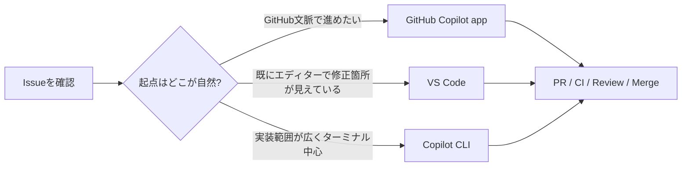

## はじめに

先日、[C# 開発者のための GitHub Copilot CLI と VS Code Agent Mode の使い分け](https://zenn.dev/tomokusaba/articles/838cdac8d71e52) という記事を書きました。前回は「ターミナルで大きく回す GitHub Copilot CLI」と「エディターで小さく整える VS Code の Agent Mode」という 2 軸で整理しました。

また、別の記事では [GitHub Copilot app を使って感じた、日々の摩擦が減る4つのこと](https://zenn.dev/tomokusaba/articles/fd382738fee5e3) として、複数リポジトリをまたぐときの認知負荷や、作業の入口がリポジトリとセッションになることにも触れました。

ところが、その後 GitHub Copilot app が登場し、整理の仕方を少し更新したくなりました。公式ドキュメントでは、GitHub Copilot app は GitHub-native なデスクトップ体験として説明されており、並列セッション、Issue / Pull Request 管理、ワークフロー実行、PR ライフサイクル管理までを 1 か所にまとめる方向性がかなり強いです。

私の第一印象を一言でまとめると、GitHub Copilot CLI がマニュアル車なら、GitHub Copilot app はオートマ車です。もちろんこれは優劣の話ではなく、制御性を重視するか、自動化と導線の滑らかさを重視するかの違いだと感じています🚗

前回の「CLI と VS Code の 2 軸整理」は今でも有効です。その上で今回は、GitHub 文脈を起点にする入口として GitHub Copilot app が加わったと捉え、3 つの使い分けを整理します。

少し先に結論を書いておくと、**GitHub Copilot CLI と GitHub Copilot app は、チャットエージェントという観点ではかなり近い** と私は感じています。私が「これは CLI でなければ」と思うのは、CLI 固有のコマンドラインオプションやターミナル起点の操作を使いたい場面です。

## 本記事のゴール

- GitHub Copilot app の立ち位置を、CLI / VS Code と並べて把握できる
- GitHub Copilot app が向く作業と、CLI / VS Code が向く作業の境界を理解できる
- C# / .NET 開発でどの入口から始めると楽か、判断基準を持てるようになる

## 前提条件

- ✅ 本記事は 2026 年 5 月時点の公式ドキュメントと公式告知を基に整理しています
- ✅ GitHub Copilot app は公式 Docs では technical preview とされています
- ✅ 比較対象は GitHub Copilot CLI、VS Code の Copilot Chat / Agent、GitHub Copilot app です
- ✅ 主な読者は C# / .NET 開発者を想定しています

:::message
GitHub Copilot app の公式ドキュメントと公開リポジトリ README では、app が **built on GitHub Copilot CLI** と説明されています。ここではそこから一歩進めて、CLI を土台に GitHub 統合と PR ライフサイクル管理を前面に出した体験と捉えると、全体像を掴みやすいと私は感じました。
:::

まずは app 単体の立ち位置を押さえ、その後で CLI / VS Code と比較していきます。

## GitHub Copilot app の立ち位置

まず一次情報から押さえておきたいのは、GitHub Copilot app が単なる別 UI のチャットではないという点です。

GitHub Docs の *About the GitHub Copilot app* では、次のように説明されています。

> The GitHub Copilot app is a desktop application purpose-built for agent-driven development. It gives you a single place to direct AI agents across parallel workstreams, work with GitHub issues and pull requests, and manage the full development lifecycle—without context-switching between terminals, IDEs, and browser tabs.
>
> — [About the GitHub Copilot app](https://docs.github.com/en/copilot/concepts/agents/github-copilot-app)

この説明から読み取れるのは、GitHub Copilot app の主役が、チャット欄そのものではなく GitHub 文脈を背負った作業空間だということです。

- 🧭 Inbox で複数リポジトリの Issue / Pull Request をまとめて見る
- 🔎 Search でリポジトリを横断して情報を探す
- ⚡ Sessions でタスクごとの分離された作業空間を持つ
- 🔁 Workflows で定型作業を保存し、手動またはスケジュール実行する
- ✅ Pull Request をレビューし、必要なら Agent Merge で最後まで追従させる

つまり GitHub Copilot app は、GitHub 上の作業フローを AI と一緒に前に進めるためのフロントエンドと見るのがしっくりきます。

## 3 つを並べると何が違うのか

まずは 3 者の性格をざっくり並べます。

| 項目 | 🖥️ GitHub Copilot CLI | 🧑‍💻 VS Code Agent / Chat | 🧭 GitHub Copilot app |
|------|------------------------|---------------------------|------------------------|
| 主な入口 | ターミナル | エディター / チャットビュー | GitHub 文脈を持つデスクトップアプリ |
| 強いコンテキスト | カレントディレクトリ配下のコードとシェル | 開いているファイル、選択範囲、ワークスペース | Issue、PR、レビュー、CI、複数リポジトリ |
| 得意な粒度 | 機能単位、リポジトリ単位 | ファイル単位、差分単位 | タスク単位、PR ライフサイクル単位 |
| 作業の始め方 | プロンプトを自分で書いて始める | エディターから指示する | Inbox、Issue、PR、Quick chat から始める |
| 並列作業 | 並列実行自体は可能。通常時は自分で管理する色が強い | セッション管理あり | 複数セッションを前提に設計されている |
| PR までの導線 | 作れる | クラウド連携で対応可 | 作成、レビュー、CI 確認、Merge まで 1 か所でつながる |
| CLI 固有の価値 | コマンドラインオプションとターミナル起点の操作 | エディター統合の強さ | GitHub 導線と Workflows の強さ |
| 制御感 | 高い | 中くらい | 自動化を強く感じやすい |

私の感覚では、3 つの役割分担は次のようになります。

- CLI: CLI 固有のコマンドオプションやスラッシュコマンドを使って、手元で強く制御したいとき
- VS Code: 目の前のコードを読みながら、小さく早く回したいとき
- app: GitHub 上の仕事の流れごと扱いたいとき

:::message
GitHub Copilot CLI も app も並列作業は可能です。つまり違いは「並列実行できるかどうか」より、その並列性をどこまで前面に出して体験設計しているかにあります。CLI は手元での制御を重視し、app は複数セッションを前提とした UI を前面に出しています。
:::

:::message
この比較で私がいちばん強く感じているのは、CLI と app の差は、チャットエージェントそのものの能力差というより入口と操作面の差だということです。CLI を選びたくなるのは、コマンドラインから直接制御したいときや、CLI 固有の操作系を使いたいときです。
:::

## GitHub Copilot app が特に便利だと感じるところ

### 1. GitHub の仕事を起点に始めやすい

GitHub Copilot app の公式チュートリアルでは、Issue からセッションを始める流れが自然な標準ルートとして案内されています。Issue を開いて Start a session を押すと、Issue の文脈を持ったまま Plan モードで始まります。

これは CLI や VS Code と比べるとかなり大きい差です。CLI だと「Issue の URL を貼って説明する」、VS Code だと「Issue をブラウザーで見ながら IDE へ戻る」という往復が起こりやすいですが、app は最初から GitHub の仕事そのものが入口です。

### 2. Issue・PR・CI（継続的インテグレーション）・レビューを 1 つのアプリ内で追える

*Managing issues and pull requests with the GitHub Copilot app* では、Inbox から PR を開き、要約、CI 結果、レビュー活動を見て、必要なら Fix や Fix failing checks を起点にエージェントへ戻す流れが説明されています。

ここはかなり「アプリの価値」が出るところです。

- 📨 Inbox で Issue / PR をまとめて眺める
- 🧾 概要と差分をそのまま確認する
- 🧪 CI の失敗を見て修正を依頼する
- 💬 レビューコメントに対して修正を継続する
- 🔀 最後は Agent Merge でマージまで追従させる

CLI でも PR を作れますし、VS Code でもクラウドエージェントや GitHub 連携はあります。ただ、「始める → 直す → レビューする → マージする」までの導線が最初から 1 つのアプリ内でつながっているのは、GitHub Copilot app の分かりやすい強みです。

### 3. 複数の仕事を同時に持っている人ほど恩恵が大きい

GitHub Copilot app は Docs の冒頭から parallel workstreams を押し出しています。Overview では dedicated git worktree and branch、agent sessions では its own isolated workspace と説明されており、複数タスクを並列に走らせる前提で設計されています。

1 つの製品だけを集中的に触る日もありますが、実際の開発では、

- いま担当している機能開発
- 別リポジトリのレビュー依頼
- CI が落ちた PR の再確認
- 朝の定型トリアージ

のように、小さく種類の違う仕事が同時に走ることがよくあります。こういうときに、GitHub Copilot app の Inbox / Sessions / Workflows / Search がまとまっている価値は大きいです👀

ここは、以前書いた「日々の摩擦が減る4つのこと」の記事でも触れた部分です。CLI ではどうしても「今どのターミナルがどの作業用だったか」を自分で保持する場面がありますが、app は repository / session 単位で見えるので、複数の仕事を抱えた日の認知負荷を下げやすいと感じます。

### 4. 作業の入口が「ディレクトリ」より「リポジトリとセッション」に寄る

GitHub Copilot CLI は、当然ですがどのディレクトリで起動するかが大切です。これは CLI の自然な設計で、私もその制御感が好きです。加えて CLI には programmatic interface があり、コマンドラインから直接制御できる操作系があります。

一方で GitHub Copilot app は、Getting started にある通り、接続した repository を選び、そこから session を作って始める流れが前面にあります。この違いは地味ですが、複数リポジトリを行き来する日には効きます。

- 🖥️ CLI: まず正しい場所へ移動してから始める
- 🧭 app: まずどのリポジトリで始めるかを選んでから進める

私はこの差を、「起動前の迷いが減るかどうか」として感じています。GitHub 文脈の仕事が多い人ほど、app の入口設計は相性がよさそうです。

### 5. 反復作業を Workflows に載せやすい

前回の記事では、CLI はかなり自由度が高く、プロンプトを自分で作り込んでいく楽しさがあると書きました。これは今でも変わりません。

一方、GitHub Copilot app には Workflows があり、定型的な依頼を保存して再利用できます。Docs では新しい Issue のトリアージや open pull requests の review status 確認が例として挙げられており、公式 announcement では triage、dependency updates、release notes、routine pull requests のような反復作業にも触れられています。

私が GitHub Copilot app の反復で特に大きいと感じているのは、まさにこの Workflows です。単に「保存済みプロンプトを呼び出せる」だけではなく、繰り返し発生する仕事を app 側の機能として持てるので、反復の導線そのものが安定します。

このあたりは、CLI が「自分でうまく運転する道具」なら、app は「よく使う経路を記憶して楽をさせてくれる道具」と感じる理由の 1 つです。

ここも以前の記事で書いた感覚に近くて、入力の手間が減るだけでなく、定型作業の品質をそろえやすく、毎回の反復を app の中で回しやすいのがよさだと思っています。

## なぜ「CLI はマニュアル車、app はオートマ車」と感じるのか

この比喩を、もう少しだけ具体的にします。

| 観点 | 🖥️ CLI | 🧭 app |
|------|--------|--------|
| 操作の起点 | 自分でプロンプト、ディレクトリ、許可を細かく決める | Issue / PR / Inbox / Workflow から流れに乗れる |
| 作業空間の意識 | 「今どのフォルダで何をするか」を自分で握る | セッションごとに分離された作業空間をアプリが前面に出す |
| 反復の組み方 | シェル、プロンプト、レビューを自分で編成する | Plan / Interactive / Autopilot を選び、導線に乗って進める |
| 向いている感覚 | 手元で細かく操縦したい | タスクの進行管理ごと任せたい |

GitHub Copilot CLI の強さは、やはりターミナルと一体化した制御性と、CLI 固有の操作を明示できることです。公式 Docs でも、CLI はコード変更、デバッグ、GitHub.com とのやり取り、Plan モード、プログラマティック実行といった使い方を持つ入口として説明されています。

一方 GitHub Copilot app は、CLI を基盤にしつつ、GitHub 文脈・セッション管理・PR ライフサイクル・スケジュール実行を前面に押し出しています。だからこそ、私には「CLI の上に、運転しやすい車体とナビが載ったもの」に見えます。

もちろん、これは CLI が不要になるという意味ではありません。むしろ逆で、チャットエージェントとしてはかなり近く、その上で app は導線を整え、CLI はコマンドラインから強く制御できると理解する方が実態に近いと思います。

ここまでは app を中心に見てきたので、次に前回記事から続く VS Code の位置をはっきりさせます。

## VS Code はどこに入るのか

では VS Code はこの 2 つの間でどう位置づけられるのでしょうか。

VS Code の公式ドキュメントでは、Copilot はエディターの中で AI を使う側面と、必要に応じて Local / background / cloud に広げられる側面の両方を持っています。特に強いのは、やはり開いているファイル・選択範囲・インライン差分に寄り添えることです。

たとえば次のような作業です。

- `UserService.cs` のこのメソッドだけ直したい
- この `record` の null 許容警告だけ潰したい
- 差分を目で見ながら 1 ファイルずつ承認したい
- デバッガーやテストエクスプローラーの近くで反復したい

こうしたコードの近接戦は、今でも VS Code が一番やりやすいと感じます。

つまり 3 つを並べると、

- CLI は「リポジトリに深く入る入口」
- VS Code は「コードに最も近い入口」
- app は「GitHub の仕事を前に進める入口」

という整理がしっくりきます。

## 私ならどう使い分けるか

### GitHub Copilot app を開く場面

- 📌 Issue を起点に計画から始めたい
- 📨 複数リポジトリの PR / Issue をまとめて見たい
- 🔎 GitHub 文脈込みで検索したい
- 🔁 定型タスクを Workflows として残したい
- ✅ PR のレビュー、CI、マージまで一気通貫で追いたい

### GitHub Copilot CLI を開く場面

- 🛠️ ソリューション全体をまたぐ実装を一気に進めたい
- 🧪 `dotnet build` / `dotnet test` / `dotnet ef` を軸に回したい
- ⚙️ CLI 固有のコマンドライン操作を使いたい
- 🧭 ターミナルから強く制御したい
- 🛰️ SSH、コンテナ、CI など IDE に依らない環境で使いたい

### VS Code を開く場面

- ✏️ 小さな修正を素早く回したい
- 👀 差分をエディターで細かく確認したい
- 🐛 選択範囲ベースでバグ修正したい
- 🧩 既存コードを読みながら局所的に整えたい

## C# / .NET 開発での実際の流れ

上の整理を、C# / .NET 開発の 1 つの流れに落とすと次のようになります。

たとえば「バックログ上の Issue から始めて、まず計画を見たい」なら app が自然です。Start a session で Plan モードに入り、そのままブランチ作成、実装、PR までつなげられます。

一方で、「ASP.NET Core の API を追加し、複数の `.cs` ファイルとテストを横断して変更する」なら CLI が気持ちよく回せます。`dotnet` コマンドと編集が同じ場所にあるからです。

そして「この Blazor コンポーネントの見た目だけ直したい」「この警告だけ消したい」なら、やはり VS Code が速いです。

## おわりに

前回は GitHub Copilot CLI と VS Code Agent Mode の使い分けを整理しました。今回の記事はその整理を否定するものではなく、そこに GitHub 文脈を起点にする入口として GitHub Copilot app を加えたものです。

- CLI は、コマンドラインから強く制御する道具
- VS Code は、コードに近い場所で小さく速く回す道具
- app は、GitHub 上の仕事の流れ全体を前に進める道具

特に GitHub Copilot app は、チャット機能がある新しいクライアントというより、GitHub そのものの一連のフローを支えるフロントエンドと見ると理解しやすいです。逆に言えば、チャットエージェントという観点では CLI とかなり近く、CLI を選ぶ決め手は CLI 固有のコマンドライン操作を使いたいかどうかに集約されてきます。

私自身は、今後は「Issue や PR 起点の仕事は app」「実装の深掘りは CLI」「局所修正は VS Code」という分担で使い分けていきそうです。特に app については、別記事でも書いたように複数リポジトリをまたぐ日の認知負荷や起動前の迷いを減らしてくれる点が、常用の入口として効いています。みなさんもぜひ、普段の作業を GitHub 文脈 / リポジトリ文脈 / コード文脈の 3 つに分けて、どこから始めるのが一番楽かを見直してみてください🧭

## 参考リンク

- [About the GitHub Copilot app - GitHub Docs](https://docs.github.com/en/copilot/concepts/agents/github-copilot-app)
- [Getting started with the GitHub Copilot app - GitHub Docs](https://docs.github.com/en/copilot/how-tos/github-copilot-app/getting-started)
- [Working with agent sessions in the GitHub Copilot app - GitHub Docs](https://docs.github.com/en/copilot/how-tos/github-copilot-app/agent-sessions)
- [Managing issues and pull requests with the GitHub Copilot app - GitHub Docs](https://docs.github.com/en/copilot/how-tos/github-copilot-app/managing-issues-and-pull-requests)
- [Using scheduled workflows in the GitHub Copilot app - GitHub Docs](https://docs.github.com/en/copilot/how-tos/github-copilot-app/using-scheduled-workflows)
- [GitHub Copilot app is now available in technical preview - GitHub Changelog](https://github.blog/changelog/2026-05-14-github-copilot-app-is-now-available-in-technical-preview/)
- [GitHub Copilot app repository - github/app](https://github.com/github/app)
- [About GitHub Copilot CLI - GitHub Docs](https://docs.github.com/en/copilot/concepts/agents/about-copilot-cli)
- [GitHub Copilot in VS Code - VS Code Docs](https://code.visualstudio.com/docs/copilot/overview)
- [Chat in Visual Studio Code - VS Code Docs](https://code.visualstudio.com/docs/copilot/chat/copilot-chat)
- [GitHub Copilot app を使って感じた、日々の摩擦が減る4つのこと](https://zenn.dev/tomokusaba/articles/fd382738fee5e3)
