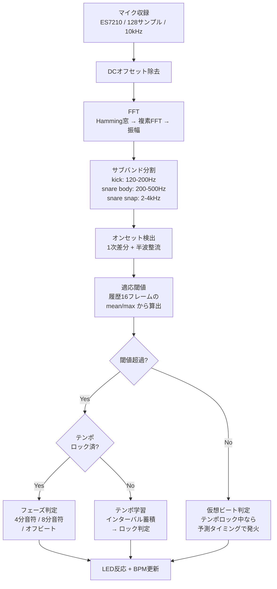

## はじめに

この記事は、[前回のQiita記事「M5Stack CoreS3のマイクでUnit NecoのLEDをリアルタイム制御」](https://qiita.com/tomokusaba/items/178323347f2a23c842a5)の続編です。

前回は、M5Stack CoreS3に内蔵されたES7210オーディオコーデックから音声を取り込み、FFTで周波数帯域に分解して、低音は赤、中音は緑、高音は青でUnit NecoのLEDを光らせるところまで実装しました。適応閾値によるビート検出も組み込みましたが、8分音符の裏拍やゴーストノートに引っ張られてBPMが不安定になるという課題が残っていました。

今回はそこから一歩進めて、ビート検出をより音楽的に安定させるために **4分音符のビート予測（phaseベース判定）** と **テンポロック（安定時は予測で補完、崩れたら再学習）** を実装しました。対象コードは [Sample4.ino](https://github.com/tomokusaba/m5stack/blob/main/M5StackS3/Mic/Sample4.ino) です。

---

## 前回からの変更点

今回の改善を理解するために、前回との違いを先に整理しておきます。

前回（Sample3相当）では、低音域のエネルギーが適応閾値を超えたらビート、という**単発判定**方式でした。これはシンプルで実装しやすい反面、ハイハットの裏打ちやベースラインの連続音に反応してBPMが倍になったり、静かなブレイクで途切れたりしやすいという弱点がありました。

今回（Sample4）では、検出したオンセットを「いま4分音符のどの位置にいるか」というフェーズ情報と照合してから確定する方式に変わっています。これにより、8分音符の裏拍に引っ張られにくくなり、テンポが一度安定すれば予測でビートを補完できるようにもなりました。

また、サンプリング周波数を8000Hzから10000Hzに引き上げ、DCオフセット除去を追加し、サブバンド分割をビート検出に特化した帯域に再設計するなど、信号処理の土台部分にも手が入っています。

## まず全体像：今回の検出パイプライン

処理の全体像を図で示します。すべて `updateMicFFT()` 関数の中で完結しています。



ポイントは、単純な「今フラックスが大きいか」だけで判定しないことです。「今の拍子のどこで鳴ったか」を見るようにしたことで、取りこぼしや誤検出が減っています。

---

## Step 1. 入力精度の土台を作る（収録〜FFT）

前回記事からの重要な変更として、サンプリング周波数を上げています。

```cpp
#define SAMPLES 128
#define SAMPLING_FREQ 10000  // 前回より高くして検出精度を改善
```

FFT自体はオーソドックスです。

```cpp
FFT.windowing(FFTWindow::Hamming, FFTDirection::Forward);
FFT.compute(FFTDirection::Forward);
FFT.complexToMagnitude();
```

さらに、収録データに対してDCオフセットを外してからFFTに渡しています。

```cpp
int32_t dcOffset = 0;
for (int i = 0; i < SAMPLES; i++) dcOffset += micBuffer[i];
dcOffset /= SAMPLES;

for (int i = 0; i < SAMPLES; i++) {
	vReal[i] = (float)(micBuffer[i] - dcOffset);
	vImag[i] = 0;
}
```

この前処理がないと、低域のノイズや直流成分が閾値計算を汚しやすくなります。

---

## Step 2. サブバンドを「ビート検出用」に再設計する

前回はLED表示用の帯域分割（60–250Hz / 250–2000Hz / 2000–4000Hz）をそのままビート判定にも使っていましたが、今回は**ビート判定専用のサブバンド**を別に設計しています。kick用は120–200Hz付近に絞り、室内のエアコンやPCファンによる低域ノイズ（おおよそ100Hz以下）を回避しています。スネア検出は打面の胴鳴り（200–500Hz）とスネアワイヤーの高域成分（2000–4000Hz）を分離し、加重合成することで、キックとスネアが同時に鳴る場面でも区別しやすくなっています。

```cpp
if (freq >= 120 && freq < 200) {
	subBass += mag * mag;
} else if (freq >= 200 && freq < 500) {
	lowMid += mag * mag;
} else if (freq >= 2000 && freq < 4000) {
	highMid += mag * mag;
}
```

ここで `mag * mag` とパワー（エネルギー）を累積しているのがポイントです。最後に `sqrtf` してRMS的な値に戻しつつ、高い除数（6000, 5000, 2000）で正規化しています。振幅ではなくパワーを使うことで、小さな音と大きな音のコントラストが広がり、閾値判定でのピークの立ち上がりが鮮明になります。

---

## Step 3. 「音量」ではなく「立ち上がり（onset）」を見る

ビートらしさは絶対値よりも立ち上がりに出やすいので、1フレーム前との差分を使っています。

```cpp
float kickOnset = max(0.0f, subBass - prevSubBass);
float snareBodyOnset = max(0.0f, lowMid - prevLowMid);
float snareSnapOnset = max(0.0f, highMid - prevHighMid);
float snareOnset = snareBodyOnset * 0.6f + snareSnapOnset * 0.4f;
```

ここで `max(0, diff)` にしているのが半波整流（Half-Wave Rectification）と呼ばれる手法です。音が鳴り始めるとき（エネルギーが増加するとき）だけを検出対象にし、音が消えていく方向の変化は無視します。これにより、サステインの長い音やリバーブの減衰で誤反応することを防いでいます。

スネアのオンセットは胴鳴り（body）とワイヤー（snap）を 0.6 : 0.4 の比率で合成しています。この比率は、内蔵マイクの周波数特性を考慮して、中域をやや重めにしたものです。

---

## Step 4. 適応閾値で環境ノイズに追従する

固定閾値は実装が簡単ですが、静かな曲では反応しない、うるさい環境では常に反応する、といった問題が起きやすいです。そこで、直近16フレーム分のオンセット値の履歴から平均値と最大値を求め、そこから閾値を動的に算出しています。

```cpp
float kickThresh = kickMean + (kickMax - kickMean) * 0.4f + 0.01f;
float snareThresh = snareMean + (snareMax - snareMean) * 0.4f + 0.01f;

kickThresh = max(kickThresh, 0.06f);
snareThresh = max(snareThresh, 0.05f);
```

閾値の計算式 `mean + (max - mean) * 0.4 + 0.01` は、平均からの偏差の40%を加算する形になっており、突出したピークだけを拾うように調整されています。さらに最低閾値（kick: 0.06、snare: 0.05）をフロアとして設けることで、完全な無音時の微小ノイズにも反応しないようにしています。

加えて、全帯域のエネルギーの指数移動平均が一定値（2.5）を下回ったら「無音」と判定し、オンセット値をゼロにリセットしています。

```cpp
bool isSilent = (avgEnergy < 2.5f);
if (isSilent) {
	kickOnset = 0;
	snareOnset = 0;
}
```

この無音検出は、曲間のMCトークや無音区間で誤ビートが出ることを防ぐためのものです。ここまでで「生オンセット」は安定しますが、まだ8分の裏拍やゴーストノートに引っ張られる問題があります。次のStep 5が今回の本丸です。

---

## Step 5. 4分音符の位置を予測して判定する（フェーズ判定）

### 5-1. フェーズを計算する

フェーズとは「推定される4分音符間隔の中での現在位置」を0.0〜1.0で表した値です。最後に確定した4分音符の時刻 `lastConfirmedBeat` と、推定間隔 `estimatedInterval` を使って算出します。

```cpp
float timeSinceConfirmed = (float)(now - lastConfirmedBeat);
float phase = fmodf(timeSinceConfirmed, estimatedInterval) / estimatedInterval;
```

`phase=0.0` が4分音符のちょうどの位置、`phase=0.5` が8分音符の裏拍に相当します。この値は -0.5〜+0.5 に正規化して使い、0に近いほど「4分の位置に近い」と判断します。

### 5-2. テンポロック済みのときの判定

テンポがロックされた状態では、オンセットが検出されるとそのフェーズによって3つのゾーンに振り分けます。フェーズ誤差が `PHASE_TOLERANCE`（±30%）以内であれば4分音符として確定し、テンポの微調整にも使います。フェーズが0.35〜0.65の範囲、つまり拍間の中間付近であれば8分音符と見なし、LEDは反応させますがテンポ学習には使いません。そのどちらにも該当しない位置にオンセットが来た場合はオフビートとしてカウントし、連続するとテンポロックを解除するトリガーになります。

```cpp
if (absPhaseError < PHASE_TOLERANCE) {
	isBeat = true;
	isQuarterNote = true;
} else if (phase > EIGHTH_NOTE_ZONE_LO && phase < EIGHTH_NOTE_ZONE_HI) {
	isBeat = true;
	isQuarterNote = false;
} else {
	consecutiveOffBeat++;
	isBeat = true;
	isQuarterNote = false;
}
```

この設計により、8分音符が連打される16ビート系の曲でもLEDの「ノリ」は維持しつつ、BPMの計算には4分音符（拍頭のオンセット）だけを使えるようになっています。なお、4分音符と8分音符ではLEDの反応強度にも差をつけており、4分音符は `beatDetected = 1.0`、8分音符は `beatDetected = 0.6` と弱めに設定されています。

---

## Step 6. テンポロックと再学習

テンポが未確定な「SEEK」状態では、検出されたオンセットの間隔を直接学習していきます。このとき、インターバルが250ms〜1000ms（BPM換算で60〜240）の範囲に収まるもののみを受け入れます。

重要なのが**8分音符の自動補正**です。インターバルが現在の推定値の35%〜65%に収まる場合、それは8分音符の可能性が高いため、インターバルを2倍にして4分音符として扱います。これにより、テンポ学習中に8分音符に引っ張られてBPMが倍になる誤動作を防いでいます。

```cpp
if (estimatedInterval > 0 && rawInterval < estimatedInterval * 0.65f
    && rawInterval > estimatedInterval * 0.35f) {
    rawInterval *= 2.0f;  // 8分音符→4分音符に補正
}
```

連続でオンビートが揃ったらロックします。ロックのしきい値は `TEMPO_LOCK_THRESHOLD = 2` と非常に低く設定されており、わずか2拍の一致でロックに入ります。これは「早めにロックして予測を開始し、外れたら素早くリセットする」という設計思想によるものです。

```cpp
#define TEMPO_LOCK_THRESHOLD 2

if (consecutiveOnBeat >= TEMPO_LOCK_THRESHOLD) {
	tempoLocked = true;
	tempoConfidence = 0.5f;
	lastVirtualBeatTime = now;
}
```

ロック中も、4分音符と判定されたオンセットの位相誤差を使って推定間隔を微調整し続けます。ただし、1回の更新あたりの変化率には `MAX_TEMPO_CHANGE = 8%` という上限が設けられており、急激なテンポジャンプを防止しています。

```cpp
float correction = phaseError * estimatedInterval * TEMPO_SMOOTH_FACTOR;
float maxDelta = estimatedInterval * MAX_TEMPO_CHANGE;
correction = constrain(correction, -maxDelta, maxDelta);
estimatedInterval += correction;
```

逆に、予測位置から外れたビートが `OFF_BEAT_RESET_COUNT`（2回）連続したらロック解除して再学習に戻します。このとき、直前のインターバルを新テンポの第一候補として引き継ぐため、曲のテンポチェンジにも比較的素早く追従できます。

```cpp
if (consecutiveOffBeat >= OFF_BEAT_RESET_COUNT) {
	tempoLocked = false;
	tempoConfidence = 0;
	beatCount = 0;
	// 直前のインターバルを新テンポ候補に
	float rawInterval = (float)timeSinceLastBeat;
	if (rawInterval > 250 && rawInterval < 1000) {
		estimatedInterval = rawInterval;
	}
}
```

さらに、テンポロック中に予測位置にビートが3回以上来なかった場合にもロックを解除します。これは曲が終わった、あるいは大きなブレイクに入ったケースへの対応です。

この「ロック→追従→破綻時リセット」のサイクルが、テンポ揺れや曲調変化への耐性を上げています。

---

## Step 7. 仮想ビートで体感を滑らかにする

テンポがロックされている状態で実際のオンセットが来ないフレームでも、推定間隔に基づいた予測タイミングでLEDを光らせます。これが「仮想ビート」です。内蔵マイクの感度やノイズフロアの都合で実オンセットを取りこぼしても、テンポが合っている限りはLEDの反応が途切れません。

```cpp
if (tempoLocked && estimatedInterval > 0 && lastConfirmedBeat > 0) {
	uint32_t timeSinceVirtual = now - lastVirtualBeatTime;
	if (timeSinceVirtual >= (uint32_t)estimatedInterval) {
		beatDetected = 1.0f;
		lastVirtualBeatTime = now;
	} else {
		beatDetected *= 0.5f;
	}
}
```

実オンセットが来た場合は即座に仮想ビートの基準時刻を同期するため、仮想ビートと実ビートがズレ続けることはありません。結果として「たまに取りこぼして急に暗くなる」体感がかなり改善されました。

---

## 各定数のまとめ

今回のアルゴリズムにはいくつかのチューニング定数が登場します。それぞれの意味と設定意図を整理しておきます。

| 定数名 | 値 | 意味 |
|---|---|---|
| `TEMPO_LOCK_THRESHOLD` | 2 | テンポロックに必要な連続オンビート数。低くして素早いロックを優先 |
| `PHASE_TOLERANCE` | 0.30 | 4分音符と判定する位相許容範囲（±30%）。広めにとって取りこぼし減 |
| `EIGHTH_NOTE_ZONE_LO` / `HI` | 0.35 / 0.65 | 8分音符と判定するフェーズ範囲 |
| `TEMPO_SMOOTH_FACTOR` | 0.15 | テンポ更新の追従速度。小さいほど安定重視 |
| `MAX_TEMPO_CHANGE` | 0.08 | 1回のテンポ更新で許容する最大変化率（8%） |
| `OFF_BEAT_RESET_COUNT` | 2 | 連続オフビートでロック解除する回数 |

これらは環境やジャンルに合わせて調整する余地があります。たとえばジャズのように揺れが大きい曲では `PHASE_TOLERANCE` を広げ、EDMのように機械的にテンポが一定の曲では狭めると精度が上がります。

---

## 設計の3層構造

今回の改善は、次の3層に分けると理解しやすいです。

**信号層**は、DC除去、サブバンド分割、オンセット検出、適応閾値で構成されます。ここは「物理的に音が鳴ったか」を判定する層です。**拍子層**は、フェーズ計算と4分音符/8分音符の分類を担当します。音楽的な解釈をここで行います。**体感層**は、テンポロックと仮想ビートによってLED反応を連続化する層です。

この3層が分離されているため、「検出精度を上げたい」なら信号層のパラメータ、「見た目をもっと派手にしたい」なら体感層の反応強度、というように独立して調整できます。

---

## そのまま試せるチェックポイント

動作確認のときは、シリアルモニタのログ出力を活用するのがおすすめです。

まず `♩`（4分音符）と `♪`（8分音符）の記号を確認してください。4分音符が拍頭で安定して出力され、8分裏が `♪` として分離されていれば、フェーズ判定が正しく機能しています。

次に `LOCK` と `SEEK` の遷移を見ます。曲が始まると数拍で `LOCK` に入り、テンポチェンジや曲間で `SEEK` に戻るのが正常な挙動です。`LOCK` に入らない場合は閾値が高すぎるか、サブバンドの帯域が曲に合っていない可能性があります。

`OFF-BEAT` が連発する場合は、テンポの推定値と実際のテンポがズレています。この場合はすぐにロック解除→再学習が走りますが、頻繁に繰り返すようなら `PHASE_TOLERANCE` を広げてみてください。

最後に `estimatedInterval` と `BPM` の値が安定しているかを確認します。ロック中にこの値がふらつく場合は `TEMPO_SMOOTH_FACTOR` を小さくすると改善します。

---

## まとめ

前回の「FFTで音を色に変える」から、今回は「拍子を推定してビートを音楽的に解釈する」段階まで進めることができました。

特に効果が大きかったのは、4分音符予測によって8分裏拍への誤追従がなくなったことと、テンポロック機構により安定時は予測で補完しつつ崩れたら即座に再学習する設計にしたことの2点です。

Unit Necoは見た目のかわいさに加えて、35個×2枚=70個のLEDが密に配置されているため、周波数帯域の可視化やビート反応の実験台としてもかなり面白い素材です。次のステップとしては、曲のジャンルや環境に応じて閾値係数を自動調整する仕組みや、ビートの強拍・弱拍パターンから拍子（4/4や3/4）を推定する機能に挑戦してみたいと考えています。

---

## 参考文献

- [M5Stack CoreS3のマイクでUnit NecoのLEDをリアルタイム制御（前回記事）](https://qiita.com/tomokusaba/items/178323347f2a23c842a5)
- [Sample4.ino（今回のソースコード）](https://github.com/tomokusaba/m5stack/blob/main/M5StackS3/Mic/Sample4.ino)
- [M5Stack Unit Neco（U163）製品ページ](https://docs.m5stack.com/en/unit/Unit-Neco)
- [M5Stack CoreS3 ドキュメント](https://docs.m5stack.com/en/core/CoreS3)
- [arduinoFFT ライブラリ](https://github.com/kosme/arduinoFFT)
- [Adafruit NeoPixel ライブラリ](https://github.com/adafruit/Adafruit_NeoPixel)
