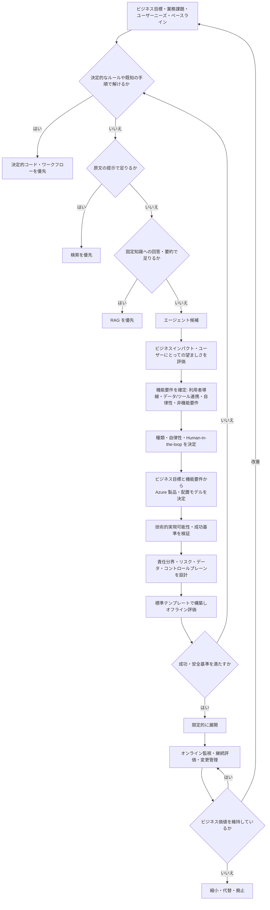
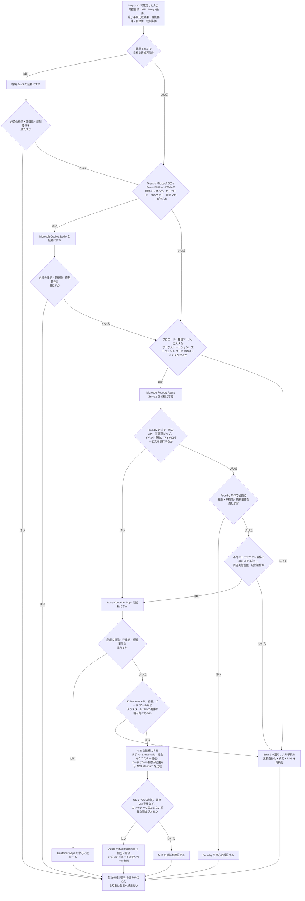
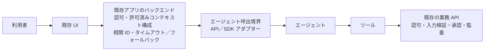
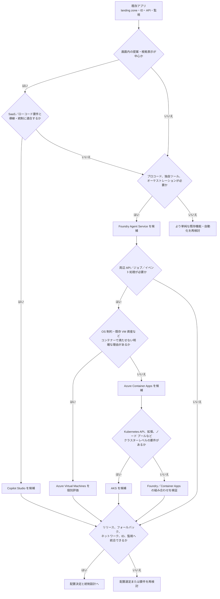

## はじめに

「競合も始めたので、当社も AI エージェントを導入したい」。企画会議がこの一言から始まると、手段が先に決まり、改善したい業務や成功条件が後付けになりがちです。デモは動いても、従来の検索で十分だった、利用者に定着しなかった、誰が出力に責任を持つのか決まっていなかった、という事態にもなりかねません。

最初に問うべきなのは、**「どの AI エージェントを作るか」ではなく「誰の、どの業務を、何のために改善するか」** です。そのうえで、決定的コード、検索、RAG（検索拡張生成）、ワークフロー自動化と比べ、エージェントの適応性を得るために追加の複雑さを引き受ける価値があるかを判断します。🧭

本記事では、[Azure Cloud Adoption Framework（CAF）の AI エージェント導入ガイダンス](https://learn.microsoft.com/ja-jp/azure/cloud-adoption-framework/ai-agents/?WT.mc_id=DT-MVP-5004827)を土台に、企画やレビューで使える意思決定フローへ落とし込みます。想定読者は、プロジェクトマネージャー、プロダクトマネージャー、プロダクトオーナー、アーキテクト、プラットフォーム／ガバナンス担当者です。特定のソフトウェア開発キット（SDK）を使った実装方法ではなく、検討から運用・見直しまでを扱います。

## 本記事のゴール

- 🎯 コスト、速度、意思決定、顧客体験などのビジネス目標から、業務施策と選択肢を比較する
- 👥 ユーザーニーズ、技術的実現可能性、成功メトリックを企画段階でそろえる
- 🛡️ 自律性に応じて Human-in-the-loop（人間による確認・介入）とガバナンスを設計する
- 📏 オフライン／オンライン／継続評価を一つの運用ライフサイクルにする
- 🏗️ デプロイ先、コントロールプレーン（エージェント群を統制・管理する仕組み）、標準化を組織全体の論点として捉える

これらを、最後に会議で確認できるチェックリストへまとめます。

### 本記事の読み方：CAF の説明と私の実務提案

CAF の AI エージェント導入ガイダンスは、取り組みを大きく **Plan for agents、Govern and secure agents、Build agents、Manage agents** の 4 領域で整理しています。ビジネス計画、技術計画、組織とデータの準備から、統制、構築、統合、運用までを見渡せる構成です。

一方、本記事で示す比較表、評価指標、意思決定ゲートは、そのガイダンスを会議で使いやすくするための**私なりの実務的な再構成**です。CAF がすべての組織に同じ順序や成果物を必須としている、という意味ではありません。

:::message
以降では、公式ページが明示する内容を「CAF のガイダンス」、そこから私が導いた運用例を「実務提案」として書き分けます。自社の規制、リスク許容度、既存プロセスに合わせて調整してください。
:::

この境界を共有したうえで、まず議論の対象である AI エージェントを定義します。

## AI エージェントとは何か

CAF では AI エージェントを、生成 AI モデルを使って入力を解釈し、問題について推論して適切なアクションを決める柔軟なソフトウェアプログラムと説明しています。主な構成要素は、**モデル、指示、取得（retrieval）、アクション、メモリ**です。

ここで大切なのは、近い言葉を製品名のように分けないことです。

- **モデル単体**は、入力から出力を生成する推論エンジンです。それ自体に業務上の目的、利用可能なツール、権限、停止条件までが備わっているわけではありません
- **チャットボット**は、本記事では主に対話インターフェースを表す言葉として扱います。裏側の仕組みは、決定的なシナリオ、RAG、AI エージェントのいずれでも構成できます
- **RAG（検索拡張生成）** は、検索した根拠をモデルへ渡して回答を生成するパターンです。エージェントは RAG を知識取得の一部として利用できます
- **AI エージェント**は、状況に応じて知識やツールを選び、複数ステップを進めます。柔軟になる反面、振る舞いは非決定的になり、評価と統制の範囲も広がります

つまり、「チャット画面があるからエージェント」「RAG よりエージェントが上位」という関係ではありません。**目的に必要な最小限の仕組みを選ぶ**ことが、導入判断の出発点です。

## 意思決定フローの全体像

ここから扱う流れを先に示します。これは CAF の公式図を置き換えるものではなく、4 領域を意思決定ゲートとして使う**実務提案**です。

以降では、この全体像を Step 1 から順に具体化します。

## Step 1: 改善したい業務とビジネス目標を言語化する

[AI エージェントのビジネス計画](https://learn.microsoft.com/ja-jp/azure/cloud-adoption-framework/ai-agents/business-strategy-plan?WT.mc_id=DT-MVP-5004827)では、ツールを探したり構築したりする前に、ビジネス計画を作ることが推奨されています。CAF のガイダンスはユースケースを、**ビジネスインパクト、技術的実現可能性、ユーザーにとっての望ましさ**の 3 領域で優先順位付けします。

私は企画の最初に、次の 5 点を一続きで書くようにしています。

| 項目 | 会議で答える問い | 記述例 |
|------|------------------|--------|
| 🩺 現在の業務 | 誰が、何に時間を取られ、負担を感じているか | サポート担当者が複数システムを横断して一次調査している |
| 👥 ユーザーニーズ | 利用者は何を速く、確実に、安全に行いたいか | 根拠を確認しながら回答案を作り、必要時は専門家へ渡したい |
| 🎯 ビジネス目標 | どの経営・事業目標につながるか | 解決時間を短縮しつつ、誤案内と再対応を減らす |
| 📏 ベースライン | 現在値を何で測るか | 解決時間、再対応率、担当者の調査時間、顧客満足度 |
| 🧭 意思決定 | 何が確認できたら継続／変更／中止するか | パイロットで目標と安全基準を満たした場合のみ対象を広げる |

ユーザーニーズは会議室だけで推測せず、業務観察、インタビュー、問い合わせログ、例外処理の記録から把握します。「回答が欲しい」のか、「根拠を探したい」のか、「最終処理まで終えたい」のかで、必要な仕組みは変わるためです。導入後の利用を強制する前に、対象ユーザーとともに小規模に試し、価値、信頼、業務へのなじみ方を確認します。👥

### ビジネス目標から施策とエージェントの役割を決める

ここからは **実務提案・例** として、よくある 4 つのビジネス目標を、業務施策まで分解してみます。この 4 分類や KPI（重要業績評価指標）が CAF の必須項目という意味ではありません。CAF が示す「ビジネスインパクト、技術的実現可能性、ユーザーにとっての望ましさ」で優先順位を付ける考え方を、会議で具体化するためのたたき台です。🧭

以下では、成果が表れるまで時間差のある**ラグ指標**と、施策の実行状況を早く捉える**リード指標（先行指標）** を併記します。

| 目標 | 業務上のボトルネック | エージェントを使う具体施策 | 任せない部分／ガードレール（越えてはならない制約） | KPI・先行指標 | 低リスクの小規模試行（パイロット）例 |
|------|----------------------|----------------------------|----------------------------|---------------|------------------------|
| 💰 コスト削減 | 問い合わせの一次調査、同じ内容への回答、転記や差し戻しに時間がかかり、需要の波に応じた振り分けが難しい | 問い合わせを分類・要約し、承認済みナレッジを検索して回答の下書きを作る。重複案件や手戻りの兆候を見つけ、混雑度や専門性に応じて人へ振り分ける | 料金、返金、契約条件、優先度の最終決定は決定的ルールと担当者確認に残す。品質低下や「削減のための誤クローズ」を防ぐため、根拠なしの回答・自動クローズを禁止する | ラグ指標: 完了単価、再対応率、品質監査の不適合率。リード指標: 分類一致率、下書き採用率、根拠表示率、有人への適切な振り分け率 | 社内 IT 問い合わせのうち、既知の FAQ に一致する低リスク案件だけで、分類・要約・回答下書きを試す |
| ⚡ ワークフローの高速化 | 依頼文から必要事項を抜き出す、複数システムを横断して調べる、承認資料を作る工程で待機と再確認が発生する | 依頼内容を抽出し、不足情報を確認するための質問を作る。許可済みシステムから情報を集めてケースを要約し、次の手順と承認用下書きを提示する。例外は担当者へ渡す | 承認、レコード更新、規程外判断は自動実行しない。必須項目、承認経路、期限判定は決定的なワークフローで検証し、取得不能・矛盾・低信頼のケースは人へエスカレーションする | ラグ指標: サイクルタイム、待機時間、初回解決率、差し戻し率。リード指標: 不足情報の初回回収率、要約の修正率、提案手順の採用率 | 申請受付で、依頼の要約と不足項目の確認文だけを下書きし、担当者が送信前に確認する |
| 📊 意思決定の改善 | 根拠が複数ソースに散在し、比較・会議資料・決定理由の記録に時間がかかる。未確定事項が埋もれやすい | 権限内の複数ソースから根拠を収集・要約し、選択肢とトレードオフ、未確定事項を明示する。会議資料の下書きと、意思決定後の根拠・判断理由の記録を支援する | 意思決定を自律化しない。最終判断と権限行使は人間に残し、出典、鮮度、偏り、アクセス権を確認する。根拠が不足・競合する場合は結論を断定せず、追加調査へ戻す | ラグ指標: 意思決定までの時間、決定後の手戻り、期待成果の達成度。リード指標: 根拠表示率、情報鮮度の確認率、未確定事項の明示率、資料下書き採用率 | 過去の決定記録と承認済みレポートだけを対象に、週次会議向けの選択肢比較と根拠一覧を作成する |
| 🤝 顧客体験の向上 | 顧客の意図や前回の経緯を把握しにくく、担当者への引き継ぎで同じ説明を求める。案内のタイミングや言語・利用状況にもばらつきがある | 問い合わせ意図を把握し、文脈に応じた案内とケース要約を作る。担当者への引き継ぎ、必要に応じたプロアクティブ通知の下書き、多言語・アクセシビリティに配慮した表現を支援する | 過度なパーソナライズ、誤案内、同意のないデータ利用を避ける。センシティブな推定、補償判断、苦情の最終対応は人間が担い、公開前の案内には承認済み知識と確認を必須にする | ラグ指標: CSAT（顧客満足度）、解決時間、再問い合わせ率、エスカレーション率、苦情率。リード指標: 引き継ぎ要約の利用率、案内の修正率、アクセシビリティ／言語レビュー通過率 | 既存顧客の閲覧履歴を使わず、問い合わせ本文と同意済みのケース履歴だけで担当者向け引き継ぎ要約を作る |

会議では、まず主要目標を 1〜2 個選び、その行だけを読みます。次に、成果を測るラグ指標、施策の実行状態を見るリード指標、超えたら中止・縮小・代替へ切り替える **No-go 条件** を決めます。

この表から、目標ごとにエージェントを 1 体作る、と短絡しないことも重要です。「コストは下げても CSAT を下げない」「処理を速くしても差し戻しを増やさない」のようなトレードオフを明示します。そのうえで、誤案内率、権限外アクセス、苦情率、品質監査の不適合率などの **No-go 条件（中止・縮小・代替へ切り替える条件）** を先に決めます。目標間の衝突を見える化しておくと、後からモデルの性能だけで無理に正当化することを避けられます。⚖️

本記事の施策例では、結果だけを待たずに二層で見ます。使用率、下書き採用率、根拠表示率、適切なエスカレーション率は、施策が業務に受け入れられ安全に使われているかを早く知るための候補となるリード指標（先行指標）です。一方、完了単価、サイクルタイム、CSAT、再問い合わせ率は、目標への寄与を確かめる候補となるラグ指標（結果指標）です。モデル品質の評価は必要ですが、それだけではビジネス目標を達成したとは言えません。📏

この段階では「エージェントを何体作るか」ではなく、改善前後を比較できる業務仮説と、許容できない失敗の条件を定めます。選んだ目標ごとに、**対象施策、最小手段候補、エージェントが必要となる条件、パイロット判定**を一組にして Step 2 へ渡します。本記事の実務提案として、決定的コード、検索、RAG、ワークフロー、AI エージェントを比較し、最小の手段を選びます。次に、その仮説を実現するために、本当にエージェントが必要かを判定します。

| 会議メモ | 記入する内容 |
|----------|--------------|
| 🎯 対象施策 | 選んだ目標へ最も寄与すると考える、具体的な業務施策 |
| 🧩 最小手段候補 | 決定的コード、検索、RAG、ワークフロー、AI エージェントの最初の候補 |
| 🤖 エージェントが必要となる条件 | 動的な判断、複数ツール、例外処理など、より単純な手段では満たせない条件 |
| 📏 パイロット判定 | ラグ／リード指標、No-go 条件、判定時点、未達時の縮小・代替・中止 |

## Step 2: エージェント以外の選択肢を先に比較する

CAF のビジネス計画では、手順が明確で予測可能なタスクに、通常のコードや非生成 AI を使うよう説明しています。また、固定文書への質問や要約が中心で、ツールの利用や複数ステップの推論が不要な場合は、従来型 RAG を検討するよう説明しています。複雑さを追加しない判断も、立派な成果です。

| 選択肢 | 向いている課題 | 強み | 主な注意点 |
|--------|----------------|------|------------|
| ⚙️ 決定的コード | ルール、計算、判定条件が明確 | 再現性が高く、速く、テストしやすい | 曖昧な依頼や未知の分岐には弱い |
| 🔎 検索 | 利用者が候補から正しい情報を選べる | 原文を直接確認でき、構成が単純 | 検索語を工夫し、検索結果を読み解く作業は利用者に残る |
| 📚 RAG | 管理された知識から回答・要約したい | 根拠を与えやすく、知識利用に集中できる | 検索品質、根拠性、生成品質の評価が必要 |
| 🔁 ワークフロー自動化 | 手順と分岐が既知で、処理を確実に進めたい | 承認、再試行、監査を設計しやすい | 想定外の入力への適応には追加設計が要る |
| 🤖 AI エージェント | 曖昧な入力を解釈し、状況に応じて手順やツールを選ぶ | 動的な複数ステップ処理に対応できる | 非決定性、権限、コスト、監視、評価の負担が増える |

実務では組み合わせも有効です。たとえば、意図の整理だけをモデルに任せ、金額計算と承認条件には決定的コードを、業務の進行には固定ワークフローを使います。**重要な業務ルールまで、すべてモデルの判断へ移す必要はありません。**

:::message alert
「AI エージェントを使わない」という結論は失敗ではありません。より単純な手段で同じ目標を達成できるなら、信頼性、費用、説明可能性の面で良い設計です。
:::

それでも動的な判断やツール選択が価値を生む場合に、エージェントの種類と任せる範囲を決めます。

## Step 3: 種類、自律性、人間の関与を課題に合わせる

CAF はエージェントを、生産性エージェント、アクションエージェント、自動化エージェントの 3 種類で整理しています。この順に複雑さと自律性が増えるため、目新しさではなく課題に合わせて選びます。

| 種類 | 主な役割 | 人間との分担例 |
|------|----------|----------------|
| 📚 生産性 | 情報の取得・統合、意思決定支援 | 根拠付きの候補を提示し、人間が判断する |
| 🛠️ アクション | 定義された業務でレコード更新や処理を実行 | 下書き後の承認、または実行直前の確認を設ける |
| 🔁 自動化 | 複雑な複数ステップを少ない監視で進める | 境界内は自動実行し、例外や高リスク時にエスカレーションする |

**実務提案**として、自律性は「読み取り・提案」「下書き」「承認付き実行」「境界付き自動実行」の順に高めます。データの更新や外部送信を伴う操作、金銭・契約・権利・安全に影響する操作には、影響度と可逆性に応じて Human-in-the-loop を置きます。単に承認ボタンを追加するのではなく、承認者へ根拠、変更差分、影響範囲を示し、拒否・修正・停止できるようにすることが重要です。

人間へのエスカレーション条件も先に定義します。権限不足、根拠不足、低い確信度、規程外の依頼、ツール障害、影響額の超過などです。人間が最後の安全装置なら、担当者、受付経路、応答期限まで含めて運用を設計します。

次は、ここまでの判断を、次の**配置判断用の機能要件**として確定します。

- 利用者導線と、既存業務 SaaS・ID との統合方法
- 参照・実行を許可するデータ、ツール、API とその権限
- 自律実行の範囲、承認条件、エスカレーション条件
- レイテンシ、可用性、データ所在地、監査・保持などの非機能要件と必須統制

その要件を満たすために**どこへ配置するか**を決めます。配置先は、この後に設計するガバナンス、コントロールプレーン、セキュリティの入力になります。

## Step 4: 配置モデルを先に決める

「どこにデプロイするのか」は、実装の最後に残すインフラの話ではありません。**配置先は、ビジネス目標から導いた機能要件を満たし、運用責任が最小となるものを選ぶ**最初の重要な意思決定です。利用者が普段使う業務 SaaS の中で完結するなら、そこで提供される機能を採る方が、独自ランタイムを増やすより早く安全に価値を出せることがあります。反対に、独自のツール連携、ネットワーク境界、実行環境の制御が要件なら、より制御できる配置モデルを検討します。🏗️

[AI エージェントの技術計画](https://learn.microsoft.com/ja-jp/azure/cloud-adoption-framework/ai-agents/technology-solutions-plan-strategy?WT.mc_id=DT-MVP-5004827)で CAF は、ビジネス計画の次に、ユースケースごとに適した技術プラットフォームを選ぶことを示しています。同ガイダンスは、既製 SaaS エージェントの採用と、Microsoft Foundry（PaaS）または Microsoft Copilot Studio（SaaS）を使うカスタム エージェント構築を扱います。

ここでの**実務提案**は、これを「必ず特定の製品か IaaS を選ぶ」という処方箋ではなく、機能要件と運用責任を比較する会議の順序として使うことです。後述する自己管理ランタイムは、この比較を補うアーキテクチャ上の選択肢であり、CAF が唯一の必須選択肢として示すものではありません。製品名も候補を考えるための例です。

| 配置モデル | 向く機能要件 | 主なメリット | 負う運用責任・制約 | ガバナンス・セキュリティ上の設計論点 | 避けるべき選び方 |
|------------|--------------|--------------|--------------------|----------------------------------------|------------------|
| 📦 既製 SaaS エージェント | 標準的な業務機能で足り、既存 SaaS のデータ・画面・利用者導線をそのまま使いたい | 立ち上がりが速く、基盤運用を最小化できる | 製品の機能境界、拡張性、提供リージョン、リリース予定に依存する | サービス設定を既存の ID、データ分類、監査、調達／ベンダー管理へ接続する | 「SaaS なら無条件に安全・準拠」と確認せず、データ利用条件や監査証跡を見ない |
| 🧩 SaaS 上のカスタム／ローコード エージェント | 業務 SaaS と自然につなぎつつ、コネクター、会話、承認フローを業務に合わせたい。Microsoft Copilot Studio は候補例 | 利用者導線を保ちながら、比較的速くカスタマイズできる | SaaS が許す拡張範囲、コネクター、ライセンス、環境管理の制約を受ける | テナント、コネクター、DLP、ID、共有範囲、作成者権限と監査を統制する | ローコードだからと、ツール権限やデータ接続のレビューを省く |
| ☁️ Microsoft Foundry Agent Service 上のカスタム エージェント | 独自ツール、プロコード、オーケストレーション、モデルやデータ連携を必要とする候補。プロンプト エージェントは Foundry により実行され、ホスト型エージェントはエージェント コードや独自オーケストレーションを扱う | マネージドなエージェント プラットフォームを活かしつつ、実装の自由度を得られる | データ、ID、構成、アプリの設計と運用は自組織の責任です。OS、ランタイム、ミドルウェアなどの責任範囲は、採用するサービスによりプロバイダー側へ移る | landing zone、ネットワーク分離、マネージド ID、シークレット、ログ、ポリシー、デプロイ パイプラインを設計する | PaaS だから責任分界や既存統制の設計が不要だと考える |
| 🧱 IaaS／専用の自己管理ランタイム | 独自モデル、特殊な実行環境、厳しいネットワーク境界、細かなスケーリングやオーケストレーション制御が必要 | ランタイム、依存関係、ネットワーク、モデル配置を最も細かく制御できる | IaaS または自己管理基盤では、パッチ、脆弱性、容量、可用性、DR、監視、コスト最適化まで広く負う。Azure Container Apps や AKS は、それぞれのマネージド範囲を持つため、この行と一律には扱わない | ワークロード分離、イメージ供給網、シークレット、ID、ネットワーク、SIEM、復旧手順を継続して検証する | 「高度そうだから」「将来必要かもしれないから」と、要件のない自己管理コストを追加する |

### 機能要件から比較する観点

候補を比較するときは、機能の多さではなく、Step 1 で定めた業務成果を達成するために何が必須かを確認します。会議では少なくとも次の観点を同じ表に並べます。

- 👥 **既存業務 SaaS と利用者導線**: 既存の画面、データ、承認フローに自然に統合できるか。利用者へ新しいポータルや ID を増やさずに済むか
- 🛠️ **カスタマイズとオーケストレーション**: 独自ツール、複数ステップの制御、コード、既存 API との連携が必要か。標準コネクターで足りるか
- 🔐 **データと統制**: データ所在地、ネットワーク分離、ID と最小権限、監査・ログ保持、コンプライアンスを満たせるか
- ⏱️ **サービス品質**: 想定するスケール、レイテンシ、可用性、災害復旧（DR）を、責任分界を含めて満たせるか
- 🧑‍🔧 **継続運用**: 運用体制とスキル、費用、ベンダーロックイン、変更速度を、導入後も引き受けられるか
- 🏗️ **既存基盤との接続**: PaaS／IaaS を使うなら、既存の application landing zone（アプリケーション用ランディングゾーン）のネットワーク、ID、ポリシー、監視に統合できるか

### ビジネス目標から Azure 製品候補へ絞る

以下は CAF 必須の製品選定表ではなく、前段で決めた 4 つのビジネス目標と機能要件を、Azure 製品候補へ接続する**実務提案**です。CAF の技術計画では、ビジネス計画の次に既製 SaaS、Microsoft Foundry（PaaS）、Microsoft Copilot Studio（SaaS）を検討する流れが示されています。ここでも、まず目標を達成できる最も単純な候補から確認します。🧭

| 目標 | 最初に確認する業務要件 | 最小候補（製品と理由） | 次の候補へ進む条件 | 絶対に避ける誤った短絡 |
|------|------------------------|------------------------|--------------------|------------------------|
| 💰 コスト削減 | 既存の Microsoft 365、Teams、Power Platform の導線、コネクター、ローコード自動化だけで、手作業や再入力を減らせるか | **既製 SaaS を先に確認**し、足りなければ **Microsoft Copilot Studio**。組織データ／システムへ接続し、利用者の既存チャネルへ公開する業務自動化の候補になる | 独自コード、複雑なエージェント、独自オーケストレーションが必須なら **Microsoft Foundry Agent Service** を比較する | 「節約したいから」と、必要性を確かめず Container Apps や AKS へ飛ぶ |
| ⚡ ワークフロー高速化 | 承認、既存 SaaS との連携、人間のレビューが処理の中心か | **Copilot Studio**。ローコード、コネクター、フローと人間のレビューを組み合わせられるため、既存プロセスを保った候補にしやすい | 独自 API、プロコード、独自オーケストレーションが必要なら **Foundry Agent Service**。周辺 API、バックグラウンド ジョブ、イベント駆動処理が要る場合に **Azure Container Apps** を実行基盤候補として追加する | 承認フローの課題を Kubernetes の導入で解こうとする |
| 📊 意思決定改善 | 根拠の収集、回答、要約を誰が確認し、どの業務画面で受け取るか | 低コードで利用者導線を作れるなら **Copilot Studio**。プログラムからの統合、カスタム コード、独自オーケストレーションが必要なら **Foundry Agent Service** | 複数の専門サービスを組み合わせた自前バックエンドを実行する必要が明確になったとき、**Container Apps** を比較する | 「分析だから」と、根拠・確認者・No-go 条件を決めずに自前基盤を増やす |
| 🤝 顧客体験向上 | Teams、Microsoft 365、Web などの標準チャネルで会話とフローを提供できるか。誤案内時の同意、人への引き継ぎを設計したか | 標準チャネルへの公開と会話・フローが中心なら **Copilot Studio**。Teams、Microsoft 365 Copilot、Web などへ公開する候補になる | 外部顧客向けの独自アプリ UI／API や細かな体験制御が必要なら、**Foundry Agent Service + Container Apps** を候補として検討する | 「顧客向けだから」と、誤案内の防止、同意、エスカレーションを後回しにする |

Copilot Studio はグラフィカルなローコード スタジオであり、既製またはカスタム コネクタを通じてデータ ソースへ接続できます。一方、Foundry Agent Service は AI エージェントを構築、デプロイ、スケーリングするマネージド プラットフォームです。どちらも「上位版」ではなく、利用者導線、実装の自由度、責任分界に対する適合で候補にします。利用可否、リージョン、ライセンス、コネクター、クォータ、コンプライアンスは、採用前に各組織の条件で確認してください。🔍

次のツリーは、表の比較を会議でたどるための実務用メモです。Azure 全体の公式コンピュート選定ツリーの代替ではありません。

:::message
Foundry と Container Apps／AKS は排他的ではありません。Foundry がエージェントのマネージド プラットフォームを担い、必要に応じて周辺 API やワーカーを Container Apps または AKS で動かす構成があります。Copilot Studio、Foundry、Container Apps、AKS を機能の上下関係にせず、それぞれが担う責任範囲を分けてください。

AKS は自己管理 IaaS と同義ではなく、Kubernetes のコントロール プレーンを AKS が管理するマネージド Kubernetes です。ただし、アプリケーション設計と Kubernetes ワークロードの責任までなくなるわけではありません。コンテナー化された API、ジョブ、イベント駆動処理、マイクロサービスを基盤管理なしで実行したい場合は Container Apps が候補です。VM を検討する場合を含む公式の判断には、[Azure コンピューティング サービスの選択](https://learn.microsoft.com/ja-jp/azure/architecture/guide/technology-choices/compute-decision-tree?WT.mc_id=DT-MVP-5004827)も必ず参照してください。
:::

### 既存アプリケーションへエージェントを追加する場合

既存アプリへエージェントを追加する目的は、チャット UI を増やすことではなく、既存の業務画面、データ、権限、手続きの中で Step 1 のビジネス目標を改善することです。🧭

アプリ本体の業務ルールや最終判断を安易に移さず、既存トランザクションを LLM へ委ねません。確定は、認可と監査を備えた決定的な API／ワークフローで行い、エージェントは候補、根拠、下書きに留めます。

#### 機能要件を既存の利用者体験から定義する

別チャットへ誘導する前に、現在の画面と承認・例外処理を起点に最小の役割を決めます。

| 観点 | 会議で決めること | 既存アプリでの設計例 | 避けるべき設計 |
|------|------------------|----------------------|----------------|
| 👥 利用者導線と画面 | どの画面・時点で出すか。別チャットを増やさないか | ケース画面の根拠付き候補、確認画面の差分 | 無関係なチャットだけを増やす |
| 🗂️ 入力コンテキスト | 渡すフィールド・履歴、除外する機密情報 | サーバー側で許可済みコンテキストを構成 | 画面全データを送る |
| ✍️ 読み取りと書き込み | 参照と副作用を分ける | 書き込みは業務 API／承認を通す | DB を直接更新させる |
| 🔐 権限 | 利用者・エージェント・代理アクセスの権限 | API 側で既存認可を再検証 | UI 表示だけで制御する |
| 🧑 Human-in-the-loop／失敗時 | 承認、根拠、差分、拒否、引き継ぎ、タイムアウト | 下書き保存または人へ引き継ぐ | 黙って成功扱いにする |
| ⏱️ 非機能 | 性能、コスト、所在地、保持、アクセシビリティ | AI が遅くても通常操作を継続 | AI を唯一の必須経路にする |

満たせない場合は、役割を縮小するか、既存の決定的な自動化へ戻します。

#### 呼び出し方式は結合度と失敗時の振る舞いで選ぶ

**API 呼び出しと密結合は完全な対義語ではありません。**結合度は、次の 5 軸で分けて評価します。

- **コード**: SDK／ライブラリを共有するか、アダプターを介した独立契約か
- **デプロイ**: 同時リリースが必要か、互換性を保って独立に変更できるか
- **実行**: 同期／非同期、タイムアウト時の扱い、障害がどこまで伝播するか
- **データと認可**: 誰がコンテキストを生成し、どこで権限を再検証するか
- **運用**: 監視、スケール、変更、障害対応を誰が担うか

たとえば HTTP API を使っていても、呼び出し元とエージェントを常に同時にリリースする必要があれば密結合です。一方で、**SDK を使うこと自体は密結合を意味しません**。SDK がリモート API のクライアントであれば、実行時の境界は API のままです。製品名や通信プロトコルだけで結論を出さないことが大切です。🧭

[Microsoft Foundry Agent Service](https://learn.microsoft.com/ja-jp/azure/foundry/agents/overview?WT.mc_id=DT-MVP-5004827)を使う場合、エージェントの実行は Foundry のマネージドサービス側で行われます。既存アプリが SDK を参照していても、それは Foundry の API を呼ぶクライアント コードであり、エージェント ランタイムを既存アプリと同一プロセスへ埋め込む意味での密結合ではありません。ここで扱う、**既存アプリとエージェント ランタイムの密結合**は、Foundry ではなく自前でホストするランタイムを、既存アプリと同じデプロイ単位・ライフサイクルへ含める場合に限定します。

以下は、機密情報や権限操作を伴う既存業務アプリで私が既定にする**実務提案**です。ブラウザーがエージェントの資格情報を直接扱わず、業務更新もエージェントから DB へ直接書き込まずに既存の業務 API を通すと、認可、入力検証、承認、監査を集約しやすくなります。

| 方式 | 向く要件 | 主な利点 | 結合・失敗時の注意 | 最低限の設計 |
|------|----------|----------|--------------------|--------------|
| 🔄 同期 API 境界 | 対話中に下書きや根拠候補を返す | 呼出契約を分け、独立リリースしやすい。例として Foundry Agent Service は Responses API を単一エントリポイントにし、プロンプト エージェントを SDK／REST で定義できる | タイムアウト、契約変更、再試行による副作用、依存先障害を考える。サーキットブレーカーなどを必須視せず、要件に応じてフォールバックを決める | 期限、構造化応答、再試行方針、従来フロー復帰 |
| 🧩 自前エージェント ランタイムを既存アプリへ密結合 | 低遅延、局所コンテキスト、一括リリースが必要で、エージェントを自前でホストする | 呼び出し経路が短く、既存バックエンドの制約を近くで扱える | 依存更新、障害伝播、スケール、脆弱性、モデル／プロンプト変更がアプリのリリースに結び付きやすい。Foundry Agent Service の SDK クライアント利用とは区別する | アダプター、機能フラグ、独立評価 |
| 📨 非同期 API／イベント／ジョブ | 長時間処理、バッチ、バックグラウンド、外部ツール待ち | 受付と処理を分け、利用者操作とワーカーを別にスケールできる | 重複実行、再試行、結果待ちを設計しないと利用者が状況を把握できない | 受付 ID、状態照会／通知、冪等性、重複排除、失敗キュー、待機表示 |
| 🖥️ UI からの直接呼び出し | 公開・低リスクで、クライアントが適切な認証方式で限定 API を呼べる | 経路が短く UI の応答を作りやすい | 機密コンテキストやツール認可がある基幹アプリでは、資格情報、監査、最小化を分散させやすい。フロントエンドにシークレットを置かない | 公開範囲を限定した API、クライアント認証、送信データの最小化 |

Foundry では、プロンプト エージェントだけでなく、エージェントコードと独自オーケストレーションを扱う Hosted agents も選べます。これは Foundry 内での実装形態の選択肢であり、既存アプリとの実行時境界を同一プロセスにするものではありません。既存アプリからは API／SDK クライアントを通じて呼び出し、同期にするか非同期にするかを選びます。公式の [Microsoft Foundry Agent Service の概要](https://learn.microsoft.com/ja-jp/azure/foundry/agents/overview?WT.mc_id=DT-MVP-5004827)を確認し、製品選定、実行時境界、呼び出しの同期性を別の判断として扱います。

非同期では、すぐに完了できない処理の受付と結果取得を分離します。[非同期要求 - 応答パターン](https://learn.microsoft.com/ja-jp/azure/architecture/patterns/async-request-reply?WT.mc_id=DT-MVP-5004827)は、受付後に状態エンドポイントを提供する一般的な考え方を示しています。また、イベントのプロデューサー、コンシューマー、チャネルで構成する [イベント駆動型アーキテクチャ様式](https://learn.microsoft.com/ja-jp/azure/architecture/guide/architecture-styles/event-driven?WT.mc_id=DT-MVP-5004827)も、処理を非同期に分ける選択肢です。どちらも特定サービスや実装を義務付けるものではありません。

##### API 境界を既定の候補にする

実務提案として、契約には `requestId`／`correlationId`、必要最小の利用者・テナント文脈、許可する操作、期限、応答形式（候補／根拠／次アクション／エスカレーション）を含めます。エージェントの自然言語をそのまま業務更新へつなげず、アプリ側が検証して業務 API の実行を判断します。返答・ツールのタイムアウト、低品質、障害には、提案を出さないか従来フローへ戻る経路を用意します。

##### 自前ランタイムを密結合させるなら隔離点を先に作る

自前ランタイムを既存アプリと同じデプロイ単位へ組み込むこと自体が悪いわけではありません。既存アプリと同じチーム・ライフサイクルであること、低遅延が最重要であること、コンテキスト境界をライブラリで強制できること、独立デプロイを運用する能力がまだないことを判断材料にします。これは Foundry Agent Service を使う場合ではなく、自前でホストするランタイムを選ぶ場合の検討です。

自前ランタイムの実行基盤は、既存アプリの形に合わせて選びます。Web アプリケーションや REST API をマネージドに実行するなら [Azure App Service](https://learn.microsoft.com/ja-jp/azure/app-service/overview?WT.mc_id=DT-MVP-5004827)、コンテナー化したアプリケーションを実行するなら [Azure Container Apps](https://learn.microsoft.com/ja-jp/azure/container-apps/overview?WT.mc_id=DT-MVP-5004827)、OS やソフトウェア構成をより細かく制御する必要があるなら [Azure Virtual Machines](https://learn.microsoft.com/ja-jp/azure/virtual-machines/overview?WT.mc_id=DT-MVP-5004827)が候補です。**Container Apps や App Service を選ぶこと自体が密結合を意味するわけではありません。**同じアプリのデプロイ成果物・リリース・障害ドメインにエージェントを含めるか、独立したサービスとして API 境界を置くかで結合度が決まります。

密結合を選ぶなら、port／interface adapter を置き、プロンプト・モデル・ツール設定はアプリ UI から分離してバージョン管理します。さらに、エージェント失敗をアプリ全体の障害にせず、単体・統合・E2E の評価ゲートを分けます。

選定は次の順に絞れます。

1. 同期結果が必要かを確認し、不要または長時間なら非同期を候補にします。
2. 独立したリリース、スケール、責任分界が必要なら API 境界を候補にします。
3. 同じデプロイ単位で低遅延が最重要で、ライフサイクルも同じなら、App Service、Container Apps、VM などでホストする自前ランタイムの密結合を比較します。Foundry Agent Service の SDK クライアント利用は、この密結合には含めません。
4. 機密情報や副作用のあるツールなら、既存バックエンドへコンテキスト、認可、監査を集約します。

CAF が示すように、既存ワークフローへの統合と、ロールアウト・監視・メンテナンスの標準化を一緒に考えます。これは [AI エージェントの統合と運用](https://learn.microsoft.com/ja-jp/azure/cloud-adoption-framework/ai-agents/integrate-manage-operate?WT.mc_id=DT-MVP-5004827)を踏まえた実務提案です。Foundry Agent Service を採用する場合は API 境界の中で同期／非同期を選び、自前ランタイムを採用する場合に限って既存アプリと同じデプロイ単位へ統合する選択肢を比較します。次に、選んだ境界をデプロイ先と運用責任へ接続します。

#### デプロイ先は既存アプリとエージェントを分けて判断する

既存アプリの landing zone、ID、API、監視を開始点に、エージェントをリリース、フォールバック、ネットワークへ統合できるかを確認する**実務提案**です。

[Microsoft Foundry Agent Service](https://learn.microsoft.com/ja-jp/azure/foundry/agents/overview?WT.mc_id=DT-MVP-5004827)はマネージドなエージェント基盤、[Azure Container Apps](https://learn.microsoft.com/ja-jp/azure/container-apps/overview?WT.mc_id=DT-MVP-5004827)は API、ジョブ、イベント処理を含むコンテナー化ワークロードの実行基盤候補です。Container Apps は Foundry と組み合わせる周辺 API／ワーカーにも、コンテナー化した既存アプリの実行基盤にもなり得ます。既存アプリを移すかどうかは、エージェント追加とは別に、そのアプリ自体の要件で判断します。

不適合なら、製品を増やさず役割、配置、要件を見直します。

#### ガバナンスとコントロールプレーンを既存アプリの運用へ接続する

エージェントはガバナンス外の「新しい小機能」ではありません。業務、プロダクト、データ、セキュリティ、運用の責任分界に入れます。アプリ台帳とエージェント台帳を関連付け、アプリ版、エージェント／モデル／プロンプト／知識／ツール版、評価、配置先、オーナー、データ分類、許可ツール、緊急停止を追跡します。

UI／API とプロンプト／モデル／知識／ツールの変更は、影響範囲に応じて評価、承認、段階展開、ロールバックします。完全な同時リリースを必須にするのではなく、単独変更でも互換性と復旧方法を確認します。

| 統制対象 | 既存アプリに接続する実務 | 確認する証跡 |
|----------|--------------------------|--------------|
| 🧾 台帳と責任 | アプリ・エージェント台帳、責任者、許可ツールを関連付ける | 関連 ID、分類、緊急停止連絡先 |
| 🔄 変更と評価 | UI／API とモデル等を影響範囲ごとに評価・展開する | 変更、評価、承認、ロールバック記録 |
| 🔎 可観測性 | リクエスト／ケース ID と実行・ツール呼び出しを相関 | 相関 ID、トレース、過剰露出しないログ |
| 🚨 インシデント | 既存監視、通知、インシデント管理へ統合 | アラート、担当、復旧手順 |
| ⛔ 停止とフォールバック | 機能フラグ、緊急停止、従来フロー復帰 | 停止手順、切り替え結果、復帰条件 |

エージェント障害で基幹業務を止めないよう、機能フラグで提案を止め、従来フローへ戻せることを確認します。対象画面、最小のエージェント役割、渡す／渡さないコンテキスト、実行可能な操作と承認、フォールバック、相関 ID、変更ゲートを、後述する共通の配置決定メモに追記します。この結果を Step 5 の実現可能性検証と Step 6 の統制設計へ渡します。

:::message
IaaS／専用の自己管理ランタイムは SaaS／PaaS より上位でも下位でもありません。**高度な制御が必要だから採る**選択肢です。SaaS／PaaS で要件を満たせるなら、自己管理するランタイム、パッチ、容量、障害対応のコストを追加しない方が、目的に対してよい設計になります。
:::

### 配置決定を統制設計へ渡す

配置モデルによって、後続の設計の重心が変わります。SaaS ではサービス側の設定を既存の ID、データ、監査、調達／ベンダー管理へつなぐことが中心です。PaaS／IaaS では、それに加えて landing zone、ネットワーク、ID、シークレット、監視、デプロイ パイプライン、ポリシーを自組織がより多く設計・運用します。

複数のエージェントや配置モデルを組織横断で管理する場合は、共通のコントロールプレーンを設けることを検討します。台帳、目的、所有者、許可するデータ・ツール、ログ、評価、変更、廃止を横断的に把握できると、SaaS の設定も自前ランタイムも統制しやすくなります。配置先ごとの責任分界を記録し、例外だけを後追いにしないことが大切です。🔐

会議では、次の「配置決定メモ」をユースケースごとに一枚作ると、採用理由と未解決事項を分けて話せます。

| 項目 | 記録する内容 |
|------|--------------|
| 🎯 ビジネス目標・機能要件 | 改善したい KPI、対象ユーザー、必須のデータ・ツール・利用者導線 |
| 🧭 選定経路 | 目標 → 要件 → 却下したより単純な候補 → 製品候補。候補ごとに、満たすべき必須の機能・統制要件、満たせず却下した条件、次の候補へ進んだ理由を記録する |
| 🏗️ 候補モデル | 既製 SaaS、SaaS 上のカスタム、マネージド PaaS、自己管理ランタイムなどの比較対象 |
| 🛡️ 必須統制 | ID、最小権限、データ所在地、ネットワーク、監査・ログ、保持、承認、DR |
| ⚠️ 残るギャップ | 未確認の連携、性能、リージョン、運用スキル、費用、契約条件 |
| 🧭 採用／不採用の理由 | 機能要件、運用責任、制約、ロックインを踏まえた判断根拠 |
| 🧩 既存アプリへの追加時の追記 | 対象画面、最小のエージェント役割、渡す／渡さないコンテキスト、呼び出し方式（同期 API／SDK／非同期／直接）、契約、既存 API と承認、タイムアウト・フォールバック、相関 ID、変更ゲート |
| 🧪 パイロット判定 | 検証する仮説、成功・No-go 条件、期限、責任者、次の意思決定 |

次は、この配置決定を前提に技術的実現可能性を検証し、その結果をガバナンス・コントロールプレーンへ渡します。

## Step 5: 技術的実現可能性を検証し、Go／No-go 基準を定める

実務提案として、技術的実現可能性は「モデルが回答できた」だけでは判断せず、少なくとも次を確認します。

- 🗂️ **データ**: 必要なデータが存在し、品質、鮮度、利用権限、保持条件を満たせるか
- 🔌 **連携**: 対象システムに安全な API があり、入力検証、冪等性（同じ操作を繰り返しても結果が同じになる性質）、取り消し、障害処理を実装できるか
- 🔐 **ID と権限**: エージェント固有の ID、利用者権限の引き継ぎ、最小権限、監査を設計できるか
- 🧪 **検証可能性**: 代表例、境界値、失敗例を含む評価データと安全な検証環境を用意できるか
- ⏱️ **非機能要件**: レイテンシ、可用性、同時実行、データ所在地、コスト上限を満たせるか
- 🧑‍🔧 **運用能力**: 監視、インシデント対応、モデル／プロンプト／ツール変更、廃止を担当できるか

Step 4 で選んだ候補を前提に、最も難しい連携やリスクを時間制限付きの実験で確かめます。配置モデルを先に仮決定しておくと、検証対象を「どの製品が良さそうか」ではなく、「そのモデルで必須要件と統制条件を満たせるか」へ絞れます。

同時に、開発前に成功メトリックと、個々の評価ケースで「正解」とみなす条件を定義します。CAF が示す業務のベースラインと意思決定ゲートに加え、実務提案として、目標値、評価期間、データ所有者、Go／No-go の判断者までをひとまとまりで定義します。「回答精度が高い」だけではなく、解決時間、再作業、完了単価、利用者の受容性、安全上の逸脱を一緒に見ます。目標を満たさなければ、機能を追加するのではなく、対象の縮小、別方式への変更、中止も選べる状態にしておきます。Step 8 では、この基準を評価データと採点方法へ落とし込みます。📏

次は、この基準を組織として統制する設計へ進みます。

## Step 6: ガバナンスとコントロールプレーンを設計する

### コントロールプレーンと配置を一体で設計する

[AI エージェントのガバナンスとセキュリティ](https://learn.microsoft.com/ja-jp/azure/cloud-adoption-framework/ai-agents/governance-security-across-organization?WT.mc_id=DT-MVP-5004827)では、コントロールプレーン、データガバナンスとコンプライアンス、セキュリティ、開発標準を統合して扱います。特にコントロールプレーンでは、全エージェントの所有者、ID、ライフサイクル、アクセス、可観測性（observability）を一貫して管理する考え方が示されています。

ここでいうコントロールプレーンは、エージェントが業務を実行する**ランタイムそのもの**ではなく、組織がエージェント群を把握し、統制し、介入するための管理面です。以下は、CAF のコントロールプレーンに関するガイダンスを実装へ落とすために、本記事で挙げる能力の例です。特定の製品に限定せず、次の機能を一元的に連携させられるかという観点で考えます。

- 全エージェントの台帳、目的、業務オーナー、デプロイ先、状態、廃止期限、既存アプリとの関連
- エージェントごとの一意な ID、最小権限、承認済みデータ／ツール
- ポリシー、リスク分類、例外承認、停止・再開
- トレース、品質、安全性、レイテンシ、コスト、インシデントの横断監視
- アプリ／エージェント双方のバージョン、モデル、プロンプト、知識、ツール、評価結果の変更履歴
- アプリのリクエスト／ケース ID とエージェント実行を結ぶ相関 ID、フォールバック状態

Step 4 の[既存アプリケーションへエージェントを追加する場合](#既存アプリケーションへエージェントを追加する場合)で決めた配置と接続条件を、この管理面へ接続します。Azure 上のカスタムワークロードは、分離、ライフサイクル、ネットワーク、ポリシーの要件に適合する既存の application landing zone（アプリケーション用ランディングゾーン）へ統合し、適合しなければ別または新規の application landing zone を選定します。SaaS なら、サービス側の ID、データ、監査設定を既存の統制へ接続します。配置先が複数でも、台帳、ID、ポリシー、テレメトリを一元的に把握できる状態を保つことが大切です。🏗️

### リスクに比例したガバナンス

**実務提案**として、リスク分類はデータ機密性、外部公開、アクションの影響、可逆性、自律性で決めます。分類に応じて、次の統制を強めます。

| 領域 | 最低限決めること |
|------|------------------|
| 👤 責任分界 | ビジネス成果、製品、データ、基盤、セキュリティ、運用、最終承認の責任者 |
| 🗂️ データ | 許可された情報源、利用目的、権限継承、所在地、保持・削除、ログへの記録範囲 |
| 🔐 アクセス | エージェント固有の ID、最小権限、利用者の代理でアクセスする際の権限継承の仕組み |
| 🧾 監査 | 入力、参照根拠、ツール呼び出し、結果、承認者、構成バージョンを追跡できること |
| 🧑 Human-in-the-loop | 承認対象、エスカレーション条件、応答期限、緊急停止と復旧手順 |
| 🔄 変更管理 | レビュー、評価ゲート、段階展開、ロールバック、利用者への周知 |

ガバナンスは中央組織がすべてを手作業で承認することではありません。共通のガードレールと証跡を用意し、その内側でチームが安全に進められる状態を目指します。

次に、このガードレールを構築プロセスの中で標準化します。

## Step 7: 標準化と評価ゲートを構築プロセスへ入れる

[組織全体でエージェントを構築するプロセス](https://learn.microsoft.com/ja-jp/azure/cloud-adoption-framework/ai-agents/build-secure-process?WT.mc_id=DT-MVP-5004827)は、オーケストレーション、モデル、知識とツール、可観測性、セキュリティを標準化して扱います。指示を構成コードとしてバージョン管理し、共通評価を CI/CD（継続的インテグレーション／継続的デリバリー）のゲートへ組み込む考え方も示されています。

私なら、製品を一つに固定する前に、次の成果物を標準化します。

| 標準化するもの | 共通成果物の例 |
|----------------|----------------|
| 📝 エージェント憲章 | 目的、対象ユーザー、責任者、許可／禁止事項、自律性、終了条件 |
| 🏗️ テンプレート | デプロイ、ネットワーク、ログ、安全制御、既定のタグを含む構成 |
| 📏 評価ゲート | 共通評価セット、ユースケース固有テスト、合格条件、例外承認 |
| 📡 テレメトリ | 会話／実行 ID、ツール、根拠、所要時間、トークン、コスト、結果 |
| 🪪 ID／権限 | エージェント ID の発行、最小権限ロール、定期レビュー、失効 |
| 🔌 ツール接続 | 承認済み API／コネクター、入力検証、タイムアウト、冪等性、監査 |
| 🔄 変更管理 | モデル、プロンプト、知識、ツールのバージョン管理、レビュー、段階展開、ロールバック |

標準化の狙いは、すべてのエージェントを同じ動作にすることではありません。各チームが毎回 ID、ログ、評価、停止機能を作り直すことなく、チーム固有の業務価値に集中できるようにすることです。

標準化した成果物を、評価ライフサイクルで確認します。

## Step 8: 成功基準を評価ライフサイクルで検証する

Step 5 で定めた成功基準を、Step 6 の統制条件と Step 7 の標準成果物・評価ゲートに載せ、評価計画へ落とし込みます。出発点はツール選定ではなく、**どのような回答・行動なら正解かを実装前に定義し、関係者で合意すること**です。

### 評価前に「正解」を観測可能な条件にする

生成 AI の正解は、一つの模範文とは限りません。異なる表現でもよく、回答せずに確認質問を返すことが正解の場合もあります。最終文が自然でも、誤ったツールや権限で更新していれば成功ではありません。

[Azure Well-Architected Framework の AI ワークロード評価ガイダンス](https://learn.microsoft.com/ja-jp/azure/well-architected/ai/test?WT.mc_id=DT-MVP-5004827#validate-agentic-workflows)は、事前定義したプロンプトと期待出力を使い、検索、ツール呼び出し、応答生成を含むフロー全体を検証するよう説明しています。信頼できる入出力ペアは、人間が作成または検証した **ゴールデンデータセット**として扱います。

これを企画会議で使うため、私は「正解」を一つの文章として定めるのではなく、次の観測可能な条件に分解します。

- **内容**: 含めるべき事実、手順、最終結果と、含めてはいけない断定
- **行動**: 使用すべき／使用してはいけないツールや操作、引数、実行回数、副作用
- **根拠と統制**: 参照すべき情報源、引用との整合、業務ルールやポリシーへの準拠
- **不確実時の振る舞い**: 回答拒否、確認質問、人間へのエスカレーションを選ぶ条件
- **品質**: 形式、簡潔さ、明瞭さ、対象ユーザーに合うトーン
- **即失格条件**: 安全上の逸脱、権限外アクセス、未承認の外部送信、誤更新など、他の得点で相殺してはいけない失敗

ゴールデンデータセットには、模範文だけでなく、期待条件、許可／禁止する行動、判定根拠も持たせます。対象ドメインと実利用を代表する、多様で高品質かつノイズの少ない例を土台にします。そのうえで、**境界値、例外、ツール障害、攻撃的入力、回答不能なケース**を、条件別に切り分けた評価データ群（評価スライス）として含めます。これなら表現の違いを許容しつつ、守るべき行動は固定できます。

これらについて、業務、開発、リスク／運用の担当者間で合意してから、評価軸と合格基準を決めます。

### 成功基準を評価軸へ分解する

次に、個々の回答・行動の品質と業務成果を分けて測ります。単一スコアではなく、目的に合う複数指標を組み合わせます。

| 評価軸 | 確認する問い | 指標例 |
|--------|--------------|--------|
| 🎯 ビジネス成果 | 導入目的を達成したか | 処理時間、再作業率、完了単価、顧客／従業員満足度 |
| ✅ タスク達成 | 最終結果まで正しく完了したか | 完了率、手順遵守率、失敗後の回復率 |
| 📚 根拠性 | 信頼できる情報に支えられているか | 根拠あり回答率、引用整合率、裏付けのない主張率 |
| 🛠️ ツール利用 | 正しいツールと引数を選んだか | ツール選択精度、実行成功率、誤更新／重複実行件数 |
| 🛡️ 安全性 | ポリシー違反や情報漏えいを防げたか | 違反率、攻撃テスト通過率、権限外アクセス件数 |
| 🧑 エスカレーション | エージェントに任せてはいけない場面で、人に引き継いだか | 見逃し率、不要な引き継ぎ率、人間の修正率 |
| ⏱️ 性能・信頼性 | 実務で許容できる時間内に応答し、障害時に復旧できるか | p95（95 パーセンタイル）レイテンシ、タイムアウト率、可用性 |
| 💰 コスト | 投入した資源が価値に見合っているか | 完了タスク単価、トークン／API 使用量、人間の確認時間 |

### 代表的な評価手法を組み合わせる

[Common evaluation approaches](https://learn.microsoft.com/agents/architecture/common-evaluation-approaches?WT.mc_id=DT-MVP-5004827)は、コードベース評価、LLM（大規模言語モデル）による評価、人手評価、およびこれらを組み合わせたハイブリッド評価を説明しています。以下は、企画段階で使うための私の整理です。

| 評価手法 | 良い点 | 悪い点／注意点 | 向いている場面 |
|----------|--------|----------------|----------------|
| 🧪 コードベース評価（完全一致、正規表現、ルール、単体テスト、Pass／Fail） | 高速で再現しやすく、CI/CD に載せやすい | 文脈やニュアンスを捉えにくく、表現変更で壊れやすい | 形式、禁止操作、ツール引数、権限、安全の決定的チェック |
| 🔎 期待回答／正解データ（ground truth）との意味的類似度 | 言い換えを許容し、大量比較しやすい | 意味が近くても事実や行動が正しいとは限らず、期待回答の品質に左右される | 定型 FAQ、要約、検索結果など、参照回答を用意しやすいタスク |
| 👥 評価基準表（ルーブリック）に基づく人手評価 | 文脈、納得感、トーン、想定外の失敗を捉えやすい | 時間、費用、評価者間のばらつき、疲労が課題 | 高リスク、専門的、主観的なケース |
| ⚖️ ペアワイズ比較（A/B の選好） | 同一条件で二つの回答案を相対比較できる | 絶対的な合格水準は別に定める必要がある。本記事では提示順も入れ替え、結果差を測る | モデル、プロンプト、回答案の相対比較 |
| 🤖 LLM-as-a-judge（LLM を評価者として用いる手法） | 柔軟な基準を反復可能な形で大規模に適用しやすい | 評価モデルへの依存、モデル変更、推論コストを管理する必要がある | 回帰評価の一次判定、人手確認対象の絞り込み |
| 🧭 シナリオベースのエンドツーエンド（E2E）／プロセス評価 | 最終結果とツール選択、引数、途中経路、失敗回復を検証できる | 環境、モック、トレース、期待経路の準備が重い | 複数ステップ、権限や副作用を伴うエージェント |

万能な単一手法はありません。評価したい条件が決定的か、意味的か、文脈依存か、途中の行動まで含むかによって使い分けます。

以降、評価を担う LLM を「LLM judge」と表記します。

#### 定性評価をルーブリックで安定させる

Microsoft Learn は、人手評価が定性評価に最も強い一方、時間と費用を要すると説明しています。文脈、ニュアンス、説明の納得感、トーン、予期しない失敗を捉えられる点が長所です。

ここからは本記事の実務提案です。定性評価では、評価者間のばらつき、再現性、疲労、専門家の確保、基準ドリフト（運用中に採点基準がずれること）も課題になります。改善には、ルーブリック、スコアアンカー（各点数の判断基準）、代表例を用意します。事前に同じサンプルでキャリブレーション（採点基準のすり合わせ）を行い、重要ケースは複数評価者と裁定者で確認します。ブラインド化（評価に不要な情報を伏せること）と定期的な基準見直しも組み合わせます。

以下は、サポート回答エージェント向けの実務提案です。

| 評価観点 | 1 のアンカー | 3 のアンカー | 5 のアンカー |
|----------|---------------|---------------|---------------|
| 📚 根拠性 | 根拠のない断定、または引用との矛盾がある | 主要な主張は根拠付きだが、一部が曖昧 | 重要な主張を承認済み情報源で追跡でき、引用も一致する |
| ✅ 完全性 | 必須の事実や手順が欠ける | 中核の回答はあるが、軽微な不足がある | 必須事項、制約、次の手順を過不足なく含む |
| 🛠️ アクション正確性 | 誤ったツール／引数で、不要または不正な更新を行う | ツールは正しいが、引数や実行結果に修正が必要 | 正しいツールと引数を必要な回数だけ使い、期待結果を得る |
| 🧑 回答拒否／エスカレーション | 回答不能・権限外でも断定または実行する | 不確実性には触れるが、引き継ぎ条件が曖昧 | 回答拒否、確認質問、人間への引き継ぎのいずれかを適切に選ぶ |
| ✍️ 明瞭さ | 読み手が次の行動を判断できない | 理解できるが、冗長さや形式の乱れがある | 指定形式で簡潔に、対象者に合うトーンで伝える |

安全上の逸脱、権限外アクセス、誤更新という即失格条件は、合計点とは別に判定します。たとえば根拠性と明瞭さが高くても、権限外の更新が一件あればリリース不可と判断します。

#### LLM-as-a-judge を人手で校正する

LLM-as-a-judge は、同じルーブリックを大量のケースに繰り返し適用し、人手監査の対象を絞れます。[AI エージェントの評価手順](https://learn.microsoft.com/azure/foundry/observability/how-to/evaluate-agent?WT.mc_id=DT-MVP-5004827)も、ルーブリック、組み込み評価、受け入れ閾値、継続評価を組み合わせています。

なお、[Microsoft Foundry の Rubric evaluators](https://learn.microsoft.com/azure/foundry/concepts/evaluation-evaluators/rubric-evaluators?WT.mc_id=DT-MVP-5004827)は、2026 年 8 月 9 日時点で**パブリックプレビュー**です。独自に設定した重み付き基準に沿って、LLM judge が各評価次元を 1〜5 で採点し、その重み付き平均を 0〜1 に正規化します。合格閾値は 0.0〜1.0 で調整でき、既定値は 0.5 です。利用時は、そのルーブリックで合否を適切に判別できるかを、少量の評価データで事前に確かめます。

ただし、LLM judge の判定も常に正しいとは限りません。限定された評価モデルなどへの依存は評価に不確実性を持ち込み、モデルごとに評価性能が異なり、推論コストも発生します。入力順や表現変更による採点差は製品仕様として断定せず、本記事で測る運用上の確認項目とします。

人間がラベル付けした代表ケースで採点理由を照合します。ペアワイズ評価なら A/B の順序を入れ替え、重要ケースは専門家が再採点します。LLM judge の変更時も同じ校正セットを実行し、人手との一致を確認します。

### オフライン評価から廃止までをライフサイクルとしてつなぐ

定性評価と定量評価は対立させません。**決定的チェック＋自動評価＋人手監査**で、明確な失敗を先に除き、広く自動採点し、難しいケースを人が確認します。

以下は、前述の公式原則を運用へ落とすための本記事の実務提案です。

- **オフライン評価**: 本番前に、ゴールデンデータセットで回帰テストします。決定的な部分には単体テストを用い、意味的類似度や LLM judge による自動評価、シナリオ評価、人手レビューをリスクに応じて組み合わせます
- **オンライン評価**: 一部のユーザーや低リスクの業務から段階的に展開し、本番トレース、業務 KPI（重要業績評価指標）、利用者のフィードバック、エスカレーションを観測します。個人情報や機密情報を評価データとして再利用する条件も先に決めます
- **継続評価**: 本番トレースから安全にサンプルを作り、評価を定期的に実行します。モデル、プロンプト、知識、ツール、ポリシーの変更時には同じ評価ゲートを再実行し、劣化時はロールバックするか、権限を縮小します

回帰比較のため、**評価基準、合格閾値、評価データ、LLM judge のモデル名・バージョン・指示、人間の評価者構成、実行回数、対象エージェントのバージョン**を管理します。非決定的なケースは同条件で複数回実行し、平均値と失敗の分布を残します。評価は運用中の改善・停止判断にもつなげます。

[AI エージェントの統合と運用](https://learn.microsoft.com/ja-jp/azure/cloud-adoption-framework/ai-agents/integrate-manage-operate?WT.mc_id=DT-MVP-5004827)でも、既存業務への統合、段階的展開、再利用可能なテンプレート、継続的改善、台帳を使ったライフサイクル管理が扱われています。運用開始はゴールではありません。利用されない、目標を満たさない、またはリスクや費用に見合う価値を生まないエージェントを安全に止めるところまでがライフサイクルです。🔄

### 評価計画を一枚にまとめる

実務提案として、検討結果は次の項目を持つ評価計画へまとめます。

| 項目 | 決める内容 |
|------|------------|
| 🎯 正解条件 | 必須の内容・行動、禁止事項、不確実時の振る舞い |
| 📏 評価軸・KPI | タスク達成、根拠性、安全性、業務成果など、優先する指標 |
| 🧪 手法・データ | コード、類似度、人手、LLM judge、E2E と、使用する評価スライス |
| 🚧 合格閾値・即失格 | Go／No-go の閾値と、得点で相殺しない失敗条件 |
| 🗓️ 実施時点 | 開発中、リリース前、段階展開中、本番継続評価の実行時期 |
| 👤 責任者 | 基準、データ、採点、最終リリース判断の責任者 |
| 🔄 未達時対応 | 修正、再評価、権限縮小、ロールバック、代替、中止の判断 |

以上を、会議用のチェックリストへ落とします。

## 会議で使う最終チェックリスト

以下は本記事の実務提案をまとめたチェックリストであり、CAF の必須要件そのものではありません。

- [ ] 改善したい業務、対象ユーザー、ビジネス目標、現在値を説明できる
- [ ] 主要なビジネス目標を 1〜2 個に絞り、トレードオフ、リード／ラグ指標、No-go 条件を決めた
- [ ] 利用者に直接確認し、望む結果、受容性、例外時のニーズを把握した
- [ ] 決定的コード、検索、RAG、ワークフロー自動化と比較した
- [ ] エージェントが必要な理由を、動的な判断・複数ツールの利用・適応性という観点から説明できる
- [ ] 種類、自律性、Human-in-the-loop、エスカレーション条件を決めた
- [ ] ビジネス目標から導いた機能要件を満たし、最小の運用責任で済む配置モデルを選んだ
- [ ] ビジネス目標から、却下したより単純な候補を含む Azure 製品の選定経路を記録した
- [ ] Microsoft Copilot Studio／Microsoft Foundry／Azure Container Apps／Azure Kubernetes Service（AKS）／Azure Virtual Machines（VM）を単独または組み合わせる場合の責任分界、データ経路、ネットワーク、運用責任を説明できる
- [ ] 製品候補ごとに、利用者導線、データ／ツール、自律性、非機能・統制要件との対応を確認した
- [ ] SaaS／PaaS／自己管理ランタイムの候補、必須統制、残るギャップ、採用／不採用の理由、パイロット判定を配置決定メモに残した
- [ ] 既存アプリのどの画面・利用者導線で、どの最小エージェント役割を提供するか決めた
- [ ] エージェントの参照・実行権限を、既存アプリの認可と業務 API で再検証する設計にした
- [ ] エージェント障害時も既存業務を継続するフォールバック、緊急停止、アプリとエージェントの変更ゲートを決めた
- [ ] 呼び出し方式を、同期性、独立リリース、障害分離、認可・監査、運用責任で選んだ
- [ ] 呼び出し契約、相関 ID、タイムアウト、フォールバック、再試行時の副作用と業務 API への確定経路を定義した
- [ ] データ、API、ID、評価データ、非機能要件、運用体制を検証した
- [ ] 責任分界、リスク分類、アクセス、監査、変更・停止手順を決めた
- [ ] デプロイ先と、台帳・ID・ポリシー・監視を束ねるコントロールプレーンを設計した
- [ ] 標準テンプレート、評価ゲート、テレメトリ、変更管理を再利用できる
- [ ] ビジネス／品質／安全／性能／コストの成功基準と No-go 条件を決めた
- [ ] 正解を観測可能な条件へ分解した
- [ ] 対象ドメインと実利用を代表するゴールデンデータセットに、境界値・例外・ツール障害・攻撃的入力・回答不能なケースを評価スライスとして含めた
- [ ] 決定的チェック、自動評価、人手監査を組み合わせ、評価条件をバージョン管理できる
- [ ] オフライン評価、段階展開、オンライン監視、継続評価、廃止が一つの計画になっている

一つでも説明できない項目があれば、実装を急ぐより、該当する仮説を小規模に検証する方がよいでしょう。

## おわりに

AI エージェントは、曖昧な依頼を解釈し、知識とツールを使い分け、複数ステップを進められる強力な選択肢です。しかし、その柔軟性には、非決定性、権限、監査、評価、費用に関する追加の責任が伴います。

だからこそ、**導入することではなく、改善したい業務とビジネス目標から逆算する**ことが重要です。まず、目標を 1〜2 個に絞り、コスト、速度、意思決定、顧客体験に関するトレードオフと No-go 条件を決めます。単純な仕組みで足りるなら単純な仕組みを選びます。エージェントが必要なら、自律性と機能要件に対して最小の運用責任となる配置モデルを先に選びます。その決定を入力に、コントロールプレーンと継続評価を設計します。ビジネスインパクト、ユーザーにとっての望ましさ、配置、技術的実現可能性を確かめます。リード／ラグ指標、標準化、評価ゲートまでを一続きに設計することが、持続的な業務改善につながります。

CAF は、技術選定だけに議論を閉じず、計画、統制、構築、運用について共通の地図を見ながら話すための土台になります。次の企画会議では「どのエージェントを作るか」より先に、**「誰の何を、どの指標で良くしたいのか」**から始めてみてください。🎯

## 主要な参照資料

- [AI エージェントの導入](https://learn.microsoft.com/ja-jp/azure/cloud-adoption-framework/ai-agents/?WT.mc_id=DT-MVP-5004827)
- [AI エージェントのビジネス計画](https://learn.microsoft.com/ja-jp/azure/cloud-adoption-framework/ai-agents/business-strategy-plan?WT.mc_id=DT-MVP-5004827)
- [AI エージェントの技術計画](https://learn.microsoft.com/ja-jp/azure/cloud-adoption-framework/ai-agents/technology-solutions-plan-strategy?WT.mc_id=DT-MVP-5004827)
- [Copilot Studio の概要](https://learn.microsoft.com/ja-jp/microsoft-copilot-studio/fundamentals-what-is-copilot-studio?WT.mc_id=DT-MVP-5004827)
- [Microsoft Foundry Agent Service とは](https://learn.microsoft.com/ja-jp/azure/foundry/agents/overview?WT.mc_id=DT-MVP-5004827)
- [非同期要求 - 応答パターン](https://learn.microsoft.com/ja-jp/azure/architecture/patterns/async-request-reply?WT.mc_id=DT-MVP-5004827)
- [イベント駆動型アーキテクチャ様式](https://learn.microsoft.com/ja-jp/azure/architecture/guide/architecture-styles/event-driven?WT.mc_id=DT-MVP-5004827)
- [Azure Container Apps の概要](https://learn.microsoft.com/ja-jp/azure/container-apps/overview?WT.mc_id=DT-MVP-5004827)
- [Azure Kubernetes Service（AKS）とは](https://learn.microsoft.com/ja-jp/azure/aks/what-is-aks?WT.mc_id=DT-MVP-5004827)
- [Azure コンピューティング サービスの選択](https://learn.microsoft.com/ja-jp/azure/architecture/guide/technology-choices/compute-decision-tree?WT.mc_id=DT-MVP-5004827)
- [AI エージェントのガバナンスとセキュリティ](https://learn.microsoft.com/ja-jp/azure/cloud-adoption-framework/ai-agents/governance-security-across-organization?WT.mc_id=DT-MVP-5004827)
- [組織全体でエージェントを構築するプロセス](https://learn.microsoft.com/ja-jp/azure/cloud-adoption-framework/ai-agents/build-secure-process?WT.mc_id=DT-MVP-5004827)
- [AI エージェントの統合と運用](https://learn.microsoft.com/ja-jp/azure/cloud-adoption-framework/ai-agents/integrate-manage-operate?WT.mc_id=DT-MVP-5004827)
- [Azure ランディング ゾーンとは](https://learn.microsoft.com/ja-jp/azure/cloud-adoption-framework/ready/landing-zone/?WT.mc_id=DT-MVP-5004827)
- [Common evaluation approaches](https://learn.microsoft.com/agents/architecture/common-evaluation-approaches?WT.mc_id=DT-MVP-5004827)
- [Azure Well-Architected Framework: AI ワークロードのテストと評価](https://learn.microsoft.com/ja-jp/azure/well-architected/ai/test?WT.mc_id=DT-MVP-5004827)
- [Rubric evaluators（プレビュー）](https://learn.microsoft.com/azure/foundry/concepts/evaluation-evaluators/rubric-evaluators?WT.mc_id=DT-MVP-5004827)
- [AI エージェントの評価手順](https://learn.microsoft.com/azure/foundry/observability/how-to/evaluate-agent?WT.mc_id=DT-MVP-5004827)
