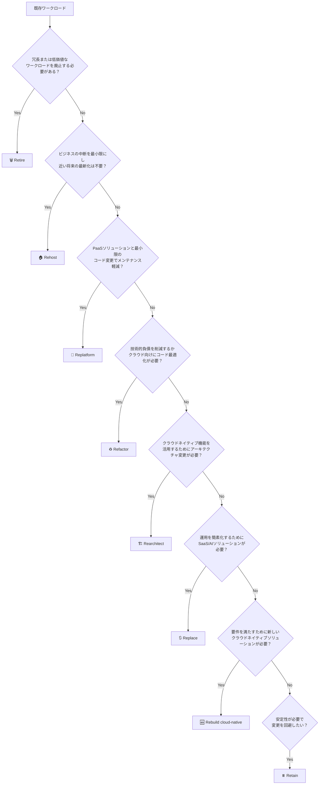

## はじめに

本記事では、**Azure Cloud Adoption Framework（CAF）** について解説します。CAFをすべて網羅するととても長くなってしまうため、今回は**計画フェーズの概略**を中心にお話しします。🎯

### 本記事の目的

- 🌩️ Azure向けCloud Adoption Frameworkとは何か？概要を知る
- 🏗️ Well-Architected FrameworkとともにAzureの導入をしてその設計と構築に役立つことを知る
- 📋 CAFの計画フェーズについて理解を深める

---

## Cloud Adoption Framework（CAF）とは？

**Cloud Adoption Framework（CAF）** は、Azureへのクラウド導入を成功させるための**Step by Stepのガイド**です。✨

### CAFの特徴

| 特徴 | 説明 |
|------|------|
| 📖 包括的なガイダンス | 人・プロセス・テクノロジーそれぞれの側面についての意思決定について語られている |
| 🎯 すべてのユーザー向け | Azureを使用するすべてのユーザーに提供されるガイド |
| ✅ 実証済みの手法 | 数千の組織での展開を通じて検証された方法論 |

> 💡 以下、Cloud Adoption Frameworkを**CAF**と略します。

CAFは、[Well-Architected Framework](https://learn.microsoft.com/ja-jp/azure/well-architected/) や [Azure Architecture Center](https://learn.microsoft.com/ja-jp/azure/architecture/) と統合され、セキュアでスケーラブル、かつレジリエントなクラウドソリューションの設計・構築・管理のためのエンドツーエンドのガイダンスを提供します。🔗

---

## CAFで語られていること（手法）

CAFは7つのコアメソドロジー（手法）で構成されています。最初の4つ（戦略→計画→準備→実施）は順番に実行し、残りの3つ（ガバナンス、セキュリティ、運用）は並行して継続的に実施します。⚙️

| CAF手法 | 説明 |
|---------|------|
| 🚀 **導入戦略（Strategy）** | ビジネス上の正当な理由と期待される結果を定義します |
| 📝 **計画（Plan）** | 戦略で定義されたビジネス目標をもとにクラウド導入計画をします |
| 🛠️ **準備（Ready）** | Azure環境とランディングゾーンを定義します |
| 🌐 **実施（Adopt）** | Azureでマイグレーション、モダナイゼーション、イノベーションを進めます |
| 🛡️ **ガバナンス（Govern）** | リスクを管理するガバナンスを確立します |
| 🔒 **セキュリティ（Secure）** | Azure環境を保護します |
| ⚙️ **運用（Manage）** | クラウド環境を運用して最適化します |

---

## CAFで語られていること（シナリオ）

CAFでは、特定のクラウドテクノロジーを導入するためのシナリオ別ガイダンスも提供されています。以下はほんの一例です。📂

| シナリオ例 | 説明 |
|-----------|------|
| 🤖 **AzureでのAI導入** | AzureでAIを正しい方法で使用する方法 |
| 🖥️ **Azure VMware Solution** | VMwareワークロードをAzureに移行する |
| 🔄 **ハイブリッドとマルチクラウド** | オンプレミスとクラウドのシステムを接続する |
| 🗃️ **Azure上のOracle DB** | AzureでOracleワークロードを移行および管理する |
| 📊 **SAP on Azure** | クラウドネイティブツールを移行してAzureでSAPを実行します |
| 🖥️ **Virtual Desktop** | Azure Virtual Desktopに移行して大規模なデスクトップを管理する |
| ⚡ **ハイパフォーマンスコンピューティング** | Azureでハイパフォーマンスコンピューティングワークロードを実行します |

---

## なぜCAFを使うのか？

CAFを活用することで、クラウド導入プロジェクトで一般的に発生する課題を解決できます。🎉

1. **移行リスクの大幅な軽減** - Fortune 500企業からスタートアップまで、数千の組織で検証された方法論
2. **クラウドコストの効果的な最適化** - リソースの適正化、コストガバナンス、運用効率のベストプラクティス
3. **展開タイムラインの大幅な短縮** - 計画、移行、最適化のための処方的なロードマップ
4. **セキュリティとコンプライアンスの初日からの確保** - 業界標準（SOC 2、PCI DSS、HIPAA）に沿った統合ガバナンスフレームワーク
5. **一般的な落とし穴の回避** - ガバナンスギャップ、セキュリティ脆弱性、コスト超過などの防止

---

## 計画フェーズの詳細

### 戦略から計画へ

導入戦略段階では「どのようにクラウドを導入していくのか？」「どのような目的でクラウドを導入するのか？」が明らかになりました！🎯

**計画段階ではその目的に沿った計画をしていきます。**

### 計画フェーズの手順

計画フェーズでは、以下の5つの手順でクラウド導入計画を策定します。📋

| 手順 | タスクの概要 |
|------|-------------|
| 🏢 **組織を準備する** | チームの責任・利害関係を明らかにしてそれらを明確化する |
| 👥 **ユーザーを準備する** | クラウド化に向けてのスキルギャップを明らかにしてそれを埋める |
| 🚚 **移行を計画する** | 既存のワークロードの移行を計画する |
| 💰 **クラウドコストの見積もり** | Azureアーキテクチャーを計画し適切なサービスを選択、サイジング・サービスレベルを選択デプロイ戦略を選択してコストを見積もる |
| 📄 **導入計画を文章化する** | 導入計画を文章化する。いわゆる、プロジェクト計画書 |

---

## 移行計画：何があるかを調べる（ワークロードインベントリ）

移行計画の最初のステップは、**現在の環境に何があるかを把握すること**です。🔍

### インベントリ作成の手順

| 手順 | 説明 |
|------|------|
| 📊 各ワークロードと境界を定義 | アプリケーションやサービスの範囲を明確にする |
| 🤖 自動検出ツールを使用 | Azure Migrateなどのツールで自動的に検出 |
| 🌐 すべての環境のすべてのコンポーネントを対象にする | 開発・テスト・本番すべての環境を網羅 |
| ✋ 自動化できないとき手動で | ツールで検出できない部分は手動で調査 |

> 💡 **ポイント**: 見落としがあると移行後に問題が発生するため、徹底的な調査が重要です！

---

## 移行計画：どのように移行するか？（8つのR戦略）

ワークロードのインベントリが完成したら、**各ワークロードをどのように移行するか**を決定します。これが有名な「**8つのR**」戦略です！🎯

| 移行戦略 | ビジネス戦略 | 主な指標 |
|----------|-------------|----------|
| 🗑️ **Retire** | 冗長または低価値、使用を停止する必要がある | ビジネス価値が制限されている。移行または最新化のコストがビジネス上の利点を上回る |
| 🏠 **Rehost** | ビジネスの中断を最小限に抑え近い将来に最新化をする必要がない | ワークロードはAzureと互換性がある。最新化の即時の必要性なし。Azureの経験がない。データーセンタースペースの解放 |
| 🔄 **Replatform** | ビジネス目標を達成するためにPaaSソリューションと最小限のコード変更が必要 | 信頼性とディザスターリカバリーを簡素化。OSとライセンスのオーバーヘッドを削減。アプリをコンテナー化する |
| ♻️ **Refactor** | ビジネス目標を達成するためにコード変更が必要 | メンテナンスコストの削減。技術的負債の削減。クラウド設計パターンの適用 |
| 🏗️ **Rearchitect** | ビジネス目標のためにアーキテクチャーの変更が必要 | アプリケーションのモジュール化またはサービス分解が必要。アーキテクチャーは将来のイノベーションに備える |
| 🔃 **Replace** | 運用を簡素化するためにSaaS・AIソリューションが必要 | カスタマイズの必要性がほとんどない |
| 🆕 **Rebuild** | 要件を満たすため新しいクラウドネイティブソリューションが必要 | レガシーシステムが古すぎるか柔軟性に欠ける。アプリケーションの迅速な構築・運用コストの削減・最新のフレームワークとツールが必要 |
| ⏸️ **Retain** | 安定性を必要とし変更を回避する | ワークロードは安定している。ビジネスニーズを満たしている。移行する短期的なドライバーなし。移行からのROIが低い |

### 移行戦略の選び方

```
┌─────────────────────────────────────────────────────────┐
│  ワークロードの状態を確認                                │
├─────────────────────────────────────────────────────────┤
│  ・価値がない → Retire（廃止）                          │
│  ・そのまま使える → Rehost（リホスト）                  │
│  ・少し変更 → Replatform / Refactor                     │
│  ・大幅変更 → Rearchitect / Rebuild                     │
│  ・SaaSで代替 → Replace                                 │
│  ・変更不要 → Retain（保持）                            │
└─────────────────────────────────────────────────────────┘
```

---

## 移行計画のフローチャート

移行戦略を選択する際は、以下のフローチャートに従って判断していきます。🔀

### スタートポイント：スタートアップかどうか？

まず最初の分岐点は「**スタートアップかどうか？**」です。

```
                    ┌─────────┐
                    │  Start  │
                    └────┬────┘
                         │
                         ▼
                ┌────────────────┐
                │  Startup？     │
                └───────┬────────┘
                   Yes/ \No
                     /   \
                    ▼     ▼
        ┌──────────────┐  ┌──────────────────┐
        │Build cloud-  │  │Existing workloads│
        │native        │  │→ 移行戦略を選択  │
        └──────────────┘  └──────────────────┘
```

- **スタートアップの場合（Yes）**: クラウドネイティブでゼロから構築 → **CAF Plan + CAF Ready + CAF Cloud-native** を使用
- **既存ワークロードがある場合（No）**: 移行戦略を選択 → **CAF Plan + CAF Ready + CAF Migrate + CAF Modernize** を使用

### 移行戦略の決定フロー

既存ワークロードがある場合、以下の質問に順番に答えていくことで適切な移行戦略が決まります。📋



### フローの質問一覧

| 順番 | 質問 | Yesの場合 |
|:----:|------|-----------|
| 1️⃣ | 冗長または低価値なワークロードを廃止する必要がある？ | **Retire** |
| 2️⃣ | ビジネスの中断を最小限にし、近い将来の最新化は不要？ | **Rehost** |
| 3️⃣ | PaaSソリューションと最小限のコード変更でメンテナンス軽減・信頼性向上？ | **Replatform** |
| 4️⃣ | 技術的負債を削減するか、クラウド向けにコード最適化が必要？ | **Refactor** |
| 5️⃣ | クラウドネイティブ機能を活用するためにアーキテクチャ変更が必要？ | **Rearchitect** |
| 6️⃣ | 運用を簡素化するためにSaaS/AIソリューションが必要？ | **Replace** |
| 7️⃣ | 要件を満たすために新しいクラウドネイティブソリューションが必要？ | **Rebuild** |
| 8️⃣ | 安定性が必要で変更を回避したい？ | **Retain** |

> 📖 **参考**: [Microsoft Learn - クラウド導入の旅をマップする](https://learn.microsoft.com/ja-jp/azure/cloud-adoption-framework/plan/prepare-organization-for-cloud#map-your-cloud-adoption-journey)

---

## 移行戦略は組み合わせて使う

実際のプロジェクトでは、**1つのワークロードに対して複数の移行戦略を段階的に適用する**ことがよくあります。🔄

### なぜ組み合わせるのか？

- ⏰ 一度にすべてを最新化するのはリスクが高い
- 💰 段階的に投資することでROIを確認しながら進められる
- 📉 ビジネス中断を最小限に抑えられる

### 同時に行われることが多い戦略

特に **Replatform と Refactor は同時に行われることが多い**です。

| 戦略の組み合わせ | 理由 |
|-----------------|------|
| 🔄 Replatform + ♻️ Refactor | PaaSに移行する際、コードの変更も必要になることが多い（例：接続文字列の変更、Azure SDKの導入、タイムゾーン対応など） |

例えば、VM上のアプリをApp Serviceに移行（Replatform）する際には：
- 🔧 環境変数の取得方法の変更
- 🔐 Azure Key Vault への接続コード追加
- 📊 Application Insights の計装
- ⏰ UTC対応やカルチャー設定の見直し

といったコード変更（Refactor）が必然的に発生します。そのため、実際のプロジェクトでは**ReplatformとRefactorを1つのフェーズとして計画する**ことが現実的です。

### 組み合わせの例

#### 例1: Rehost → Replatform + Refactor

```
┌─────────────┐    ┌──────────────┐    ┌───────────────────────┐
│  オンプレVM  │ →  │  Azure VM    │ →  │  App Service          │
│  (現状)     │    │  (Rehost)    │    │  (Replatform+Refactor)│
└─────────────┘    └──────────────┘    └───────────────────────┘
```

**シナリオ**: まずは素早くクラウドに移行（Rehost）し、安定稼働を確認後にPaaSへ移行。このとき、PaaS移行（Replatform）とコード最適化（Refactor）は同時に実施

#### 例2: Rehost → Rearchitect

```
┌─────────────┐    ┌──────────────┐    ┌─────────────────┐
│ モノリシック │ →  │  Azure VM    │ →  │ マイクロサービス │
│  アプリ     │    │  (Rehost)    │    │  (Rearchitect)  │
└─────────────┘    └──────────────┘    └─────────────────┘
```

**シナリオ**: データセンター閉鎖期限があるため、まずRehostで移行。その後、スケーラビリティ向上のためにマイクロサービス化（Rearchitect）

#### 例3: 複数ワークロードの異なる戦略

1つのシステムが複数のコンポーネントで構成されている場合、**コンポーネントごとに異なる戦略を選択**することもあります。

| コンポーネント | 移行戦略 | 理由 |
|---------------|----------|------|
| Webフロントエンド | 🆕 Rebuild | 古いフレームワークのため刷新 |
| APIサーバー | 🔄 Replatform | App Serviceへ移行 |
| データベース | 🏠 Rehost | Azure VMで互換性維持 |
| バッチ処理 | 🔃 Replace | Azure Logic Appsで代替 |
| レポートシステム | 🗑️ Retire | Power BIで代替のため廃止 |

> 💡 **ポイント**: 移行戦略は固定ではなく、ビジネス状況や技術的な成熟度に応じて**進化させていく**ものです！

---

それぞれの移行戦略について、詳しく見ていきましょう！🔍

### 🗑️ Retire（廃止）

**ビジネス価値を提供しなくなったシステムを廃止する**戦略です。

| 項目 | 内容 |
|------|------|
| 📌 概要 | ビジネス価値がない・使用されていない・冗長であるシステムを廃止 |
| ✅ 適用条件 | 他システムに重大な影響を与えない |
| 💡 メリット | インフラコスト削減、運用負荷軽減、セキュリティリスク低減 |

> 🧹 使わなくなったシステムを放置すると、セキュリティホールになる可能性があります。思い切って廃止しましょう！

---

### 🏠 Rehost（移行 / リフト＆シフト）

**最小限の変更でワークロードをAzureに移行する**戦略です。

| 項目 | 内容 |
|------|------|
| 📌 概要 | そのままの構成でAzureに移動する「リフト＆シフト」 |
| 🔄 移行パターン | オンプレミスVM → Azure IaaS |
|  | 他クラウドのIaaS → Azure IaaS |
|  | 他クラウドのPaaS → Azure PaaS |
| ⚠️ 注意点 | ワークロードが最新化を必要としないことを確認。モダナイズの可能性が高い場合は重複する投資を避けるために再設計を検討 |

> 🚀 最も速くクラウドに移行できる方法ですが、クラウドのメリットを最大限活かせない場合もあります。

---

### 🔄 Replatform（ホスティング環境の最新化）

**コードの変更を最小限に抑えてIaaSからPaaSに移行する**戦略です。

| 項目 | 内容 |
|------|------|
| 📌 概要 | インフラ管理費用を削減しスケーラビリティを向上させる |
| 🎯 目的 | OS・ミドルウェアの管理から解放される |
| ⚠️ 考慮事項 | PaaSに載せるために最小限のコード変更が必要になる場合あり（カルチャー、UTC対応など） |

**Replatformの例：**
- 🖥️ VM上のSQL Server → Azure SQL Database
- 🐳 VM上のアプリ → Azure App Service / Azure Container Apps
- 📦 VM上のコンテナ → Azure Kubernetes Service (AKS)

> 💰 インフラ管理の手間が大幅に減り、コスト削減とスケーラビリティ向上が期待できます！

---

### ♻️ Refactor（コードの最新化）

**レガシーコードを最新化して技術的負債を削減する**戦略です。

| 項目 | 内容 |
|------|------|
| 📌 概要 | Azureでの長期的な運用のために保守容易性を確保する |
| 🎯 目的 | 技術的負債の削減、パフォーマンス向上、可観測性の向上 |
| 🛠️ 手法 | Azure SDKやサービスを活用してクラウド設計パターンを適用 |

**Refactorで実現できること：**
- ✨ コードコストの最適化
- 📊 Azure Monitor / Application Insights との統合
- 🔐 Azure Key Vault によるシークレット管理
- 📈 クラウドネイティブな設計パターンの適用

> 🏗️ コードをより良くしていく作業です！

---

### 🏗️ Rearchitect（アーキテクチャとコードの最新化）

**マイクロサービスの導入などのためにアーキテクチャの再設計をする**戦略です。

| 項目 | 内容 |
|------|------|
| 📌 概要 | アプリケーションのモジュール化またはサービス分解 |
| 🎯 適用シーン | ビジネス目標を達成するのに必要なスケーリング能力が不足している場合 |
| 🔮 将来性 | アーキテクチャは将来のイノベーションに備える |

**Rearchitectの例：**
- 🔀 モノリシック → マイクロサービス
- 📨 同期処理 → イベント駆動アーキテクチャ
- 🌐 単一リージョン → マルチリージョン

> ⚡ 大規模な変更が必要ですが、将来のスケーラビリティと柔軟性を手に入れられます！

---

### 🔃 Replace（SaaS代替）

**商用SaaSソリューションを使用してカスタム開発と継続的なメンテナンスを排除する**戦略です。

| 項目 | 内容 |
|------|------|
| 📌 概要 | 既存システムをSaaSソリューションに置き換える |
| ✅ 適用条件 | SaaSソリューションが同等の機能を提供して要件を満たす場合 |
| 💡 メリット | 開発・運用コストの大幅削減、最新機能への自動アップデート |

**Replaceの例：**
- 📧 自社メールサーバー → Microsoft 365
- 📊 自社CRM → Dynamics 365 / Salesforce
- 💬 自社チャットシステム → Microsoft Teams

> 🎯 「自前で作る」から「買う」への発想転換。カスタマイズの必要性がほとんどない場合に最適！

---

### 🆕 Rebuild（クラウドネイティブのビルド）

**クラウドネイティブソリューションを使用した完全な再開発**です。

| 項目 | 内容 |
|------|------|
| 📌 概要 | ゼロからクラウドネイティブで再構築 |
| 🎯 適用シーン | レガシーシステムが古い場合や最新化が不可能な場合 |
| 💡 メリット | 最新のフレームワーク・ツールを活用、運用コストの削減 |

**Rebuildで活用するAzureサービス例：**
- ⚡ Azure Functions（サーバーレス）
- 🐳 Azure Container Apps
- 🌐 Azure Static Web Apps
- 📊 Azure Cosmos DB

> 🚀 最も労力がかかりますが、最もクラウドのメリットを享受できる戦略です！

---

### ⏸️ Retain（保持）

**ワークロードが安定しており、現在および将来にわたって現状のままでビジネスニーズを満たしている場合に選択**する戦略です。

| 項目 | 内容 |
|------|------|
| 📌 概要 | 現状維持。クラウドに移行しない |
| ✅ 適用条件 | ビジネスの継続性の要件のため移行できない場合 |
| 🔄 再検討 | この制約が取り払われたあとで再度検討する |

**Retainを選択するケース：**
- 🔒 規制やコンプライアンス上の制約
- 📉 移行のROIが低い
- 🏭 特殊なハードウェアに依存
- ⏰ サポート終了が近く、廃止予定

> ⏳ 「今は移行しない」という判断も立派な戦略です。ただし、定期的に再評価しましょう！

---

## まとめ

Azure Cloud Adoption Framework（CAF）は、クラウド導入を成功に導くための包括的なガイドです。

今回は計画フェーズの概要と8つの移行戦略について解説しました。CAFを活用して、クラウド移行を成功させましょう！🚀

## 参考リンク

- [Microsoft Cloud Adoption Framework for Azure](https://learn.microsoft.com/ja-jp/azure/cloud-adoption-framework/overview)
- [Azure Well-Architected Framework](https://learn.microsoft.com/ja-jp/azure/well-architected/)
- [Azure Architecture Center](https://learn.microsoft.com/ja-jp/azure/architecture/)
