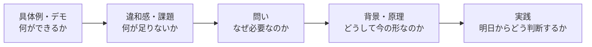

## はじめに

新しく登場した技術や製品について、使い方や機能を紹介することは大切です。実際に触ってみたい人にとって、具体的な手順やデモは大きな助けになります。

一方で、私は以前から、How To だけで登壇を組み立てることに少し違和感がありました。

手順は分かりやすい。しかし、それだけでは「なぜこの機能が存在するのか」「なぜ今、この製品がリリースされたのか」という、私が本当に知りたいところまで届かないように感じていたからです。

そんな違和感が、性格分析をきっかけに言語化されました。本記事では、その気づきから、これからの技術登壇をどのように組み立てたいと考えたのかを整理します🎤

:::message
本記事における性格分析は、専門家による心理診断ではありません。性格タイプで人の行動を決めつけるものではなく、自分の関心や考え方の傾向を振り返るための補助線として扱っています。
:::

## 性格分析で言語化された違和感

性格分析について対話した記録では、私の登壇スタイルが次のように表現されていました。

> 「最新技術を題材にして、普遍的な学びを伝える人」

— [INTJ-AについてCopilotと対話しながら性格を深掘りしたログ](https://gist.github.com/tomokusaba/27f93353d393ba3cba3baa490f029c45)

この言葉を見たとき、これまで抱えていた違和感にとても納得しました。

私は新しい技術そのものに興味がないわけではありません。むしろ、新しい技術や製品は好きです。しかし、新機能を知ったときに気になるのは、操作方法だけではありません。

なぜその機能が必要になり、どのような課題を解決するためにその形が選ばれたのかが気になります。さらに、過去の技術や設計思想とのつながり、提供者が利用者や市場を導こうとしている方向、そして、その技術によって開発や仕事の前提が今後どう変わるのかまで知りたいと思います。

つまり、私が知りたいのは機能の一覧ではなく、機能の背後にある文脈だったのです。

## How To は大切だが、賞味期限がある

How To を否定したいわけではありません。

初めて製品を触る人にとって、環境構築、基本操作、動くサンプルは欠かせません。登壇後すぐに試せる情報は、分かりやすい価値になります。

ただし、具体的な操作方法は製品の更新とともに変わります。画面構成が変わる、コマンドが変わる、より便利な機能に置き換わる、といったことは珍しくありません。

一方で、人間と AI はどこで責任を分けるべきか、品質を保証するには何を確認すべきか、なぜその設計が選ばれたのか、新しい技術をどのような基準で採用すべきか、といった問いは、製品が変わっても残り続けます。

私は、登壇を聞いている間だけ役に立つ情報ではなく、別の技術に出会ったときにも使える判断の軸を持ち帰ってほしいのだと思います。

| 登壇で扱うもの | 聞き手が得られるもの | 時間が経ったとき |
|---|---|---|
| 🛠️ 機能・操作方法 | すぐに試せる具体的な手順 | 製品の更新で変わりやすい |
| 🧭 背景・設計意図 | 機能を理解するための文脈 | 別の機能を理解するときにも役立つ |
| 🧠 原理・判断基準 | 自分で考えるための軸 | 技術が変わっても応用しやすい |

新技術を入口にしながら、長く使える考え方に着地する。これが、私が登壇で大切にしたいことです。

## 自分が話したいことと、聞き手が知りたいこと

ここで、別の課題にも気づきました。

私にとっては「なぜ」が面白くても、すべての聞き手が同じ順番で知りたいとは限りません。参加者の中には、まず「何ができるのか」「明日から何をすればよいのか」を知りたい人もいます。

本質や背景の話から始めると、聞き手には次のように受け取られるかもしれません。

> 話は興味深いけれど、自分の仕事にどう使えばよいのだろう？

私が「こういう話を好む人は、それほど多くないかもしれない」と感じたのも、この入口の違いによるものだと思います。ただし、これは性格タイプごとの人数を示す話ではなく、これまでの登壇や対話から得た私自身の感覚です。

大切なのは、私の関心を多数派に合わせて消すことではありません。**話したい本質と、聞き手が入りやすい入口を分けて設計すること**です。

## How から入り、Why を通って、How に戻る

そこで今後は、How と Why のどちらかを選ぶのではなく、役割を分けて組み合わせたいと考えています。

私に合いそうなのは、次の流れです。

### 1. 具体例で入口をつくる

最初に、新機能やデモを見せます。聞き手は「自分に関係がありそうか」を判断できます。

### 2. 違和感を共有する

便利さだけで終わらせず、その機能だけでは解決できない課題や、見落としやすい前提を示します。ここで、単なる製品紹介から問いのある登壇へ切り替えます。

### 3. 背景と原理を掘り下げる

なぜその機能が生まれたのか、過去の技術とどうつながるのか、提供者は何を変えようとしているのかを考えます。ここが、私自身が最も面白いと感じる部分です。

### 4. もう一度、実践に戻す

最後に「では、明日から何をするのか」へ戻します。特定の製品だけで使える手順ではなく、技術を選び、設計し、品質を確認するときの判断基準としてまとめます。

この構成なら、具体的な情報を求める人には入口と実践を、本質を掘り下げたい人には背景と原理を届けられます。

## 持ち帰りを層に分ける

一つの登壇で、すべての参加者に同じ深さまで理解してもらうのは難しいものです。そこで、持ち帰ってほしいものを複数の層に分けます。

- 🥡 すぐに使えるもの: コマンド、設定、確認方法
- 🗺️ 次に調べるためのもの: 用語、関連技術、歴史的なつながり
- 🧭 長く使えるもの: 原理、判断基準、問いの立て方

登壇を聞いた直後はコマンドだけが役立つかもしれません。数か月後に別の製品を検討するとき、設計意図や判断基準を思い出してもらえるかもしれません。

すべてを一度に理解してもらうのではなく、聞き手が必要な層を持ち帰れるようにする。この考え方なら、話の深さと分かりやすさを両立できそうです。

## 今後の登壇準備で確認したいこと

性格分析で得た気づきを、登壇準備のチェック項目に変えてみます。

### テーマを決めるとき

- この技術の、どの「なぜ」に私は引かれたのか
- 機能の背後には、どのような課題や歴史があるのか
- 製品が変わっても残る問いは何か

### 構成を決めるとき

- 聞き手が入ってきやすい具体例があるか
- 抽象的な話が続く前に、実例を置いているか
- 背景を知ることが実践にどう結びつくかを示しているか

### まとめを作るとき

- 「面白かった」だけでなく、判断の軸を持ち帰れるか
- 聞き手が明日からできる行動を示しているか
- その行動が必要な理由まで伝わるか

私に必要なのは、本質的な話を減らすことではありません。**本質へ向かう道筋と、本質から実践へ戻る道筋を丁寧につくること**なのだと思います。

## おわりに

性格分析によって、私は「How To が嫌いなのではなく、How To だけで終わることに物足りなさを感じていた」と気づきました。

機能の使い方だけでなく、その機能が存在する理由、そこに至るまでの歴史、製品を世に出した意図が気になる。そして、そこから別の技術にも応用できる考え方を抽出したい。この関心は、これからも私の登壇の中心になると思います。

一方で、自分が面白いと思う順番のまま話すだけでは、聞き手に届かないことがあります。だからこそ、How を入口にし、Why を掘り下げ、最後にもう一度 How へ戻る。聞き手が入ってきやすい入口と、自分が本当に伝えたい問いを両立させることが、今後の登壇戦略です。

性格分析は、登壇内容を決める答えではありません。しかし、なぜ自分がその問いに引かれるのかを知り、強みを意図的に設計するためのきっかけにはなりました。

流行している技術を紹介するだけではなく、**流行りの技術から長く使える学びを抽出する**。そんな登壇を、これからもつくっていきたいと思います。