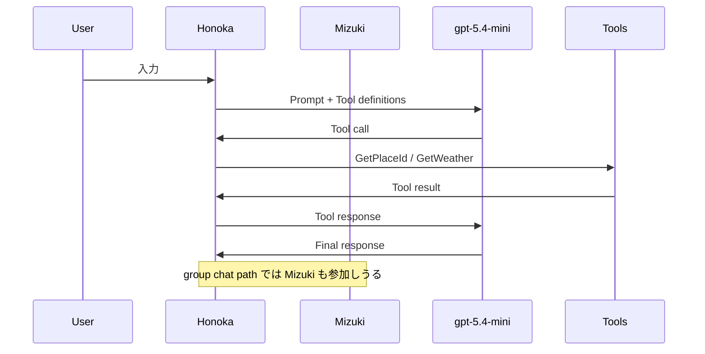

## はじめに

以前、私は [Microsoft Agent Framework の可観測性](https://zenn.dev/tomokusaba/articles/068f4ecac2d081) という記事で、Application Insights に Microsoft Agent Framework のテレメトリが入ると何が見えるのかを広く紹介しました。

今回はその続編として、**Azure Monitor / Application Insights の `Agents (Preview)` から 1 件の実行詳細を開くと、実際にどこまで読めるのか**に絞って整理します。特に、IIS hosted の ASP.NET Core / Blazor アプリで Agent Framework を動かしているときに、どのエージェントが動いたか、どのツールを呼んだか、トークンをどれだけ使ったか、プロンプトやツール応答がなぜ見えるのかを確認したい方向けです。🔍

観測対象の全体像ではなく、Agent details を調査・検証にどう使うかにフォーカスします。逆に言うと、「まずは広く全体像を知りたい」という方は前回記事から入るほうがわかりやすいと思います。本記事では、詳細ビューをどう読むかを知りたい方向けに絞って書いていきます。

## 本記事のゴール

この記事では、次の点が分かるようになることを目指します。

- `Agents (Preview)` の概要タイルで何を一目で把握できるか
- 1 件のトレース詳細から、エージェント / ツール / モデル / トークン / プロンプト / 応答をどう読むか
- なぜ詳細なメッセージ内容まで見えるのか
- `EnableSensitiveData = true` を本番常用の推奨設定として扱うべきではない理由

読み終えるころには、Azure portal を開いたときに「この実行で何が起きたのか」をかなり具体的に追えるようになるはずです。では、まず前提の構成から見ていきます。

## 前提: 今回のアプリ構成

今回の題材は、IIS hosted の ASP.NET Core / Blazor アプリです。Agent Framework の OpenTelemetry を Azure Monitor / Application Insights に送る構成で、`Program.cs` では OpenTelemetry と Azure Monitor の送信先を設定し、`AgentFrameworkLogic.cs` ではエージェントとツールを構成しています。

- [Program.cs](https://github.com/tomokusaba/BlazorServerChat2/blob/a/BlazorServerChat2/Program.cs)
- [AgentFrameworkLogic.cs](https://github.com/tomokusaba/BlazorServerChat2/blob/a/BlazorServerChat2/Data/AgentFrameworkLogic.cs)

以下のコードは、上記の実装を説明しやすいように要点だけ抜き出した抜粋です。

### OpenTelemetry と Azure Monitor の設定

まず、`Program.cs` 側では OpenTelemetry の tracing / metrics を有効にし、Agent Framework 関連の `ActivitySource` を Application Insights に流す形になっています。

```csharp
builder.Services.AddOpenTelemetry()
    .ConfigureResource(resource => resource.AddService(openTelemetrySourceName))
    .WithTracing(tracing => tracing
        .AddSource(openTelemetrySourceName)
        .AddSource("*Microsoft.Extensions.AI")
        .AddSource("*Microsoft.Extensions.Agents*")
        .AddAspNetCoreInstrumentation()
        .AddHttpClientInstrumentation())
    .WithMetrics(metrics => metrics
        .AddMeter("*Microsoft.Agents.AI")
        .AddAspNetCoreInstrumentation()
        .AddHttpClientInstrumentation());
```

Azure Monitor の接続先は `AzureMonitor:ConnectionString` や `APPLICATIONINSIGHTS_CONNECTION_STRING` などの構成から解決し、チャットクライアント側では Azure OpenAI に対して OpenTelemetry を有効化しています。

```csharp
var client = new AzureOpenAIClient(
    new Uri(baseUrl),
    new System.ClientModel.ApiKeyCredential(key))
    .GetChatClient(deploymentName)
    .AsIChatClient()
    .AsBuilder()
    .UseOpenTelemetry(
        sourceName: openTelemetrySourceName,
        configure: cfg => cfg.EnableSensitiveData = true)
    .Build();
```

この時点で、LLM 呼び出し・ツール呼び出し・トークン使用量の元になる span が Azure Monitor 側へ送られる準備が整います。つまり、Portal 上で見える情報は偶然ではなく、コード上の計装結果だと分かります。

### AgentFrameworkLogic 側の実行パス

今回のアプリでは `ChatClientAgent` が 2 つあり、Honoka と Mizuki がそれぞれ `.UseOpenTelemetry(_hostEnvironment.ApplicationName)` で包まれています。

さらに、共有の chat store / agent session を使いながら、次の 2 パターンで実行されます。

```csharp
// 単一エージェント実行
await _agent.RunAsync(input, _session);

// グループチャット実行
var workflow = AgentWorkflowBuilder
    .CreateGroupChatBuilderWith(agents =>
        new RoundRobinGroupChatManager(agents)
        {
            MaximumIterationCount = 5
        })
    .AddParticipants(_agent, _mizukiAgent)
    .Build();
```

また、ツールとしては `GetPlaceId`、`GetWeather`、さらに反映プラグイン由来の `Muse_*` 系が登録されています。

この構成から分かるのは、`Agents (Preview)` では単純な 1 エージェント実行だけでなく、複数エージェントのワークフロー実行も見分けられる可能性があるという点です。次のセクションでは、なぜ詳細情報まで見えるのかを整理します。

## なぜプロンプト / ツール / 応答の詳細まで見えるのか

ここは UI の読み方に入る前に、なぜそこまで見えるのかを先に押さえておきます。

結論から言うと、**このサンプルで詳細な内容まで確認できたのは `EnableSensitiveData = true` を有効にしているから**です。

Microsoft Learn の [`OpenTelemetryChatClient.EnableSensitiveData`](https://learn.microsoft.com/dotnet/api/microsoft.extensions.ai.opentelemetrychatclient.enablesensitivedata?view=net-10.0-pp&WT.mc_id=DT-MVP-5004827) には、既定ではトークン数などのメタデータは含まれる一方、**生の入力 / 出力、function call arguments、function call results は含まれない**と書かれています。

そのため、API ドキュメントから直接言えるのは次の範囲です。

| 項目 | `EnableSensitiveData = false` | `EnableSensitiveData = true` |
|------|-------------------------------|------------------------------|
| 🪙 トークン数などのメタデータ | 含まれる | 含まれる |
| 💬 生の入力 / 出力メッセージ | 含まれない | 含まれる |
| 🧩 Function call arguments / results | 含まれない | 含まれる |

一方で、Portal 上でどのタイルやどのプロパティがどう見えるかは、Azure Monitor 側の UI と SDK 側の計装結果の組み合わせで決まります。本記事では、その中でも今回のサンプルで **2026-07-05 時点に観測できた内容**として読み方を整理します。

:::message alert
`EnableSensitiveData = true` は、**調査や検証のために中身を見たいときの設定**です。通常の本番運用で常時有効にすることは、私はおすすめしません。プロンプト、会話履歴、ツール定義、ツール引数、生成結果が記録されうるため、個人情報や業務機密が混ざる設計では特に慎重に扱う必要があります。
:::

この注意点を理解したうえで使うと、Agent details は非常に強力な調査画面になります。そこで次は、概要タイルで何が見えるかを具体例で見ていきます。

## Agents (Preview) でまず見えること

Azure portal で Application Insights を開き、**Agents (Preview)** に入ると、まずは「何が何回動き、どれくらい消費したか」を俯瞰できます。詳しくは [Monitor AI agents with Application Insights](https://learn.microsoft.com/azure/azure-monitor/app/agents-view?WT.mc_id=DT-MVP-5004827) にまとまっています。

この画面が成り立っている土台は、OpenTelemetry の **GenAI semantic conventions** です。現在の仕様は [OpenTelemetry GenAI semantic conventions](https://github.com/open-telemetry/semantic-conventions-genai) 側で管理されています。Azure App Service の監視チュートリアルでも、Agent Framework を OpenTelemetry と GenAI semantic conventions で計装すると `Agents (preview)` で per-agent metrics を見られると説明されています。つまり、Portal が魔法のように解釈しているのではありません。OpenTelemetry / GenAI semantic conventions を前提とした計装結果が Azure Monitor に送られ、今回のサンプルではその結果が `Agents (Preview)` に反映されている、と読むのが適切です。

まずは、概要タイルで見える集計情報と、後で見る単一実行の詳細情報を分けて考えると読みやすいです。

| レイヤー | 主に見えるもの | 使いどころ |
|----------|----------------|------------|
| 📊 概要タイル | 実行回数、エラー、ツール種別、総トークン | どこを掘るべきかの当たりを付ける |
| 🔬 詳細ビュー | 実行経路、メッセージ、ツール引数/結果、finish reason | 1 件の実行で何が起きたかを追跡する |


今回のスクリーンショットでは、過去 24 時間の集計として次のような情報が確認できました。

| 項目 | 観測できた値 | 読み取りポイント |
|------|--------------|------------------|
| 🤖 Agent executions | 1 | 少なくとも 1 回はエージェント実行が成立している |
| ✅ Gen AI errors | 0 | 今回の観測範囲では失敗トレースなし |
| 🔧 Tool calls | `GetPlaceId` / `GetWeather` | どのツールが使われたかを即座に把握できる |
| 🧠 Model | `gpt-5.4-mini` | どのモデルが実際に使われたか分かる |
| 🪙 Total tokens | 約 29.3K | コスト感とコンテキスト量の目安になる |
| 📥 Input tokens | 約 28.9K | 入力比率が高いことが分かる |
| 📤 Output tokens | 418 | 出力は小さく、入力中心の実行だったと読める |

ここで特に重要なのは、「応答が短いのにトークン総量が多い」と分かる点です。これは、システムプロンプト、会話履歴、ツール定義、途中のツール応答が入力側に積まれている可能性を示します。

また、ツール名やモデル名はそのまま詳細画面への入口にもなります。つまり、この概要タイルは単なる KPI ではなく、「どこを掘るべきか」を決める索引として機能します。

## 1 件の実行詳細を開くと何が読めるのか

ここからは、集計画面ではなく単一実行の trace detail に視点を切り替えます。`Agents (Preview)` から対象の trace を開くと、Azure Monitor は end-to-end transaction details として、かなり細かい実行情報を見せてくれます。

### まず分かるのは「どのエージェント / ワークフローが動いたか」

単一エージェント実行なら、`_agent.RunAsync(input, _session)` に対応する 1 本の流れとして見えやすく、Honoka が 1 回の問い合わせを処理したことを追えます。

一方で、グループチャット実行を通した場合は、このサンプルでは Honoka と Mizuki が同じ session 上で参加した痕跡を trace から読み取れます。`RoundRobinGroupChatManager` を使っているため、参加者の切り替わりや iteration の積み重なりとして読めるわけです。

概念的には、次のような流れが trace に投影されます。



この時点で、どの経路を通った実行なのかをかなり切り分けやすくなります。次は、LLM work item 単位で見える情報です。

### LLM work item ではモデル・所要時間・トークンが読める

詳細スクリーンショットでは、`gpt-5.4-mini` の LLM work item が 1 件あり、次の値が見えていました。


| 項目 | 値 |
|------|----|
| 🧠 Model | `gpt-5.4-mini` |
| ⏱️ Duration | 1.8 秒 |
| 📥 Input tokens | 6462 |
| 📤 Output tokens | 171 |

これだけでもかなり実用的です。例えば次のように読めます。

- Duration が短いのに input tokens が大きい → 外部 API 待ちではなく、巨大なコンテキスト投入の可能性が高い
- output tokens が小さい → ツール呼び出し指示や短い中間応答の可能性がある
- 同じモデルで input が肥大化している → session 共有により履歴が蓄積している可能性がある

前回記事では「トークンが見える」こと自体を紹介しましたが、実運用ではここからさらに、なぜそのトークン量になったのかを掘るのが大事です。その答えは、Messages と custom properties にあります。

### Messages / custom properties でプロンプトとツールの中身が追える

今回の詳細ビューでは、Messages や custom properties に次のような情報が現れていました。

- `gen_ai.tool.definitions`
- `gen_ai.input.messages`
- `gen_ai.output.messages`
- `gen_ai.response.finish_reasons`
- `gen_ai.response.model`
- `gen_ai.usage.input_tokens`
- `gen_ai.usage.output_tokens`

OpenTelemetry GenAI semantic conventions では、[`invoke-agent-client-span`](https://github.com/open-telemetry/semantic-conventions-genai/blob/main/reference/reports/invoke-agent-client-span.md) で `gen_ai.input.messages` / `gen_ai.output.messages` / `gen_ai.tool.definitions` が opt-in の追加収集対象として整理されています。今回のサンプルでは `EnableSensitiveData = true` を有効にしているため、raw input / output や function call 関連の情報が収集され、その結果として Azure portal 側でもこれらの内容を確認できました。

これらをどう読むかを、実務目線で整理すると次の表になります。

| プロパティ | 何が分かるか | 調査で役立つ場面 |
|------------|--------------|------------------|
| 🧩 `gen_ai.tool.definitions` | モデルに渡したツール定義の一覧 | 余計なツールを渡していないか確認 |
| 💬 `gen_ai.input.messages` | system / user / tool response を含む入力履歴 | 入力肥大化の原因確認 |
| 🗣️ `gen_ai.output.messages` | tool call や最終応答の構造 | LLM が何を返したか確認 |
| 🏁 `gen_ai.response.finish_reasons` | `tool_calls` / `stop` などの終了理由 | なぜ応答が終わったかの判断材料 |
| 🤖 `gen_ai.response.model` | 実際に応答したモデル識別子 | 期待した deployment と一致するか確認 |
| 🪙 `gen_ai.usage.*` | 入出力トークン使用量 | コスト・履歴長・設計見直しの判断 |

実際の画面では、このサンプルではシステム指示、ツール呼び出しの応答、生成された出力本文まで確認できました。ここが本記事で一番伝えたいポイントです。

例えば、`GetPlaceId` と `GetWeather` が呼ばれたケースでは、Azure portal 上の情報だけでもかなりのところまで再構成できます。以下は実データの概念的な再構成例です。

```json
{
  "toolDefinitions": ["GetPlaceId", "GetWeather", "Muse_*"],
  "finishReasons": ["tool_calls", "stop"],
  "model": "gpt-5.4-mini"
}
```

さらに `gen_ai.input.messages` と `gen_ai.output.messages` を見れば、

1. system instructions がどう入っていたか
2. ユーザー入力がどう渡ったか
3. モデルがどのタイミングで `GetPlaceId` を選んだか
4. ツール結果を受けて `GetWeather` を呼び直したか
5. 最終的にどんな応答を返したか

を追えます。つまり、Agent details は「最終結果」だけでなく、入出力メッセージとツール呼び出しの構造化ログとして読めます。

### 「なぜその詳細が見えているのか」をコードに戻して理解する

ここまでの内容は、Azure portal の偶然の振る舞いではありません。前提節で見た設定に戻すと、理由は比較的はっきりしています。

```csharp
var client = new AzureOpenAIClient(
    new Uri(baseUrl),
    new System.ClientModel.ApiKeyCredential(key))
    .GetChatClient(deploymentName)
    .AsIChatClient()
    .AsBuilder()
    .UseOpenTelemetry(
        sourceName: openTelemetrySourceName,
        configure: cfg => cfg.EnableSensitiveData = true)
    .Build();
```

加えて、各エージェント側も次のように OpenTelemetry 化されています。

```csharp
_agent = new ChatClientAgent(...)
    .AsBuilder()
    .UseOpenTelemetry(_hostEnvironment.ApplicationName)
    .Build();

_mizukiAgent = new ChatClientAgent(...)
    .AsBuilder()
    .UseOpenTelemetry(_hostEnvironment.ApplicationName)
    .Build();
```

この 2 段構えにより、

- chat client 側で LLM 入出力やトークン情報
- agent 側でどのエージェントが何をしたか

がそれぞれ span として発行され、Application Insights の `Agents (Preview)` で 1 本の物語のようにたどれるようになります。ここが Agent Framework と OpenTelemetry の組み合わせの面白いところです。

ただし、ここまで見えること自体が本番では注意点にもなります。その前に、実際の調査でどう使うと役立つかを整理しておきます。

## 典型的な調査ユースケース

私はこの画面を、主に次の 3 つの目的で見るのが実用的だと感じています。

### 1. 想定どおりのエージェント / ツールが使われたか確認する

「Honoka だけで終わる想定だったのに Mizuki まで回っていないか」「`Muse_*` は今回不要なのに渡していないか」といった確認ができます。

特に `gen_ai.tool.definitions` が見えると、モデルに見せている選択肢そのものを点検できます。これはツールが多くなってきたときに効きます。

### 2. トークン消費の原因を切り分ける

トークンの総量だけ見ても、改善点は分かりません。ですが詳細ビューで

- 入力が大きいのか
- 履歴が長いのか
- ツール定義が多いのか
- system prompt が重いのか

を読めると、改善の方向が見えます。

今回の 24 時間集計では、約 29.3K トークンのうち、入力が約 28.9K でした。ここから、今回の実行は「長文回答を返した」のではなく、入力コンテキストの比重が大きい実行だと判断できます。

### 3. 期待外れの応答を再現可能な形で調査する

生成 AI の調査で難しいのは、「なんとなく変な答えだった」を技術的に分解しづらいことです。

その点、Agent details でシステム指示 / ツール / 応答の流れが見えると、

- system instructions が強すぎたのか
- ツール選択を誤ったのか
- ツール結果の取り込み方がおかしかったのか
- 最終応答の整形で崩れたのか

を段階ごとに切り分けられます。ここまで来ると、単なる監視画面ではなく、再現可能な調査画面として使えるようになります。

## 本番運用での注意点

ここはかなり大事です。`EnableSensitiveData = true` によって詳細ビューが強力になる一方、**見えてはいけないものまで見えるようにもなります**。

:::message alert
特に次の情報は、そのまま記録される可能性があります。

- システムプロンプト
- ユーザーメッセージ
- 会話履歴
- ツール定義
- ツール引数
- ツール結果
- 生成された応答本文

そのため、通常の本番運用で漫然と常時有効化するのではなく、**調査期間だけ限定的に有効化する**、対象環境を分ける、保存期間やアクセス権を絞るといった運用が必要です。
:::

`Agents (Preview)` で詳細に見えること自体はとても便利です。ただし、その便利さは「何を Azure Monitor に残しているかを理解している」ことが前提です。また、`Agents (Preview)` は Preview 機能なので、画面項目や見え方は将来変わる可能性があります。本記事の内容は **2026-07-05 時点の観測**として読んでください。最後に、本記事の内容をまとめます。

## まとめ

Microsoft Agent Framework の OpenTelemetry を Azure Monitor / Application Insights に送っている ASP.NET Core / Blazor アプリでは、`Agents (Preview)` から次のことをかなり具体的に追えます。

- どのエージェントが動いたか
- どのツールが呼ばれたか
- どのモデルが使われたか
- 入出力トークンをどれだけ消費したか
- プロンプト / ツール応答 / 生成結果に何が入っていたか

そして、**このサンプルでそこまで見えた理由は `EnableSensitiveData = true` を有効にしているから**です。既定ではトークンなどのメタデータ中心ですが、センシティブデータの収集を有効化すると、調査・検証には非常に有益な情報まで追えるようになります。

一方で、それは通常運用の既定値として軽く有効化してよい設定ではありません。調査目的で使うなら価値は大きいですが、**本番常用では情報の扱いを十分に設計する必要がある**と考えています。

もしこれから実際に試すなら、まずは次の Microsoft Learn を合わせて読んでおくと流れがつかみやすいです。

- [Monitor AI agents with Application Insights](https://learn.microsoft.com/azure/azure-monitor/app/agents-view?WT.mc_id=DT-MVP-5004827)
- [Tutorial: Monitor a multi-agent app on App Service with OpenTelemetry and Application Insights (.NET)](https://learn.microsoft.com/azure/app-service/tutorial-ai-agent-monitoring-dotnet?WT.mc_id=DT-MVP-5004827)
- [Microsoft Agent Framework Overview](https://learn.microsoft.com/agent-framework/overview/agent-framework-overview?WT.mc_id=DT-MVP-5004827)

前回の広めの紹介記事と読み比べると、今回は「見える」から一歩進んで「どう読むか」に焦点を当てた記事になっています。実際の調査の入口として、必要なときに見返してもらえたら嬉しいです。🛠️
