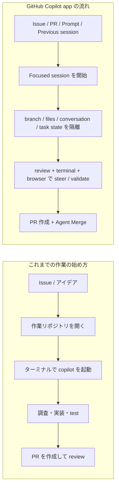

## はじめに

2026 年 5 月 14 日の GitHub changelog で、**GitHub Copilot app が technical preview に入った**ことが発表されました。公式の表現をそのまま借りると、これは **GitHub-native desktop experience** です。Issue や Pull Request、Prompt、Previous session といった **GitHub 上の仕事そのもの** を起点に、エージェント開発を始められるようになります。これはかなり大きな変化だと私は感じました🧭

私はこれまで、GitHub Copilot CLI と VS Code Agent Mode の使い分けや、複数エージェント設計について何本か記事を書いてきました。今回の発表を見て最初に思ったのは、**「新しい UI が増えた」よりも「ワークフローの単位が変わる」** ということです。

- [C# 開発者のための GitHub Copilot CLI と VS Code Agent Mode の使い分け](https://zenn.dev/tomokusaba/articles/838cdac8d71e52)
- [次の大きな作業は GitHub Copilot CLI から始めたくなる理由](https://zenn.dev/tomokusaba/articles/051dd7f79c1791)

特に気になったのは、changelog に **workflows** がはっきり出てきた点です。私は「ワークフローで記事を書く」ような反復作業にも関心があるのですが、GitHub Copilot app はまさにそうした **繰り返し可能なエージェント作業** を GitHub の文脈に載せて扱いやすくする方向に見えます✨

本記事では、まず **公式に確認できる事実** を整理したうえで、そこから見える **ワークフロー上の意味** を私なりに考察します。なお、執筆時点では **technical preview のため、仕様や UI は今後変わる可能性がある** 点も先に押さえておきます。

## 本記事のゴール

- GitHub Copilot app の technical preview で公式に発表されたポイントを把握する
- その発表が、エージェント開発のワークフローをどう変えそうか整理する
- Copilot CLI を使ってきた立場から見た「連続性」と「変化点」を切り分ける
- 導入前に気にしておきたい制約や注意点を確認する

ここから、まずは公式発表の要点を整理していきます。

## 公式発表の要点

今回の changelog で、GitHub は次のように説明しています。

> The GitHub Copilot app is now in technical preview. It’s a GitHub-native desktop experience to start agentic development from the work in front of you, keep it isolated, steer it as it goes, and land the change through pull request review.
>
> — [GitHub Copilot app is now available in technical preview](https://github.blog/changelog/2026-05-14-github-copilot-app-is-now-available-in-technical-preview/)

私はここで、単に「デスクトップアプリが出た」とは読んでいません。ポイントは **start / keep it isolated / steer / land the change** という流れが、最初から最後まで 1 本の体験として書かれていることです。つまり、**チャット開始の体験** ではなく、**仕事を進めて着地させる体験** が主役になっています。

まずは、公式に書かれていることと、私の読みを分けて整理します。

| 観点 | 公式に書かれていること | 私の読み |
|------|------------------------|----------|
| 🧭 作業の入口 | Issue / PR / Prompt / Previous session から session を始められる | 作業開始地点が「作業ディレクトリ」から **GitHub 上の仕事の単位** に寄っていく |
| ⚡ セッション | 各 session は branch / files / conversation / task state を持ち、分離される | 並行作業時のコンテキスト汚染を減らしやすい |
| 🔁 workflow | Skills や prompts を workflows にして、反復作業を自動化できる | 「毎回同じことを頼む」を、**手順ではなく資産** にできる |
| ✅ 出荷まで | review / terminal / browser / PR flow / Agent Merge が 1 か所にある | 実装だけでなく **steer・validate・ship** のループが短くなる |

私が「画期的」と感じる理由もここにあります。これまで GitHub Copilot CLI で大きめの作業を始めるとき、まずは **対象リポジトリのディレクトリを開き、ターミナルを起動し、`copilot` を始める** という初動がありました。これは十分に強力ですが、裏返すと **入口がファイルシステム側** です。

一方、GitHub Copilot app では入口が最初から **Issue や PR、過去の session** です。これは、エージェントの起点が「このフォルダで何をするか」から「この仕事をどう終わらせるか」へ寄ることを意味します。ここがかなり大きいと感じています🚀

もう 1 つ重要なのは、CLI との関係です。changelog には、technical preview を使うには **管理者側で previews を有効化し、Copilot CLI を policy settings で有効化しておく必要がある** とあります。さらに公式 docs では、GitHub Copilot app について **The app is built on GitHub Copilot CLI** と明記されています。そのため、**Copilot CLI の作業モデルと地続きの体験** と読むのは、執筆時点では私見ではなく公式情報に沿った理解です。CLI を使ってきた人ほど自然に入りやすいのではないか、と感じます。

ここまでが、まず押さえておきたい公式発表の要点です。次は、それが実際の作業フローをどう変えるのかを見ていきます。

## 変化をフローで見る

まずは、CLI 中心の初動と GitHub Copilot app の初動を対比してみます。

| 項目 | これまでの初動でよくあったこと | GitHub Copilot app で見える変化 |
|------|--------------------------------|----------------------------------|
| 🚪 入口 | 作業ディレクトリを開いてから始める | Issue / PR / Prompt / Previous session から始める |
| 🧩 並行作業 | ブランチ、メモ、会話の文脈を自分で切り分ける | session ごとに branch / files / conversation / task state が分離される |
| 🗂️ リポジトリ横断 | 手元で複数 repo / worktree を意識して持ち替える | **connected repositories** をまたいで inbox や projects から作業しやすい |
| 🔁 定型作業 | 毎回同じ prompt や手順を思い出す | skills / prompts を workflows に持ち上げられる |
| ✅ 終了処理 | test、preview、PR、review を別ツールで行き来しがち | terminal / browser / review / PR flow / Agent Merge が近い |

この変化をフローで描くと、私は次のように見えます。

### 1. 作業の入口が GitHub artifact になる

これは体験としてかなり大きいです。GitHub Copilot CLI に慣れていると、どうしても最初に **「どのディレクトリでコンソールを開くか」** を考えます。もちろん、それ自体は悪いことではありません。

ただ、GitHub Copilot app はそこを 1 段抽象化して、**「どの仕事から始めるか」** を先に持ってきます。これは、手元の作業ディレクトリでコンソールを開いてから考え始める必要が薄くなるという意味でもあります。**起動時の摩擦が下がる**ので、ちょっとした調査やレビューの継続もしやすくなりそうです。

特に、Previous session から再開できるのは、長めのタスクと相性が良さそうです。途中で止めても、「何をどこまでやっていたか」を session 単位で持ち帰れるからです。ここが次の focused session の話につながります。

### 2. focused session が「並行作業」を扱いやすくする

公式には、各 session が **branch / files / conversation / task state** を持つと説明されています。私はここを、**コンテキスト隔離がプロダクトの表面に出てきた** と読みました。

たとえば、次の 3 つを同時に進める状況を考えてみてください。

- バグ修正の PR コメント対応
- 依存関係更新
- 新機能の設計メモ作成

これまでは、ブランチ、ターミナル、メモ、会話履歴を人間側で強く意識して持ち替える必要がありました。GitHub Copilot app では、その切り替え単位が最初から session として見えているので、**今どの仕事の文脈にいるのか** を保ちやすくなります。ここは、エージェントを「賢いチャット」ではなく「進行中の仕事の器」として扱う発想に近いです🧠

### 3. 実装後の「確認して出す」までが近くなる

私はエージェント開発でいちばん大事なのは、実はコードを書かせる瞬間ではなく、**書かれたものをどう steer して、どう validate して、どう出荷するか** だと思っています。

changelog が review、integrated terminal、browser、PR flow、Agent Merge を 1 つの節にまとめているのは象徴的です。これは **「コードが書けたら終わり」ではない** というメッセージに見えます。

特に Agent Merge が最初から文脈に入っているのは面白いです。レビューコメント対応、失敗した checks の修正、条件が揃ったら merge まで追う、という **フォローアップ込みのワークフロー** が前提に入ってきています。ここまで来ると、もはや単純なチャット UI の話ではありません。

ここまでは、主に機能差分と作業フローの変化でした。次は、それを運用に持ち込んだときに何がうれしいのか、workflow 観点で掘り下げます。

## ワークフロー上の意味

私が今回もっとも気になったのは、次の一文です。

> Turn skills and prompts into workflows for triage, dependency updates, release notes, cleanup, or routine pull requests.
>
> — [GitHub Copilot app is now available in technical preview](https://github.blog/changelog/2026-05-14-github-copilot-app-is-now-available-in-technical-preview/)

これを見て、私は **「ワークフローで記事を書く」ような使い方まで視野に入る** と感じました。もちろん changelog に「記事執筆」とは書かれていませんが、**反復可能な知的作業を workflow に上げる** という方向性はかなり明確です。

### 1. 反復作業を「思い出すもの」から「資産」に変えられる

これまで反復作業をエージェントに任せるとき、私は毎回こんなことを考えていました。

- どの repo で始めるか
- どの prompt を最初に投げるか
- どの review 手順を最後に通すか
- いつ test や preview を挟むか

この「毎回思い出す」は、地味に疲れます。workflow 化の価値は、ここを **個人の記憶ではなく再利用可能な流れ** に置き換えられるところにあります。

たとえば、Zenn 記事を書くワークフローなら、私は次のように揃えたくなります。

| ステップ | 手作業でやると揺れやすいこと | workflow 化したいこと |
|----------|------------------------------|-----------------------|
| 📝 下書き開始 | どの repo / ブランチ / テンプレートで始めるか | 記事リポジトリと初期 prompt を固定する |
| 🔎 情報収集 | 一次情報確認や関連記事参照を忘れる | source check と style check を流れに含める |
| ✍️ 執筆 | 見出し構成や front matter がぶれやすい | skill / prompt に構成とルールを埋め込む |
| 🧐 仕上げ | 校正・ファクトチェック・PR 作成の順番がぶれる | review ステップを workflow に含める |

これができると、「うまく書ける日」と「手順を忘れる日」の差が小さくなります。つまり、**作業の再現性** が上がります。

### 2. 起動時の摩擦が下がる

GitHub Copilot CLI をよく使う立場から見ると、やはり初動には少し儀式があります。作業ディレクトリへ移動し、必要なら worktree を切り、ターミナルで `copilot` を始める。この流れは強力ですが、**「今すぐこの Issue を見たい」** という温度感には少し重いことがあります。

GitHub Copilot app では、少なくとも changelog の説明上は、GitHub コンテキストから session を始められます。これは、**作業開始の手前にあるコンソール操作を短くできる** ということでもあります。私はここをかなり歓迎しています。エージェント開発が強くなるほど、むしろ重要になるのは「賢さ」より **始めやすさ** だからです。

### 3. CLI で感じていた「再現可能な実行」に近づく

ここは公式の明示ではなく、私の実務上の感覚です。私は Copilot CLI で **よく使うコマンドや入口をあらかじめ揃える** ことがあります。たとえば `/fleet` のようなコマンドを定常的に使う運用にしておくと、**毎回使う入口を思い出すコスト** が減り、同じ種類の仕事を繰り返しやすくなります。

GitHub Copilot app の workflow は、この考え方をさらに一段進めるものに見えます。つまり、

- 「よく使う prompt を覚えておく」
- 「この作業ではこの流れを踏む」
- 「最後はこの review / PR パスに乗せる」

といった暗黙知を、**アプリの workflow として外に出せる** 可能性があるわけです。これは、作業をより **repeatable** にし、結果として **ぶれにくい運用** を作りやすくするはずです🔁

:::message
`/fleet` そのものが GitHub Copilot app でどう見えるかは、今回の changelog では明示されていません。本記事で触れているのは、**Copilot CLI で私が感じてきた「再現可能な作業」の利点と、workflow 化の思想がよくつながる** という観点です。また、`/fleet` 自体の位置づけや提供条件は Copilot CLI 側の公式ドキュメントを別途確認するのが安全です。
:::

ここまで見ると、GitHub Copilot app の価値は「CLI を置き換える」より、「CLI で見えていたワークフローの価値を GitHub-native な入口に持ち上げる」に近いように思えます。

## 気になった点 / 注意点

便利そうに見える一方で、執筆時点ではいくつか注意しておきたい点もあります。

### 1. まだ technical preview である

これは当然ですが、まだ正式版ではありません。UI、用語、細かな操作感、できること / できないことは今後変わる可能性があります。この記事の読みどころは「確定仕様の暗記」ではなく、**どの方向へ進んでいるか** を掴むことだと思ってください。

### 2. 利用条件には rollout と管理者設定がある

:::message alert
changelog では、Pro / Pro+ は early access のサインアップ、Business / Enterprise は順次 rollout とされています。また、Business / Enterprise では、**admin が previews を有効化し、Copilot CLI を policy settings で有効化している必要がある** と明記されています。
:::

つまり、使いたくてもすぐ全員が同じ状態になるわけではありません。組織利用では、まず管理者設定と rollout 状況を確認した方がよさそうです。

### 3. 「任意のリポジトリを何でも横断できる」とまではまだ書かれていない

今回の changelog にあるのは、**connected repositories** や **across projects** という表現です。私はここから「複数リポジトリをまたぐ作業がかなりやりやすくなる」と読みましたが、**完全に任意のリポジトリを横断できる** とまではまだ断言しない方が安全です。

この手の機能は便利になるほど、権限、レビュー境界、どの repo のどの branch に変更が入るのか、といった管理が大事になります。session の分離があるとはいえ、**最後の人間レビューはむしろ重要になる** と見ています。

### 4. changelog と docs では書かれ方が少し違う

先ほども書いたとおり、changelog 本文だけを見ると **GitHub Copilot app is built on GitHub Copilot CLI** という表現は出てきません。一方で、公式 docs にはそのように明記されています。

つまり、**changelog 単体で読めること** と **docs まで含めて分かること** は少し層が違います。この点を分けて受け止めておくと、今後ドキュメントが増えたときにも追いやすいです。

注意点を押さえたうえで見ると、それでもなお workflow の価値はかなり大きいと感じます。最後に、私の現時点の所感をまとめます。

## おわりに

GitHub Copilot app の technical preview を見て、私がいちばん強く感じたのは、**エージェント開発の主語が「コマンド」から「session と workflow」へ寄ってきた** ことです。

Issue や PR から始め、focused session で文脈を分け、review・terminal・browser・PR flow・Agent Merge までを 1 つの場所でつなぐ。これは単なる便利アプリというより、**仕事の流し方そのものを変える提案** に見えます。

そして Copilot CLI を使ってきた立場から見ると、この app は対立物というより、**CLI で見えていた価値を GitHub-native な desktop experience に持ち上げる試み** に見えます。作業ディレクトリでコンソールを開く前に、まず GitHub 上の仕事から始められる。この違いは思っている以上に大きいはずです。

私は今後、依存関係更新や定型レビューだけでなく、記事執筆のような作業も workflow に寄せられないかを見ていきたいと思っています。**「毎回うまくやる」ではなく「毎回同じように始められる」** を作れるなら、エージェント開発はもっと日常の仕事に馴染んでいくはずです🛠️

## 参考リンク

- [GitHub Copilot app is now available in technical preview](https://github.blog/changelog/2026-05-14-github-copilot-app-is-now-available-in-technical-preview/)
- [GitHub Copilot app documentation](https://gh.io/github-copilot-app-docs-main)
- [GitHub Copilot app early access](https://gh.io/github-copilot-app?utm_source=changelog-github-copilot-app&utm_medium=changelog&utm_campaign=github-copilot-app-tech-preview-2026)
- [C# 開発者のための GitHub Copilot CLI と VS Code Agent Mode の使い分け](https://zenn.dev/tomokusaba/articles/838cdac8d71e52)
- [次の大きな作業は GitHub Copilot CLI から始めたくなる理由](https://zenn.dev/tomokusaba/articles/051dd7f79c1791)
