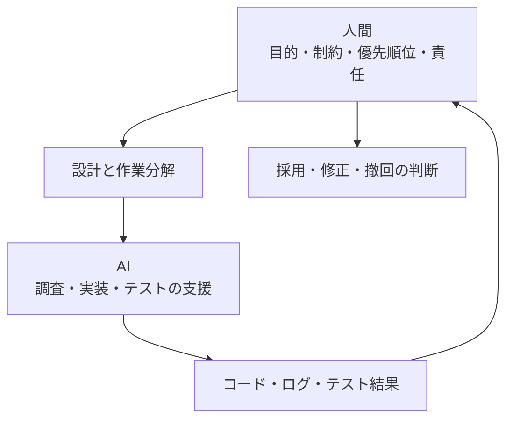

## はじめに

GitHub Copilot や Claude Code などの AI コーディングツールが、開発者の身近な存在になってきました。

「アイデアがあり、それを AI に正しく伝えられれば、形にできる」

この考え方は、たしかに一面では真実です。以前なら何日もかかっていた調査や実装のたたき台を、短い時間で作れることがあります。小さなアプリケーションであれば、アイデアを動くものにするまでの距離は、確実に短くなりました。

しかし、この事実から「AI があればプログラマーはいらない」と結論づけるのは危険です。

ここでいうプログラマーは、コードを入力する人だけを指していません。何を作るべきかを考え、システムの境界を設計し、品質とリスクを判断し、運用に責任を持つ人を含んでいます。コードを書く作業の一部を AI に任せられるようになっても、プロダクトを成立させる仕事そのものがなくなるわけではありません。

私は、この言葉をそのまま信じることには、少し注意が必要だと感じています。

AI はアイデアを形にしてくれます。しかし、その形にしたものをプロダクトとして運用に耐えられる状態にできるかは、別の問題です。

この問題意識には、これまで AI コーディングと技術選定について書いてきた記事があります。

- [AI 時代の技術選定で考えたいこと](https://qiita.com/tomokusaba/items/51bae2d3ff213418f176)
- [AI が書いたコードを、人間が検証できる技術で支える](https://qiita.com/tomokusaba/items/7708b19bbb6bdbba9d86)

前者では、流行や AI の提案だけでなく、チームが人間の力で使い続けられるかを技術選定の軸にしました。後者では、コードが動くことと、問題が起きたときに原因を追い、対処できることは別だと整理しています。

今回はそこからさらに一歩進めて、なぜ「AI があればプログラマーはいらない」という見方が危険なのかを考えます。

## 「動く」と「使い続けられる」の間

AI に依頼すると、画面が表示され、データが保存され、想定した操作ができるところまでは比較的早く到達できます。

そこまでは、AI の得意な領域です。要求をコードへ変換し、局所的なエラーを解消し、既存の実装パターンに沿って機能を追加する能力は、とても高いと感じます。

しかし、プロダクトとして使い続けるには、別の問いに答えなければなりません。

- 障害が起きたときに、原因を追跡できるか
- データが増えたときに、性能を保てるか
- 権限の異なるユーザーが使っても、情報が漏れないか
- 仕様変更や機能拡張を受け入れられる構造になっているか
- 依存しているサービスやライブラリが変わっても、対応できるか
- 開発チームに新しいメンバーが入ったとき、理解してもらえるか

これらは、単一のコード片が正しいかどうかだけでは決まりません。システム全体の境界、責任、運用、将来の変更を見渡して判断する必要があります。

つまり、**動くものを作る力と、使い続けられるものを設計する力は同じではありません**。

## AI が得意な「局所的な問題解決」

AI コーディングの強みは、局所的な問題を素早く解くことです。

たとえば、次のような依頼です。

```text
この API にページネーションを追加してください。
既存の命名規則に合わせて、テストも追加してください。
```

リポジトリの構造や既存の実装例を十分に渡せば、AI は関連するファイルを見つけ、似たコードを探し、実装とテストの候補を出してくれます。エラーメッセージを渡せば、原因になりそうな箇所を絞り込むこともできます。

こうした仕事では、AI は強力なペアプログラマーになります。

ただし、局所的な修正が正しいからといって、システム全体にとって正しいとは限りません。ページネーションを追加した結果、検索条件との組み合わせで別のクエリが大量に発行されるかもしれません。キャッシュを追加した結果、権限変更後も古いデータが表示されるかもしれません。

AI は、目の前の問いに対しては非常に良い答えを返していても、その問いの立て方自体が適切かどうかまでは保証してくれません。

## プロダクトには「見えていない要件」がある

プロダクト開発で難しいのは、明示された機能を実装することだけではありません。依頼文に書かれていない条件を見つけ、設計に反映することも重要です。

たとえば、「ユーザーがファイルをアップロードできるようにする」という要件を考えてみます。

| 観点 | 確認したい問い |
|------|----------------|
| 🔐 セキュリティ | どの拡張子・サイズを許可し、誰がダウンロードできるか |
| 📈 パフォーマンス | 同時に大量のアップロードが発生しても処理できるか |
| 💾 データ | 保持期間、削除方法、バックアップの対象は何か |
| 🧭 運用 | 失敗したアップロードをどう検知し、再実行するか |
| 🧱 拡張性 | 将来、画像変換やウイルススキャンをどこに追加するか |
| ♿ 利用性 | キーボード操作やエラー表示を含め、誰が使えるか |

AI に「ファイルアップロード機能を実装してください」と頼めば、実装例は返ってくるでしょう。しかし、これらの問いに対する答えは、プロダクトの目的、利用者、組織のルール、予算、運用体制によって変わります。

たとえば、同じファイルアップロードでも、プロフィール画像を扱うサービスと、顧客の契約書を扱う業務システムでは、設計は大きく変わります。

プロダクトの目的がプロフィール画像の表示なら、画像のサイズを小さくする変換処理や、不要になったデータを短期間で削除する仕組みが重要になります。一方で、顧客の契約書を扱うなら、アップロードした原本を変更していないこと、必要な期間にわたって保存できること、誰が閲覧・ダウンロードしたかを記録できることが優先されます。

利用者によっても設計は変わります。一般ユーザー向けのサービスであれば、ファイルサイズの上限を分かりやすく示し、通信が途切れたときに再開できる仕組みが必要かもしれません。社内担当者向けの業務システムであれば、部署や案件単位のアクセス権を設定し、担当外の文書を見られないようにすることが重要です。

組織のルールも、実装へ直接影響します。個人情報や機密文書を扱うなら、どのリージョンに保存するか、保存時と通信時に暗号化するか、マルウェア検査を行うか、ダウンロード履歴を監査できるようにするかを、要件として決めなければなりません。

予算によって、採用できる構成も変わります。小規模なサービスであれば、マネージドなオブジェクトストレージと非同期処理から始める判断ができます。将来の利用量増加を見込むなら、あとから CDN やキューを追加できるように、最初から責任の境界を分けておく必要があります。

さらに、運用体制も見逃せません。少人数で保守するなら、自動アラートと復旧手順を優先し、複雑な構成を避ける方が安全です。24 時間対応の体制があるなら、再試行、重複排除、SLO、詳細な監視まで含めて、障害を前提に設計できます。

このように、条件は単なる補足情報ではありません。保存先、権限、処理方式、監視、復旧方法といった具体的な設計判断に変換されます。AI に実装を頼む前に、この変換を人間が行わなければ、生成されたコードが要件に適合しているかを評価できません。

この判断をしないまま実装を進めると、後から要件が見つかるたびに大きな作り直しが発生します。コードの問題というより、決めるべきことを決めないまま作り始めたことが問題なのです。

## 最適なソリューションは、コードだけでは決まらない

AI は、複数の実装案を提示できます。フレームワークやライブラリの候補を比較し、サンプルコードを作り、トレードオフを説明することもできます。

それでも、最適なソリューションを自動的に選べるとは限りません。

最適さは、技術的な性能だけでなく、次のような条件の組み合わせで決まるからです。

- 既存システムとの接続性
- チームが保守できる技術か
- 必要なスキルを持つ人材が確保できるか
- 運用と監視にかけられるコスト
- 将来の規模や機能拡張
- 組織のセキュリティとコンプライアンス
- 障害時に許容できる復旧時間とデータ損失

たとえば、最も高性能なデータベースが、すべてのチームにとって最適とは限りません。既存の運用担当者が扱えず、障害時に復旧できないのであれば、プロダクト全体としては別の選択肢が適切です。

AI は選択肢を増やすのが得意です。その選択肢の中から、自分たちの制約に合うものを選ぶのは人間の仕事です。

## AI に任せるほど、技術の土台が重要になる

AI コーディングが普及すると、言語、フレームワーク、データベース、クラウドサービスまで、AI に選ばせればよいように見えるかもしれません。実際、AI はさまざまな技術を組み合わせて、動くサンプルを作れます。

しかし、本番向けのプロダクトでは、AI に任せやすい技術かどうかより、人間が正しく判断し、問題に対処できる技術かどうかを優先したいところです。

私は、技術選定を次のように分けて考えています。

| 用途 | 技術選定の考え方 |
|------|------------------|
| 🧪 実験・学習・PoC | 未知の技術も含め、試したいものを選ぶ |
| 🚀 本番プロダクト | チームが理解し、運用・保守できるものを選ぶ |

これは、新しい技術を避けるという意味ではありません。チームが扱える技術であれば、新しいものも採用できます。反対に、AI がコードを書けるからという理由だけで、誰も挙動を説明できない技術スタックを本番へ持ち込むのは危険です。

AI が生成したコードを使うとき、私が確認したいのは「コードがそれらしく見えるか」だけではありません。

- 例外が起きたとき、どの層で失敗したかを追えるか
- ログやメトリクスから、原因を絞り込めるか
- 変更を安全にロールバックできるか
- 依存サービスや設定の問題を切り分けられるか
- 最小限の修正で、以前の状態へ戻せるか

ここまで確認できて、初めて「AI が実装を助けてくれた」と言えるのだと思います。AI が実装の大部分を担っても、最後に本番で責任を持つのは人間です。そのため、**自分たちが挙動を説明できる技術を選ぶこと自体が、AI 活用の安全策になります**。

## 大規模な問題ほど、コンテキストの壁にぶつかる

もう一つ、現在の AI コーディングで無視できないのがコンテキストの問題です。

AI は、与えられたファイル、会話、ドキュメント、実行結果などをもとに推論します。しかし、リポジトリが大きくなり、関係する仕様や運用情報が増えるほど、すべてを同時に正確に把握することは難しくなります。


コンテキスト長が増えれば、問題がすべて解決するわけでもありません。情報が多いほど重要な制約が埋もれたり、古い実装と新しい方針が混ざったりすることがあります。

大規模なシステムでは、次のような情報が別々の場所に存在します。

- ソースコードとテスト
- 要件や仕様書
- インフラとデプロイ設定
- 障害対応の記録
- セキュリティ上の制約
- チーム内で共有されている暗黙の知識

これらをすべて AI に渡せないからこそ、人間が全体像を持ち、必要な文脈を切り出して渡す必要があります。AI が理解できる単位に問題を分解すること自体が、設計の仕事になることもあります。

技術の知識があることは、単に自分でコードを書けるという意味ではありません。AI が作ったコードを読み、設計の意図と実際の挙動の差を見つけ、必要なときに修正や撤回を判断できるということです。コンテキストの限界を補うためにも、人間側に技術の土台が必要になります。

## 人間の役割は「コードを書くこと」だけではなくなる

AI の利用が進むほど、開発者の価値はコードを入力する速さだけでは測れなくなると思います。

人間が担うべき役割は、少なくとも次のように整理できます。

| 役割 | 具体的な判断 |
|------|--------------|
| 🧭 方向を決める | 何を作るのか、何を作らないのか |
| 🧱 境界を設計する | コンポーネントやサービスの責任をどう分けるか |
| ⚖️ トレードオフを選ぶ | 速度、コスト、品質、拡張性のどこを優先するか |
| 🔍 妥当性を確かめる | 出力が要件、セキュリティ、運用に適合しているか |
| 🧑‍🤝‍🧑 合意をつくる | 利用者、開発者、運用者の認識をそろえる |
| 🛡️ 責任を引き受ける | 問題が起きたときに説明し、改善する |

これは AI を使わない時代の仕事と大きく変わらないように見えます。しかし、AI が実装の速度を上げるほど、判断の遅れや誤りが、より大きな変更量として現れるようになります。

速く作れるからこそ、先に考えることが重要です。AI に実装を任せる前に、目的、制約、受け入れ条件、失敗したときの扱いを言葉にしておく。その準備が、結果として AI をうまく使うことにもつながります。

## AI と人間は競争ではなく、役割分担になる

AI は局所的な実装、調査、変換、比較、テストのたたき台作りに強いです。

人間は、曖昧な目的の整理、優先順位の決定、全体の一貫性の確認、将来の変化を見越した境界づくりに強いです。

もちろん、この境界は固定されたものではありません。AI の能力は変化しますし、人間もツールの使い方を学んでいきます。ただ、現時点では「AI に任せればプロダクトが完成する」と考えるより、**人間が設計と判断を担い、AI に実装と検証の一部を委ねる**方が現実的です。



AI の出力を受け取るだけではなく、出力を評価し、必要なら問いを変え、採用しない決断もする。このループを回せることが、これからの開発者に求められる力になるのではないでしょうか。

## おわりに

アイデアを形にすることは、AI によって確実に簡単になりました。しかし、それはプログラマーがいらなくなったという意味ではありません。

ただし、形にしたものをプロダクトにするには、セキュリティ、性能、運用、拡張性、チームの保守能力など、コードの外側にある問題を扱わなければなりません。大規模になるほど、AI がすべての文脈を同時に把握することも難しくなります。

だからこそ、プロの設計力や判断力は、AI によって不要になるのではなく、むしろ重要になると思います。

AI の局所的な問題解決能力は、すばらしいものです。その力を活かすためにも、人間が全体を俯瞰し、何を作るのか、なぜその設計なのか、どのリスクを受け入れるのかを決める必要があります。

「AI にコードを書かせられるか」から、「AI とともに、長く使えるものを設計できるか」へ。

これからの開発では、AI を使えることだけでなく、AI の出力を判断し、プロダクトとして成立させる力がより大切になっていくのだと思います。プログラマーは、コードを入力するだけの職業ではありません。AI がコードを書く時代だからこそ、その役割を狭く捉えないことが重要です🧭
