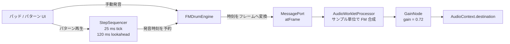

## はじめに

ブラウザーでドラムマシンを作るとき、サンプル音源を再生する方法だけが選択肢ではありません。音の波形をその場で計算すれば、音色の仕組みをコードにしながら、パラメーターを動かして音を変える体験も作れます。

この記事では、ブラウザー上で動く **2オペレーター FM（周波数変調）ドラムマシン**を題材に、FM 合成の基本から AudioWorklet（ブラウザーで独自の音声処理を実装する Web Audio API の仕組み）による DSP（デジタル信号処理）、ステップシーケンサーのスケジューリングまでを順に見ていきます。Web エンジニアとして Web Audio API を使った音作りに興味がある方を想定しています🥁

題材にするのは、8 種類のドラム音を合成し、16 ステップのパターンを鳴らす実装です。以降の説明とコードは、特に断りがない限り [tomokusaba/drum の commit `07c504d`](https://github.com/tomokusaba/drum/tree/07c504dd4848606d22f1641e84ea9033c0c86213) の実装を指します。FM 合成から始め、音色を作る処理、ブラウザーの音声処理、発音時刻の予約へと順に追います。処理全体の図は AudioWorklet の節で確認します。

## 本記事のゴール

- FM 合成のキャリア、モジュレーター、周波数比、変調指数の役割を説明できる
- エンベロープ、ピッチ変化、ノイズを組み合わせたドラム音の設計を追える
- AudioWorklet のサンプルフレーム予約と、メインスレッドの先読みスケジューリングを理解できる
- 8 音色・16 ステップ・4 パターンのシーケンサーがどうつながるか把握できる

「音を鳴らす」部分と「いつ鳴らすか」を分けて考えると、実装が見通しやすくなります。まずは音源の最小単位である FM 合成から確認しましょう。

## 前提条件と対象範囲

- ✅ JavaScript と基本的な Web Audio API の用語に触れたことがある
- ✅ AudioWorklet に対応したブラウザーを使い、アプリを localhost または HTTPS から開く
- ✅ サンプルコードの根拠は、上記の固定コミットに含まれる実装

このアプリは音声サンプルや外部のシンセサイザーライブラリを使わず、AudioWorklet 内で FM 音源を合成します。README では AudioWorklet に対応した現在のブラウザーを前提としており、対応ブラウザーの網羅的な一覧や性能値をこの記事で追加することはしません。Web Audio API の仕様については [W3C Web Audio API](https://www.w3.org/TR/webaudio/) も参照してください。

また、ここでは設計と実装の読み解きが目的です。機能の範囲は [README](https://github.com/tomokusaba/drum/blob/07c504dd4848606d22f1641e84ea9033c0c86213/README.md) に記載された内容に限定し、実装されていない機能は後半で明確にします。まず音源の最小単位である FM 合成から始めます。

## Step 1: 2つのオペレーターで FM 音を作る

### キャリアとモジュレーター

オペレーター（operator）は、周波数と位相を持つ音声信号を作る要素です。2 オペレーター方式では、出力音を作る **キャリア（搬送波）** の位相を、別の **モジュレーター（変調波）** で揺らします。この 2 つの正弦波を組み合わせる構成を題材にします。

概念的な出力は次の式です。

```text
x(t) = sin(φc(t) + I · sin(φm(t)))
```

`φc(t)` はキャリアの位相、`φm(t)` はモジュレーターの位相、`I` は変調指数です。モジュレーターの値をキャリアの位相に加えるので、単独の正弦波より複雑な周期波形になります。実装では位相をサンプルごとに更新し、モジュレーターの正弦値をキャリアの `Math.sin` に加えています。

```js
const modulator = Math.sin(voice.modulatorPhase);
const tone = Math.sin(voice.carrierPhase + modulator * indexEnvelope);
```

この処理は [AudioWorklet のプロセッサー](https://github.com/tomokusaba/drum/blob/07c504dd4848606d22f1641e84ea9033c0c86213/public/fm-processor.js)にあります。共通の数式を切り出した [FM ヘルパー](https://github.com/tomokusaba/drum/blob/07c504dd4848606d22f1641e84ea9033c0c86213/src/audio/fm-engine.js)にも `fmSample` 関数がありますが、DSP 側では後述する時間変化する変調指数を使って同じ形の計算をしています。

### 周波数比で音のキャラクターを変える

音源の基本ピッチを `f₀`、キャリア比を `r₍c₎`、モジュレーター比を `r₍m₎` とすると、実装で使う周波数は次のとおりです。

```text
fキャリア     = f₀ × ピッチ倍率 × r₍c₎
fモジュレーター = f₀ × ピッチ倍率 × r₍m₎
周波数比       = r₍m₎ / r₍c₎
```

つまり、比率はキャリアとモジュレーターの周波数関係を決めます。`r₍c₎ = 1` のとき、`r₍m₎` を変えるとモジュレーターがキャリアに対してどれだけ速く位相を回すかが変わり、音の倍音構成も変化します。なお、両周波数には同じピッチ倍率が掛かるため、その時点の比率自体は保たれます。

固定コミットの初期値では、キックはキャリア比 `1`・モジュレーター比 `1.42`、クローズドハイハットは `1`・`5.25` です。これらはこのアプリの音色設定であり、特定の楽器の物理モデルを再現するという意味ではありません。次は、音の立ち上がりと余韻を時間で形作ります。

## Step 2: 減衰とピッチフォールで打楽器らしさを作る

### 振幅エンベロープ

ノート開始からの経過時間を `t` 秒、Decay パラメーターを `D` 秒とすると、振幅エンベロープは指数関数で計算されます。

```text
envelope(t) = exp(-6 × t / D)
```

`D` を大きくすると音がゆっくり減衰し、小さくすると短くなります。ここで `D` は「その時刻に必ず無音になる時間」ではありません。実装はエンベロープが `0.0007` 未満になった時点でボイスを取り除きます。

```js
const age = (frame - voice.startFrame) / sampleRate;
const envelope = Math.exp((-6 * age) / voice.decay);

if (envelope < 0.0007) {
  this.voices.splice(index, 1);
  continue;
}
```

Decay の実装は [FM ヘルパー](https://github.com/tomokusaba/drum/blob/07c504dd4848606d22f1641e84ea9033c0c86213/src/audio/fm-engine.js)にもあり、AudioWorklet 側でも各サンプルを合成するときに同じ式を使います。単純な音量のオン／オフではなく、サンプル単位で振幅を変えることで余韻を作ります。

### ピッチフォール

キックやタムのような音では、開始直後を高めのピッチにし、短時間で基準ピッチへ落とすとアタック感を出せます。半音単位の落差を `s` とすると、開始時のピッチ倍率は `2^(s/12)` です。実装では約 `0.035` 秒の時定数でその倍率を `1` に近づけています。

```text
pitchMultiplier(t) =
  1 + (2^(s / 12) - 1) × exp(-t / 0.035)
```

このピッチ倍率はキャリアとモジュレーターの両方に掛かります。したがって、音全体の高さは時間とともに下がりますが、両者の周波数比は維持されます。落差がゼロなら倍率は常に `1` です。

### 変調指数も時間で動かす

この実装の変調指数は、固定値のままではありません。初期値を `I` とすると、現在のエンベロープ `E` に応じて `I × (0.3 + 0.7E)` としています。開始時は `I`、減衰後はおおむね `0.3I` に近づきます。音量と音色を同時に時間変化させる設計です。

ピッチフォール、Decay、変調指数がそれぞれ別の時間変化を持つことが分かりました。ここにノイズ成分を混ぜると、スネアやハイハットのような質感を作りやすくなります。

## Step 3: ノイズを混ぜて 8 種類のドラム音色にする

プロセッサーは xorshift 系の処理で `-1` から `1` の範囲の擬似乱数を作り、FM のトーンと混ぜます。ノイズ量を `N`、トーンを `T`、ノイズ値を `R` とすると、実際のブレンドは次の形です。

```text
sample = T × (1 - 0.65N) + R × N
```

`N = 0` ならトーンのみで、`N` を上げるとトーンを少し弱めながらノイズを加えます。係数の合計を一定にするクロスフェードではないため、`N` は厳密な「ノイズの割合」ではありません。最後にエンベロープと係数 `0.38` を掛けてボイスを加算し、ミックスに `tanh` を適用して出力しています。

音色の初期値は [楽器定義ファイル](https://github.com/tomokusaba/drum/blob/07c504dd4848606d22f1641e84ea9033c0c86213/src/data/instruments.js)にあります。8 種類の名前と GM（General MIDI）パーカッション番号は次のとおりです。

| 🥁 パッド | GM ノート | 初期設定の傾向 |
|---|---:|---|
| Kick | 36 | 低い基準ピッチ、ピッチフォールあり |
| Rim | 37 | 短い Decay、ノイズ少なめ |
| Snare | 38 | FM トーンにノイズを加える |
| Clap | 39 | ノイズ量を多めに設定 |
| Closed hat | 42 | 短い Decay、ノイズを加える |
| Tom | 45 | ピッチフォールあり |
| Open hat | 46 | Closed hat より長い Decay |
| Cowbell | 56 | 初期設定ではノイズなし |

この表は「初期設定の特徴」を抜き出したものです。各パッドは Pitch、Pitch fall、Carrier ratio、Modulator ratio、FM amount、Decay、Noise layer を編集できます。値は [UI と音色定義](https://github.com/tomokusaba/drum/blob/07c504dd4848606d22f1641e84ea9033c0c86213/src/data/instruments.js)で範囲を定義し、発音時にプロセッサーでも安全な範囲へクランプします。

ここまでは「どんな波形を出すか」を見てきました。次は、その波形をブラウザーのオーディオ処理へ渡す経路を追います。

## Step 4: AudioWorklet でサンプル単位に音を合成する

Web Audio API は `AudioNode` を接続して音声処理のグラフを作る API です。この実装では、UI 側が `AudioContext` と `AudioWorkletNode` を作り、`/fm-processor.js` をロードして、プロセッサーの出力を GainNode 経由で `destination` へ接続します。コンテキストの初期化はパッド操作または再生操作から行われます。

処理の流れを図にすると、UI と音声処理の境界が見やすくなります。



```js
await context.audioWorklet.addModule("/fm-processor.js");

const node = new AudioWorkletNode(context, "fm-drum-processor", {
  numberOfInputs: 0,
  numberOfOutputs: 1,
  outputChannelCount: [2],
});
const gain = context.createGain();
gain.gain.value = 0.72;
node.connect(gain).connect(context.destination);
```

この接続は [エンジンのブリッジ](https://github.com/tomokusaba/drum/blob/07c504dd4848606d22f1641e84ea9033c0c86213/src/audio/engine.js)にあります。AudioWorkletNode は音を合成するプロセッサーとメインスレッド側のコードをつなぐ入口です。アプリ側は発音要求とパラメーターをメッセージで送り、プロセッサー側は `process()` 内で出力バッファーの各サンプルを計算します。AudioWorklet の詳細は [Web Audio API 仕様](https://www.w3.org/TR/webaudio/#AudioWorklet)を参照してください。

発音要求は `AudioContext.currentTime` をフレーム番号に換算して送ります。

```js
this.node.port.postMessage({
  type: "trigger",
  instrumentId,
  atFrame: Math.round(atTime * this.context.sampleRate),
  sequence,
  params,
});
```

プロセッサーは受信したイベントを `atFrame` でソートし、出力バッファーを処理するとき、各フレームが予約時刻に達したらボイスを開始します。つまり、メインスレッドのタイマーが発音サンプルを直接作るのではなく、**メインスレッドが少し先の発音時刻を予約し、AudioWorklet がそのフレームで処理する**という分担です。

`process()` は出力フレームごとにイベントを確認し、動作中の各ボイスの位相、エンベロープ、FM 波形を更新します。複数のボイスは加算され、同じサンプル値が出力チャンネルに書き込まれます。この構成によって手動パッドとシーケンサーからの発音が同じエンジンを通ります。次は、その予約をどのタイミングで積むのかを見ましょう。

## Step 5: 25 ms ごとに確認し、120 ms 先まで予約する

JavaScript の `setInterval` はメインスレッド上で動きます。画面更新などの影響を受けるため、これを各ステップの正確な発音時刻そのものとして使うのではなく、実装では **25 ms ごとにスケジューラーを確認し、AudioContext の時刻を基準に先のイベントを予約**します。

```js
const LOOKAHEAD_SECONDS = 0.12;
const SCHEDULER_INTERVAL_MS = 25;

this.timer = window.setInterval(this._tick, SCHEDULER_INTERVAL_MS);
```

`_tick()` は現在時刻より `0.12` 秒未満先まで、次のステップを順番に予約します。

パターンの 1 枠は、楽器 ID ごとに発音するステップ番号を `Set` で保持します。ここでは、そのデータから現在のステップで鳴らす楽器を `collectStepHits` で取り出します。パターン全体の構造は次の節で説明します。

```js
while (this.nextStepAt < now + LOOKAHEAD_SECONDS) {
  const step = this.step;
  const atTime = this.nextStepAt;
  const hits = collectStepHits(this.getPattern(), this.getInstruments(), step);
  for (const instrumentId of hits) {
    this.engine.trigger(instrumentId, atTime, { sequence: true });
  }
  this.step = (this.step + 1) % 16;
  this.nextStepAt += secondsPerSixteenth(this.bpm ?? 110);
}
```

このコードは [ステップシーケンサー](https://github.com/tomokusaba/drum/blob/07c504dd4848606d22f1641e84ea9033c0c86213/src/audio/sequencer.js)からの抜粋です。BPM（beats per minute、1 分あたりの拍数）を `bpm` とすると、16 分音符の間隔は `60 / bpm / 4` 秒です。実装では BPM を 60〜180 に収めます。予約時刻のフレーム変換は、Step 4 で見たエンジンのブリッジが担います。

したがって、25 ms は「25 ms ごとに音を鳴らす」という意味ではありません。タイマーの役目は予約キューを先読みで満たすことです。再生ヘッド表示には別に `requestAnimationFrame` を使い、音声の発音時刻と UI 更新を分けています。停止時には、まだ予約キューにあるシーケンス由来のイベントを取り消しますが、すでに鳴り始めた音はエンベロープに従って減衰します。

スケジューラーの仕組みが分かったところで、パターンがどのようなデータ構造で扱われるかを確認します。

## Step 6: 8 音色 × 16 ステップ × 4 パターン

パターンは A、B、C、D の 4 枠です。各パターンは 8 種類の楽器 ID ごとに、オンにしたステップ番号を `Set` で保持します。ステップは 0〜15 の 16 個で、画面では 1〜16 番として表示されます。

```text
patterns
  ├─ A ─ kick: {0, 8}, snare: {4, 12}, ...
  ├─ B ─ kick: {0, 10}, snare: {8}, ...
  ├─ C ─ kick: {0, 6, 8, 14}, ...
  └─ D ─ （空のパターン）
```

実際のプリセットは `instruments.js` で定義され、起動時に複製されます。ステップごとに全楽器を調べ、オンになっている楽器の ID だけを取得し、各 ID を同じ時刻にエンジンへ送ります。そのため、キックとスネアなど複数の音が同じステップにあれば、同じサンプル時刻に予約できます。

UI ではテンポを 60〜180 BPM で変更し、パターンスロットを切り替え、グリッドのステップをオン／オフできます。パッドにはポインター操作と `A S D F G H J K` のキー操作があり、各パッドは GM パーカッション番号と音色名も表示します。UI のイベント処理は [main.js](https://github.com/tomokusaba/drum/blob/07c504dd4848606d22f1641e84ea9033c0c86213/src/main.js) にあります。

これで、音色設定からシーケンスの予約まで一続きになりました。最後に、どこまでがこの実装の機能なのか、範囲を整理します。

## 実装の確認方法と機能範囲

リポジトリの [README](https://github.com/tomokusaba/drum/blob/07c504dd4848606d22f1641e84ea9033c0c86213/README.md) に従うと、`npm install` で依存関係を導入し、`npm run dev` で開発サーバーを起動できます。本番ビルドは `npm run build`、ビルド済みアプリのプレビューは `npm run preview`、テストは `npm test` です。音声はパッドまたはパターン再生を明示的に操作した後に初期化されます。手動操作とパターン再生のどちらも同じタイムスタンプ付き FM エンジンを使う点が、この実装の確認ポイントです。

一方で、README はパターンと音色編集を現在のページセッション中にメモリ上で保持すると説明しています。記録／書き出し、MIDI、可変ベロシティ、永続ストレージは対象外です。したがって、ページをまたいだ保存や MIDI 機器との連携、ベロシティによる強弱があるかのようには扱いません。README と各ファイルの記載範囲を越えた性能やブラウザー対応の断定も避けます。

実装を理解するときは、できることだけでなく、実装されていない機能も一緒に確認しておくと誤解がありません。以上を踏まえてまとめます。

## ハマりどころ / 注意点

- **タイマー間隔と発音時刻は別物です。** 25 ms のタイマーが音の発音間隔を決めるのではなく、120 ms 先まで予約し、AudioWorklet がフレーム番号でイベントを処理します。
- **Decay 値は無音になる時刻そのものではありません。** 指数減衰を適用し、振幅がしきい値を下回ったときにボイスを削除します。
- **FM amount と Noise layer は音量つまみとは異なります。** 前者はキャリア位相を変調する深さ、後者はトーンとノイズの混合に使う係数です。
- **8種類の音色と同時発音数は別の数です。** 定義済み音色は 8 種類ですが、プロセッサーは発音中のボイスを配列で管理し、上限 32 に達した場合は最も古いボイスを取り除いてから新しいボイスを追加します。

この区別を意識すれば、音色パラメーター、スケジュール、再生中のボイスを混同せずに追えます。最後に要点を振り返ります。

## まとめ

このドラムマシンでは、キャリアとモジュレーターの周波数比で音色を調整し、変調指数・指数減衰・ピッチフォール・ノイズのブレンドを組み合わせて 8 種類の打楽器音を合成しています。波形をサンプルごとに作る処理は AudioWorklet に置き、メインスレッドは 25 ms ごとの確認で 120 ms 先まで発音イベントを予約します。

16 ステップのシーケンサーは 4 枠のパターンを保持し、オンになったステップの音色を同じ FM エンジンに送ります。ブラウザーの UI、スケジューラー、オーディオ処理を分けて読むことで、Web Audio API を使った音源の設計を具体的に追える構成です。

小さな FM ドラム音源は、波形の式からリアルタイム処理、UI 上の編集、イベントの時間管理までをひとつの題材でつなげられます。次に Web Audio API を使うときは、音色の計算と発音の予約を分けるところから試してみてください🎛️
