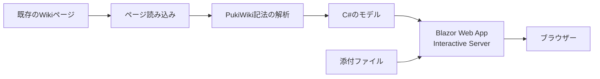

## はじめに

長く使ってきた PukiWiki のファイル型資産を保持したまま、C# / .NET 10 と ASP.NET Core で互換機能を再実装するプロトタイプを作りました。

これは PHP の実行環境を別の言語へ移植する作業ではありません。`wiki`、`diff`、`backup`、`cache`、`attach`、`counter` などのファイル型資産を残し、読み書きや表示に必要な互換機能を新しいアプリケーション側へ実装する取り組みです。

この記事では、移行を考えた背景、実際に取り組んだ内容、移行して分かったこと、そしてまだ残っている課題を整理します。詳細な作業履歴ではなく、同じように古い Wiki を現代的な実行基盤へ載せ替えたい方に向けた経験談です📝

## 今回のゴール / 本記事の目的

この記事で共有したいのは、次のポイントです。

- なぜ PukiWiki をそのまま使い続けることに不安を感じたのか
- Wiki のデータを捨てずに、アプリケーションの実装だけを置き換える考え方
- C# / ASP.NET Core で PukiWiki の記法を HTML へレンダリングする際の要点
- 移行後に得られた効果と、互換性・運用面で残る課題

移行先を決めることよりも、**コンテンツと実行基盤を分離して考える**ことが、今回の設計で大切なポイントになりました。

## 背景：PukiWikiを使い続ける不安

PukiWiki は、少ない構成で文章を蓄積できる軽量な Wiki です。ページをファイルとして管理できることもあり、これまで書いてきた内容を手元に残しやすい点が魅力でした。

サーバー上で運用している PukiWiki は 1.5.4 です（2026 年 9 月時点）。公式リポジトリには [r1_5_4 タグ](https://github.com/pukiwiki/pukiwiki/tree/r1_5_4) と [README / INSTALL](https://github.com/pukiwiki/pukiwiki/blob/r1_5_4/README.txt) が公開されています。PukiWiki の開発や、将来の PHP バージョン対応へ追従できるのかという点に不安があり、今回の検討を始めました。今回扱う環境差分も、主に PHP バージョンへの対応に関するものです。

PHP のバージョンを上げたときに、すぐに動かなくなると決まっているわけではありません。しかし、実行環境の更新、依存する拡張、セキュリティ対応を含めて考えると、「動いているからこのままでよい」と判断し続けるのは難しくなります⚠️

そこで今回は、Wiki のコンテンツを新しく書き直すのではなく、既存資産を読み込んで表示・編集に必要な機能を段階的に再実装する方針を選びました。

## 移行の目的：資産を活かしながら土台を更新する

今回の目的は、既存ページを別形式へ一括変換して、過去の記法をすべて消してしまうことではありません。

| 観点 | 移行で目指したこと |
|------|--------------------|
| 📚 コンテンツ | 既存ページの本文をできるだけそのまま活用する |
| 🔗 リンク | ページ間リンクや添付ファイルへの参照を維持する |
| 🎨 表示 | PukiWiki で培われた読みやすさを大きく変えない |
| 🧱 実行基盤 | C# / .NET 10・ASP.NET Core で保守しやすい構成にする |
| 🔄 移行手順 | 全機能を一度に再実装せず、段階的に確認できるようにする |

この方針なら、移行作業の途中でも旧環境と新環境を比較できます。まずは読み取りとレンダリングを成立させ、その後に編集や管理機能を検討する順序です。

## PukiWikiをC#に置き換える際のライセンス上の注意

移行では、コードを別の言語で書き直すことと、ライセンス上の確認を終えることは別の作業です。wiki リポジトリの [`LICENSE`](https://github.com/tomokusaba/pukiwikiMig/blob/20a4069db43b5b8bb17572b1ab9e03d8ccb8b259/PukiWiki/LICENSE)、[`README`](https://github.com/tomokusaba/pukiwikiMig/blob/20a4069db43b5b8bb17572b1ab9e03d8ccb8b259/README.md)、[`LICENSE-MANIFEST.md`](https://github.com/tomokusaba/pukiwikiMig/blob/20a4069db43b5b8bb17572b1ab9e03d8ccb8b259/PukiWiki/LICENSE-MANIFEST.md)、仕様書を確認し、PukiWiki 本体に表示されているライセンス表示と著作権表示を把握したうえで、必要な表示を維持することが出発点になります。公式配布物の [COPYING.txt](https://github.com/pukiwiki/pukiwiki/blob/r1_5_4/COPYING.txt) も照合対象です。

一方、`wiki`、`diff`、`backup`、`cache`、`attach`、`counter` などのデータ資産は、アプリケーションのコードとは別に考える必要があります。元の作成者、利用条件、ページ内に含まれる画像・文章・リンク先など第三者コンテンツの権利を確認しなければなりません。リポジトリにデータが含まれていない場合でも、実際に運用しているデータの所有者と利用許諾を確認する必要があります。

新しく書いた C# / .NET / ASP.NET Core / [Fluent UI Blazor](https://github.com/microsoft/fluentui-blazor) などの実装や依存ライブラリについても、それぞれのライセンス、NOTICE、著作権表示、再配布条件を確認します。依存関係を追加・更新したときに、成果物へ含める文書や表示が変わることもあるため、パッケージ一覧を固定して確認できる状態にしておくと安心です。Fluent UI Blazor のライセンス原文も [LICENSE](https://github.com/microsoft/fluentui-blazor/blob/dev/LICENSE) で確認できます。

今回のように PHP コードをコピーせず、仕様と挙動を調査して独立に実装する場合でも、何の制約もなくなるわけではありません。PukiWiki の名称などの商標、元の著作権表示、ライセンス文書、そして「どの範囲を互換実装したものか」という説明には注意が必要です。なお、このリポジトリで確認できる範囲を超えて、GPL など具体的なライセンス種別をこの記事で断定することは避けます。

公開・商用運用へ進む前には、ライセンス原文と依存関係を改めて確認し、データ所有者にも利用条件を確認します。必要に応じて、社内の法務担当者や弁護士など、適切な専門家にレビューを依頼することを推奨します。

:::message alert
この記事は法的助言ではありません。C# へ置き換えればライセンス問題が自動的に消えるわけではないため、公開前にコード、依存関係、データの権利をそれぞれ確認してください。
:::

## 既存Wiki資産をどう扱ったか

PukiWiki のページは、データベースのレコードだけでなく、ページ、差分、バックアップ、キャッシュ、添付ファイル、カウンターなどのファイル型資産の組み合わせで成り立っています。したがって、最初から新しいデータモデルへ完全に正規化するのではなく、元のファイルやディレクトリを入力・保存資産として扱うことにしました。

新しいアプリケーションから見た流れは、次のようになります。



この方式では、コンテンツの所有権をアプリケーションのコードから切り離せます。レンダラーを改善しても、元のページ資産そのものを変更せずに済むのが利点です。

ただし、すべてのプラグインや記法が自動的に再現されるわけではありません。利用しているページを確認しながら、必要な記法を優先して対応する現実的な進め方にしました。

## C# / ASP.NET Coreでのレンダリング

新しい実装は、C# / .NET 10、ASP.NET Core、[Blazor Web App の Interactive Server](https://learn.microsoft.com/aspnet/core/blazor/components/render-modes?view=aspnetcore-10.0&WT.mc_id=DT-MVP-5004827) を組み合わせています。ASP.NET Core がアプリケーションの基盤を担い、Blazor 側でページ一覧や編集画面などのインタラクティブな UI を構成します。

責務を分けると、概念的には次のような構成です。

```csharp
public sealed record WikiPage(string Name, string Source);

public interface IWikiStorage
{
    Task<WikiPage?> ReadPageAsync(
        string pageName,
        CancellationToken cancellationToken);
}

public interface IWikiRenderer
{
    MarkupString Render(WikiPage page);
}
```

実装では `IWikiStorage` と `FileSystemWikiStorage` を分け、ファイルシステム上のページや関連資産を扱う責務を閉じ込めました。ここで重要なのは、ページの保存方法と表示方法を分離することです。ファイルから読むのか、将来別のストレージへ移すのかにかかわらず、レンダラーは `WikiPage` を入力として動作できます。`MarkupString` は [Microsoft Learn の API リファレンス](https://learn.microsoft.com/dotnet/api/microsoft.aspnetcore.components.markupstring?view=aspnetcore-10.0&WT.mc_id=DT-MVP-5004827)にあるとおり markup として描画されるため、検証済みの出力だけを渡します。

実際のレンダリングでは、行単位の記法、見出し、リンク、リスト、引用、コードブロックなどを順番に処理します。`WikiRenderer` は allow-list 型で対応する記法だけを出力し、HTML encode、`include` の上限、iframe の制限を適用します。任意の PHP やプラグインを実行する仕組みにはしません。**本文のエスケープと、HTML として許可する要素の境界**を明確にすることが重要です🔐

## 作業内容

今回の作業履歴は、次のような時系列で整理できます。コミットから直接確認できる事実と、実装を読み解いた記事上の整理は分けて書きます。

### 0. 調査結果をMarkdown仕様書にする

起点は、いきなりコードを書くことではありません。wiki リポジトリで最初に作成した [`pukiwiki-user-data-spec.md`](https://github.com/tomokusaba/pukiwikiMig/blob/20a4069db43b5b8bb17572b1ab9e03d8ccb8b259/pukiwiki-user-data-spec.md)（約 2,137 行）に、PukiWiki ユーザーデータの構造、公式資料や実装の調査結果、互換対象、受入条件をまとめました。その仕様書を GitHub Copilot が読み取り、そこに書かれた方針を確認したうえでコード実装を開始しています。これは移行プロセスの事実として確認できる流れです。単なる作業メモではなく、移行の前提を定義した最初の成果物でした。

仕様書には、どのファイル資産を保持するか、どの記法・動作を互換対象とするか、旧環境と何を比較して受け入れるかを記録しました。そのため、後続のストレージ、ページ名の 16 進エンコード、diff / backup、添付、counter、記法互換の実装は、この仕様書を起点にした流れとして整理できます。記事上の解釈としては、仕様書を先に置くことで、対象範囲、実装の優先順位、100% 互換を目指さないという限界を、実装者やレビューする人の間で共有しやすくなります。

### 1. 旧環境の棚卸し

最初に、旧 PukiWiki のデータ構造、設定、利用している記法、skin、plugin を確認するところから始めました。公式配布物の [データディレクトリ](https://github.com/pukiwiki/pukiwiki/tree/r1_5_4) や [設定ファイル](https://github.com/pukiwiki/pukiwiki/blob/r1_5_4/pukiwiki.ini.php) も参照しています。これは単にページ本文を移すためではなく、どのファイルが表示・編集・履歴・添付ファイルに関係するかを把握するためです。

### 2. ファイル型資産を保持する方針を決める

次に、`wiki`、`diff`、`backup`、`cache`、`attach`、`counter` を新しいデータベースへ一括変換せず、既存のファイル型資産として保持する方針を決めました。ここが今回の「PHP の移植」ではなく「互換機能の再実装」という設計上の分岐点です。

### 3. ストレージ境界を実装する

[`IWikiStorage`](https://github.com/tomokusaba/pukiwikiMig/blob/20a4069db43b5b8bb17572b1ab9e03d8ccb8b259/PukiWiki/Core/Storage/IWikiStorage.cs) と [`FileSystemWikiStorage`](https://github.com/tomokusaba/pukiwikiMig/blob/20a4069db43b5b8bb17572b1ab9e03d8ccb8b259/PukiWiki/Core/Storage/FileSystemWikiStorage.cs) を用意し、ファイルシステムへのアクセスをアプリケーションの他の部分から分離しました。EUC-JP の設定を考慮し、ページ名はファイルシステム上で安全に扱えるよう 16 進数へエンコードします。パス Traversal を防ぎ、原子書き込みとページ単位のロックで同時更新にも備えました。

### 4. `WikiPageService` の機能を段階的に増やす

ストレージが定まった後、[`WikiPageService`](https://github.com/tomokusaba/pukiwikiMig/blob/20a4069db43b5b8bb17572b1ab9e03d8ccb8b259/PukiWiki/Core/Pages/WikiPageService.cs) にページの読み書き、ページ一覧、検索、diff / backup、凍結、添付ファイル、counter を順番に追加しました。最初からすべての画面を作るのではなく、ファイル資産を読み書きするユースケースを増やしながら互換性を確認する進め方です。

`vote2` では MD5 を使った競合検出を扱い、古い内容を上書きしにくい更新フローにしました。添付ファイルと `ref` も、ページ本文と関連ファイルを一緒に扱うための機能として追加しています。

### 5. `WikiRenderer` を安全な互換レンダラーとして実装する

レンダラーは、すべての記法を一度に再現するのではなく、まずブロック記法とインライン記法を分け、利用頻度と影響の大きいものから実装しました。その後、`include`、`recent`、`search`、`ref`、iframe、`vote2` などへ対応範囲を広げています。実装は [`WikiRenderer.cs`](https://github.com/tomokusaba/pukiwikiMig/blob/20a4069db43b5b8bb17572b1ab9e03d8ccb8b259/PukiWiki/Core/Rendering/WikiRenderer.cs) で確認できます。

```text
ページ読み込み
  -> ブロック記法の分類
  -> インライン記法の変換
  -> include / ref などの解決
  -> HTML encode と allow-list 検証
  -> HTML 出力
```

`WikiRenderer` は allow-list 型とし、HTML encode、`include` の上限、iframe の許可先制限を適用します。任意の PHP や plugin を実行する互換性は意図的に持たせません。

### 6. Blazor / ASP.NET Core の画面とエンドポイントを追加する

ストレージ、サービス、レンダラーを組み合わせ、C# / .NET 10 の ASP.NET Core 上に Blazor Web App（Interactive Server）の画面を追加しました。ページ表示だけでなく、一覧、検索、編集、履歴、添付ファイルなどを、サービス層の機能に合わせて段階的に接続しています。

### 7. 運用と安全対策を組み込む

管理者パスワードは [User Secrets](https://learn.microsoft.com/aspnet/core/security/app-secrets?view=aspnetcore-10.0&WT.mc_id=DT-MVP-5004827) へ分離しました。また、[CSP](https://developer.mozilla.org/en-US/docs/Web/HTTP/Reference/Headers/Content-Security-Policy)、[`nosniff`](https://developer.mozilla.org/en-US/docs/Web/HTTP/Reference/Headers/X-Content-Type-Options)、[`Referrer-Policy`](https://developer.mozilla.org/en-US/docs/Web/HTTP/Reference/Headers/Referrer-Policy)、iframe の allow-list を設定し、入力された PHP や plugin を実行しない境界を明確にしました。これらは後付けの一覧ではなく、互換機能を実装する段階で危険な入力を実行しないための前提です🔐

### 8. 旧環境との表示比較と受入条件を決める

受入条件として、同じページを旧環境と新環境で表示し、見出し、リンク、画像、コード、改行などを比較する形に整理しました。受入条件は「アプリケーションが起動すること」ではなく、対象ページのファイル、記法、動作が必要な範囲で成立することです。

ただし、ファイル互換、記法互換、動作互換は別の観点であり、100% 互換を保証するものではありません。実データの多くは `.gitignore` の対象で、件数や完全性を確認できません。また、自動テストは未整備であり、リポジトリだけから実データの状態や移行結果を検証できない点にも注意が必要です。

### コミット履歴との対応

上記の段階を、確認できる主要コミットに対応づけると次のようになります。

| コミット | 内容 |
|----------|------|
| [`e978def`](https://github.com/tomokusaba/pukiwikiMig/commit/e978def75f82c7e4236bc832c98af98d83d33eb9) | 属性と LICENSE の整備 |
| [`52a1d1e`](https://github.com/tomokusaba/pukiwikiMig/commit/52a1d1edea548c92ae4b3851ab75941339f57267) | 初期実装 |
| [`1bc962b`](https://github.com/tomokusaba/pukiwikiMig/commit/1bc962b6102c98529402fbcad28372de6f4985d6) | 管理者パスワードを User Secrets へ分離 |
| [`bc02482`](https://github.com/tomokusaba/pukiwikiMig/commit/bc02482b0b36a62829a677ad3444cf4c552d783b) | README の運用・移行手順を整理 |
| [`20a4069`](https://github.com/tomokusaba/pukiwikiMig/commit/20a4069db43b5b8bb17572b1ab9e03d8ccb8b259) | `vote2`、添付 / `ref`、iframe allow-list / CSP、UI などを追加 |

コミットの対応には、履歴から確認できる内容と、複数の変更を記事の段階へ整理した部分が含まれます。したがって、各段階が厳密に一つのコミットだけで完結したという意味ではありません。この順序から、最初から完全な置き換えを狙うのではなく、ストレージ、表示、運用、安全性を積み上げた流れを読み取れます。

## 得られた効果

プロトタイプを進めたことで、次のような効果が得られました。

- 実行基盤を C# / .NET 10 / ASP.NET Core に寄せられた：普段使っている .NET の開発・デバッグ手法を適用しやすくなりました。
- コンテンツを捨てずに済んだ：過去のページを新しい形式へ書き直すことなく、既存資産を入力として活用できました。
- 表示処理の責務が見えるようになった：記法の解釈、ページ取得、HTML の出力を分けて考えられます。
- 危険な入力を実行しない境界を作れた：任意の PHP や plugin を実行せず、allow-list とエンコードを通して出力します。
- 段階的な改善が可能になった：まず読む機能を安定させ、編集や管理を後から追加する余地を残せました。

なお、実データの多くは `.gitignore` の対象です。そのため、リポジトリ上の情報だけから実データの件数や完全性を評価することはできません。効果についても、現時点ではプロトタイプとコード上で確認できる範囲に限った評価です。

## 残っている課題

ファイル互換、記法互換、動作互換は別の観点です。現時点で 100% の互換性を保証するものではなく、移行が完了したからすべて解決したというわけでもありません。

### 記法とプラグインの互換性

PukiWiki には多くのプラグインや記法があります。利用していないものまで同じ挙動にする必要はありませんが、ページによっては特殊な記法に依存している可能性があります。未対応の記法を黙って消すのではなく、検出して分かる形で扱う仕組みが必要です。

### 編集・認証・権限

読み取り専用の表示と、編集・凍結・添付ファイル管理では必要な安全対策が異なります。編集機能を追加する場合は、認証、認可、CSRF 対策、入力値の検証、履歴管理を改めて設計しなければなりません。

### 差分確認とテスト

ページ数が増えるほど、目視だけで旧環境との差分を確認するのは難しくなります。移行ツール、テスト、自動テスト、履歴画面の整合性も未実装・要改善の領域です。代表的なページを固定したスナップショット比較や、記法ごとのレンダリングテストを整備することが今後の課題です🧪

### ストレージと運用機能

現状のファイル型資産を活用する構成を広げるには、Blob など別の保存先への対応、認証・認可、監査ログも検討が必要です。特に編集機能を公開する場合は、誰が何を変更したかを追跡できる運用が欠かせません。

## 今後の展望

今後は、まず利用頻度の高い記法とページの互換性を高めます。そのうえで、移行ツール、Blob 対応、認証・認可、監査ログ、自動テスト、履歴画面の整合性を追加・改善していく予定です。編集、検索、ページ一覧、添付ファイル管理も、互換性と安全性を確認しながら進めます。

また、元の Wiki 資産を特定の保存方式へ閉じ込めないことも意識したいと考えています。ページを読み出す層、記法を解釈する層、HTML を返す層を分けておけば、将来ストレージやフロントエンドを変更するときにも選択肢を残せます。

古いシステムを置き換えるとき、すべてを新しく作り直すことが必ずしも最善とは限りません。今回のように、残したい資産と置き換えたい実行基盤を分けて考えると、移行のリスクを小さくしながら段階的に前へ進められます。

## おわりに

サーバー上で運用している PukiWiki 1.5.4 と、PHP バージョン対応の将来に対する不安をきっかけに、私は Wiki のファイル型資産を活かしたまま、C# / .NET 10、ASP.NET Core、Blazor Web App（Interactive Server）で互換機能を再実装するプロトタイプを始めました。

中心にあるのは、PHP をそのまま移植することでも、データを捨てることでも、すべての機能を一度に再現することでもありません。既存の `wiki` / `diff` / `backup` / `cache` / `attach` / `counter` などを保持し、必要な記法と動作を少しずつ再実装することです。

100% 互換を保証できる段階ではなく、実データの件数や完全性も確認できていません。それでも、コンテンツを守りながら実行基盤を更新する道筋と、安全に再実装するための境界を作れたことは、今回のプロトタイプで得られた大きな成果でした📚

## 参考リンク / 出典

- [PukiWiki 公式リポジトリ r1_5_4](https://github.com/pukiwiki/pukiwiki/tree/r1_5_4)
- [PukiWiki README.txt](https://github.com/pukiwiki/pukiwiki/blob/r1_5_4/README.txt)
- [PukiWiki INSTALL.txt](https://github.com/pukiwiki/pukiwiki/blob/r1_5_4/INSTALL.txt)
- [PukiWiki UPDATING.txt](https://github.com/pukiwiki/pukiwiki/blob/r1_5_4/UPDATING.txt)
- [PukiWiki COPYING.txt](https://github.com/pukiwiki/pukiwiki/blob/r1_5_4/COPYING.txt)
- [移行リポジトリ README](https://github.com/tomokusaba/pukiwikiMig/blob/20a4069db43b5b8bb17572b1ab9e03d8ccb8b259/README.md)
- [移行仕様書 pukiwiki-user-data-spec.md](https://github.com/tomokusaba/pukiwikiMig/blob/20a4069db43b5b8bb17572b1ab9e03d8ccb8b259/pukiwiki-user-data-spec.md)
- [ASP.NET Core Blazor render modes](https://learn.microsoft.com/aspnet/core/blazor/components/render-modes?view=aspnetcore-10.0&WT.mc_id=DT-MVP-5004827)
- [MarkupString API](https://learn.microsoft.com/dotnet/api/microsoft.aspnetcore.components.markupstring?view=aspnetcore-10.0&WT.mc_id=DT-MVP-5004827)
- [ASP.NET Core の User Secrets](https://learn.microsoft.com/aspnet/core/security/app-secrets?view=aspnetcore-10.0&WT.mc_id=DT-MVP-5004827)
- [MDN: Content-Security-Policy](https://developer.mozilla.org/en-US/docs/Web/HTTP/Reference/Headers/Content-Security-Policy)
- [MDN: X-Content-Type-Options](https://developer.mozilla.org/en-US/docs/Web/HTTP/Reference/Headers/X-Content-Type-Options)
- [MDN: Referrer-Policy](https://developer.mozilla.org/en-US/docs/Web/HTTP/Reference/Headers/Referrer-Policy)
- [Microsoft Fluent UI Blazor](https://github.com/microsoft/fluentui-blazor)
- [Microsoft Fluent UI Blazor LICENSE](https://github.com/microsoft/fluentui-blazor/blob/dev/LICENSE)
