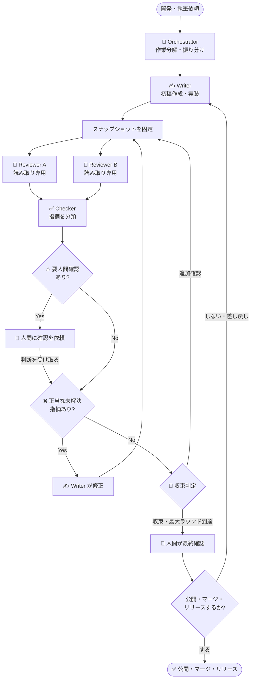
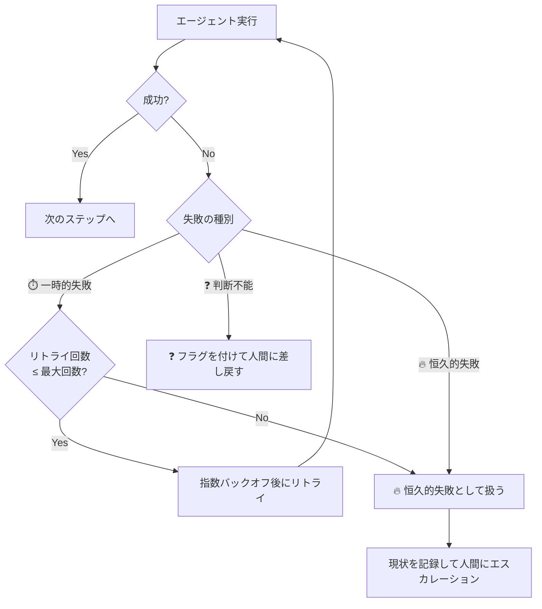

## はじめに

このシリーズでは、GitHub Copilot CLI を起点に、複数エージェントでどのように作業を分担するかを段階的に整理してきました。

- 最初は「CLI と VS Code Agent Mode のどちらを使うか」という作業粒度の話から始まり、
- カスタムエージェントの呼び出し方の違いへ進み、
- 複数エージェントが同じ成果物を扱うときの設計原則を掘り下げ、
- .NET コード生成テンプレートへの応用と、VS Code の Custom Agents + Subagents による自律オーケストレーションを見て、
- 「なぜ大きめの作業は CLI から始めると良いのか」で締めくくりました。

本記事は、そのシリーズの **設計原則まとめ**です。

シリーズを通じて感じたのは、「どのエージェントを使うか」よりも、**「どう組み合わせるか」の設計判断の方がずっと難しい**ということです。エージェントの数を増やすと、問うべきことも増えます。

- 誰が何を書き、誰は読むだけなのか
- いつ止めればいいのか
- 最後に誰が責任を持つのか
- 指摘をどうまとめて次の人に渡すのか
- うまくいかなかったときに何をするのか

本記事では、これら **5 つの問い**を軸に、エージェントワークフローを設計するときに意識しておきたい原則を整理します。GitHub Copilot CLI ユーザーだけでなく、VS Code Agent Mode や他のエージェント基盤を使っている方にも通じる話として書きます。🗺️

## 本記事のゴール

- ✅ シリーズ各記事が扱った設計上の論点を 1 枚に整理する
- ✅ エージェントワークフロー設計の 5 つの問いと、それぞれの答え方の考え方を持てる
- ✅ レビュー系エージェントをなぜ読み取り専用にするのかを説明できる
- ✅ 収束条件を実践的に定義できる（何件を満たせば止めるのか）
- ✅ レビュー指摘を正規化された判断テーブルに落とし込む方法を理解する
- ✅ 失敗時のリトライ・分類・エスカレーション設計の勘所を掴む
- ✅ 最終判断は人間が行うことを設計レベルで担保する方法を考える

本記事を読み終えたときに、**エージェントを増やす前に設計を固める習慣**が身につくことを目指しています。

## シリーズ記事へのリンク

カード形式で一覧したい方向けに、シリーズ記事へのリンクをまとめておきます。

https://zenn.dev/tomokusaba/articles/838cdac8d71e52

https://zenn.dev/tomokusaba/articles/31e31c57cb051d

https://zenn.dev/tomokusaba/articles/a599cb645ca2c5

https://zenn.dev/tomokusaba/articles/14f2373c51e1f2

https://zenn.dev/tomokusaba/articles/8d9f4b3cdd996e

https://zenn.dev/tomokusaba/articles/051dd7f79c1791

## シリーズ各記事の概要

まず、これまで書いてきた記事を振り返ります。

| 記事 | 主な設計の問い | 核心の答え |
|------|----------------|-----------|
| 🤖 [CLI と Agent Mode の使い分け](https://zenn.dev/tomokusaba/articles/838cdac8d71e52) | どのツールをいつ使うか | CLI は「面」、Agent Mode は「点」 |
| 🧭 [カスタムエージェントの呼び出し方](https://zenn.dev/tomokusaba/articles/31e31c57cb051d) | 自然言語 vs 明示呼び出し | 意図の明示性・再現性・誤起動の違い |
| 🧩 [複数エージェント設計](https://zenn.dev/tomokusaba/articles/a599cb645ca2c5) | 誰が書き込むのか | 書き込みは統合役に集約、レビューは読み取り専用 |
| 🔁 [.NET テンプレートでの開発ループ](https://zenn.dev/tomokusaba/articles/14f2373c51e1f2) | どう繰り返すのか | スナップショット固定 → 並列レビュー → Checker → Writer |
| 🪄 [Custom Agents + Subagents](https://zenn.dev/tomokusaba/articles/8d9f4b3cdd996e) | コンテキスト汚染をどう防ぐか | 独立コンテキストで委譲し、要約だけをメインに返す |
| 🛠️ [なぜ CLI から始めるのか](https://zenn.dev/tomokusaba/articles/051dd7f79c1791) | 作業の入口はどこが良いか | 進行管理・並列化・ヘッドレス実行の足場が CLI 側に揃っている |

各記事が扱ってきた問いを並べると、「エージェントの選び方」から「エージェントの組み合わせ方」へ、そして「ワークフローとしての設計」へと段階的に深まっていることが見えます。

シリーズ未読の方は、上の表を上から順に追うと流れを掴みやすいです。逆に既読の方は、「あの記事で扱っていた論点が、この 5 つの問いのどこに収束するのか」を見ながら読むと、本記事の位置づけが掴みやすくなります。

以降では、そのシリーズを通じて浮かび上がった **5 つの設計の問い**を整理します。

---

## 問い 1: 誰がどのような責務を負うのか？

### エージェントの数より「書き込み権限の設計」が先

この問いは、特に「複数エージェント設計」の記事と「.NET テンプレートでの開発ループ」の記事で掘り下げてきた論点です。シリーズ前半で扱った「どのツールを使うか」「どう呼び出すか」という話も、最終的には **誰にどの権限を持たせるか** という設計に収束していきました。

複数エージェントを使い始めると、「役割をどう分けるか」に意識が向きがちです。しかし、役割名を決めることより先に決めるべきことがあります。それは **「誰が成果物に書き込めるのか」** です。

同じ成果物に複数のエージェントが書き込むと、次の問題が起きます。

- 前段の修正を後段が上書きする
- 並列実行時に同じ行を別々のエージェントが編集し、コンフリクトする
- 「誰が最後に書いたか」が追えなくなり、レビューしにくい差分が生まれる

人間のチームでも、同じファイルの同じ箇所を複数人が同時に編集すればコンフリクトが起きます。エージェントでも同じです。

### 責務の 3 分類

シリーズを通じて一貫していた分け方は、次の 3 分類です。

| 分類 | 書き込み | 主な役割 |
|------|---------|---------|
| ✍️ 実装役（Writer） | あり | 初稿作成、正当な指摘の反映、テスト追加 |
| 🧭 統合役（Orchestrator） | なし（委譲のみ） | 作業分解、依頼の振り分け、収束判定 |
| 🔎 レビュー役（Reviewer 系） | **なし** | 指摘・修正案の返却のみ |

ポイントは、**レビュー役の書き込み権限を意図的に取り除く**ことです。

レビュー役に「ついでに直して」と言いたくなる場面は必ずあります。指摘と修正案が揃っているなら、その場で直してもらえる方が速そうに見えます。

しかし、ここで書き込みを許すと、同一スナップショットを並列にレビューするという設計の前提が崩れます。Reviewer が書き換えた後の状態を他の Reviewer が見てしまうと、「同じ差分を見た複数の専門家が指摘を返す」という構造が成立しなくなります。

:::message alert
レビュー系エージェントに成果物を書き換えさせると、並列レビューの前提が崩れます。書き込みは実装役（Writer）に集約するという制約は、設計上の必須条件です。能力の問題ではなく、競合を生まないための境界線です。
:::

### 権限を `tools` で実装する

GitHub Copilot CLI / VS Code Agent Mode のいずれでも、エージェントに渡すツール権限を絞ることで、書き込み権限を制御できます。考え方はシンプルです。

- Writer には `edit` / `execute` を渡す
- Reviewer には `read` / `search` だけを渡す（`edit` は渡さない）
- Orchestrator は `agent`（委譲）だけを持ち、自分ではコードを書かない

CLI では agent profile の `tools` やツール許可オプションで、VS Code では custom agent の `tools` や permissions picker で、この境界を実装できます。

この「ツールの制約」こそが、役割分担を形式的なルールではなく**実際の動作として保証する仕組み**になります。責務を決めたら、次に必要なのは「そのループをどこで止めるか」です。

---

## 問い 2: どのような条件で収束するのか？

### 「良さそうなので完成」を避ける

問い 1 で責務を決めたら、次は **正常系のループをどこで止めるか** を決める必要があります。ここで扱うのは「うまく回っている改善ループを、どの条件で完了とみなすか」という話です。失敗時の止め方は、あとで問い 5 で改めて扱います。

改善ループは、やろうと思えばいつまでも回せます。レビューを重ねるほど良くなる面もありますが、終わりが決まっていないループはいつか停滞に変わります。

ここで重要なのは、**「収束条件を先に決める」**ことです。ループを回し始めてから考えるのではなく、最初に「この状態を完成とみなす」という条件を設計の一部として置きます。

### 収束条件の実例

次のような条件テーブルを用意しておくと、Orchestrator が判定しやすくなります。これはコード開発を題材にした例です。数値の大小より、**止める基準を明示すること**に意味があります。

| 観点 | 収束の条件 |
|------|-----------|
| ❌ ブロッカー指摘（正当かつ未解決） | **0 件** |
| ⚠️ 要人間確認の指摘 | **0 件**（またはすべて人間に差し戻し済み） |
| ❓ 不確実な判断（一次情報未確認） | **明示的に人間に渡してある** |
| 🔁 前ラウンドから増えた新規指摘 | **0 件** |
| 🔢 実行済みラウンド数 | **最大ラウンド数を超えていない** |

特に大事なのは最後の「最大ラウンド数」です。これがないと、Reviewer が毎ラウンド新しい指摘を出し続けるケースで、ループが止まらなくなります。

### ループの有界性

最大ラウンド数は、ループを有界（bounded）にするための設計です。

:::message
「収束しないループ」は無限ループとは少し違います。各ラウンドは正常に終わっているのに、指摘がなくならない状態です。最大ラウンドで強制停止し、その時点の状態を人間に渡すのが安全な出口です。
:::

収束しなかった場合の出口を設計しておくことで、ワークフローは「壊れたときに止まる」ではなく「設計通りに終わる」ものになります。止め方が決まったら、次は「その完了を誰が承認するのか」を決める必要があります。

---

## 問い 3: 誰が決めるのか？

### エージェントが決められること・決められないこと

この問いは、シリーズ全体を通して最後まで残るガバナンスの論点です。第 1 回でツールの入口を整理し、第 3 回と第 4 回でループの作り方を整理しても、最終的には **誰が最終責任を持つのか** を決めなければ、ワークフローは完成しません。

エージェントが決めてよいことと、人間が判断すべきことを混同すると、ワークフローの最後が曖昧になります。

次の表は、エージェントに任せやすい判断と、人間に戻すべき判断の目安です。

| 判断の種類 | エージェント | 人間 |
|-----------|-------------|------|
| 🔎 指摘が技術的に正当かどうか | ✅ 分類可能 | 微妙なケースは要相談 |
| 🔁 収束条件を満たしているかどうか | ✅ 判定可能（条件が明示されていれば） | — |
| ✏️ 修正案を本文やコードに反映するかどうか | ✅ 指示があれば実行 | — |
| 📤 成果物を公開・マージ・リリースするかどうか | ❌ **最終判断はしない** | **必ず人間が最終判断する** |
| 🔐 セキュリティ・法的要件の判断 | ❌ **最終判断はしない** | **必ず人間が最終判断する** |
| 🤔 要件・設計方針が割れた場合の優先順位 | ❌ **最終判断はしない** | **必ず人間が最終判断する** |

### 公開・マージ・リリースは人間が最終判断する

収束条件を満たしても、そのまま自動で公開やマージをしてよい、とは考えない方が安全です。これはシリーズを通じて一貫していた前提です。

エージェントは、初稿作成・観点別レビュー・指摘の分類・修正の反映を助けてくれます。しかし、「この成果物を世の中に出す」という責任の判断は、最終的に人間にあります。

- 自分の意図が正しく表現されているか
- 読者に誤解を与える表現はないか
- 公開先のルールに沿っているか
- セキュリティ上の問題がないか

これらを確認するのは人間の著者・開発者・レビュアーの仕事です。

:::message alert
エージェントワークフローが収束しても、**公開・マージ・リリースの最終判断は必ず人間が行う**設計にしてください。本記事で推奨しているのは、製品上の能力制約ではなく、ガバナンス上の運用方針です。「自動で問題なしと判断されたから自動でリリース」は、責任の所在を曖昧にします。
:::

### 「要人間確認」を設計に組み込む

ワークフロー内に「ここで人間に戻す」というポイントを**意図的に設計する**ことが大切です。

例えば `.NET レビューチェッカー` が分類した指摘の中に `⚠️ 要人間確認` があった場合、Orchestrator はそのまま処理を進めず、人間に確認を求めます。これは例外処理ではなく、**通常のフローとして設計されたエスカレーションポイント**です。



このフローで大事なのは、**ループの出口が必ず人間を通る**設計になっていることです。最終判断者が決まったら、次は Reviewer の出力をどう整理して渡すかを決める必要があります。

---

## 問い 4: どうまとめるのか？

### レビュー指摘を「そのまま渡す」と何が起きるか

この問いは、「複数エージェント設計」の記事で扱ったレビュー統合の話と、「.NET テンプレートでの開発ループ」で扱った Checker の役割を、共通化して捉え直したものです。シリーズを通して見えてきたのは、Reviewer の質だけでなく、**出力をどう正規化して次に渡すか** がワークフローの安定性を大きく左右する、ということでした。

複数の Reviewer から返ってきた指摘をそのまま Writer に渡すと、次のような問題が起きます。

- 同じ箇所への重複指摘が複数ある（誰の指摘を優先するかが不明）
- 既に修正済みの箇所への指摘が残っている
- Reviewer が方針を誤読している誤検知が混ざっている
- 「要確認」なのか「必須修正」なのかが分からない

Writer がこれをすべて見て自分で判断するのは非効率です。判断基準がないまま「全部直す」と、ノイズまで取り込むおそれがあります。

### 正規化された判断テーブル

Reviewer の出力を Writer（または Orchestrator）に渡す前に、**判断テーブルに正規化する**ことが有効です。

シリーズで一貫して使ってきた分類は次の 5 種類です。

| 分類 | 判定 | 次のアクション |
|------|------|--------------|
| ✅ 正当 | コードや文章の品質を実際に高める修正 | Writer に修正依頼 |
| ⚠️ 要人間確認 | 技術的・設計的に判断が割れる、または要件確認が必要 | Orchestrator が人間にエスカレーション |
| ❌ 誤検知 | 既存方針・仕様・実装の意図を読み違えている | 修正しない |
| 🟦 既に解決済み | 現在の差分でその指摘は解消されている | 修正しない |
| ❓ 不確実 | 一次情報が確認できない、または主張の根拠が不明 | 人間に差し戻す（無言で飲み込まない） |

この分類を持つことで、Writer は「正当な未解決指摘だけに集中する」ことができます。

### 不確実性を無言で飲み込まない

特に注意したいのは `❓ 不確実` の扱いです。

エージェントが「よく分からないけれど OK そう」と判断して次に進んでしまうと、不確実性が成果物の中に静かに残ります。これは後になって問題になりやすいパターンです。

設計の鉄則は、**不確実なものは明示的に人間に返す**ことです。「確認できませんでした」という出力は失敗ではなく、正しい動作です。

### 判断テーブルの実装イメージ

Checker が返す出力を構造化しておくと、Orchestrator が次のアクションを自動的に決めやすくなります。たとえば次のような形式を想定しています。

```json
{
  "review_items": [
    {
      "id": "R001",
      "source": "CodeReviewer",
      "location": "src/Services/OrderService.cs:42",
      "summary": "DateTime.Now の代わりに TimeProvider を注入すべき",
      "classification": "valid",
      "action": "fix"
    },
    {
      "id": "R002",
      "source": "AccessibilityReviewer",
      "location": "Components/OrderForm.razor",
      "summary": "フォームにラベルが欠けている",
      "classification": "valid",
      "action": "fix"
    },
    {
      "id": "R003",
      "source": "CodeReviewer",
      "location": "src/Services/OrderService.cs:10",
      "summary": "インターフェースを追加すべき",
      "classification": "false_positive",
      "reason": "このサービスは内部実装でテスト対象外のため、インターフェース不要",
      "action": "skip"
    },
    {
      "id": "R004",
      "source": "CodeReviewer",
      "location": "appsettings.json",
      "summary": "接続文字列の管理方法を確認したい",
      "classification": "needs_human",
      "action": "escalate"
    }
  ],
  "summary": {
    "valid_count": 2,
    "false_positive_count": 1,
    "needs_human_count": 1,
    "already_resolved_count": 0,
    "uncertain_count": 0
  }
}
```

Orchestrator はこの出力を見て、`valid` な項目を Writer に渡し、`needs_human` な項目を人間に届けます。Writer は `valid` な指摘だけに集中できます。ここまでで正常系の改善ループは整理できました。次は、うまくいかなかった場合の異常系をどう扱うかです。

---

## 問い 5: 失敗時にどうするのか？

### 失敗は起きる前提で設計する

問い 2 が「正常系でどう収束させるか」なら、問い 5 は **異常系でどう止めるか** の話です。シリーズ後半で /fleet や自律オーケストレーションを扱うほど、この出口設計の重要性が大きくなっていきました。

エージェントワークフローは、**失敗しない前提で作ると壊れます**。実際の運用では、次のような失敗が起きます。

- タイムアウト・レート制限による処理の中断
- コンテキストウィンドウを超える入力
- レビュー指摘が収束せず最大ラウンドに到達する
- Reviewer が判断できない不確実な指摘を返し続ける
- エージェント間の引き継ぎが途中で途切れる

これらを「例外」として後回しにするのではなく、**設計の一部として最初から組み込む**ことが大切です。

### 失敗の分類と対応策

失敗の種別を分けておくと、対応策も決めやすくなります。

| 失敗の種別 | 具体例 | 推奨対応 |
|-----------|--------|---------|
| ⏱️ 一時的失敗 | タイムアウト、レート制限 | 指数バックオフでリトライ（最大 3 回） |
| 📦 入力過多 | コンテキストウィンドウ超過 | タスクを分割して再試行 |
| 🔄 収束しないループ | ラウンドごとに新規指摘が増え続ける | 最大ラウンドで強制停止 → 人間に状況を渡す |
| ❓ 不確実な判断継続 | Reviewer が毎ラウンド同じ ❓ を返す | 人間に差し戻し、方針を確定してから再開 |
| 🔥 恒久的失敗 | 不明なエラー、設計の矛盾 | ループを止め、現時点の状態を記録して人間にエスカレーション |

### リトライ設計の原則

一時的失敗に対するリトライは有効ですが、**無限リトライはしない**という制約が必要です。



### 無限ループを防ぐ 3 つのガード

改善系ループで無限ループに近い状態になるのを防ぐには、次の 3 つのガードを設計の最初に置きます。

1. **最大ラウンド数**: 何ラウンドまで回すかを先に決める。収束しなくても「最大回数で止まる」を設計する
2. **最大リトライ回数**: 一時的失敗に対するリトライの上限を決める。無限にはしない
3. **❓ フラグの強制エスカレーション**: 同じ ❓ 指摘が N ラウンド連続して解消されない場合は、自動で人間に差し戻す

これらは「うまくいかないときの出口」を最初から設計する、という考え方です。出口のないループは、止まる手段がないままリソースを消費し続けます。

### 「沈黙する失敗」を防ぐ

特に危ないのは、エージェントが「判断できなかった」状態を黙って次に流す場合です。

- 一次情報が見つからないのに「おそらく正しい」と判断を返す
- コンテキストが足りないのに「問題なし」と評価する
- エラーが起きたのに「処理済み」と報告する

これらは「失敗していない」ように見えますが、後工程で問題が顕在化します。Reviewer が `❓` を付けて人間に戻す流れを、**正しい動作として設計する**ことが大切です。

:::message
「わからない」と返すエージェントは、壊れているのではありません。不確実性を隠さないことは、**最終判断が人間に届くための正常な経路**です。
:::

---

## ワークフロー設計チェックリスト

これまでの 5 つの問いをもとに、エージェントワークフローを設計するときのチェックリストをまとめます。

### 責務設計

- [ ] 🖊️ 成果物に書き込める役割（Writer）を 1 つに絞っているか
- [ ] 🔎 レビュー役は読み取り専用（`edit` ツールを持たない）になっているか
- [ ] 🧭 Orchestrator は委譲・判定のみを担い、自分では書かない設計になっているか
- [ ] 🛠️ 各エージェントに渡す `tools` は役割に合った権限に絞られているか

### 収束条件

- [ ] 🔢 最大ラウンド数（上限）を先に決めているか
- [ ] ❌ ブロッカー指摘が 0 件を収束条件の 1 つに入れているか
- [ ] ⚠️ 要人間確認が残っている状態を「収束」とみなさない設計になっているか
- [ ] 🔁 新規指摘の増減を収束判定の基準に入れているか

### 人間への引き渡し

- [ ] 📤 公開・マージ・リリースは必ず人間の判断を経る設計になっているか
- [ ] ⚠️ 「要人間確認」を受け取ったときの連絡先・手順が決まっているか
- [ ] 🏁 収束後の「最終確認フェーズ」に人間が参加するステップがあるか

### 指摘の正規化

- [ ] 📋 Checker が指摘を ✅ 正当 / ⚠️ 要人間確認 / ❌ 誤検知 / 🟦 解決済み / ❓ 不確実 の 5 種に分類しているか
- [ ] 📌 Writer に渡るのは `valid` な未解決指摘のみに絞られているか
- [ ] ❓ 不確実な指摘が黙ってスキップされない設計になっているか

### 失敗処理

- [ ] ⏱️ 一時的失敗に対するリトライ回数の上限を決めているか
- [ ] 📦 コンテキスト過多のときの分割・再試行の手順があるか
- [ ] 🔄 収束しなかったときに「最大ラウンドで止まる」出口が設計されているか
- [ ] 🔥 恒久的失敗時に「ループを止めて状態を記録して人間に渡す」パスがあるか
- [ ] 🤫 「沈黙する失敗」（エラーを黙って飲み込む）を排除しているか

---

## おわりに

第 1 回ではツールの入口を整理し、第 2 回では呼び出し方の違いを見て、第 3 回では書き込み権限とレビュー分離を考え、第 4 回では改善ループの形を具体化し、第 5 回では自律オーケストレーションへ広げ、第 6 回では CLI を入口に置く理由を振り返りました。シリーズ全体を通して見えてきたのは、結局のところ「どの道具を使うか」だけでは足りず、**責務・停止条件・判断権・統合方法・失敗時の出口**まで含めて設計しないと、エージェントワークフローは安定しないということです。

このシリーズで一貫して伝えたかったことを、一言で言うと「**エージェントを増やすより、設計を先に固める**」ということです。

エージェントの数は問題ではありません。問題になるのは、次のような設計の欠如です。

- 誰が書き込んでよいのかが決まっていない
- いつ止めるかが決まっていない
- 人間の介入ポイントが設計されていない
- 失敗したときの出口がない
- 不確実性が黙って飲み込まれる

これらは GitHub Copilot CLI に限った話ではありません。VS Code Agent Mode、他のエージェント基盤、あるいは人間も含めたチームで複数の担当者が同じ成果物を扱うときにも、同じ問いが立ちます。

AI エージェントはタスクを速くこなせます。しかし、**速くこなすほど、間違いも速く積み上がる**可能性があります。だからこそ、止まるポイント・人間に戻すポイント・収束の定義を、最初に設計することが大切です。

そして最後に改めて強調します。**公開・マージ・リリースの最終責任は、常に人間にあります**。AI エージェントが収束したと判定しても、それは「人間が確認してよい状態になった」ということであり、「人間の判断が不要になった」ということではありません。🗺️

シリーズを最後まで読んでいただき、ありがとうございました。これらの設計原則が、あなたのエージェントワークフロー構築の参考になれば嬉しいです。

## シリーズ記事一覧

1. [C# 開発者のための GitHub Copilot CLI と VS Code Agent Mode の使い分け](https://zenn.dev/tomokusaba/articles/838cdac8d71e52)
2. [カスタムエージェントの呼び出し方で考える Copilot CLI と VS Code Agent Mode](https://zenn.dev/tomokusaba/articles/31e31c57cb051d)
3. [GitHub Copilot CLI で考える複数エージェント設計](https://zenn.dev/tomokusaba/articles/a599cb645ca2c5)
4. [.NET コード生成テンプレートで試す複数エージェント開発ループ](https://zenn.dev/tomokusaba/articles/14f2373c51e1f2)
5. [Custom Agents と Subagents で始める自律オーケストレーション入門](https://zenn.dev/tomokusaba/articles/8d9f4b3cdd996e)
6. [次の大きな作業は GitHub Copilot CLI から始めたくなる理由](https://zenn.dev/tomokusaba/articles/051dd7f79c1791)
7. 本記事（シリーズ設計原則まとめ）

## 参考リンク

- [About GitHub Copilot CLI - GitHub Docs](https://docs.github.com/en/copilot/concepts/agents/about-copilot-cli)
- [Using GitHub Copilot CLI - GitHub Docs](https://docs.github.com/en/copilot/how-tos/copilot-cli/use-copilot-cli)
- [Custom agents in VS Code - VS Code Docs](https://code.visualstudio.com/docs/copilot/customization/custom-agents)
- [Agent tools in VS Code - VS Code Docs](https://code.visualstudio.com/docs/copilot/agents/agent-tools)
- [Use subagents in VS Code - VS Code Docs](https://code.visualstudio.com/docs/copilot/agents/subagents)
- [About agent skills - GitHub Docs](https://docs.github.com/en/copilot/concepts/agents/about-agent-skills)
- [Allowing tools in GitHub Copilot CLI - GitHub Docs](https://docs.github.com/en/copilot/how-tos/copilot-cli/use-copilot-cli/allowing-tools)
- [Custom agents configuration reference - GitHub Docs](https://docs.github.com/en/copilot/reference/custom-agents-configuration)
- [Running tasks in parallel with the /fleet command - GitHub Docs](https://docs.github.com/en/copilot/concepts/agents/copilot-cli/fleet)
- [Allowing GitHub Copilot CLI to work autonomously - GitHub Docs](https://docs.github.com/en/copilot/concepts/agents/copilot-cli/autopilot)
- [DotnetTemplate - GitHub](https://github.com/tomokusaba/DotnetTemplate)
