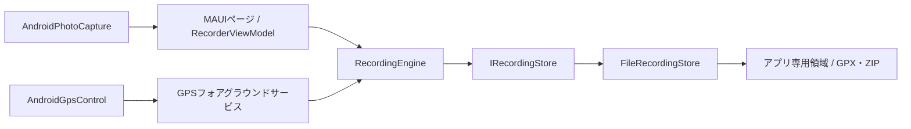

## はじめに

前回の [CoreS3でGPSログを記録する記事](https://qiita.com/tomokusaba/items/1fa6f13050716e7faa94) では、ファームウェアからSDカードへ保存する流れを追いました。続く [Windows版の記事](https://qiita.com/tomokusaba/items/076a724285ff3ef27b53) では、WPFでの取り込み、地図表示、編集を紹介しました。

今回は同じ [WalkLogger](https://github.com/tomokusaba/Yamanote) のAndroidアプリを取り上げます。スマートフォンのGPSとカメラで街歩きを記録し、あとからWindows版へ渡すためのアプリです。Windows版の全機能を移植したものではありません。

C#/.NETの基礎を前提に、MAUI画面からAndroid固有のGPS、記録コア、保存、共有までを追います📱

## 本記事のゴール

- MAUIの画面、共有コア、Android固有処理の境界を把握する
- GPSの取得から記録ファイルへの追記、再開までの経路を説明できる
- 写真をGPS点へ関連付け、Windows版へ渡す仕組みを理解する

## Androidアプリの構成

Android側の [`WalkLogger.Android.csproj`](https://github.com/tomokusaba/Yamanote/blob/main/src/WalkLogger.Android/WalkLogger.Android.csproj) は、MAUI 10.0.20を使う単一プロジェクトです。ターゲットは`net10.0-android`、最小Android APIは26です。

記録状態やGPS点の扱いは画面から分離されています。主な役割は次のとおりです。

| 役割 | 実装 | 主な責務 |
|------|------|----------|
| 📱 画面 | `WalkLogger.Android` | MAUIページ、ViewModel、AndroidのGPS・カメラ連携 |
| 🧭 記録コア | `WalkLogger.Recording` | 記録の開始・停止、点や写真の検証、区間管理 |
| 💾 ファイル | `WalkLogger.Recording.Infrastructure` | 端末内への保存、GPX・ZIPの生成 |
| 🗺️ 共通モデル | `WalkLogger.Core` など | GPS点や距離・区間の計算 |

画面操作とGPSコールバックは`RecordingEngine`を通ります。共通のデータ形式により、CoreS3やAndroidの記録をWindowsへ取り込めます。



## MAUIの起動と画面

[`MauiProgram.CreateMauiApp`](https://github.com/tomokusaba/Yamanote/blob/main/src/WalkLogger.Android/MauiProgram.cs) はDIコンテナーに`RecordingEngine`、`FileRecordingStore`、AndroidのGPS・写真サービス、ViewModelとページを登録します。記録は`FileSystem.AppDataDirectory`、エクスポート一時ファイルはキャッシュ領域に保存します。

[`App`](https://github.com/tomokusaba/Yamanote/blob/main/src/WalkLogger.Android/App.xaml.cs) はDIから[`AppShell`](https://github.com/tomokusaba/Yamanote/blob/main/src/WalkLogger.Android/AppShell.xaml.cs)を解決します。Shellは記録・記録一覧・設定のタブを持ち、幅600pxを境にタブバーの表示を切り替えます。

[`RecorderViewModel`](https://github.com/tomokusaba/Yamanote/blob/main/src/WalkLogger.Android/RecorderViewModel.cs)は`INotifyPropertyChanged`と`ICommand`で画面状態・操作を公開し、GPSや記録コアへ処理を委譲します。操作中の例外は画面メッセージとトレースログに記録します。

[`MainPage.xaml`](https://github.com/tomokusaba/Yamanote/blob/main/src/WalkLogger.Android/MainPage.xaml)はステータス、地図、距離、GPS状態、記録操作を表示します。[`RouteMapView`](https://github.com/tomokusaba/Yamanote/blob/main/src/WalkLogger.Android/RouteMapView.cs)がLeafletへGPS区間と写真情報を渡します。タイル表示には通信が必要ですが、記録はオフラインでも続きます。

## GPSを取得して記録する

開始時に[`AndroidGpsControl`](https://github.com/tomokusaba/Yamanote/blob/main/src/WalkLogger.Android/Platforms/Android/AndroidGpsControl.cs)は位置情報の許可、Android 13以降の通知許可、GPSの有効状態を確認します。[`AndroidManifest.xml`](https://github.com/tomokusaba/Yamanote/blob/main/src/WalkLogger.Android/Platforms/Android/AndroidManifest.xml)には位置情報と位置情報フォアグラウンドサービスの権限を宣言しています。要求するのは使用中の位置情報権限で、バックグラウンド位置情報権限は別途要求しません。

許可とGPSを確認すると[`GpsRecordingService`](https://github.com/tomokusaba/Yamanote/blob/main/src/WalkLogger.Android/Platforms/Android/GpsRecordingService.cs)を開始します。通知を表示し、`LocationManager`へ5秒または10秒間隔で更新を要求します。画面消灯中の継続を助ける部分WakeLockも使い、異常時は一時停止して通知と画面で知らせます。

届いた位置は20秒を超えて古ければ破棄し、それ以外はUTCの`TrackPoint`に変換して[`RecordingEngine.RecordAsync`](https://github.com/tomokusaba/Yamanote/blob/main/src/WalkLogger.Recording/Recording.cs)へ渡します。エンジンは`SemaphoreSlim`で状態操作を直列化し、点の妥当性・時刻・記録間隔を検証します。たとえば、最後に保存した点より時刻が戻る場合や、同じ区間内で設定間隔より早い点は拒否します。

```csharp
if (measurement.Time <= last.Time) return false;
if (last.Segment == segment &&
    (measurement.Time - last.Time).TotalSeconds < info.IntervalSeconds)
    return false;

var point = measurement with { Segment = segment };
await store.AppendPointAsync(info.Id, point);
```

GPSの更新要求は保存の保証ではありません。古い点や不正な点を拒否し、測位できなかった区間を埋めない設計です。

## アプリ再生成と区間の復元

記録コアは起動時に未終了データを復元します。前回のフォアグラウンドサービスが動いていなければ、ViewModelは一時停止にしてユーザーへ知らせます。状態を確認後、「記録を再開」できます。

再開時には`RecordingEngine`が区間番号を進めます。休止前後を別区間にし、Windows版の距離計算で休止時間を直線として加算しないようにします。CoreS3側の区間分けとも同じ考え方です。

ただし、フォアグラウンドサービスは中断を完全に防ぐ仕組みではありません。Androidの強制停止、端末再起動、メーカー独自の省電力制限で記録が途切れることがあります。長時間のGPS利用はバッテリーも消費します。通知や画面の状態を確認し、必要ならアプリから再開してください。

## 写真とGPS点を結び付ける

写真撮影は[`AndroidPhotoCapture`](https://github.com/tomokusaba/Yamanote/blob/main/src/WalkLogger.Android/Platforms/Android/AndroidPhotoCapture.cs)がMAUIの`MediaPicker`を通じて行います。EXIF撮影日時を解釈できればそれを優先し、取得できない場合は写真が返された時刻を推定値として写真メモに残します。

`RecordingEngine.AddPhotoAsync`は撮影時刻の前後60秒で最も近いGPS点を写真へ紐付けます。位置を撮影時刻へ補間するわけではなく、範囲内に点がなければ添付を拒否します。

[`FileRecordingStore`](https://github.com/tomokusaba/Yamanote/blob/main/src/WalkLogger.Recording.Infrastructure/FileRecordingStore.cs)は、アプリ専用領域に記録情報、`track.ndjson`、`photos.ndjson`、JPEGを保存します。GPS点は追記ごとにflushし、破損や写真不足は捨てずエラーにします。

## Windowsへ記録を渡す

記録一覧から共有するときは位置情報の共有を確認し、Androidの共有シートを開きます。写真入りZIPには`track.ndjson`、`recording.json`、写真メタデータ、JPEGに加えて、GPSルートの`track.gpx`も入ります。GPX単体には写真やメモは含まれません。

Android版は自動アップロードせず、OSの共有機能へファイルを渡します。ZIPを展開し、WPF版の「フォルダー取込」で選べば前回の記事の取り込み経路につながります。共有するまではGPSログと写真はアプリ専用領域に残ります。

## ビルドと実機確認

Android版の[README](https://github.com/tomokusaba/Yamanote/blob/main/src/WalkLogger.Android/README.md)が示す前提は、.NET SDK 10.0.401、`maui-android`ワークロード、Android SDK API 36、JDK 21です。

```powershell
dotnet workload restore src\WalkLogger.Android\WalkLogger.Android.csproj
dotnet build WalkLogger.Android.slnx
```

ビルドやインストールだけではGPS・カメラ・画面消灯中の継続を確認したことにはなりません。実端末やメーカー固有の省電力制限は別途確認が必要です。

## おわりに

WalkLoggerではMAUIが画面を組み立て、GPSサービスやカメラはAndroid層に置いています。状態遷移、GPS点の検証、写真との関連付け、保存形式を共有コアに置き、Windows版やCoreS3とつなげます。

クロスプラットフォームUIでもすべてを共通化する必要はありません。共有するルールとデータ形式、プラットフォーム固有の処理の境界を明確にすることが設計のポイントです。

CoreS3編・Windows編と合わせ、記録データの流れを追ってみてください🧭
