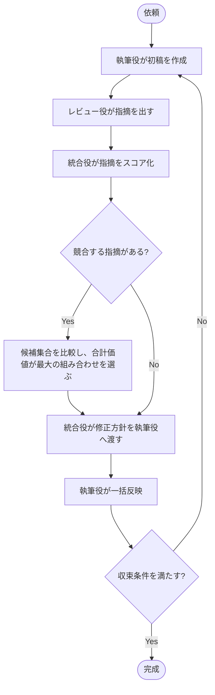

## はじめに

今回の話は、前回の設計をさらに一段先に進めたものです。

前回の記事では、複数のレビューエージェントを使うときに、

- 書き込み権限をレビュー役から切り離す
- 読み取り専用で指摘だけを返す
- 統合役が最終的な編集をまとめて行う

という設計を整理しました。

https://zenn.dev/tomokusaba/articles/a599cb645ca2c5

この設計自体はかなり有効です。特に、同じ成果物に対して複数の観点が並列で働くとき、**誰が最後に書くか**を明確にしておくことは、ワークフローの安定性に大きく効きます。

ただ、実運用ではもう一段、難しい問題が出てきます。

それは、レビューの指摘そのものが相反しうるということです。

- 「もっと具体例を載せた方がよい」
- 「説明は簡潔にした方がよい」
- 「この節を前に移した方がよい」
- 「ここは後ろに置いた方が自然」
- 「この主張は強く書いた方がよい」
- 「断定しすぎなので弱く書いた方が誠実」

同じ文章に対して、異なるレビュー観点がそれぞれ正しそうな指摘を出すことがあります。これらは、単に優先順位を決めれば済む問題ではありません。

実際には、**「どの指摘が最終成果物の価値を最も高めるか」**を比較しながら、収束していく必要があります。

今回の記事では、その考え方を「統合役にスコア化させる」という観点で整理します。要するに、レビュー結果をそのまま採用するのではなく、**各指摘に価値とリスクを付けて、全体として最もよい選択を選ぶ**という設計です。

ここで重要なのは、統合役の役割です。

統合役は、指摘の一覧をただまとめるだけではありません。レビューの結果を整えたうえで、**書き込み権限を持たずに執筆役へその結果を渡す**構造にします。執筆役が最終的にファイルを更新し、レビューや統合の結果を実体に落とし込みます。

この設計により、レビュー系のエージェントは「自分で本文を書き換える」ことをしません。代わりに、指摘・優先度・修正方針・リスクの整理を返し、実際に書くのは執筆役に一本化されます。

この分離は、レビューの並列性と編集の責任を切り分けるうえで非常に重要です。

## 今回のゴール

この記事では次の点を整理します。

- ✅ 複数レビューの指摘が相反する背景を説明する
- ✅ 旧来の「優先順位だけで解決する」設計の限界を指摘する
- ✅ 統合役がレビュー項目をスコア化して収束する考え方を示す
- ✅ 文章／コード / 設計のような成果物に応用できる形に一般化する
- ✅ その仕組みが、人間の最終判断を残しながら AI 連携を安定させる仕組みになることを示す
- ✅ 統合役はレビューの統合を担い、執筆役が最終書き込みを行う責務分離を整理する

ポイントは、**レビューを「正しいかどうか」の二値ではなく、「価値の大きさ」で扱う**ことです。

## 相反するレビューは、どこから来るのか

レビューが相反するのは、観点が違うからです。

文章を書くとき、次のような観点が同時に働きます。

- 事実の正しさ
- 読者の理解しやすさ
- 論理の整合性
- 文体の自然さ
- 伝わりやすさ
- 既存の比重や導線

たとえば、ある段落について次のようなレビューが来ることがあります。

| レビュー観点 | 指摘 | 価値の方向 |
|------|------|------------|
| 🔎 事実確認 | 「この説明は誤りがある」 | 正確さを高める |
| 🧩 構成レビュー | 「ここの順番が悪い」 | 論理の流れをよくする |
| 📝 表現レビュー | 「冗長なので簡潔にした方がよい」 | 伝わりやすさを高める |
| 👀 読者視点 | 「具体例がないとつまらない」 | 実感を持たせる |

これらは、どれも間違っていないように見えます。

しかし、すべての指摘をそのまま適用すると、文章は次のように壊れます。

- 事実説明が増えて、全体が重くなる
- 具体例が増えて、主題がぼやける
- 表現が短くなって、説得力が落ちる
- 章の順番が変わって、読み手の導線が崩れる

このとき、単純な「上から順に反映する」方針では、後続のレビューが前段の修正を打ち消し、最終的には**どの指摘が正しかったのかが分かりにくくなる**のです。

つまり、相反する指摘をどう扱うかという問題は、レビューの質そのものではなく、**レビューを統合する設計**の問題です。

## 新しい問い: 「正しい順番」ではなく「価値が最大化される組み合わせ」を選ぶ

これまでの設計では、統合役は次のようなルールを持っていました。

1. レビュー結果を集める
2. 重複を削る
3. 優先順位を決める
4. 一括反映する

これはかなり有効ですが、相反する指摘に対してはまだ弱いです。

たとえば、次のようなケースです。

- 事実確認役: 「この具体例は誤りです」
- 表現レビュー役: 「この具体例があると、説明が分かりやすい」
- 構成レビュー役: 「この節を前に出した方がいい」
- 表現レビュー役の別の人: 「ここは簡潔にした方がいい」

このとき、優先順位だけを見れば、事実修正が最優先になります。しかし、**事実修正だけ反映しても、読者の理解は改善しない**ことがあります。

逆に、構成変更と具体例の追加を同時に行って、教材として大きく良くなる可能性もあります。

ここで重要なのは、レビューを「正しいかどうか」で線引きするのではなく、**その指示を反映したときの全体価値がどれだけ上がるか**で評価することです。

この視点が、統合役にとっての次の成熟版になります。

## 統合役の新しい責務: 価値とリスクをスコア化する

レビュー統合に「点数化」を導入すると、設計がかなり整理しやすくなります。

レビューの各指摘に対して、統合役は次のような評価軸を持つと考えるとよいです。

- 効果 (`impact`) : 期待される改善効果
- 確信度 (`confidence`) : 指摘の妥当性
- 説明改善 (`clarity_gain`) : 読者理解が改善する期待値
- リスク (`risk`) : 既存の前提や文脈を壊す可能性
- 実施コスト (`cost`) : 修正にかかる労力やリスク
- 競合ペナルティ (`conflict_penalty`) : 他指摘との衝突度

以下では説明のため、評価軸を英語のキー名で揃えます。たとえば、次のような式で見積もるとイメージしやすいです。

```text
net_value = impact + confidence + clarity_gain - risk - cost - conflict_penalty
```

この `net_value` は、レビュー項目ごとの「反映する価値」を表します。

| 項目 | 意味 | 例 |
|------|------|----|
| 効果 (`impact`) | 指摘が成果物に与える効果の大きさ | +15 |
| 確信度 (`confidence`) | レビューが正しいと感じられる確信度 | +8 |
| 説明改善 (`clarity_gain`) | 読者理解が改善する期待値 | +10 |
| リスク (`risk`) | 既存の前提や文脈を壊す可能性 | -12 |
| 実施コスト (`cost`) | 修正にかかる労力やリスク | -6 |
| 競合ペナルティ (`conflict_penalty`) | 他指摘と衝突する度合い | -10 |

このようにスコア化すると、どの指摘を採用するかが、単なる「感覚的な好み」ではなく、**全体最適に向う判断**として整理できます。

また、今までは「この指摘は正しい」「この指摘は誤っている」で終わっていたものが、次のように扱えるようになります。

- ほぼ確実に正しいが大きくコストが高い
- ちょっと主観だが劇的に伝わりやすくなる
- 影響が小さく、後で対応してもよい
- 他の変更と相性が悪く、同時採用は避けるべき

これが、レビュー統合における「点数化」の意味です。

## 実例: この記事の見出しの改善を巡る相反レビュー

ここでは、実際に起こりやすい相反レビューを、具体的な文面で見てみましょう。

ある節の初稿が次のような状態だとします。

> 「AI を使うと、文章の修正が早くなります。特に、複数の観点でレビューを受けると、品質が上がります。」

この段落に対して、レビューエージェントが次のような指摘を返したとします。

| レビュー観点 | 指摘 | 提案 | スコア |
|--------------|------|------|--------|
| 🔎 事実確認 | 「『AI を使うと文章の修正が早くなる』は断定しすぎで、文脈によって変わる」と指摘 | 「AI を使うことで、繰り返し修正しやすくなることがある」へ修正 | impact +10 / risk -3 |
| 🧩 構成レビュー | 「ここで段落の主張が広すぎる。導入である前提を明示した方がよい」 | ここを導入節に寄せる | impact +12 / risk -5 |
| 📝 表現レビュー | 「『品質が上がる』は抽象的で、読者が感じ取りにくい」 | 「より明確な具体例を入れる」 | impact +9 / risk -2 |
| 👀 読者視点 | 「具体例がないと説得力が弱い」 | 1 つ例を添える | impact +14 / risk -6 |

このケースでは、各指摘がそれぞれ正しそうに見えます。

しかし、すべてを同時に採用すると、段落は次のような状態になります。

- 説明が長くなる
- 導入の主張が散る
- 具体例が増えて主題がぼやける
- 断定表現を弱くして、説得力が下がる

つまり、**相反レビューの問題は「どれが正しいか」ではなく、「どの組み合わせが全体として価値が高いか」**にあります。

ここで統合役は、候補を組み合わせてスコアを比較します。

| 採用候補 | 期待値 | リスク | 合計 |
|----------|--------|--------|------|
| 事実修正のみ | +10 | -3 | +7 |
| 事実修正 + 具体例追加 | +24 | -9 | +15 |
| 導入の整理 + 具体例追加 | +26 | -11 | +15 |
| 全部入れる | +45 | -20 | +25 |

このとき、統合役は「全部入れる」が最も価値が高いように見えても、最終的には**実際の文章の流れを損なう場合は別の重みを増やす**ことがあります。

たとえば、実際にその文章が「少し長くなると、読み手が飽きる」ような導入なら、具体例追加の価値が高い一方、段落ズラしは大きなリスクです。逆に、技術書の導入として説明の明確さを重視するなら、導入整理が高く評価されます。

このように、統合役が大切にするのは、**「正しい指摘を全部採用する」ことではなく、「全体の目的と文脈に対して最も価値が大きい組み合わせを選ぶ」こと**です。

この具体例では、最終的に執筆役が一括で反映するのは、次のような整理済みの形です。

> 「AI を使った文章修正には、繰り返し改善しやすいという利点があります。特に、複数の観点でレビューを受けると、より明確な説明に整理しやすくなります。たとえば、事実確認と構成レビューを合わせて行うと、主張が強くなりすぎず、読者に伝わりやすい文章に近づきます。」

ここで重要なのは、統合役が本文を書き換えていないことです。統合役は指摘と重みをまとめ、執筆役に結果を渡します。執筆役がその推薦をもとに、最終ファイルを更新します。

つまり、レビューの価値を積み上げる責務と、成果物を書き換える責務を分離しているのがこの設計の本質です。

## 統合役が点数化するときの仕組み

ここからは、統合役が実際にどう点数を付けるのかを、もう少し具体的に見ていきます。

ポイントは、数値を「ただの感想」ではなく、**比較可能な評価軸**として使うことです。たとえば、ある指摘が「良さそうに見える」だけではなく、次のような尺度で見積もります。

- その指摘が成果物にどれだけ効くか（効果）
- その指摘が本当に妥当か（確信度）
- その指摘が説明の明確さをどれだけ高めるか（説明改善）
- その指摘を入れると壊れるリスクがどれだけあるか（リスク）
- その修正にどれだけ手間がかかるか（実施コスト）
- その指摘が別の指摘と衝突するか（競合ペナルティ）

この 6 つを 1〜5 で評価し、合計で最終的な優先度を決めるイメージです。数値自体は厳密な理論値ではなく、**比較のための定性的な重み付け**として使います。

結論から言うと、統合役の仕組みは「各指摘に重みを付ける」だけではありません。実際には、次の流れで処理します。

1. レビュー結果を同じスキーマに正規化する
2. 重複や近い指摘をグループ化する
3. それぞれの指摘に `impact` / `confidence` / `clarity_gain` / `risk` / `cost` / `conflict_penalty` を評価する
4. その指摘が採用されたときの全体効果を見積もる
5. 競合する候補を除外しながら、全体価値が最大になる組み合わせを選ぶ
6. 最終的な修正方針を執筆役へ渡す

ポイントは、**最終的な決定は「1 個の指摘が良いか」ではなく、「指摘の組み合わせが全体としてどうなるか」**で判断する点です。

### 1. 正規化する

まず、各エージェントが返すレビューは、文章で書かれた感想ではなく、共通の構造に揃えます。

```json
{
  "issue_id": "R-102",
  "source": "fact-checker",
  "category": "fact",
  "target": "intro-paragraph",
  "severity": "important",
  "location": "paragraph-2",
  "before": "AI を使うと文章の修正が早くなる",
  "after": "AI を使うことで、繰り返し修正しやすくなることがある",
  "impact": 10,
  "confidence": 8,
  "clarity_gain": 6,
  "risk": 3,
  "cost": 2,
  "conflict_penalty": 1,
  "conflict_group": "intro-assertion",
  "rationale": "断定しすぎているため、読み手に誤解を与えやすい"
}
```

このような構造に揃えることで、統合役は「レビューの内容を読む」だけでなく、**数値的に比較できる材料**に変えられます。

### 2. 重複や衝突をグルーピングする

次に、同じ箇所に対する指摘を集約します。たとえば、同じ段落に対して次のようなレビューが来たとします。

- 「ここは具体例を増やした方がよい」
- 「ここは簡潔にした方がよい」
- 「ここは導入を前に出した方がよい」

これらはすべて正しそうに見えますが、同時に入れると文脈が崩れます。

そこで、統合役は `conflict_group` を使って、**互いに競合しうる指摘をまとめる**のです。

こうすると、統合役は「全部採用」という発想ではなく、**そのグループのなかで最も価値が高い解集合を探す**ようになります。

### 3. 価値を数式に落とす

各レビュー項目に対して、統合役は次のような式で価値を見積もります。

```text
net_value = impact + confidence + clarity_gain - risk - cost - conflict_penalty
```

ここで `impact` は「どれだけ成果物の価値を上げるか」、`confidence` は「その指摘が正しい確信度」、`clarity_gain` は「説明がどれだけ伝わりやすくなるか」、`risk` は「変えすぎて壊す可能性」、`cost` は「実施コスト」、`conflict_penalty` は「他の候補と衝突する度合い」を表します。

この 6 つの軸を 1〜5 で評価することで、単なる「主観的な良さ」ではなく、**全体への貢献度**として比較できます。

このとき、特に大事なのは、各軸の評価が「ごく低い」「中くらい」「かなり高い」のように、ある程度の幅を持って数えることです。たとえば、`impact` は 1〜5 のような簡単な尺度を使い、`risk` は 1〜5 で「ほぼ影響なし」から「設計を壊す可能性がある」までを表します。

| 評価軸 | 1 のとき | 3 のとき | 5 のとき |
|--------|----------|----------|----------|
| 効果 (`impact`) | ほぼ変わらない | 少し改善する | 価値が大きく上がる |
| 確信度 (`confidence`) | 主観が強い | だいたい妥当 | 非常に妥当 |
| 説明改善 (`clarity_gain`) | ほとんど変わらない | やや伝わりやすくなる | 大きく伝わりやすくなる |
| リスク (`risk`) | ほぼ無視できる | いくらか気になる | 破壊的になりうる |
| 実施コスト (`cost`) | すぐ対応できる | 少し手間がかかる | かなり大きな修正 |
| 競合ペナルティ (`conflict_penalty`) | 衝突しない | 少し衝突する | 同時適用が難しい |

このように、各項目にスコアの基準を持っておくと、最後に「どの指摘を採用するか」の判断が、感覚論ではなく比較可能な判断になります。

### 4. 目的関数を決める

**ここが重要です。** 統合役が点数化するとき、最終的に最大化したいものを決める必要があります。

たとえば、技術記事の場合は次のような目的関数が考えられます。

```text
maximize = fact_accuracy + clarity + flow + credibility - redundancy - verbosity
```

一方で、製品の README なら次のような重みになるかもしれません。

```text
maximize = correctness + developer_productivity + onboarding_speed - risk_of_confusion
```

つまり、**レビューを採用する価値は、成果物の性質によって変わる**のです。

これが、「事実 → 構成 → 表現」という固定の優先順位だけではなく、目的に応じたスコア設計が必要になる理由です。

### 5. 候補集合の最適解を選ぶ

統合役は、指摘一つ一つを採用するのではなく、候補集合全体を見て最適解を選びます。

例として、次の 3 つの候補があったとします。

- A: 具体例を 1 つ増やす（+18）
- B: 断定表現を弱める（+12）
- C: 導入を整理して、段落順を変える（+20）

ただし、A と C は同時に適用すると文章が長くなり、B と C は「説明の流れ」が変わるかもしれません。

このとき、統合役は次のような候補を比較します。

| 候補集合 | 合計価値 | 追加のラグ/リスク |
|----------|-----------|------------------|
| A + B | +30 | 低 |
| B + C | +32 | 中 |
| A + C | +38 | 高 |
| A + B + C | +50 | かなり高 |

このとき、**総和が最大の集合が必ず最適とは限りません**。長すぎる、流れが崩れる、記事の目的とズレる、といった要素を `risk` や `conflict_penalty` で補正します。

最終的に、統合役は「A + B」や「B + C」のような、**全体の価値が最も高く、非競合な組み合わせ**を選ぶのです。

### 6. 最後に執筆役へ渡す

**ここが設計の本質です。** 統合役が最終的に本文を変えるわけではありません。

統合役は、次のような形で執筆役へ渡します。

```json
{
  "selected_issues": ["R-102", "R-204"],
  "rejected_issues": ["R-301"],
  "reason": "具体例追加と文の明確化は価値が高い一方、導入の順番変更は文章全体の流れを崩すため見送り",
  "proposed_edits": [
    { "target": "intro-paragraph", "before": "AI を使うと文章の修正が早くなる", "after": "AI を使うことで、繰り返し修正しやすくなることがある" },
    { "target": "intro-example", "before": "品質が上がる", "after": "より明確な具体例を入れる" }
  ]
}
```

執筆役はこの指示を受けて、最終的にファイルへの反映を行います。

ここで重要なのは、**レビューの評価と成果物への書き込みが分離されている**ことです。統合役は「最善の組み合わせ」を選ぶ責務を持ち、執筆役はその方針を実体に落とす責務を持つことで、作業が安定します。

この仕組みは、AI によるレビューの並列実行にとても相性が良いです。レビューエージェントがいくら多くても、最終的に誰が書き込むかが明確であれば、競合や混乱を避けやすくなります。

## 実際のレビュー出力を、統合しやすい形式にする

ここで大事なのは、レビュー結果をただの感想ではなく、**統合役が算出できる形式**にすることです。

以前の記事でも、`source` / `severity` / `location` / `before` / `after` / `rationale` のような形式を揃える考え方を示しました。今回はそのうえで、さらに次の列を付けると、スコア化しやすくなります。

| 列 | 意味 |
|----|------|
| `issue_id` | 指摘を一意に識別する ID |
| `target` | どこに対する指摘か |
| `category` | 事実 / 構成 / 表現 / UX |
| `impact` | 効果の大きさ |
| `confidence` | 正しさの確信度 |
| `clarity_gain` | 説明が伝わりやすくなる期待値 |
| `risk` | 破壊リスク |
| `cost` | 修正コスト |
| `conflict_penalty` | 他候補との衝突ペナルティ |
| `conflict_group` | 競合する指摘のグループ |
| `proposal` | 修正案 |
| `rationale` | 理由 |

こうすると、統合役は単に「指摘の一覧」を見るのではなく、**候補ごとに価値を計算できるようになります**。

これは文章レビューだけでなく、コードレビューや設計レビューにも応用しやすいです。

たとえば、コードレビューでは次のような候補が出てきます。

- `DateTime.Now` を `TimeProvider` に置き換える
- 例外メッセージを明確にする
- `Task.Run` をやめて非同期の流れを整理する
- `private` を増やして責務を分離する

それぞれに対して、以下を評価できます。

- どれだけ設計が良くなるか
- 流動性や互換性を壊すか
- テスト追加の負担は大きいか
- 他のリファクタリングと衝突しないか

この評価を揃えておくと、統合役は **「全部採用する」ではなく、「最適な組み合わせを選ぶ」** ことができるようになります。

## 競合解決は、優先順位ではなく候補集合の最大化として扱う

ここが本質です。

従来の設計では、競合した指摘を解決するときのルールは暗黙に「事実 → 構成 → 表現」の順でした。これは便利ですが、実際には相容れないケースが多いです。

たとえば次のような状態を考えてみましょう。

- A: この記事をより短くしたい
- B: この記事をより具体例で説明したい
- C: この記事の導線を整理したい

A は簡潔性を優先し、B は説得力を優先し、C は論理の流れを優先します。

それぞれの指摘は「自分の観点では正しい」です。しかし、それらは一括で入れると、文章の性格がぶれてしまうことがあります。

この場合、重要なのは「最終文章の方向性」を定義することです。

- 説明重視なのか
- 読者を早く理解させるのか
- 体験談を強く見せるのか
- 参考文献や根拠を重視するのか

この方向性が定まれば、各レビュー指摘の点数も変わります。

つまり、相反する指摘を解くには、**最終成果物の目的関数**が必要です。

この目的関数を統合役が持つと、レビューの収束がかなり安定します。

## 収束ループを設計する

では、こうしたスコア化をどうワークフローに落とし込むかを見ていきます。



ここでのポイントは、統合役が「どのレビューを採用するか」をその場で決めるのではなく、**候補集合ごとのスコアを比較して最適解を選ぶ**ことです。

また、収束条件も明確にしておくとよいです。

| 観点 | 収束条件の例 |
|------|--------------|
| 🔎 事実指摘 | 重大な誤りが 0 件 |
| 🧩 構成指摘 | 重大なブロッカーが 0 件 |
| 📝 表現指摘 | 任意の改善が残っていても、総合評価が上限に達している |
| 📊 変更後価値 | 全体スコアが改善し続ける状態で、追加改善が限界に達している |
| 🔁 最大ラウンド数 | 3〜5 ラウンドを超えない |

ここで大事なのは、収束条件を「気分で決める」のではなく、**採用した改善が全体としてプラスになるか**で判断することです。

## 設計としての大きな意義

この考え方は、単なるレビューの便利さではありません。

複数のエージェントが共同で成果物を改善する世界では、レビューの質が上がるほど、むしろ統合の難しさが増えます。なぜなら、レビューは「観点の多さ」そのものが価値を持つからです。

一方で、レビューが多すぎると、統合役が「どれを採用すべきか」を見失いやすくなります。

ここで、スコア化が効いてきます。

- 価値が高い指摘を優先できる
- 破壊的な指摘を抑制できる
- 実施コストの高い改善を後回しにできる
- 相反する指摘を比較しやすくなる
- 人間が最終判断しやすい形に整理できる

これは単なる自動化ではなく、**人間の判断の負荷を下げるための設計**です。

最終的に、AI がすべてを判断するのではなく、人間が「この方向性でいいか」を決めておき、そのうえで統合役が候補集合を最適化する。こういう構造が、AI と人間の協調を安定させるのだと感じています。

そして、統合役は書き込み権限を持たずに執筆役にその結果を渡す仕組みにします。統合役はレビューと比較の責務を持ち、執筆役が最終ファイル更新を担うことで、検証と編集の責任が分離されます。

この責務分離があるからこそ、レビュー項目を件ごとに比較し、相反する指摘を構造化して、最終的に「これは採用し、これは見送り」に整理しやすくなります。

## まとめ

複数エージェント設計において、レビュー役が書き込み権限を持たないという設計はかなり重要です。

しかし、それだけでは不十分です。レビューそのものが相反することは珍しくなく、そのときに必要なのは「適用順」ではなく、**全体価値を最大化する選定**です。

そのために、統合役は次の役割を持つべきだと考えています。

- レビュー指摘を整形して候補化する
- 価値とリスクをスコア化する
- 相反する指摘を候補集合の最適解として扱う
- 収束条件を決めて、改善ループを止める
- 書き込み権限を持たず、執筆役に結果を渡す

このようにレビューの統合を点数化して考えると、複数エージェントを使ったワークフローが、単純な「多数決」ではなく、**設計として説明できる仕組み**になります。

もちろん、AI に全部任せるのではなく、人間が方針と目的を決めたうえで、その枠組みに従って最適化する。ここが、今の自分の中で最もしっくりくる設計です。

この発想を、次はもう少し実践寄りに拡張して、「どのようにレビュー指摘をスコア化するのか」の具体例まで落とし込みたいと考えています。

---

この記事の前提として、私は次の系統の記事を続けて書いています。

- [GitHub Copilot CLI で考える複数エージェント設計](https://zenn.dev/tomokusaba/articles/a599cb645ca2c5)
- [.NET コード生成テンプレートで試す複数エージェント開発ループ](https://zenn.dev/tomokusaba/articles/14f2373c51e1f2)

今回は、レビュー統合の収束設計をもう一段深く掘り下げた形です。次の記事では、実際にどのようなスコアリング式やレビュー用スキーマを使うと良いかを、より具体的な例で整理したいと思います。
