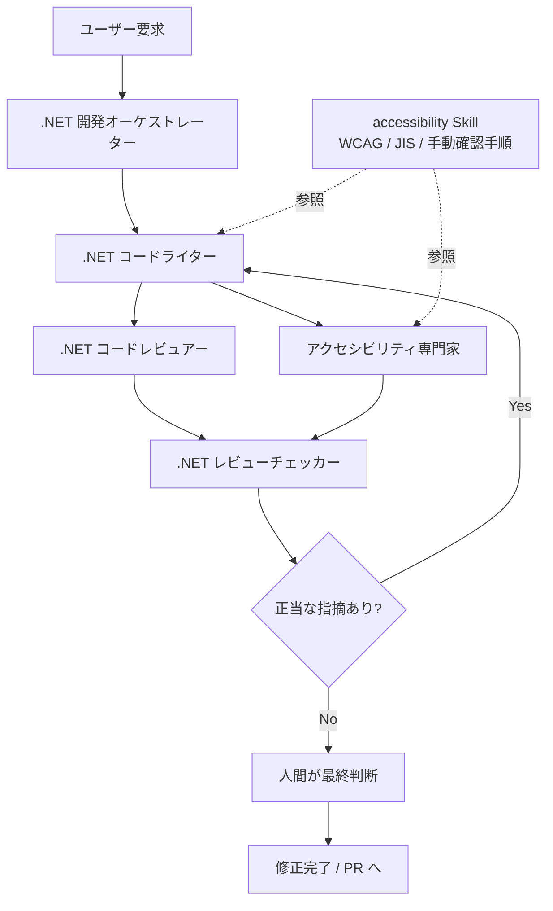

## はじめに

GitHub Copilot CLI で Web アプリを作っていると、実装やテストはかなり進むのに、**アクセシビリティの確認だけ最後に押し込まれがち**だと感じることがあります。特に UI の変更が続くと、label、focus、keyboard 操作、エラー表示の自然さといった観点は、後ろ倒しになりやすいです。♿

私が最近よい手応えを感じているのは、[DotnetTemplate](https://github.com/tomokusaba/DotnetTemplate) にある **Custom Agents と Skills を組み合わせたワークフロー**をそのまま Web アプリ開発の流れに乗せるやり方です。README では、このテンプレートを **.NET / C# 開発で GitHub Copilot を安全かつ一貫して使うための customization テンプレート**と位置づけており、Copilot CLI からもリポジトリスコープの customization として扱う前提が書かれています。🧭

今回はその中でも、`.github/agents/dotnet-development-orchestrator.agent.md`、`.github/agents/accessibility.agent.md`、`.github/skills/accessibility/SKILL.md` を中心に、**なぜこの流れが Web アクセシビリティ改善に効くのか**を順番に整理します。単なる機能紹介ではなく、「実際にどう回すと改善が進みやすいのか」に絞って見ていきます。🔍

## 本記事のゴール

- DotnetTemplate を参考にした **アクセシビリティ改善フローの全体像** をつかむ
- `アクセシビリティ専門家` Agent と `accessibility` Skill の **役割の違い** を整理する
- Web アプリを作るときに、**どの段階で何を任せると改善が前に進むか** を理解する
- **自動チェックだけでは足りず、人間の判断が残る理由** を実務目線で確認する

## 前提条件

- ✅ GitHub Copilot CLI からリポジトリ内の customization を利用できること
- ✅ 対象リポジトリに `.github/agents` と `.github/skills` を置けること
- ✅ Web アプリの UI 変更を伴う実装であること
- ✅ 最終的な判断と出荷責任は人間が持つ前提で進めること

:::message alert
このワークフローは **アクセシビリティ改善を継続しやすくする実務フロー** です。WCAG 適合監査そのものを自動化するものではありませんし、ユーザーテストや当事者レビューを置き換えるものでもありません。
:::

まずは「なぜ自動チェックだけでは足りないのか」を確認しておきます。

## 背景: 自動チェックだけでは Web アクセシビリティは育たない

DotnetTemplate の [`accessibility` Skill](https://github.com/tomokusaba/DotnetTemplate/blob/main/.github/skills/accessibility/SKILL.md) には、かなり大事な一文があります。

> 自動検査だけで完了としない。keyboard、focus、screen reader、zoom、contrast は手動確認を併用する。  
> — [Accessibility Skill](https://github.com/tomokusaba/DotnetTemplate/blob/main/.github/skills/accessibility/SKILL.md)

これは本当にその通りで、axe や Lighthouse のような自動チェックは非常に有効ですが、**「見つけやすい問題を広く拾う」のが得意** なのであって、体験全体の自然さまでは保証してくれません。たとえば、ボタン名が画面上の文言と音声読み上げでズレていないか、ダイアログを閉じたあと focus が自然な場所へ戻るか、日本語のエラー文が具体的で修正しやすいか、といった点は人間の判断が強く必要です。🧠

しかも DotnetTemplate は、アクセシビリティの根拠を推測で語らないようにしています。Skill でも Agent でも、WCAG 判断では **[W3C WAI の WCAG 日本語ページ](https://www.w3.org/WAI/standards-guidelines/wcag/ja)** を一次情報として確認するルールが明記されています。つまり、単に「a11yっぽく直す」のではなく、**根拠を持ってレビューし、根拠を持って直す** 方向へ寄せているわけです。📚

この土台があるからこそ、次に見るワークフローが「便利なだけ」で終わらず、改善の再現性を持ちやすくなります。

## DotnetTemplate が置いている土台

[README.md](https://github.com/tomokusaba/DotnetTemplate/blob/main/README.md) を見ると、DotnetTemplate は Custom Agents と Agent Skills を役割分担の前提で設計しています。アクセシビリティだけを孤立させるのではなく、**実装・レビュー・再修正の流れの中に組み込んでいる** のがポイントです。🛠️

特に README に書かれている既定フローは、次のとおりです。

1. `.NET 開発オーケストレーター` が要求を整理する
2. `.NET コードライター` が実装とテストを進める
3. `.NET コードレビュアー` が差分をレビューする
4. ASP.NET Core UI 変更なら `アクセシビリティ専門家` が専門レビューする
5. `.NET レビューチェッカー` が指摘を精査する
6. 正当な指摘がなくなるまで Writer が修正する

フローにすると、こうなります。

この flow がアクセシビリティ改善に効く理由を先にまとめると、**実装の途中で専門レビューが入り、Skill が確認基準を固定し、最後は人間が体験として判断する** からです。つまり「作る」「見る」「直す」「判断する」が分離されているので、アクセシビリティが最後の思い出し作業になりにくいわけです。ここからは、その土台と各 Step を順番に見ていきます。

## 判断基盤としての accessibility Skill

DotnetTemplate の [`accessibility` Skill](https://github.com/tomokusaba/DotnetTemplate/blob/main/.github/skills/accessibility/SKILL.md) は、単なる豆知識集ではありません。**一次情報、確認フロー、レビュー観点、手動テスト、自動テストの使い分け** までをまとめた運用手順です。📚

この Skill の価値は、特に 2 つあります。

### 1. 「根拠の取り方」を固定できる

Skill では、WCAG / JIS の判断をするときは **必ず W3C WAI の WCAG 日本語ページを一次情報として参照する** と定めています。Agent が賢いかどうか以前に、**どこを根拠にするかが固定される** ので、レビューのぶれが減ります。🧭

### 2. 「どう確認するか」を実務に落とせる

Skill には、フォーム、dynamic UI、visual design、日本語入力、手動確認、自動確認の観点がまとまっています。たとえば、自動確認だけでなく、

1. Keyboard only で主要フローを完走する  
2. focus indicator を確認する  
3. 400% zoom を確認する  
4. NVDA / VoiceOver / Narrator などで smoke test する  

という流れまで書かれています。つまり Skill は、Agent が一度きりの判断をするためだけではなく、**チームで繰り返し使える確認の型** を提供してくれます。🔁

ここで、Agent と Skill と人間の役割を一度整理しておきます。

| 担当 | 主な役割 | 得意なこと | 代替できないこと |
|------|----------|------------|------------------|
| 🤖 Agent | 実装・レビュー・指摘の実行役 | 差分を読む、観点を当てる、修正候補を返す | 最終責任、文脈依存の優先順位づけ |
| 🧠 Skill | 判断基準と手順の土台 | 一次情報の固定、確認漏れの防止、再現性の確保 | 差分ごとの具体的な意思決定 |
| 👤 Human | 最終判断と品質の受け持ち | 体験の自然さ、プロダクト文脈、優先順位、受け入れ判断 | 反復作業の網羅、観点の機械的保持 |

この表のとおり、**Skill は Agent を置き換えるものではなく、Agent が迷わないためのレール**です。そして人間は、そのレールの上で出てきた結果を受け取り、最終的な品質判断を引き受けます。

## Step 1: オーケストレーターが要求を整理する

[`dotnet-development-orchestrator.agent.md`](https://github.com/tomokusaba/DotnetTemplate/blob/main/.github/agents/dotnet-development-orchestrator.agent.md) では、`.NET 開発オーケストレーター` が **最初に呼ばれる入口 Agent** と定義されています。そして大事なのは、**自分ではコードを書き換えない** ことまで明記されている点です。🧭

これが Web アプリ開発で効くのは、最初の依頼を「ページを追加する」「フォームを直す」「バリデーションを改善する」といった実装指示のまま流さず、**どこに UI 変更があり、どこで専門レビューが必要か** を先に分解できるからです。たとえばログイン画面の改善でも、見た目の変更だけなのか、入力補助まで触るのか、エラー表示の体験も変わるのかで、後段の確認項目はかなり変わります。🔍

オーケストレーターがここを握ってくれると、Writer は作ることに集中でき、Reviewer やアクセシビリティ専門家は「何を見るべき差分か」を見失いにくくなります。つまり、最初の整理がアクセシビリティ品質の土台になります。次は実装担当の役割です。

## Step 2: Writer が Web アプリの UI とテストを実装する

README では、`.NET コードライター` は **C# / .NET コード、xUnit テスト、必要な関連ファイルの実装担当** とされています。ここで Web アプリ開発に置き換えると、Writer は Razor / Blazor / HTML / CSS を修正しつつ、必要に応じて自動テストも足していく役です。🛠️

たとえば、次のような改善は Writer の担当になります。

- フォーム入力に適切な label と hint を付ける
- icon-only button に accessible name を与える
- バリデーションメッセージと入力欄を関連付ける
- dialog の open / close にあわせて focus を管理する
- Playwright や UI テストで主要導線の回帰を防ぐ

この段階で大切なのは、Writer が **Skill を参照しながら実装できる** ことです。後で詳しく触れますが、DotnetTemplate の Skill には review 観点だけでなく、フォーム、dynamic UI、visual design、手動確認の流れまでまとまっています。つまり Writer は、単に「指摘を直す人」ではなく、**最初からアクセシビリティを織り込んで実装する人** になれます。ここがまず 1 つ目の改善ポイントです。✅

ただし、Writer だけで完結させないのが DotnetTemplate のよいところです。次に、専門レビューが入ります。

## Step 3: アクセシビリティ専門家が UI 差分を専門レビューする

[`accessibility.agent.md`](https://github.com/tomokusaba/DotnetTemplate/blob/main/.github/agents/accessibility.agent.md) を見ると、`アクセシビリティ専門家` は **読み取り専用の専門レビュー Agent** として定義されています。修正はせず、WCAG / JIS / 日本語 UX / screen reader / keyboard / focus の観点で、**指摘だけを返す** 役です。♿

私はこの設計がとても重要だと思っています。なぜなら、実装者が自分の差分をそのまま自己採点すると、どうしても「直したつもり」になりやすいからです。たとえば、`aria-label` を足したことで満足してしまっても、visible label と読み上げ名が大きくずれていたら、音声入力や支援技術の利用者にはむしろ分かりにくくなることがあります。

この Agent のレビュー観点はかなり実務的で、次のような点が含まれています。

| 観点 | 具体例 | Web アプリでの意味 |
|------|--------|--------------------|
| ⌨️ Keyboard / focus | Tab 順、focus trap、focus restore | 操作が途中で迷子にならない |
| 🏷️ Semantics / labels | semantic HTML、label、accessible name | 読み上げと見た目の意味がそろう |
| 🔔 Announcement | route change、toast、status | SPA でも状態変化が伝わる |
| 🇯🇵 日本語 UX | 日本語入力、住所、氏名、エラー文 | 日本語 UI として自然に使える |
| 🎨 Visuals | contrast、focus indicator、zoom | 見える・追える・押しやすい |

しかもオーケストレーター側の定義では、**ASP.NET Core の UI / Razor / Blazor / MVC / Fluent UI Blazor 変更がある場合にアクセシビリティ専門家を呼ぶ** と書かれています。つまり、このレビューは気が向いたときにやる任意作業ではなく、**UI 変更時の標準フロー**として組み込まれています。これが実務ではかなり効きます。

## Step 4: Checker が指摘を仕分けし、Writer が修正を閉じる

オーケストレーターの定義では、`.NET レビューチェッカー` が Reviewer とアクセシビリティ専門家の指摘を **Valid / Invalid / Needs clarification / Already addressed** に分類します。ここがあることで、レビューの指摘が無限ループになりにくくなります。🔍

アクセシビリティ改善でありがちなのは、正しい指摘と「好みの話」が混ざることです。たとえば、

- visible label と accessible name の不一致は **直すべき問題**
- 文言のトーンが少し気になるかどうかは **要件次第**
- すでに最新差分で解決済みなら **戻さなくてよい**

のように、粒度が揃わないことがあります。Checker が間に入ると、Writer は **正当な指摘だけに集中して直せる** ようになります。これは地味ですが、改善を実際に前へ進めるうえでとても大きいです。🚦

そして、指摘が整理された状態で Writer へ戻るからこそ、修正 → 再レビュー → 収束のサイクルが短くなります。たとえば会員登録フォームを作るなら、Writer がフォームとバリデーションを実装し、アクセシビリティ専門家が label や error summary、focus 移動、日本語のエラー文をレビューし、Skill が「何を確認すべきか」の土台を提供し、最後に人間が「このプロダクトの顧客にとって十分な体験か」を判断します。**役割が重なりすぎないので、改善の責務が曖昧になりにくい** です。🎯

では、なぜこの流れだと、理屈だけでなく実際に改善しやすいのでしょうか。

## なぜこのワークフローは実際にアクセシビリティ改善へつながりやすいのか

私がよいと感じている理由は、次の 4 つです。

### 1. アクセシビリティが「最後のチェック」ではなく「途中工程」になる

UI を作り終えてから思い出したように a11y を見るのではなく、**オーケストレーションの段階から専門レビューが予定されている** ので、見落としに気づくのが早くなります。早い段階で見つかる問題は、それだけ直しやすいです。⏱️

### 2. Skill があるので、担当者が変わっても確認軸がぶれにくい

「前回は見たけれど今回は忘れた」が減ります。特に keyboard、focus、zoom、日本語入力のような、テスト項目が散らばりやすい観点で効きます。📋

### 3. 専門レビューが独立しているので、見た目の完成度に引っ張られにくい

UI がきれいに見えると、人間はつい安心してしまいます。ですが、アクセシビリティ専門家は **semantic HTML、accessible name、focus management、announcement** のような、見た目だけでは分からない部分を見ます。これが実務ではかなり大きいです。👀

### 4. 最後に人間が残るので、「使えるかどうか」の判断を捨てない

DotnetTemplate の設計は、Agent や Skill を積極的に使いつつも、**最終判断を人間から奪わない** ところが健全です。自動化は改善の速度を上げますが、使い心地の責任まで引き受けてはくれません。そこを明確に残しているので、運用しやすいと感じます。🤝

つまりこのワークフローは、アクセシビリティを理想論として掲げるのではなく、**作る・見る・直す・判断する** に分解して、それぞれに適切な担当を割り当てているから強いのだと思います。最後に、限界も確認しておきます。

## 限界と注意点

:::message
DotnetTemplate の `accessibility` Skill でも、これは **代表的な問題を拾うための実務ガイド** であって、WCAG 適合性の完全な網羅確認ではないと明記されています。ここは過信しないほうが安全です。
:::

このフローを使っていても、次の点は人間が意識して補う必要があります。

- 実ユーザーの文脈で本当に分かりやすいか
- 当事者にとって負担の少ない操作順になっているか
- 仕様上の優先順位として、どこまで今回直すか
- 自動テストでは拾えない日本語 UX の違和感がないか

特に日本語 UI は、単に `lang="ja"` を付ければ終わりではありません。氏名、住所、ふりがな、長いエラー文、全角・半角の揺れなど、**日本語ならではの入力体験** が絡みます。アクセシビリティ専門家や Skill がそこを見るように設計されているのは強みですが、それでも最後は実際の画面を触って判断する必要があります。🇯🇵

この前提を受け入れたうえで使うなら、GitHub Copilot CLI のワークフローはかなり頼れる相棒になります。

## おわりに

GitHub Copilot CLI で Web アプリを作るとき、アクセシビリティ改善を本当に前に進めたいなら、**自動チェックを足すだけでは少し足りない** と私は感じています。必要なのは、改善を流れとして回せることです。♿

DotnetTemplate はその点で、オーケストレーターが入口を握り、Writer が実装し、アクセシビリティ専門家が UI 差分を専門レビューし、Skill が根拠と確認手順を支え、最後に人間が判断する、という構造をきれいに整えています。だからこそ、アクセシビリティが「気が向いたらやる確認」ではなく、**普段の開発フローに自然に乗る品質活動** になります。🧭

もし GitHub Copilot CLI を使った Web 開発で a11y を改善したいなら、まずは DotnetTemplate のように **Agent の役割分担と Skill の基準を先に置く** ところから始めるのがおすすめです。レビューのたびにゼロから考えなくて済むだけでも、改善の速度と質はかなり変わるはずです。🚀

## 参考リンク

- [DotnetTemplate README](https://github.com/tomokusaba/DotnetTemplate/blob/main/README.md)
- [.NET 開発オーケストレーター](https://github.com/tomokusaba/DotnetTemplate/blob/main/.github/agents/dotnet-development-orchestrator.agent.md)
- [アクセシビリティ専門家](https://github.com/tomokusaba/DotnetTemplate/blob/main/.github/agents/accessibility.agent.md)
- [accessibility Skill](https://github.com/tomokusaba/DotnetTemplate/blob/main/.github/skills/accessibility/SKILL.md)
- [W3C WAI: WCAG の概要（日本語）](https://www.w3.org/WAI/standards-guidelines/wcag/ja)
- [WCAG 2 documents](https://www.w3.org/WAI/standards-guidelines/wcag/docs/)
