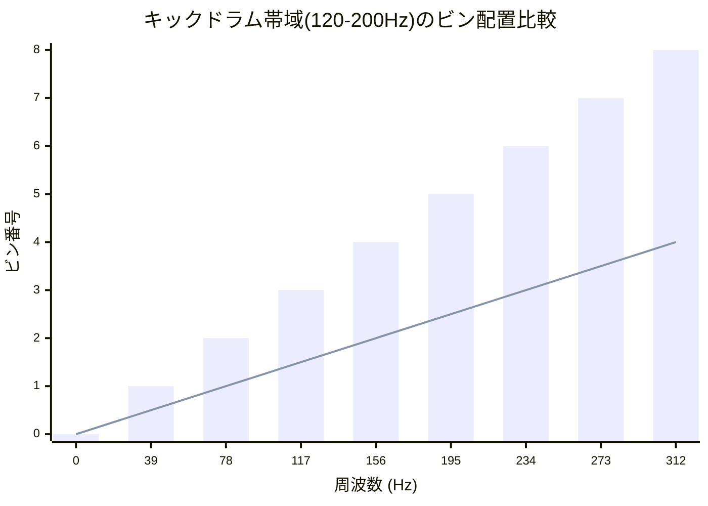
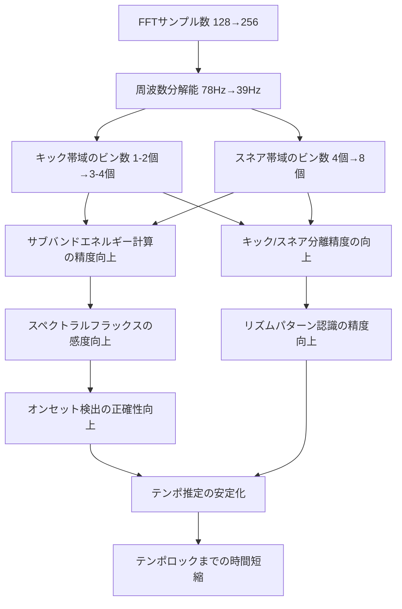
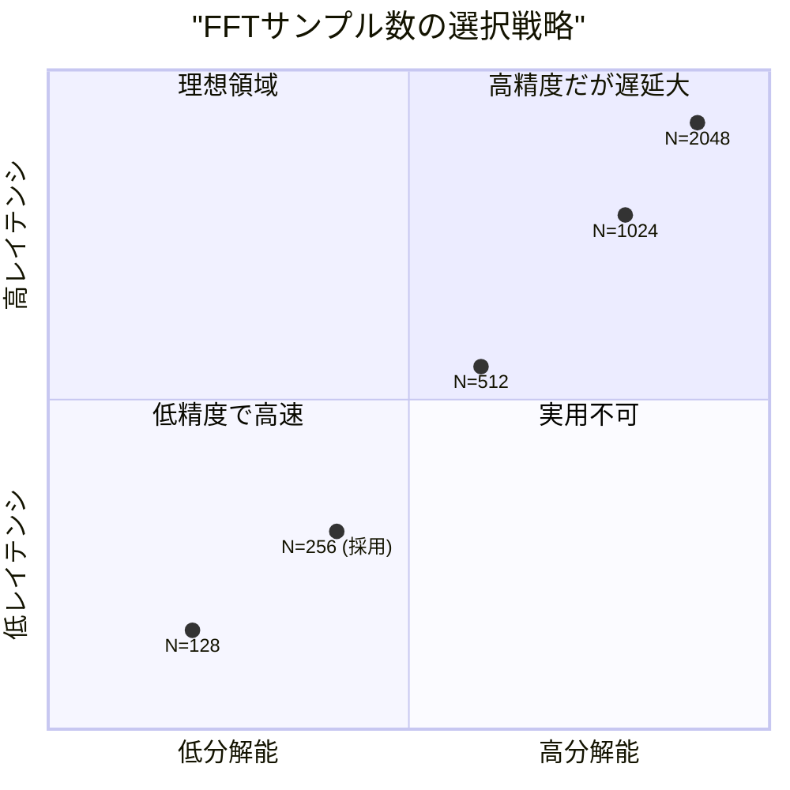

## はじめに

M5Stack CoreS3の内蔵マイク（ES7210）でリアルタイムにビートを検出し、猫耳型LEDユニット「Unit Neco」を音楽に合わせて光らせるプロジェクトの続編です。前回までの記事では、FFTによる周波数解析とスペクトラルフラックスを用いたオンセット検出、フェーズロック型の4分音符追跡によるテンポロック機構を実装しました。

しかし実際に運用してみると、テンポロックが外れやすく、ビート検出を見失うとLEDが不規則に消灯してしまうという課題がありました。今回はこの課題に対して、ビート検出アルゴリズムの全面的な改善と「仮想ビート」によるLED発光維持機構の強化を行いました。

これまでの経緯は以下の記事をご参照ください。

https://qiita.com/tomokusaba/items/178323347f2a23c842a5

https://qiita.com/tomokusaba/items/0e9ccf178d40f7651a9e

今回の改善のソースコードは以下のリポジトリで公開しています。

https://github.com/tomokusaba/m5stack/blob/main/M5StackS3/Mic/Sample5.ino

改善前のコードはこちらです。

https://github.com/tomokusaba/m5stack/blob/main/M5StackS3/Mic/Sample4.ino

## 今回の改善の全体像

今回の改善は大きく3つの柱に分けられます。

1つ目は **FFTの精度向上とオンセット検出の感度最適化** です。FFTサンプル数を128から256に倍増させることで、周波数分解能を78.1Hz/binから39.1Hz/binに向上させました。これにより、キックドラム（80〜150Hz）とスネアドラム（150〜400Hz）の分離がより正確になります。

2つ目は **テンポロック機構の堅牢化** です。テンポロックに必要な条件を厳格化するとともに、16分音符ゾーンの追加、キック・スネア交互パターンの検出、インターバルバッファによる倍テンポ誤検出防止など、多層的な対策を導入しました。

3つ目は **仮想ビートによるLED発光維持** です。テンポが一度確立されたら、実際のビート検出が途切れても推定されたテンポに基づいてLEDが光り続けるようにしました。

## FFTサンプル数の倍増

改善前のコードではFFTサンプル数を128に設定していましたが、これを256に変更しました。

```cpp
// 改善前（Sample4.ino）
#define SAMPLES 128  // FFTサンプル数（メモリ削減のため128に）

// 改善後（Sample5.ino）
#define SAMPLES 256  // FFTサンプル数（256で周波数分解能39Hz/bin）
```

### FFTの周波数分解能とは

FFTの周波数分解能は $\Delta f = \frac{f_s}{N}$ で求まります（$f_s$はサンプリング周波数、$N$はサンプル数）。つまりサンプル数を増やすほど、各ビン（周波数スロット）が担当する周波数幅が狭くなり、周波数スペクトル上の細かな特徴を捉えられるようになります。本プロジェクトではサンプリング周波数が10kHzなので、それぞれの分解能は以下のようになります。

$$\Delta f_{128} = \frac{10000}{128} \approx 78.1 \text{ Hz/bin}$$

$$\Delta f_{256} = \frac{10000}{256} \approx 39.1 \text{ Hz/bin}$$

### キックドラム帯域での影響

ビート検出においてキックドラムの検出精度は最も重要です。キックドラムの基音は概ね80〜200Hz（本コードでは120〜200Hzの帯域で計測）に集中しています。この帯域を何個のビンで捉えられるかがビート検出の感度に直結します。

128サンプルの場合、120〜200Hzの帯域はビン番号にしてbin 1（78.1Hz）〜bin 2（156.3Hz）のわずか1〜2個しかカバーできません。この2個のビンはどちらも帯域が広く、キックドラム以外の環境音やハムノイズのエネルギーも混在してしまいます。

256サンプルでは同じ帯域がbin 3（117.2Hz）〜bin 5（195.3Hz）の3個のビンでカバーされます。各ビンの帯域幅が半分になるため、キックドラムのエネルギーが特定のビンに集中し、他のノイズとの分離が向上します。



### スネアドラム帯域での影響

スネアドラムのボディ成分（200〜500Hz）についても同様の改善があります。128サンプルではbin 2〜bin 6の約4個、256サンプルではbin 5〜bin 12の約8個のビンでカバーするため、スネアのボディ周波数とキックドラムの高調波を分離しやすくなります。この分離精度の向上が、キックとスネアを区別するオンセット検出の精度向上を下支えしています。

### 分解能向上が与える波及効果

周波数分解能の向上は単にビン数が増えるだけでなく、ビート検出パイプライン全体に波及効果をもたらします。



まず、各サブバンド（subBass、lowMid、highMid）のエネルギー計算にてより多くのビンを加算するため、統計的なばらつきが抑えられます。その結果、スペクトラルフラックス（前フレームとの差分）の計算においてノイズ由来の誤差が小さくなり、閾値を下げても誤検出が増えにくくなります。これが「オンセット閾値係数を0.4から0.3に下げられた」理由でもあります。分解能が低い状態で閾値を下げると環境音による誤発火が増えますが、分解能を上げたことでキックドラムの真のエネルギー変化とノイズを区別しやすくなったのです。

### トレードオフ：処理時間とメモリ

FFTの計算量は $O(N \log N)$ のため、256ポイントでは128ポイントに比べて計算時間が約2.3倍（$\frac{256 \times 8}{128 \times 7} \approx 2.29$）になります。またバッファサイズも`float`配列2本分（vReal、vImag）とマイクバッファ（int16_t）が倍になるため、追加メモリは約1.5KBです。ESP32-S3は8MBのPSRAMと240MHzのデュアルコアCPUを搭載しており、この程度の増加はリアルタイム処理に支障をきたしません。実測でもloop()の1周あたりの処理時間は十分余裕がある範囲に収まっています。

### さらにサンプル数を増やすとどうなるか

では256よりさらにサンプル数を増やした場合にどの程度まで実用的か、ESP32-S3の制約から考察します。

まず処理時間について整理します。ESP32-S3の240MHzクロックにおいて、arduinoFFTライブラリによるfloat型FFTの実測値はおおよそ以下のように推定されます。

| サンプル数 $N$ | $N \log_2 N$ | 周波数分解能 | FFT推定処理時間 | マイク録音時間 | 合計レイテンシ | メモリ使用量 |
|---|---|---|---|---|---|---|
| 128 | 896 | 78.1 Hz | 約0.5ms | 12.8ms | 約13.3ms | 0.75KB |
| 256 | 2,048 | 39.1 Hz | 約1.1ms | 25.6ms | 約26.7ms | 1.5KB |
| 512 | 4,608 | 19.5 Hz | 約2.5ms | 51.2ms | 約53.7ms | 3.0KB |
| 1,024 | 10,240 | 9.8 Hz | 約5.5ms | 102.4ms | 約107.9ms | 6.0KB |
| 2,048 | 22,528 | 4.9 Hz | 約12ms | 204.8ms | 約216.8ms | 12.0KB |
| 4,096 | 49,152 | 2.4 Hz | 約26ms | 409.6ms | 約435.6ms | 24.0KB |

ここで注目すべきは、FFTの計算時間自体よりもマイクの録音時間（$= N / f_s$）のほうがはるかに大きいという点です。サンプリング周波数10kHzで256サンプルを録音するには25.6msかかります。つまり、FFTの入力データを取得する段階ですでに25.6msの遅延が発生しており、これがビート検出のレイテンシの支配的要因です。

ビート検出において、オンセットの時間的な精度は人間の知覚限界から概ね20〜50ms程度が許容範囲とされています。現在の256サンプル（約26.7ms）はこの範囲内に収まっていますが、512サンプルにすると合計レイテンシが約53.7msとなり、知覚できる遅延が生じ始めます。LEDの発光がビートの「後追い」に見える可能性が出てきます。

1,024サンプル以上になると合計レイテンシが100msを超え、ビート検出としては致命的な遅延です。BPM120（500ms間隔）の楽曲であっても、1拍の5分の1に相当する遅延が生じるため、LEDの発光が明らかに音楽と「ずれて」見えてしまいます。



メモリについては、ESP32-S3のSRAMは512KB、PSRAMは8MBあるため、4,096サンプルの24KBでも十分余裕があります。したがってメモリはボトルネックにはなりません。

もう一つの考慮点として、ビート検出の更新頻度があります。本コードのloop()ではFFT分析を毎ループ実行しており、1回のFFT処理にかかる録音＋計算時間がそのままloop()の最小周期を決定します。256サンプルでは毎秒約37回（1000ms / 26.7ms）の解析が可能ですが、512サンプルでは毎秒約18回、1,024サンプルでは毎秒約9回まで低下します。更新頻度が下がるとオンセットの立ち上がりを検出するタイミングが粗くなり、特に高速なBPM（180〜240BPM）での検出漏れが増加すると考えられます。

以上から、サンプリング周波数10kHzのリアルタイムビート検出において、**512サンプル（19.5Hz分解能、約54msレイテンシ）が実用上の上限** と考えられます。今回採用した256サンプルは精度とレイテンシのバランスが取れたスイートスポットであり、ビート検出に必要なキック帯域の分解能を確保しつつ、人間が知覚しない範囲の遅延に収まっている合理的な選択です。

## オンセット検出の感度最適化

適応的閾値のパラメータを調整し、より敏感にビートを捉えられるようにしました。

```cpp
// 改善前（Sample4.ino）
float kickThresh = kickMean + (kickMax - kickMean) * 0.4f + 0.01f;
float snareThresh = snareMean + (snareMax - snareMean) * 0.4f + 0.01f;
kickThresh = max(kickThresh, 0.06f);
snareThresh = max(snareThresh, 0.05f);

// 改善後（Sample5.ino）
float kickThresh = kickMean + (kickMax - kickMean) * 0.3f + 0.005f;
float snareThresh = snareMean + (snareMax - snareMean) * 0.3f + 0.005f;
kickThresh = max(kickThresh, 0.04f);
snareThresh = max(snareThresh, 0.03f);
```

閾値算出における係数を0.4から0.3に下げ、オフセットも0.01から0.005に減じ、ノイズゲートの最低値も下げています。これにより静かめの楽曲やスピーカーから離れた位置でもビートを拾いやすくなりました。同時にオンセット検出の最小間隔を100msから60msに短縮し、240BPMでの16分音符（約62ms間隔）まで検出できるようにしています。

## テンポロック条件の厳格化

テンポロックに関わるパラメータを改善前から大きく変更しました。

```cpp
// 改善前（Sample4.ino）
#define TEMPO_LOCK_THRESHOLD 2   // 2拍でロック
#define PHASE_TOLERANCE 0.30f    // ±30%

// 改善後（Sample5.ino）
#define TEMPO_LOCK_THRESHOLD 4   // 4拍でロック
#define PHASE_TOLERANCE 0.18f    // ±18%
```

改善前はわずか2拍の連続ビートでテンポロックしていたため、偶発的な音の連続を拍と誤認してロックしてしまう問題がありました。4拍に増やすことで、本当に安定したテンポのときだけロックがかかるようになります。また位相許容範囲を±30%から±18%に狭めることで、4分音符の判定精度が向上しました。

一方で、テンポロック解除の条件は緩和しています。`missedBeats`の閾値を2から4に変更し、一時的にビートを見失っても即座にロックが外れないようにしました。

## 16分音符ゾーンの追加とフェーズ判定の精密化

改善前は拍頭（4分音符）と拍間（8分音符）の2ゾーンのみでオンセットを分類していましたが、16分音符ゾーンを新設して全5ゾーンに拡張しました。

```cpp
// 改善後に新設されたゾーン定義
#define SIXTEENTH_NOTE_ZONE_LO 0.15f  // 16分音符ゾーン下限
#define SIXTEENTH_NOTE_ZONE_HI 0.35f  // 16分音符ゾーン上限
```

フェーズ全体を以下のように非重複で配置しています。

| フェーズ範囲 | 分類 |
|---|---|
| 0.00〜0.15（および0.85〜1.00） | 4分音符 |
| 0.15〜0.35（および0.65〜0.85） | 16分音符 |
| 0.35〜0.65 | 8分音符 |

さらに、フェーズだけでなくインターバル比率による2重検証を導入しています。前回のビートからの経過時間と推定インターバルの比率を算出し、その比率からも4分/8分/16分音符のいずれであるかを確認することで、判定の信頼性を高めています。

```cpp
float intervalRatio = (lastBeatTime > 0) ?
    (float)timeSinceLastBeat / estimatedInterval : 1.0f;
bool intervalSays4th  = (intervalRatio > 0.8f && intervalRatio < 1.3f);
bool intervalSays8th  = (intervalRatio > 0.4f && intervalRatio < 0.65f);
bool intervalSays16th = (intervalRatio > 0.18f && intervalRatio < 0.35f);
```

## キック・スネア交互パターン検出と倍テンポ防止

8ビートの楽曲では「キック→スネア→キック→スネア」と交互にオンセットが検出されます。改善前のコードは、このパターンを8分音符の連打と誤認してテンポを倍に推定してしまう問題がありました。改善後は直近8回のオンセットタイプ（キック/スネア）を記録し、交互出現率が60%を超えている場合はインターバルの倍化補正をスキップするようにしています。

```cpp
bool isKickSnareAlternating() {
    if (onsetTypeCount < 3) return false;
    int alternateCount = 0;
    int n = min(onsetTypeCount, ONSET_TYPE_HISTORY);
    for (int i = 1; i < n; i++) {
        int prev = (onsetTypeIdx - i - 1 + ONSET_TYPE_HISTORY) % ONSET_TYPE_HISTORY;
        int curr = (onsetTypeIdx - i + ONSET_TYPE_HISTORY) % ONSET_TYPE_HISTORY;
        if (onsetTypeHist[prev] != onsetTypeHist[curr]) alternateCount++;
    }
    return (float)alternateCount / (n - 1) > 0.6f;
}
```

加えて、テンポロック直前にインターバルバッファ内のデータを分析し、推定インターバルの約半分のインターバルが多数含まれている場合はテンポを2倍に補正する仕組みも導入しました。これにより裏拍を拾ってしまっていたケースを検出し、正しい4分音符間隔に修正できます。

## リズムパターン認識

### なぜリズムパターン認識が必要なのか

ビート検出においてBPMを正確に推定することは非常に重要ですが、単純なオンセット間隔の計測だけでは正しいBPMに収束しないケースが多く存在します。その最大の原因は「倍テンポ問題」と「ハーフタイム問題」です。

たとえば実際のBPMが120の8ビートの楽曲を考えます。キックが1拍目と3拍目、スネアが2拍目と4拍目に入るため、オンセットは4分音符の間隔（500ms）で順に検出されます。ところがオンセット検出の感度が高い場合、ハイハットの8分音符やゴーストノートまで拾ってしまい、ビート間隔が250msと計測されてBPMが240と推定されることがあります。これが倍テンポ問題です。

逆にハーフタイム（トラップやバラードなど）では、キックが1拍目にだけ、スネアが3拍目にだけ入ります。実際のBPMが140であっても、キック→スネア間は2拍分の間隔（約857ms）となり、BPMが70と推定されてしまいます。これがハーフタイム問題です。

いずれの問題もBPMの「2倍ずれ」として現れるため、再生中の楽曲がどのリズムパターンに該当するかを識別できれば、オンセット間隔だけでは判断できないBPMの倍数関係を正しく解決できます。リズムパターンの認識はBPM推定の補正手段として本質的な意義を持つのです。

### 実装の概要

検出されたキックとスネアのオンセットを小節内のヒストグラム（8スロット：各拍の表裏）に記録し、代表的なリズムパターンテンプレートとの正規化相関を計算することで、再生中の楽曲のリズムパターンを自動識別します。

相関計算にはコサイン類似度を採用しています。ヒストグラムとテンプレートの内積をそれぞれのノルムで正規化することで、音量のばらつきに影響されず純粋にパターンの形状だけを比較できます。

```cpp
float patternCorrelation(float* hist, const float* tmpl) {
    float dot = 0, normH = 0, normT = 0;
    for (int i = 0; i < 8; i++) {
        dot += hist[i] * tmpl[i];
        normH += hist[i] * hist[i];
        normT += tmpl[i] * tmpl[i];
    }
    if (normH < 0.001f || normT < 0.001f) return 0;
    return dot / (sqrtf(normH) * sqrtf(normT));
}
```

また、楽曲の再生がどの拍から始まるかは不定であるため、拍の開始位置を4通りずらした回転マッチングを行い、最もスコアの高い回転位置と組み合わせを採用します。

### 対応パターン

対応するパターンは以下の4種類です。

| パターン | キックパターン | スネアパターン | ジャンル例 |
|---|---|---|---|
| 8ビート | 1拍目・3拍目 | 2拍目・4拍目 | ロック、J-POP |
| 4つ打ち | 全拍 | 2拍目・4拍目 | EDM、ダンス |
| 16ビート | シンコペーション | 2拍目・4拍目 | ファンク、R&B |
| ハーフタイム | 1拍目のみ | 3拍目のみ | トラップ、バラード |

### BPM補正への活用

認識されたパターンはLCDのタイトルエリアに「8BT」「4FL」「16B」「HLF」と表示されます。パターン認識結果はBPM補正にも直接活用されます。ハーフタイムパターンが3回連続で検出された場合は、現在のBPMが実際の倍の値になっている可能性が高いと判断し、`estimatedInterval`を2倍にしてBPMを半分に補正する処理を行います。この補正により、たとえばBPM280と誤推定されていたトラップ楽曲がBPM140に自動修正されるようなケースに対応できます。

ヒストグラムは毎フレーム0.985倍で減衰させているため、楽曲の展開によってパターンが変化した場合にも数秒程度で追従します。たとえばサビ前のハーフタイムからサビの8ビートに切り替わった場合でも、新しいパターンが自然に検出されBPM推定が適切に維持されます。

## 仮想ビートによるLED発光維持の強化

今回の改善で最もユーザー体験に影響するのがこの変更です。改善前の仮想ビートはテンポロック中のみ動作していましたが、改善後はテンポが一度でも推定されれば、テンポロックが外れた後もLEDがビートを刻み続けるようになりました。

```cpp
// 改善前（Sample4.ino）- テンポロック中のみ仮想ビート
if (tempoLocked && estimatedInterval > 0 && lastConfirmedBeat > 0) {
    // ...仮想ビート処理
}

// 改善後（Sample5.ino）- テンポが推定されていれば常に仮想ビート
if (estimatedInterval > 0 && lastVirtualBeatTime > 0) {
    uint32_t timeSinceVirtual = now - lastVirtualBeatTime;
    if (timeSinceVirtual >= (uint32_t)estimatedInterval) {
        beatDetected = 1.0f;  // 仮想ビート発火！
        lastVirtualBeatTime = now;
        virtualBeatPhase++;
    } else {
        beatDetected *= 0.5f;  // 一瞬で減衰
    }
}
```

この変更により、環境ノイズや楽曲の静かな区間でビート検出が一時的に途切れても、LEDは推定テンポに基づいて正しいタイミングで光り続けます。実際のビートが再検出されると`lastVirtualBeatTime`が同期されるため、テンポのドリフトも最小限に抑えられます。

また、テンポロック中にオフビート位置にオンセットが検出された場合、改善前は弱い応答（`beatDetected = 0.4f`）でLEDを光らせていましたが、改善後はLED反応を完全に抑制するようにしました。これにより予測に合わないタイミングでの誤点灯がなくなり、LEDの発光パターンがより安定したリズムを刻むようになります。

## オフビート時のLED反応の変更

テンポロック中にフェーズから外れたオンセットが検出された場合の挙動を変更しました。

```cpp
// 改善前（Sample4.ino）- オフビートでも弱く反応
isBeat = true;
isQuarterNote = false;
beatDetected = max(beatDetected, 0.4f);

// 改善後（Sample5.ino）- オフビートでは反応しない
isBeat = false;
isQuarterNote = false;
```

改善前はオフビートでもLEDを弱く光らせていたため、ノイズによる誤検出が目立つ場面がありました。改善後は誤検出による不規則な発光を抑え、仮想ビートによる安定した発光に委ねる設計としています。

## 8分音符検出時のロック進捗の維持

改善前では8分音符として判定されたオンセットについて、テンポ学習フェーズにおいて`consecutiveOnBeat = 0`とリセットしていました。これは8分音符検出のたびにテンポロックへの進捗がすべて失われることを意味し、特に8ビートの楽曲でロックが遅くなる原因となっていました。

改善後はリセットを行わず、進捗を維持するようにしています。8分音符はテンポ学習の材料としては使いませんが、テンポロックへの道のりを妨げない設計です。

```cpp
// 改善前（Sample4.ino）
} else if (rawInterval >= 125 && rawInterval < 250) {
    isQuarterNote = false;
    consecutiveOnBeat = 0;  // リセットされてしまう
}

// 改善後（Sample5.ino）
} else if (rawInterval >= 125 && rawInterval < 250) {
    isQuarterNote = false;
    // consecutiveOnBeatはリセットしない → ロック進捗を維持
}
```

## まとめ

今回の改善をまとめると以下の通りです。

| 項目 | 改善前 (Sample4) | 改善後 (Sample5) |
|---|---|---|
| FFTサンプル数 | 128 (78.1Hz/bin) | 256 (39.1Hz/bin) |
| テンポロック条件 | 2拍連続 | 4拍連続 |
| 位相許容範囲 | ±30% | ±18% |
| 音符分類 | 2ゾーン（4分/8分） | 5ゾーン（4分/16分/8分/16分/4分） |
| 倍テンポ防止 | なし | K-S交互検出 + バッファ分析 |
| リズムパターン認識 | なし | 8BT/4FL/16B/HLF自動判別 |
| 仮想ビート動作条件 | テンポロック中のみ | テンポ推定後は常時 |
| オフビート時LED | 弱く発光 | 発光しない |
| テンポロック解除 | 2回ミス | 4回ミス |
| オンセット閾値係数 | 0.4 | 0.3 |

特に仮想ビートの改善により、ビート検出が一時的に途切れてもLEDが正しいテンポで光り続けるようになったことで、パフォーマンスの安定性が大幅に向上しました。実際の楽曲で検証したところ、曲の静かなパートや手拍子の隙間でもLEDがリズムを刻み続け、視覚的な没入感が格段に改善されています。🎶

## 参考文献

- [tomokusaba/m5stack - Sample5.ino（改善後）](https://github.com/tomokusaba/m5stack/blob/main/M5StackS3/Mic/Sample5.ino)
- [tomokusaba/m5stack - Sample4.ino（改善前）](https://github.com/tomokusaba/m5stack/blob/main/M5StackS3/Mic/Sample4.ino)
- [M5Stack CoreS3+猫耳型LEDをマイクのリアルタイムFFTで光らせてみた - Qiita](https://qiita.com/tomokusaba/items/178323347f2a23c842a5)
- [M5Stack CoreS3+猫耳型LEDのビート検出を改善してみた - Qiita](https://qiita.com/tomokusaba/items/0e9ccf178d40f7651a9e)
- [M5Stack CoreS3 公式ドキュメント](https://docs.m5stack.com/en/core/CoreS3)
- [Adafruit NeoPixel Library](https://github.com/adafruit/Adafruit_NeoPixel)
- [arduinoFFT Library](https://github.com/kosme/arduinoFFT)
- [ESP32-S3 - Espressif Systems](https://www.espressif.com/en/products/socs/esp32-s3)
