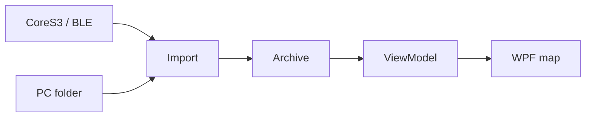
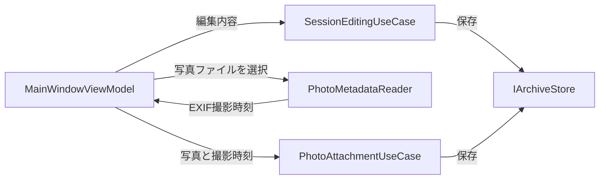

## はじめに

前回の [M5Stack CoreS3でGPSログを安全に記録する — WalkLoggerのファームウェア設計](https://qiita.com/tomokusaba/items/1fa6f13050716e7faa94) では、CoreS3 側の GPS（Global Positioning System）記録を扱いました。続編となる今回は、私が開発している WalkLogger の Windows 側に焦点を当て、ログを受け取り、地図で読み、セッションを編集する構成を見ます📍

対象は C# / .NET の基本を知っている開発者です。ファームウェアの手順は繰り返さず、[アプリプロジェクト設定](https://github.com/tomokusaba/Yamanote/blob/main/src/WalkLogger.App/WalkLogger.App.csproj)などを根拠に Windows 側の設計を追います🧭

## 今回のゴール

- 記録ファイルがインポートされ、セッションとして画面に届くまでの経路
- Domain/Core、Application、Infrastructure.Windows、Presentation、Appの役割分担
- Generic Host（汎用ホスト）とDI（依存関係の注入）を使ったWPF（Windows Presentation Foundation）アプリの起動、およびMVVM（Model-View-ViewModel）とcode-behindの境界
- GPSの区間を地図へ描画し、セッションや写真の情報を編集・保存する流れ

BLE（Bluetooth Low Energy）の通信プロトコルやファームウェアの記録処理は対象外です。Windows 側で受け取った記録の流れに絞ります。次に、全体像を俯瞰します🔍

## データフローとアーキテクチャ

CoreS3 からの転送と PC（パーソナルコンピューター）上のフォルダーでは入口が異なりますが、取り込み後は同じアーカイブを使います。まず、取り込みから画面表示までの流れを示します。



ここでいうアーカイブは、取り込んだセッションを保存し、必要なときに読み出すアプリ側の領域です。圧縮ファイル形式を指すものではありません。

編集と写真添付は、画面からApplicationのユースケースを経由して保存します。



図の矢印は、それぞれ別の操作経路を表しています。次に、この流れを支える各プロジェクトの責務を確認します🧩

## プロジェクトごとの責務

| レイヤー | 主な責務 | 参照ソース |
|---|---|---|
| 🧭 Domain/Core | `WalkSession`、`TrackPoint`、写真・地名のモデルと、区間・距離の分析 | [`Models.cs`](https://github.com/tomokusaba/Yamanote/blob/main/src/WalkLogger.Domain/Models.cs) |
| 🔄 Application | アーカイブ取り込み、BLE転送、編集、写真添付などのユースケースを調整 | [`ArchiveImportUseCase.cs`](https://github.com/tomokusaba/Yamanote/blob/main/src/WalkLogger.Application/ArchiveImportUseCase.cs)、[`WorkspaceUseCases.cs`](https://github.com/tomokusaba/Yamanote/blob/main/src/WalkLogger.Application/WorkspaceUseCases.cs) |
| 🪟 Infrastructure.Windows | Windows設定ストア、BLE転送ファクトリー、写真から EXIF（Exchangeable Image File Format）の撮影時刻を読み取る実装など | [`WindowsAdapters.cs`](https://github.com/tomokusaba/Yamanote/blob/main/src/WalkLogger.Infrastructure.Windows/WindowsAdapters.cs) |
| 🎛️ Presentation | `MainWindowViewModel`が画面状態、コマンド、通知を扱う | [`MainWindowViewModel.cs`](https://github.com/tomokusaba/Yamanote/blob/main/src/WalkLogger.Presentation/MainWindowViewModel.cs) |
| 🖥️ App | WPFのWindow、WebView2の地図、HostとDIの組み立て | [`Program.cs`](https://github.com/tomokusaba/Yamanote/blob/main/src/WalkLogger.App/Program.cs)、[`MainWindow.xaml`](https://github.com/tomokusaba/Yamanote/blob/main/src/WalkLogger.App/MainWindow.xaml) |

`Models.cs`の名前空間は`WalkLogger.Core`です。`WalkSession`が点や写真を持ち、`TrackPoint.Validate()`がGPS点の妥当性を検査します。`WalkAnalysis`は接続区間と距離を集計し、Applicationがモデルを操作、Presentationが画面状態として公開します。

役割は分かれていますが、WPFの画面イベントまでViewModelへ移した純粋なMVVMというわけではありません。次はアプリの起動と、その境界を具体的に見ます🏗️

## WPF Host / DIとMVVMの境界

2026年10月6日時点で確認した GitHub main では、アプリは `net10.0-windows10.0.19041.0` を対象とします。WPF と `Microsoft.Extensions.Hosting` 10.0.0、`Microsoft.Web.WebView2` 1.0.3537.50 を使います。設定は[プロジェクトファイル](https://github.com/tomokusaba/Yamanote/blob/main/src/WalkLogger.App/WalkLogger.App.csproj)にあります。

Generic Host はホストの開始・停止をまとめる枠組みです。DI（依存関係の注入）は、サービスの実装を登録し、利用側へ渡す仕組みです。[`Program.cs`](https://github.com/tomokusaba/Yamanote/blob/main/src/WalkLogger.App/Program.cs)がHostを構築し、Windows依存の実装、ユースケース、ViewModel、WindowをDI登録します。ここがcomposition root（依存関係の組み立て場所）です。[`App.xaml.cs`](https://github.com/tomokusaba/Yamanote/blob/main/src/WalkLogger.App/App.xaml.cs)はStartupでHostを開始し、DIから解決した`MainWindow`を表示します。終了時はHostを停止・破棄します。

[`MainWindow.xaml.cs`](https://github.com/tomokusaba/Yamanote/blob/main/src/WalkLogger.App/MainWindow.xaml.cs)ではViewModelを`DataContext`に設定します。[`MainWindow.xaml`](https://github.com/tomokusaba/Yamanote/blob/main/src/WalkLogger.App/MainWindow.xaml)には`{Binding Walks}`や`{Binding Title}`などがあり、ViewModelの状態を画面に結び付けています。状態・コマンド・通知はViewModelが担いますが、一覧選択（`WalkList_SelectionChanged`）や`PasswordBox`入力（`ApiKeyBox_PasswordChanged`）はcode-behindに残っています。

WalkLoggerはMVVMを採り入れていますが、画面イベントもcode-behindで処理するため、純粋なMVVMとは説明しません。地図もWebView2と`RouteMapPresenter`が担当します。次はインポートを追います🔧

## 記録を受け取り、セッションへ取り込む

`ArchiveImportUseCase.ImportDirectoryAsync`は指定フォルダーから`track.ndjson`を探します。見つからない場合は GPX（GPS Exchange Format）ファイルを検索し、該当ファイルをパス順に`archive.ImportAsync`へ渡します。対象がなければエラーです。検索の実装は[`FileAdapters.cs`](https://github.com/tomokusaba/Yamanote/blob/main/src/WalkLogger.Infrastructure/FileAdapters.cs)にもあります。

CoreS3 からの転送では、`BleTransferUseCase`がデバイスのcatalog（ファイル一覧）を取得し、ファイルをローカルの`Imports`配下へダウンロードします。その後、同じ`ArchiveImportUseCase`へ渡します。実装は[`WorkspaceUseCases.cs`](https://github.com/tomokusaba/Yamanote/blob/main/src/WalkLogger.Application/WorkspaceUseCases.cs)と[`ArchiveImportUseCase.cs`](https://github.com/tomokusaba/Yamanote/blob/main/src/WalkLogger.Application/ArchiveImportUseCase.cs)で確認できます。

取り込み後、[`MainWindowViewModel`](https://github.com/tomokusaba/Yamanote/blob/main/src/WalkLogger.Presentation/MainWindowViewModel.cs)は返されたセッション ID（識別子）を使って`RefreshAsync`を呼び、アーカイブの`LoadAsync`から記録一覧を読み直します。選択した記録を`Current`に反映し、`ShowSession`から地図状態も更新します。つまり、インポート用ユースケースの戻り値を使って画面状態を再構成する流れです。

実際のファイル読み込みは[`TrackImporter.ReadAsync`](https://github.com/tomokusaba/Yamanote/blob/main/src/WalkLogger.Infrastructure/TrackImporter.cs)が担います。拡張子が`.gpx`ならGPX、それ以外ならNDJSONを1行ずつ`TrackPoint`へデシリアライズします。

```csharp
var points = Path.GetExtension(path).Equals(".gpx", StringComparison.OrdinalIgnoreCase)
    ? ReadGpx(path)
    : await ReadJsonLinesAsync<TrackPoint>(path, ct);
```

読み込んだ各点は`Validate()`で座標・時刻・速度などを検証し、時刻が重複または逆行していないことも確認します。CoreS3のNDJSONにあるUTC時刻は`DateTimeOffset`型の`TrackPoint.Time`に読み込まれ、緯度・経度・速度・高度に加えてsegment（記録区間番号）も保持されます。[`ArchiveStore.ImportAsync`](https://github.com/tomokusaba/Yamanote/blob/main/src/WalkLogger.Infrastructure/ArchiveStore.cs)は取り込み元のハッシュで重複を確認し、新しい記録を`WalkSession`として`walk.json`などのアーカイブファイルへ保存します。これでGPS時刻と区間情報が、表示・分析に使うモデルへ引き継がれます。次は地図表示です🗺️

## WebView2の地図へルートを渡す

WPFのWebView2と`RouteMapPresenter`が地図の橋渡しをします。Presenterはアプリ内の`Map`フォルダーを仮想ホストへ割り当て、`https://walklogger.local/index.html`を表示します。HTML（HyperText Markup Language）とJavaScriptは[`Map/index.html`](https://github.com/tomokusaba/Yamanote/blob/main/src/WalkLogger.App/Map/index.html)、[`Map/map.js`](https://github.com/tomokusaba/Yamanote/blob/main/src/WalkLogger.App/Map/map.js)です。

PresenterはViewModelの地図状態から現在・前回ルート、写真、地名をJSON（JavaScript Object Notation）でWebView2へ渡します。現在ルートは`WalkAnalysis.Segments`で分割し、JavaScript側で別レイヤーと各種マーカーを描画します。写真の添付と時刻照合は、後の「セッションと写真の編集」で説明します。

背景タイルは必要時に`tile.openstreetmap.org`から取得します。取得できなくてもエラーを知らせたうえでGPSルートを表示できます。

地図へ渡す区間の作り方は、距離集計にも関わります。次に、線をつなぐ条件を確認します📏

## 区間判定と距離の考え方

`WalkAnalysis.Connected`は、隣り合う点のsegmentが同じで、時刻が前進し、点間の時間差が60秒以内、座標間距離から求めた推定速度が12 m/s以下の場合に接続します。

```csharp
public static bool Connected(TrackPoint a, TrackPoint b) =>
    a.Segment == b.Segment && b.Time > a.Time && (b.Time - a.Time).TotalSeconds <= 60 &&
    DistanceMeters(a.Lat, a.Lon, b.Lat, b.Lon) / (b.Time - a.Time).TotalSeconds <= 12;
```

`Segments`は判定がfalseになった地点で新しい配列を開始し、距離集計も接続された点の組だけを加算します。segmentが変わった区間や、時間・速度条件を外れた区間は線でつながず、距離にも含めません。

この速度は`TrackPoint.Speed`ではなく、座標間距離を時刻差で割った値です。地図と距離集計が同じ接続ルールを使います。

線の意味が分かったところで、画面から入力した情報をどう保存するかへ進みます📝

## セッションと写真の編集

`MainWindowViewModel.SaveCurrentAsync`は画面のタイトルやノートなどから`SessionEdits`を作り、`SessionEditingUseCase.SaveAsync`へ渡します。空白だけのタイトルも拒否し、有効なタイトルは前後の空白を取り除いて保存します。ノート、ブログ本文、一周確認、写真メモも`WalkSession`へ反映し、アーカイブストアに保存します。記録を切り替えるときも、ViewModelは現在の記録を保存してから次の記録を表示します。

`MainWindowViewModel.AddPhotoAsync`は Windows 側の`PhotoMetadataReader`でEXIFの撮影時刻を読み、`PhotoAttachmentUseCase`に渡します。最も近い GPS 点が撮影時刻の60秒以内にある場合だけ添付し、記録を保存して画面を更新します。実装は[`MainWindowViewModel.cs`](https://github.com/tomokusaba/Yamanote/blob/main/src/WalkLogger.Presentation/MainWindowViewModel.cs)、[`WorkspaceUseCases.cs`](https://github.com/tomokusaba/Yamanote/blob/main/src/WalkLogger.Application/WorkspaceUseCases.cs)、[`WindowsAdapters.cs`](https://github.com/tomokusaba/Yamanote/blob/main/src/WalkLogger.Infrastructure.Windows/WindowsAdapters.cs)を参照してください。

時間が離れた写真を無条件に貼り付けない設計です。最後に、今回見た責務のつながりをまとめます✅

## まとめ

WalkLogger の Windows 側では、ファイル転送と取り込み、ドメインモデル、画面状態、Windows 固有実装、WPF 表示を役割ごとに分けています。BLE 転送後もフォルダーからの取り込みと同じユースケースを通り、`WalkSession`がViewModelと地図表示へつながります。

地図は`RouteMapPresenter`がWebView2へ状態を渡し、区間判定に沿って描画します。編集はApplicationのユースケースで保存されます。MVVMを採り入れていますが、一覧選択やPasswordBoxのイベントはcode-behindに残ります。

CoreS3 側は[ファームウェア編（Qiita）](https://qiita.com/tomokusaba/items/1fa6f13050716e7faa94)、Windows 側は[`MainWindowViewModel.cs`](https://github.com/tomokusaba/Yamanote/blob/main/src/WalkLogger.Presentation/MainWindowViewModel.cs)、[`RouteMapPresenter.cs`](https://github.com/tomokusaba/Yamanote/blob/main/src/WalkLogger.App/RouteMapPresenter.cs)、[`Models.cs`](https://github.com/tomokusaba/Yamanote/blob/main/src/WalkLogger.Domain/Models.cs)をご覧ください。画面だけでなく、データがどの境界を越えるかも辿ってみてください🌱
