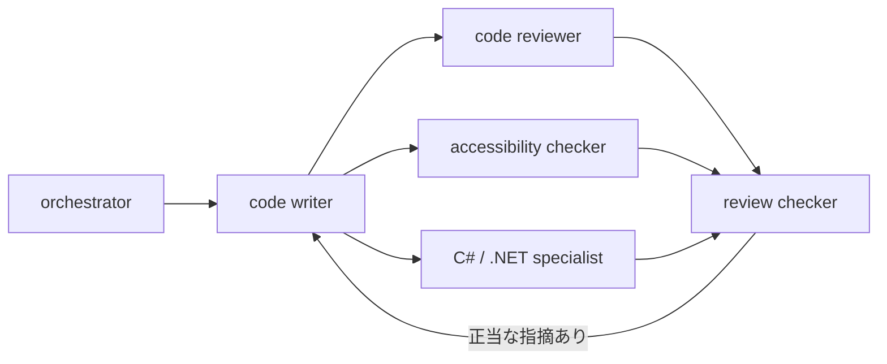
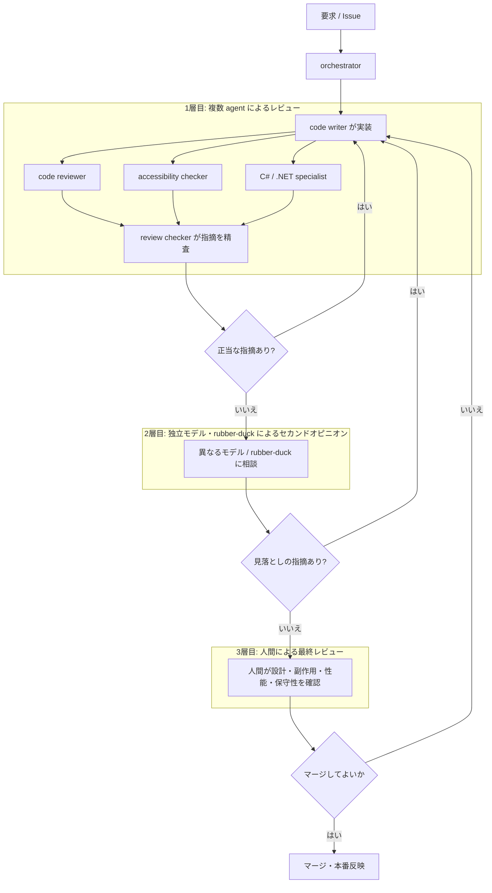

## はじめに

GitHub Copilot でコードを書く量が増えてくると、必ず聞かれることがあります。「そのコード、レビューはどうしてるんですか？」という質問です。

実装のスピードが上がるのはありがたいのですが、生成されたコードをそのまま信じてマージする、という運用にはずっと抵抗があります。Copilot 自身の公式ドキュメントでも、Copilot は強力なツールである一方でミスをすることもあり、提案は常に検証するべきだと明記されています。

> While Copilot is very powerful, it is still a tool capable of making mistakes, and you should always validate the code it suggests.
> — [Best practices for using GitHub Copilot](https://docs.github.com/en/copilot/get-started/best-practices)

この記事では、私が個人のテンプレートリポジトリで試している「AI に書かせたコードを、AI 自身と人間でどう多層的にレビューするか」という実践を整理します。公式情報と自分の運用は、意識して分けながら書きます。想定読者は、普段から Copilot などで実装を進めているエンジニアです。特定のツールの宣伝が目的ではなく、あくまで個人の工夫として読んでもらえるとうれしいです🙂

## 本記事のゴール

- ✅ 生成されたコードを放置しないための、多層レビューの考え方を持ち帰る
- ✅ GitHub Copilot CLI / GitHub Copilot app での「ラバーダック」的な壁打ちの使いどころを整理する
- ✅ モデルの多様性によるクロスレビューについて、公式ドキュメントで確認できる事実と、そこから先の個人的な実践を分けて理解する
- ✅ AI レビューが苦手な領域（設計判断、副作用、性能、非推奨 API）を具体的に把握する
- ✅ 「機械的にレビューできること」と「人間の文脈判断が必要なこと」を区別した表とチェックリストを持ち帰る

## 生成されたコードを放置しないために

Copilot にコードを書かせたあと、そのまま次のタスクに進んでしまう誘惑は正直あります。特に小さな修正だと、レビューを飛ばしても動いてしまうことが多いからです。

ただ、実装量が増えるほど、レビューを飛ばしたコードは静かに積み上がります。命名が場当たり的になる、同じような処理が複数箇所にコピーされる、テストが「動くことの確認」で止まっている——こうした小さな借金は、後から気づくと直しにくくなっています。

そこで私が個人のテンプレートリポジトリ [tomokusaba/DotnetTemplate](https://github.com/tomokusaba/DotnetTemplate) で試しているのは、**code writer が実装したコードを、複数の役割を持つ agent に多層的にレビューさせてから人間に渡す**、という構成です。この考え方は、勤務先のプロジェクトでもチームのルールや扱う情報に合わせてカスタマイズしています。ただし、以降で紹介するのは具体的な業務やコードに触れない、個人のテンプレートでの実践例です。

## DotnetTemplate での多層 agent レビューという実践例

DotnetTemplate では、`.github/agents/` 配下に役割ごとの custom agent を定義し、`.github/skills/` 配下に判断基準となる skill を置くという構成にしています。ざっくり言うと、次のような役割分担です。

| 役割 | 書き込み | 主な仕事 |
|------|---------|---------|
| 🧭 orchestrator | なし（委譲のみ） | 要求を整理し、どの専門レビューが必要かを振り分ける |
| ✍️ code writer | あり | 実装・テストの作成、指摘の反映 |
| 🔎 code reviewer | なし | 差分に対する一般的な観点でのレビュー |
| ♿ accessibility checker | なし | ASP.NET Core UI 変更時のアクセシビリティ専門レビュー |
| 🧩 C# / .NET specialist | なし | 言語・フレームワーク固有の慣習やパフォーマンスの観点でのレビュー |
| ✅ review checker | なし | 複数レビューの指摘を集約し、正当な指摘かどうかを精査する |

ポイントは、レビュー系 agent には書き込み権限を渡していないことです。同じ差分を複数の agent が並行してレビューするという前提が、途中で誰かが書き換えると崩れてしまうためです。指摘は review checker が一度集約し、正当と判断されたものだけを code writer が反映する、という流れにしています。

この役割分担を図にすると、次のようになります。

こうしておくと、code writer が書いた直後の思い込みを、少なくとも複数の観点で一度は疑ってもらえます。ただし、この構成はまだ**同じ枠組みの中で動く agent 同士のレビュー**にとどまっている点には注意が必要です。次はその限界を補う工夫を見ていきます。

## ラバーダック的な壁打ちを挟む

多層 agent レビューだけでは、結局「似たような前提を持つ agent 同士」で完結してしまう可能性があります。そこで私は、実装の節目で GitHub Copilot CLI や GitHub Copilot app に**壁打ち相手**として相談する使い方も取り入れています。

やっていることは単純で、実装計画やレビュー結果を言葉にして説明し、「この設計で見落としていそうなリスクはないか」「このテスト観点で十分か」と聞くだけです。ラバーダック・デバッグ（Rubber duck debugging）は、説明することで自分の思い込みに気づく手法です。相手が agent であっても、同じような効果を感じています。GitHub Copilot app には、[GitHub Copilot app の changelog（v0.2.14）](https://github.com/github/app/blob/main/changelog.md#v0214) にあるとおり `/rubber-duck` というスラッシュコマンドが用意されています。このコマンドを使うと、コードや設計に対する建設的なフィードバックを得られます。この使い方については以前別の記事でも詳しく整理しました。

https://zenn.dev/tomokusaba/articles/787d8cb138491b

この壁打ちで大事にしているのは、**答えを丸ごと信じないこと**です。あくまで「もう一つの視点」を増やすために使っていて、最終的な採否は自分で決めています。ただし、これも自分と同じ Copilot という枠組みの中での対話にとどまる面があります。次は、レビューに使うモデルそのものを変えるという発想を見ていきます。

## モデルの多様性によるレビューという考え方

ここからは、少し慎重に書きたい話です。実装に使ったモデルと、レビューに使うモデルをあえて変える、という発想です。

GitHub Copilot は、公式ドキュメントの [Supported AI models in GitHub Copilot](https://docs.github.com/en/copilot/reference/ai-models/supported-models) にあるとおり、OpenAI・Anthropic・Google・Microsoft など複数プロバイダーのモデルをサポートしています。[AI model comparison](https://docs.github.com/en/copilot/reference/ai-models/model-comparison) では、モデルによってレイテンシーや幻覚（hallucination）の起きやすさなどの傾向が異なると説明されています。[Copilot Chat のモデルを変更する手順](https://docs.github.com/en/copilot/how-tos/use-ai-models/change-the-chat-model)のページでも、モデルごとに得意分野が異なるためタスクへの向き不向きがあり、ユーザーが切り替えられる、という位置づけで案内されています。

ここまでは公式ドキュメントで確認できる事実です。ここから先は、公式情報を土台にした私個人の発想として書きます。

:::message
「モデルを変えてレビューする」ことの効果や再現性について、GitHub 公式が明示的に推奨・保証している記述は、執筆時点では見当たりませんでした。ここで書いているのは、あくまで公式ドキュメントで確認できる事実（複数プロバイダーのモデルが選べること、モデルごとに得意分野が異なると案内されていること）を土台にした、私個人の試みです。
:::

実務では、たとえば OpenAI 系のモデルで書いたコードを、Anthropic 系のモデルにレビューしてもらう、という組み合わせを試しています。同じ前提・同じ癖を持つモデルにレビューさせるより、異なる学習・評価の背景を持つモデルに見てもらったほうが、指摘の重なりが少なくなる感触はあります。ただしこれは私の体感であり、定量的に効果を検証した結果ではないことは正直に書いておきます。

ただし、こうした工夫を重ねても、AI によるレビューには依然として限界があります。次の章で具体的に見ていきます。

## AI レビューの限界を具体的に見ておく

多層 agent レビューやモデルのクロスチェックを重ねても、AI によるレビューには実務上の限界があります。私が実際に感じているのは、次のようなパターンです。

- **局所的には正しいが、大域的な設計判断を誤ることがある**：1 つのメソッドや 1 つのファイルの中では妥当に見えても、既存のクラス設計やモジュール分割の方針とズレた実装を提案してくることがあります。差分だけを見ていると気づきにくく、アーキテクチャ全体を知っている人間の判断が必要です
- **実装規模が大きいほど、要件の一部が漏れがちになる**：小さな修正では起きにくいのですが、複数ファイルにまたがる大きな実装では、依頼した要件の一部が実装から抜け落ちることがあります。「動いているように見える」ことと「要件を満たしている」ことは別です
- **意図しない副作用に気づきにくい**：グローバルな状態、キャッシュ、イベント発火のタイミングなど、ドメイン知識がないと気づけない副作用は、AI のレビューでも見逃されやすいです
- **パフォーマンス改善の余地を見落とす**：明らかな N+1 クエリ（ループ内で都度データベースへ問い合わせてしまう典型的な性能問題）のような分かりやすい問題は拾えます。ただし、「本当にこの粒度で同期処理する必要があるか」といった設計レベルの最適化余地までは踏み込みにくい印象があります
- **古い・非推奨のライブラリや API を使ってしまう**：学習データの時期や参照した情報によっては、非推奨になった API や、より安全な代替がある古い書き方をそのまま提案してくることがあります

これらは、静的解析や AI レビューが「機械的に拾いやすいもの」と、人間が文脈を持って初めて気づける「見えにくいもの」の境目でもあります。次の章で、この境目を表にして整理します。

## 機械的なレビューと人間の文脈判断を分ける

| 観点 | 🤖 機械的に拾いやすいこと | 👤 人間の文脈判断が必要なこと |
|------|---------------------------|-------------------------------|
| 構文・型 | コンパイルエラー、型不整合、Lint 違反 | 基本的に不要（※1） |
| セキュリティ | 既知の脆弱なパターン、シークレットの混入 | 業務要件に照らしたリスク許容の判断 |
| テスト | カバレッジ不足、アサーション欠如 | テストシナリオが業務的に妥当か |
| 設計 | 循環的複雑度、重複コードの検出 | クラス分割・責務境界が将来の変更に耐えるか |
| 要件充足・スコープ | 差分とタスク記述の機械的な突合（あれば） | 大規模な変更で要件の一部が漏れていないかの確認 |
| パフォーマンス | 明白な N+1、同期 I/O のブロッキング | 許容できる遅延かというビジネス上の判断 |
| ライブラリ/API | 既知の非推奨シグネチャの検出 | 移行の優先順位、影響範囲の見積もり |
| 副作用 | 静的解析で拾える単純な副作用 | ドメイン知識が必要な意図しない副作用 |

※1 コーディング規約の意図を汲む必要がある場合など、例外はあります。

この表を見ると分かるとおり、機械的に拾える範囲は着実に広がっています。ただ、右側の列は今のところ、人間が持つ文脈やプロダクトの歴史を抜きには埋まりません。長く保守するプロダクションコードであればあるほど、この右側の判断を人間が最終的に引き受ける必要があると考えています。

この機械的なレビューと人間の判断の境目を踏まえて、私は自分の運用を 3 層のワークフローとして整理しています。

## 3 層のレビューワークフロー

ここまでの内容を、私は次の 3 層構造として捉えています。1 層目は複数の agent 役割によるレビュー、2 層目は独立したモデルや rubber-duck によるセカンドオピニオンです。3 層目は人間による最終レビューです。

1 層目と 2 層目は、あくまで人間が見るべき差分を絞り込み、明らかな指摘を先に潰すための工程です。3 層目を省略してよい、という意味では決してありません。特に長期間保守するプロダクションコードについては、最終的に人間がレビューをするか、あるいはリファクタリングを行うべきだと考えています。

そして、**AI がコードを書いたとしても、最終的にコミットして履歴に残す人が、その変更の責任を持ちます**。AI は実装や調査を手伝う道具であって、変更の意図を説明したり、障害が起きたときに判断したり、将来の保守を引き受けたりする主体にはなりません。だからこそ、コミットする前に内容を理解し、レビュー結果を踏まえて「この変更をプロダクトに入れてよい」と人間が判断する工程を残す必要があります。

## 人間レビューのアクションチェックリスト

3 層目で、私が実際に確認するようにしている項目です。PR を出す前、あるいはレビューするときに、このリストを見ながら確認しています。

- [ ] クラス設計・モジュール分割が既存のアーキテクチャ方針と整合しているか
- [ ] 実装規模が大きい変更ほど、依頼した要件が漏れずに反映されているか
- [ ] グローバルな状態やキャッシュ、イベント発火などに意図しない副作用がないか
- [ ] N+1 や不要な同期処理など、パフォーマンス改善の余地が残っていないか
- [ ] 非推奨・古いバージョンのライブラリや API を使っていないか
- [ ] セキュリティ・個人情報・権限まわりの変更を、AI 任せにせず人間が確認しているか
- [ ] テストが「動くことの確認」で止まらず、「仕様を満たしているか」を検証できているか
- [ ] 命名・可読性が、将来別の担当者が読んでも理解できる水準になっているか
- [ ] コミットする人が変更内容と影響範囲を説明でき、責任を持ってマージ判断できるか

## おわりに

「GitHub Copilot で書いたコード、レビューはどうしてる？」という問いに対する私の今の答えは、**AI に任せきらず、多層的に確認する仕組みを作ること**です。

個人のテンプレートリポジトリでは、複数の agent 役割によるレビュー、独立したモデルや rubber-duck によるセカンドオピニオン、そして人間による最終レビューという 3 層で運用を試しています。モデルの多様性を使ったクロスレビューについては、公式ドキュメントで確認できる事実と、そこから先の個人的な発想を分けて書いたつもりです。

AI はレビューの負担を減らしてくれる心強い相棒です。ただし、局所的な正しさと大域的な設計判断は別物ですし、実装規模が大きくなるほど要件が漏れやすくなります。意図しない副作用、パフォーマンス改善の余地、非推奨 API の混入は、今のところ人間の目でないと見つけにくい領域として残っています。

長く保守していくプロダクションコードだからこそ、最後は人間が責任を持ってレビューし、必要ならリファクタリングします。AI が書いたかどうかにかかわらず、コミットする人が変更の最終責任を持つ。その前提を崩さないまま、AI との付き合い方を少しずつ整えていきたいと思っています🔍

## 参考

- [Best practices for using GitHub Copilot](https://docs.github.com/en/copilot/get-started/best-practices)
- [GitHub Copilot app changelog (v0.2.14)](https://github.com/github/app/blob/main/changelog.md#v0214)
- [Best practices for using GitHub Copilot to work on tasks](https://docs.github.com/en/copilot/tutorials/cloud-agent/get-the-best-results)
- [Supported AI models in GitHub Copilot](https://docs.github.com/en/copilot/reference/ai-models/supported-models)
- [AI model comparison](https://docs.github.com/en/copilot/reference/ai-models/model-comparison)
- [Changing the AI model for GitHub Copilot Chat](https://docs.github.com/en/copilot/how-tos/use-ai-models/change-the-chat-model)
- [tomokusaba/DotnetTemplate](https://github.com/tomokusaba/DotnetTemplate)
