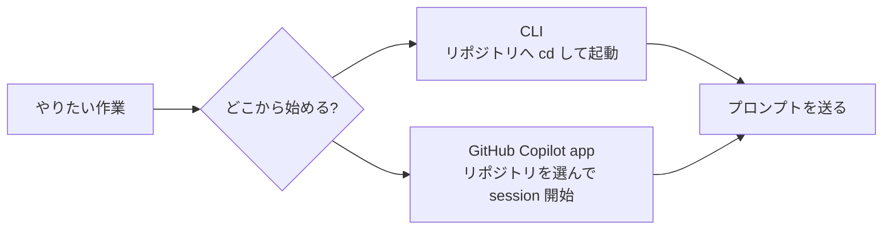

## はじめに

2026 年 5 月 14 日に、GitHub Copilot app が technical preview として案内されました。

- [GitHub Copilot app is now available in technical preview - GitHub Changelog](https://github.blog/changelog/2026-05-14-github-copilot-app-is-now-available-in-technical-preview/)
- [About the GitHub Copilot app - GitHub Docs](https://docs.github.com/en/copilot/concepts/agents/github-copilot-app)

公式ドキュメントでは、GitHub Copilot app は **GitHub ネイティブなデスクトップアプリ**として説明されています。GitHub Copilot CLI を土台にしつつ、複数のセッション、Issue / Pull Request、レビュー、ワークフローを 1 つの場所で扱えるのが特徴です。🧭

私はこれまで GitHub Copilot CLI をかなり気に入って使ってきました。実際、ターミナルからそのまま流れをつなげたい場面では、今でも CLI が強いと感じています。

- [次の大きな作業は GitHub Copilot CLI から始めたくなる理由](https://zenn.dev/tomokusaba/articles/051dd7f79c1791)
- [GitHub Copilot CLI で考える複数エージェント設計](https://zenn.dev/tomokusaba/articles/a599cb645ca2c5)

そのうえで、GitHub Copilot app を触ってみると、**コードを書く前の迷い** や **複数の作業をさばくときの摩擦** がかなり減ると感じました。いま常用の道具としてどちらを開きたいかと聞かれたら、私は GitHub Copilot app を選びたくなっています。

今回とくに書きたいのは、次の 4 点です。

- 複数リポジトリを同時に触るときの認知負荷が下がる
- 作業の入口が「ディレクトリ」ではなく「リポジトリとセッション」になる
- 定型的な作業を workflow にして呼び出せる
- 日本語入力時の引っかかりを気にしにくい

:::message
本記事は「CLI より app が常に上」という話ではありません。どちらも使います。そのうえで、日々の認知負荷や作業の入口という観点では、app がかなり効くと感じたポイントを整理します。
:::

## まず公式には何が発表されたのか

Changelog では、GitHub Copilot app は次の 3 つの軸で紹介されています。

| 公式の軸 | 内容 | 私が特に効いたと感じた点 |
|------|------|--------------------------|
| 🧭 Start from GitHub context | Issue、Pull Request、既存セッションなど GitHub 上の文脈から始められる | 「どのリポジトリで始めるか」が整理される |
| ⚡ Work in focused sessions | セッションごとに branch、files、conversation、task state が分かれる | 複数作業を同時に進めても散らかりにくい |
| ✅ Steer, validate, and ship in one place | 差分確認、レビュー、コマンド実行、PR 作成まで 1 か所で扱える | コンソール、IDE、ブラウザの往復が減る |

加えて GitHub Docs では、**parallel workspaces**、**session modes**、**scheduled workflows** も主要機能として整理されています。

この中で、私が「これは日常の作業が変わるな」と感じたのは、派手な自律実行そのものよりも、**普段の作業を整理する足場** の部分でした。

ここからは、私の日常的な使い方の中でとくに効いた 4 点を順に書いていきます。

## 1. 複数リポジトリを同時に触るときの認知負荷がかなり下がる

CLI を複数のリポジトリで使うとき、私はときどき「今どのコンソールでどの作業をしていたか」で軽く迷います。

もちろん、ターミナルのタイトルを変えたり、タブを整理したり、tmux や Windows Terminal の運用を工夫すれば改善できます。それでも、複数のリポジトリ、複数のブランチ、複数のタスクが同時に走り始めると、地味に認知負荷が高いです。

GitHub Docs では、セッションは **repository ごとに grouped** され、各セッションは独立した workspace として動くと説明されています。実際に触ると、**「今どの作業空間にいるか」** が視覚的にかなり分かりやすいです。

| 観点 | CLI 中心で感じやすいこと | GitHub Copilot app で感じたこと |
|------|--------------------------|----------------------------------|
| 🖥️ 作業の見え方 | 複数コンソールが並ぶ | 1 つのアプリ内で repository / session 単位に見える |
| 🌿 文脈の切り替え | カレントディレクトリやブランチを意識する | セッションを開くと文脈がまとまって見える |
| 🧠 認知負荷 | 「こっちのターミナルは何用だっけ？」が起きやすい | 迷いがかなり減る |

特に、Issue を見て、別のリポジトリの PR も気にしつつ、手元ではもう 1 本別件を進めるような日には、この差が効きます。

私は CLI の「ターミナルから全部進められる感じ」が好きです。ただ、**同時並行の整理** という意味では、app のほうがデフォルトで構造化されているぶん、とてもやりやすいと感じました。🗂️

## 2. 作業の入口が「ディレクトリ」ではなく「リポジトリとセッション」になる

GitHub Copilot CLI を使うときは、当然ですが **どのディレクトリで起動するか** が大事です。

これは CLI の自然な設計ですし、悪いことではありません。ただ、日々複数のリポジトリを行き来していると、

- いまどのディレクトリにいるか
- その場所で本当に Copilot を起動してよいか
- 別のリポジトリで始めるつもりではなかったか

を、起動前に頭の中で確認する必要があります。

一方、GitHub Copilot app の getting started では、onboarding 時や、後からリポジトリを接続して新しい session を作るときは **repository を選んでから始める** 流れになっています。私にとってこれは、かなり大きな違いでした。



CLI では「まず正しい場所に移動する」が先にあります。app では「どのリポジトリで作業するかを選ぶ」が先にあります。

この違いは小さく見えて、実際には **作業開始までの迷い** を減らしてくれます。とくに、普段から登録しているリポジトリ群の中で仕事を切り替えるような使い方では、かなり相性がよいと感じました。🚀

## 3. 定型的な作業は workflow にして呼び出せる

これもかなり便利でした。

GitHub Docs の scheduled workflows では、**recurring agent tasks を保存し、スケジュール実行または手動実行できる** と説明されています。私はここにかなり価値を感じています。

定型的な作業では、毎回ほぼ同じプロンプトを書きたくなることがあります。たとえば、

- 毎朝 open PR の状態を見て、レビュー待ちと CI 失敗を整理する
- 依存関係の更新候補を見て、影響範囲をざっくりまとめる
- リポジトリの issue を分類して、次に着手しやすいものを洗い出す

といった作業です。

こういうとき、毎回プロンプトを打ち直すより、workflow として保存しておけるとかなり楽です。たとえば次のような依頼です。

```text
このリポジトリの open pull request を確認し、
レビュー待ち、CI 失敗、merge conflict の有無を整理してください。
それぞれについて次のアクションを 1 行ずつ提案してください。
```

単に入力の手間が減るだけではありません。**プロンプトそのものを固定資産にできる** のがよいところです。

一度よい形に整えた依頼を workflow 名つきで保存しておけば、出力の粒度もぶれにくくなります。個人的には、これは「便利なショートカット」というより、**定型作業の品質をそろえる仕組み** に近いと感じています。🔁

## 4. 日本語入力中のカーソル飛びを気にしなくてよくなった

これは完全に私の体験ベースの話です。

GitHub Copilot CLI をコンソールで使っていると、日本語入力のたびにカーソルが意図しない位置に飛んでしまいます。日本語で少し長めのプロンプトを書いていると、思考の流れがそのたびに切れてしまいます。

これは私の環境では常に発生します。**「これから作業を依頼する」** まさに入口で入力体験が安定しないため、小さくても確実にストレスになります。

GitHub Copilot app はデスクトップアプリなので、少なくとも私の環境ではこの種の引っかかりをほとんど感じませんでした。プロンプト欄でそのまま日本語を書き、少し表現を練り直して送る、という流れが素直です。

:::message
ここで書いている日本語入力のカーソル問題は、公式の機能差ではなく、あくまで私の利用環境で感じていた体験差です。
:::

エージェント系のツールでは、最初の依頼の質がかなり大事です。だからこそ、**入力そのものに余計な神経を使わなくてよい** というのは、見た目以上に大きいと感じています。⌨️

## 常用の道具としては app を選びたくなった

ここまで app のよかった点を中心に書いてきましたが、CLI を使わなくなったわけではありません。

ただ、今の私の感覚では、**まず最初に開く常用の道具** としては GitHub Copilot app にかなり傾いています。ざっくり整理すると、次のような使い分けです。

| 場面 | どちらを先に開きたくなるか | 理由 |
|------|----------------------------|------|
| 🌞 その日の作業を整理して始めたい | GitHub Copilot app | repository / session / workflow を 1 か所で見渡しやすい |
| 🐚 すでにターミナルで作業中 | GitHub Copilot CLI | そのまま同じ場所で流れを続けやすい |
| 🗂️ 複数リポジトリ / 複数 task を整理したい | GitHub Copilot app | 文脈を 1 か所で持ちやすい |
| 🔁 定型的な巡回作業を回したい | GitHub Copilot app | workflow として固定しやすい |
| 🛰️ SSH 先や一時環境で動きたい | GitHub Copilot CLI | ターミナル前提の機動力が高い |

つまり、私にとって GitHub Copilot app は **常用の入口として選びやすい道具** になってきました。CLI の価値が消えたわけではありませんが、今は **普段の起点は app、CLI は必要な場面で使う道具** という見え方に変わっています。

## おわりに

GitHub Copilot app の technical preview を触ってみて、私が最初に「よい」と感じたのは、派手な機能よりもむしろ次の 4 点でした。

- 複数リポジトリを同時に扱っても散らかりにくい
- 入口がディレクトリではなくリポジトリ / session になる
- 定型作業を workflow にして固定できる
- 日本語入力時の引っかかりを気にしにくい

どれも、1 つずつ見ると小さな差かもしれません。

ですが、日々の作業ではこうした小さな摩擦が積み重なります。GitHub Copilot app は、その摩擦を減らして **作業に入るまで** と **複数作業をさばくとき** をかなり整えてくれると感じました。

CLI が好きな人ほど、この差は分かりやすいかもしれません。もし普段 GitHub Copilot CLI を使っていて、複数コンソールの整理や定型プロンプトの扱い、起動場所の迷いに少しでも引っかかりがあるなら、GitHub Copilot app はかなり試す価値があります。

今、常用の道具としてどちらか 1 つを選ぶなら、私は GitHub Copilot app を選びたいです。🧭

## 参考リンク

- [GitHub Copilot app is now available in technical preview - GitHub Changelog](https://github.blog/changelog/2026-05-14-github-copilot-app-is-now-available-in-technical-preview/)
- [About the GitHub Copilot app - GitHub Docs](https://docs.github.com/en/copilot/concepts/agents/github-copilot-app)
- [Getting started with the GitHub Copilot app - GitHub Docs](https://docs.github.com/en/copilot/how-tos/github-copilot-app/getting-started)
- [Working with agent sessions in the GitHub Copilot app - GitHub Docs](https://docs.github.com/en/copilot/how-tos/github-copilot-app/agent-sessions)
- [Using scheduled workflows in the GitHub Copilot app - GitHub Docs](https://docs.github.com/en/copilot/how-tos/github-copilot-app/using-scheduled-workflows)
